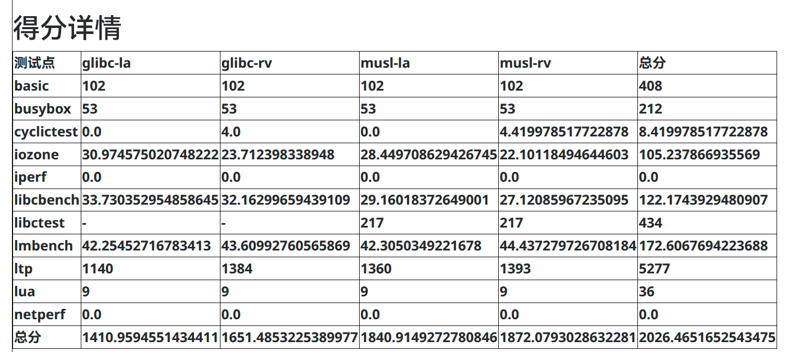

# ShellCore


## 简介

`ShellCore`是由三位队员基于[2025春夏季开源操作系统训练营 rCore-Tutorial-v3 ch7](https://github.com/rcore-os/rCore-Tutorial-v3/tree/ch7)逐步开发而来的操作系统内核。

本项目自2026年1月创建以来，经5个月累计700+commits的迭代，已有较为完善的各项管理功能和POSIX语义兼容。目前我们正积极完成Linux特性的进一步适配和网络栈/多核同步机制的优化。

项目成员:
- 唐博文：3556495919@qq.com
- 冯孟熙：fmxi666@outlook.com
- 高铭均：1273938538@qq.com

现有特性：
- **基本结构**：低耦合兼容loongarch/riscv，SMP（对称多处理器）结构
- **进程管理**：多级反馈队列，COW（写时复制），完整信号处理
- **内存管理**：可变页大小（4K/2M/1G），带回写的mmap共享文件映射，类 Linux 页缓存（尽量将空闲内存用作缓存，内存不足时 LRU 回收），栈动态扩张（懒分配）
- **文件系统**：ext4（extent）完整读写支持，VFS 抽象层，tmpfs/procfs/devfs 等虚拟文件系统，FIFO/管道/epoll，页缓存 + 块缓存 两级缓存结构
- **IO管理**：基于 virtio-blk/virtio-net 驱动，块缓存支持，支持 PCI 总线扫描与 DMA 配置
- **Linux兼容**：160+系统调用，错误码规范返回，System V IPC（消息队列/共享内存）
- **网络栈初步实现**

测试平台中的测评分数如下：



详细描述见[参赛文档](#参赛文档)

## 参赛文档

初赛阶段的项目介绍可以在[初赛文档](docs/初赛文档.md)查看。

除commit记录外，[docs](docs/)目录下还有[初赛阶段日志](docs/初赛阶段日志.md)，其记录了本项目2026年1月至5月的开发过程。

## 使用说明

通过

```sh
INIT=sh make test-rv
```

和

```sh
INIT=sh make test-la
```

分别可编译riscv和loongarch版的用户程序及内核，并通过qemu启动。

上述参数下，我们的内核会挂载`sdcard-*.img`镜像（仅支持ext4）为`/`，[初始化程序_shell](user/src/bin/initproc_sh.rs)会启动镜像中的busybox shell。

我们要求镜像中有busybox位于`/musl/busybox`，并将动态链接库/链接器分别放置到`/musl/lib`和`/glibc/lib`，我们的内核**需要**初赛镜像中的**包括但不限于这些文件**才能正确初始化根目录环境。

---

而去掉`INIT`设置后，将会按默认设置运行我们在[默认初始化程序](user/src/bin/initproc.rs)中设置好的初赛测评:

```sh
make test-rv
```

```sh
make test-la
```

此外，可以通过如下变量调整编译设置：

```makefile
# rv核心数
RV_SMP ?= 1
# la核心数
LA_SMP ?= 1
# 日志等级: ERROR, WARN, INFO, DEBUG, TRACE, OFF
LOG ?= OFF
# 初始化程序：default, sh, ltp，分别会运行全量测试，busybox shell，ltp特定测试
INIT ?= default
```

通过合适的启动参数，并修改[初始化程序源码](/home/asta/_2026os/user/src/bin)中编码的脚本字符串，可以在运行`make test-*`时运行其他程序。

---

此外分别可以通过

```sh
make debug-rv

make debug-la

make gdb-rv

make gdb-la
```

启动调试/gdb连接。需要先运行`make debug-*`再运行`make gdb-*`。