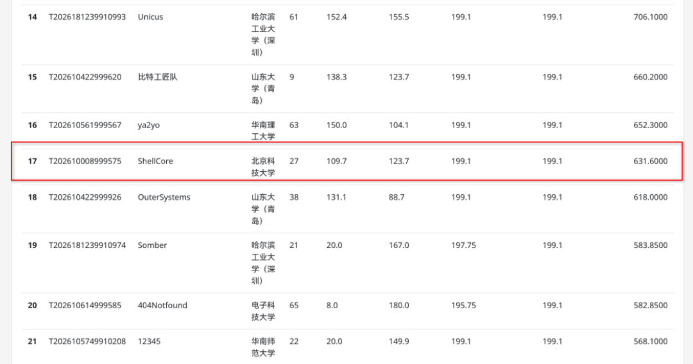

# ShellCore


## 简介

`ShellCore` 是由三位队员基于 [2025 春夏季开源操作系统训练营 rCore-Tutorial-v3 ch7](https://github.com/rcore-os/rCore-Tutorial-v3/tree/ch7) 逐步开发而来的 SMP 架构操作系统内核。项目得名于"北科"的谐音"贝壳"：`core` 既指操作系统内核，与 `shell` 结合又有"珍珠"之美。

本项目自 2026 年 1 月创建以来，历经 7 个月、900+ commits 的迭代，已具备较为完善的管理功能与 POSIX 语义兼容性，并在多核并发的正确性保证与性能优化上取得了较好的成果。

关于**决赛的阶段性成果**：截至 8 月 16 日，我们在决赛线上赛的成绩如下：




现有特性与测评情况详见[参赛文档](#参赛文档)章节。

项目成员：
- 唐博文：3556495919@qq.com
- 冯孟熙：fmxi666@outlook.com
- 高铭均：1273938538@qq.com

## 参赛文档

决赛文档位于[决赛文档](docs/ShellCore决赛文档.pdf)；
线上决赛 BuildStorm 的文档位于[调优文档](docs/调优文档.pdf)。

### 历史文档

初赛阶段的项目介绍可以在[初赛文档](docs/ShellCore初赛文档.pdf)查看。

[决赛阶段性介绍](#决赛阶段性介绍)大致描述了已有的进展，[这里](docs/rv测试结果)则展示了部分调优成果日志，可结合 commit 记录与[决赛日志](docs/决赛日志.md)查看。

除 commit 记录外，[docs](docs/) 目录下还有[初赛阶段日志](docs/初赛阶段日志.md)和[决赛阶段日志](docs/决赛日志.md)，记录了本项目 2026 年 1 月至 8 月的开发过程。


## 决赛阶段性介绍

项目仓库结构如下：

```
.
├── Makefile                      # 顶层构建入口：make test-rv / test-la / debug-* 等
├── os/                           # 内核主体（RISC-V 与 LoongArch 双架构）
│   ├── src/
│   │   ├── arch/                 # 架构相关代码（riscv/、la/）
│   │   ├── drivers/              # 磁盘、网络、串口等设备驱动
│   │   ├── ext4fs/               # ext4 文件系统实现
│   │   ├── fs/                   # 文件系统抽象、页缓存与块缓存
│   │   ├── mm/                   # 内存管理：地址空间、页表、RCU 等
│   │   ├── process/              # 线程组 / 进程模型与调度器
│   │   ├── sync/                 # 锁、等待队列等同步原语
│   │   ├── ipc/                  # 进程间通信
│   │   ├── net/                  # 网络协议栈
│   │   ├── syscall/              # 系统调用层
│   │   ├── auth/                 # 权限与用户身份
│   │   └── ...
│   ├── build.rs
│   └── Cargo.toml
├── user/                         # 用户态程序与初始化程序
│   ├── src/bin/                  # initproc 等二进制
│   ├── user-la/                  # LoongArch 用户程序
│   └── user-rv/                  # RISC-V 用户程序
├── boot/                         # uImage 打包脚本、busybox 等启动相关内容
├── toolkits/                     # 开发板烧写、测评镜像制作等工具
├── benchmarks/                   # 性能基准与对比测试（mmbench、sysbench、iozone 等）
├── docs/                         # 参赛文档、日志与测试结果
├── ref/                          # 参考资料（Linux 6.18 源码、龙芯手册）
├── sdcard-rv.img / sdcard-la.img # 构建产物：ext4 根文件系统镜像
├── kernel-la                     # 构建产物：LoongArch 内核镜像
├── inst                          # 板卡调试命令备忘
└── ...
```

相较于初赛阶段（基于 rCore），我们的内核新增/优化了以下特性：

1. 完善的多核并行处理支持，通过锁与原子变量结合各类边界情况约束，保证多核并行的正确性。
2. 具备 COW 语义的 **exec 按需加载与代码段零拷贝**，支持懒分配与完整的 page fault 处理。
3. 地址空间翻译的 **pin 机制**，以及内存管理模型的初步 **RCU 语义**。
4. futex、epoll、ppoll 基于等待队列实现真正阻塞，替代了初赛阶段“睡眠轮询”的过渡语义。
5. **内核工作线程**：将磁盘回写、软件计时器 tick、网络 poll 等周期性工作交由独立的内核工作线程执行，不再占用普通用户进程的 trap 流程。
6. 合并页缓存与块缓存管理，减少磁盘访问的一次拷贝；用更快的**近似 LRU** 替换原有 LRU 算法。
7. 彻底重构 pcb + tcb 的进程线程模型：参考 Linux 的线程模型，删除 pcb 包装，任务通过`线程组`组织为`进程`，跨线程共享的资源以`Arc`管理，并在 clone 时依据 flags 参数决定保留的资源与新旧任务关系。
8. 完整的类 Linux 多队列调度，含 CFS、FIFO 等调度类型，并实现基于“主动任务窃取”和“任务唤醒时优先选择空闲核 + IPI 休眠唤醒”的**负载均衡**模型。
9. 基于核间 IPI 的 **TLB 跨核刷新与按需刷新**。RISC-V 实现用户态共享内核页表：将内核映射至高半地址空间，用户页表除映射用户页外，还通过复制内核高半根页表引用内核页表，以减少 satp 切换及相应的 TLB 刷新开销。
10. 细化各类锁的粒度，实现写者优先（区别于`spin`库的写者不公平策略）的读写锁`RwLock`，并广泛用于页缓存、内存管理结构等读多写少路径，替换原有的`Mutex`。
11. 完成 ext4fs 的多线程并发安全适配与元数据校验码更新。

此外，我们已完成对龙芯和 RISC-V 两款开发板的适配，实现了磁盘与网络驱动，在两款板卡上**成功启动 busybox shell**，并**通过了大部分初赛测例**。特别地，我们研究并解决了龙芯开发板上与 qemu 行为不同的 ALE 问题。

## 使用说明

通过

```sh
RV_SMP=8 INIT=sh make test-rv
```

和

```sh
LA_SMP=12 INIT=sh make test-la
```

可分别编译 RISC-V 与 LoongArch 版本的用户程序及内核，并通过 QEMU 启动。

在上述参数下，内核会将 `sdcard-*.img` 镜像（仅支持 ext4）挂载为 `/`，[初始化程序_shell](user/src/bin/initproc_sh.rs) 会优先启动镜像中的 `/bin/bash` 作为终端；找不到时，则回退到镜像中的 `/musl/busybox sh`。

内核**要求**镜像中的文件目录结构——尤其是 bash、动态链接器（库）的位置——**符合初赛/决赛镜像的结构**，才能正确初始化根目录环境。

---

去掉 `INIT` 设置后，将按默认设置运行[默认初始化程序](user/src/bin/initproc.rs)中配置的**决赛**测评：

```sh
RV_SMP=8 make test-rv
```

```sh
LA_SMP=12 make test-la
```

此外，可以通过如下变量调整编译设置：

```makefile
# rv核心数
RV_SMP ?= 1
# la核心数
LA_SMP ?= 1
# 日志等级：ERROR、WARN、INFO、DEBUG、TRACE、OFF
LOG ?= OFF
# 初始化程序：default、sh、ltp 等，分别会运行全量测试、busybox shell、ltp 特定测试等
INIT ?= default
```

通过合适的启动参数，并修改[初始化程序源码](/home/asta/_2026os/user/src/bin)中编码的脚本字符串，即可在 `make test-*` 时运行其他程序。

---

此外，还可以通过以下命令启动调试或连接 gdb（需根据实际情况调整参数）：

```sh
make debug-rv

make debug-la

make gdb-rv

make gdb-la
```

注意需要先运行 `make debug-*`，再运行 `make gdb-*`。