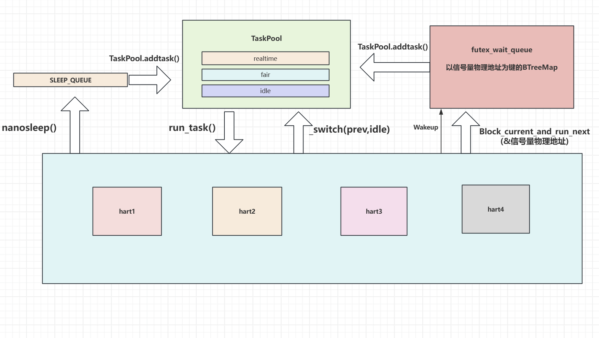
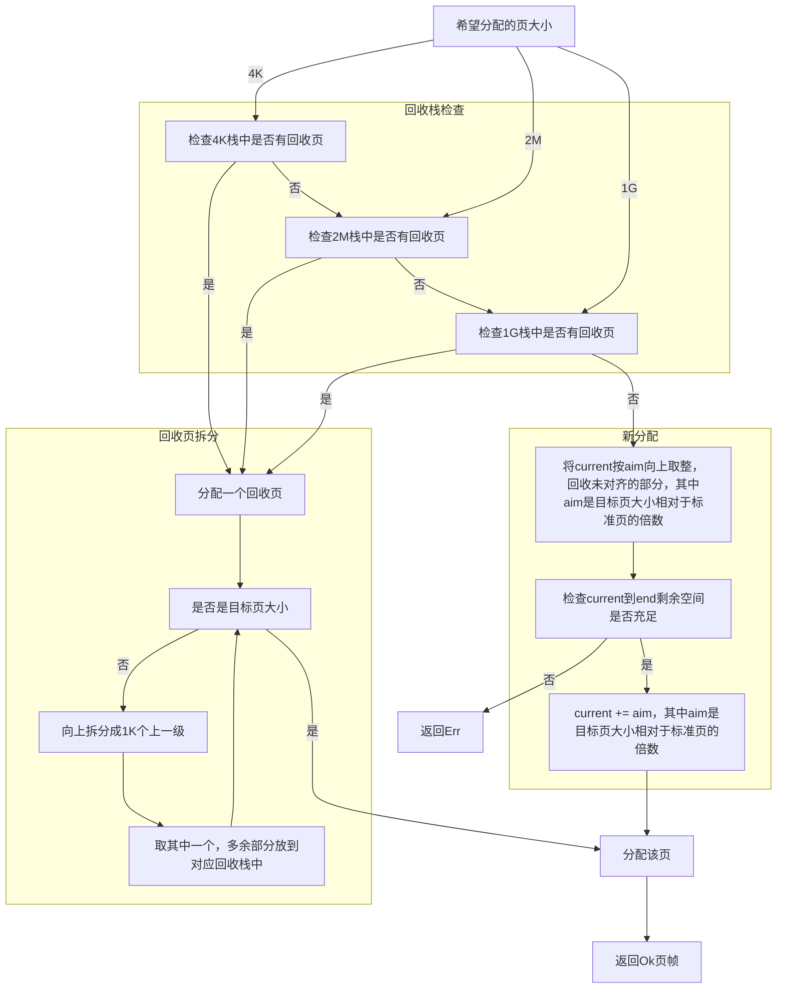

# 初赛文档
- [初赛文档](#初赛文档)
  - [1. 概述](#1概述)
  - [2. ShellCore 设计与实现](#2-ShellCore-设计与实现)
    - [2.0 常规设计](#20-常规设计)
    - [2.1 进程管理](#21-进程管理)
            - [数据结构](#数据结构)
            - [线程状态](#线程状态)
            - [调度策略](#调度策略)
            - [COW相关](#cow相关)
            - [重要系统调用](#重要系统调用)
    - [2.2 内存管理](#22-内存管理)
            - [基本数据结构](#基本数据结构)
            - [初始化与地址空间布局](#初始化与地址空间布局)
            - [物理页分配](#物理页分配)
            - [地址翻译](#地址翻译)
            - [mmap与文件页缓存管理](#mmap与文件页缓存管理)
            - [PageFault处理](#pagefault处理)
            - [地址空间隔离与权限检查](#地址空间隔离与权限检查)
    - [2.3 文件系统](#23-文件系统)
    - [2.4 IO系统](#24-IO管理)
    - [2.5 Linux语义兼容](#25-Linux语义兼容)
            - [信号处理](#信号处理)
            - [errno设置](#errno设置)
  - [3. 调试过程](#3-调试过程)
  - [4. AI使用](#4-ai使用)
  - [5. 总结与展望](#5-总结与展望)
  - [6. 参考资料](#6-参考资料)

## 1.概述
`ShellCore`是使用Rust语言基于[2025春夏季开源操作系统训练营 rCore 项目](https://github.com/LearningOS/rust-based-os-comp2025/blob/main/2025-spring-summary.md)的ch7逐步开发而来的操作系统内核。本项目支持RISCV-V/Loongarch两个架构，兼容POSIX协议。支持多核，按照SMP（Symmetrical Multi-Processing，对称多处理器）结构设计。


队员来自北京科技大学，初始阶段的成员及分工如下：
- 唐博文：内存管理COW，文件系统ext4初始架构，进程/线程管理
- 冯孟熙：龙芯架构兼容，SMP初始框架，内存管理与文件系统完善

## 2-ShellCore-设计与实现
### 20-常规设计
1. 项目结构
    os。。src。。arch。。
2. 启动流程：
    - 启动核（主核）执行`_start`，按照规则设置`sp`到自己的启动栈顶，并保存`hart_id`到```tp```寄存器，随后跳转到`rust_main()`
    - 主核继续跳转到`main_init()`，完成内存等的初始化，随即唤醒非启动核（副核）
    - 随后，副核也执行上述流程，但只执行本核特有初始化
    - 初始化完成后，多核分别调用`run_tasks()`，即idle执行流
    - 特别地：
        - Loongarch：使用映射窗口，内核态总是不使用页表。启动前由于物理地址位数低，内核elf的高位被截断，在物理地址启动时设置映射窗口随后打开虚拟地址，此时地址被扩展到64位，内核elf的高位地址恢复，使内核落在映射窗口中
        - 多核唤醒：RV使用了sbi_call，Loongarch参考了[2025RocketOS](https://gitlab.eduxiji.net/educg-group-36002-2710490/T202510213995926-2475)的IPC的多核唤醒
        - 尽管在称谓上有`主核`与`副核`的区分，但只在启动流程上有区别，初始化完成后二者的地位是完全等同的
3. 异常处理：
    - 进入trap_handler()前参考rCore，但针对多核和龙芯有一些修改
    - 根据异常寄存器分配异常：
        - 系统调用：处理系统调用
        - 缺页异常：user_fault
        - 访址异常：是否是栈过小-->是否是COW？-->返回
        - 时间片轮转：切换保存任务上下文切换到run_tasks()流
    - 信号处理
    - 返回用户态
### 21-进程管理
#### 数据结构
我们使用 `ProcessControlBlock`(PCB) 和 `TaskControlBlock`(TCB) 分别管理进程和线程， PCB 中包含一个 TCB 向量用来存放一个进程的所有线程:
- 以下是PCB和TCB的定义
```rust
// PCB
pub struct ProcessControlBlock {
    //pid
    pub pid: Arc<PidHandle>,
    //Out of memory机制分数，但未实现
    pub oom_score_adj: AtomicI32,
    //命名空间，同一命名空间的进程组才进行通信
    pub ns_proxy: NsProxy,
    pub inner: MPSafeCell<ProcessControlBlockInner>,
}

// PCBinner
pub struct ProcessControlBlockInner {
    // 进程是否在主核运行，initproc和shell默认在主核运行
    pub on_main_hart: bool,
    // 进程名字，通常是exec时的名字，方便调试
    pub pname: String,

    /// Application data can only appear in areas
    /// where the application address space is lower than base_size
    pub base_size: usize,

    /// Application address space
    pub memory_set: MemorySet,

    /// Parent process of the current process.
    /// Weak will not affect the reference count of the parent
    pub parent: Option<Weak<ProcessControlBlock>>,

    /// 子进程，计数引用
    pub children: Vec<Arc<ProcessControlBlock>>,

    /// 堆底位置
    pub heap_bottom: usize,

    /// 堆索引
    pub program_brk: usize,

    /// 文件描述符的当前限制与最大限制
    pub fd_rlmt: Rlimit64,

    /// 文件描述符表
    pub fd_table: Vec<FileDescriptor>,
    
    pub cwd: Arc<Dentry>, // 当前工作目录

    // 进程收到的信号
    pub signals: SignalFlags,

    // Signal actions（记录用户侧的用户信号处理地址空间函数地址，其实就是用户注册的信号结构体）
    pub signal_actions: SignalActions,

    pub exit_code: i32, // 进程退出码，默认为0，只有当进程状态为Zombie时才有意义

    pub ruid: u32,  // 用户 ID
    pub gid: u32,  // 用户组 ID
    pub euid: u32, // 有效用户 ID
    pub egid: u32, // 有效用户组 ID
    pub sgid: u32, // 辅助用户组 ID
    pub umask: u32, // 文件模式创建掩码

    pub sid: usize,
    pub pgid: usize, // 进程组 ID
    
    pub max_file_size: usize, // 进程可创建的最大文件大小，单位为字节，默认为 usize::MAX
    // 进程下的线程数
    pub tasks: Vec<Arc<TaskControlBlock>>, 
    // 存活进程数，等于0相当于僵尸进程
    pub alive_task_count: isize,
    // 专用于syscall92的personality
    pub personality: usize,
    // MAP_LOCKED 锁定的内存字节数（用于 /proc/self/status VmLck 字段）
    pub locked_bytes: usize,

    /// Approximate process start timestamp in microseconds since boot.
    pub start_time_us: usize,
}

/// TCB
pub struct TaskControlBlock {
    // Immutable
    /// 线程所属进程
    /// 让线程拥有对进程的弱引用，便于调用进程的方法
    /// 不能用arc否则循环引用
    pub process: Weak<ProcessControlBlock>,

    /// 线程id
    pub tid: Arc<TIdHandle>,

    /// Thread group id. Linux getpid() returns this id, while gettid() returns tid.
    pub tgid: usize,

    /// Kernel stack corresponding to PID
    pub kernel_stack: KernelStack,

    /// Mutable
    pub inner: MPSafeCell<TaskControlBlockInner>,
}

/// TCBinner
pub struct TaskControlBlockInner {

    /// 异常上下文地址
    pub trap_cx_addr: usize,

    /// 任务上下文地址
    pub task_cx: TaskContext,

    /// Maintain the execution status of the current process
    pub task_status: TaskStatus,

    /// 当前由哪个 hart 持有运行所有权；None 表示可被调度领取。
    pub owner_hart: Option<usize>,

    // 调度优先级与调度策略
    pub sched_policy: isize,
    pub sched_priority: i32,

    /// It is set when active exit or execution error occurs
    pub exit_code: i32,
    pub errno: i32,
    pub signals: SignalFlags,
    pub signal_interrupted: bool,
    pub signal_mask: SignalFlags,
    /// 信号嵌套处理时的掩码栈（当前未完全验证行为是否正确，初步测试没问题）
    pub signal_mask_backup: Vec<SignalFlags>,
    // if the task is killed
    pub killed: bool,
    pub term_signal: Option<i32>,
    // if the task is frozen by a signal
    pub frozen: bool,
    /// 信号嵌套处理时的上下文栈（当前未完全验证行为是否正确，初步测试没问题）
    pub trap_ctx_backup: Vec<TrapContext>,

    /// 用户态 signal frame 中 ucontext 的地址，用于 sigreturn 读取用户修改后的上下文。
    pub signal_user_context_backup: Vec<usize>,

    pub clear_child_tid: usize,// 线程清理指针
}
```
#### 线程状态
UnInit：开发前使用，实则未使用

Ready：就绪态

Running：运行态

Blocked：阻塞态

Zombie：僵尸态

BlockSaving：等待保存态
1. Ready态：初始被fork出来时以及时间片用完后
2. Running：运行态
3. Blocked：阻塞态（目前应用于nanosleep的睡眠队列，以及futex的阻塞队列）
4. BlockSaving：由于阻塞态开发时是先入队再保存上下文，这时候如果多核环境唤醒这个队列，上下文未保存的线程会被调度，出现问题。但由于阻塞队列又不是全局唯一一个队列，无法做到像时间片轮转队列的单独队列的情况，所以暂存了这个状态。
#### 调度策略

进程切换执行流：current_task---->run_task()---->next_task

```TaskPool```：

    为了满足调度语义需求，调度策略有以下这些：
    ```rust
    pub const SCHED_OTHER: isize = 0;
    pub const SCHED_FIFO: isize = 1;
    pub const SCHED_RR: isize = 2;
    pub const SCHED_BATCH: isize = 3;
    pub const SCHED_IDLE: isize = 5;
    ```
    全局调度队列
    ```rust
    pub struct TaskPool {
        deadline: BinaryHeap<PoolEntry>,
        realtime: BinaryHeap<PoolEntry>,
        fair: BinaryHeap<PoolEntry>,
        idle: BinaryHeap<PoolEntry>,
        enqueue_order: usize,
    }
    ```
对于调度策略为FIFO和RR，其会进入实时调度队列，即realtime；对于调度策略为其它的则会进入fair队列；对于初始进程则会进入IDLE队列；调度器由``堆``实现，其比较的索引是```优先级以及入队顺序```；调度时从deadline->realtime->fair->idle开始选择任务执行；在run_task()中，当任务数量较少时，会向TaskPool中fetch_task()；根据任务优先级以及调度策略分配时间片：
    ```rust
    const DEFAULT_TIME_SLICE_MS: usize = 10;
    const FIFO_TIME_SLICE_MS: usize = 50;//防止恶意程序或卡死行为崩溃内核，给FIFO一个大时间片
    const RR_TIME_SLICE_MS: usize = 1;
    const IDLE_TIME_SLICE_MS: usize = 20;
    ```

- ```sleep_queue```:

    睡眠队列专用于nanosleep，在每次进入run_tasks()时更新时间戳，到达时间的则插入TaskPool
- ```futex_wait_queue```:

    以信号量物理地址为键的BTreeMap，wake时将任务插入TaskPool
#### COW相关
使用以下数据结构来描述指定物理页帧的引用数，键为物理页框号，值为引用数。
```rust
 static ref FRAME_REF_COUNTS: MPSafeCell<BTreeMap<usize, usize>> = MPSafeCell::new(BTreeMap::new());
```
物理页帧在释放时会将其计数减1，当计数为0时真正drop
```rust
impl Drop for FrameTracker {
    fn drop(&mut self) {
        let remain = frame_release_ref(self.ppn);
        if remain == 0 {
            // 按页大小释放
            frame_dealloc_raw(self.ppn, self.page_size);
        }
    }
}
```
fork会将父进程的页表的可写位抹去，同时子进程也没有可写位。
```rust
    //...clone Memory_set
    let writable_cow = map_perm.contains(MapPermission::W) && !is_shared;
    let child_perm = if writable_cow {
        map_perm & !MapPermission::W
        } else {
            map_perm
        };
        let child_flags = PTEFlags::from_bits(child_perm.bits).unwrap();
        memory_set.page_table.map(vpn, src_pte.ppn(), child_flags, page_size);
        new_area.data_frames.insert(vpn, FrameTracker::from_ppn(src_pte.ppn(), page_size));
        if writable_cow {
            let parent_perm = map_perm & !MapPermission::W;
            let parent_flags = PTEFlags::from_bits(parent_perm.bits).unwrap();
            user_space.page_table.set_flags(vpn, parent_flags, page_size);
        }
    //...
```
运行后，父子进程若要写某一页触发了访址/写入异常，```trap_handler()```会调用**Memory_set**类的```handle_cow_fault()```方法，这会复制```一整个逻辑段```的数据并覆盖原逻辑段

#### 重要系统调用
- fork/clone：
    - 判断参数然后选择创建进程或线程

    ```mermaid
    flowchart TD
        A[进入clone，参数检查]
        B[创建线程]
        C[创建进程]
        B1[分配用户栈，内核栈，初始堆底，堆顶,创建MemorySet]
        B2[设置上下文，设置TCB字段]
        R[返回]
        C1[新建Memory_set，将已有逻辑段标记为不可写，但COW设为1]
        C2[分配用户栈，内核栈等]
        C3[设置命名空间，父进程等]
        C4[根据参数选择继承父进程的字段，如文件描述符等]
        C5[新建PCB，与初始TCB]
        A--创建线程-->B
        A--创建进程-->C
        B--根据参数-->B1
        B1-->B2-->R
        C-->C1-->C2-->C3-->C4-->C5-->R
    ```
- exec：
    - **堆栈位置具体见内存管理章节**
    ```mermaid
    flowchart TD
        A[参数检查]
        B[查找文件并判断是否可执行]
        C[elf转换，修改进程Memory_set]
        D[分配栈，内核栈，堆]
        E[修改上下文]
        F[插入就绪队列]
        A-->B-->C-->D-->E-->F
    ```
- wait:
    - 由于开发时内核尚不完善，保留了忙等待形式，后续完善为等待队列

    ```mermaid
    flowchart TD
        check[参数检查]
        scan[遍历子进程]
        has_child[存在子进程]
        no_child[不存在子进程]
        zombie[存在子进程且为zombie态]
        recycle[回收子进程资源]
        alive_child[存在子进程但不是zombie态]
        ret[返回,根据状态返回不同的errno]
        retry[切到就绪态,循环]

        check --> scan
        scan -- 是 --> has_child
        scan -- 否 --> no_child --> ret
        has_child --> zombie --> recycle --> ret
        has_child --> alive_child --> retry
        retry --> has_child
    ```
### 22-内存管理

除基本的分页/地址空间隔离外，我们的内存管理还支持：

- 可变页大小（大页支持）
- 共享映射与文件页缓存
- 动态栈扩张（懒分配）
- COW（详见进程管理章节）

#### 基本数据结构

在PCB中，我们用`MemorySet`管理进程的虚拟内存空间，其中用`MapArea`管理内存段。

`MemorySet`和`MapArea`的定义如下：

```rust
/// address space
/// 注意维护brk_index
pub struct MemorySet {
    page_table: PageTable,
    asid: ASIDHandle,
    pub areas: Vec<MapArea>,
    brk_index: usize, //新增，用于记录brk所在area（堆区）的索引，请注意维护，后续可能会删除
}
```

```rust
/// map area structure, controls a contiguous piece of virtual memory
pub struct MapArea {
    pub vpn_range: VPNRange,
    data_frames: BTreeMap<VirtPageNum, FrameTracker>,
    map_type: MapType,
    map_perm: MapPermission,
    pub is_shared: bool,
    // 记录文件信息和页偏移，其中页偏移的语义为映射起始页在文件中的页偏移量
    pub backing_file: Option<(Arc<dyn File + Send + Sync>, usize)>,
    pub page_size: PageSize,
}
```

基本字段参考rCore，但为共享页缓存/大页等添加了一些字段。

#### 初始化与地址空间布局

riscv 为内核和用户启用分页，内核态采用2M大页映射所有物理页到内核地址空间，用户态默认用4k页。

```text
    这里采用2M大页相比4K页好处是：加速页表遍历（3级 -> 2级），提高tlb命中率（512个条目即可映射整个内核空间）与减少页表物理页占用。
```

初始化完成后,将satp切换至内核根页表。

loongarch 为内核启用映射窗口，恒等映射不做任何操作：

```rust
//! arch/la/config.rs

/// kernel address space
pub const UNCHACHED_KERNEL_BASE: usize = 0x8000_0000_0000_0000;
pub const KERNEL_BASE: usize = 0x9000_0000_0000_0000;

```

``` rust
//! arch/la/mm/mod.rs

// 摘自手册：当CSR.CRMD的DA=0且PG=1时，处理器核的MMU处于映射地址翻译模式。具体又分为直接映射
// 地址翻译模式（简称“直接映射模式”）和页表映射地址翻译模式（简称“页表映射模式”）两种。
// 0x1设置特权级plv0，0x10设置缓存开启
const DMW0_VAL: usize = UNCHACHED_KERNEL_BASE | 0x1;
const DMW1_VAL: usize = KERNEL_BASE | 0x11;//0b10001
const DMW2_VAL: usize = 0 | 0x1;
const DMW3_VAL: usize = 0;

```

为用户启用分页，通过合适的配置使页表结构与SV39一致：

```rust
//! arch/la/mm/mod.rs

// 为使虚拟地址结构与SV39一致，定义如下常量
// qemu使用的物理地址只到48位
const PA_LEN : usize = PA_WIDTH;
const VA_LEN : usize = VA_WIDTH;
// PT可以理解为dir0
const PT_BASE : usize = PAGE_SIZE_BITS;//页大小4K对应12位
const PT_WIDTH: usize = 9;
const DIR1_BASE: usize = PT_BASE + PT_WIDTH;
const DIR1_WIDTH: usize = 9;
const DIR2_BASE: usize = DIR1_BASE + DIR1_WIDTH;
const DIR2_WIDTH: usize = 9;

const PTE_WIDTH: usize = 0; // 页表项位宽64

// 定义虚拟内存的低位布局，设置第0~2页表
const PWCL_VAL: usize = (PT_BASE << 0) |
                        (PT_WIDTH << 5) |
                        (DIR1_BASE << 10) |
                        (DIR1_WIDTH << 15) |
                        (DIR2_BASE << 20) |
                        (DIR2_WIDTH << 25) |
                        (PTE_WIDTH<< 30);

// 弃用3/4级页表，给控制高位部分的寄存器置零
const PWCH_VAL: usize = 0; 
```

---

内核空间布局在`os/src/arch/*/linker.ld`和`MemorySet::new_kernel()`中定义。

riscv的内核空间在初始化完成后全程开启分页，布局如下：

``` text
------------- usize::MAX
| trampoline| (mapping .text.trampoline)
------------- usize::MAX - 4096
...
------------- MEMORY_END
| phys mem  | (可分配, 用于用户/内核栈/页缓存)
------------- .ekernel
| .bss      | (内核堆空间位于其中)
-------------
| .data     |
-------------
| .rodata   |
-------------
| .text     |
------------- 0x8020_0000
| boot      |
------------- 0x8000_0000
| MMIO      |
------------- 0x0
```

其中除跳板页外均使用恒等映射。

loongarch的内核态使用映射窗口，不经过页表翻译，物理内存布局如下：

``` text
------------- MEMORY_END
| phys mem  | (可分配, 用于用户与页缓存)
------------- . + DMA_SIZE
| DMA       |
------------- .ekernel
| .bss      | (内核堆空间位于其中)
-------------
| .data     |
-------------
| .rodata   |
-------------
| .text     |
------------- 0x8020_0000
| boot      |
------------- 0x8000_0000
| MMIO      |
------------- 0x800_0000
| low_mem   | (目前的实现中用于内核栈)
------------- 0x0
```

实际上由于映射窗口的存在，上述物理地址可能演变为0x8000_0000_0000_0000或0x9000_0000_0000_0000起始的窗口映射虚拟地址。

```text
    特别地，二者的内核栈位置不同，riscv采用动态分配，loongarch采用根据`tid`计算位置，详见代码。
```

用户空间二者布局基本一致：

``` text
----------------- usize::MAX
| trampoline    | (跳板页，仅riscv映射)
----------------- usize::MAX - 4096
...
-----------------
| mmaped        | (可能多个)
-----------------
...
----------------- brk
| heap          | (初始为0)
----------------- 
| guard_pages   |
----------------- . + USER_STACK_SIZE
| stack         | (用户栈，懒分配)
-----------------
| guard_pages   |
----------------- max_end
| elf_sections  | (多个段，含动态链接)
----------------- elf_start
```

#### 物理页分配

我们使用带引用计数和页大小的FrameTracker维护物理页帧：

```rust
/// tracker for physical page frame allocation and deallocation
/// 现在的实现带引用计数
pub struct FrameTracker {
    /// physical page number
    pub ppn: PhysPageNum,
    /// 页大小
    pub page_size: PageSize,
}
```

其中的ppn按标准页(4K)计。
当其被`Drop`时，检查该页号引用计数，如果引用计数 == 1说明是最后一个，回收物理页。

我们使用基于回收栈的页帧分配器，并借鉴**伙伴系统思想**，为适应可变页大小(4K, 2M, 1G)作出了部分修改。

数据结构如下：

```rust
pub struct StackFrameAllocator {
    current: usize,
    end: usize,
    recycled_std: Vec<usize>,
    recycled_mega: Vec<usize>,
    // 注：当前内存其实不够分配1G大页，但架构支持，所以仍然这样写
    recycled_giga: Vec<usize>,
}
```

其中，`current`/`end`记录按标准页大小(4KB)计算的当前/结束位置物理页号，三个回收栈分别放置回收的4K/2M/1G页。

分配逻辑如下：



考虑到大页的使用场景主要是**内核初始化时的内核空间映射**，用户仅在`memfd`等**少量场景**使用，上述逻辑几乎能完全**避免**`碎片`/`大页回收后不被利用`引发的空间浪费。

在上述分配逻辑的基础上，回收逻辑变得十分简单：**直接把被回收的物理页压入对应回收栈即可**。

#### 地址翻译

`find_pte()`/`find_pte_create()`通过软件页表遍历找到叶子页表项，由此实现内核态的用户空间访问。特别地，为了适应可变页大小，在`find_pte()`中，通过判断页表提前到达叶子的情况（叶子节点所在层级），确定目标虚拟地址是否是通过大页映射以及页大小；在`find_pte_create()`中则根据传入的页大小参数确定页表层级。
这里以riscv为例：

```rust
/// Find PageTableEntry by VirtPageNum, create a frame for a 4KB page table if not exist
#[cfg(target_arch = "riscv64")]
fn find_pte_create(&mut self, vpn: VirtPageNum, page_size: PageSize) -> Option<&mut PageTableEntry> {  
    let idxs = vpn.indexes();
    let mut ppn = self.root_ppn;
    let mut result: Option<&mut PageTableEntry> = None;
    for (i, idx) in idxs.iter().enumerate() {
        let pte = &mut ppn.get_pte_array()[*idx];
        if i == page_size.walk_level() {
            result = Some(pte);
            break;
        }
        if !pte.is_valid() {
            let frame = frame_alloc(PageSize::Page4K).unwrap();
            *pte = PageTableEntry::new(frame.ppn, PTEFlags::V);
            self.frames.push(frame);
        }
        ppn = pte.ppn();
    }
    result
}

/// Find PageTableEntry by VirtPageNum
#[cfg(target_arch = "riscv64")]
pub fn find_pte(&self, vpn: VirtPageNum) -> Option<(&mut PageTableEntry, PageSize)> {
    let idxs = vpn.indexes();
    let mut ppn = self.root_ppn;
    let mut pte_opt: Option<&mut PageTableEntry> = None;
    let mut page_size: Option<PageSize> = None;
    for (i, idx) in idxs.iter().enumerate() {
        let pte = &mut ppn.get_pte_array()[*idx];
        //println!("find_pte: vpn = {:?}, i = {}", vpn, i);
        // 标准页叶子节点需要v，大页叶子节点有rwx任一即可
        if (i == 2 && pte.is_valid()) || (i < 2 && (pte.readable() || pte.writable() || pte.executable())) {
            pte_opt = Some(pte);
            page_size = Some(match i {
                0 => PageSize::Page1G,
                1 => PageSize::Page2M,
                2 => PageSize::Page4K,
                _ => unreachable!(),
            });
            return Some((pte_opt.unwrap(), page_size.unwrap()));
        }
        // 如果不是叶子节点但无效，说明没有映射
        if !pte.is_valid() {
            return None;
        }
        ppn = pte.ppn();
    }
    None
}
```

loongarch与之逻辑一致，详见仓库中的代码。

与之对应，在用户缓冲区的构造中，也实现了根据页大小调整单个缓冲区的长度（步长），`trandlated_xxx()`访存时对调用者透明。这里以`try_translated_write()`为例:

```rust
pub fn try_translated_byte_buffer_mut(token: usize, ptr: *mut u8, len: usize) -> Option<Vec<&'static mut [u8]>> {
    if !prepare_user_write(token, ptr as usize, len) {
        return None;
    }
    let page_table = PageTable::from_token(token);
    let mut start = ptr as usize;
    let end = start + len;
    let mut v = Vec::new();
    while start < end {
        let start_va = VirtAddr::from(start);
        let mut vpn = start_va.std_floor();
        // 遍历页表获取pte和页大小
        let (ppn, size) = match page_table.
        translate_and_get_size(vpn) {
            Some((pte, size)) if pte.is_valid() => (pte.ppn(), size),
            _ => return None,
        };
        // 按相对页大小走步长
        vpn.step_by(size.num_pages());
        let mut end_va: VirtAddr = vpn.into();
        end_va = end_va.min(VirtAddr::from(end));
        if end_va.actual_page_offset(size) == 0 {
            v.push(&mut ppn.get_bytes_array_with_size(size)[start_va.actual_page_offset(size)..]);
        } else {
            v.push(&mut ppn.get_bytes_array_with_size(size)[start_va.actual_page_offset(size)..end_va.actual_page_offset(size)]);
        }
        start = end_va.into();
    }
    Some(v)
}
```

```text
特别地，loongarch还有汇编实现的`tlb_refill_handler()`，详见代码。
```

#### mmap与文件页缓存管理

`mmap`的`匿名映射`十分简单，直接视情况插入`area`，分配物理页并映射即可。`非匿名非共享映射`则在`匿名映射`的基础上添加读取文件的内容。参数检查/权限控制等细节详见代码。下面主要讲共享文件映射机制。

我们使用`SharedPageCacheManager`管理文件映射/页缓存的物理页：

```rust
/// 单个页缓存条目
pub struct PageCache {
    pub frame: FrameTracker,
    pub dirty: bool,
}

/// 共享映射页缓存管理器，LRU 回收
/// 
/// 需要临界区重叠时，约定锁序（防死锁）：
/// page_cache_map → file_register → vfs_register → lru_queue
pub struct SharedPageCacheManager {
    // (ino, page_offset) → page cache
    //
    // 注意：
    // 尽管语法上没有严格限制，但每一次访问 PageCache 数据，
    // 包括修改、写回磁盘和对 dirty 标志的修改，
    // 都应该在 MutexGuard 内进行，以保证数据一致性。
    page_cache_map: Mutex<BTreeMap<(u64, usize), Arc<Mutex<PageCache>>>>,
    // ino → File 弱引用（mmap）
    file_register: Mutex<BTreeMap<u64, Weak<dyn File + Send + Sync>>>,
    // ino → VfsInode 弱引用（io缓存）
    vfs_register: Mutex<BTreeMap<u64, Weak<dyn VfsInode>>>,
    // 记录访问顺序
    lru_queue: Mutex<PageCacheLRUQueue>,
}

```

其被全局唯一实例化为`SHARED_PAGE_CACHE_MANAGER`。

`page_cache_map`用B树记录了`(文件inode号，文件内部偏移)`到带互斥锁`PageCache`的映射；

```text
    所有文件缓存页均由本管理器分配（当然，物理页来自于FrameAllocator），并插入到page_cache_map进行维护。mmap时允许克隆FrameTracker。
```

两个`register`分别记录`inode号`到`用户mmap的文件`/`磁盘文件`的映射；

```text
    由于我们的实现中，mmap文件File的底层实际上仍是VfsInode，而我们的实现保证了所有VfsInode的ino不重复，因此即使两个register出现了重复注册，同一个文件的同一偏移的物理页仍是同一个，不会出现数据不一致。
```

`lru_queue`记录了(ino, offset)的访问顺序，访问的移到队尾，在触发缓存回收时依次`pop()`出队头的元素。其定义如下:

```rust
// 页缓存 lru 队列
struct PageCacheLRUQueue {
    // 存储存在的页缓存条目
    exists: BTreeMap<(u64, usize), ()>,
    // (ino, page_offset) → next (ino, page_offset)
    nexts: BTreeMap<(u64, usize), Option<(u64, usize)>>,
    // (ino, page_offset) → prev (ino, page_offset)
    prevs: BTreeMap<(u64, usize), Option<(u64, usize)>>,
    head: Option<(u64, usize)>,
    tail: Option<(u64, usize)>,
}
```

本质上是链表，但通过B树存储队列中相邻`(inode号，偏移)`的对应关系，以O(logn)的时间复杂度完成队列更新，以O(n)的空间复杂度存储缓存条目。

mmap共享文件映射时:

1. 上层系统调用检查参数合法性；
2. 传入`file`，`offset`，`addr`，等参数到`MemorySet::mmap()`；
3. mmap走共享文件映射路径，调用`file.get_shared_page(file_page_offset)`获取目标文件的共享页`FrameTracker`，并在`SHARED_PAGE_CACHE_MANAGER`中注册对应文件。

```rust
if is_shared && !is_anonymous {
    // 共享文件映射 
    let file = file_inner.as_ref().unwrap();
    let mut area = MapArea {
        vpn_range: VPNRange::new(
            VirtAddr::from(start_va).std_floor(), 
            VirtAddr::from(start_va + length).std_ceil()
        ),
        data_frames: BTreeMap::new(), 
        map_type: MapType::File, 
        map_perm: permission,
        is_shared: true,
        backing_file: file_inner.clone()
            .map(|f| (f.clone(), page_offset)),
        page_size:Page4K // 默认用标准页
    };

    // 文件页偏移末，开边界，也就是文件最后一页的下一个页的偏移，超过的部分不映射
    let file_end_page_offset = PhysAddr(file.get_stat().size as usize).std_ceil().0;

    let start_vpn = VirtAddr::from(start_va).std_floor().0;
    for i in 0..needing_std_pages {
        let vpn = start_vpn + i;
        let file_page_offset = page_offset + i; 
        if file_page_offset >= file_end_page_offset {
            break;
        }
        if let Some(cache) = file.get_shared_page(file_page_offset) {
            let page = cache.lock();
            let ppn = page.frame.ppn;
            // clone FrameTracker: 引用计数 +1
            let frame_clone = page.frame.clone();
            let pte_flags = PTEFlags::from_bits(permission.bits).unwrap();
            self.page_table.map(VirtPageNum::from(vpn), ppn, pte_flags,Page4K);
            area.data_frames.insert(VirtPageNum::from(vpn), frame_clone);
        } else {
            return Err(Errno::ENOMEM.as_isize());
        }
    }
    // 注册到全局共享页面管理器
    crate::mm::mmap::SHARED_PAGE_CACHE_MANAGER.register_file(file.ino(), file);
    // 这里是简单插入，映射在前面已经完成了
    self.areas.push(area);
}
```

`get_shared_page()`的实现详见[2.3 文件系统](#23-文件系统)

#### PageFault处理

当前内核暂无swap机制，但为cow/懒分配/mmap实现了pagefault处理。

在触发PageFault时，依次进行：

1. 尝试处理COW，成功返回，失败进行下一步；
2. 尝试处理懒分配，成功返回，失败进行下一步；
3. 检查mmap权限错误/长度超出文件大小问题，成功按标准插入SIGBUS等信号，失败进行下一步；
4. 上述处理均失败，说明是野指针等错误，添加段错误信号。

几种处理的逻辑分别是：

- COW：找到异常地址的`area`，发现`area`的`map_perm`有写入权但pte无，说明触发了COW，新分配物理页，映射并拷贝数据。
- 懒分配：异常地址在栈区，并且在`trap_ctx`的`sp`下方一定区域内，说明触发了栈的动态扩张，往`sp`下方分配物理页并映射即可，堆区暂时不使用懒分配。
- mmap错误：直接检查权限/文件长度，插入对应信号即可。

#### 地址空间隔离与权限检查

riscv的**内核与用户**/**用户与用户**使用不同页表，因此是天然隔离的；loongarch采用**只有内核有访问权**的映射窗口 + **用户各自的页表**来保证地址空间的隔离。

两种架构分别通过各自`pte`的`R/W/X/U`位实现页权限控制。

### 23-文件系统

### 24-IO管理

### 25-Linux语义兼容
#### 信号处理
1. 以下情况会进行信号处理：
    - nanosleep恢复()
    - futex恢复()
    - 内核态返回到用户态()

2. 支持以下种类的信号处理函数注册
    - 用户注册信号处理：支持用户传入信号处理函数以及信号处理栈，
    - 内核默认处理
3. 信号处理
    - 先检测线程信号，再检测进程信号
    - 若有，则根据PCB中的SigActions切换到用户地址空间目标函数,并读取TCB中的trap_ctx_backup的第一个元素作为寄存器上下文开始执行。
4. 信号定义
```rust
bitflags! {
    /// 内核态的信号位图
    /// 补充：用户传入的是1based的整数编号，内核使用0-based的位图，所以定义时都减1
    pub struct SignalFlags: u64 {
        //                      * 星号一列是用户传入的值
        const SIGHUP    = 1 << (1 - 1);   // 终端挂断
        const SIGINT    = 1 << (2 - 1);   // 键盘中断 (Ctrl+C)
        const SIGQUIT   = 1 << (3 - 1);   // 键盘退出 (Ctrl+\)
        const SIGILL    = 1 << (4 - 1);   // 非法指令
        const SIGTRAP   = 1 << (5 - 1);   // 断点/陷阱指令
        const SIGABRT   = 1 << (6 - 1);   // 异常中止 (Abort)
        const SIGBUS    = 1 << (7 - 1);   // 总线错误 (内存访问非法)
        const SIGFPE    = 1 << (8 - 1);   // 算术异常 (如除零)
        const SIGKILL   = 1 << (9 - 1);   // 强制杀死 (不可捕获/忽略)
        const SIGUSR1   = 1 << (10 - 1);  // 用户自定义信号 1
        const SIGSEGV   = 1 << (11 - 1);  // 段错误 (非法内存引用)
        const SIGUSR2   = 1 << (12 - 1);  // 用户自定义信号 2
        const SIGPIPE   = 1 << (13 - 1);  // 管道破裂 (写无读端的管道)
        const SIGALRM   = 1 << (14 - 1);  // 定时器到时 (Alarm)
        const SIGTERM   = 1 << (15 - 1);  // 终止信号 (默认杀进程)
        const SIGSTKFLT = 1 << (16 - 1);  // 协处理器栈故障 (已废弃)
        const SIGCHLD   = 1 << (17 - 1);  // 子进程状态改变
        const SIGCONT   = 1 << (18 - 1);  // 继续执行
        const SIGSTOP   = 1 << (19 - 1);  // 停止执行 (不可捕获/忽略)
        const SIGTSTP   = 1 << (20 - 1);  // 键盘停止 (Ctrl+Z)
        const SIGTTIN   = 1 << (21 - 1);  // 后台进程尝试读终端
        const SIGTTOU   = 1 << (22 - 1);  // 后台进程尝试写终端
        const SIGURG    = 1 << (23 - 1);  // 套接字紧急数据
        const SIGXCPU   = 1 << (24 - 1);  // 超过 CPU 限制
        const SIGXFSZ   = 1 << (25 - 1);  // 超过文件大小限制
        const SIGVTALRM = 1 << (26 - 1);  // 虚拟定时器到时
        const SIGPROF   = 1 << (27 - 1);  // 性能分析定时器到时
        const SIGWINCH  = 1 << (28 - 1);  // 窗口大小改变
        const SIGIO     = 1 << (29 - 1);  // 异步 I/O (等同于 SIGPOLL)
        const SIGPWR    = 1 << (30 - 1);  // 电源故障
        const SIGSYS    = 1 << (31 - 1);  // 系统调用参数错误

        // 实时信号
        const SIGRTMIN    = 1 << (32 - 1);
        const SIGRT_33    = 1 << (33 - 1);
        const SIGRT_34    = 1 << (34 - 1);
        const SIGRT_35    = 1 << (35 - 1);
        const SIGRT_36    = 1 << (36 - 1);
        const SIGRT_37    = 1 << (37 - 1);
        const SIGRT_38    = 1 << (38 - 1);
        const SIGRT_39    = 1 << (39 - 1);
        const SIGRT_40    = 1 << (40 - 1);
        const SIGRT_41    = 1 << (41 - 1);
        const SIGRT_42    = 1 << (42 - 1);
        const SIGRT_43    = 1 << (43 - 1);
        const SIGRT_44    = 1 << (44 - 1);
        const SIGRT_45    = 1 << (45 - 1);
        const SIGRT_46    = 1 << (46 - 1);
        const SIGRT_47    = 1 << (47 - 1);
        const SIGRT_48    = 1 << (48 - 1); // LTP kill02 测试的信号
        const SIGRT_49    = 1 << (49 - 1);
        const SIGRT_50    = 1 << (50 - 1);
        const SIGRT_51    = 1 << (51 - 1);
        const SIGRT_52    = 1 << (52 - 1);
        const SIGRT_53    = 1 << (53 - 1);
        const SIGRT_54    = 1 << (54 - 1);
        const SIGRT_55    = 1 << (55 - 1);
        const SIGRT_56    = 1 << (56 - 1);
        const SIGRT_57    = 1 << (57 - 1);
        const SIGRT_58    = 1 << (58 - 1);
        const SIGRT_59    = 1 << (59 - 1);
        const SIGRT_60    = 1 << (60 - 1);
        const SIGRT_61    = 1 << (61 - 1);
        const SIGRT_62    = 1 << (62 - 1);
        const SIGRT_63    = 1 << (63 - 1); // 增加一行填满64位，方便遍历
        const SIGRTMAX    = 1 << (64 - 1);
    }
}
```
#### errno设置
1. 在系统调用操作失败后，会返回不同的错误码，以下是errno的定义
```rust
pub enum Errno {
    EPERM = 1, /*不允许的操作*/
    ENOENT = 2, /*没有那个文件或目录*/
    ESRCH = 3, /*没有那个进程*/
    EINTR = 4, /*中断的系统调用*/
    EIO = 5, /*输入/输出错误*/
    ENXIO = 6, /*没有那个设备或地址*/
    E2BIG = 7, /*参数列表过长*/
    ENOEXEC = 8, /*执行文件格式错误*/
    EBADF = 9, /*错误的文件描述符*/
    ECHILD = 10, /*没有子进程*/
    EAGAIN = 11, /*资源暂时不可用*/
    ENOMEM = 12, /*无法分配内存*/
    EACCES = 13, /*权限不够*/
    EFAULT = 14, /*错误的地址*/
    ENOTBLK = 15, /*需要块设备*/
    EBUSY = 16, /*设备或资源忙*/
    EEXIST = 17, /*文件已存在*/
    EXDEV = 18, /*无效的跨设备链接*/
    ENODEV = 19, /*没有那个设备*/
    ENOTDIR = 20, /*不是目录*/
    EISDIR = 21, /*是一个目录*/
    EINVAL = 22, /*无效的参数*/
    ENFILE = 23, /*系统中打开的文件过多*/
    EMFILE = 24, /*打开的文件过多*/
    ENOTTY = 25, /*对设备不适当的 ioctl 操作*/
    ETXTBSY = 26, /*文本文件忙*/
    EFBIG = 27, /*文件过大*/
    ENOSPC = 28, /*设备上没有空间*/
    ESPIPE = 29, /*非法 seek 操作*/
    EROFS = 30, /*只读文件系统*/
    EMLINK = 31, /*过多的链接*/
    EPIPE = 32, /*断开的管道*/
    EDOM = 33, /*数值参数超出定义域*/
    ERANGE = 34, /*数值结果超出值域*/
    EDEADLK = 35, /*已避免资源死锁*/
    ENAMETOOLONG = 36, /*文件名过长*/
    ENOLCK = 37, /*没有可用的锁*/
    ENOSYS = 38, /*函数未实现*/
    ENOTEMPTY = 39, /*目录非空*/
    ELOOP = 40, /*符号链接的层数过多*/
    //EWOULDBLOCK = 11, /*资源暂时不可用*/
    ENOMSG = 42, /*没有所需类型的消息*/
    EIDRM = 43, /*标识符已删除*/
    ECHRNG = 44, /*通道编号超出范围*/
    EL2NSYNC = 45, /*级别2尚未同步*/
    EL3HLT = 46, /*级别3已关闭*/
    EL3RST = 47, /*级别3已重置*/
    ELNRNG = 48, /*链接数超出范围*/
    EUNATCH = 49, /*未加载协议驱动程序*/
    ENOCSI = 50, /*没有可用的 CSI 结构*/
    EL2HLT = 51, /*级别2己关闭*/
    EBADE = 52, /*无效的交换*/
    EBADR = 53, /*无效的请求描述符*/
    EXFULL = 54, /*交换满*/
    ENOANO = 55, /*没有 anode*/
    EBADRQC = 56, /*无效的请求码*/
    EBADSLT = 57, /*无效的 slot*/
    //EDEADLOCK = 35, /*已避免资源死锁*/
    EBFONT = 59, /*错误的字体文件格式*/
    ENOSTR = 60, /*设备不是流*/
    ENODATA = 61, /*没有可用的数据*/
    ETIME = 62, /*计时器过期*/
    ENOSR = 63, /*流资源不足*/
    ENONET = 64, /*机器不在网络中*/
    ENOPKG = 65, /*包未安装*/
    EREMOTE = 66, /*对象是远程的*/
    ENOLINK = 67, /*链接已被切断*/
    EADV = 68, /*通知错误*/
    ESRMNT = 69, /*Srmount 错误*/
    ECOMM = 70, /*发送时出现通讯错误*/
    EPROTO = 71, /*协议错误*/
    EMULTIHOP = 72, /*试图多跳*/
    EDOTDOT = 73, /*RFS 特定错误*/
    EBADMSG = 74, /*错误的消息*/
    EOVERFLOW = 75, /*对已定义的数据类型来说值过大*/
    ENOTUNIQ = 76, /*网络上的名称不是唯一的*/
    EBADFD = 77, /*文件描述符处于错误状态*/
    EREMCHG = 78, /*远程地址已改变*/
    ELIBACC = 79, /*无法访问必需的共享库*/
    ELIBBAD = 80, /*访问已损坏的共享库*/
    ELIBSCN = 81, /*a.out 中的 .lib 节已毁坏*/
    ELIBMAX = 82, /*试图与过多的共享库相链接*/
    ELIBEXEC = 83, /*无法直接执行共享库*/
    EILSEQ = 84, /*无效或不完整的多字节字符或宽字符*/
    ERESTART = 85, /*被中断的系统调用应当重新启动*/
    ESTRPIPE = 86, /*流管道错误*/
    EUSERS = 87, /*用户过多*/
    ENOTSOCK = 88, /*对非套接字进行套接字操作*/
    EDESTADDRREQ = 89, /*需要目标地址*/
    EMSGSIZE = 90, /*消息过长*/
    EPROTOTYPE = 91, /*用于套接字的协议类型错误*/
    ENOPROTOOPT = 92, /*不可用的协议*/
    EPROTONOSUPPORT = 93, /*不支持的协议*/
    ESOCKTNOSUPPORT = 94, /*不支持的套接字类型*/
    EOPNOTSUPP = 95, /*不支持的操作*/
    EPFNOSUPPORT = 96, /*不支持的协议族*/
    EAFNOSUPPORT = 97, /*协议不支持的地址族*/
    EADDRINUSE = 98, /*地址已在使用*/
    EADDRNOTAVAIL = 99, /*无法分配被请求的地址*/
    ENETDOWN = 100, /*网络已关闭*/
    ENETUNREACH = 101, /*网络不可达*/
    ENETRESET = 102, /*网络连接在重置时断开*/
    ECONNABORTED = 103, /*由软件导致的连接中止*/
    ECONNRESET = 104, /*连接被对方重置*/
    ENOBUFS = 105, /*没有可用的缓冲区空间*/
    EISCONN = 106, /*传输端点已连接*/
    ENOTCONN = 107, /*传输端点尚未连接*/
    ESHUTDOWN = 108, /*无法在传输端点关闭以后发送*/
    ETOOMANYREFS = 109, /*过多的引用：无法接合*/
    ETIMEDOUT = 110, /*连接超时*/
    ECONNREFUSED = 111, /*连接被拒绝*/
    EHOSTDOWN = 112, /*主机已关闭*/
    EHOSTUNREACH = 113, /*没有到主机的路由*/
    EALREADY = 114, /*操作已经在进行*/
    EINPROGRESS = 115, /*操作现在正在进行*/
    ESTALE = 116, /*过旧的文件句柄*/
    EUCLEAN = 117, /*结构需要清理*/
    ENOTNAM = 118, /*不是 XENIX 命名类型文件*/
    ENAVAIL = 119, /*没有可用的 XENIX 信号量*/
    EISNAM = 120, /*是一个命名类型文件*/
    EREMOTEIO = 121, /*远程 I/O 错误*/
    EDQUOT = 122, /*超出磁盘配额*/
    ENOMEDIUM = 123, /*找不到介质*/
    EMEDIUMTYPE = 124, /*错误的介质类型*/
    ECANCELED = 125, /*操作已取消*/
    ENOKEY = 126, /*需要的密钥不存在*/
    EKEYEXPIRED = 127, /*密钥已过期*/
    EKEYREVOKED = 128, /*密钥已被撤销*/
    EKEYREJECTED = 129, /*密钥被服务拒绝*/
    EOWNERDEAD = 130, /*拥有者已结束*/
    ENOTRECOVERABLE = 131, /*状态无法恢复*/
    ERFKILL = 132, /*由于 RF-kill 而无法操作*/
    EHWPOISON = 133, /*内存页有硬件错误*/
    //ENOTSUP = 95, /*不支持的操作*/

}
```
## 3-调试过程
1. 普遍调试（用户程序报错/卡死）：先用**日志调试**结合源码快速定位错误系统调用，随后确认**断点**位置使用**GDB**调试。
2. user_page_fault，内存问题；在mmap，munmap和brk后添加**打印逻辑段**的效果，然后定位user_page_fault的错误地址，结合程序开始运行之后的逻辑段行为，以及过程中是否有**修改权限**之类的系统调用进行调试
3. 线程调度/饥饿：在线程总数发生变化时，在添加任务和删除任务位置打印当前任务池中的**线程信息**。判断系统状态。
## 4-AI使用
1. 工具：Deepseek v4 pro（posix标准文献查找与翻译），GPT5.5(部分代码生成)
2. 使用过程举例：
    - ```快速定位测例执行流与源码```：
        - “对于cyclictest_testcode.sh中的程序，指定程序是由哪个文件里的源码编译而来，其运行指令的外部参数对应的执行流是源码的哪些？对应musl/glibc库函数在musl/glibc的哪个文件里？使用了哪些系统调用”
    - ```Linux中的posix标准是怎么定于这个系统调用的？```:
        - “140号系统调用的效果是什么？其不同选项对应的效果是什么？”
    - ```代码生成```:
        - q：“我在tcb里新加了两个字段sched_police以及sched_priority，对于140号系统调用set_priority，先进行参数检查，然后设置优先级”
    - ```提供建议```：
        - q：对于用户注册的信号处理，似乎用户态要进行上下文的修改，这样的操作是否安全？既然如此，我是否应该去用户态地址空间读取新的上下文？
3. AI错误与发现举例：
    - 在初步实现阻塞队列时用LLM生成了部分代码，但其在进行阻塞切换前，没有释放阻塞队列的锁，导致在futex相关的测试用例中发生死锁。
    - 发现过程：我们调试的过程是先使用**日志**快速定位卡死的系统调用，然后再确定**断点**位置，使用**gdb**调试。当时卡死在了futex这个系统调用，最后调试时发现在futex唤醒时卡在了获取锁的位置。
4. 我们声明：LLM在我们的项目中只用于**重复/低效工作的替代**，并且**所有用AI生成的代码均经严格的人工审核**。
## 5-总结与展望
总体上，目前我们对于Linux的理解还有待加深，我们的内核也还不够健壮（尤其是多核场景下）。由于基于rCore ch7，我们的commit记录非常庞大（截至2026.6.23，main分支共640条），不过我们认为这十分有价值，学到了很多。

下阶段的任务有：
进行代码的去耦合化以及接口的重构，增加可读性。
- 完成一些自己的想法，例如：较好的调度算法，图形栈支持，更多符合linux标准的设计等。
- 进行针对开发板的驱动开发。
## 6-参考资料
1. 2025优秀比赛作品：[RocketOS](https://gitlab.eduxiji.net/educg-group-36002-2710490/T202510213995926-2475)，[SubsToKernel](https://gitlab.eduxiji.net/educg-group-36002-2710490/T202510008995695-2720),
2. Github：[rCoreLoongarch](https://github.com/Godones/rCoreloongArch.git)
3. Linux源码


