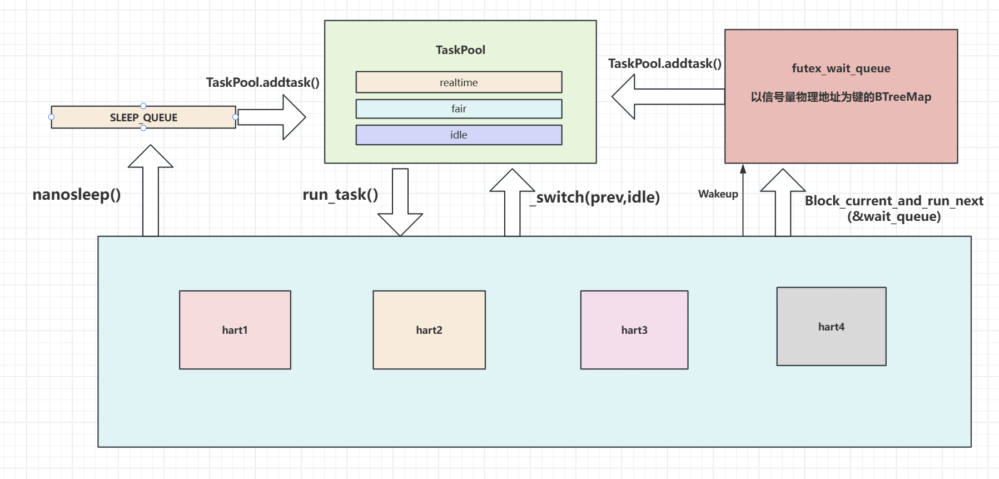
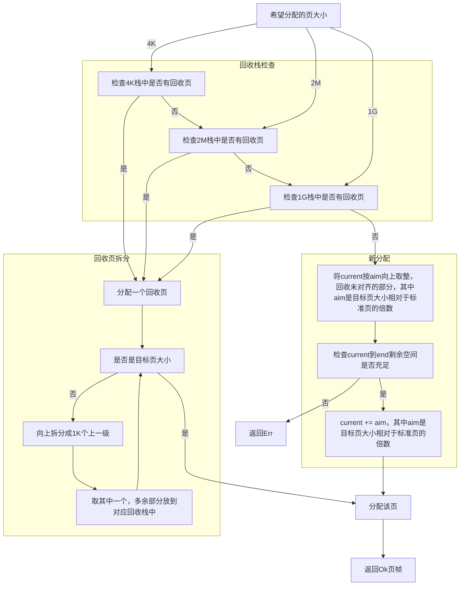
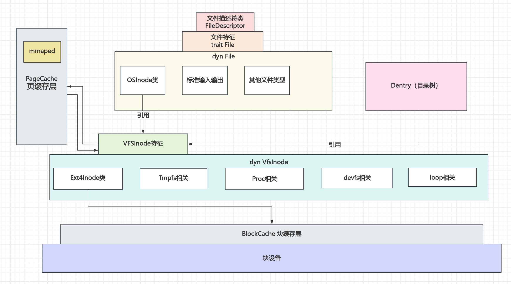
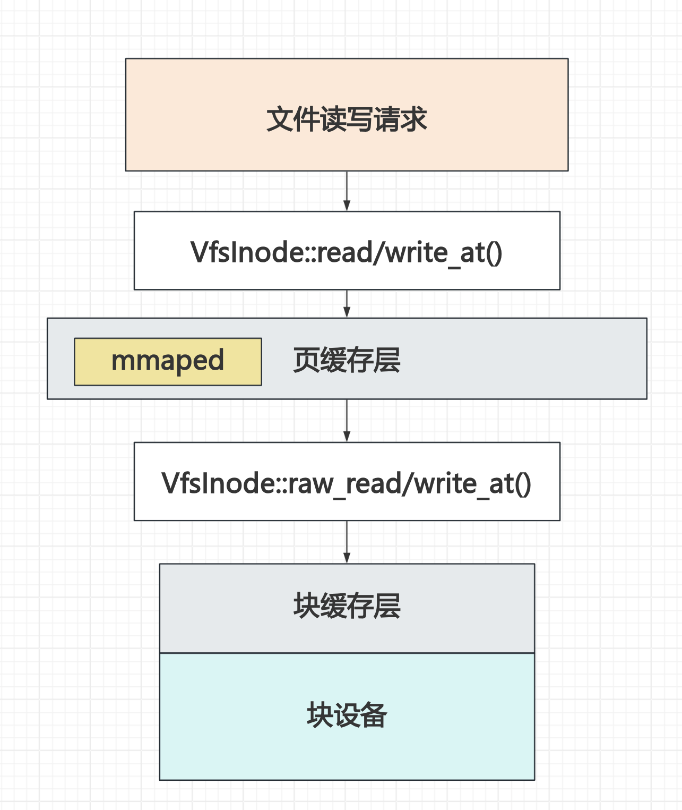
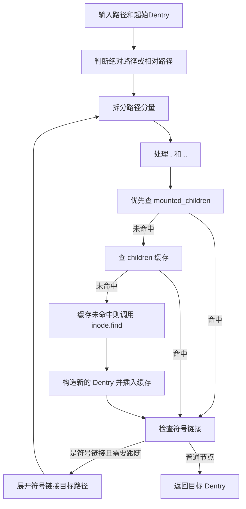

# 初赛文档
- [初赛文档](#初赛文档)
  - [1.概述](#1概述)
  - [2-ShellCore-设计与实现](#2-shellcore-设计与实现)
    - [20-常规设计](#20-常规设计)
      - [项目结构](#项目结构)
      - [启动流程](#启动流程)
      - [异常处理](#异常处理)
    - [21-进程管理](#21-进程管理)
      - [数据结构](#数据结构)
      - [线程状态](#线程状态)
      - [调度策略](#调度策略)
      - [COW相关](#cow相关)
      - [重要系统调用](#重要系统调用)
    - [22-内存管理](#22-内存管理)
      - [基本数据结构](#基本数据结构)
      - [初始化与地址空间布局](#初始化与地址空间布局)
      - [物理页分配](#物理页分配)
      - [地址翻译](#地址翻译)
      - [mmap与文件页缓存管理](#mmap与文件页缓存管理)
      - [PageFault处理](#pagefault处理)
      - [地址空间隔离与权限检查](#地址空间隔离与权限检查)
    - [23-文件系统](#23-文件系统)
      - [主要文件数据结构](#主要文件数据结构)
        - [文件描述符](#文件描述符)
        - [File特性](#file特性)
        - [OSInode](#osinode)
        - [VFS层](#vfs层)
      - [文件目录缓存相关](#文件目录缓存相关)
      - [管道相关](#管道相关)
      - [标准输入输出，error](#标准输入输出error)
      - [虚拟文件Tmpfs，proc等](#虚拟文件tmpfsproc等)
        - [tmpfs相关](#tmpfs相关)
        - [procfs相关](#procfs相关)
        - [devfs相关](#devfs相关)
        - [memfd与loop设备相关](#memfd与loop设备相关)
      - [ext4支持](#ext4支持)
      - [缓存机制](#缓存机制)
    - [24-IO管理](#24-io管理)
      - [标准I/O](#标准io)
      - [磁盘设备](#磁盘设备)
      - [网络](#网络)
      - [PCI支持](#pci支持)
    - [25-Linux语义兼容](#25-linux语义兼容)
      - [信号处理](#信号处理)
      - [errno设置](#errno设置)
  - [3-调试过程](#3-调试过程)
  - [4-AI使用](#4-ai使用)
  - [5-总结与展望](#5-总结与展望)
  - [6-参考资料](#6-参考资料)

## 1.概述
`ShellCore`是使用Rust语言基于[2025春夏季开源操作系统训练营 rCore-Tutorial-v3 ch7](https://github.com/rcore-os/rCore-Tutorial-v3/tree/ch7)逐步开发而来的操作系统内核。本项目支持RISCV-V/Loongarch两个架构，兼容POSIX协议。支持多核，按照SMP（Symmetrical Multi-Processing，对称多处理器）结构设计。


队员来自北京科技大学，初始阶段的成员及分工如下：
- 唐博文：内存管理COW，文件系统ext4初始架构，进程/线程管理
- 冯孟熙：龙芯架构兼容，SMP初始框架，内存管理与文件系统完善
- 高铭均：网络栈与网络设备驱动，部分系统调用早期实现

## 2-ShellCore-设计与实现

### 20-常规设计

#### 项目结构

本项目的内核源码位于[os/src](../os/src/)，按照不同的功能分文件夹，结构如下：

```text
    ├── .cargo/
    │   └── config.toml
    ├── .gitlab-ci.yml
    ├── LICENSE
    ├── Makefile
    ├── README.md
    ├── rust-toolchain.toml
    ├── bl-new-qemu/                    -- 新版rustsbi，现已弃用
    │   └── rustsbi-qemu.bin
    ├── bootloader/                     -- 旧版rustsbi，同样弃用
    │   └── rustsbi-qemu.bin
    ├── docs/                           -- 项目文档
    │   └── 初赛文档.md, *.png
    ├── os/                             -- 内核主目录
    │   ├── Cargo.toml, Cargo.lock
    │   ├── Makefile, build.rs
    │   ├── vendor/                     -- 依赖项(virtio-drivers等)
    │   └── src/
    │       ├── main.rs
    │       ├── console.rs, lang_items.rs, logging.rs, timer.rs
    │       ├── arch/
    │       │   ├── mod.rs
    │       │   ├── riscv/              -- RISC-V 64 架构
    │       │   │   ├── config.rs, mod.rs, sbi.rs, timer.rs
    │       │   │   ├── entry.asm, linker.ld
    │       │   │   ├── drivers/...
    │       │   │   ├── mm/...
    │       │   │   ├── task/...
    │       │   │   └── trap/...
    │       │   └── la/                 -- LoongArch 64 架构
    │       │       ├── config.rs, mod.rs, sbi.rs, ipi.rs, timer.rs
    │       │       ├── entry.asm, linker.ld
    │       │       ├── drivers/...
    │       │       ├── mm/...
    │       │       ├── task/...
    │       │       └── trap/...
    │       ├── auth/
    │       │   └── mod.rs
    │       ├── drivers/                -- 驱动，块缓存层
    │       │   ├── mod.rs, loopdev.rs
    │       │   └── block/
    │       │       └── mod.rs, block_cache.rs, block_dev.rs
    │       ├── ext4fs/                   -- ext4文件系统
    │       │   └── mod.rs, ext4.rs, ext4inode.rs, ext4_dir_entry.rs,
    │       │       blockgroup.rs, superblock.rs, vfs.rs
    │       ├── fs/                       -- 文件系统
    │       │   └── mod.rs, inode.rs, ino.rs, dir_entry.rs, file_tree.rs,
    │       │       pipe.rs, fifo.rs, stdio.rs, tmpfs.rs, procfs.rs,
    │       │       devfs.rs, memfd.rs, epoll.rs, userpagefault.rs
    │       ├── ipc/                     -- 进程间通信
    │       │   └── mod.rs, msg.rs, shm.rs, namespace.rs
    │       ├── mm/                      -- 内存相关
    │       │   └── mod.rs, address.rs, flags.rs, frame_allocator.rs,
    │       │       heap_allocator.rs, id.rs, memory_set.rs, mmap.rs,
    │       │       page_table.rs, user_buffer.rs
    │       ├── net/                     -- 网络相关
    │       │   └── mod.rs, netlink.rs, socket.rs
    │       ├── process/                 -- 进程相关
    │       │   ├── mod.rs, pcb.rs, manager.rs, processor.rs
    │       │   ├── schedule.rs, switch.rs, clone.rs, id.rs
    │       │   └── task/
    │       │       └── mod.rs, tcb.rs, context.rs, signal.rs, action.rs
    │       ├── sync/                    -- 同步原语，内核锁
    │       │   └── mod.rs, mp.rs, semaphore.rs
    │       └── syscall/                 -- 系统调用
    │           └── mod.rs, errno.rs, fs.rs, mm.rs, process.rs,
    │               ipc.rs, net.rs, prctl.rs, bpf.rs
    ├── tester-maker/                    -- ltp测试脚本列表生成器
    │   └── maker.py, filter_zero_score.py, format_example.rs, ltp-musl.csv
    └── user/                            -- 用户程序
        ├── Cargo.toml, Cargo.lock, Makefile, build.py
        ├── rust-toolchain.toml
        └── src/
            ├── lib.rs, console.rs, lang_items.rs, syscall.rs
            ├── linker-la.ld, linker-rv.ld
            └── bin/
                └── initproc.rs, initproc_ltp.rs, initproc_sh.rs
```

整体采用去耦合设计，两种架构的差异/底层实现分别位于[os/src/arch/riscv](../os/src/arch/riscv)和[os/src/arch/la](../os/src/arch/la)，通过`#[cfg()]`语句块条件编译，暴露统一接口，从而使上层抽象与架构解耦（只需单次实现）：

```rust
//! os/src/arch/mod.rs

#![allow(dead_code)]

#[cfg(target_arch = "riscv64")]
pub mod riscv;
#[cfg(target_arch = "loongarch64")]
pub mod la;

#[cfg(target_arch = "riscv64")]
pub use riscv::*;
#[cfg(target_arch = "loongarch64")]
pub use la::*;

// 其他架构
#[cfg(not(any(target_arch = "riscv64", target_arch = "loongarch64")))]
compile_error!("Unsupported target arch");
```

位于[user](../user/)的初始化程序将会在`make`时被编译，并按情况拷贝到[la](os/src/arch/la/)或[riscv](os/src/arch/)，详见[Makeflie](../Makefile)。如果不先运行`make`准备初始化程序，您的语法分析器可能会报错找不到`initproc.elf`，但这并不是真正的语法错误。

内核编译时会将其链接到内核elf的`.data`段，并在启动时作为初始化进程：

```rust
#[repr(C)]
struct InitProcData<T: ?Sized> {
    pub _align: [u64; 0],
    pub bytes: T,
}

#[link_section = ".data"]
#[cfg(target_arch = "riscv64")]
static INITPROC_DATA: &'static InitProcData<[u8]> = &InitProcData {
    _align: [],
    #[cfg(initproc = "default")]
    bytes: *include_bytes!("../arch/riscv/initproc"),
    #[cfg(initproc = "sh")]
    bytes: *include_bytes!("../arch/riscv/initproc_sh"),
    #[cfg(initproc = "ltp")]
    bytes: *include_bytes!("../arch/riscv/initproc_ltp")
};

#[link_section = ".data"]
#[cfg(target_arch = "loongarch64")]
static INITPROC_DATA: &'static InitProcData<[u8]> = &InitProcData {
    _align: [],
    #[cfg(initproc = "default")]
    bytes: *include_bytes!("../arch/la/initproc"),
    #[cfg(initproc = "sh")]
    bytes: *include_bytes!("../arch/la/initproc_sh"),
    #[cfg(initproc = "ltp")]
    bytes: *include_bytes!("../arch/la/initproc_ltp")
};
```

#### 启动流程

启动核（主核）执行`_start`，按照规则设置`sp`到自己的启动栈顶，并保存`hart_id`到```tp```寄存器，随后跳转到`rust_main()`；

主核继续跳转到`main_init()`，完成内存等的初始化，随即唤醒非启动核（副核）；

随后，副核也执行上述流程，但只执行本核特有初始化；

初始化完成后，多核分别调用`run_tasks()`，即idle执行流；

idle运行的第一个用户程序将是初始化进程。

特别地：
- Loongarch：使用映射窗口，内核态总是不使用页表。启动前由于物理地址位数低，内核elf的高位被截断，在物理地址启动时设置映射窗口随后打开虚拟地址，此时地址被扩展到64位，内核elf的高位地址恢复，使内核落在映射窗口中
- 多核唤醒：RV使用了sbi_call，Loongarch参考了[2025RocketOS](https://gitlab.eduxiji.net/educg-group-36002-2710490/T202510213995926-2475)的IPC的多核唤醒
- 尽管在称谓上有`主核`与`副核`的区分，但只在启动流程上有区别，初始化完成后二者的地位是完全等同的

#### 异常处理
进入trap_handler()前参考rCore，但针对多核和龙芯有一些修改。

根据异常寄存器分配异常：
- 系统调用：处理系统调用
- 缺页异常：user_fault
- 访址异常：是否是栈过小-->是否是COW？-->返回
- 时间片轮转：切换保存任务上下文切换到run_tasks()流

异常处理完毕后进行信号处理（可能前往用户处理函数）；

最后恢复上下文返回用户态。

### 21-进程管理
#### 数据结构
我们使用 `ProcessControlBlock`(PCB) 和 `TaskControlBlock`(TCB) 分别管理进程和线程， PCB 中包含一个 TCB 向量用来存放一个进程的所有线程:
- 以下是PCB和TCB的定义
```rust
// PCB
pub struct ProcessControlBlock {
    //pid
    pub pid: Arc<PidHandle>,
    //Out of memory机制分数，但未实现
    pub oom_score_adj: AtomicI32,
    //命名空间，同一命名空间的进程组才进行通信
    pub ns_proxy: NsProxy,
    pub inner: MPSafeCell<ProcessControlBlockInner>,
}

// PCBinner
pub struct ProcessControlBlockInner {
    // 进程是否在主核运行，initproc和shell默认在主核运行
    pub on_main_hart: bool,
    // 进程名字，通常是exec时的名字，方便调试
    pub pname: String,

    /// Application data can only appear in areas
    /// where the application address space is lower than base_size
    pub base_size: usize,

    /// Application address space
    pub memory_set: MemorySet,

    /// Parent process of the current process.
    /// Weak will not affect the reference count of the parent
    pub parent: Option<Weak<ProcessControlBlock>>,

    /// 子进程，计数引用
    pub children: Vec<Arc<ProcessControlBlock>>,

    /// 堆底位置
    pub heap_bottom: usize,

    /// 堆索引
    pub program_brk: usize,

    /// 文件描述符的当前限制与最大限制
    pub fd_rlmt: Rlimit64,

    /// 文件描述符表
    pub fd_table: Vec<FileDescriptor>,
    
    pub cwd: Arc<Dentry>, // 当前工作目录

    // 进程收到的信号
    pub signals: SignalFlags,

    // Signal actions（记录用户侧的用户信号处理地址空间函数地址，其实就是用户注册的信号结构体）
    pub signal_actions: SignalActions,

    pub exit_code: i32, // 进程退出码，默认为0，只有当进程状态为Zombie时才有意义

    pub ruid: u32,  // 用户 ID
    pub gid: u32,  // 用户组 ID
    pub euid: u32, // 有效用户 ID
    pub egid: u32, // 有效用户组 ID
    pub sgid: u32, // 辅助用户组 ID
    pub umask: u32, // 文件模式创建掩码

    pub sid: usize,
    pub pgid: usize, // 进程组 ID
    
    pub max_file_size: usize, // 进程可创建的最大文件大小，单位为字节，默认为 usize::MAX
    // 进程下的线程数
    pub tasks: Vec<Arc<TaskControlBlock>>, 
    // 存活进程数，等于0相当于僵尸进程
    pub alive_task_count: isize,
    // 专用于syscall92的personality
    pub personality: usize,
    // MAP_LOCKED 锁定的内存字节数（用于 /proc/self/status VmLck 字段）
    pub locked_bytes: usize,

    /// Approximate process start timestamp in microseconds since boot.
    pub start_time_us: usize,
}

/// TCB
pub struct TaskControlBlock {
    // Immutable
    /// 线程所属进程
    /// 让线程拥有对进程的弱引用，便于调用进程的方法
    /// 不能用arc否则循环引用
    pub process: Weak<ProcessControlBlock>,

    /// 线程id
    pub tid: Arc<TIdHandle>,

    /// Thread group id. Linux getpid() returns this id, while gettid() returns tid.
    pub tgid: usize,

    /// Kernel stack corresponding to PID
    pub kernel_stack: KernelStack,

    /// Mutable
    pub inner: MPSafeCell<TaskControlBlockInner>,
}

/// TCBinner
pub struct TaskControlBlockInner {

    /// 异常上下文地址
    pub trap_cx_addr: usize,

    /// 任务上下文地址
    pub task_cx: TaskContext,

    /// Maintain the execution status of the current process
    pub task_status: TaskStatus,

    /// 当前由哪个 hart 持有运行所有权；None 表示可被调度领取。
    pub owner_hart: Option<usize>,

    // 调度优先级与调度策略
    pub sched_policy: isize,
    pub sched_priority: i32,

    /// It is set when active exit or execution error occurs
    pub exit_code: i32,
    pub errno: i32,
    pub signals: SignalFlags,
    pub signal_interrupted: bool,
    pub signal_mask: SignalFlags,
    /// 信号嵌套处理时的掩码栈（当前未完全验证行为是否正确，初步测试没问题）
    pub signal_mask_backup: Vec<SignalFlags>,
    // if the task is killed
    pub killed: bool,
    pub term_signal: Option<i32>,
    // if the task is frozen by a signal
    pub frozen: bool,
    /// 信号嵌套处理时的上下文栈（当前未完全验证行为是否正确，初步测试没问题）
    pub trap_ctx_backup: Vec<TrapContext>,

    /// 用户态 signal frame 中 ucontext 的地址，用于 sigreturn 读取用户修改后的上下文。
    pub signal_user_context_backup: Vec<usize>,

    pub clear_child_tid: usize,// 线程清理指针
}
```
#### 线程状态
UnInit：开发前使用，实则未使用

Ready：就绪态

Running：运行态

Blocked：阻塞态

Zombie：僵尸态

BlockSaving：等待保存态
1. Ready态：初始被fork出来时以及时间片用完后
2. Running：运行态
3. Blocked：阻塞态（目前应用于nanosleep的睡眠队列，以及futex的阻塞队列）
4. BlockSaving：由于阻塞态开发时是先入队再保存上下文，这时候如果多核环境唤醒这个队列，上下文未保存的线程会被调度，出现问题。但由于阻塞队列又不是全局唯一一个队列，无法做到像时间片轮转队列的单独队列的情况，所以暂存了这个状态。
#### 调度策略

进程切换执行流：current_task---->run_task()---->next_task

```TaskPool```：

    为了满足调度语义需求，调度策略有以下这些：
    ```rust
    pub const SCHED_OTHER: isize = 0;
    pub const SCHED_FIFO: isize = 1;
    pub const SCHED_RR: isize = 2;
    pub const SCHED_BATCH: isize = 3;
    pub const SCHED_IDLE: isize = 5;
    ```
    全局调度队列
    ```rust
    pub struct TaskPool {
        deadline: BinaryHeap<PoolEntry>,
        realtime: BinaryHeap<PoolEntry>,
        fair: BinaryHeap<PoolEntry>,
        idle: BinaryHeap<PoolEntry>,
        enqueue_order: usize,
    }
    ```
    
对于调度策略为FIFO和RR，其会进入实时调度队列，即realtime；对于调度策略为其它的则会进入fair队列；对于初始进程则会进入IDLE队列；调度器由``堆``实现，其比较的索引是```优先级以及入队顺序```；调度时从deadline->realtime->fair->idle开始选择任务执行；在run_task()中，当任务数量较少时，会向TaskPool中fetch_task()；根据任务优先级以及调度策略分配时间片：

    ```rust
    const DEFAULT_TIME_SLICE_MS: usize = 10;
    const FIFO_TIME_SLICE_MS: usize = 50;//防止恶意程序或卡死行为崩溃内核，给FIFO一个大时间片
    const RR_TIME_SLICE_MS: usize = 1;
    const IDLE_TIME_SLICE_MS: usize = 20;
    ```

- ```sleep_queue```:

    睡眠队列专用于nanosleep，在每次进入run_tasks()时更新时间戳，到达时间的则插入TaskPool
- ```futex_wait_queue```:

    以信号量物理地址为键的BTreeMap，wake时将任务插入TaskPool
#### COW相关
使用以下数据结构来描述指定物理页帧的引用数，键为物理页框号，值为引用数。
```rust
 static ref FRAME_REF_COUNTS: MPSafeCell<BTreeMap<usize, usize>> = MPSafeCell::new(BTreeMap::new());
```
物理页帧在释放时会将其计数减1，当计数为0时真正drop
```rust
impl Drop for FrameTracker {
    fn drop(&mut self) {
        let remain = frame_release_ref(self.ppn);
        if remain == 0 {
            // 按页大小释放
            frame_dealloc_raw(self.ppn, self.page_size);
        }
    }
}
```
fork会将父进程的页表的可写位抹去，同时子进程也没有可写位。
```rust
    //...clone Memory_set
    let writable_cow = map_perm.contains(MapPermission::W) && !is_shared;
    let child_perm = if writable_cow {
        map_perm & !MapPermission::W
        } else {
            map_perm
        };
        let child_flags = PTEFlags::from_bits(child_perm.bits).unwrap();
        memory_set.page_table.map(vpn, src_pte.ppn(), child_flags, page_size);
        new_area.data_frames.insert(vpn, FrameTracker::from_ppn(src_pte.ppn(), page_size));
        if writable_cow {
            let parent_perm = map_perm & !MapPermission::W;
            let parent_flags = PTEFlags::from_bits(parent_perm.bits).unwrap();
            user_space.page_table.set_flags(vpn, parent_flags, page_size);
        }
    //...
```
运行后，父子进程若要写某一页触发了访址/写入异常，```trap_handler()```会调用**Memory_set**类的```handle_cow_fault()```方法，这会复制```一整个逻辑段```的数据并覆盖原逻辑段

#### 重要系统调用
- fork/clone：
    - 判断参数然后选择创建进程或线程

    ```mermaid
    flowchart TD
        A[进入clone，参数检查]
        B[创建线程]
        C[创建进程]
        B1[分配用户栈，内核栈，初始堆底，堆顶,创建MemorySet]
        B2[设置上下文，设置TCB字段]
        R[返回]
        C1[新建Memory_set，将已有逻辑段标记为不可写，但COW设为1]
        C2[分配用户栈，内核栈等]
        C3[设置命名空间，父进程等]
        C4[根据参数选择继承父进程的字段，如文件描述符等]
        C5[新建PCB，与初始TCB]
        A--创建线程-->B
        A--创建进程-->C
        B--根据参数-->B1
        B1-->B2-->R
        C-->C1-->C2-->C3-->C4-->C5-->R
    ```
- exec：
    - **堆栈位置具体见内存管理章节**
    ```mermaid
    flowchart TD
        A[参数检查]
        B[查找文件并判断是否可执行]
        C[elf转换，修改进程Memory_set]
        D[分配栈，内核栈，堆]
        E[修改上下文]
        F[插入就绪队列]
        A-->B-->C-->D-->E-->F
    ```
- wait:
    - 由于开发时内核尚不完善，保留了忙等待形式，后续完善为等待队列

    ```mermaid
    flowchart TD
        check[参数检查]
        scan[遍历子进程]
        has_child[存在子进程]
        no_child[不存在子进程]
        zombie[存在子进程且为zombie态]
        recycle[回收子进程资源]
        alive_child[存在子进程但不是zombie态]
        ret[返回,根据状态返回不同的errno]
        retry[切到就绪态,循环]

        check --> scan
        scan -- 是 --> has_child
        scan -- 否 --> no_child --> ret
        has_child --> zombie --> recycle --> ret
        has_child --> alive_child --> retry
        retry --> has_child
    ```
### 22-内存管理

除基本的分页/地址空间隔离外，我们的内存管理还支持：

- 可变页大小（大页支持）
- 共享映射与文件页缓存
- 动态栈扩张（懒分配）
- COW（详见进程管理章节）

#### 基本数据结构

在PCB中，我们用`MemorySet`管理进程的虚拟内存空间，其中用`MapArea`管理内存段。

`MemorySet`和`MapArea`的定义如下：

```rust
/// address space
/// 注意维护brk_index
pub struct MemorySet {
    page_table: PageTable,
    asid: ASIDHandle,
    pub areas: Vec<MapArea>,
    brk_index: usize, //新增，用于记录brk所在area（堆区）的索引，请注意维护，后续可能会删除
}
```

```rust
/// map area structure, controls a contiguous piece of virtual memory
pub struct MapArea {
    pub vpn_range: VPNRange,
    data_frames: BTreeMap<VirtPageNum, FrameTracker>,
    map_type: MapType,
    map_perm: MapPermission,
    pub is_shared: bool,
    // 记录文件信息和页偏移，其中页偏移的语义为映射起始页在文件中的页偏移量
    pub backing_file: Option<(Arc<dyn File + Send + Sync>, usize)>,
    pub page_size: PageSize,
}
```

基本字段参考rCore，但为共享页缓存/大页等添加了一些字段。

#### 初始化与地址空间布局

riscv 为内核和用户启用分页(SV39)，内核态采用2M大页映射所有物理页到内核地址空间，用户态默认用4k页。

```text
    这里采用2M大页相比4K页好处是：加速页表遍历（3级 -> 2级），提高tlb命中率（512个条目即可映射整个内核空间）与减少页表物理页占用。
```

初始化完成后,将satp切换至内核根页表。

```rust
//! impl MemorySet

#[cfg(target_arch = "riscv64")]
pub fn activate(&self) {
    //println!("Activating new page table with ASID {}", self.asid());
    let satp = self.token();
    let asid = self.asid();
    unsafe {
        satp::write(satp);
        asm!("sfence.vma x0, {asid}", asid = in(reg) asid);
    }
}
```

loongarch 为内核启用映射窗口，恒等映射不做任何操作：

```rust
//! arch/la/config.rs

/// kernel address space
pub const UNCHACHED_KERNEL_BASE: usize = 0x8000_0000_0000_0000;
pub const KERNEL_BASE: usize = 0x9000_0000_0000_0000;

```

``` rust
//! arch/la/mm/mod.rs

// 摘自手册：当CSR.CRMD的DA=0且PG=1时，处理器核的MMU处于映射地址翻译模式。具体又分为直接映射
// 地址翻译模式（简称“直接映射模式”）和页表映射地址翻译模式（简称“页表映射模式”）两种。
// 0x1设置特权级plv0，0x10设置缓存开启
const DMW0_VAL: usize = UNCHACHED_KERNEL_BASE | 0x1;
const DMW1_VAL: usize = KERNEL_BASE | 0x11;//0b10001
const DMW2_VAL: usize = 0 | 0x1;
const DMW3_VAL: usize = 0;
```

为用户启用分页，通过合适的配置使页表结构与SV39一致：

```rust
//! arch/la/mm/mod.rs

// 为使虚拟地址结构与SV39一致，定义如下常量
// qemu使用的物理地址只到48位
const PA_LEN : usize = PA_WIDTH;
const VA_LEN : usize = VA_WIDTH;
// PT可以理解为dir0
const PT_BASE : usize = PAGE_SIZE_BITS;//页大小4K对应12位
const PT_WIDTH: usize = 9;
const DIR1_BASE: usize = PT_BASE + PT_WIDTH;
const DIR1_WIDTH: usize = 9;
const DIR2_BASE: usize = DIR1_BASE + DIR1_WIDTH;
const DIR2_WIDTH: usize = 9;

const PTE_WIDTH: usize = 0; // 页表项位宽64

// 定义虚拟内存的低位布局，设置第0~2页表
const PWCL_VAL: usize = (PT_BASE << 0) |
                        (PT_WIDTH << 5) |
                        (DIR1_BASE << 10) |
                        (DIR1_WIDTH << 15) |
                        (DIR2_BASE << 20) |
                        (DIR2_WIDTH << 25) |
                        (PTE_WIDTH<< 30);

// 弃用3/4级页表，给控制高位部分的寄存器置零
const PWCH_VAL: usize = 0; 
```

与riscv类似，启用分页时将PGDL设置为根页表基址。

```rust
//! impl MemorySet

/// 对于龙芯，修改PGDL/H寄器
/// 用户处于低半地址空间
#[cfg(target_arch = "loongarch64")]
pub fn activate(&self) {
    let pgdl = self.page_table.token();
    unsafe {
        asm!("csrwr {pgdl}, 0x19", pgdl = in(reg) pgdl);
        asm!("dbar 0");
    }
}
```

初始化内存时的寄存器设置参考[龙芯架构参考手册卷一](https://www.loongson.cn/uploads/images/2023041918133323805.%E9%BE%99%E8%8A%AF%E6%9E%B6%E6%9E%84%E5%8F%82%E8%80%83%E6%89%8B%E5%86%8C%E5%8D%B7%E4%B8%80_r1p03.pdf)，用内联汇编实现。

---

内核空间布局在`os/src/arch/*/linker.ld`和`MemorySet::new_kernel()`中定义。

riscv的内核空间在初始化完成后全程开启分页，布局如下：

``` text
------------- usize::MAX
| trampoline| (mapping .text.trampoline)
------------- usize::MAX - 4096
...
------------- MEMORY_END
| phys mem  | (可分配, 用于用户/内核栈/页缓存)
------------- .ekernel
| .bss      | (内核堆空间位于其中)
-------------
| .data     |
-------------
| .rodata   |
-------------
| .text     |
------------- 0x8020_0000
| boot      |
------------- 0x8000_0000
| MMIO      |
------------- 0x0
```

其中除跳板页外均使用恒等映射。

loongarch的内核态使用映射窗口，不经过页表翻译，物理内存布局如下：

``` text
------------- MEMORY_END
| phys mem  | (可分配, 用于用户与页缓存)
------------- . + DMA_SIZE
| DMA       |
------------- .ekernel
| .bss      | (内核堆空间位于其中)
-------------
| .data     |
-------------
| .rodata   |
-------------
| .text     |
------------- 0x8020_0000
| boot      |
------------- 0x8000_0000
| MMIO      |
------------- 0x800_0000
| low_mem   | (目前的实现中用于内核栈)
------------- 0x0
```

实际上由于映射窗口的存在，上述物理地址可能演变为0x8000_0000_0000_0000或0x9000_0000_0000_0000起始的窗口映射虚拟地址。

```text
    特别地，二者的内核栈位置不同，riscv采用动态分配，loongarch采用根据`tid`计算位置，详见代码。
```

用户空间二者布局基本一致：

``` text
----------------- usize::MAX
| trampoline    | (跳板页，仅riscv映射)
----------------- usize::MAX - 4096
...
-----------------
| mmaped        | (可能多个)
-----------------
...
----------------- brk
| heap          | (初始为0)
----------------- 
| guard_pages   |
----------------- . + USER_STACK_SIZE
| stack         | (用户栈，懒分配)
-----------------
| guard_pages   |
----------------- max_end
| elf_sections  | (多个段，含动态链接)
----------------- elf_start
```

#### 物理页分配

我们使用带引用计数和页大小的FrameTracker维护物理页帧：

```rust
/// tracker for physical page frame allocation and deallocation
/// 现在的实现带引用计数
pub struct FrameTracker {
    /// physical page number
    pub ppn: PhysPageNum,
    /// 页大小
    pub page_size: PageSize,
}
```

其中的`ppn`按标准页`4KB页`计。

```text
    在我们的实现中，所有PhysPageNum表示的页号在不特殊说明的情况下都以4KB页计数，即使在处理大页时也是。由此还引入相对页大小（大页相对标准页大小的倍数）概念。
```

当其被`Drop`时，在独立的引用计数器中检查该页号引用计数，如果引用计数 == 1说明是最后一个，回收物理页。

---

我们使用基于回收栈的页帧分配器，并借鉴**伙伴系统思想**，为适应可变页大小`4K`/`2M`/`1G`作出了部分修改。

数据结构如下：

```rust
pub struct StackFrameAllocator {
    current: usize,
    end: usize,
    recycled_std: Vec<usize>,
    recycled_mega: Vec<usize>,
    // 注：当前内存其实不够分配1G大页，但架构支持，所以仍然这样写
    recycled_giga: Vec<usize>,
}
```

其中，`current`/`end`记录按标准页大小(4KB)计算的当前/结束位置物理页号，三个回收栈分别放置回收的4K/2M/1G页。

分配逻辑如下：



考虑到大页的使用场景主要是**内核初始化时的内核空间映射**，用户仅在`memfd`等**少量场景**使用，上述逻辑几乎能完全**避免**`碎片`/`大页回收后不被利用`引发的空间浪费。

在上述分配逻辑的基础上，回收逻辑变得十分简单：**直接把被回收的物理页压入对应回收栈即可**。

#### 地址翻译

`find_pte()`/`find_pte_create()`通过软件页表遍历找到叶子页表项，由此实现内核态的用户空间访问。特别地，为了适应可变页大小，在`find_pte()`中，通过判断页表提前到达叶子的情况（叶子节点所在层级），确定目标虚拟地址是否是通过大页映射以及页大小；在`find_pte_create()`中则根据传入的页大小参数确定页表层级。
这里以riscv为例：

```rust
/// Find PageTableEntry by VirtPageNum, create a frame for a 4KB page table if not exist
#[cfg(target_arch = "riscv64")]
fn find_pte_create(&mut self, vpn: VirtPageNum, page_size: PageSize) -> Option<&mut PageTableEntry> {  
    let idxs = vpn.indexes();
    let mut ppn = self.root_ppn;
    let mut result: Option<&mut PageTableEntry> = None;
    for (i, idx) in idxs.iter().enumerate() {
        let pte = &mut ppn.get_pte_array()[*idx];
        if i == page_size.walk_level() {
            result = Some(pte);
            break;
        }
        if !pte.is_valid() {
            let frame = frame_alloc(PageSize::Page4K).unwrap();
            *pte = PageTableEntry::new(frame.ppn, PTEFlags::V);
            self.frames.push(frame);
        }
        ppn = pte.ppn();
    }
    result
}

/// Find PageTableEntry by VirtPageNum
#[cfg(target_arch = "riscv64")]
pub fn find_pte(&self, vpn: VirtPageNum) -> Option<(&mut PageTableEntry, PageSize)> {
    let idxs = vpn.indexes();
    let mut ppn = self.root_ppn;
    let mut pte_opt: Option<&mut PageTableEntry> = None;
    let mut page_size: Option<PageSize> = None;
    for (i, idx) in idxs.iter().enumerate() {
        let pte = &mut ppn.get_pte_array()[*idx];
        //println!("find_pte: vpn = {:?}, i = {}", vpn, i);
        // 标准页叶子节点需要v，大页叶子节点有rwx任一即可
        if (i == 2 && pte.is_valid()) || (i < 2 && (pte.readable() || pte.writable() || pte.executable())) {
            pte_opt = Some(pte);
            page_size = Some(match i {
                0 => PageSize::Page1G,
                1 => PageSize::Page2M,
                2 => PageSize::Page4K,
                _ => unreachable!(),
            });
            return Some((pte_opt.unwrap(), page_size.unwrap()));
        }
        // 如果不是叶子节点但无效，说明没有映射
        if !pte.is_valid() {
            return None;
        }
        ppn = pte.ppn();
    }
    None
}
```

loongarch与之逻辑一致，详见仓库中的代码。

与之对应，在用户缓冲区的构造中，也实现了根据页大小调整单个缓冲区的长度（步长），`trandlated_xxx()`访存时对调用者透明。这里以`try_translated_write()`为例:

```rust
pub fn try_translated_byte_buffer_mut(token: usize, ptr: *mut u8, len: usize) -> Option<Vec<&'static mut [u8]>> {
    if !prepare_user_write(token, ptr as usize, len) {
        return None;
    }
    let page_table = PageTable::from_token(token);
    let mut start = ptr as usize;
    let end = start + len;
    let mut v = Vec::new();
    while start < end {
        let start_va = VirtAddr::from(start);
        let mut vpn = start_va.std_floor();
        // 遍历页表获取pte和页大小
        let (ppn, size) = match page_table.
        translate_and_get_size(vpn) {
            Some((pte, size)) if pte.is_valid() => (pte.ppn(), size),
            _ => return None,
        };
        // 按相对页大小走步长
        vpn.step_by(size.num_pages());
        let mut end_va: VirtAddr = vpn.into();
        end_va = end_va.min(VirtAddr::from(end));
        if end_va.actual_page_offset(size) == 0 {
            v.push(&mut ppn.get_bytes_array_with_size(size)[start_va.actual_page_offset(size)..]);
        } else {
            v.push(&mut ppn.get_bytes_array_with_size(size)[start_va.actual_page_offset(size)..end_va.actual_page_offset(size)]);
        }
        start = end_va.into();
    }
    Some(v)
}
```

```text
特别地，loongarch还有汇编实现的tlb_refill_handler()，详见代码。
```

#### mmap与文件页缓存管理

`mmap`的`匿名映射`十分简单，直接视情况插入`area`，分配物理页并映射即可。`非匿名非共享映射`则在`匿名映射`的基础上添加读取文件的内容。参数检查/权限控制等细节详见代码。下面主要讲共享文件映射机制。

我们使用`SharedPageCacheManager`管理文件映射/页缓存的物理页：

```rust
/// 单个页缓存条目
pub struct PageCache {
    pub frame: FrameTracker,
    pub dirty: bool,
}

/// 共享映射页缓存管理器，LRU 回收
/// 
/// 需要临界区重叠时，约定锁序（防死锁）：
/// page_cache_map → file_register → vfs_register → lru_queue
pub struct SharedPageCacheManager {
    // (ino, page_offset) → page cache
    //
    // 注意：
    // 尽管语法上没有严格限制，但每一次访问 PageCache 数据，
    // 包括修改、写回磁盘和对 dirty 标志的修改，
    // 都应该在 MutexGuard 内进行，以保证数据一致性。
    page_cache_map: Mutex<BTreeMap<(u64, usize), Arc<Mutex<PageCache>>>>,
    // ino → File 弱引用（mmap）
    file_register: Mutex<BTreeMap<u64, Weak<dyn File + Send + Sync>>>,
    // ino → VfsInode 弱引用（io缓存）
    vfs_register: Mutex<BTreeMap<u64, Weak<dyn VfsInode>>>,
    // 记录访问顺序
    lru_queue: Mutex<PageCacheLRUQueue>,
}

```

其被全局唯一实例化为`SHARED_PAGE_CACHE_MANAGER`。

`page_cache_map`用B树记录了`(文件inode号，文件内部偏移)`到带互斥锁`PageCache`的映射；

```text
    所有文件缓存页均由本管理器分配（当然，物理页来自于FrameAllocator），并插入到page_cache_map进行维护。mmap时允许克隆FrameTracker。
```

两个`register`分别记录`inode号`到`用户mmap的文件`/`磁盘文件`的映射；

```text
    由于我们的实现中，mmap文件File的底层实际上仍是VfsInode，而我们的实现保证了所有VfsInode的ino不重复，因此即使两个register出现了重复注册，同一个文件的同一偏移的物理页仍是同一个，不会出现数据不一致。
```

`lru_queue`记录了(ino, offset)的访问顺序，访问的移到队尾，在触发缓存回收时依次`pop()`出队头的元素。其定义如下:

```rust
// 页缓存 lru 队列
struct PageCacheLRUQueue {
    // 存储存在的页缓存条目
    exists: BTreeMap<(u64, usize), ()>,
    // (ino, page_offset) → next (ino, page_offset)
    nexts: BTreeMap<(u64, usize), Option<(u64, usize)>>,
    // (ino, page_offset) → prev (ino, page_offset)
    prevs: BTreeMap<(u64, usize), Option<(u64, usize)>>,
    head: Option<(u64, usize)>,
    tail: Option<(u64, usize)>,
}
```

本质上是链表，但通过B树存储队列中相邻`(inode号，偏移)`的对应关系，以O(logn)的时间复杂度完成队列更新，以O(n)的空间复杂度存储缓存条目。

mmap共享文件映射时:

1. 上层系统调用检查参数合法性；
2. 传入`file`，`offset`，`addr`，等参数到`MemorySet::mmap()`；
3. mmap走共享文件映射路径，调用`file.get_shared_page(file_page_offset)`获取目标文件的共享页`FrameTracker`，并在`SHARED_PAGE_CACHE_MANAGER`中注册对应文件。

```rust
if is_shared && !is_anonymous {
    // 共享文件映射 
    let file = file_inner.as_ref().unwrap();
    let mut area = MapArea {
        vpn_range: VPNRange::new(
            VirtAddr::from(start_va).std_floor(), 
            VirtAddr::from(start_va + length).std_ceil()
        ),
        data_frames: BTreeMap::new(), 
        map_type: MapType::File, 
        map_perm: permission,
        is_shared: true,
        backing_file: file_inner.clone()
            .map(|f| (f.clone(), page_offset)),
        page_size:Page4K // 默认用标准页
    };

    // 文件页偏移末，开边界，也就是文件最后一页的下一个页的偏移，超过的部分不映射
    let file_end_page_offset = PhysAddr(file.get_stat().size as usize).std_ceil().0;

    let start_vpn = VirtAddr::from(start_va).std_floor().0;
    for i in 0..needing_std_pages {
        let vpn = start_vpn + i;
        let file_page_offset = page_offset + i; 
        if file_page_offset >= file_end_page_offset {
            break;
        }
        if let Some(cache) = file.get_shared_page(file_page_offset) {
            let page = cache.lock();
            let ppn = page.frame.ppn;
            // clone FrameTracker: 引用计数 +1
            let frame_clone = page.frame.clone();
            let pte_flags = PTEFlags::from_bits(permission.bits).unwrap();
            self.page_table.map(VirtPageNum::from(vpn), ppn, pte_flags,Page4K);
            area.data_frames.insert(VirtPageNum::from(vpn), frame_clone);
        } else {
            return Err(Errno::ENOMEM.as_isize());
        }
    }
    // 注册到全局共享页面管理器
    crate::mm::mmap::SHARED_PAGE_CACHE_MANAGER.register_file(file.ino(), file);
    // 这里是简单插入，映射在前面已经完成了
    self.areas.push(area);
}
```

`get_shared_page()`的实现详见[2.3 文件系统](#23-文件系统)

#### PageFault处理

当前内核暂无swap机制，但为cow/懒分配/mmap实现了pagefault处理。

在触发PageFault时，依次进行：

1. 尝试处理COW，成功返回，失败进行下一步；
2. 尝试处理懒分配，成功返回，失败进行下一步；
3. 处理mmap错误，成功按情况返回或按标准插入SIGBUS等信号，失败进行下一步；
4. 上述处理均失败，说明是野指针等错误，添加段错误信号。

```text
    特别地，由于没有MMU，龙芯有软件pte标脏等额外处理，这里省略，详见代码。
```

几种处理的逻辑分别是：

- COW：找到异常地址的`area`，发现`area`的`map_perm`有写入权但pte无，说明触发了COW，新分配物理页，映射并拷贝数据。
- 懒分配：异常地址在栈区，并且在`trap_ctx`的`sp`下方一定区域内，说明触发了栈的动态扩张，往`sp`下方分配物理页并映射即可，堆区暂时不使用懒分配。
- mmap错误：直接检查权限/文件长度，插入对应信号即可。后续实现用户mmap和内核态页缓存修改互斥机制后，还会添加权限位修改等相关实现，但目前未实现。

#### 地址空间隔离与权限检查

riscv的**内核与用户**/**用户与用户**使用不同页表，因此是天然隔离的；loongarch采用**只有内核有访问权**的映射窗口 + **用户各自的页表**来保证地址空间的隔离。

另外，为了减少tlb刷新的重填开销，我们为不同的地址空间分配不同的asid。在页表改变后清除改页表对应asid的tlb表项。

```rust
// la
pub fn flush_tlb_for_asid(asid: usize) {
    unsafe {
        asm!("sfence.vma x0, {asid}", asid = in(reg) asid);
    }
}

//rv
pub fn flush_tlb_for_asid(asid: usize) {
    unsafe {
        asm!(
            "invtlb 0x4, {asid}, $r0",
            asid = in(reg) asid,
        );
        asm!("dbar 0");
    }
}
```

```text
不过，由于开发调试时希望排除可能的未完全刷新，现阶段很多时候依然使用不指定asid的全量刷新。
```

两种架构分别通过各自`pte`的`R/W/X/U`位实现页权限控制。

### 23-文件系统

我们的文件系统整体结构如下：



进程打开的*文件*是`dyn File`，对于一个vfs文件，其被实现为`OSInode`。
`OSInode`的底层数据`inode`则是`dyn VfsInode`。

文件读写的数据通路/缓存关系如下：



整体数据通路

#### 主要文件数据结构
##### 文件描述符
```rust
pub struct FileDescriptor {
    pub file: Option<Arc<dyn File + Send + Sync>>,
    pub flags: FdFlags,
    pub status: usize,
}
```
##### File特性
```rust
pub trait File: Send + Sync {
    /// the file readable?
    fn readable(&self) -> bool;
    /// the file writable?
    fn writable(&self) -> bool;
    /// read from the file to buf, return the number of bytes read
    fn read(&self, _buf: UserBuffer) -> usize { 0 }
    /// write to the file from buf, return the number of bytes written
    fn pread(&self, _offset: usize, _buf: UserBuffer) -> usize { 0 }
    fn write(&self, _buf: UserBuffer) -> usize { 0 }
    fn write_nonblock(&self, buf: UserBuffer) -> Result<usize, Errno> {
        Ok(self.write(buf))
    }
    /// 底层原始读取（绕过页缓存，直接读存储）
    fn raw_read_at(&self, _offset: usize, _buf: UserBuffer) -> usize { 0 }
    /// 底层原始写入（绕过页缓存，直接写存储）。回写脏页等场景使用。
    fn raw_write_at(&self, _offset: usize, _buf: UserBuffer) -> usize { 0 }

    /// 带页缓存的读取。默认直接调用 raw_read_at。
    fn read_at(&self, offset: usize, buf: UserBuffer) -> usize {
        self.raw_read_at(offset, buf)
    }
    /// 带页缓存的写入。默认直接调用 raw_write_at。
    fn write_at(&self, offset: usize, buf: UserBuffer) -> usize {
        self.raw_write_at(offset, buf)
    }
    /// 获取文件权限信息
    fn get_perm(&self) -> PermStat;
    /// 修改权限，返回是否成功
    fn set_perm(&self, perm: PermStat) -> bool {
        // 默认不允许修改权限
        false
    }
    /// get the stat of the file
    fn get_stat(&self) -> Stat;
    /// 获取目录下的所有目录项
    fn getdents(&self, _buf: &mut [u8]) -> isize;
    /// 获取文件的 Dentry
    fn get_dentry(&self) -> Option<Arc<Dentry>> { None }
    fn lseek(&self, _offset: isize, _whence: i32) -> isize {
        Errno::ESPIPE.as_isize()
    }
    /// 获取文件的打开标志（如 O_NONBLOCK 等）
    fn get_flags(&self) -> OpenFlags {
        OpenFlags::empty() 
    }
    /// 设置文件的打开标志
    fn set_flags(&self, _flags: OpenFlags) -> bool {
        false // 默认不支持修改
    }
    fn ready_to_read(&self) -> bool {
        self.readable()
    }
    /// Is there space available to write right now?
    fn ready_to_write(&self) -> bool {
        self.writable()
    }
    fn check_write_error(&self) -> Option<Errno> {
        None
    }
    fn as_any(&self) -> &dyn Any {
        unimplemented!("as_any not implemented for this file type")
    }
    fn set_time(&self, _atime: &TimeSpec, _mtime: &TimeSpec) -> isize {
        0
    }
    fn ino(&self) -> u64 {
        self.get_stat().ino
    }
    /// 截断/扩展文件到指定大小
    fn truncate(&self, _len: usize) -> bool {
        false // 默认不支持
    }
    // 这里是默认实现，需要为不同文件重写
    fn get_shared_page(&self, page_offset: usize) -> Option<Arc<Mutex<crate::mm::mmap::PageCache>>> {
        error!("File type does not support shared pages: page_offset={}", page_offset);
        None
    }
    /// ioctl 设备控制，默认返回 ENOTTY（不支持的 ioctl 请求）
    fn ioctl(&self, _request: u32, _argp: usize, _token: usize) -> isize {
        Errno::ENOTTY.as_isize()
    }
    fn is_socket(&self) -> bool {
        false 
    }
}
```
##### OSInode
```rust
pub struct OSInode {
    readable: bool,
    writable: bool,
    inner: Mutex<OSInodeInner>,
    pub inode: Arc<dyn VfsInode>,   //实现了VfsInode trait的具体文件系统的inode
    pub dentry: Arc<Dentry>, 
}

pub struct OSInodeInner {
    offset: usize,  //记录当前文件的读写偏移量，read/write系统调用会更新这个偏移量
    mounted_offset: usize,
}
```
##### VFS层
所有实现了以下特性的变量皆可当作文件系统
```rust
pub trait VfsInode: Send + Sync {
    /// 底层原始读取，不经过页缓存。由具体文件系统实现。
    /// 对于磁盘文件系统（Ext4），这直接读写磁盘块；
    /// 对于虚拟文件系统（tmpfs/procfs/devfs），这就是它们的实际数据读取逻辑。
    fn raw_read_at(&self, offset: usize, buf: &mut [u8]) -> usize;
    /// 底层原始写入，不经过页缓存。由具体文件系统实现。
    fn raw_write_at(&self, offset: usize, buf: &[u8]) -> usize;

    /// 带页缓存的读取。
    /// 默认直接转发到 raw_read_at。磁盘文件系统（Ext4）应覆写此方法以接入 SharedPageCacheManager。
    fn read_at(&self, offset: usize, buf: &mut [u8]) -> usize {
        self.raw_read_at(offset, buf)
    }
    /// 带页缓存的写入。
    /// 默认直接转发到 raw_write_at。磁盘文件系统（Ext4）应覆写此方法以接入 SharedPageCacheManager。
    fn write_at(&self, offset: usize, buf: &[u8]) -> usize {
        self.raw_write_at(offset, buf)
    }
    fn get_size(&self) -> usize;
    /// 截断/扩展文件到指定大小
    /// len < 当前大小：丢弃超出部分
    /// len > 当前大小：扩展并用零填充（对 tmpfs 等可以只更新 size）
    fn truncate(&self, _len: usize) -> bool {
        panic!("truncate not implemented for this inode type");
        false // 默认不支持
    }
    fn get_stat(&self) -> Stat;
    fn get_statx(&self) -> Statx;
    fn find(&self, name: &str) -> Option<Arc<dyn VfsInode>>;
    fn create_file(&self, name: &str, mode: u32) -> Option<Arc<dyn VfsInode>>;
    fn create_dir(&self, name: &str, mode: u32) -> Option<Arc<dyn VfsInode>>;
    fn delete_dir_entry(&self, name: &str) -> Option<u32>;
    // 用于unlink时调整链接数
    fn dec_link_count(&self) -> bool {
        false
    }
    fn getdents(&self, offset: &mut usize, buf: &mut [u8]) -> isize;
    fn rename_dir_entry(&self, _old_name: &str, _new_name: &str) -> bool{
        false
    }
    fn get_perm(&self) -> PermStat {
        let stat = self.get_stat();
        let (mode, uid, gid) = (stat.mode, stat.uid, stat.gid);
        let mode = FileMode::from_bits_truncate(mode as u16);
        PermStat { mode, uid, gid }
    }
    fn set_perm(&self, _perm: PermStat) -> bool {
        false
    }
    /// 1. 创建软链接
    /// 在当前目录下创建一个名为 `name` 的软链接，指向 `target`
    fn create_symlink(&self, name: &str, target: &str) -> Option<Arc<dyn VfsInode>> {
        // 0o120777 代表 S_IFLNK (0o120000) 加上 777 权限
        // 这个 mode 位会被你的底层识别为 0xA000 (因为 0o120000 换算成 16 进制正是 0xA000)
        let inode = self.create_file(name, 0o120777)?; 
        
        // 直接调用 write_at，它会自动判断小于 60 字节的进 i_block，大于的进数据块！
        let bytes = target.as_bytes();
        let written = inode.write_at(0, bytes);
        
        if written == bytes.len() {
            Some(inode)
        } else {
            // 写入失败时最好删掉刚创建的 entry，这里做简单的防御性返回
            trace!("VFS: create_symlink failed to write target path");
            None
        }
    }

    fn readlink(&self) -> String {
        let size = self.get_size();
        if size == 0 {
            return String::new();
        }
        
        // 分配对应大小的缓冲区，调用你已经写好的 read_at 逻辑读取目标路径
        let mut buf = alloc::vec![0u8; size];
        self.read_at(0, &mut buf);
        
        // 转换为字符串并返回
        String::from_utf8_lossy(&buf).into_owned()
    }
    /// 3. 创建硬链接
    fn link(&self, name: &str, inode: Arc<dyn VfsInode>) -> bool {
        false
    }
    fn set_time(&self, _atime: &TimeSpec, _mtime: &TimeSpec) -> isize {
        0 // 默认返回成功，至少让测试能跑通
    }
    /// 调试用：返回具体实现类型的名字
    fn type_name(&self) -> &'static str {
        core::any::type_name::<Self>()
    }
    fn statfs(&self) -> Statfs {
        // 默认实现：返回全 0 或者一个安全的默认值
        // 
        Statfs {
            f_type: 0, f_bsize: 0, f_blocks: 0, f_bfree: 0,
            f_bavail: 0, f_files: 0, f_ffree: 0, f_fsid: [0, 0],
            f_namelen: 255, f_frsize: 0, f_flags: 0, f_spare: [0; 4],
        }
    }
    fn get_shared_page(&self, page_offset: usize) -> Option<Arc<Mutex<crate::mm::mmap::PageCache>>> {
        let (cache, newly_allocated) = 
            crate::mm::mmap::SHARED_PAGE_CACHE_MANAGER.get_page_cache(self.get_stat().ino, page_offset);
        if newly_allocated {
            // 读入文件数据到分配的页
            info!("VFS: Allocated new shared page for ino {}, page_offset {}", self.get_stat().ino, page_offset);
            let mut page = cache.lock();
            let (ppn, page_size) = (page.frame.ppn, page.frame.page_size);
            let page_addr = ppn.0 << PAGE_SIZE_BITS;
            // 检查是否对齐，防止传入的 frame 是大页
            assert!(page_addr % page_size.size() == 0, "Shared page address not aligned to its size");
            // 将物理页转换为缓冲区
            let buffer = unsafe { 
                core::slice::from_raw_parts_mut(page_addr as *mut u8, page_size.size())
            };
            // 从底层存储读取文件数据到缓存页（必须用 raw_read_at 绕过缓存，
            // 否则当 read_at 本身依赖页缓存时会形成循环调用）
            self.raw_read_at(page_offset * page_size.size(), buffer);
        } else {
            info!("VFS: Reusing existing shared page for ino {}, page_offset {}", self.get_stat().ino, page_offset);
        }
        Some(cache)
    }
    /// 返回该 inode 的唯一标识号（跨所有文件系统唯一）
    fn ino(&self) -> u64 ;
}
```
#### 文件目录缓存相关

我们在VFS层维护了一棵全局`Dentry`树，用来缓存路径解析过程中已经访问过的目录项。其作用类似Linux中的目录项缓存：上层系统调用不直接反复向具体文件系统查询字符串路径，而是先在`Dentry`树中寻找已有节点，缓存未命中时再调用底层`VfsInode::find()`。

核心数据结构如下：

```rust
pub struct Dentry {
    pub name: String,//当前目录项名
    pub inode: Arc<dyn VfsInode>,//引用
    pub parent: Weak<Dentry>,//指向父目录
    pub children: Mutex<BTreeMap<String, Arc<Dentry>>>,//普通目录
    pub mounted_children: Mutex<BTreeMap<String, Arc<Dentry>>>,//虚拟目录
}
```

路径查找的主体由`Dentry::find_tree()`完成。其流程大致如下：



为了避免软链接循环导致内核栈或路径解析无限展开，我们限制了符号链接展开深度：

```rust
const MAX_SYMLINK_DEPTH: usize = 8;
```

当路径不存在、路径中间出现普通文件、软链接展开过深时，`find_tree()`分别返回不同错误标记，上层系统调用再转化为`ENOENT`、`ENOTDIR`、`ELOOP`等Linux语义。

文件创建和目录创建则通过`create_file_in_dentry()`、`create_dir_in_dentry()`完成：先调用父目录底层`VfsInode`的`create_file()`/`create_dir()`真正创建文件系统对象，再把返回的inode包装成新的`Dentry`插入缓存树。

#### 管道相关

管道被归入文件系统模块实现，因为在Linux语义中管道同样通过文件描述符访问。我们的管道类型实现了`File trait`，因此可以直接放入进程的`fd_table`，并被`read`、`write`、`poll`、`splice`等系统调用统一处理。

核心结构如下：

```rust
pub struct Pipe {
    readable: bool,
    writable: bool,
    buffer: Arc<MPSafeCell<PipeRingBuffer>>,
}

pub struct PipeRingBuffer {
    frames: Vec<FrameTracker>,
    head: usize,
    tail: usize,
    status: RingBufferStatus,
    write_end: Option<Weak<Pipe>>,
    read_end: Option<Weak<Pipe>>,
}
```

一个匿名管道由`make_pipe()`创建，它分配同一个环形缓冲区，然后构造读端和写端两个`Pipe`对象：

```rust
pub fn make_pipe() -> (Arc<Pipe>, Arc<Pipe>) {
    let buffer = Arc::new(MPSafeCell::new(PipeRingBuffer::new()));
    let read_end = Arc::new(Pipe::read_end_with_buffer(buffer.clone()));
    let write_end = Arc::new(Pipe::write_end_with_buffer(buffer.clone()));
    buffer.exclusive_access().set_write_end(&write_end);
    buffer.exclusive_access().set_read_end(&read_end);
    (read_end, write_end)
}
```
管道读写逻辑基于环形队列：
1. `head`指向下一个可读字节；
2. `tail`指向下一个可写位置；
3. `available_read()`计算当前可读字节数；
4. `available_write()`计算当前剩余空间；
5. 队列空时读端让出CPU，队列满时写端让出CPU。

除匿名管道外，我们还实现了FIFO命名管道。FIFO本身作为普通文件系统中的一个特殊类型inode存在，类型位为`S_IFIFO`。打开FIFO时，通过其inode号在全局`NAMED_PIPES`表中找到或创建对应的匿名管道端点：

```rust
static ref NAMED_PIPES: Mutex<BTreeMap<u64, (Arc<Pipe>, Arc<Pipe>)>> = Mutex::new(BTreeMap::new());
```

这样，相同FIFO路径的多次打开可以共享同一个管道缓冲区，而上层仍然通过`File trait`统一读写。

#### 标准输入输出，error
任意进程的前三个文件描述符总是以下

```rust
fd_table: vec![
    FileDescriptor::new(Arc::new(Stdin), FdFlags::empty(), 0),
    FileDescriptor::new(Arc::new(Stdout), FdFlags::empty(), 0),
    FileDescriptor::new(Arc::new(Stderr), FdFlags::empty(), 0),
],
```

这三个对象都实现了`File trait`，但并不对应磁盘上的普通文件，而是直接连接到底层控制台输入输出。`Stdin::ready_to_read()`中维护了一个单字符缓存`STDIN_BUFFERED_CHAR`，用于支持`poll/select`类接口判断标准输入是否可读时不吞掉字符。`Stdout`和`Stderr`都通过`print!`输出到控制台，二者主要区别在于文件描述符编号和用户态语义：标准输出通常用于正常输出，标准错误用于错误信息输出；在内核实现上，它们目前都直接写到同一个控制台。

#### 虚拟文件Tmpfs，proc等

除真实磁盘文件系统ext4外，内核中还有一批通过`VfsInode trait`接入VFS层的虚拟文件、伪文件和设备文件。用于提供一些运行时环境的支持之类的

这些实现大致分为以下几类：

```text
tmpfs   ：内存文件系统，用于 /tmp、/var、/dev/shm 等运行时目录
procfs  ：进程和内核状态伪文件系统，用于 /proc
devfs   ：设备文件节点，用于 /dev/null、/dev/zero、/dev/tty 等
memfd   ：匿名内存文件，主要服务 memfd/mmap 等场景
loopdev ：loop块设备和loop-control控制节点
```

##### tmpfs相关

tmpfs是一类纯内存文件系统，其文件数据在**内存**中

tmpfs中实现`VfsInode`的结构体主要有：

- `TmpfsFileInode`：普通内存文件，内部用`BTreeMap<usize, FrameTracker>`按页保存文件数据，支持读写、扩容和`truncate`。
- `TmpfsDirInode`：内存目录，内部用`BTreeMap<String, Arc<dyn VfsInode>>`维护目录项，支持`find`、`create_file`、`create_dir`、`delete_dir_entry`和`getdents`。
- `TmpfsFsSymbolicLinkInode`：内存符号链接，保存目标路径字符串，读取该inode时返回链接目标。

其中文件inode的大致结构如下：

```rust
pub struct TmpfsFileInode {
    pages: Mutex<BTreeMap<usize, FrameTracker>>,
    size: Mutex<usize>,
    stat: Mutex<Stat>,
}
```

目录inode则直接把名字映射到`VfsInode`对象：

```rust
pub struct TmpfsDirInode {
    entries: Mutex<BTreeMap<String, Arc<dyn VfsInode>>>,
    stat: Mutex<Stat>,
}
```

系统初始化时，tmpfs被用来挂载和补齐大量运行时路径，例如`/tmp`、`/var`、`/dev`、`/dev/shm`、`/sys`下的若干目录，以及一些动态链接器路径、BusyBox软链接和测试程序需要访问的伪文件。

##### procfs相关

procfs用于把内核和进程状态导出为文件。每次调用读写时读取内核相关的进程状态

procfs中实现`VfsInode`的主要结构体有：

- `ProcRootInode`：`/proc`根目录，合并静态条目和动态PID目录。根目录枚举时，会把当前存在的进程号加入目录项。
- `ProcPidDirInode`：`/proc/<pid>`目录，提供`stat`、`status`、`maps`、`ns`、`oom_score_adj`等子文件。
- `ProcStatInode`：实现`/proc/<pid>/stat`，输出进程号、进程名、进程状态、父进程号等字段。
- `ProcStatusInode`：实现`/proc/<pid>/status`，输出`Name`、`State`、`Uid`、`Gid`、`VmLck`等Linux常见字段。
- `ProcMapsInode`：实现`/proc/<pid>/maps`，遍历进程地址空间中的`MapArea`并输出起止地址和权限。
- `OomScoreAdjInode`：实现`/proc/<pid>/oom_score_adj`，读写PCB中的`oom_score_adj`字段。
- `ProcSelfSymlinkInode`：实现`/proc/self`符号链接，读出当前进程的pid。
- `ProcNsDirInode`与`ProcNsFileInode`：实现`/proc/<pid>/ns`及其下的命名空间伪文件。
- `MemInfoInode`：实现`/proc/meminfo`，根据当前空闲物理页数生成内存信息。
- `MountsInode`：实现`/proc/mounts`，返回伪造的挂载表。
- `CgroupsInode`：实现`/proc/cgroups`，用于向部分测试程序报告当前cgroup支持情况。

例如`/proc/<pid>/maps`的内容不是预先保存的文件，而是在读取时遍历进程地址空间生成：

```rust
for area in inner.memory_set.areas.iter() {
    let start_va: usize = area.vpn_range.get_start().into();
    let end_va: usize = area.vpn_range.get_end().into();
    let perm = area.get_map_permission();
    // 根据R/W/X权限格式化为 maps 中的一行
}
```

##### devfs相关

devfs中的inode把设备行为包装成文件行为。只是read/write的接口

当前主要设备inode包括：

- `TtyInode`：对应`/dev/tty`，读操作从控制台获取字符，写操作输出到控制台。
- `UrandomInode`：对应`/dev/urandom`和`/dev/random`，使用简单伪随机种子填充用户缓冲区。
- `NullInode`：对应`/dev/null`，读返回EOF，写直接丢弃数据并返回成功。
- `ZeroInode`：对应`/dev/zero`，读时把用户缓冲区填0，写时丢弃数据。
- `RtcInode`：对应`/dev/rtc`，目前主要提供设备节点和基础stat语义。

这些设备节点在初始化时插入`/dev`目录：

```rust
dev_dentry.insert("null".to_string(), Arc::new(NullInode::new()));
dev_dentry.insert("zero".to_string(), Arc::new(ZeroInode::new()));
dev_dentry.insert("tty".to_string(), Arc::new(TtyInode::new()));
dev_dentry.insert("urandom".to_string(), Arc::new(UrandomInode::new()));
```

##### memfd与loop设备相关

`MemFdInode`用于匿名内存文件。它内部维护一组物理页帧和逻辑文件大小，可被用户态作为普通文件描述符使用，也可用于`mmap`建立共享内存映射。与tmpfs普通文件相比，`MemFdInode`更偏向系统调用创建出的匿名对象，而不是目录树中已有的路径文件。

```rust
pub struct MemFdInode {
    ino: u64,
    phys_pages: Mutex<Vec<FrameTracker>>,
    page_size: PageSize,
    file_size: Mutex<usize>,
    perms: Mutex<PermStat>,
}
```

loop设备相关的`LoopDevice`和`LoopControlInode`也实现了`VfsInode`。其中`LoopDevice`表现为块设备文件，读写会转发到底层绑定的backing file；`LoopControlInode`则作为`/dev/loop-control`一类控制节点存在。它们的存在使后续把普通文件挂载为块设备、再在其上打开ext4分区成为可能。

#### ext4支持

我们的内核支持ext4文件系统，对extent模式支持较好。

```text
    由于目前的多磁盘需求不大以及时间限制，部分内容暂时实现为使用全局唯一BLOCK_DEVICE，但由于我们的实现中每个Ext4FS的块设备是独立字段，扩展为动态挂载是比较容易的，只需修改少量文件系统/块设备初始化相关代码。
    另外，我们初步支持了将loop设备挂载为ext4磁盘，但暂未经全面验证。
```

我们通过`Ext4FS`来抽象一个ext4分区：


```rust
pub struct Ext4FS{
    pub block_dev: Arc<dyn BlockDevice>,
    pub superblock: Ext4SuperBlock,
    pub block_groups: Vec<Arc<Mutex<Ext4Group>>>,
}
```

内核通过`Ext4FS::open(dyn BlockDevice)`来打开一个ext4分区。打开时，先从磁盘中读取超级块，然后构造块组vector：

```rust
pub fn open(block_dev: Arc<dyn BlockDevice>) -> Self {
    let superblock = Ext4SuperBlock::new(Ext4SuperBlockDisk::new(block_dev.clone()));
    let group_num = superblock.group_num();
    let mut block_groups = Vec::new();

    let mut buf = [0u8; BLOCK_SZ];
    block_dev.read_block(1, &mut buf);
    let desc_size = superblock.desc_size as usize;

    for i in 0..group_num {
        let x = unsafe { &*(buf.as_ptr().add(i as usize * desc_size) as *const Ext4GroupDescDisk) };
        let group = Ext4Group::new(x);
        debug!(
            "[Ext4] Group {}: block_bitmap={}, inode_bitmap={}, inode_table={}, free_blocks={}",
            i, group.block_bitmap_id, group.inode_bitmap_id, group.inode_table_id, group.free_blocks_count
        );
        block_groups.push(Arc::new(Mutex::new(group)));
    }

    Self {
        block_dev,
        superblock,
        block_groups,
    }
}
```

随后，在需要访问分区中的文件时，通过其`get_disk_inode()`方法，读取磁盘上指定inode到内存，构造为`Ext4InodeDisk`。其本质上就是文件inode内容在内存中的临时拷贝（作为底层io和上层抽象的媒介），定义如下：

```rust
#[repr(C, packed)]
#[derive(Debug, Clone, Copy)]
pub struct Ext4InodeDisk {
    pub i_mode: u16,        // File mode
    pub i_uid: u16,         // Low 16 bits of Owner Uid
    pub i_size_lo: u32,     // Size in bytes
    pub i_atime: u32,       // Access time
    pub i_ctime: u32,       // Creation time
    pub i_mtime: u32,       // Modification time
    pub i_dtime: u32,       // Deletion Time
    pub i_gid: u16,         // Low 16 bits of Group Id
    pub i_links_count: u16, // Links count
    pub i_blocks_lo: u32,   // Blocks count
    pub i_flags: u32,       // File flags
    pub l_i_osd1: u32,
    // 定义为u8数组便于后续的引用（否则会导致对齐问题）
    pub i_block: [u8; 60], // Pointers to blocks
    pub i_generation: u32,  // File version (for NFS)
    pub i_file_acl_lo: u32, // File ACL
    pub i_size_high: u32,
    pub i_obso_faddr: u32,
    pub l_i_osd2: [u8; 12],
}
```

可通过`Ext4Inode::new()`将其转换为`Ext4Inode`。而`Ext4Inode`实现了`VfsInode trait`，由此能够被包装为实现了`File trait`的`OSInode`，最终作为*文件*被内核操作或被用户*打开*。而上层抽象的文件读写等请求，经过系统调用，又经`OSInode`封装的转发，最终会落到Ext4Inode的具体方法实现。

`Ext4Inode`的主要方法有：
- `raw_read_at()`从文件指定偏移读在磁盘（块设备）上的数据
- `raw_write_at()`同理，写
- `add_dir_entry()`（针对目录文件）向文件中插入一个目录项
- `delete_dir_entry()`同理，删除
- `truncate()`改变大小
- `find_physical_block()`从数据逻辑页号找到其在磁盘（块设备）上的物理页号
- `add_extent_entry()`添加extent项，必要时分裂树
- 一些判断文件类型的方法
- 一些校验相关方法

`raw_read_at()`先从磁盘读取inode信息（如果是符号链接直接将其拷贝到缓冲区并返回，否则继续），然后循环通过`find_physical_block()`尝试找到指定偏移数据的物理块号，读取数据，直到填满缓冲区。

`raw_write_at()`同理，不过在`find_physical_block()`失败时分配新块，然后根据模式：
- 传统模式，插入直接块（传统模式，目前的简化实现暂不支持传统模式下的间接块）。
- extent模式，调用`add_extent_entry()`将刚分配的数据块插入extent树。

`find_physical_block()`根据逻辑块号和文件模式（传统/extent）遍历树找到物理块号。

`add_extent_entry()`是其中最复杂的方法，本质上是一个*B+树的插入与分裂算法*。在插入时：
1. 先自上（i_block，根节点）而下走到叶子层，找到插入位置（如果有逻辑页号和物理页号都连续的已有节点，与其合并）。
2. 如果下层需要分裂，则分配新块，将下层需要分裂的节点分裂到其中，本层则插入一个项指向新块。
3. 如果本层也已满，则把分裂信息向上传递，让上层节点处理。特别地，根节点单独重写逻辑。

```text
    由于磁盘操作相较于内存操作步骤更为繁琐，实现起来较为困难。权衡了实现的可读性与开销后，我们最终决定在内核堆上分配一个临时栈（不清0），然后递归调用（ext4规范决定了深度不超过5次），并逐层检查栈溢出。这样实现既可以得到递归抽象的便利，又可以规避内核栈溢出的风险，而分配临时栈空间带来的少量额外开销是值得的。
```

`add_dir_entry()`遍历所有已有条目，尝试在插入新目录项到冗余空间中（如果足够大），如果没找到则分配新块扩展文件长度，再插入新条目。

`delete_dir_entry()`遍历所有目录项，找到第一个（实际上也是唯一一个）与目标同名的目录项，按文件类型执行删除。

```text
    简明起见，上述几个方法描述中的校验步骤均被省略，实际代码中有较为完整的校验，详见os/src/ext4fs/ext4inode.rs。
```

其对`VfsInode trait`的实现还有一些额外方法，本质上大都是对上述方法的抽象封装。

#### 缓存机制

我们的实现中，有*块缓存*和*页缓存*两级缓存，分别位于*块设备*层和*Flie*/*VfsInode*层。

---

页缓存参考现代操作系统的*缓冲*思想，复用mmap共享文件映射的缓存管理器，将空闲内存尽可能地用作磁盘文件缓存，极大地提高了io性能。页缓存管理器的定义见[mmap与文件页缓存管理](#mmap与文件页缓存管理)章节，这里讲解页缓存机制实现。

目前的实现中，上层`File`如果是磁盘文件，都是`OSInode`，读写都会转发到`VfsInode`(`Ext4Inode`)，其有`read_at()`这样的带页缓存方法与`raw_read_at`的无缓直接访问块设备方法。默认走`read_at()``write_at()`有缓路径。有缓路径会先向页缓存管理器注册`ino -> VfsInode`再转发。

`Ext4Inode`在有缓的读写时，先通过`self.get_shared_page()`获取对应页缓存，然后持锁读/写缓存。

```rust
/// 带页缓存的读取
fn read_at(&self, offset: usize, buf: &mut [u8]) -> usize {
    let page_size = crate::PAGE_SIZE;
    let file_size = self.get_size();
    if offset >= file_size { return 0; }
    let read_end = core::cmp::min(offset + buf.len(), file_size);
    let start_page = offset / page_size;
    let end_page = (read_end - 1) / page_size;

    let mut buf_offset = 0;
    for page_idx in start_page..=end_page {
        let page_off = if page_idx == start_page { offset % page_size } else { 0 };
        let copy_len = core::cmp::min(page_size - page_off, read_end - (page_idx * page_size + page_off));

        let cache = self.get_shared_page(page_idx).unwrap();
        let page = cache.lock();
        // clone FrameTracker：持有期间物理页不会被释放
        let _guard = page.frame.clone();
        let src = &page.frame.get_bytes_array()[page_off..page_off + copy_len];
        buf[buf_offset..buf_offset + copy_len].copy_from_slice(src);
        buf_offset += copy_len;
    }
    buf_offset
}
```

缓存可以被主动回写或在进程退出/文件关闭/unmap时自动回写到块设备（经过块缓存）。回写通过*文件*的`raw_write_at()`完成。

`Ext4Inode::get_shared_page()`中，用`SHARED_PAGE_CACHE_MANAGER.get_page_cache(self.get_stat().ino, page_offset)`从页缓存管理器中申请(ino, offset)的缓存，如果页缓存已被分配在则直接返回缓存内容，否则调用`raw_read_at()`从磁盘中读数据到缓存，其实现如下：

```rust
fn get_shared_page(&self, page_offset: usize) -> Option<Arc<Mutex<crate::mm::mmap::PageCache>>> {
    let (cache, newly_allocated) = 
        crate::mm::mmap::SHARED_PAGE_CACHE_MANAGER.get_page_cache(self.get_stat().ino, page_offset);
    if newly_allocated {
        // 读入文件数据到分配的页
        info!("VFS: Allocated new shared page for ino {}, page_offset {}", self.get_stat().ino, page_offset);
        let mut page = cache.lock();
        let (ppn, page_size) = (page.frame.ppn, page.frame.page_size);
        let page_addr = ppn.0 << PAGE_SIZE_BITS;
        // 检查是否对齐，防止传入的 frame 是大页
        assert!(page_addr % page_size.size() == 0, "Shared page address not aligned to its size");
        // 将物理页转换为缓冲区
        let buffer = unsafe { 
            core::slice::from_raw_parts_mut(page_addr as *mut u8, page_size.size())
        };
        // 从底层存储读取文件数据到缓存页（必须用 raw_read_at 绕过缓存，
        // 否则当 read_at 本身依赖页缓存时会形成循环调用）
        self.raw_read_at(page_offset * page_size.size(), buffer);
    } else {
        info!("VFS: Reusing existing shared page for ino {}, page_offset {}", self.get_stat().ino, page_offset);
    }
    Some(cache)
}
```

页缓存管理器的`get_page_cache()`会先查询页缓存B树，若未找到则分配一个插入，最后调用自身lru更新方法。

```rust
pub fn get_page_cache(&self, ino: u64, page_offset: usize) -> (Arc<Mutex<PageCache>>, bool) {
    let mut map = self.page_cache_map.lock();
    let mut queue = self.lru_queue.lock(); // page → lru
    let key = (ino, page_offset);
    let result = if let Some(cache) = map.get(&key) {
        (cache.clone(), false)
    } else {
        let frame = frame_alloc(super::PageSize::Page4K).unwrap();
        let page = Arc::new(Mutex::new(PageCache::new(frame)));
        map.insert(key, Arc::clone(&page));
        (page, true)
    };
    Self::lru_update_inner(&mut queue, ino, page_offset);
    result
}
```

文件注册（用于自动回盘）则需要该方法的调用者主动调用，上面已经提及。

页缓存**不自动释放**，这样做效率很高，但将使用较多的内存空间。在内存不足时，由分配器向页缓存管理器申请释放空间。释放空间时，先按LRU顺序收集缓存页在映射中的键，然后统一回写，最后检查引用计数（防止释放掉其他核正常引用/mmap引用的页）并释放，返回实际释放的页数。

```rust
/// 强制回收缓存页以腾出物理内存。脏页先写回再回收。
/// 返回实际回收的物理帧数，调用者可将其加入空闲帧池。
pub fn free_up_mem_space(std_pages: usize) -> usize {
    let man = &SHARED_PAGE_CACHE_MANAGER;

    // 清理已关闭文件的注册，避免误保留页缓存
    man.clear_closed_files();

    // 从队列中获取收集待回收页
    let to_evict: Vec<(u64, usize, bool, Option<Arc<dyn VfsInode>>, Option<Arc<dyn File + Send + Sync>>)> = {
        let map = man.page_cache_map.lock();
        let file_reg = man.file_register.lock();
        let vfs_reg = man.vfs_register.lock();
        let mut queue = man.lru_queue.lock();

        // 收集的同时清除无效项目
        let mut pending = Vec::new();
        while pending.len() < std_pages && !queue.is_empty() {
            let key = queue.pop().unwrap();
            if map.contains_key(&key) {
                pending.push(key);
            }
        }

        let mut result = Vec::new();
        for (ino, page_offset) in pending {
            let has_dirty = map.get(&(ino, page_offset))
                .map(|c| c.lock().dirty)
                .unwrap_or(false);
            let vfs = vfs_reg.get(&ino).and_then(|w| w.upgrade());
            let file = file_reg.get(&ino).and_then(|w| w.upgrade());
            result.push((ino, page_offset, has_dirty, vfs, file));
        }
        result
    }; // 所有锁释放

    // 写回脏页
    for (ino, page_offset, has_dirty, vfs, file) in &to_evict {
        if *has_dirty {
            if let Some(v) = vfs {
                SHARED_PAGE_CACHE_MANAGER.write_back_page_cache_vfs(*ino, *page_offset, v);
            } else if let Some(f) = file {
                SHARED_PAGE_CACHE_MANAGER.write_back_page_cache(*ino, *page_offset, f);
            }
        }
    }

    // 检查条件并移除
    let mut unreleased = Vec::new();
    let mut freed = 0;
    {
        let mut map = man.page_cache_map.lock();
        let mut queue = man.lru_queue.lock(); // page → lru
        for (ino, page_offset, _, _, _) in &to_evict {
            let can_free = map.get(&(*ino, *page_offset))
                .map(|c| {
                    let arc_ref = Arc::strong_count(c);
                    let page = c.lock();
                    (   
                        // PageCache 仅被 map 持有
                        // 此处在map锁内，所以能保证不会被其他核再获取到
                        arc_ref == 1 && 
                        // 不被 mmap 映射
                        // PageCache 的引用计数已经为 1
                        // 因此 frame 也能保证引用数不变
                        super::frame_ref_count(page.frame.ppn) == 1 && 
                        // 上次回写后没有被别别处再次修改
                        !page.dirty
                    )
                })
                .unwrap_or(false);
            if can_free {
                map.remove(&(*ino, *page_offset));
                freed += 1;
            } else {
                unreleased.push((*ino, *page_offset));
            }
        }
        for (ino, po) in &unreleased {
            SharedPageCacheManager::lru_update_inner(&mut queue, *ino, *po);
        }
    }
    freed
}
```

---

块缓存管理使用简单的LRU+定长队列，读写时的缓存逻辑和页缓存是一致的。但在队列超出长度时自动释放队头缓存并写回，这点与页缓存不同。

数据结构如下：

```rust
/// 块设备缓存管理器，目前是 LRU
/// 用于块设备的底层 read_block 和 write_block
/// 先前的实现只用于元数据，现在改为所有块设备访问都经过
/// 上层文件的文件缓存则使用 mmap 的缓存管理器
/// 
/// 锁序：map → queue
/// 需要磁盘 I/O 在这两把锁外完成
/// 但需要保证对于同一块的访问需要在在 block_cache 锁内完成
/// 类似页缓存的思路
pub struct BlockCacheManager {
    /// LRU 驱逐队列（最近使用的在队尾）
    queue: Mutex<VecDeque<usize>>,
    /// block_id → BlockCache
    map: Mutex<BTreeMap<usize, Arc<Mutex<BlockCache>>>>,
}
```

```rust
pub struct BlockCache {
    cache: Vec<u8>,
    block_id: usize,
    block_device: Arc<dyn BlockDevice>,
    modified: bool,
}
```

块设备内部的`read_block()`和`write_block()`同样先获取块缓存再读写缓存。

```rust
fn read_block(&self, block_id: usize, buf: &mut [u8]) {
    let cache = get_block_cache(block_id, BLOCK_DEVICE.clone());
    let block = cache.lock();
    let block_data: &[u8; 4096] = block.get_ref(0);
    let len = buf.len();
    buf.copy_from_slice(&block_data[..len]);
}
fn write_block(&self, block_id: usize, buf: &[u8]) {
    let cache = get_block_cache(block_id, BLOCK_DEVICE.clone());
    let len = buf.len();
    cache.lock().modify(0, |block_data: &mut [u8; 4096]| {
        block_data[..len].copy_from_slice(buf);
    });
}
```

这里的`get_block_cache()`与上面的`get_page_cache()`类似，详见代码。

---

无论是块缓存还是页缓存，都会在`write`调用获取到缓存页后标记脏页。

```text
    后续还会添加与mmap pte的同步机制，通过pte的权限设置和缓存页锁，保证同一缓存页只能同时被同一进程修改。现阶段暂时不支持用户和内核修改缓存页的互斥。
```

主动调用`sys_sync()`等同步调用/回写时间达到阈值时，都会触发脏页回写，这里以定期回写为例。先回写页缓存再回写块缓存，保证所有更改落盘。

```rust
/// 周期性回写间隔，ms
const PAGE_SYNC_INTERVAL_MS: usize = 5000;
const BLOCK_SYNC_INTERVAL_MS: usize = 50000;

/// 最后一次触发自动页回写的时间
static LAST_PAGE_SYNC_TIME: AtomicUsize = AtomicUsize::new(0);
/// 最后一次触发自动块回写的时间
static LAST_BLOCK_SYNC_TIME: AtomicUsize = AtomicUsize::new(0);

pub fn tick_sync() {
    let now = crate::arch::timer::get_time_ms();
    let last_page = LAST_PAGE_SYNC_TIME.load(Ordering::Relaxed);
    let last_block = LAST_BLOCK_SYNC_TIME.load(Ordering::Relaxed);
    if now.wrapping_sub(last_page) >= PAGE_SYNC_INTERVAL_MS {
        warn!("Auto page sync triggered by timer interrupt");
        if LAST_PAGE_SYNC_TIME.compare_exchange(last_page, now, Ordering::Relaxed, Ordering::Relaxed).is_ok() {
            sync_shared_page_cache();
            warn!("Auto sync completed");
        }
    }
    if now.wrapping_sub(last_block) >= BLOCK_SYNC_INTERVAL_MS {
        warn!("Auto block sync triggered by timer interrupt");
        if LAST_BLOCK_SYNC_TIME.compare_exchange(last_block, now, Ordering::Relaxed, Ordering::Relaxed).is_ok() {
            crate::drivers::block::block_cache::block_cache_sync_all();
            warn!("Auto block sync completed");
        }
    }
}
```

`tick_sync()`在每次计时器中断时被调用，检查到超时则回写。两种缓存的`sync`都回写所有脏页并清除脏标记，详见代码。

### 24-IO管理

本章讲解输入输出设备（含磁盘）的驱动/管理。

#### 标准I/O

底层通过`sbicall`实现向控制台的标准输入输出。其中为了良好的代码复用性，loongarch用`uart`+抽象封装模拟riscv的`sbicall`。具体实现见`arch/*/sbi`。

`sbicall()`被封装为`console_put(get)char()`，进一步封装为`println！`等宏。

用户层的stdin/out/err*文件*则将上述输入输出进一步抽象为实现了`File trait`的结构体。这里以`Stdout`为例:

```rust
lazy_static! {
    pub static ref CONSOLE_LOCK: MPSafeCell<()> = MPSafeCell::new(());
}

struct Stdout;

impl Write for Stdout {
    fn write_str(&mut self, s: &str) -> fmt::Result {
        for c in s.chars() {
            console_putchar(c as usize);
        }
        Ok(())
    }
}

pub fn print(args: fmt::Arguments) {
    let _lock = CONSOLE_LOCK.exclusive_access();
    // 这行会把fmt全部输出完
    Stdout.write_fmt(args).unwrap();
    drop(_lock);
}
```

用互斥锁保证同时只有一个核在执行标准输入输出。

#### 磁盘设备

磁盘，即块设备，被我们抽象为`BlockDevice trait`

```rust
pub trait BlockDevice: Send + Sync + Any {
    fn read_block(&self, block_id: usize, buf: &mut [u8]);
    fn write_block(&self, block_id: usize, buf: &[u8]);
    fn raw_read_block(&self, block_id: usize, buf: &mut [u8]);
    fn raw_write_block(&self, block_id: usize, buf: &[u8]);
}
```
---

基于[rCore virtio-drivers](https://github.com/rcore-os/virtio-drivers)库，我们为两个架构实现了qemu virt机器虚拟磁盘的块设备。

这里以读块为例：

```rust
fn raw_read_block(&self, block_id: usize, buf: &mut [u8]) {
    let len = buf.len();
    // 扇区大小
    const SECTOR_SIZE: usize = 512;
    // 4096 / 512 = 8
    let sectors = len / SECTOR_SIZE;
    
    let mut driver = self.inner.exclusive_access();
    
    let start_sector = block_id * sectors;
    // 滑动窗口说是
    for i in 0..sectors {
        let offset = i * SECTOR_SIZE;
        let sub_buf = &mut buf[offset..offset + SECTOR_SIZE];
        #[cfg (target_arch = "loongarch64")]
        driver
            .read_blocks(start_sector + i, sub_buf)
            .expect("Error when reading VirtIOBlk");
        #[cfg (target_arch = "riscv64")]
        driver
            .read_block(start_sector + i, sub_buf)
            .expect("Error when reading VirtIOBlk");
    }
}
```

对于其中的`driver`即virtio驱动，riscv暂用简单的MMIO实现，loongarch使用pci实现。

由于最初实现时为了使改动尽可能小，而loongarch所必须的pci需要用新版驱动，二者使用的virtio驱动库版本不同，loongarch的实现较新，也更具有代表性，因此这里以loongarch为例。

```text
    上述分别实现在后续网络开发中带来了不便，旧驱动的性能也较差，因此后续将进一步解耦，同步两架构的驱动。
```

使用库中的`VirtIOBlk`，以pci方式定义了`VirtIOBlock`：

```rust
/// VirtIOBlock device driver strcuture for virtio_blk device
/// 已修改，新增transport接口
pub struct VirtIOBlock{
    // 相比rv64的旧版实现，使用了新版库的Transport泛型（PciTransport），
    // 新版库会由此自动完成原驱动到pci的转换
    pub inner: MPSafeCell<VirtIOBlk<VirtioHal, PciTransport>>,
}
```

`VirtioHal`和`PciTransport`实现见下方[PCI支持](#pci支持)部分

---

我们还实现了loop设备的块设备接口：

```rust
/// 创建一个Loop设备，参数包括：指向Loop设备的文件、Loop设备在文件中的偏移量、Loop设备的大小
pub struct LoopDevice {
    pub inner: Arc<MPSafeCell<LoopDeviceInner>>,
    pub device_id: usize, // Loop设备的ID，可以用于标识不同的Loop设备
    pub ino: u64,
}

impl BlockDevice for LoopDevice {
    fn read_block(&self, block_id: usize, buf: &mut [u8]) {
        self.inner.exclusive_access().read_at(block_id, buf);
    }
    fn write_block(&self, block_id: usize, buf: &[u8]) {
        self.inner.exclusive_access().write_at(block_id, buf);
    }
    fn raw_read_block(&self, block_id: usize, buf: &mut [u8]) {
        self.inner.exclusive_access().raw_read_at(block_id, buf);
    }
    fn raw_write_block(&self, block_id: usize, buf: &[u8]) {
        self.inner.exclusive_access().raw_write_at(block_id, buf);
    }
}
```

其*物理块*的读写即对应文件逻辑块位置的读写，始终转发到文件的带页缓存读写路径，不再经过页缓存。

```rust
pub struct LoopDeviceInner {
    pub backing_file: Option<Arc<dyn VfsInode>>,
    pub offset: usize,
    pub size: usize,
}

impl LoopDeviceInner {
    fn new(backing_file: Option<Arc<dyn VfsInode>>, offset: usize, size: usize) -> Self {
        Self {
            backing_file,
            offset,
            size,
        }
    }
    // 更新Loop设备的backing file，并根据新的backing file更新设备大小
    pub fn set_backing_file(&mut self, backing_file: Option<Arc<dyn VfsInode>>) {
        self.backing_file = backing_file;
        if let Some(ref bf) = self.backing_file {
            self.size = bf.get_size();
        } else {
            self.size = 0;
        }
    }
    fn read_at(&self, block_id: usize ,buf: &mut [u8]) -> usize {
        let size = buf.len();
        debug_assert_eq!(size, 512, "Block size should strictly matching disk sector size");
        let file_size = self.backing_file.as_ref().unwrap().get_size();
        let actural_offset = self.offset + block_id * size;
        if actural_offset >= file_size {
            return 0; // 超出文件大小，返回0字节
        }
        self.backing_file.as_ref().unwrap().read_at(actural_offset, buf)
    }
    fn write_at(&self, block_id: usize, buf: &[u8]) -> usize {
        let size = buf.len();
        debug_assert_eq!(size, 512, "Block size should strictly matching disk sector size");
        let actural_offset = self.offset + block_id * size;
        let file_size = self.backing_file.as_ref().unwrap().get_size();
        if actural_offset >= file_size {
            // 本来可以直接报错返回，但将错误处理交给底层一级的文件系统驱动
        }
        self.backing_file.as_ref().unwrap().write_at(actural_offset, buf)
    }
    fn raw_read_at(&self, block_id: usize ,buf: &mut [u8]) -> usize {
        self.read_at(block_id, buf)
    }
    fn raw_write_at(&self, block_id: usize, buf: &[u8]) -> usize {
        self.write_at(block_id, buf)
    }
}
```

但目前的实现还不完善。

#### 网络

与磁盘设备类似，网络也实现为了网络设备。
但如上述所言，网络开发使用的是旧版驱动，在绑定硬件的时候依赖qume提供的固定位置进行循环验证绑定
在更换硬件或者环境的情况下会找不到网卡设备，后续会同步改为pci驱动架构
```rust
pub struct VirtIONetWrapper(pub MPSafeCell<VirtIONet<'static, VirtioHal>>);
impl VirtIONetWrapper {
    /// 动态扫描 MMIO 区域，找到并初始化 VirtIO 网卡
    pub fn new() -> Self {
        let mut net_addr: usize = 0;
        
        // 遍历 QEMU 预留给 virtio 设备的 8 个 MMIO 槽位
        for i in 1..=8 {
            let addr = 0x10000000 + 0x1000 * i;
            let header = unsafe { &mut *(addr as *mut VirtIOHeader) };
            // 验证设备是否有效，并检查它是不是网卡 
            if header.verify() && header.device_type() == DeviceType::Network {
                println!("[kernel] Found virtio-net device at {:#x}", addr);
                net_addr = addr;
                break;
            }
        }
        if net_addr == 0 {
            panic!("[kernel] virtio-net device not found!");
        }
        // 使用VirtioHal 进行初始化
        let net = unsafe {
            VirtIONet::<VirtioHal>::new(&mut *(net_addr as *mut VirtIOHeader))
                .expect("Failed to initialize virtio-net")
        };
        Self(MPSafeCell::new(net))
    }
    //获得mac地址
    pub fn get_mac_address(&self) -> [u8; 6] {
        let net_guard = self.0.exclusive_access(); 
        net_guard.mac() 
    }
}
```
#### PCI支持

此部分参考了[rCoreLoongarch](https://github.com/Godones/rCoreloongArch.git)的实现。

定义了简单的DMA内存管理器：

```rust
// 维护DMA区域的内存的管理器，不过回收还没完全实现
pub struct DmaMemManager {
    pub start_ppn: PhysPageNum,
    pub end_ppn: PhysPageNum,
    // 虽然是物理页，但这里用VPNRange来管理
    pub allocated: Vec<VPNRange>,
}
```

实现`dyn Hal`为`VirtioHal`:

```rust
pub struct VirtioHal;
use crate::mm;

// 部分实现，不过已经基本能跑通
unsafe impl Hal for VirtioHal {
    fn dma_alloc(pages: usize, _direction: BufferDirection) -> (VirtioPhysAddr, NonNull<u8>) {
        let mut manager = QUEUE_FRAMES.exclusive_access();
        let start_ppn = manager.start_ppn;
        let end_ppn = manager.end_ppn;
        // 从0开始寻找连续的pages页，直到找到一个不与已分配范围重叠的区域
        // 目前的实现很暴力，后续可以优化算法
        let mut current_ppn = manager.start_ppn;
        while current_ppn.0 + pages <= end_ppn.0 {
            let range = VPNRange::new(
                current_ppn.0.into(),
                (current_ppn.0 + pages).into()
            );
            // 检查是否与已分配的范围重叠
            if !manager.allocated.iter().any(|&r| 
                r.get_end().0 > range.get_start().0 && r.get_start().0 < range.get_end().0
            ) {
                manager.allocated.push(range);
                let paddr = PhysAddr::from(current_ppn.0 * PAGE_SIZE);
                return (
                    paddr.0 as VirtioPhysAddr,
                    // 使用窗口映射后地址
                    NonNull::new((paddr.0 | UNCHACHED_KERNEL_BASE) as *mut u8).unwrap()
                );
            }
            current_ppn = PhysPageNum(current_ppn.0 + pages);
        }
        panic!("Out of DMA memory!");
    }
    unsafe fn dma_dealloc(paddr: VirtioPhysAddr, _vaddr: NonNull<u8>, pages: usize) -> i32 {
        let paddr = paddr as usize & 0x00FF_FFFF_FFFF_FFFF;// 应对传入的是窗口地址的情况
        info!("deallocating DMA memory starts at {:#x} , end: {:#x} pages.", paddr, pages);
        let mut manager = QUEUE_FRAMES.exclusive_access();
        let start_ppn = PhysAddr(paddr as usize).std_floor(); // 硬件统一使用标准页
        let end_ppn = PhysPageNum(start_ppn.0 + pages);
        // 简化实现：只要有交集的块就直接整个删除
        if let Some(pos) = manager.allocated.iter().position(|&r| 
            r.get_end().0 > start_ppn.0 && r.get_start().0 < end_ppn.0
        ) {
            manager.allocated.remove(pos);
            info!("deallocated DMA memory, start:{:#x}, end:{:#x}.", start_ppn.0, end_ppn.0);
        }
        // 

        0
    }
    unsafe fn mmio_phys_to_virt(paddr: VirtioPhysAddr, _size: usize) -> NonNull<u8> {
        // MMIO 使用 Uncached 窗口 (DMW0): 0x8000_0000_0000_0000
        let va = (paddr as usize) | 0x8000_0000_0000_0000;
        NonNull::new(va as *mut u8).unwrap()
    }
    // 暂时直接返回
    unsafe fn share(buffer: core::ptr::NonNull<[u8]>, _direction: virtio_drivers_la::BufferDirection) -> virtio_drivers_la::PhysAddr {
        (buffer.as_ptr() as *const() as usize  & 0x00FF_FFFF_FFFF_FFFF) as virtio_drivers_la::PhysAddr
    }
    unsafe fn unshare(_paddr: VirtioPhysAddr, _buffer: core::ptr::NonNull<[u8]>, _direction: virtio_drivers_la::BufferDirection) {
        // do nothing
        // 未实现
    }
} 
```

引入(pci 0.0.1)[https://gitlab.com/robigalia/pci]并大幅修改，纠正了原实现的几处错误，实现了pci设备初始化和向`PciTransport`的转换。

初始化包括：总线扫描，`(b, d, e)`三元组读取，设备识别，MMIO地址分配与配置空间初始化：

```rust
//! os/src/arch/la/drivers/pci/mod.rs
pub fn scan_and_init_pci_device_to_trans(dev_type: DeviceType) -> Option<PciTransport> {
    //! bug: root会被泄露到堆中，可能会有问题
    //! 如果不使用这样的方式，此函数会有生命周期问题，不过目前的实现能跑
    let am = CSpaceAccessMethod::MemoryMapped;
    // 调用库中的扫描函数扫描第一个块设备
    for dev in scan_bus(am) {
        // 调试用，输出信息
        info!("found a device: bus={:#x} dev={:#x} func={:#x}", 
            dev.loc.bus,
            dev.loc.device,
            dev.loc.function
        );
        match dev_type {
            DeviceType::VirtIOBlock => {
                if !(dev.id.vendor_id == 0x1AF4 && dev.id.device_id == 0x1001) {
                    // 0x1AF4是virtio的vendor id，0x1001是virtio块设备的device id
                    continue;
                }
            },
            DeviceType::VirtIONet => {
                if !(dev.id.vendor_id == 0x1AF4 && dev.id.device_id == 0x1000) {
                    // 0x1AF4是virtio的vendor id，0x1000是virtio网卡设备的device id
                    continue;
                }
            },
            // _ => continue,
        }
        info!("found a target device, info: vendor_id={:#x}, device_id={:#x}, class={:#x}, subclass={:#x}",
            dev.id.vendor_id, dev.id.device_id, dev.id.class, dev.id.subclass);
        // 初始化bar
        for (idx, obar) in dev.bars.iter().enumerate() {
            if let Some(bar) = obar {
                match bar {
                    BAR::Memory(_base, len, prefetchable, ty) => {
                        debug!("BAR{}: type Memory at {:#x}, length {:#x}, {:?}, {:?}",
                            idx, _base, len, prefetchable, ty
                        );
                        // 分配MMIO地址
                        let base_addr = mmio_alloc(*len as usize);
                        // 写入 BAR
                        if ty == &Type::Bits64 {
                            // 64位分两部分写入
                            unsafe{
                                CSpaceAccessMethod::MemoryMapped.write32(
                                    dev.loc, 16 + (idx << 2) as u16,
                                    (base_addr & 0xFFFF_FFFF) as u32
                                );
                                CSpaceAccessMethod::MemoryMapped.write32(
                                    dev.loc, 16 + ((idx + 1) << 2) as u16,
                                    (base_addr >> 32) as u32
                                );
                            }
                        } else {
                            unsafe{
                                CSpaceAccessMethod::MemoryMapped.write32(
                                    dev.loc, 16 + (idx << 2) as u16,
                                    base_addr as u32
                                );
                            }
                        }
                    }
                    BAR::IO(port) => {
                        debug!("BAR{}: type IO at {:#x}", idx, port);
                    }
                }
            }
        }
        // 启用设备
        unsafe {
            // 设置command寄存器：开启内存访问，开始相应dma请求
            let old = am.read16(dev.loc, 0x04);
            let new = old | 0x6;
            am.write16(dev.loc, 0x04, new);
        }
        let root = PciRoot::new(CSpaceAccessMethod::MemoryMapped);
        let r_oot = Box::new(root);
        // 注：将生命周期暴力改为static（会泄露内存），不过暂时不会有问题，因为不会反复调用
        let ref_root  = Box::leak(r_oot);
        info!("creating transport for device: bus={:#x} dev={:#x} func={:#x}", 
            dev.loc.bus,
            dev.loc.device,
            dev.loc.function
        );
        return Some(
            PciTransport::new::<VirtioHal, CSpaceAccessMethod>(
                ref_root,
                loc_to_func(dev.loc)
            ).unwrap()
        );
    }
    warn!("no target device found");
    None
}

```
具体的`scan_bus()`详见代码库。

MMIO采用单向分配：

```rust
/// 查看qemu的源代码可以知道配置空间的基地址为0x2000_0000，不写成虚拟地址
pub const PCI_CONFIG_SPACE_BASE: usize = 0x2000_0000;
/// MMIO基址设置为0x4000_0000起，改成更低的地址会有问题，ai解释是qemu规定这里开始才是合法的MMIO地址
pub const PCI_MMIO_BASE: usize = 0x4000_0000;
/// MMIO范围，并非真正的内存，cpu尝试访问这些地址相当于给设备发信号
pub const MMIO: &[(usize, usize)] = &[
    (0x8000_0000_1000_0000, 0x1000_0000), // 留给UART
    (0x8000_0000_2000_0000, 0x1000_0000), // PCI配置空间
    (0x8000_0000_4000_0000, 0x1000_0000), // PCI MMIO
]; 
```

```rust
lazy_static!(
    // 维护当前已分配的MMIO地址
    pub static ref CURRENT_MMIO_END: MPSafeCell<usize> = MPSafeCell::new(PCI_MMIO_BASE);
);

// 只分配，暂时不考虑回收问题
pub fn mmio_alloc(size: usize) -> usize {
    let mut next = CURRENT_MMIO_END.exclusive_access();
    let current = next.clone();
    // 对齐
    let ppn = PhysAddr(current).std_ceil();
    let start = ppn.0 * PAGE_SIZE;
    *next = start + size;

    start
}

```

完成上述转换后，剩下的工作由`virtio-drivers`库完成。

### 25-Linux语义兼容

#### 信号处理

以下情况会进行信号处理
- 阻塞/睡眠唤醒前
- 内核态返回到用户态`trap_return()`恢复前

支持以下种类的信号处理函数注册
- 用户注册信号处理：支持用户传入信号处理函数以及信号处理栈
- 内核默认处理

信号按照Linux标准定义：

```rust
bitflags! {
    /// 内核态的信号位图
    /// 补充：用户传入的是1based的整数编号，内核使用0-based的位图，所以定义时都减1
    pub struct SignalFlags: u64 {
        //                      * 星号一列是用户传入的值
        const SIGHUP    = 1 << (1 - 1);   // 终端挂断
        const SIGINT    = 1 << (2 - 1);   // 键盘中断 (Ctrl+C)
        const SIGQUIT   = 1 << (3 - 1);   // 键盘退出 (Ctrl+\)
        const SIGILL    = 1 << (4 - 1);   // 非法指令
        const SIGTRAP   = 1 << (5 - 1);   // 断点/陷阱指令
        const SIGABRT   = 1 << (6 - 1);   // 异常中止 (Abort)
        const SIGBUS    = 1 << (7 - 1);   // 总线错误 (内存访问非法)
        const SIGFPE    = 1 << (8 - 1);   // 算术异常 (如除零)
        const SIGKILL   = 1 << (9 - 1);   // 强制杀死 (不可捕获/忽略)
        const SIGUSR1   = 1 << (10 - 1);  // 用户自定义信号 1
        const SIGSEGV   = 1 << (11 - 1);  // 段错误 (非法内存引用)
        const SIGUSR2   = 1 << (12 - 1);  // 用户自定义信号 2

        //... 中间省略，详见代码

        const SIGRT_63    = 1 << (63 - 1); // 增加一行填满64位，方便遍历
        const SIGRTMAX    = 1 << (64 - 1);
    }
}
```

信号处理时，一次只取当前信号集的最低一位信号。

根据`SigAction`，信号由内核直接默认处理或由用户处理。

若有信号需要用户处理，则先备份当前线程trap上下文到`trap_ctx_backup`，备份信号掩码到信号备份栈：

```rust
task_inner.signal_mask_backup.push(cur_mask);
```

```rust
task_inner.trap_ctx_backup.push(*trap_ctx);
```
然后修改当前trap_ctx：

```rust
//！os/src/process/mod.rs

// fn call_signal_handler() {
//...

trap_ctx.set_rt(handler);
trap_ctx.set_a0(sig + 1 /* 内核编号->用户编号 */);
trap_ctx.set_a1(info_ptr);
trap_ctx.set_a2(ucontext_ptr);
trap_ctx.set_sp(info_ptr);
// 保证信号处理完恢复
set_sig_ret(trap_ctx);

// ...
// }

```

```rust
fn set_sig_ret(trap_ctx: &mut TrapContext) {
    use crate::arch::config::*;
    trap_ctx.set_ra(*SIG_RT_ADDR);
}
```

SIG_RT_ADDR定义为跳板页的__call_sig_rt，详见代码。

最后`trap_return()`返回用户态时。将按`trap_ctx`恢复用户上下文，跳转到刚刚设置好的用户处理函数。

信号处理完成后返回时，由于先前`ra`寄存器已被内核修改到跳板页的`__call_sig_rt`：

```S
# rv
__call_sig_rt:
    li a7, 139
    ecall

# la
__call_sig_rt:
    li.d $a7, 139
    syscall 0
```

所以将*返回*到上述汇编代码执行。

这将调用139号syscall`sys_rt_sigreturn()`，从备份栈中恢复旧上下文：

```rust
/// 信号处理完成后的恢复
pub fn sys_sigreturn() -> isize {
    warn!("[SIG_RET] ENTERED sys_sigreturn!");
    
    let task = current_task().unwrap();
    let mut inner = task.inner_exclusive_access();
    #[cfg(target_arch = "riscv64")]
    {
        let trap_cx = inner.get_trap_cx();
        warn!(
            "[SIG_RET TP] tid={} tp={:#x} pc={:#x} sp={:#x} ra={:#x} a0={:#x}",
            task.gettid(),
            trap_cx.x[4],
            trap_cx.get_rt(),
            trap_cx.get_sp(),
            trap_cx.x[1],
            trap_cx.get_a0()
        );
    }
    // 验证长度一致
    assert_eq!(inner.trap_ctx_backup.len(), inner.signal_mask_backup.len(), "Trap context backup and signal mask backup should be in sync");
    assert_eq!(inner.trap_ctx_backup.len(), inner.signal_user_context_backup.len(), "Trap context backup and user signal context backup should be in sync");
    if let Some(ret) = crate::process::restore_signal_context(&mut inner) {
        ret
    } else {
        // 不应没有备份
        error!("sys_sigreturn: No trap context backup found!");
        EPERM.as_isize()
    }
}
```

至此，本层信号处理结束，恢复旧上下文（可能是正常运行，也可能是信号嵌套处理的上一层）继续运行。

#### errno设置

在系统调用操作失败后，会返回不同的错误码。我们以Linux 6.19的错误码标准，将错误码定义为枚举，详见[代码](../os/src/syscall/errno.rs)，这里列举一小段：

```rust
pub enum Errno {
    EPERM = 1, /*不允许的操作*/
    ENOENT = 2, /*没有那个文件或目录*/
    ESRCH = 3, /*没有那个进程*/
    EINTR = 4, /*中断的系统调用*/
    EIO = 5, /*输入/输出错误*/

    // ... 后面的这里省略，详见代码
}
```

定义了`as_isize()`方法，可以将枚举转换为负的`isize`值，例如：

```rust
return EPERM.as_isize(); // 这将返回 -1
```
### 26-网络栈
#### 底层
引入的是第三方依赖库的源代码作为网卡驱动，上层对其进行包装，包装代码可见
```rust
pub struct VirtIONet<'a, H: Hal> {
    header: &'static mut VirtIOHeader,// 硬件配置寄存器
    mac: EthernetAddress,// 缓存的 MAC 地址
    recv_queue: VirtQueue<'a, H>,// 接收队列
    send_queue: VirtQueue<'a, H>,// 发送队列
}
```
向上，我们使用了smoltcp来对网络协议进行解析，具体的工作如报文的解析拼装组装，维护状态
给VirtioNetDevice实现smoltcp内部的Device接口
具体有 
fn receive(&mut self, _timestamp: Instant)//收包，根据架构驱动不同在rv和la架构下实现不同
fn transmit(&mut self, _timestamp: Instant)//检查是否满足发包
fn capabilities(&self) //获得网卡硬件参数
同时实现了RxToken和TxToken的消费
smoltcp里无论是tcpsocket 还是udpsocker都是集中寄存在
pub static ref SOCKET_SET: MPSafeCell<SocketSet<'static>> = MPSafeCell::new(SocketSet::new(vec![]));

全局定义了
```rust
pub static ref NET_DEVICE: Arc<VirtIONetWrapper> = Arc::new(VirtIONetWrapper::new());
```
通过NET_DEVICE调用底层网卡驱动
分了两个网卡接口，一个是回环本地的，一个是发向外部的
#### Socket 层
pub struct TcpSocket {
    pub handle: SocketHandle,
    // 暂存 bind 分配或指定的本地端口
    pub local_port: Mutex<Option<u16>>,
    pub read_waiters: Arc<crate::sync::MPSafeCell<WaitQueue>>,//目前是早期杂雍设计，现在已经被新的socket内的队列替换，后续会删除
    pub is_listener: AtomicBool,
}
tcp socket
关于这里的is_listener，这个主要是为了判断是否可读
在accept里，选择了用一个新的socket去顶替旧的，旧的完成监听变成连接，新的进行监听，对于这两种不同的socket，他们的可读的概念不同，
不加这个标志会导致在监听的时候，监听的那个socket会一直不可读，不可读就不会对它进行调用，它很难等到客户端
要么就是会导致已经建立连接但是缓冲区没有数据的socket被判定为可读，但是没有数据，就会出现轮询

关于socket的队列，本质上是为了做阻塞的，但是当前内核是关中断的，定时器中断在内核是没法成功的
如果被阻塞了，就会出现由于没收到中断或者唤醒的情况，导致会一直沉睡下去，超时处理也是类似，具体的限制在内核是做不到的
于是不得不改为了轮询suspend
为处理这种情况，在recvform和相关调用里都会在结束的时候进行一次当前定时器的检查和信号的处理，每次都检查会导致增加大量的调用
考虑在后续的时候完成系统内核的中断开启，实现阻塞
## 3-调试过程
1. 普遍调试（用户程序报错/卡死）：先用**日志调试**结合源码快速定位错误系统调用，随后确认**断点**位置使用**GDB**调试。
2. user_page_fault，内存问题；在mmap，munmap和brk后添加**打印逻辑段**的效果，然后定位user_page_fault的错误地址，结合程序开始运行之后的逻辑段行为，以及过程中是否有**修改权限**之类的系统调用进行调试
3. 线程调度/饥饿：在线程总数发生变化时，在添加任务和删除任务位置打印当前任务池中的**线程信息**。判断系统状态。
## 4-AI使用
工具：Deepseek v4 pro（posix标准文献查找与翻译），GPT5.5(部分代码生成)

使用过程举例：
- ```快速定位测例执行流与源码```：
  - “对于cyclictest_testcode.sh中的程序，指定程序是由哪个文件里的源码编译而来，其运行指令的外部参数对应的执行流是源码的哪些？对应musl/glibc库函数在musl/glibc的哪个文件里？使用了哪些系统调用”

- ```Linux/POSIX标准的快速查询```:
  - “140号系统调用的效果是什么？其不同选项对应的效果是什么？”

- ```代码生成```:
  - “我在tcb里新加了两个字段sched_police以及sched_priority，对于140号系统调用set_priority，先进行参数检查，然后设置优先级”
  - “帮我写:如果发现偏移未对齐，则自动向上取整并把中间这些按2M或标准页放进recycled。同时，分配标准页时优先从回收2M页中取并且拆分成若干标准页。”

- ```提供建议```：
  - “对于用户注册的信号处理，似乎用户态要进行上下文的修改，这样的操作是否安全？既然如此，我是否应该去用户态地址空间读取新的上下文？”

AI错误与发现举例：

  - 在初步实现阻塞队列时用LLM生成了部分代码，但其在进行阻塞切换前，没有释放阻塞队列的锁，导致在futex相关的测试用例中发生死锁。
  - 发现过程：我们调试的过程是先使用**日志**快速定位卡死的系统调用，然后再确定**断点**位置，使用**gdb**调试。当时卡死在了futex这个系统调用，最后调试时发现在futex唤醒时卡在了获取锁的位置。

**我们声明**：LLM在我们的项目中被用于重复工作的替代。特别地，对于代码生成，**在理解的基础上**，我们可能使用AI编写部分系统调用/新功能的早期框架，或作为我们**自身想法**的快速实现工具。

此外，本文档**正文全部由人工写成**，AI仅被用于项目结构图等少数图表绘制或美化，且经人工复核。

---

附，使用AI生成的代码内容如下：
- System V IPC `msg`/`shm`的syscall封装，`File trait`实现，以及`ds`/`nsproxy`等结构体定义；
- 页缓存管理器部分算法具体实现；
- pagefault用户栈动态扩张的部分代码；
- ext4fs的部分内容，例如`getdents()`的完善；
- （这里继续列）

此外还有：
- 部分代码片段，算法经我们规划描述后借助AI落地，例如可变页大小分配逻辑；
- 部分多处出现的内容有改动（如直接panic的`translated_*()`访问用户空间 -> 带错误返回的`try_transtated_*()`）后，写示例让AI批量修改调用模式；
- 部分syscall的参数常量定义。

上述**所有用AI生成的代码均经严格的人工审查与修改**。

## 5-总结与展望
总体上，我们的内核已实现了较多功能，但对于Linux规范的适配还有待加深，健壮性/稳定性也有待提高（尤其是多核场景下）。由于基于rCore ch7，我们的commit记录非常庞大（截至2026.6.25，main分支共700条），不过我们认为这十分有价值，学到了很多。

下阶段的任务有：
进行代码的进一步去耦合化以及接口的重构，增加可读性。
- 完成一些自己的想法，例如：较好的调度算法，图形栈支持，更多符合linux标准的设计等。
- 进行针对开发板的驱动开发。
## 6-参考资料
1. 2025优秀比赛作品：[RocketOS](https://gitlab.eduxiji.net/educg-group-36002-2710490/T202510213995926-2475)，[SubsToKernel](https://gitlab.eduxiji.net/educg-group-36002-2710490/T202510008995695-2720),
2. Github：[rCoreLoongarch](https://github.com/Godones/rCoreloongArch.git)
3. 导入的所有[第三方库](../os/Cargo.lock)
4. Linux源码


