# 龙芯 2K1000LA 处理器

数据手册

V1.1

*2023* 年 *5* 月

龙芯中科技术股份有限公司

#### 版权声明

本文档版权归龙芯中科技术股份有限公司所有,并保留一切权利。未经书面许可,任何公 司和个人不得将此文档中的任何部分公开、转载或以其他方式散发给第三方。否则,必将 追究其法律责任。

#### 免责声明

本文档仅提供阶段性信息,所含内容可根据产品的实际情况随时更新,恕不另行通知。如 因文档使用不当造成的直接或间接损失,本公司不承担任何责任。

#### 龙芯中科技术股份有限公司

Loongson Technology Corporation Limited

地址:北京市海淀区中关村环保科技示范园龙芯产业园 2 号楼

Building No.2, Loongson Industrial Park, Zhongguancun Environmental Protection Park

电话(Tel):010-62546668 传真(Fax):010-62600826

### 阅读指南

《龙芯 2K1000LA 处理器数据手册》主要介绍龙芯 2K1000LA 处理器接口 结构,特性,电气规范,以及硬件设计指导。

### 版本信息

|      | 文档名 | 龙芯 处理器数据手册 2K1000LA |
|------|-----|---------------------------|
| 版本信息 | 版本号 | V1.1                      |
|      | 创建人 | 芯片研发部                     |

#### 更新历史

| 序号. | 版本号  | 更新内容                                                      |  |  |  |  |
|-----|------|-----------------------------------------------------------|--|--|--|--|
| 1   | V1.0 | 第一版                                                       |  |  |  |  |
|     |      | 节、2.11 节修改笔误 1.2.8                                  |  |  |  |  |
|     |      | 节修改质量等级表述,商业级电压统一为 1.3 1.15V                        |  |  |  |  |
|     |      | 增加 节信号说明 1.4.3                                      |  |  |  |  |
|     |      | 节输入参考时钟名称 改为 2.2 PCIE[1:0]_REFCLKp/n             |  |  |  |  |
|     |      | PCIE[1:0]_CLKp/n                                          |  |  |  |  |
|     |      | 节 接口增加上拉电阻阻值 2.4 SMA                             |  |  |  |  |
|     |      | 节 接口类型改为 OD,参考时钟类型改为 2.5 SATA_LEDn DIFF IN |  |  |  |  |
|     |      | 节 类型都改为"G" 2.17 VSS                              |  |  |  |  |
|     |      | 节修改电源描述 2.24                                           |  |  |  |  |
| 2   | V1.1 | 节写明 和 均不使用时接地电源名称 2.26 PCIE SATA           |  |  |  |  |
|     |      | 节"晶体"改为"晶体(或晶振)" 3.12                                  |  |  |  |  |
|     |      | 节更改描述 3.21                                             |  |  |  |  |
|     |      | 节"1.8V/1.5V 电源"改为"1.5V 电源",电源名称与时序图和 4.1         |  |  |  |  |
|     |      | 表 保持一致 5-1                                          |  |  |  |  |
|     |      | 节 电压范围调整 5.1.1 VDD                               |  |  |  |  |
|     |      | 节表 改为 Tc,增加湿敏等级描述 5.1.2 5-2Tw                 |  |  |  |  |
|     |      | 节各小节调整名称 5.2                                           |  |  |  |  |
|     |      | 节表 删除 和 6.1 6-1 Ta Tj                   |  |  |  |  |

手册信息反馈: [service@loongson.cn](mailto:service@loongson.cn)

## 目 录

| 目 | 录                 | I   |
|---|-------------------|-----|
| 图 | 目录                | V   |
| 表 | 目录                | .VI |
| 1 | 概述                | 1   |
|   | 1.1 体系结构框图        | 2   |
|   | 1.2 芯片特性          | 2   |
|   | 1.2.1 处理器核        | 2   |
|   | 1.2.2 GPU         | 3   |
|   | 1.2.3 显示控制器       | 3   |
|   | 1.2.4 内存控制器       | 3   |
|   | 1.2.5 SATA 控制器    | 3   |
|   | 1.2.6 USB2.0 控制器  | 3   |
|   | 1.2.7 GMAC 控制器    | 4   |
|   | 1.2.8 HDA 控制器     | 4   |
|   | 1.2.9 NAND 控制器    | 4   |
|   | 1.2.10 SPI 控制器    | 4   |
|   | 1.2.11 UART       | 5   |
|   | 1.2.12 I2C 总线     | 5   |
|   | 1.2.13 PWM        | 6   |
|   | 1.2.14 HPET       | 6   |
|   | 1.2.15 RTC        | 6   |
|   | 1.2.16 Watchdog   | 6   |
|   | 1.2.17 中断控制器      | 6   |
|   | 1.2.18 ACPI 功耗管理  | 6   |
|   | 1.2.19 PCIE 接口    | 7   |
|   | 1.2.20 I2S 控制器    | 7   |
|   | 1.2.21 CAN 总线     | 7   |
|   | 1.2.22 加解密模块      | 7   |
|   | 1.2.23 SDIO 控制器   | 7   |
|   | 1.2.24 GPIO       |     |
|   | 1.2.25 VPU 解码器    | 8   |
|   | 1.2.26 CAMERA 控制器 |     |
|   | 1.3 芯片分级          |     |
|   | 1.4 文档约定          | 8   |
|   | 1.4.1 信号命名        | 8   |

|   | 1.4.2 信号类型                | 9   |
|---|---------------------------|-----|
|   | 1.4.3 信号说明                | 9   |
|   | 1.4.4 数值表示                | 9   |
|   | 1.4.5 寄存器域                | 9   |
| 2 | 引脚定义                      | .10 |
|   | 2.1 DDR3 接口               | .10 |
|   | 2.2 PCIE 接口               | .10 |
|   | 2.3 DVO 接口                | .11 |
|   | 2.4 GMAC 接口               | .12 |
|   | 2.5 SATA 接口               | .13 |
|   | 2.6 USB 接口                | .13 |
|   | 2.7 HDA 接口                | .14 |
|   | 2.8 CAMERA 接口             | .15 |
|   | 2.9 SPI 接口                | .15 |
|   | 2.10 I 2 C 接口  | .15 |
|   | 2.11 UART 接口              | .16 |
|   | 2.12 NAND 接口              | .17 |
|   | 2.13 CAN 接口               | .17 |
|   | 2.14 SDIO 接口              | .18 |
|   | 2.15 PWM 接口               | .18 |
|   | 2.16 GPIO 接口              | .18 |
|   | 2.17 PLL 电源接口             | .19 |
|   | 2.18 电源管理接口               | .19 |
|   | 2.19 JTAG 接口              | .20 |
|   | 2.20 测试接口                 | .20 |
|   | 2.21 时钟配置信号               | .20 |
|   | 2.22 系统相关信号               | .20 |
|   | 2.23 RTC 相关信号             | .21 |
|   | 2.24 电源地                  | .21 |
|   | 2.25 外设功能复用表              | .21 |
|   | 2.26 不使用 IO 引脚处理          | .22 |
| 3 | 功能描述                      | .24 |
|   | 3.1 DDR3 SDRAM 控制器接口描述    | .24 |
|   | 3.1.1 DDR3 SDRAM 接口工作频率范围 | .24 |
|   | 3.1.2 DDR3 SDRAM 控制器特性    | .24 |
|   | 3.1.3 DDR3 SDRAM 读协议      | .25 |
|   | 3.1.4 DDR3 SDRAM 写协议      | .25 |
|   | 32DVO 显示接口                | 25  |

|   | 3.3 SPI 接口                  | 25 |
|---|-----------------------------|----|
|   | 3.4 LIO                     | 27 |
|   | 3.5 电源管理                    | 28 |
|   | 3.6 GPIO                    | 29 |
|   | 3.7 UART                    | 29 |
|   | 3.8 CAN                     | 29 |
|   | 3.9 I2C                     | 29 |
|   | 3.10 PWM                    | 30 |
|   | 3.11 NAND                   | 30 |
|   | 3.12 RTC                    | 30 |
|   | 3.13 SDIO                   | 30 |
|   | 3.14 GMAC                   | 30 |
|   | 3.15 OTG                    | 31 |
|   | 3.16 USB                    | 31 |
|   | 3.17 图形处理器                  | 31 |
|   | 3.18 显示控制器                  | 32 |
|   | 3.19 SATA                   | 32 |
|   | 3.20 PCIE                   | 32 |
|   | 3.21 HDA                    | 33 |
|   | 3.22 I2S                    | 33 |
| 4 | 初始化时序                       | 34 |
|   | 4.1 上电顺序                    | 34 |
|   | 4.2 掉电上电时序                  | 35 |
| 5 | 电气特性                        | 36 |
|   | 5.1 电源                      | 36 |
|   | 5.1.1 推荐工作条件                | 36 |
|   | 5.1.2 绝对最大额定值               | 36 |
|   | 5.1.3 功耗状态及优化               | 37 |
|   | 5.1.4 ESD 防护能力              | 37 |
|   | 5.2 参考时钟                    | 37 |
|   | 5.2.1 单端时钟输入要求              | 37 |
|   | 5.2.2 差分时钟输入要求              | 38 |
|   | 5.2.3 差分时钟输出                | 39 |
|   | 5.3 DDR3 内存接口特性             | 39 |
|   | 5.3.1 推荐的直流工作条件             | 39 |
|   | 5.3.2 交流和直流逻辑输入电平           | 39 |
|   | 5.3.3 交流和直流逻辑输出电平           | 41 |
|   | 5.3.4 IDD 和 IDDQ 规范的参数和测试条件 | 47 |

|   | 5.3.5 输入/输出电容       | 47 |
|---|---------------------|----|
|   | 5.3.6 刷新参数          | 48 |
|   | 5.3.7 标准的速度分级       | 48 |
|   | 5.3.8 DDR3 的时序参数    | 49 |
|   | 5.4 PCIE 总线接口特性     | 53 |
|   | 5.4.1 PCIE 推荐交流工作条件 | 53 |
|   | 5.5 DVO 接口特性        | 53 |
|   | 5.5.1 DVO 直流特性      | 53 |
|   | 5.6 RGMII 接口特性      | 53 |
|   | 5.6.1 RGMII 接口直流特性  | 54 |
|   | 5.6.2 RGMII 接口时序    | 54 |
|   | 5.7 SATA 接口特性       | 55 |
|   | 5.7.1 SATA 发送端特性    | 55 |
|   | 5.7.2 SATA 接收端特性    | 55 |
|   | 5.8 USB 接口特性        | 55 |
|   | 5.9 HDA 接口特性        | 59 |
|   | 5.10 SPI FLASH 接口特性 | 59 |
|   | 5.11 I2C 接口特性       | 60 |
| 6 | 热特性                 | 61 |
|   | 6.1 热参数             | 61 |
|   | 6.2 焊接温度            | 61 |
| 7 | 引脚排列和封装             | 63 |
|   | 7.1 按引脚排列的封装引脚      | 63 |
|   | 7.2 FCBGA 引脚顶层排列    | 77 |
|   | 7.3 封装走线长度          | 83 |
| 8 | 封装机械尺寸              | 87 |
| 9 | 订货信息                | 89 |
|   | 0.1 通用会夕标识          | 80 |

## 图目录

| 冬 | 1.1  | 龙芯 2K1000 结构图                         | 2  |
|---|------|---------------------------------------|----|
| 图 | 3.1  | DDR3 SDRAM 读协议                        | 25 |
| 图 | 3.2  | DDR3 SDRAM 写协议                        | 25 |
| 图 | 3.3  | SPI 主控制器接口时序                          | 26 |
| 图 | 3.4  | SPI Flash 标准读时序                       | 26 |
| 图 | 3.5  | SPI Flash 快速读时序                       | 26 |
| 图 | 3.6  | SPI Flash 双向 I/O 读时序                  | 27 |
| 图 | 3.7  | LocalIO 读时序                           | 27 |
| 图 | 3.8  | LocalIO 写时序                           | 28 |
| 图 | 5.1  | 单端参考时钟波形                              | 38 |
| 图 | 5.2  | ac-swing 和 ac-level 时间点(tDVA)的差分定义    | 40 |
| 图 | 5.3  | Vix 定义                                | 41 |
| 图 | 5.4  | 单端输出斜率的定义                             | 42 |
| 图 | 5.5  | 差分输出斜率的定义                             |    |
| 图 | 5.6  | 地址和控制的上冲和下冲定义                         | 44 |
| 图 | 5.7  | 时钟,数据,选通和屏蔽信号的交流上冲和下冲定义               | 44 |
| 图 | 5.8  | tAON 的定义                              | 45 |
| 图 | 5.9  | tAONPD 的定义                            | 45 |
| 图 | 5.10 | , , , , , , , , , , , , , , , , , , , |    |
| 图 | 5.11 | tAOFPD 的定义                            | 46 |
| 图 | 5.12 |                                       |    |
| 图 | 5.13 | RGMII 接口时序                            | 54 |
| 图 | 5.14 |                                       |    |
| 图 | 5.15 | I2C 接口时序                              | 60 |
| 夂 | 6.1  | <b>焊接</b> 同流曲线                        | 62 |

## 表目录

| 表 2-1 HDA 与 I2S 复用关系                                 | 14 |
|------------------------------------------------------|----|
| 表 2-2 HDA 与 GPIO 复用关系                                | 14 |
| 表 2-3 CAMERA 接口信号                                    | 15 |
| 表 2-4 CAMERA 与 DVO1 复用关系                             | 15 |
| 表 2-5 I2C 与 GPIO 复用关系                                | 16 |
| 表 2-6 UART 接口复用关系                                    | 16 |
| 表 2-7 NAND 与 GPIO 复用关系                               | 17 |
| 表 2-8 CAN 与 GPIO 复用关系                                | 18 |
| 表 2-9 SDIO 与 GPIO 复用关系                               | 18 |
| 表 2-10 PWM 与 GPIO 复用关系                               | 18 |
| 表 2-11 外设功能复用表                                       | 22 |
| 表 5-1 推荐的工作电源电压                                      | 36 |
| 表 5-2 绝对最大额定值                                        | 36 |
| 表 5-3 芯片功耗模式                                         | 37 |
| 表 5-4 推荐的直流工作条件                                      | 39 |
| 表 5-5 控制信号和地址单端信号的交流和直流输入电平                          | 39 |
| 表 5-6 DQ 和 DM 单端信号的交流和直流输入电平                         | 40 |
| 表 5-7 交流和直流的差分输入电平                                   | 40 |
| 表 5-8 差分输入信号(CK, DQS)交叉点电压                           | 41 |
| 表 5-9 单端信号的交流直流输出电平                                  | 41 |
| 表 5-10 差分信号的交流和直流输出电平                                | 42 |
| 表 5-11 单端信号输出斜率的定义                                   | 42 |
| 表 5-12 单端的输出斜率                                       | 42 |
| 表 5-13 差分输出斜率的定义                                     | 43 |
| 表 5-14 差分输出斜率                                        | 43 |
| 表 5-15 地址和控制引脚的交流上冲/下冲规范                             | 43 |
| 表 5-16 时钟,数据,选通和屏蔽信号的交流上冲/下冲规范                       | 44 |
| 表 5-17 ODT 时序定义                                      | 44 |
| 表 5-18 ODT 时序测量的参考设置                                 | 45 |
| 表 5-19 IDD 和 IDDQ 测量循环模式的时序                          | 47 |
| 表 5-20 输入/输出电容                                       | 47 |
| 表 5-21 DDR3 刷新参数                                     | 48 |
| 表 5-22 DDR3-800 Speed Bins and Operating Conditions  | 48 |
| 表 5-23 DDR3-1066 Speed Bins and Operating Conditions | 48 |
| 表 5-24 Timing Parameters by Speed Bin                | 49 |

#### 龙芯 2K1000LA 处理器数据手册 表目录

| 表 | 5-25 | PCIE 交流工作条件             | 53 |
|---|------|-------------------------|----|
| 表 | 5-26 | 5 DVO 直流特性              | 53 |
| 表 | 5-27 | ' RGMII 接口输出特性          | 54 |
| 表 | 5-28 | RGMII 接口输入特性            | 54 |
| 表 | 5-29 | P RGMII 接口时序            | 54 |
| 表 | 5-30 | ) SATA 发送端特性            | 55 |
| 表 | 5-31 | SATA 接收端特性              | 55 |
| 表 | 5-32 | USB 直流电气特性              | 56 |
| 表 | 5-33 | USB 高速源电气特性             | 57 |
| 表 | 5-34 | USB 全速源电气特性             | 57 |
| 表 | 5-35 | USB 低速源电气特性             | 58 |
| 表 | 5-36 | 5 HDA 接口时序              | 59 |
| 表 | 5-37 | 'SPI Flash 接口特性         | 59 |
| 表 | 5-38 | 3 I2C 接口特性              | 60 |
| 表 | 6-1  | 龙芯 2K1000 的热特性参数和推荐的最大值 | 61 |
| 表 | 6-2  | 龙芯 2K1000 的热阻参数         | 61 |
| 表 | 6-3  | 回流焊接温度分类表               | 61 |
| 表 | 7-1  | 按引脚排列的封装引脚表             | 63 |
| 表 | 7-2  | 顶层引脚排列                  | 77 |
| 表 | 7-3  | 封装走线长度                  | 83 |

### **1** 概述

龙芯 2K1000LA 处理器(简称 2K1000)主要面向于网络应用,兼顾平板应 用及工控领域应用。片内集成 2 个 LA264 处理器核,主频 1GHz,64 位 DDR3 控制器,以及各种系统 IO 接口。

龙芯 2K1000 的主要特征如下:

- ⚫ 片内集成两个 64 位的双发射超标量 LA264 处理器核,主频 1GHz
- ⚫ 片内集成共享的 1MB 二级 Cache
- ⚫ 片内集成 GPU
- ⚫ 片内显示控制器,支持双路 DVO 显示
- ⚫ 片内集成 64 位 533MHz 的 DDR3 控制器
- ⚫ 片内集成 2 个 x4 PCIE2.0 接口;可以拆分为 6 个独立 x1 接口
- ⚫ 片内集成 1 个 SATA2.0 接口
- ⚫ 片内集成 4 个 USB2.0 接口
- ⚫ 片内集成 2 个 RGMII 千兆网接口
- ⚫ 片内集成 HDA/I2S 接口
- ⚫ 片内集成 RTC/HPET 模块
- ⚫ 片内集成 12 个 UART 控制器
- ⚫ 片内集成 1 个 NAND 控制器
- ⚫ 片内集成 2 个 CAN 控制器
- ⚫ 片内集成 1 个 SDIO 控制器
- ⚫ 片内集成 2 个 I2C 控制器
- ⚫ 片内集成 1 个 LIO 控制器
- ⚫ 片内集成 1 个 VPU 解码器
- ⚫ 片内集成 1 个 CAMERA 接口控制器
- ⚫ 片内集成 1 个温度传感器(仅工业级产品)

1

- ⚫ 集成动态功耗控制模块
- ⚫ 采用 FC-BGA 封装

### 1.1 体系结构框图

龙芯 2K1000 的结构如图 1.1 所示。一级交叉开关连接两个处理器核、两个二级 Cache 以及 IO 子网络(Cache 访问路径)。二级交叉开关连接两个二级 Cache、内存控制器、启动模块(SPI 或者 LIO)以及 IO 子网络(Uncache 访问路径)。IO 子网络连接一级交叉开关,以减少处理器访问延迟。IO 子网络中包括需要 DMA 的模块(PCIE、GMAC、SATA、USB、HDA/I2S、NAND、SDIO、DC、GPU、VPU、CAMERA 和加解密模块)和不需要 DMA 的模块,需要 DMA 的模块可以通过 Cache 或者 Uncache 方式访问内存。

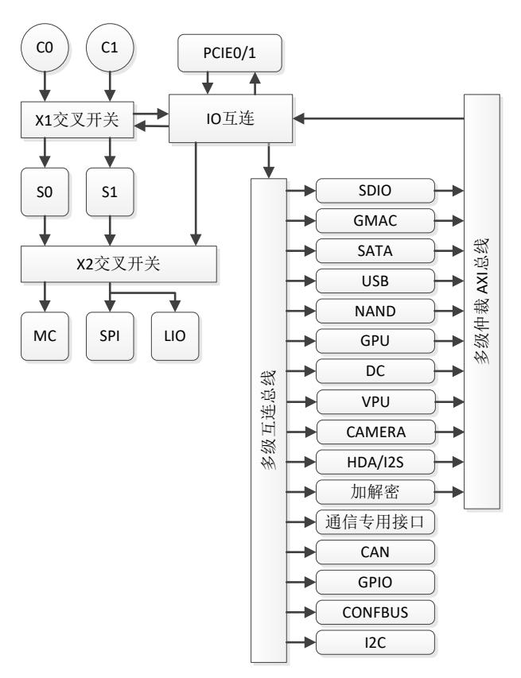

图 1.1 龙芯 2K1000 结构图

### 1.2 芯片特性

#### 1.2.1 处理器核

- LA264
- LoongArch 体系结构

- ⚫ 32KB 数据 Cache 和 32KB 的指令 Cache
- ⚫ 1M 共享二级 Cache
- ⚫ 通过目录协议维护 I/O DMA 访问的 Cache 一致性

#### 1.2.2 **GPU**

- ⚫ 支持 OpenVG
- ⚫ YUV 色域空间转换
- ⚫ 高质量缩放

### 1.2.3 显示控制器

- ⚫ 双 DVO(通用并行显示接口)输出
- ⚫ 硬件光标
- ⚫ 伽玛校正
- ⚫ 输出抖动
- ⚫ 最高支持 DVO165MHz 1080p
- ⚫ 支持线性显示缓冲
- ⚫ 上电序列控制

### 1.2.4 内存控制器

- ⚫ 64 位 DDR3 控制器,最高工作频率 533MHz
- ⚫ 不支持 ECC
- ⚫ 支持 64/32/16 位模式
- ⚫ 支持命令调度

#### 1.2.5 **SATA** 控制器

- ⚫ 1 个独立 SATA 端口
- ⚫ 支持 SATA 1.5Gbps 和 SATA2 代 3Gbps 的传输
- ⚫ 兼容串行 ATA 2.6 规范和 AHCI 1.1 规范
- ⚫ 低功耗设计

#### 1.2.6 **USB2.0** 控制器

- ⚫ 4 个独立的 USB2.0 的 HOST 端口
- ⚫ 其中端口 0 固定为 OTG 工作模式
- ⚫ 兼容 USB1.1 和 USB2.0
- ⚫ 内部 EHCI 控制和实现高速传输可达 480Mbps
- ⚫ 内部 OHCI 控制和实现全速和低速传输
- ⚫ 低功耗管理

#### 1.2.7 **GMAC** 控制器

- ⚫ 两路 10/100/1000Mbps 自适应以太网 MAC
- ⚫ 双网卡均兼容 IEEE 802.3
- ⚫ 对外部 PHY 实现 RGMII 接口
- ⚫ 半双工/全双工自适应
- ⚫ Timestamp 功能
- ⚫ 半双工时,支持碰撞检测与重发(CSMA/CD)协议
- ⚫ 支持 CRC 校验码的自动生成与校验,支持前置符生成与删除
- ⚫ 支持网络开机

### 1.2.8 **HDA** 控制器

- ⚫ 支持 16,18 和 20 位采样精度支持可变速率
- ⚫ 最高达 192KHz
- ⚫ 7.1 声道环绕立体声输出
- ⚫ 三路音频输入

#### 1.2.9 **NAND** 控制器

- ⚫ 最大支持单片 16GB NAND Flash
- ⚫ 最大支持 4 个片选
- ⚫ 支持 MLC
- ⚫ 支持 512/2K/4K/8K 页

#### 1.2.10 **SPI** 控制器

- ⚫ 双缓冲接收器
- ⚫ 极性和相位可编程的串行时钟
- ⚫ 主模式支持
- ⚫ 支持到 4 个的变长字节传输
- ⚫ 支持系统启动
- ⚫ 支持标准读、连续地址读、快速读、双路 I/O 等 SPI Flash 读模式

#### 1.2.11 **UART**

- ⚫ 3 个全功能 UART 和流控 TXD,RXD,CTS, RTS, DSR,DTR,DCD, RI
- ⚫ 最大 12 个 UART 接口
- ⚫ 在寄存器与功能上兼容 NS16550A
- ⚫ 两路全双工异步数据接收/发送
- ⚫ 可编程的数据格式
- ⚫ 16 位可编程时钟计数器
- ⚫ 支持接收超时检测
- ⚫ 带仲裁的多中断系统
- ⚫ 可配置为 4 个两线串口(TXD/RXD)

#### 1.2.12 **I2C** 总线

- ⚫ 兼容 SMBUS(100Kbps)
- ⚫ 与 PHILIPS I2C 标准相兼容
- ⚫ 履行双向同步串行协议
- ⚫ 只实现主设备操作
- ⚫ 能够支持多主设备的总线
- ⚫ 总线的时钟频率可编程
- ⚫ 可以产生开始/停止/应答等操作
- ⚫ 能够对总线的状态进行探测
- ⚫ 支持低速和快速模式
- ⚫ 支持 7 位寻址和 10 位寻址
- ⚫ 支持时钟延伸和等待状态

#### 1.2.13 **PWM**

- ⚫ 32 位计数器
- ⚫ 支持脉冲生成及捕获
- ⚫ 4 路控制器

#### 1.2.14 **HPET**

- ⚫ 32 位计数器
- ⚫ 支持 1 个周期性中断
- ⚫ 支持 2 个非周期性中断

#### 1.2.15 **RTC**

- ⚫ 计时精确到 0.1 秒
- ⚫ 可产生 3 个计时中断
- ⚫ 支持定时开机功能

#### 1.2.16 **Watchdog**

- ⚫ 32 比特计数器及初始化寄存器
- ⚫ 低功耗模式暂停功能

### 1.2.17 中断控制器

- ⚫ 支持软件设置中断
- ⚫ 支持电平与边沿触发
- ⚫ 支持中断屏蔽与使能
- ⚫ 支持固定中断均衡和智能中断均衡

### 1.2.18 **ACPI** 功耗管理

- ⚫ 处理器核动态频率电压调节
- ⚫ 全芯片时钟门控
- ⚫ PHY 可关断
- ⚫ USB/GMAC 可唤醒
- ⚫ 来电可自动启动

### 1.2.19 **PCIE** 接口

- ⚫ 兼容 PCIE 2.0
- ⚫ 双独立 X4 接口
- ⚫ 其中一路 X4 接口可以配置为 4 个 X1 接口
- ⚫ 其中一路 X4 接口可以配置为 2 个 X1 接口

### 1.2.20 **I2S** 控制器

- ⚫ 支持 master 模式下 I2S 输入
- ⚫ 支持 master 模式下 I2S 输出
- ⚫ 支持 8、16、18、20、24、32 位宽
- ⚫ 支持单声道和立体声道音频数据
- ⚫ 支持(16、22.05、32、44.1、48)kHz 采样频率
- ⚫ 支持 DMA 传输模式

### 1.2.21 **CAN** 总线

- ⚫ 符合 CAN2.0 规范
- ⚫ 两路 CAN 接口
- ⚫ 支持中断
- ⚫ 复用 GPIO

#### 1.2.22 加解密模块

- ⚫ AES、DES 算法支持
- ⚫ RSA 算法支持

#### 1.2.23 **SDIO** 控制器

- ⚫ 1 路独立 SDIO 控制器
- ⚫ 兼容 SD Memory 2.0/MMC/SDIO 2.0 协议

#### 1.2.24 **GPIO**

- ⚫ 4 位专用 GPIO 引脚,56 位复用 GPIO 引脚
- ⚫ 其余引脚与其他接口相复用,使用各个接口电压域

7

### 1.2.25 **VPU** 解码器

- ⚫ 支持 H264
- ⚫ 支持 MPEG-4
- ⚫ 支持 MPEG-2
- ⚫ 支持 MPEG-1
- ⚫ 支持 JPEG

### 1.2.26 **CAMERA** 控制器

- ⚫ 兼容 ITU-R BT 601/656 8-bit 模式外部接口(支持同步信号产生的同步 或是嵌入式同步)
- ⚫ 使用内嵌的 DMA 方式进行存取数据操作
- ⚫ 8-bit 视频数据输入,输入数据顺序固定,为 U01Y0V01Y1U23Y2V23Y3……(因为这是最为常用的 4:2:2 格式的 数据顺序)
- ⚫ 独立于图片尺寸的水平和垂直的尺寸设置
- ⚫ 可编程水平、垂直同步信号极性

### **1.3** 芯片分级

芯片各个质量等级版本的说明如下:

| 芯片标识         | 质量等级  | 典型电压  | 电源噪声  | 漏电流(常温) | 工作温度(壳温) | 说明        |
|--------------|-------|-------|-------|---------|----------|-----------|
| LS2K1000LA   | 商业级   | 1.15V | ±25mV | 300mA   | 0-70℃    | 主频 1.0GHz |
| LS2K1000LA-i | 普通工业级 | 1.15V | ±25mV | 250mA   | -40-85℃  | 主频 800M   |

### **1.4** 文档约定

### 1.4.1 信号命名

信号名的选取以方便记忆和明确标识功能为原则。低有效信号以 n 结尾, 高有效信号则不带 n。如无特别说明,以 ACPI/GMAC/USB 开头的信号位于 RSM 域;以 RTC 开头的信号位于 RTC 域;其它信号位于 SOC 域。

### 1.4.2 信号类型

| 代码       | 描述   |
|----------|------|
| A        | 模拟   |
| DIFF I/O | 双向差分 |
| DIFF IN  | 差分输入 |
| DIFF OUT | 差分输出 |
| I        | 输入   |
| I/O      | 双向   |
| O        | 输出   |
| OD       | 开漏输出 |
| P        | 电源   |
| G        | 地    |

### 1.4.3 信号说明

- 1) 对于内部默认上下拉的电阻阻值,除了特殊说明外,其他所有上拉阻值约为 45KΩ,下拉阻值约为55KΩ。
- 2) 关于引脚在不使用时的情况,已经在描述里进行说明,没有说明的信号都可 以浮空。
- 3) 除特殊情况外,差分信号合并进行说明,以P/N分别代表正/负端
- 4) 引脚复用配置寄存器的相关配置详见用户手册。

### 1.4.4 数值表示

16 进制数表示为'hxxx,2 进制数表示为'bxx,其它数字为 10 进制。

功能相同但标号有别的引脚(如 DDR\_DQ0, DDR\_DQ1, …)使用方括号加 数字范围的形式简写(如 DDR\_DQ[63:0])。类似地,寄存器域也采用这种表 示方式。

### 1.4.5 寄存器域

寄存器域以[寄存器名].[域名]的形式加以引用。如 chip\_config0.uart\_split 指 芯片配置寄存器 0(chip\_config0)的 uart\_split 域。

### **2** 引脚定义

### **2.1 DDR3** 接口

| 信号名称                           | 类型       | 描述                        | 电压      | 内部上下拉 |
|--------------------------------|----------|---------------------------|---------|-------|
| DDR_DQ[63:0]                   | I/O      | DDR3 SDRAM 数据总线信号         | 1V5/DDR | 无     |
| DDR_DQSp[7:0] DDR_DQSn[7:0] | DIFF I/O | DDR3 SDRAM 数据选通           | 1V5/DDR | 无     |
| DDR_DQM[7:0]                   | O        | DDR3 SDRAM 数据屏蔽           | 1V5/DDR | 无     |
| DDR_A[15:0]                    | O        | DDR3 SDRAM 地址总线信号         | 1V5/DDR | 无     |
| DDR_BA[2:0]                    | O        | DDR3 SDRAM 逻辑 Bank 地址信号   | 1V5/DDR | 无     |
| DDR_WEn                        | O        | DDR3 SDRAM 写使能信号          | 1V5/DDR | 无     |
| DDR_CASn                       | O        | DDR3 SDRAM 列地址选择信号        | 1V5/DDR | 无     |
| DDR_RASn                       | O        | DDR3 SDRAM 行地址选择信号        | 1V5/DDR | 无     |
| DDR_CSn[3:0]                   | O        | DDR3 SDRAM 片选信号           | 1V5/DDR | 无     |
| DDR_CKE[3:0]                   | O        | DDR3 SDRAM 时钟使能信号         | 1V5/DDR | 无     |
| DDR_CKp[7:0] DDR_CKn[7:0]   | DIFF OUT | DDR3 SDRAM 差分时钟输出信号       | 1V5/DDR | 无     |
| DDR_ODT[3:0]                   | O        | DDR3 SDRAM ODT 信号         | 1V5/DDR | 无     |
| DDR_RESETn                     | O        | DDR3 SDRAM 复位控制信号         | 1V5/DDR | 无     |
| DDR_REXT                       | I/O      | DDR3 SDRAM 参考电阻(外接 240 欧) | 1V5/DDR | 无     |

### **2.2 PCIE** 接口

| 信号名称               | 类型       | 描述                      | 电压       | 内部上下拉 |
|--------------------|----------|-------------------------|----------|-------|
| PCIE[1:0]_CLKp     |          |                         | 1V1/PCIE | 无     |
| PCIE[1:0]_CLKn     | DIFF IN  | PCIE 参考时钟输入             |          |       |
| PCIE0_REFCLKp[3:0] |          |                         | 1V1/PCIE | 无     |
| PCIE0_REFCLKn[3:0] | DIFF OUT | PCIE0 参考时钟输出            |          |       |
| PCIE1_REFCLKp[1:0] |          |                         | 1V1/PCIE | 无     |
| PCIE1_REFCLKn[1:0] | DIFF OUT | PCIE1 参考时钟输出            |          |       |
|                    |          | 外部参考电阻,通过 200ohm(+/-1%) | -        | 无     |
| PCIE[1:0]_REFRES   | A        | 电阻连至地                   |          |       |
| PCIE[1:0]_TXp[3:0] |          |                         | 1V1/PCIE | 无     |
| PCIE[1:0]_TXn[3:0] | DIFF OUT | PCIE 差分数据输出             |          |       |
| PCIE[1:0]_RXp[3:0] |          |                         | 1V1/PCIE | 无     |
| PCIE[1:0]_RXn[3:0] | DIFF IN  | PCIE 差分数据输入             |          |       |
| PCIE0_PRSNT[3:0]   | I        | PCIE0 插卡检测              | 3V3/IO   | 无     |
| PCIE1_PRSNT[1:0]   | I        | PCIE1 插卡检测              | 3V3/IO   | 无     |
| PCIE_RSTn          | O        | PCIE 复位                 | 3V3/IO   | 无     |

### **2.3 DVO** 接口

| 信号名称             | 类型 | 描述                                       | 电压     | 内部上下拉 |
|------------------|----|------------------------------------------|--------|-------|
| DVO[1:0]_CLKp    | O  | DVO 正向时钟输出                               | 3V3/IO | 无     |
| DVO[1:0]_CLKn    | O  | DVO 反向时钟输出,与 DVO*_CLKp 相 差 180°,非差分关系 | 3V3/IO | 无     |
| DVO[1:0]_HSYNC   | O  | DVO 水平同步                                 | 3V3/IO | 无     |
| DVO[1:0]_VSYNC   | O  | DVO 垂直同步                                 | 3V3/IO | 无     |
| DVO[1:0]_DE      | O  | DVO 数据有效                                 | 3V3/IO | 无     |
|                  |    | DVO 显示数据                                 | 3V3/IO | 无     |
|                  |    | [23:16]为 R 数据                            |        |       |
| DVO[1:0]_D[23:0] | O  | [15:08]为 G 数据                            |        |       |
|                  |    | [07:00]为 B 数据                            |        |       |

#### DVO 接口数据信号与 RGB 对应关系如下:

| DVO 接口信号 | 24 位模式 | 18 位模式 |
|----------|--------|--------|
| DVO_D0   | B0     |        |
| DVO_D1   | B1     |        |
| DVO_D2   | B2     | B0     |
| DVO_D3   | B3     | B1     |
| DVO_D4   | B4     | B2     |
| DVO_D5   | B5     | B3     |
| DVO_D6   | B6     | B4     |
| DVO_D7   | B7     | B5     |
| DVO_D8   | G0     |        |
| DVO_D9   | G1     |        |
| DVO_D10  | G2     | G0     |
| DVO_D11  | G3     | G1     |
| DVO_D12  | G4     | G2     |
| DVO_D13  | G5     | G3     |
| DVO_D14  | G6     | G4     |
| DVO_D15  | G7     | G5     |
| DVO_D16  | R0     |        |
| DVO_D17  | R1     |        |
| DVO_D18  | R2     | R0     |
| DVO_D19  | R3     | R1     |
| DVO_D20  | R4     | R2     |
| DVO_D21  | R5     | R3     |
| DVO_D22  | R6     | R4     |
| DVO_D23  | R7     | R5     |

#### DVO0 接口与 LIO 以及 UART 有复用关系,如下表

| 信号名称          | 复用名称         | 复用类型 | 复用信号描述        | 电压     |
|---------------|--------------|------|---------------|--------|
| DVO0_CLKp     | LIO_RDn      | O    | LIO RDn 输出    | 3V3/IO |
| DVO0_CLKn     | LIO_WRn      | O    | LIO WRn 输出    | 3V3/IO |
| DVO0_HSYNC    | LIO_DEN      | O    | LIO DEN 输出    | 3V3/IO |
| DVO0_VSYNC    | LIO_DIR      | O    | LIO DIR 输出    | 3V3/IO |
| DVO0_DE       | LIO_ADLOCK   | O    | LIO ADLOCK 输出 | 3V3/IO |
| DVO0_D[15:0]  | LIO_AD[15:0] | I/O  | LIO 双向 AD 信号  | 3V3/IO |
| DVO0_D[22:16] | LIO_A[6:0]   | O    | LIO 地址低位      | 3V3/IO |
| DVO0_D23      | LIO_CSn      | O    | LIO 片选信号      | 3V3/IO |

| 信号名称       | 复用名称      | 复用类型 | 复用信号描述           | 电压     |
|------------|-----------|------|------------------|--------|
| DVO0_HSYNC | UART1_TXD | O    | 串口数据输出           | 3V3/IO |
| DVO0_VSYNC | UART1_RXD | I    | 串口数据输入           | 3V3/IO |
| DVO0_DE    | UART1_RTS | O    | 串口数据传输请求         | 3V3/IO |
| DVO0_D00   | UART1_DTR | O    | 串口初始化完成          | 3V3/IO |
| DVO0_D01   | UART1_RI  | I    | 外部 MODEM 探测到振铃信号 | 3V3/IO |
| DVO0_D02   | UART1_CTS | I    | 设备接受数据就绪         | 3V3/IO |
| DVO0_D03   | UART1_DSR | I    | 设备初始化完成          | 3V3/IO |
| DVO0_D04   | UART1_DCD | I    | 外部 MODEM 探测到载波信号 | 3V3/IO |
| DVO0_D05   | UART2_TXD | O    | 串口数据输出           | 3V3/IO |
| DVO0_D06   | UART2_RXD | I    | 串口数据输入           | 3V3/IO |
| DVO0_D07   | UART2_RTS | O    | 串口数据传输请求         | 3V3/IO |
| DVO0_D08   | UART2_DTR | O    | 串口初始化完成          | 3V3/IO |
| DVO0_D09   | UART2_RI  | I    | 外部 MODEM 探测到振铃信号 | 3V3/IO |
| DVO0_D11   | UART2_CTS | I    | 设备接受数据就绪         | 3V3/IO |
| DVO0_D12   | UART2_DSR | I    | 设备初始化完成          | 3V3/IO |
| DVO0_D13   | UART2_DCD | I    | 外部 MODEM 探测到载波信号 | 3V3/IO |

DVO1 接口与 CAMERA 接口有复用关系,参考 [2.8](#page-25-0) 节。

### **2.4 GMAC** 接口

| 信号名称               | 类型 | 描述         | 电压           | 内部上下拉 |
|--------------------|----|------------|--------------|-------|
| GMAC[1:0]_TXCK     | O  | RGMII 发送时钟 | 2V5/3V3/GMAC | 无     |
| GMAC[1:0]_TCTL     | O  | RGMII 发送控制 | 2V5/3V3/GMAC | 无     |
| GMAC[1:0]_TXD[3:0] | O  | RGMII 发送数据 | 2V5/3V3/GMAC | 无     |
| GMAC[1:0]_RXCK     | I  | RGMII 接收时钟 | 2V5/3V3/GMAC | 无     |
| GMAC[1:0]_RCTL     | I  | RGMII 接收控制 | 2V5/3V3/GMAC | 无     |
| GMAC[1:0]_RXD[3:0] | I  | RGMII 接收数据 | 2V5/3V3/GMAC | 无     |

| GMAC[1:0]_MDCK | O  | SMA 接口时钟,需外接 4.7k 上 拉电阻 | 2V5/3V3/GMAC | 无 |
|----------------|----|----------------------------|--------------|---|
| GMAC[1:0]_MDIO | OD | SMA 接口数据,需外接 4.7k 上 拉电阻 | 2V5/3V3/GMAC | 无 |

#### GMAC1 接口与 GPIO 有复用关系,如下表所示:

| 信号名称           | 复用名称       | 复用类型 | 复用信号描述      | 电压           |
|----------------|------------|------|-------------|--------------|
| GMAC1_TXCK     | -          | -    | -           | -            |
| GMAC1_TCTL     | GPIO13     | I/O  | 通用输入输出 13   | 2V5/3V3/GMAC |
| GMAC1_TXD[3:0] | GPIO[12:9] | I/O  | 通用输入输出 12-9 | 2V5/3V3/GMAC |
| GMAC1_RXCK     | -          | -    | -           | -            |
| GMAC1_RCTL     | GPIO8      | I/O  | 通用输入输出 8    | 2V5/3V3/GMAC |
| GMAC1_RXD[3:0] | GPIO[7:4]  | I/O  | 通用输入输出 7-4  | 2V5/3V3/GMAC |
| GMAC1_MDCK     | -          | -    | -           | -            |
| GMAC1_MDIO     | -          | -    | -           | -            |

### **2.5 SATA** 接口

| 信号名称         | 类型      | 描述                          | 电压       | 内部上下拉 |
|--------------|---------|-----------------------------|----------|-------|
| SATA_REFCLKp |         | 差分 100MHz 参考时钟输入(内部有备份时     | 1V1/SATA | 无     |
| SATA_REFCLKn | DIFF IN | 钟,通过软件选择)                   |          |       |
|              |         | 外部参考电阻,通过 200ohm(+/-1%)电阻连至 | -        | 无     |
| SATA_REFRES  | A       | 地                           |          |       |
| SATA_TXp     |         |                             | 1V1/SATA | 无     |
| SATA_TXn     |         | DIFF OUT SATA 差分数据输出        |          |       |
| SATA_RXp     |         |                             | 1V1/SATA | 无     |
| SATA_RXn     | DIFF IN | SATA 差分数据输入                 |          |       |
| SATA_LEDn    | OD      | SATA 工作状态,低表示有数据传输          | 3V3/IO   | 无     |

#### SATA 接口的 SATA\_LEDn 与 GPIO 有复用关系,如下表所示:

| 信号名称      | 复用名称   | 复用类型 | 复用信号描述    | 电压     |
|-----------|--------|------|-----------|--------|
| SATA_LEDn | GPIO14 | I/O  | 通用输入输出 14 | 3V3/IO |

### **2.6 USB** 接口

| 信号名称             | 类型  | 描述                          | 电压       | 内部上下拉 |
|------------------|-----|-----------------------------|----------|-------|
|                  |     | 当 USB 使用外部时钟源或者需要 USB 唤醒时,必 | A3V3/USB | 无     |
| USB_XI           |     | 须在 USB_XO 上接晶振,USB 使用内部时钟源时 |          |       |
| USB_XO           | I/O | USB_XO 可悬空。                 |          |       |
|                  |     | USB_XI 保留不用,板级悬空。           |          |       |
| USB[3:0]_TXRTUNE | A   | 参考电阻,通过 200ohm/1%电阻连接到地     | A3V3/USB | 无     |

| USB[3:0]_DP | I/O | USB D+,通过 15K 电阻下拉到地,该电阻已在芯 片内部集成                    | A3V3/USB | 无 |
|-------------|-----|---------------------------------------------------------|----------|---|
| USB[3:0]_DM | I/O | USB D-,通过 15K 电阻下拉到地,该电阻已在芯 片内部集成                    | A3V3/USB | 无 |
| USB0_ID     | I   | USB0 OTG ID 输入                                          | A3V3/USB | 无 |
| USB0_VBUS   | A   | USB0 OTG VBUS 输入                                        | 5V       | 无 |
| USB[3:1]_OC | I   | USB 过流检测输入,需注意该信号为高有效                                   | 3V3/RSM  | 无 |
| USB0_OC     | O   | OTG DRVVBUS 输出,用于控制外部 5V 电压是否 输入到 USB0_VBUS。无过流检测功能。 | 3V3/RSM  | 无 |

注:USB15kΩ下拉电阻无需再在外部连接

### **2.7 HDA** 接口

| 信号名称       | 类型 | 描述                   | 电压     | 内部上下拉 |
|------------|----|----------------------|--------|-------|
| HDA_BITCLK | O  | HDA BITCLK 输出        | 3V3/IO | 无     |
| HDA_SDI0   | I  | HDA 数据输入,连接第一个 codec | 3V3/IO | 无     |
| HDA_SDI1   | I  | HDA 数据输入,连接第二个 codec | 3V3/IO | 无     |
| HDA_SDI2   | I  | HDA 数据输入,连接第三个 codec | 3V3/IO | 无     |
| HDA_SDO    | O  | HDA 数据输出             | 3V3/IO | 无     |
| HDA_SYNC   | O  | HDA 同步               | 3V3/IO | 无     |
| HDA_RESETn | O  | HDA 复位               | 3V3/IO | 无     |

HDA 接口与 I2S 以及 GPIO 复用,具体复用关系如下:

表 2-1 HDA 与 I2S 复用关系

| 信号名称       | 复用名称     | 复用类型 | 复用信号描述     | 电压     |
|------------|----------|------|------------|--------|
| HDA_BITCLK | I2S_BCLK | I    | I2S bit 时钟 | 3V3/IO |
| HDA_SDI0   | I2S_DI   | I    | I2S 数据输入   | 3V3/IO |
| HDA_SDI1   | -        | -    | -          | 3V3/IO |
| HDA_SDI2   | -        | -    | -          | 3V3/IO |
| HDA_SDO    | I2S_DO   | O    | I2S 数据输出   | 3V3/IO |
| HDA_SYNC   | I2S_MCLK | O    | I2S MCLK   | 3V3/IO |
| HDA_RESETn | I2S_LR   | O    | I2S 左右声道选择 | 3V3/IO |

表 2-2 HDA 与 GPIO 复用关系

| 信号名称       | 复用名称   | 复用类型 | 复用信号描述    | 电压     |
|------------|--------|------|-----------|--------|
| HDA_BITCLK | GPIO24 | I/O  | 通用输入输出 24 | 3V3/IO |
| HDA_SDI0   | GPIO28 | I/O  | 通用输入输出 28 | 3V3/IO |
| HDA_SDI1   | GPIO29 | I/O  | 通用输入输出 29 | 3V3/IO |
| HDA_SDI2   | GPIO30 | I/O  | 通用输入输出 30 | 3V3/IO |
| HDA_SDO    | GPIO27 | I/O  | 通用输入输出 27 | 3V3/IO |

| HDA_SYNC   | GPIO25 | I/O | 通用输入输出 25 | 3V3/IO |
|------------|--------|-----|-----------|--------|
| HDA_RESETn | GPIO26 | I/O | 通用输入输出 26 | 3V3/IO |

### **2.8 CAMERA** 接口

表 2-3 CAMERA 接口信号

| 信号名称          | 类型 | 描述                     | 内部上下拉 |
|---------------|----|------------------------|-------|
| CAM_PCLK      | I  | 像素时钟,被摄像头的处理器驱动        | 无     |
| CAM_HSYNC     | I  | 水平同步,被摄像头的处理器驱动        | 无     |
| CAM_VSYNC     | I  | 帧同步,被摄像头的处理器驱动         | 无     |
| CAM_DATA[7:0] | I  | 像素数据,被摄像头的处理器驱动        | 无     |
| CAM_CLOCK     | O  | XCLK 被摄像头控制器驱动,用于摄像头模块 | 无     |

注:控制信号都是单向的,只支持 camera 提供时钟和同步信号的模式

#### 表 2-4CAMERA 与 DVO1 复用关系

| 信号名称          | 复用名称        | 复用类型 | 复用信号描述      |
|---------------|-------------|------|-------------|
| CAM_PCLK      | DVO1_CKN    | I    | DVO1 负时钟输出  |
| CAM_HSYNC     | DVO1_HSYNC  | I    | DVO1 水平同步信号 |
| CAM_VSYNC     | DVO1_VSYNC  | I    | DVO1 垂直同步信号 |
| CAM_DATA[7:0] | DVO1_D[7:0] | I    | DOV1 数据输出信号 |
| CAM_CLOCK     | DVO1_CKP    | O    | DVO1 正时钟输出  |

### **2.9 SPI** 接口

| 信号名称     | 类型 | 描述       | 电压     | 内部上下拉 |
|----------|----|----------|--------|-------|
| SPI_SCK  | O  | SPI 时钟输出 | 3V3/IO | 无     |
| SPI_CSn0 | O  | SPI 片选 0 | 3V3/IO | 无     |
| SPI_CSn1 | O  | SPI 片选 1 | 3V3/IO | 无     |
| SPI_CSn2 | O  | SPI 片选 2 | 3V3/IO | 无     |
| SPI_CSn3 | O  | SPI 片选 3 | 3V3/IO | 无     |
| SPI_SDO  | O  | SPI 数据输出 | 3V3/IO | 上拉    |
| SPI_SDI  | I  | SPI 数据输入 | 3V3/IO | 上拉    |

#### **2.10 I 2C** 接口

| 信号名称     | 类型 | 描述      | 电压     | 内部上下拉 |
|----------|----|---------|--------|-------|
| I2C0_SCL | O  | I2C0 时钟 | 3V3/IO | 无     |
| I2C0_SDA | OD | I2C0 数据 | 3V3/IO | 无     |
| I2C1_SCL | O  | I2C1 时钟 | 3V3/IO | 无     |
| I2C1_SDA | OD | I2C1 数据 | 3V3/IO | 无     |

I2C 与 GPIO 有复用,复用关系见下表:

表 2-5 I2C 与 GPIO 复用关系

| 信号名称     | 复用名称   | 复用类型 | 复用信号描述    | 电压     |
|----------|--------|------|-----------|--------|
| I2C0_SCL | GPIO16 | I/O  | 通用输入输出 16 | 3V3/IO |
| I2C0_SDA | GPIO17 | I/O  | 通用输入输出 17 | 3V3/IO |
| I2C1_SCL | GPIO18 | I/O  | 通用输入输出 18 | 3V3/IO |
| I2C1_SDA | GPIO19 | I/O  | 通用输入输出 19 | 3V3/IO |

### **2.11 UART** 接口

| 信号名称     | 类型 | 描述               | 电压     | 内部上下拉 |
|----------|----|------------------|--------|-------|
| UART_TXD | O  | 串口数据输出           | 3V3/IO | 无     |
| UART_RXD | I  | 串口数据输入           | 3V3/IO | 无     |
| UART_RTS | O  | 串口数据传输请求         | 3V3/IO | 无     |
| UART_DTR | O  | 串口初始化完成          | 3V3/IO | 无     |
| UART_RI  | I  | 外部 MODEM 探测到振铃信号 | 3V3/IO | 无     |
| UART_CTS | I  | 设备接受数据就绪         | 3V3/IO | 无     |
| UART_DSR | I  | 设备初始化完成          | 3V3/IO | 无     |
| UART_DCD | I  | 外部 MODEM 探测到载波信号 | 3V3/IO | 无     |

2K1000 仅有一个非复用引脚的串口(UART0)。所有串口通过设置可以工作在 2x4 和 4x2 模式,各种模式的管脚对应关系如下。

表 2-6 UART 接口复用关系

| 1x8     | 2x4     | 4x2     |
|---------|---------|---------|
| TXD0(O) | TXD0(O) | TXD0(O) |
| RTS0(O) | RTS0(O) | TXD5(O) |
| DTR0(O) | TXD3(O) | TXD3(O) |
| RXD0(I) | RXD0(I) | RXD0(I) |
| CTS0(I) | CTS0(I) | RXD5(I) |
| DSR0(I) | RXD3(I) | RXD3(I) |
| DCD0(I) | CTS3(I) | RXD4(I) |
| RI0(I)  | RTS3(O) | TXD4(O) |
| 1x8     | 2x4     | 4x2     |
| TXD1(O) | TXD1(O) | TXD1(O) |
| RTS1(O) | RTS1(O) | TXD8(O) |
| DTR1(O) | TXD6(O) | TXD6(O) |
| RXD1(I) | RXD1(I) | RXD1(I) |
| CTS1(I) | CTS1(I) | RXD8(I) |
| DSR1(I) | RXD6(I) | RXD6(I) |
| DCD1(I) | CTS6(I) | RXD7(I) |
| RI1(I)  | RTS6(O) | TXD7(O) |
| 1x8     | 2x4     | 4x2     |

| TXD2(O) | TXD2(O) | TXD2(O)  |
|---------|---------|----------|
| RTS2(O) | RTS2(O) | TXD11(O) |
| DTR2(O) | TXD9(O) | TXD9(O)  |
| RXD2(I) | RXD2(I) | RXD2(I)  |
| CTS2(I) | CTS2(I) | RXD11(I) |
| DSR2(I) | RXD9(I) | RXD9(I)  |
| DCD2(I) | CTS9(I) | RXD10(I) |
| RI2(I)  | RTS9(O) | TXD10(O) |

### **2.12 NAND** 接口

| 信号名称           | 类型  | 描述                  | 电压     | 内部上下拉 |
|----------------|-----|---------------------|--------|-------|
| NAND_CEn[3:0]  | O   | NAND 片选 3-0         | 3V3/IO | 无     |
| NAND_CLE       | O   | NAND 命令锁存           | 3V3/IO | 无     |
| NAND_ALE       | O   | NAND 地址锁存           | 3V3/IO | 无     |
| NAND_WRn       | O   | NAND 写信号            | 3V3/IO | 无     |
| NAND_RDn       | O   | NAND 读信号            | 3V3/IO | 无     |
|                |     | NAND 准备好输入 3-0,需要外接 | 3V3/IO | 无     |
| NAND_RDYn[3:0] | I   | 4.7k 上拉电阻           |        |       |
| NAND_D[7:0]    | I/O | NAND 命令/地址/数据线      | 3V3/IO | 无     |

NAND 与 GPIO 有复用,复用关系见下表:

表 2-7 NAND 与 GPIO 复用关系

| 信号名称           | 复用名称        | 复用类型 | 复用信号描述       | 电压     |
|----------------|-------------|------|--------------|--------|
| NAND_CEn[3:0]  | GPIO[47:44] | I/O  | 通用输入输出 47-44 | 3V3/IO |
| NAND_CLE       | GPIO48      | I/O  | 通用输入输出 48    | 3V3/IO |
| NAND_ALE       | GPIO49      | I/O  | 通用输入输出 49    | 3V3/IO |
| NAND_WRn       | GPIO50      | I/O  | 通用输入输出 50    | 3V3/IO |
| NAND_RDn       | GPIO51      | I/O  | 通用输入输出 51    | 3V3/IO |
| NAND_RDYn[3:0] | GPIO[55:52] | I/O  | 通用输入输出 55-52 | 3V3/IO |
| NAND_D[7:0]    | GPIO[63:56] | I/O  | 通用输入输出 63-56 | 3V3/IO |

注:目前 GPIO[51:44]需要被禁用,功能在后期芯片版本或启用

### **2.13 CAN** 接口

| 信号名称    | 类型 | 描述            | 电压     | 内部上下拉 |
|---------|----|---------------|--------|-------|
| CAN0_RX | I  | CAN 通道 0 数据接收 | 3V3/IO | 无     |
| CAN0_TX | O  | CAN 通道 0 数据发送 | 3V3/IO | 无     |
| CAN1_RX | I  | CAN 通道 1 数据接收 | 3V3/IO | 无     |
| CAN1_TX | O  | CAN 通道 1 数据发送 | 3V3/IO | 无     |

CAN 接口与 GPIO 有复用,如下表所示:

#### 表 2-8 CAN 与 GPIO 复用关系

| 信号名称    | 复用名称   | 复用类型 | 复用信号描述    | 电压     |
|---------|--------|------|-----------|--------|
| CAN0_RX | GPIO32 | I/O  | 通用输入输出 32 | 3V3/IO |
| CAN0_TX | GPIO33 | I/O  | 通用输入输出 33 | 3V3/IO |
| CAN1_RX | GPIO34 | I/O  | 通用输入输出 34 | 3V3/IO |
| CAN1_TX | GPIO35 | I/O  | 通用输入输出 35 | 3V3/IO |

### **2.14 SDIO** 接口

| 信号名称           | 类型  | 描述          | 电压     | 内部上下拉 |
|----------------|-----|-------------|--------|-------|
| SDIO_CLK       | O   | SDIO 时钟输出   | 3V3/IO | 无     |
| SDIO_CMD       | I/O | SDIO 命令输入输出 | 3V3/IO | 上拉    |
| SDIO_DATA[3:0] | I/O | SDIO 数据信号   | 3V3/IO | 上拉    |

SDIO 与 GPIO 有复用,复用关系见下表:

表 2-9 SDIO 与 GPIO 复用关系

| 信号名称           | 复用名称        | 复用类型 | 复用信号描述       | 电压     |
|----------------|-------------|------|--------------|--------|
| SDIO_CLK       | GPIO41      | I/O  | 通用输入输出 41    | 3V3/IO |
| SDIO_CMD       | GPIO40      | I/O  | 通用输入输出 40    | 3V3/IO |
| SDIO_DATA[3:0] | GPIO[39:36] | I/O  | 通用输入输出 39-36 | 3V3/IO |

### **2.15 PWM** 接口

| 信号名称     | 类型 | 描述     | 电压     | 内部上下拉 |
|----------|----|--------|--------|-------|
| PWM[3:0] | O  | PWM 输出 | 3V3/IO | 无     |

PWM 与 GPIO 有复用,复用关系如下:

表 2-10 PWM 与 GPIO 复用关系

| 信号名称     | 复用名称        | 复用类型 | 复用信号描述       | 电压     |
|----------|-------------|------|--------------|--------|
| PWM[3:0] | GPIO[23:20] | I/O  | 通用输入输出 23-20 | 3V3/IO |

### **2.16 GPIO** 接口

下表仅列出专用的 4 个 GPIO 引脚信号,其他 GPIO 为复用信号,可参考其他信号定 义。默认情况下所有与 GPIO 复用的引脚为 GPIO 功能(GMAC1 除外),且都为输入状 态。

| 信号名称   | 类型  | 描述     |        | 内部上下拉 |
|--------|-----|--------|--------|-------|
| GPIO00 | I/O | 通用输入输出 | 3V3/IO | 无     |
| GPIO01 | I/O | 通用输入输出 | 3V3/IO | 无     |
| GPIO02 | I/O | 通用输入输出 | 3V3/IO | 无     |
| GPIO03 | I/O | 通用输入输出 | 3V3/IO | 无     |

### **2.17 PLL** 电源接口

| 信号名称         | 类型 | 描述            | 电压     | 内部上下拉 |
|--------------|----|---------------|--------|-------|
| PLL_CORE_VDD | P  | CORE PLL 电源   | 1V2/IO | 无     |
| PLL_SOC_VDD  | P  | SOC PLL 电源    | 1V2/IO | 无     |
| PLL_DDR_VDD  | P  | DDR PLL 电源    | 1V2/IO | 无     |
| PLL_PIX0_VDD | P  | PIXEL0 PLL 电源 | 1V2/IO | 无     |
| PLL_PIX1_VDD | P  | PIXEL1 PLL 电源 | 1V2/IO | 无     |
| PLL_CORE_VSS | G  | CORE PLL 地    | 0V/IO  | 无     |
| PLL_SOC_VSS  | G  | SOC PLL 地     | 0V/IO  | 无     |
| PLL_DDR_VSS  | G  | DDR PLL 地     | 0V/IO  | 无     |
| PLL_PIX0_VSS | G  | PIXEL0 PLL 地  | 0V/IO  | 无     |
| PLL_PIX1_VSS | G  | PIXEL1 PLL 地  | 0V/IO  | 无     |

### **2.18** 电源管理接口

| 信号名称          | 类型 | 描述                    | 电压      | 内部上下拉 |
|---------------|----|-----------------------|---------|-------|
|               |    | ACPI 使能               | 3V3/RSM | 上拉    |
|               |    | 0:不使能 ACPI 功能,此时除了复   |         |       |
|               |    | 位信号(ACPI_SYSRSTn)外,其他 |         |       |
| ACPI_EN       | I  | 电源管理信号无效              |         |       |
|               |    | 1:使能 ACPI 功能          |         |       |
|               |    | (板级必须控制,可根据需要设置为      |         |       |
|               |    | 0 或 1)                |         |       |
| ACPI_SYSRSTn  | I  | 系统复位                  | 3V3/RSM | 无     |
| ACPI_RINGn    | I  | 振铃唤醒                  | 3V3/RSM | 无     |
| ACPI_WAKEn    | I  | PCIE 唤醒               | 3V3/RSM | 无     |
| ACPI_LID      | I  | 屏盖状态                  | 3V3/RSM | 无     |
| ACPI_PWRTYPE  | I  | 供电来源                  | 3V3/RSM | 无     |
| ACPI_BATLOWn  | I  | 电源电量低                 | 3V3/RSM | 无     |
| ACPI_SUSSTATn | O  | 低功耗状态                 | 3V3/RSM | 无     |
| ACPI_S3n      | O  | S3 状态                 | 3V3/RSM | 无     |
| ACPI_S4n      | O  | S4 状态                 | 3V3/RSM | 无     |
| ACPI_S5n      | O  | S5 状态                 | 3V3/RSM | 无     |
| ACPI_VID[5:0] | O  | 调压控制                  | 3V3/RSM | 无     |

| ACPI_PLTRSTn | O | 平台复位   | 3V3/RSM | 无 |
|--------------|---|--------|---------|---|
| ACPI_SLPLANn | O | 网络电源控制 | 3V3/RSM | 无 |
| ACPI_PWRBTNn | I | 电源开关   | 3V3/RSM | 无 |
| ACPI_PWROK   | I | 电源有效   | 3V3/RSM | 无 |

### **2.19 JTAG** 接口

| 信号名称      | 类型 | 描述                                | 电压     | 内部上下拉 |
|-----------|----|-----------------------------------|--------|-------|
| JTAG_SEL  | I  | JTAG 选择(1:JTAG;0:CPU_JTAG) 3V3/IO |        | 下拉    |
| JTAG_TCK  | I  | JTAG 时钟                           | 3V3/IO | 无     |
| JTAG_TDI  | I  | JTAG 数据输入                         | 3V3/IO | 上拉    |
| JTAG_TMS  | I  | JTAG 模式                           | 3V3/IO | 上拉    |
| JTAG_TRST | I  | JTAG 复位                           | 3V3/IO | 上拉    |
| JTAG_TDO  | O  | JTAG 数据输出                         | 3V3/IO | 无     |

### **2.20** 测试接口

| 信号名称 类型   |   | 描述              | 电压  | 内部上下拉 |
|--------------|---|-----------------|-----|-------|
|              |   | 测试模式控制(RTC 电压域) | RTC | 上拉    |
| ACPI_DOTESTn | I | 0: 测试模式         |     |       |
|              |   | 1: 功能模式         |     |       |

### **2.21** 时钟配置信号

| 信号名称        | 类型 | 描述            | 电压     | 内部上下拉 |
|-------------|----|---------------|--------|-------|
| SYS_SYSCLK  | I  | 100MHz 参考时钟   | 3V3/IO | 无     |
| SYS_TESTCLK | I  | 测试时钟输入,默认不用连接 | 3V3/IO | 无     |

### **2.22** 系统相关信号

| 信号名称                | 类型 | 描述                       | 电压     | 内部上下拉   |
|---------------------|----|--------------------------|--------|---------|
|                     |    | PLL 时钟配置输入               | 3V3/IO | bit0:下拉 |
| SYS_CLKSEL[1:0]     | I  | 00=低频模式,01=高频模式,10=软件模式  |        | bit1:上拉 |
|                     |    | (DFT),11=bypass 模式       |        |         |
|                     |    | 启动选择输入                   | 3V3/IO | bit0:上拉 |
| SYS_BOOTSEL[1:0]    | I  | 00=LIO,01=SPI(DFT)       |        | bit1:下拉 |
|                     |    | USB 时钟输入配置输入             | 3V3/IO | bit0:上拉 |
| SYS_USBCLKMODE[1:0] | I  | 10=one 12MHz clock input |        | bit1:上拉 |
|                     |    | 11=use sysclk(DFT)       |        |         |
| SYS_PCIECLKSEL      | I  | PCIE 参考时钟选择输入            | 3V3/IO | 下拉      |

|                   |   | 0=内部(DFT),1=PAD 输入      |        |    |
|-------------------|---|-------------------------|--------|----|
|                   |   | PCIE 参考时钟频率输入           | 3V3/IO | 下拉 |
| SYS_PCIECLKDIV    | I | 0=100MHz(DFT),1=200MHz  |        |    |
|                   |   | NAND ECC 功能使能输入         | 3V3/IO | 下拉 |
| SYS_NANDRSRD      | I | 1=enable,0=disable(DFT) |        |    |
| SYS_NANDTYPE[1:0] | I | 配置为 00                  | 3V3/IO | 上拉 |

### **2.23 RTC** 相关信号

| 信号名称             | 类型  | 描述                                    | 电压  | 内部上下拉 |
|------------------|-----|---------------------------------------|-----|-------|
|                  |     | RSM 域复位,要求在 RSM 域电源稳定 1ms 后拉高,在       | RTC | 无     |
| RTC_RSMRSTn I |     | RSM 域电源降至 95%及以下时立即拉低。                |     |       |
| RTC_RSTn         | I   | RTC 域复位,建议在 RTC 电源稳定 10ms 后再解除复位。 RTC |     | 无     |
| RTC_XI           | I/O | 32.768KHz 晶体或晶振输入 RTC              |     | 无     |
| RTC_XO           | I/O | 32.768KHz 晶体输出                        | RTC | 无     |

### **2.24** 电源地

| 信号名称         | 类型 | 描述                     | 电压        | 内部上下拉 |
|--------------|----|------------------------|-----------|-------|
| VSS          | G  | 数字地                    | 0         | 无     |
| VDD          | P  | 数字电源                   | 1.15V     | 无     |
| ACPI_3V3     | P  | RSM 域 IO 电源            | 3.3V      | 无     |
| DDR_VDDE     | P  | DDR3 IO 电源             | 1.5V      | 无     |
| DDR_VREF     | P  | DDR3 VREF              | 0.75V     | 无     |
| GMAC_VDDE    | P  | GMAC 数字电源              | 2.5V/3.3V | 无     |
| IO_3V3       | P  | IO 电源                  | 3.3V      | 无     |
| PEST_1V1     | P  | PCIE/SATA vp 和 vptx 电源 | 1.1V      | 无     |
| PEST_3V3     | P  | PCIE/SATA vph 电源       | 3.3V      | 无     |
| RTC_3V       | P  | RTC 域电源                | 2.7V      | 无     |
| USB_A3V3     | P  | USB 模拟电源               | 3.3V      | 无     |
| VDD_RSM      | p  | RSM 域电源                | 1.1V      | 无     |
| PLL_CORE_VDD | P  | NODE PLL 电源            | 1.2V      | 无     |
| PLL_DDR_VDD  | P  | DDR PLL 电源             | 1.2V      | 无     |
| PLL_SOC_VDD  | P  | DC PLL 电源              | 1.2V      | 无     |
| PLL_PIX0_VDD | p  | PIX0 PLL 电源            | 1.2V      | 无     |
| PLL_PIX1_VDD | P  | PIX1 PLL 电源            | 1.2V      | 无     |

### **2.25** 外设功能复用表

模块层次的功能复用关系如下表所示:

表 2-11 外设功能复用表

| 功能 0     | 功能 1     | 功能 2      | 功能 3     | 功能 4     | 功能 5      |
|----------|----------|-----------|----------|----------|-----------|
| DDR3     |          |           |          |          |           |
| PCIE     |          |           |          |          |           |
| SATA     | GPIO(1)  |           |          |          |           |
| USB      |          |           |          |          |           |
| GMAC0    |          |           |          |          |           |
| GMAC1    | GPIO(14) |           |          |          |           |
| DVO0     |          | Local Bus | UART1(8) | UART1(4) | UART1(2)  |
|          |          |           |          |          | UART8(2)  |
|          |          |           |          | UART6(4) | UART6(2)  |
|          |          |           |          |          | UART7(2)  |
|          |          |           | UART2(8) | UART2(4) | UART2(2)  |
|          |          |           |          |          | UART11(2) |
|          |          |           |          | UART9(4) | UART9(2)  |
|          |          |           |          |          | UART10(2) |
|          |          |           |          |          |           |
| DVO1     |          |           | CAMERA   |          |           |
|          |          |           |          |          |           |
| CAN      | GPIO(4)  |           |          |          |           |
| HDA      | GPIO(7)  |           |          | I2S      |           |
| SPI      |          |           |          |          |           |
| RTC      |          |           |          |          |           |
| I2C      | GPIO(4)  |           |          |          |           |
|          |          |           | UART0(8) | UART0(4) | UART0(2)  |
|          |          |           |          |          | UART5(2)  |
|          |          |           |          | UART3(4) | UART3(2)  |
|          |          |           |          |          | UART4(2)  |
| NAND     | GPIO(20) |           |          |          |           |
| CPU_JTAG |          | JTAG      |          |          |           |
|          | GPIO(4)  |           |          |          |           |
| PWM      | GPIO(4)  |           |          |          |           |
| SDIO     | GPIO(6)  |           |          |          |           |
| ACPI     |          |           |          |          |           |

### **2.26** 不使用 **IO** 引脚处理

不使用的 IO 引脚需按以下原则处理:

| 信号组  | 不使用的处理方式                                                                                |  |  |
|------|-----------------------------------------------------------------------------------------|--|--|
| DDR3 | 位模式只用低 位数据线,不用的信号需拉低。 DDR 32/16 32/16                                          |  |  |
| PCIE | 输出可悬空,输入需拉低                                                                             |  |  |
| DVO  | 可悬空                                                                                     |  |  |
| GMAC | 输出可悬空,输入需拉低                                                                             |  |  |
| SATA | 输出可悬空,输入需拉低                                                                             |  |  |
| USB  | 需拉低                                                                                     |  |  |
| HDA  | 输出可悬空,输入需拉低                                                                             |  |  |
| SPI  | 输出可悬空,输入需拉低,配置引脚必须正确上下拉                                                                 |  |  |
| I2C  | 需拉低                                                                                     |  |  |
| UART | 输出可悬空,输入需拉低                                                                             |  |  |
| NAND | 配置引脚必须正确上下拉                                                                             |  |  |
| GPIO | 由软件设置为输出则可悬空                                                                            |  |  |
| ACPI | 作系统复位, ACPI_SYSRSTn 上拉, ACPI_DOTESTn 上拉, ACPI_RSMRSTn 其它信号输出可悬空,输入需拉低 |  |  |
| JTAG | 需下拉,其它信号可悬空 JTAG_TRST/TDI                                                            |  |  |
| 时钟配置 | 必须正确连接                                                                                  |  |  |
| 电源地  | 电源地不可悬空 PCIE和SATA均不使用时,相关电源(PEST_1V1/3V3)可接地                                         |  |  |
|      | 其它电源地必须正确连接                                                                             |  |  |

### **3** 功能描述

### **3.1 DDR3 SDRAM** 控制器接口描述

龙芯 2K1000 处理器内部集成的内存控制器的设计遵守 DDR3 SDRAM 的行业 标准(JESD79-3)。所实现的所有内存读/写操作都遵守 JESD79-3 的规定。

### 3.1.1 **DDR3 SDRAM** 接口工作频率范围

支持 133-533MHZ 工作频率。

#### 3.1.2 **DDR3 SDRAM** 控制器特性

龙芯 2K1000 处理器支持最大 4 个 CS(由 4 个片选信号实现,即两个双面内存 条),一共含有 19 位的地址总线(即:16 位的行列地址总线和 3 位的逻辑 Bank 总线)。

在具体选择使用不同内存芯片类型时,可以调整 DDR3 控制器参数设置进行支 持。其中,支持的最大片选(CS\_n)数为 4,行地址(RAS\_n)数为 16,列地址 (CAS\_n)数为 16,逻辑体选择(BANK\_n)数为 3。

CPU 发送的内存请求物理地址可以根据控制器内部不同的配置进行多种不同的 地址映射。

内存控制器接收从处理器或外部设备发送的内存读写请求。无论是读还是写操 作,内存控制器都处在 slave 状态。

内存控制器中实现了动态页管理功能。对于内存的一次存取,不需软件设计者 的干预,控制器会在硬件电路上选择 Open Page/Close Page 策略。

龙芯 2K1000 处理器中内存控制器具有如下特征:

- ⚫ 接口上命令、读写数据全流水操作
- ⚫ 内存命令合并、排序提高整体带宽
- ⚫ 配置寄存器读写端口,可以修改内存设备的基本参数
- ⚫ 内建动态延迟补偿电路(DCC),用于数据的可靠发送和接收
- ⚫ 支持 133-533MHZ 工作频率

### 3.1.3 **DDR3 SDRAM** 读协议

DDR3 SDRAM 读协议如图 3.1 所示,命令(CMD)包括 RAS\_n,CAS\_n 和 WE\_n。当一个读请求发生时,RAS\_n=1,CAS\_n=0,WE\_n=1。

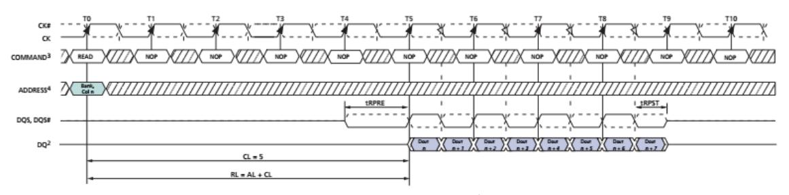

图 3.1 DDR3 SDRAM 读协议

注:Cas Latency = 5, Read Latency = 5, Burst Length = 8

### 3.1.4 **DDR3 SDRAM** 写协议

DDR3 SDRAM 写操作的协议如图 [3.2](#page-35-6) 所示。在图中命令 CMD 是由 RAS\_n, CAS\_n 和 WE\_n,共三个信号组成的。对于写操作,RAS\_n=1,CAS\_n=0,WE\_n =0。另外,与读操作不同,写操作需要 DQM 来标识写操作的掩码,即需要写入 的字节数。DQM 与图中 DQs 信号同步。

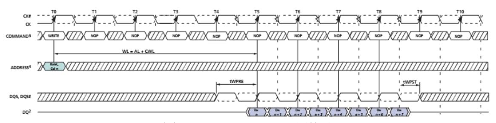

图 3.2 DDR3 SDRAM 写协议

注:Cas Latency = 5, Write Latency = 5, Burst Length = 8.

### **3.2 DVO** 显示接口

DVO 接口为通用并行显示接口,其工作频率范围为 50M - 200MHz。

### **3.3 SPI** 接口

串行外围设备接口 SPI 总线技术是 Motorola 公司推出的多种微处理器、微控制 器以及外围设备之间的一种全双工、同步、串行数据接口标准。

本系统集成的 SPI 控制器仅可作为主控端,所连接的是从设备。对于软件而言,SPI 控制器除了有若干 IO 寄存器外还有一段映射到 SPI Flash 的只读 memory 空间。如果将这段 memory 空间分配在 0x1fc00000,复位后不需要软件干预就可以直接访问,从而支持处理器从 SPI Flash 启动。

以下列举了 SPI 管脚信号与外设通信的时序图:

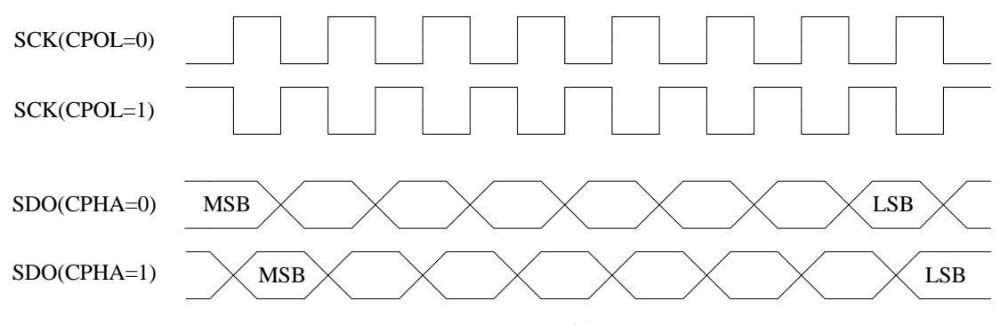

图 3.3 SPI 主控制器接口时序

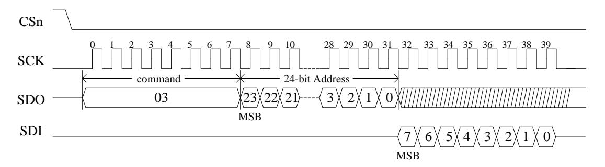

图 3.4 SPI Flash 标准读时序

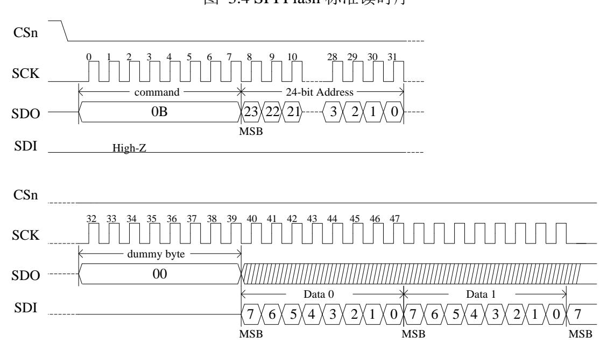

图 3.5 SPI Flash 快速读时序

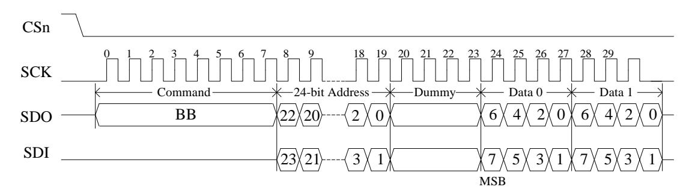

图 3.6 SPI Flash 双向 I/O 读时序

#### **3.4 LIO**

LocalIO 控制器提供了简单外设访问接口,主要用于连接系统启动 ROM。它对外提供一个片选,具有可配置的数据位宽和访问延迟。其中 wait 参数指 liord 或 liowr 信号为低的周期数减一,读写时序可参考图 3.7 LocalIO 读时序和图 3.8 LocalIO 写时序。当数据位宽为 16 时,送出的地址由 CPU 物理地址右移一位得到。

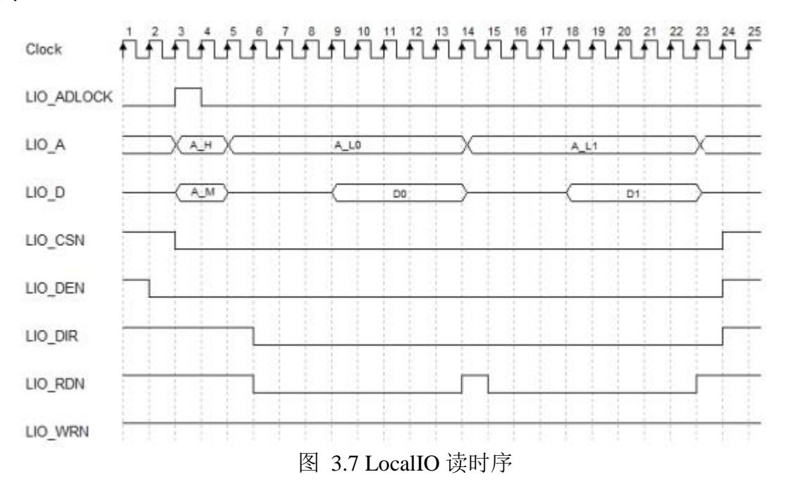

27 龙芯中科技术股份有限公司 Loongson Technology Corporation Limited

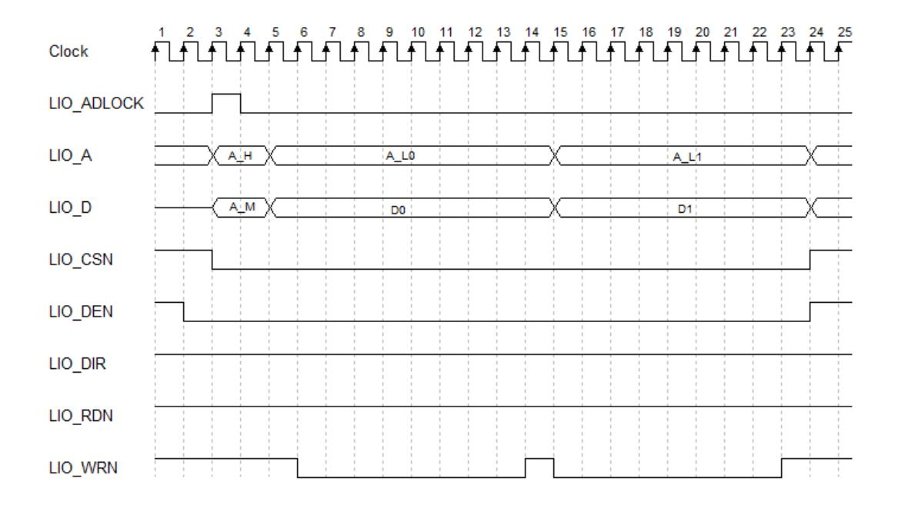

图 3.8 LocalIO 写时序

#### 说明:

- ⚫ 图中 clock 信号实际并不存在,只是为了方便时序描述
- ⚫ A\_H 代表地址 bit23-bit29(8 位模式)/bit24-bit30(16 位模式)
- ⚫ A\_M 代表地址 bit7-bit22(8 位模式)/bit8-bit23(16 位模式)
- ⚫ A\_L 代表低 7 位地址
- ⚫ 在 big\_mem 设置为 0 时,第 4 拍波形不存在,第 4 拍之后的波形向前推一 拍
- ⚫ LIO\_WRN 和 LIO\_RDN 低有效时间与 LIO clock\_period\_i 设置有关
- ⚫ LIO clock\_period\_i 设置为 1 时-低电平持续 8 拍
- ⚫ LIO clock\_period\_i 设置为 2 时-低电平持续 16 拍
- ⚫ LIO clock\_period\_i 设置为 3/0 时-低电平持续 32 拍
- ⚫ 一次 CS 有效期间可能出现多次读写操作,以上时序图仅作为一种示例

### **3.5** 电源管理

- ⚫ 龙芯 2K1000 电源管理模块提供系统功耗管理实现机制
- ⚫ 支持 Advanced Configuration and Power Interface, Version 4.0a(ACPI),提供相 应的功耗管理功能
- ⚫ 系统休眠与唤醒,支持 ACPI S3(待机到内存),ACPI S4(待机到硬 盘),ACPI S5(软关机),并且支持电源失效检测和自动系统恢复。支

持多种唤醒方式(USB,GMAC,电源开关等)

- ⚫ 动态性能功耗控制,支持处理器核 DVFS 控制,支持动态关闭媒体解码协 处理器电源
- ⚫ 系统时钟控制,模块时钟门控,多种方式调节频率
- ⚫ 提供温度管理控制功能。支持 3 级报警机制
- ⚫ 支持硬件看门狗功能。

#### **3.6 GPIO**

龙芯 2K1000 共有 60 个 GPIO 引脚, 其中 4 个为专用 GPIO,其余 56 个与其 他功能复用。

#### **3.7 UART**

2K1000 集成了 12 个 UART 控制器,通过 APB 总线与总线桥通信。

UART 控制器提供与 MODEM 或其他外部设备串行通信的功能,例如与另外 一台计算机,以 RS232 为标准使用串行线路进行通信。该控制器在设计上能很好 地兼容国际工业标准半导体设备 16550A。

其中,UART0、UART3、UART4、UART5 复用 UART0 接口;UART1、 UART6、UART7、UART8 复用 UART1 接口;UART2、UART9、UART10、 UART11 复用 UART2 接口。

### **3.8 CAN**

龙芯 2K1000 集成了两路 CAN 接口控制器。

CAN 总线是由发送数据线 TX 和接收数据线 RX 构成的串行总线,可发送和 接收数据。器件与器件之间进行双向传送,最高传送速率 1Mbps。

#### **3.9 I2C**

2K1000 芯片集成了 I2C 接口,主要用于实现两个器件之间数据的交换。

I2C 总线是由数据线 SDA 和时钟 SCL 构成的串行总线,可发送和接收数据。 器件与器件之间进行双向传送,最高传送速率 400kbps。

#### **3.10 PWM**

2K1000 芯片里实现了四路脉冲宽度调节/计数控制器,以下简称 PWM。

每一路 PWM 工作和控制方式完全相同。每路 PWM 有一路脉冲宽度输出信号 和一路待测脉冲输入信号。系统时钟高达 125MHz,计数寄存器和参考寄存器均 32 位数据宽度。

### **3.11 NAND**

NAND FLASH 控制器最大支持单片 16GB FLASH 的容量,最大页大小为 8KB,芯片最多支持 4 个片选和 4 个 RDY 信号,控制器支持 SLC 和 MLC 两种类 型 FLASH 的操作。

### **3.12 RTC**

实时时钟(RTC)单元可以在主板上电后进行配置,当主板断电后,该单元仍 然运作,可以仅靠板上的电池供电就正常运行。RTC 单元运行时电流仅几个微安。

RTC 包含振荡器,结合外部 32.768KHZ 晶体(或晶振)产生工作时钟,即使 不使用 RTC 功能也需要连接晶体(或晶振)。该时钟用于时间信息的维护以及产 生各种定时和计数中断。

#### **3.13 SDIO**

龙芯 2K1000 集成了一个 SDIO 控制器,用于 SD Memory 和 SDIO 卡的读写。

#### **3.14 GMAC**

龙芯 2K1000 集成了两个 GMAC 控制器,即 GMAC0 和 GMAC1,二者在逻辑 结构上完全相同。GMAC 控制器对外接口为 RGMII 接口,当外接 PHY 时由 PHY

提供发送和接收时钟的延时调整,GMAC 控制器并不集成该功能。

#### **3.15 OTG**

2K1000 的 OTG 支持特性如下:

- ⚫ 支持 HNP 与 SRP 协议
- ⚫ 内嵌 DMA,无需占用处理器带宽即可在 OTG 与外部存储之间移动数据
- ⚫ 在 device 模式下,为高速设备(480Mbps)
- ⚫ 在 host 模式下,仅能支持高速设备(480Mbps)
- ⚫ 在 device 模式下,支持 6 个双向的 endpoint,其中仅有默认的 endpoint0 支 持控制传输
- ⚫ 在 device 模式下,最多同时支持 4 个 IN 方向的传输
- ⚫ 在 host 模式下,支持 12 个 channel,且软件可配置每个 channel 的方向
- ⚫ 在 host 模式下,支持 periodic OUT 传输

#### **3.16 USB**

2K1000 的 USB 主机端口特性如下:

- ⚫ 兼容 USB Rev 1.1 、USB Rev 2.0 协议
- ⚫ 兼容 OHCI Rev 1.0 、EHCI Rev 1.0 协议
- ⚫ 支持 LS(Low Speed)、FS(Full Speed)和 HS(High Speed)的 USB 设 备
- ⚫ 支持四个端口,每个端口都可挂 LS、FS 或 HS 设备
- ⚫ USB 主机控制器模块包括一个支持高速设备的 EHCI 控制器,一个支持全 速与低速设备的 OHCI 控制器。其中 EHCI 控制器处于主控地位,只有当 挂上的设备是全速或低速设备时,才将控制权转交给 OHCI 控制器;当全 速或低速设备拔掉时,控制权返回 EHCI 控制器

### **3.17** 图形处理器

图形处理器频率范围 100-500MHz。

### **3.18** 显示控制器

显示控制器从内存中取帧缓冲和光标信息输出到外部显示接口上。 龙芯 2K1000 的显示控制器支持的特性包括:

- ⚫ 双路 DVO 接口显示
- ⚫ 每路显示最大支持至 1920x1080@60Hz
- ⚫ Monochrome、ARGB8888 两种模式硬件光标
- ⚫ RGB444/RGB555/RGB565/RGB666/RGB888 色深支持
- ⚫ 输出抖动和伽马校正
- ⚫ 可切换的双路线性帧缓冲
- ⚫ 中断和软复位

### **3.19 SATA**

SATA 的特性包括:

- ⚫ 支持 SATA 1 代 1.5Gbps和SATA2代3Gbps 的传输
- ⚫ 兼容串行 ATA2.6 和 AHCI1.1 规范

#### **3.20 PCIE**

龙芯 2K1000 有两个 PCIE 控制器,其中一个 PCIE 控制器既可以作为一个 X4 的 PCIE 端口也可以作为 4 个独立的 X1 PCIE 端口;另一个 PCIE 控制器既可以作 为一个 X4 的 PCIE 端口也可以作为 2 个独立的 X1 PCIE 端口,作为 X1 端口时, 仅 LANE0 和 LANE1 可用,LANE2 和 LANE3 不可用。

PCIE 接口有 6 个 PCIE\_\*\_PRSNTn 引脚分别对应 6 个 PCIE 控制端口,它 们用来使能对应的控制端口。PCB 板卡设计的原则是,使用哪个 PCIE 控制端 口,就将对应的 PRSNTn 引脚拉低。如果使用板载的方式连接 PCIE 接口转换芯 片,则需要把对应的 PRSNTn 引脚拉低;如果使用 PCIE 插槽,则需要将对应的 PRSNTn 引脚连接到 PCIE 插槽上。引脚的默认状态是上拉的,如果不使用对应 的控制端口,相应的 PRSNTn 引脚悬空即可。 比如,某个主板设计将 PCIE0 接 口的 lane0~2 当做 3 个 x1 的 PCIE 接口来使用,分别连接 PCIE 千兆网卡、 PCIE 转 USB 3.0、PCIE 转 SATA 3.0 设备,则需要将 PCIE0 的 PRSNTn0~2 拉

低,PCIE0 的 PRSNTn3 悬空即可。该主板将 PCIE1 接口的 4 个 lane 连接到一 个 x4 的 PCIE 插槽来扩展设备,则需要将 PCIE1 的 PRSNTn0 连接到插槽的对 应 PRSNT#引脚, PCIE1 的 PRSNTn1 悬空即可。 以上,每个控制器均支持 lane reverse 功能。当硬件使用该功能时,BIOS 软件需要进行相应修改以保证链路可以 正常建立。另外,每个 lane 均支持 lane polarity inversion 功能。

龙芯 2K1000 的 PCIE 控制器仅可以作为 RC 使用,不能作为 EP。

#### **3.21 HDA**

2K1000 的 HDA 音频控制器三路音频接口复用同一套芯片输出管脚,所以板级 可选用一套控制器来做设计应用。

#### **3.22 I2S**

龙芯 2K1000 中 I2S 控制器,数据宽度是 32 位,支持 DMA 传输,支持多家公 司的 codec 芯片。I2S 控制器仅支持主模式,由 I2S 产生位时钟信号和左右声道选 择时钟信号。I2S 的功能特性包括:

- ⚫ 支持 8、16、20、24、32 位的音频数据采样位宽
- ⚫ 支持 8、16、20、24、32 位的左右声道处理字宽
- ⚫ 包含两个缓存 FIFO,FIFO 的缓存容量为 8bytes
- ⚫ I2S 的中断处理模式可配,在 I2S 的发送和接收中断功能都使能后,当两 个通道的缓存 fifo 为满仍要写以及为空仍要读时,则向 CPU 发出中断信号
- ⚫ I2S 可以为 codec 芯片提供系统时钟,时钟频率可配

### **4** 初始化时序

### **4.1** 上电顺序

建议的上电时序如下图。

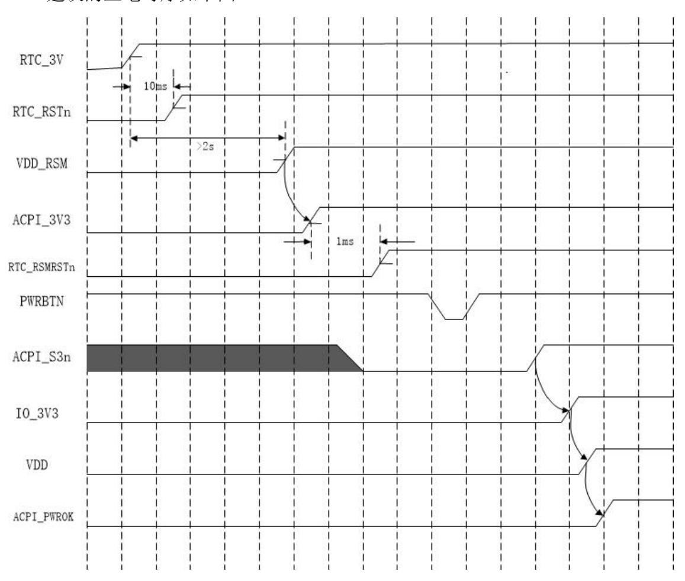

#### 1. RTC

A) RTC\_3V,2.7V

#### 2. RSM

- A) 1.1V 电源(VDD\_RSM)
- B) 2.5V 电源(GMAC\_VDDE)
- C) 3.3V 电源(USB\_A3V3/ACPI\_3V3)

以上三个电源上电间隔大于 1us。

#### 3. CORE

A) 3.3V IO 电源(IO\_3V3)

- B) 1.5V 电源
- C) 数字域电源, PCIE/SATA 电源(VDD/PEST 1V1)
- 以上电源上电间隔大于 lus。(此处上电顺序并非强制要求)

#### 4.2 掉电上电时序

龙芯 2K1000 的掉电及上电时序由内部的电源管理模块控制,其过程如下图所示:

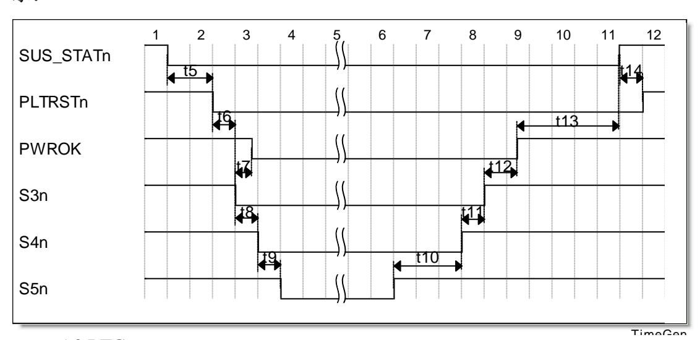

- t5:3 RTC
- t6:1 RTC
- t7:S3n 到 PWROK 无效
- t8:1 RTC
- t9:1 RTC
- t10: 间隔最小值为 1 RTC,最大值需满足 S4n 有效最小时间。
- t11: 间隔最小值为 1 RTC,最大值需满足 S3n 有效最小时间。
- t12: S3n 无效到系统上电成功(PWROK 为电源模块给出,指示最后一级电源上电成功)。
  - t13: 典型值为 7.87ms。
  - t14: 1 RTC

### **5** 电气特性

### **5.1** 电源

### 5.1.1 推荐工作条件

表 5-1 推荐的工作电源电压

| 电源           | 描述                     |       | 范围    |       | 最大电流  |
|--------------|------------------------|-------|-------|-------|-------|
|              |                        | Min.  | Typ.  | Max.  |       |
| VDD          | 数字域电源                  | 1.10V | 1.15V | 1.25V | 5A    |
| VDD_RSM      | RSM 域电源                | 1.05V | 1.1V  | 1.15V | 200mA |
| RTC_3V       | RTC 域电源                | 2.55V | 2.7V  | 2.85V | 10uA  |
| IO_3V3       | SOC 域 IO 电源            | 3.15V | 3.3V  | 3.45V | 200mA |
| ACPI_3V3     | RSM 域 IO 电源            | 3.15V | 3.3V  | 3.45V | 50mA  |
|              | RSM 域 RGMII 2.5V 电源    | 2.35V | 2.5V  | 2.65V | 50mA  |
| GMAC_VDDE    | RSM 域 RGMII 3.3V 电源    | 3.15V | 3.3V  | 3.45V | -     |
| DDR_VDDE     | DDR3 IO 电源             | 1.42V | 1.5V  | 1.58V | 1A    |
| DDR_VREF     | DDR3 VREF              | 0.72V | 0.75V | 0.78V | -     |
| USB_A3V3     | USB 模拟电源               | 3.15V | 3.3V  | 3.45V | 95mA  |
| PEST_1V1     | PCIE/SATA vp 和 vptx 电源 | 1.05  | 1.1V  | 1.15V | 500mA |
| PEST_3V3     | PCIE/SATA vph 电源       | 3.15V | 3.3V  | 3.45V | -     |
| PLL_CORE_VDD | NODE PLL 电源            | 1.15V | 1.2V  | 1.25V | 50mA  |
| PLL_DDR_VDD  | DDR PLL 电源             | 1.15V | 1.2V  | 1.25V | 50mA  |
| PLL_SOC_VDD  | DC PLL 电源              | 1.15V | 1.2V  | 1.25V | 50mA  |
| PLL_PIX0_VDD | PIX0 PLL 电源            | 1.15V | 1.2V  | 1.25V | 50mA  |
| PLL_PIX1_VDD | PIX1 PLL 电源            | 1.15V | 1.2V  | 1.25V | 50mA  |

### 5.1.2 绝对最大额定值

表 5-2 绝对最大额定值

| 参数        | 描述          | 最小   | 最大   | 单位 |
|-----------|-------------|------|------|----|
| VDD       | SOC 域电源     | -0.3 | 1.25 | V  |
| VDD_RSM   | RSM 域电源     | -0.3 | 1.21 | V  |
| RTC_3V    | RTC 域电源     | -0.3 | 3.0  | V  |
| IO_3V3    | SOC 域 IO 电源 | -0.3 | 3.47 | V  |
| ACPI_3V3  | RSM 域 IO 电源 | -0.3 | 3.47 | V  |
| GMAC_VDDE | RSM 域 IO 电源 | -0.3 | 3.47 | V  |
| DDR_VDDE  | DDR3 IO 电源  | -0.3 | 1.70 | V  |

| DDR_VREF | DDR3 参考电压              | -0.3 | 0.78 | V |
|----------|------------------------|------|------|---|
| USB_A3V3 | USB 模拟电源               | -0.3 | 3.47 | V |
| PEST_1V1 | PCIE/SATA vp 和 vptx 电源 | -0.3 | 1.21 | V |
| PEST_3V3 | PCIE/SATA vph 电源       | -0.3 | 3.47 | V |
| PLL_VDD  | PLL 电源                 | -0.3 | 1.26 | V |
| Tstg     | 存储温度                   | -50  | 125  | ℃ |
| Tc       | 工作温度                   | -40  | 85   | ℃ |
| MSL      | 湿敏等级                   |      | 3 级  |   |

### 5.1.3 功耗状态及优化

表 5-3 芯片功耗模式

| 运行模式                                                                                  | 条件(25℃)                                                                 | 功耗(W) |
|---------------------------------------------------------------------------------------|-------------------------------------------------------------------------|-------|
| CPU 1.25V, 1GHz; DDR 533MHz PCIe、SATA、USB 连接设备 峰值 进行 720P AVS 媒体播放 监测功耗峰值 |                                                                         | -     |
| 典型                                                                                    | CPU 1.1V, 800MHz; DDR 533MHz 运行 SPEC CPU2000 所有模块保持打开状态 测量平均功耗 |       |
| 低功耗                                                                                   | CPU 1.0V, 600MHz; DDR 200MHz PCIe、SATA 电源接地 软件无任务运行 测量平均功耗     | -     |

### 5.1.4 **ESD** 防护能力

静电放电敏感度(ESD):1000V(HBM)。

### **5.2** 参考时钟

### 5.2.1 单端时钟输入要求

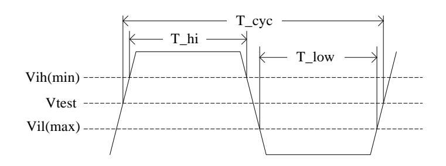

#### 图 5.1 单端参考时钟波形

| 时钟          | 参数        | 描述          | 最小       | 最大       | 单位   |
|-------------|-----------|-------------|----------|----------|------|
|             | Vih       | 输入高电平电压     | 2.0      | -        | V    |
|             | Vil       | 输入低电平电压     | -        | 0.8      | V    |
|             | T_cyc     | 时钟周期        | 9.99     | 10.01    | ns   |
| SYS_SYSCLK  | T_hi      | 高电平时间       | 40%T_cyc | 60%T_cyc | ns   |
|             | T_low     | 低电平时间       | 40%T_cyc | 60%T_cyc | ns   |
|             | Tslew     | 斜率(10%-90%) | 1        | 4        | V/ns |
|             | Tccjitter | 周期间抖动       | -        | 100      | ps   |
|             | Vih       | 输入高电平电压     | 2.0      | -        | V    |
|             | Vil       | 输入低电平电压     | -        | 0.8      | V    |
|             | T_cyc     | 时钟周期        | 30       | -        | ns   |
| JTAG_TCK    | T_hi      | 高电平时间       | 40%T_cyc | 60%T_cyc | ns   |
|             | T_low     | 低电平时间       | 40%T_cyc | 60%T_cyc | ns   |
|             | Tslew     | 斜率(10%-90%) | 1        | 4        | V/ns |
|             | Vih       | 输入高电平电压     | 2.0      | -        | V    |
|             | Vil       | 输入低电平电压     | -        | 0.8      | V    |
|             | T_cyc     | 时钟周期        | 30       |          | ns   |
| SYS_TESTCLK | T_hi      | 高电平时间       | 40%T_cyc | 60%T_cyc | ns   |
|             | T_low     | 低电平时间       | 40%T_cyc | 60%T_cyc | ns   |
|             | Tslew     | 斜率(10%-90%) | 1        | 4        | V/ns |

### 5.2.2 差分时钟输入要求

#### SATA 差分参考时钟特性

| 参数          | 要求          |  |  |
|-------------|-------------|--|--|
| 参考时钟频率类型    | 100M 差分时钟   |  |  |
| 参考时钟频率偏移    | -350~350ppm |  |  |
| 参考时钟随机抖动    | <3ps        |  |  |
| 参考时钟周期间抖动   | <150ps      |  |  |
| 占空比         | 40%~60%     |  |  |
| 共模电压        | 0~1.1V      |  |  |
| 差分输入摆幅      | >0.66V      |  |  |
| 边沿时间        | >0.6V/ns    |  |  |
| 参考差分时钟 skew | <200ps      |  |  |

#### PCIE 差分参考时钟特性

| 参数        | 要求          |
|-----------|-------------|
| 参考时钟频率类型  | 100M 差分时钟   |
| 参考时钟频率偏移  | -300~300ppm |
| 参考时钟周期间抖动 | <150ps      |

| 占空比         | 40%~60%  |
|-------------|----------|
| 共模电压        | 0~1.1V   |
| 差分输入摆幅      | >0.66V   |
| 边沿时间        | >0.6V/ns |
| 参考差分时钟 skew | <200ps   |

#### 5.2.3 差分时钟输出

| 时钟               | 参数          | 描述              | 最小    | 最大     | 单位   |
|------------------|-------------|-----------------|-------|--------|------|
|                  | Vrange      | 输出电压范围(单端)      | -200  | 1300   | mV   |
|                  | Vcrossrange | 交叉点范围           | 500   | 600    | mV   |
|                  | Vcrossdelta | 上升沿 Vcross 变动范围 | -     | 140    | mV   |
| PCIE[3:0]_CLKp/n | T_cyc       | 时钟周期            | 9.847 | 10.203 | ns   |
|                  | Duty cycle  | 占空比             | 40    | 60     | %    |
|                  | Tccjitter   | 周期间抖动           | -     | 150    | ps   |
|                  | Tslew       | 斜率(5pf 负载情况下)   | 2     | 3      | V/ns |

### **5.3 DDR3** 内存接口特性

### 5.3.1 推荐的直流工作条件

表 5-4 推荐的直流工作条件

| Symbol | Parameter                 | Min.  | Typ. | Max.  | Unit |
|--------|---------------------------|-------|------|-------|------|
| VDD    | Supply Voltage            | 1.425 | 1.5  | 1.575 | V    |
| VDDQ   | Supply Voltage for Output | 1.425 | 1.5  | 1.575 | V    |

### 5.3.2 交流和直流逻辑输入电平

#### 5.3.2.1 单端信号的交流和直流输入电平

表 5-5 控制信号和地址单端信号的交流和直流输入电平

|        |                                   | DDR3-800/1066 |              |      |
|--------|-----------------------------------|---------------|--------------|------|
| Symbol | Parameter                         | Min           | Max          | Unit |
|        | VIH.CA(DC100) DC input logic high | Vref + 0.100  | VDD          | V    |
|        | VIL.CA(DC100) DC input logic low  | VSS           | Vref - 0.100 | V    |
|        | VIH.CA(AC175) AC input logic high | Vref + 0.175  | Note 2       | V    |
|        | VIL.CA(AC175) AC input logic low  | Note 2        | Vref - 0.175 | V    |
|        | VIH.CA(AC150) AC input logic high | Vref + 0.150  | Note 2       | V    |

|            | VIL.CA(AC150) AC input logic low      | Note 2     | Vref - 0.150 | V |
|------------|---------------------------------------|------------|--------------|---|
| VRefCA(DC) | Reference Voltage for ADD, CMD inputs | 0.49 * VDD | 0.51 * VDD   | V |

表 5-6 DQ 和 DM 单端信号的交流和直流输入电平

|            |                                        |              | DDR3-800, DDR3-1066 |      |
|------------|----------------------------------------|--------------|---------------------|------|
| Symbol     | Parameter                              | Min          | Max                 | Unit |
|            | VIH.DQ(DC100) DC input logic high      | Vref + 0.100 | VDD                 | V    |
|            | VIL.DQ(DC100) DC input logic low       | VSS          | Vref - 0.100        | V    |
|            | VIH.DQ(AC175) AC input logic high      | Vref + 0.175 | -                   | V    |
|            | VIL.DQ(AC175) AC input logic low       | -            | Vref - 0.175        | V    |
|            | VIH.DQ(AC150) AC input logic high      | Vref + 0.150 | -                   | V    |
|            | VIL.DQ(AC150) AC input logic low       | -            | Vref - 0.150        | V    |
| VRefDQ(DC) | Reference Voltage for DQ, DM inputs | 0.49 * VDD   | 0.51 * VDD          | V    |

#### 5.3.2.2 差分信号的交流和直流输入电平

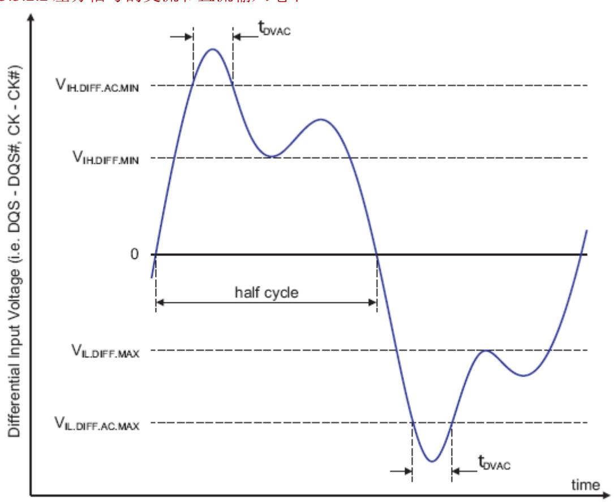

图 5.2 ac-swing 和 ac-level 时间点(tDVA)的差分定义

表 5-7 交流和直流的差分输入电平

|         |                              | DDR3-800,1066 |         |      |
|---------|------------------------------|---------------|---------|------|
| Symbol  | Parameter                    | Min           | Max     | Unit |
| VIHdiff | Differential input high      | + 0.200       | note 3  | V    |
| VILdiff | Differential input logic low | Note 3        | - 0.200 | V    |

|  | VIHdiff(ac) Differential input high ac | 2 x (VIH(ac) - Vref) | Note 3               | V |
|--|----------------------------------------|----------------------|----------------------|---|
|  | VILdiff(ac) Differential input low ac  | note 3               | 2 x (VIL(ac) - Vref) | V |

#### 5.3.2.3 差分信号输入的交叉点电压

为了保证严格的建立和保持时钟和选通时间以及输出偏差参数,每个交叉 点电压的差分输入信号(CK,CK#和 DQS,DQS#)必须满足表 [5-8](#page-51-4) 的要 求。差分输入的交叉点电压 VIX 的测量是从实际的交叉点的和补偿信号的 VDD 和 VSS 之间的中间点处获得。

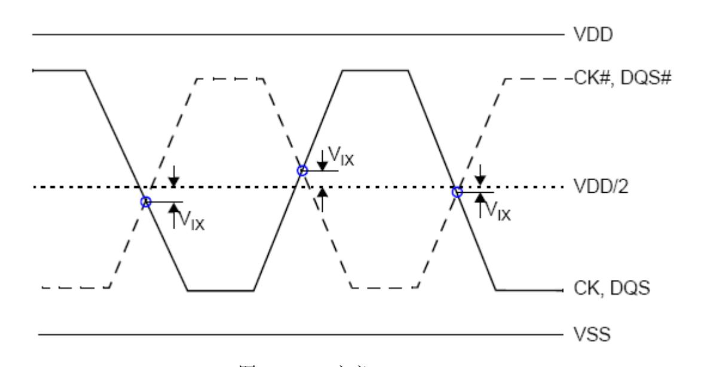

图 5.3 Vix 定义 表 5-8 差分输入信号(CK, DQS)交叉点电压

|        |                                                                               | DDR3-800, DDR3-1066 |     |      |
|--------|-------------------------------------------------------------------------------|---------------------|-----|------|
| Symbol | Parameter                                                                     | Min. Max.        |     | Unit |
|        | Differential Input Cross Point Voltage relative to VDD/2 for VIX CK,CK# |                     | 150 | mV   |
|        |                                                                               |                     | 175 | mV   |
| VIX    | Differential Input Cross Point Voltage relative to VDD/2 for DQS, DQS#     | -150                | 150 | mV   |

### 5.3.3 交流和直流逻辑输出电平

#### 5.3.3.1 单端信号的交流和直流输出电平

表 5-9 单端信号的交流直流输出电平

| Symbol  | Parameter                                                 | DDR3-800, 1066 | Unit |
|---------|-----------------------------------------------------------|----------------|------|
| VOH(DC) | DC output high measurement level (for IV curve linearity) | 0.8 x VDDQ     | V    |
| VOM(DC) | DC output mid measurement level (for IV curve linearity)  | 0.5 x VDDQ     | V    |
| VOL(DC) | DC output low measurement level (for IV curve linearity)  | 0.2 x VDDQ     | V    |

| VOH(AC) | AC output high measurement level (for output SR) | VTT + 0.1 x VDDQ | V |
|---------|--------------------------------------------------|------------------|---|
| VOL(AC) | AC output low measurement level (for output SR)  | VTT - 0.1 x VDDQ | V |

#### 5.3.3.2 差分信号的交流和直流输出电平

表 5-10 差分信号的交流和直流输出电平

| Symbol      | Parameter                                                     | DDR3-800, 1066 | Unit |
|-------------|---------------------------------------------------------------|----------------|------|
| VOHdiff(AC) | AC differential output high measurement level (for output SR) | + 0.2 x VDDQ   | V    |
| VOLdiff(AC) | AC differential output low measurement level (for output SR)  | - 0.2 x VDDQ   | V    |

#### 5.3.3.3 单端信号的输出斜率

作为时序测量的参考负载,单端信号的下降沿和上升沿输出斜率的定义和 测量在 VOL(AC)和 VOH(AC)之间,如表 [5-11](#page-52-4) 和图 [5.3](#page-51-5) 所示。

表 5-11 单端信号输出斜率的定义

|                                                | Measured |         |                                 |  |
|------------------------------------------------|----------|---------|---------------------------------|--|
| Description                                    | from     | to      | Defined by                      |  |
| Single-ended output slew rate for rising edge  | VOL(AC)  | VOH(AC) | [VOH(AC) -VOL(AC)] / DeltaTRse  |  |
| Single-ended output slew rate for falling edge | VOH(AC)  | VOL(AC) | [VOH(AC) - VOL(AC)] / DeltaTFse |  |

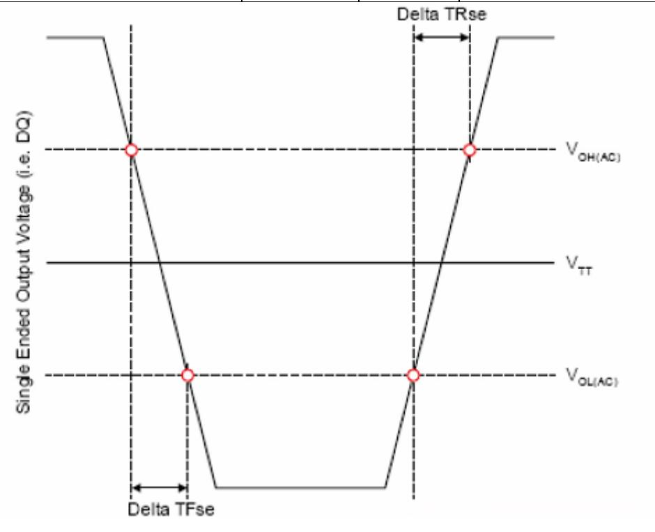

图 5.4 单端输出斜率的定义

表 5-12 单端的输出斜率

|                               |        | DDR3-800 |      | DDR3-1066 |      |      |  |
|-------------------------------|--------|----------|------|-----------|------|------|--|
| Parameter                     | Symbol | Min.     | Max. | Min.      | Max. | Unit |  |
| Single-ended Output Slew Rate | SRQse  | 2.5      | 5    | 2.5       | 5    | V/ns |  |

#### 5.3.3.4 差分输出斜率

表 5-13 差分输出斜率的定义

| Description                                    | Meas        | sured       | Defined by                                 |  |
|------------------------------------------------|-------------|-------------|--------------------------------------------|--|
| Description                                    | from        | to          | Defined by                                 |  |
| Differential output slew rate for rising edge  | VOLdiff(AC) | VOHdiff(AC) | [VOHdiff(AC) - VOLdiff(AC)]/DeltaTRdiff |  |
| Differential output slew rate for falling edge | VOHdiff(AC) | VOLdiff(AC) | [VOHdiff(AC) - VOLdiff(AC)]/DeltaTFdiff |  |

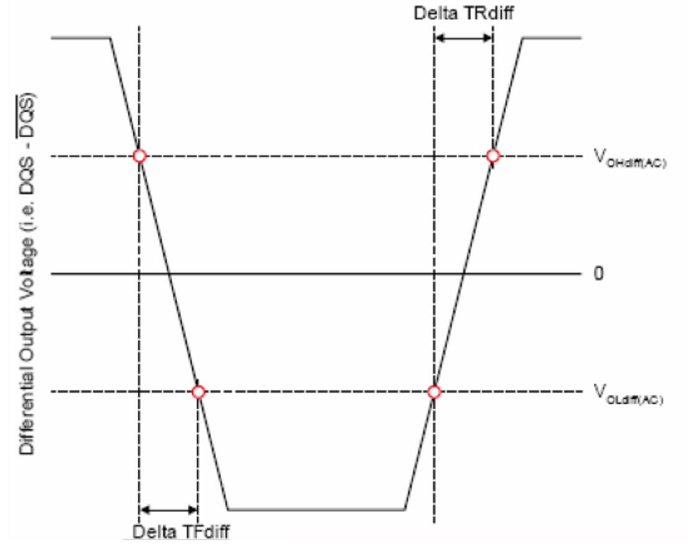

图 5.5 差分输出斜率的定义

表 5-14 差分输出斜率

|                               |         | DDI | 23-800 DDF |     | 3-1066 | TI24- |
|-------------------------------|---------|-----|------------|-----|--------|-------|
| Parameter                     | Symbol  | Min | Max        | Min | Max    | Units |
| Differential Output Slew Rate | SRQdiff | 5   | 10         | 5   | 10     | V/ns  |

#### 5.3.3.5 上冲和下冲的规范

表 5-15 地址和控制引脚的交流上冲/下冲规范

| Parameter                                           |      | DDR3- 1066 | Units |  |
|-----------------------------------------------------|------|---------------|-------|--|
| Maximum peak amplitude allowed for overshoot area.  | 0.4  | 0.4           | V     |  |
| Maximum peak amplitude allowed for undershoot area. | 0.4  | 0.4           | V     |  |
| Maximum overshoot area above VDD                    | 0.67 | 0.5           | V-ns  |  |
| Maximum undershoot area below VSS                   |      | 0.5           | V-ns  |  |
| (A0-A15, BA0-BA3, CS#, RAS#, CAS#, WE#, CKE, ODT)   |      |               |       |  |

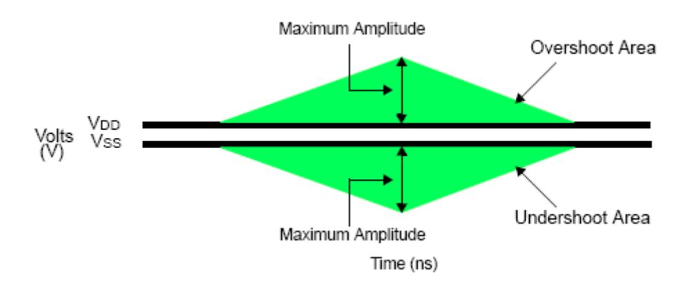

图 5.6 地址和控制的上冲和下冲定义

表 5-16 时钟,数据,选通和屏蔽信号的交流上冲/下冲规范

|                                                     | DDR3- 800 | DDR3- 1066 | Units |  |  |
|-----------------------------------------------------|--------------|---------------|-------|--|--|
| Maximum peak amplitude allowed for overshoot area.  | 0.4          | 0.4           | V     |  |  |
| Maximum peak amplitude allowed for undershoot area. | 0.4          | 0.4           | V     |  |  |
| Maximum overshoot area above VDDQ                   | 0.25         | 0.19          | V-ns  |  |  |
| Maximum undershoot area below VSSQ                  | 0.25         | 0.19          | V-ns  |  |  |
|                                                     |              |               |       |  |  |

(CK, CK#, DQ, DQS, DQS#, DM)

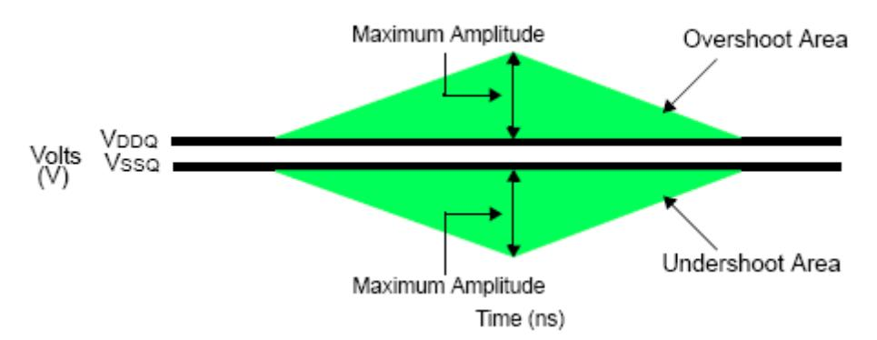

图 5.7 时钟,数据,选通和屏蔽信号的交流上冲和下冲定义

#### 5.3.3.6 ODT 时序定义

表 5-17 ODT 时序定义

| Symbol | Begin Point Definition                                                                 | End Point Definition                                                  |
|--------|----------------------------------------------------------------------------------------|-----------------------------------------------------------------------|
| tAON   | Rising edge of CK -CK# defined by the end point of ODTLon                           | Extrapolated point at VSSQ                                            |
| tAONPD | Rising edge of CK -CK# with ODT being first registered high                         | Extrapolated point at VSSQ                                            |
| tAOF   | Rising edge of CK -CK#defined by the end point of ODTLoff                           | End point: Extrapolated point at VRTT_Nom                          |
| tAOFPD | Rising edge of CK -CK# with ODT being first registered low                          | End point: Extrapolated point at VRTT_Nom                          |
| tADC   | Rising edge of CK -CK# defined by the end point of ODTLcnw, ODTLcwn4 or ODTLcwn8 | End point: Extrapolated point at VRTT_Wr and VRTT_Nom respectively |

| 表 | 5-18 | ODT |  | 时序测量的参考设置 |
|---|------|-----|--|-----------|
|---|------|-----|--|-----------|

| Measured Parameter | RTT_Nom Setting | RTT_Wr Setting | VSW1[V] | VSW2[V] |
|--------------------|-----------------|----------------|---------|---------|
|                    | RZQ/4           | NA             | 0.05    | 0.10    |
| tAON               | RZQ/12          | NA             | 0.10    | 0.20    |
|                    | RZQ/4           | NA             | 0.05    | 0.10    |
| tAONPD             | RZQ/12          | NA             | 0.10    | 0.20    |
|                    | RZQ/4           | NA             | 0.05    | 0.10    |
| tAOF               | RZQ/12          | NA             | 0.10    | 0.20    |
|                    | RZQ/4           | NA             | 0.05    | 0.10    |
| tAOFPD             | RZQ/12          | NA             | 0.10    | 0.20    |
| tAD                | RZQ/12          | RZQ/2          | 0.20    | 0.30    |

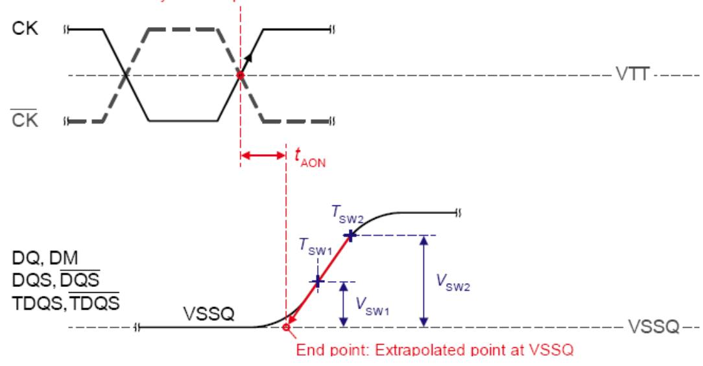

图 5.8 tAON 的定义

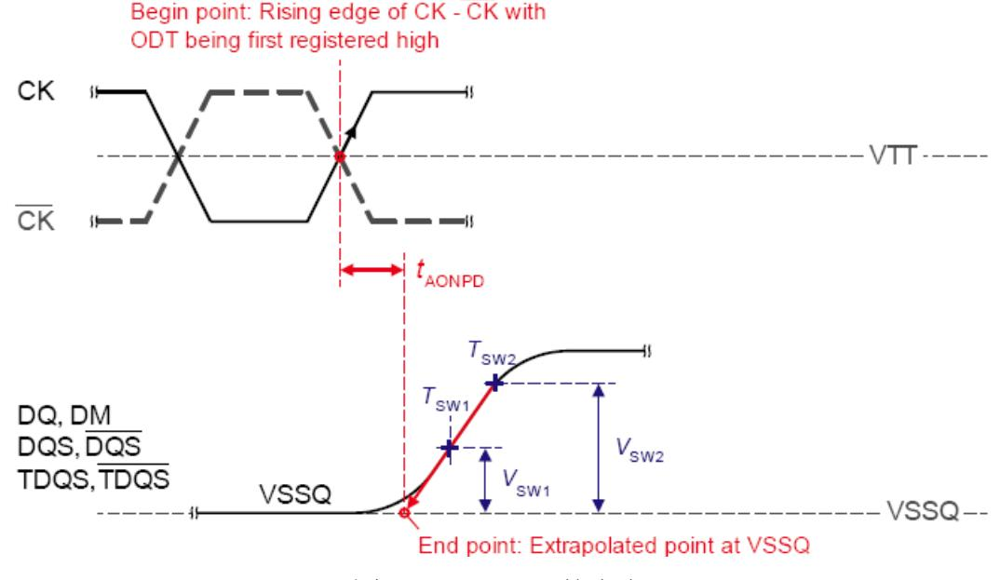

图 5.9 tAONPD 的定义

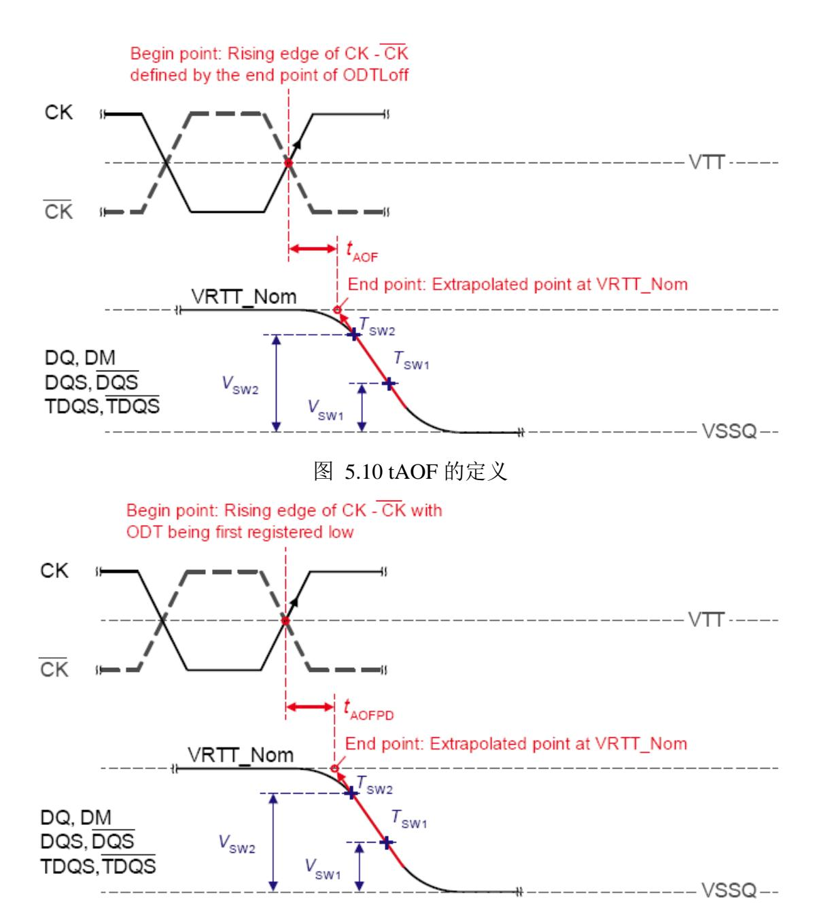

46

图 5.11 tAOFPD 的定义

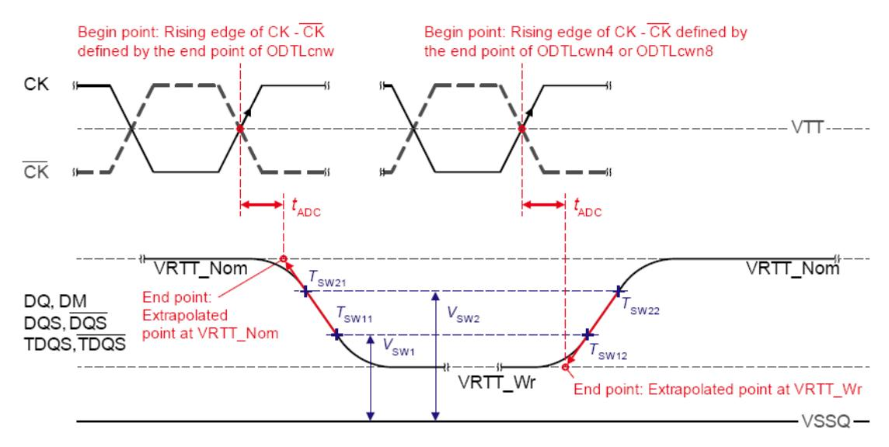

图 5.12 tADC 的定义

### 5.3.4 **IDD** 和 **IDDQ** 规范的参数和测试条件

表 5-19 IDD 和 IDDQ 测量循环模式的时序

|           |               | DDR3-800 |       |       | DDR3-1066 |       |      |
|-----------|---------------|----------|-------|-------|-----------|-------|------|
|           | Symbol        | 5-5-5    | 6-6-6 | 6-6-6 | 7-7-7     | 8-8-8 | Unit |
|           | tCK           |          | 2.5   |       | 1.875     |       | ns   |
|           | CL            | 5        | 6     | 6     | 7         | 8     | nCK  |
|           | nRCD          | 5        | 6     | 6     | 7         | 8     | nCK  |
|           | nRC           | 20       | 21    | 26    | 27        | 28    | nCK  |
|           | nRAS          | 15       |       |       | 20        |       | nCK  |
|           | nRP           | 5        | 6     | 6     | 7         | 8     | nCK  |
|           | 1KBpagesize   | 16       |       |       | 20        |       | nCK  |
| nFAW      | 2KB page size | 20       |       |       | 27        |       | nCK  |
|           | 1KB page size | 4        |       |       | 4         |       | nCK  |
| nRRD      | 2KB page size | 4        |       |       | 6         |       | nCK  |
|           | nRFC 512 Mb   |          | 36    |       | 48        |       | nCK  |
|           | nRFC 1 Gb     |          | 44    |       | 59        |       | nCK  |
|           | nRFC 2 Gb     |          | 64    |       | 86        |       | nCK  |
| nRFC 4 Gb |               |          | 120   | 160   |           |       | nCK  |
|           | nRFC 8 Gb     |          | 140   |       | 187       |       | nCK  |

### 5.3.5 输入**/**输出电容

表 5-20 输入/输出电容

|           |        | DDR3-800 |     | DDR3-1066 |     |       |
|-----------|--------|----------|-----|-----------|-----|-------|
| Parameter | Symbol | Min      | Max | Min       | Max | Units |

| Input/output capacitance (DQ, DM, DQS, DQS#, TDQS,TDQS#)       | CIO         | 1.5  | 3.0  | 1.5  | 2.7  | pF |
|----------------------------------------------------------------------|-------------|------|------|------|------|----|
| Input capacitance, CK and CK#                                        | CCK         | 0.8  | 1.6  | 0.8  | 1.6  | pF |
| Input capacitance delta, CK and CK#                               | CDCK        | 0    | 0.15 | 0    | 0.15 | pF |
| Input/output capacitance delta DQS and DQS#                       | CDDQS       | 0    | 0.2  | 0    | 0.2  | pF |
| Input capacitance, (CTRL, ADD, CMD input-only pins)               | CI          | 0.75 | 1.4  | 0.75 | 1.35 | pF |
| Input capacitance delta, (All CTRL input-only pins                | CDI_CTRL    | -0.5 | 0.3  | -0.5 | 0.3  | pF |
| Input capacitance delta, (All ADD/ CMD input-only pins)           | CDI_ADD_CMD | -0.5 | 0.5  | -0.5 | 0.5  | pF |
| Input/output capacitance delta, DQ, DM, DQS, DQS#, TDQS, TDQS# | CDIO        | -0.5 | 0.3  | -0.5 | 0.3  | pF |
| Input/output capacitance of ZQ pin                                | CZQ         | -    | 3    | -    | 3    | pF |

### 5.3.6 刷新参数

表 5-21 DDR3 刷新参数

| Parameter                                 |       | Symbol                                                                                                  | 512Mb | 1Gb | 2Gb | 4Gb | 8Gb | Unit |
|-------------------------------------------|-------|---------------------------------------------------------------------------------------------------------|-------|-----|-----|-----|-----|------|
| REF command to ACT or REF command time |       | tRFC                                                                                                    |       | 110 | 160 | 300 | 350 | ns   |
|                                           |       | 0≤TCASE≤85                                                                                              | 7.8   | 7.8 | 7.8 | 7.8 | 7.8 | us   |
| Average periodic refresh interval         | tREFI | 85 <tcase≤95< td=""><td>3.9</td><td>3.9</td><td>3.9</td><td>3.9</td><td>3.9</td><td>us</td></tcase≤95<> | 3.9   | 3.9 | 3.9 | 3.9 | 3.9 | us   |

### 5.3.7 标准的速度分级

表 5-22 DDR3-800 Speed Bins and Operating Conditions

|                           | Speed Bin                                |          |      | DDR3-800D |      | DDR3-800E |      |
|---------------------------|------------------------------------------|----------|------|-----------|------|-----------|------|
|                           | CL - nRCD - nRP                          |          |      | 5-5-5     |      | 6-6-6     | Unit |
|                           | Parameter                                | Symbol   | Min. | Max.      | Min. | Max.      |      |
|                           | Internal read command to first data      | tAA      | 12.5 | 20        | 15   | 20        | ns   |
|                           | ACT to internal read or write delay time | tRCD     | 12.5 | —         | 15   | —         | ns   |
| PRE command period        |                                          | tRP      | 12.5 | —         | 15   | —         | ns   |
|                           | ACT to ACT or REF command period         | tRC      | 50   | —         | 52.5 | —         | ns   |
| ACT to PRE command period |                                          | tRAS     | 37.5 | 9 * tREFI | 37.5 | 9 * tREFI | ns   |
| CL = 5                    | CWL = 5                                  | tCK(AVG) | 2.5  | 3.3       | 3.0  | 3.3       | ns   |
| CL = 6                    | CWL = 5                                  | tCK(AVG) | 2.5  | 3.3       | 2.5  | 3.3       | ns   |
| Supported CL Settings     |                                          |          |      | 5, 6      |      | 5, 6      | nCK  |
| Supported CWL Settings    |                                          |          |      | 5         |      | 5         | nCK  |

表 5-23 DDR3-1066 Speed Bins and Operating Conditions

| Speed Bin       | DDR3-1066E | DDR3-1066F | DDR3-1066G |      |
|-----------------|------------|------------|------------|------|
| CL - nRCD – nRP | 6-6-6      | 7-7-7      | 8-8-8      | Unit |

|                     | Parameter              | Symbol   | Min.  | Max.      | Min.   | Max.      | Min.  | Max.      |     |
|---------------------|------------------------|----------|-------|-----------|--------|-----------|-------|-----------|-----|
| to first data       | Internal read command  | tAA      | 11.25 | 20        | 13.125 | 20        | 15    | 20        | ns  |
| or write delay time | ACT to internal read   | tRCD     | 11.25 | —         |        | —         | 15    | —         | ns  |
|                     | PRE command period     | tRP      | 11.25 | —         | 13.125 | —         | 15    | —         | ns  |
| command period      | ACT to ACT or REF      | tRC      | 48.75 | —         | 50.625 | —         | 52.5  | —         | ns  |
| period              | ACT to PRE command     | tRAS     | 37.5  | 9 * tREFI | 37.5   | 9 * tREFI | 37.5  | 9 * tREFI | ns  |
|                     | CWL = 5                | tCK(AVG) | 2.5   | 3.3       | 3.0    | 3.3       | 3.0   | 3.3       | ns  |
| CL = 5              | CWL = 6                | tCK(AVG) |       | Reserved  |        | Reserved  |       | Reserved  | ns  |
|                     | CWL = 5                | tCK(AVG) | 2.5   | 3.3       | 2.5    | 3.3       | 2.5   | 3.3       | ns  |
| CL = 6              | CWL = 6                | tCK(AVG) | 1.875 | <2.5      |        | Reserved  |       | Reserved  | ns  |
|                     | CWL = 5                | tCK(AVG) |       | Reserved  |        | Reserved  |       | Reserved  | ns  |
| CL = 7              | CWL = 6                | tCK(AVG) | 1.875 | <2.5      | 1.875  | < 2.5     |       | Reserved  | ns  |
|                     | CWL = 5                | tCK(AVG) |       | Reserved  |        | Reserved  |       | Reserved  | ns  |
| CL = 8              | CWL = 6                | tCK(AVG) | 1.875 | <2.5      | 1.875  | <2.5      | 1.875 | <2.5      | ns  |
|                     | Supported CL Settings  |          |       | 5,6,7,8   |        | 5,6,7,8   |       | 5,6,8     | nCK |
|                     | Supported CWL Settings |          |       | 5,6       |        | 5,6       |       | 5,6       | nCK |

### 5.3.8 **DDR3** 的时序参数

表 5-24 Timing Parameters by Speed Bin

| Parameter                                                 | Symbol           |                               | DDR3-800                        |                               | DDR3-1066                       | Units    |
|-----------------------------------------------------------|------------------|-------------------------------|---------------------------------|-------------------------------|---------------------------------|----------|
|                                                           |                  | Min                           | Max                             | Min                           | Max                             |          |
| Clock Timing                                              |                  |                               |                                 |                               |                                 |          |
| Minimum Clock Cycle Time (DLL off mode)                | tCK(DLL_O FF) | 8                             | -                               | 8                             | -                               | ns       |
| Average Clock Period                                      | tCK(avg)         |                               |                                 |                               |                                 | ps       |
| Average high pulse width                                  | tCH(avg)         | 0.47                          | 0.53                            | 0.47                          | 0.53                            | tCK(avg) |
| Average low pulse width                                   | tCL(avg)         | 0.47                          | 0.53                            | 0.47                          | 0.53                            | tCK(avg) |
| Absolute Clock Period                                     | tCK(abs)         | tCK(avg)min + tJIT(per)min | tCK(avg) max + tJIT(per) max | tCK(avg)min + tJIT(per)min | tCK(avg) max + tJIT(per) max | ps       |
| Absolute clock HIGH pulse width                           | tCH(abs)         | 0.43                          | -                               | 0.43                          | -                               | tCK(avg) |
| Absolute clock LOW pulse width                            | tCL(abs)         | 0.43                          | -                               | 0.43                          | -                               | tCK(avg) |
| Clock Period Jitter                                       | JIT(per)         | -100                          | 100                             | -90                           | 90                              | ps       |
| Clock Period Jitter during DLL locking period          | tJIT(per,lck)    | -90                           | 90                              | -80                           | 80                              | ps       |
| Cycle to Cycle Period Jitter                              | tJIT(cc)         |                               | 200                             |                               | 180                             | ps       |
| Cycle to Cycle Period Jitter during DLL locking period | tJIT(cc,lck)     |                               | 180                             |                               | 160                             | ps       |
| Duty Cycle Jitter                                         | tJIT(duty)       | -                             | -                               | -                             | -                               | ps       |
| Cumulative error across 2 cycles                          | tERR(2per)       | -147                          | 147                             | -132                          | 132                             | ps       |
| Cumulative error across 3 cycles                          | tERR(3per)       | -175                          | 175                             | -157                          | 157                             | ps       |
| Cumulative error across 4 cycles                          | tERR(4per)       | -194                          | 194                             | -175                          | 175                             | ps       |
| Cumulative error across 5 cycles                          | tERR(5per)       | -209                          | 209                             | -188                          | 188                             | ps       |
| Cumulative error across 6 cycles                          | tERR(6per)       | -222                          | 222                             | -200                          | 200                             | ps       |
| Cumulative error across 7 cycles                          | tERR(7per)       | -232                          | 232                             | -209                          | 209                             | ps       |
| Cumulative error across 8 cycles                          | tERR(8per)       | -241                          | 241                             | -217                          | 217                             | ps       |
| Cumulative error across 9 cycles                          | tERR(9per)       | -249                          | 249                             | -224                          | 224                             | ps       |

| Cumulative error across 10 cycles tERR(10per)                              |                    | -257                                                                                                                 | 257    | -231  | 231    | ps       |
|----------------------------------------------------------------------------|--------------------|----------------------------------------------------------------------------------------------------------------------|--------|-------|--------|----------|
| Cumulative error across 11 cycles tERR(11per)                              |                    | -263                                                                                                                 | 263    | -237  | 237    | ps       |
| Cumulative error across 12 cycles tERR(12per)                              |                    | -269                                                                                                                 | 269    | -242  | 242    | ps       |
| Cumulative error across n = 13, 14 49, 50 cycles                        | tERR(nper)         | tERR(nper)mi n = (1 + 0.68ln(n)) * tJIT(per)min tERR(nper)ma x = (1 + 0.68ln(n)) * tJIT(per)max | ps     | 24    |        |          |
| Data Timing                                                                |                    |                                                                                                                      |        |       |        |          |
| DQS, DQS# to DQ skew, per group, per access                             | tDQSQ              | -                                                                                                                    | 200    | -     | 150    | ps       |
| DQ output hold time from DQS, DQS#                                      | tQH                | 0.38                                                                                                                 | -      | 0.38  | -      | tCK(avg) |
| DQ low-impedance time from CK, CK#                                      | tLZ(DQ)            | -800                                                                                                                 | 400    | -600  | 300    | ps       |
| DQ high impedance time from CK, CK#                                     | tHZ(DQ)            | -                                                                                                                    | 400    | -     | 300    | ps       |
| Data setup time to DQS, DQS# referenced to Vih(ac) / Vil(ac) levels  | tDS(base)A C175 | 75                                                                                                                   |        | 25    |        | ps       |
| Data setup time to DQS, DQS# referenced to Vih(ac) / Vil(ac) levels  | tDS(base)A C150 | 125                                                                                                                  |        | 75    |        | ps       |
| Data hold time from DQS, DQS# referenced to Vih(dc) / Vil(dc) levels | tDH(base)D C100 | 150                                                                                                                  |        | 100   |        | ps       |
| DQ and DM Input pulse width for each input                              | tDIPW              | 600                                                                                                                  | -      | 490   | -      | ps       |
| Data Strobe Timing                                                         |                    |                                                                                                                      |        |       |        |          |
| DQS,DQS# differential READ Preamble                                     | tRPRE              | 0.9                                                                                                                  | Note19 | 0.9   | Note19 | tCK(avg) |
| DQS, DQS# differential READ Postamble                                   | tRPST              | 0.3                                                                                                                  | Note11 | 0.3   | Note11 | tCK(avg) |
| DQS, DQS# differential output high time                                 | tQSH               | 0.38                                                                                                                 | -      | 0.38  | -      | tCK(avg) |
| DQS, DQS# differential output low time                                  | tQSL               | 0.38                                                                                                                 | -      | 0.38  | -      | tCK(avg) |
| DQS, DQS# differential WRITE Preamble                                   | tWPRE              | 0.9                                                                                                                  | -      | 0.9   | -      | tCK(avg) |
| DQS, DQS# differential WRITE Postamble                                  | tWPST              | 0.3                                                                                                                  | -      | 0.3   | -      | tCK(avg) |
| DQS, DQS# rising edge output access time from rising CK, CK#            | tDQSCK             | -400                                                                                                                 | 400    | -300  | 300    | ps       |
| DQS and DQS# low-impedance time (Referenced from RL - 1)                | tLZ(DQS)           | -800                                                                                                                 | 400    | -600  | 300    | ps       |
| DQS and DQS# high-impedance time (Referenced from RL + BL/2)         | tHZ(DQS)           | -                                                                                                                    | 400    | -     | 300    | ps       |
| DQS, DQS# differential input low pulse width                            | tDQSL              | 0.45                                                                                                                 | 0.55   | 0.45  | 0.55   | tCK(avg) |
| DQS, DQS# differential input high pulse width                           | tDQSH              | 0.45                                                                                                                 | 0.55   | 0.45  | 0.55   | tCK(avg) |
| DQS, DQS# rising edge to CK, CK# rising edge                            | tDQSS              | -0.25                                                                                                                | 0.25   | -0.25 | 0.25   | tCK(avg) |
| DQS, DQS# falling edge setup time to CK, CK# rising edge                | tDSS               | 0.2                                                                                                                  | -      | 0.2   | -      | tCK(avg) |
| DQS, DQS# falling edge hold time from CK, CK# rising edge               | tDSH               | 0.2                                                                                                                  | -      | 0.2   | -      | tCK(avg) |
| Command and Address Timing                                                 |                    |                                                                                                                      |        |       |        |          |

| DLL locking time                                                                        | tDLLK              | 512                                | -   | 512                               | - | nCK |
|-----------------------------------------------------------------------------------------|--------------------|------------------------------------|-----|-----------------------------------|---|-----|
| Internal READ Command to PRECHARGE Command delay                                        | tRTP               | max(4nCK, 7.5ns)                   | _   | max(4nCK,7.5n s)               | - |     |
| Delay from start of internal write transaction to internal read command                 | tWTR               | max(4nCK, 7.5ns)                   | _   | max(4nCK,7.5n s)               | - |     |
| WRITE recovery time                                                                     | tWR                | 15                                 | _   | 15                                | - | ns  |
| Mode Register Set command cycle time                                                    | tMRD               | 4                                  | _   | 4                                 | - | nCK |
| Mode Register Set command update delay                                                  | tMOD               | max(12nCK, 15ns)                | _   | max(12nCK,15 ns)               | - |     |
| ACT to internal read or write delay time                                                | tRCD               | -                                  | _   | -                                 | - |     |
| PRE command period                                                                      | tRP                | -                                  | _   | -                                 | - |     |
| ACT to ACT or REF command period                                                        | tRC                | -                                  | _   | -                                 | - |     |
| CAS# to CAS# command delay                                                              | tCCD               | 4                                  | _   | 4                                 | - | nCK |
| Auto precharge write recovery + precharge time                                          | tDAL(min)          | WR + roundup(tRP / tCK(avg)) | nCK |                                   |   |     |
| Multi-Purpose Register Recovery Time                                                 | tMPRR              | 1                                  | -   | 1                                 | - | nCK |
| ACTIVE to PRECHARGE command period                                                      | tRAS               | -                                  | -   | -                                 | - |     |
| ACTIVE to ACTIVE command period for 1KB page size                                       | tRRD               | max(4nCK,10 ns)                 | -   | max(4nCK,7.5n s)                  | - |     |
| ACTIVE to ACTIVE command period for 2KB page size                                       | tRRD               | max(4nCK,10 ns)                 | -   | max(4nCK,10n s)                   | - |     |
| Four activate window for 1KB page size                                                  | tFAW               | 40                                 | -   | 37.5                              | - | ns  |
| Four activate window for 2KB page size                                                  | tFAW               | 50                                 | -   | 50                                | - | ns  |
| Command and Address setup time to CK, CK# referenced to Vih(ac) / Vil(ac) levels  | tIS(base)AC 175 | 200                                |     | 125                               |   | ps  |
| Command and Address setup time to CK, CK# referenced to Vih(ac) / Vil(ac) levels  | tIS(base)AC 150 | 350                                |     | 275                               |   | ps  |
| Command and Address hold time from CK, CK# referenced to Vih(dc) / Vil(dc) levels | tIH(base)DC 100 | 275                                |     | 200                               |   | ps  |
| Control and Address Input pulse width for each input                                    | tIPW               | 900                                | -   | 780                               | - | ps  |
| Calibration Timing                                                                      |                    |                                    |     |                                   |   |     |
| Power-up and RESET calibration time                                                     | tZQinit            | max(512nCK, 640ns)              | -   | max(512nCK,6 40ns)             | - |     |
| Normal operation Full calibration time                                                  | tZQoper            | max(256nCK, 320ns)                 | -   | max(256nCK,3 20ns)             | - |     |
| Normal operation Short calibration time                                                 | tZQCS              | max(64nCK,8 0ns)                | -   | max(64nCK,80 ns)               | - |     |
| Reset Timing                                                                            |                    |                                    |     |                                   |   |     |
| Exit Reset from CKE HIGH to a valid command                                             | tXPR               | max(5nCK,tR FC(min)+10ns        | -   | max(5nCK,tRF C(min)+10ns)      | - |     |
| Self Refresh Timings                                                                    | 1                  | , / l                              |     |                                   |   | L   |
| Exit Self Refresh to commands not requiring a locked DLL                                | tXS                | max(5nCK, tRFC(min) + 10ns)  | -   | max(5nCK, tRFC(min) + 10ns) | - |     |
| Exit Self Refresh to commands requiring a locked DLL                                    | tXSDLL             | tDLLK(min)                         | -   | tDLLK(min)                        | - | nCK |

| Minimum CKE low width for Self Refresh entry to exit timing                                                                                    | tCKESR   | tCKE(min) +             | -       | tCKE(min) +             | -       |          |
|------------------------------------------------------------------------------------------------------------------------------------------------|----------|-------------------------|---------|-------------------------|---------|----------|
| Valid Clock Requirement after Self Refresh Entry (SRE) or Power-Down Entry (PDE)                                                         | tCKSRE   | max(5nCK,10 ns)         | -       | max(5nCK,10n s)      | -       |          |
| Valid Clock Requirement before Self Refresh Exit (SRX) or Power-Down Exit (PDX) or Reset Exit                                         | tCKSRX   | max(5nCK,10 ns)      | -       | max(5nCK,10n s)         | -       |          |
| <b>Power Down Timings</b>                                                                                                                      |          |                         |         |                         |         |          |
| Exit Power Down with DLL on to any valid command; Exit Precharge Power Down with DLL frozen to commands not requiring a locked DLL | tXP      | max(3nCK,7.5 ns)     | -       | max(3nCK,7.5n s)        | -       |          |
| Exit Precharge Power Down with DLL frozen to commands requiring a locked DLL                                                                   | tXPDLL   | max(10nCK,2 4ns)     | -       | max(10nCK,24 ns)     | -       |          |
| CKE minimum pulse width                                                                                                                        | tCKE     | max(3nCK7.5 ns)         | -       | max(3nCK,5.62 5ns)   | -       |          |
| Command pass disable delay                                                                                                                     | tCPDED   | 1                       | -       | 1                       | -       | nCK      |
| Power Down Entry to Exit Timing                                                                                                             | tPD      | tCKE(min)               | 9*tREFI | tCKE(min)               | 9*tREFI |          |
| Timing of ACT command to Power Down entry                                                                                                      | tACTPDEN | 1                       | -       | 1                       | -       | nCK      |
| Timing of PRE or PREA command to Power Down entry                                                                                              | tPRPDEN  | 1                       | -       | 1                       | -       | nCK      |
| Timing of RD/RDA command to Power Down entry                                                                                                   | tRDPDEN  | RL+4+1                  | -       | RL+4+1                  | -       | nCK      |
| Timing of WR command to Power Down entry (BL8OTF, BL8MRS, BC4OTF)                                                                        | tWRPDEN  | WL+4+(tWR/t CK(avg)) | -       | WL+4+(tWR/t CK(avg)) | -       | nCK      |
| Timing of WRA command to Power Down entry (BL8OTF, BL8MRS, BC4OTF)                                                                       | tWRAPDEN | WL+4+WR+1               | -       | WL+4+WR+1               | -       | nCK      |
| Timing of WR command to Power Down entry (BC4MRS)                                                                                              | tWRPDEN  | WL+2+(tWR/t CK(avg)) | -       | WL+2+(tWR/t CK(avg)) | -       | nCK      |
| Timing of WRA command to Power Down entry (BC4MRS)                                                                                          | tWRAPDEN | WL+2+WR+1               | -       | WL+2+WR+1               | -       | nCK      |
| Timing of REF command to Power Down entry                                                                                                      | tREFPDEN | 1                       | -       | 1                       | -       | nCK      |
| Timing of MRS command to Power Down entry                                                                                                      | tMRSPDEN | tMOD(min)               | -       | tMOD(min)               | -       |          |
| ODT Timings                                                                                                                                    |          |                         |         |                         |         | •        |
| ODT turn on Latency                                                                                                                            | ODTLon   |                         | WL-2=0  | CWL+AL-2                |         | nCK      |
| ODT turn off Latency                                                                                                                           | ODTLoff  |                         | WL-2=0  | CWL+AL-2                |         | nCK      |
| ODT high time without write command or with write command and BC4                                                                              | ODTH4    | 4                       | -       | 4                       | -       | nCK      |
| ODT high time with Write command and BL8                                                                                                       | ODTH8    | 6                       | -       | 6                       | -       | nCK      |
| Asynchronous RTT turn-on delay (Power-Down with DLL frozen)                                                                                    | tAONPD   | 2                       | 8.5     | 2                       | 8.5     | ns       |
| Asynchronous RTT turn-off delay (Power-Down with DLL frozen)                                                                                   | tAOFPD   | 2                       | 8.5     | 2                       | 8.5     | ns       |
| RTT turn-on                                                                                                                                    | tAON     | -400                    | 400     | -300                    | 300     | ps       |
| RTT_Nom and RTT_WR turn-off time from ODTLoff reference                                                                                        |          | 0.3                     | 0.7     | 0.3                     | 0.7     | tCK(avg) |
| RTT dynamic change skew                                                                                                                        | tADC     | 0.3                     | 0.7     | 0.3                     | 0.7     | tCK(avg) |
| <b>Write Leveling Timings</b>                                                                                                                  |          |                         |         |                         |         |          |

| First DQS/DQS# rising edge after write leveling mode is programmed                  | tWLMRD   | 40  | - | 40  | - | nCK |
|-------------------------------------------------------------------------------------------|----------|-----|---|-----|---|-----|
| DQS/DQS# delay after write leveling mode is programmed                                 | tWLDQSEN | 25  | - | 25  | - | nCK |
| Write leveling setup time from rising CK, CK# crossing to rising DQS, DQS# crossing | tWLS     | 325 | - | 245 | - | ps  |
| Write leveling hold time from rising DQS, DQS# crossing to rising CK, CK# crossing  | tWLH     | 325 | - | 245 | - | ps  |
| Write leveling output delay                                                               | tWLO     | 0   | 9 | 0   | 9 | ns  |
| Write leveling output error                                                               | tWLOE    | 0   | 2 | 0   | 2 | ns  |

### **5.4 PCIE** 总线接口特性

### 5.4.1 **PCIE** 推荐交流工作条件

表 5-25 PCIE 交流工作条件

| Parameter  | Description                                           | Min   | Typ | Max  | Unit |
|------------|-------------------------------------------------------|-------|-----|------|------|
| TUIPCIEX1  | Unit interval for PCI Express gen1 (2.5 Gbit/s)       | -     | 400 | -    | ps   |
| TUIPCIEX2  | Unit interval for PCI Express gen2 (5 Gbit/s)         | -     | 200 | -    | ps   |
| Fssc       | Spread spectrum modulation frequency                  | 30    | -   | 33   | kHz  |
| SSCtol     | Spread spectrum modulation deviation                  | -5000 | -   | 0    | ppm  |
| Vcm,ac     | AC coupled common mode voltage                        | 0     | -   | 2000 | mV   |
| Zdiff      | Nominal differential impedance                        | -     | 100 | -    | ohm  |
| tsettle,cm | Common mode transient settle time (SATA gen1 only) | -     | -   | 10   | ns   |
| Vtrans     | Sequencing transient voltage                          | -2    | -   | 2    | V    |

### **5.5 DVO** 接口特性

### 5.5.1 **DVO** 直流特性

表 5-26 DVO 直流特性

| 参数  | 描述                    | 典型 | 单位 |
|-----|-----------------------|----|----|
| Ioh | 输出高电平(VDDE-0.4V)时电流输出 | 12 | mA |
| Iol | 输出低电平(0.4V)时电流输入      | 12 | mA |

### **5.6 RGMII** 接口特性

RGMII 接口有专用的电源(RSM2V5),支持 2.5V 和 3.3V 工作电压。

### 5.6.1 **RGMII** 接口直流特性

表 5-27 RGMII 接口输出特性

| 参数  | 描述                    | 典型 | 单位 |
|-----|-----------------------|----|----|
| Ioh | 输出高电平(VDDE-0.4V)时电流输出 | 12 | mA |
| Iol | 输出低电平(0.4V)时电流输入      | 12 | mA |

表 5-28 RGMII 接口输入特性

| 参数  | 描述      |         | 最小   | 最大  | 单位 |
|-----|---------|---------|------|-----|----|
|     |         | 2.5V 供电 | 1.7  | 2.8 | V  |
| Vih | 输入高电平电压 | 3.3V 供电 | 2.0  | 3.6 | V  |
|     |         | 2.5V 供电 | -0.3 | 0.7 | V  |
| Vil | 输入低电平电压 | 3.3V 供电 | -0.3 | 0.8 | V  |

#### 5.6.2 **RGMII** 接口时序

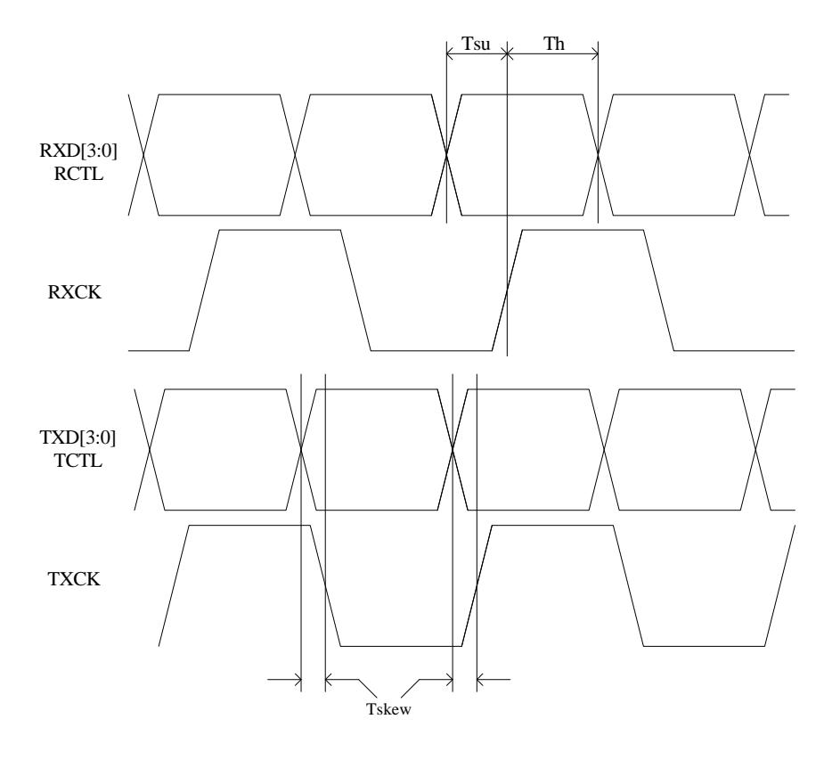

图 5.13 RGMII 接口时序

表 5-29 RGMII 接口时序

| 参数    | 描述                     | 最小   | 典型 | 最大   | 单位 |
|-------|------------------------|------|----|------|----|
| Tsu   | RX 信号建立时间              | 1    | -  | -    | ns |
| Th    | RX 信号保持时间              | 1    | -  | -    | ns |
| Tskew | TXCK 相对 TX 数据的偏移       | -500 | -  | +500 | ps |
| Tr    | TXD/TXCK 上升时间(10pf 负载) |      |    | 1.2  | ns |
| Tf    | TXD/TXCK 下降时间(10pf 负载) |      |    | 1.3  | ns |

### **5.7 SATA** 接口特性

### 5.7.1 **SATA** 发送端特性

表 5-30 SATA 发送端特性

| 参数         | 描述                  | 最小  | 典型  | 最大  | 单位  |
|------------|---------------------|-----|-----|-----|-----|
| Zdiff      | 差分输出阻抗              | 85  | 100 | 115 | ohm |
| Vdiff, TX  | 差分输出电压              | 320 | 400 | 480 | mV  |
| Vcm, DC    | 交流耦合的 SATA 接口上直流共模点 |     | -   | 800 | mV  |
| Trise/fall | 上升/下降时间(20%~80%)    | 36  |     | 176 | ps  |

### 5.7.2 **SATA** 接收端特性

表 5-31 SATA 接收端特性

| 参数         | 描述                                | 最小  | 典型  | 最大   | 单位  |
|------------|-----------------------------------|-----|-----|------|-----|
| Zdiff      | 差分输入阻抗                            | 85  | 100 | 115  | ohm |
| Zs-e       | 单端输入阻抗                            | 40  | -   | -    | ohm |
| Vdiff, RX  | 差分输入电压                            | 240 | -   | 1600 | mV  |
| Vcm, DC    | 交流耦合的 SATA 接口上直流共模点 (供上下电瞬态分析) | 800 | 900 | 970  | mV  |
| Vcm, AC    | 所允许的公模点正弦漂移峰峰值 (f=2MHz~200MHz) | 100 | -   | 200  | mV  |
|            | 1.5Gbps 时上升/下降时间(20%~80%)         | 100 | -   | 273  | ps  |
| Trise/fall | 3.0Gbps 时上升/下降时间(20%~80%)         | 67  | -   | 136  | ps  |

### **5.8 USB** 接口特性

下述表格源自 USB 2.0 规范,更多信息请参考其中第 7 章。

#### 表 5-32 USB 直流电气特性

| Parameter                                                                          | Symbol  | Conditions         | Min. | Max. | Units |
|------------------------------------------------------------------------------------|---------|--------------------|------|------|-------|
| InputLevelsforLow-/full-speed:                                                     |         |                    |      |      |       |
| High(driven)                                                                       | VIH     |                    | 2    |      | V     |
| High(floating)                                                                     | VIHZ    |                    | 2.7  | 3.6  | V     |
| Low                                                                                | VIL     |                    |      | 0.8  | V     |
| Differential Input Sensitivity                                                     | VDI     | (D+)-(D-)          | 0.2  |      | V     |
| Differential Common Mode Range                                                     | VCM     | Includes VDI range | 0.8  | 2.5  | V     |
| Input Levels for High-speed:                                                       |         |                    |      |      |       |
| High-speed squelch detection threshold (differential signal amplitude)       | VHSSQ   |                    | 100  | 150  | mV    |
| High speed disconnect detection threshold (differential signal amplitude)    | VHSDSC  |                    | 525  | 625  | mV    |
| High-speed differential input signaling levels                                  |         |                    |      |      |       |
| High-speed data signaling common mode voltage range(guide line for receiver) | VHSCM   |                    | -50  | 500  | mV    |
| Output Levels for Low-/full-speed:                                                 |         |                    |      |      |       |
| Low                                                                                | VOL     |                    | 0    | 0.3  | V     |
| High(Driven)                                                                       | VOH     |                    | 2.8  | 3.6  | V     |
| SE1                                                                                | VOSE1   |                    | 0.8  |      | V     |
| Output Signal Crossover Voltage                                                    | VCRS    |                    | 1.3  | 2    | V     |
| Output Levels for High-speed:                                                      |         |                    |      |      |       |
| High-speed idle level                                                              | VHSOI   |                    | -10  | 10   | mV    |
| High-speed data signaling high                                                     | VHSOH   |                    | 360  | 440  | mV    |
| High-speed data signaling low                                                      | VHSOL   |                    | -10  | 10   | mV    |
| Chirp J level(differential voltage)                                                | VCHIRPJ |                    | 700  | 1100 | mV    |
| Chirp K level(differential voltage)                                                | VCHIRPK |                    | -900 | -500 | mV    |
| Decoupling Capacitance:                                                            |         |                    |      |      |       |
| Downstream Facing Port Bypass Capacitance (perhub)                              | CHPB    | VBUS to GND        | 120  |      | μF    |
| Upstream Facing Port Bypass Capacitance                                         | CRPB    | VBUS to GND        | 1    | 10   | μF    |
| Input Capacitance for Low-/full-speed:                                             |         |                    |      |      |       |
| Downstream Facing Port                                                             | CIND    |                    |      | 150  | pF    |
| Upstream Facing Port(w/ocable)                                                     | CINUB   |                    |      | 100  | pF    |
| Transceiver edge rate control capacitance                                       | CEDGE   |                    |      | 75   | pF    |
| InputImpedanceforHigh-speed:                                                       |         |                    |      |      |       |
| TDRspecforhigh-speedtermination                                                    |         |                    |      |      |       |

| Terminations:                                                    |         |            |       |       |    |  |
|------------------------------------------------------------------|---------|------------|-------|-------|----|--|
| Bus Pull-up Resistoron Upstream Facing Port                   | RPU     | 1.5k Ω ±5% | 1.425 | 1.575 | kΩ |  |
| Bus Pull-down Resistoron Downstream Facing Port               | RPD     | 15k Ω ±5%  | 14.25 | 15.75 | kΩ |  |
| Input impedance exclusive of pullup/pulldown(forlow-/full-speed) | ZINP    |            | 300   |       | kΩ |  |
| Termination voltage for upstream facing port pullup(RPU)         | VTERM   |            | 3     | 3.6   | V  |  |
| Terminations in High-speed:                                      |         |            |       |       |    |  |
| Termination voltage in high-speed                                | VHSTERM |            | -10   | 10    | mV |  |

#### 表 5-33 USB 高速源电气特性

| Parameter                                                             | Symbol  | Conditions                 | Min.            | Max.                   | Units  |  |
|-----------------------------------------------------------------------|---------|----------------------------|-----------------|------------------------|--------|--|
| Driver Characteristics:                                               |         |                            |                 |                        |        |  |
| Rise Time(10%-90%)                                                    | THSR    |                            | 500             |                        | ps     |  |
| Fall Time(10%-90%)                                                    | THSF    |                            | 500             |                        | ps     |  |
| Driver waveform requirements                                          | S       |                            |                 |                        |        |  |
| Driver Output Resistance(which also serves as high-speed termination) | ZHSDRV  |                            | 40.5            | 49.5                   | Ω      |  |
| Clock Timings:                                                        |         |                            |                 |                        |        |  |
| High-speed Data Rate                                                  | THSDRAT |                            | 479.76          | 480.24                 | Mb/s   |  |
| Micro frame Interval                                                  | THSFRAM |                            | 124.9375        | 125.0625               | μs     |  |
| Consecutive Micro frame Interval Difference                        | THSRFI  |                            |                 | 4 high-speed bit times |        |  |
| High-speed Data Timings:                                              |         |                            |                 |                        |        |  |
| Data source jitter                                                    |         | Source and receive         | ver jitter spec | ified by the eye pa    | attern |  |
| Receiver jitter tolerance                                             |         | templatesin Section7.1.2.2 |                 |                        |        |  |

### 表 5-34 USB 全速源电气特性

| Parameter                                                              | Symbol   | Conditions          | Min.   | Max.   | Units |
|------------------------------------------------------------------------|----------|---------------------|--------|--------|-------|
| <b>Driver Characteristics:</b>                                         |          |                     |        |        |       |
| Rise Time                                                              | TFR      |                     | 4      | 20     | ns    |
| Fall Time                                                              | TFF      |                     | 4      | 20     | ns    |
| Differential Rise and Fall Time Matching                            | TFRFM    | (TFR/TFF)           | 90     | 111.11 | %     |
| Driver Output Resistance for driver which is not high-speed capable    | ZDRV     |                     | 28     | 44     | Ω     |
| Clock Timings:                                                         |          |                     |        |        |       |
| Full-speed Data Rate for hubs and devices which are high-speed capable | TFDRATHS | Average bit rate    | 11.994 | 12.006 | Mb/s  |
| Full-speed Data Rate for devices which are not high-speed capable      | TFDRATE  | Average bit rate    | 11.97  | 12.03  | Mb/s  |
| Frame Interval                                                         | TFRAME   |                     | 0.9995 | 1.0005 | ms    |
| Consecutive Frame Interval Jitter                                      | TRFI     | No clock adjustment |        | 42     | ns    |

|                                                                | Full-speed Data Timings:  |        |  |       |      |    |  |  |
|----------------------------------------------------------------|---------------------------|--------|--|-------|------|----|--|--|
| Source Jitter Total(including                               | To Next Transition     | TDJ1   |  | -3.5  | 3.5  | ns |  |  |
| frequency tolerance):                                       | For Paired Transitions | TDJ2   |  | -4    | 4    | ns |  |  |
| Source Jitter for Differential Transition to SE0 Transition |                           | TFDEOP |  | -2    | 5    | ns |  |  |
| Receiver Jitter:                                               | To Next Transition     | TJR1   |  | -18.5 | 18.5 | ns |  |  |
|                                                                | For Paired Transitions | TJR2   |  | -9    | 9    | ns |  |  |
| Source SE0 interval of EOP                                     |                           | TFEOPT |  | 160   | 175  | ns |  |  |
| Receiver SE0 interval of EOP                                   |                           | TFEOPR |  | 82    |      | ns |  |  |
| Width of SE0 interval during differential transition        |                           | TFST   |  |       | 14   | ns |  |  |

#### 表 5-35 USB 低速源电气特性

| Parameter                                                                             |                        | Symbol           | Min.   | Max.    | Units |
|---------------------------------------------------------------------------------------|------------------------|------------------|--------|---------|-------|
| Driver Characteristics:                                                               |                        |                  |        |         |       |
| Transition Time:                                                                      | Rise Time              | TLR              | 75     | 300     | ns    |
|                                                                                       | Fall Time              | TLF              | 75     | 300     | ns    |
| Rise and Fall Time Matching                                                           |                        | TLRFM            | 80     | 125     | %     |
| Upstream Facing Port(w/cable, low-speed only)                                         |                        | CLINUA           | 200    | 450     | pF    |
| Clock Timings:                                                                        |                        |                  |        |         |       |
| Low-speed Data Rate for hubs which are high-speed capable                             |                        | TLDRATHS 1.49925 |        | 1.50075 | Mb/s  |
| Low-speed Data Rate for devices which are not high-speed capable                   | TLDRATE                | 1.4775           | 1.5225 | Mb/s    |       |
| Low-speed Data Timings:                                                               |                        |                  |        |         |       |
| Upstream facing port source Jitter Total(including frequency                       | To Next Transition     | TUDJ1            | -95    | 95      | ns    |
| tolerance):                                                                           | For Paired Transitions | TUDJ2            | -150   | 150     | ns    |
| Upstream facing port source Jitter for Differential Transition to SE0 Transition   |                        | TLDEOP           | -40    | 100     | ns    |
| Upstream facing port                                                                  | To Next Transition     | TDJR1            | -75    | 75      | ns    |
| differential Receiver Jitter:                                                         | For Paired Transitions | TDJR2            | -45    | 45      | ns    |
| Downstream facing port source Jitter Total(including frequency                     | To Next Transition     | TDDJ1            | -25    | 25      | ns    |
| tolerance):                                                                           | For Paired Transitions | TDDJ2            | -14    | 14      | ns    |
| Downstream facing port source Jitter for Differential Transition to SE0 Transition |                        |                  |        |         | ns    |
| Downstream facing port Differential Receiver Jitter:                               | To Next Transition     | TUJR1            | -152   | 152     | ns    |

| For Paired Transitions                               | TUJR2  | -200 | 200 | ns |
|------------------------------------------------------|--------|------|-----|----|
| Source SE0 interval of EOP                           | TLEOPT | 1.25 | 1.5 | μs |
| Receiver SE0 interval of EOP                         | TLEOPR | 670  |     | ns |
| Width of SE0 interval during differential transition | TLST   |      | 210 | ns |

### **5.9 HDA** 接口特性

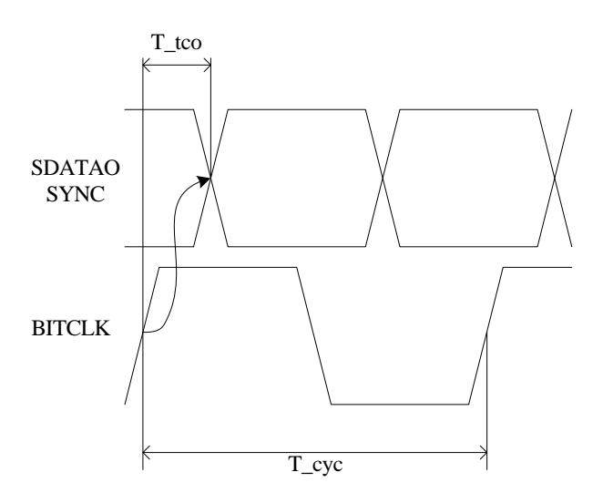

图 5.14 HDA 接口时序

表 5-36 HDA 接口时序

| 参数    | 描述                       | 最小 | 典型    | 最大 | 单位 |
|-------|--------------------------|----|-------|----|----|
| T_cyc | HDA 时钟周期                 | -  | 41.67 | -  | ns |
| T_tco | BITCLK 到 SDATAO/SYNC 的延迟 | 3  | -     | 10 | ns |
| T_su  | SDATAI 到 BITCLK 的建立时间    | 20 | -     | -  | ns |

### **5.10 SPI Flash** 接口特性

表 5-37 SPI Flash 接口特性

| 参数    | 描述              | 最小       | 典型 | 最大 | 单位 |
|-------|-----------------|----------|----|----|----|
| T_ckh | SCK 时钟高电平时间     | 0.5T-1   | -  | -  | ns |
| T_ckl | SCK 时钟低电平时间     | 0.5T-1   | -  | -  | ns |
| T_val | SCK 下降沿到数据输出的延迟 | -5       | -  | 5  | ns |
| T_su  | 数据输入建立时间        | 20       | -  | -  | ns |
| T_h   | 数据输入保持时间        | 0        | -  | -  | ns |
| I_oh  | 输出高电压驱动电流       | 1.9@2.4V | -  | -  | mA |

| I_ol | 输出低电压驱动电流 | 1.4@0.4V | - | - | mA |
|------|-----------|----------|---|---|----|
|      |           |          |   |   |    |

注:T 为 SCK 时钟周期

### **5.11 I2C** 接口特性

表 5-38 I2C 接口特性

| 参数    | 描述                     | 最小       | 典型 | 最大 | 单位 |
|-------|------------------------|----------|----|----|----|
| T_ckh | SCL 时钟高电平时间            | 4        | -  | -  | us |
| T_ckl | SCL 时钟低电平时间            | 5        | -  | -  | us |
| T_val | SCL 下降沿到数据输出的延迟        | 5        | -  | -  | us |
| T_su  | 数据建立时间(SDA 变化到 SCL 上升) | 0        | -  | -  | us |
| T_h   | 数据保持时间(SCL 下降到 SDA 变化) | 0        | -  | -  | us |
| I_oh  | 输出高电压驱动电流              | 1.9@2.4V | -  | -  | mA |
| I_ol  | 输出低电压驱动电流              | 1.4@0.4V | -  | -  | mA |

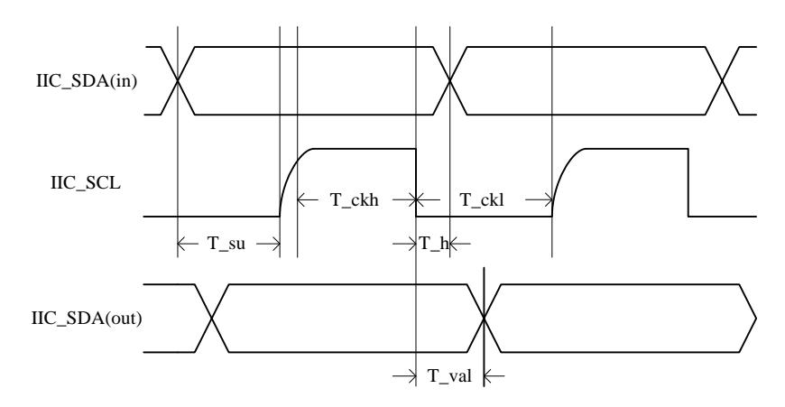

图 5.15 I2C 接口时序

### **6** 热特性

### **6.1** 热参数

表 6-1 龙芯 2K1000 的热特性参数和推荐的最大值

| Parameter     | Value    |
|---------------|----------|
| TDP Max Power | 10 Watts |

表 6-2 龙芯 2K1000 的热阻参数

| 芯片基底热阻Rth(J-B) | 1.248 | K/W |
|----------------|-------|-----|
| 芯片硅片热阻Rth(J-C) | 0.930 | K/W |

### **6.2** 焊接温度

表 6-3 回流焊接温度分类表

|                       | Profile Feature                                  | Pb-Free Assembly |
|-----------------------|--------------------------------------------------|------------------|
|                       | Average ramp-up rate (Tsmax to Tp)               | 3°C/second max.  |
|                       | Temperature Min (Tsmin)                          | 150 °C           |
| Preheat               | Temperature Max (Tsmax)                          | 200 °C           |
|                       | Time (Tsmin to Tsmax) (ts)                       | 60-180 seconds   |
| Time maintained above | Temperature (TL)                                 | 217 °C           |
|                       | Time (tL)                                        | 60-150 seconds   |
|                       | Peak Temperature (Tp)                            | 245°C            |
|                       | Time within 5°C of actual Peak Temperature (tp)2 | 20-40 seconds    |
|                       | Ramp-down Rate                                   | 6 °C/second max. |
|                       | Time 25°C to Peak Temperature                    | 8 minutes max.   |

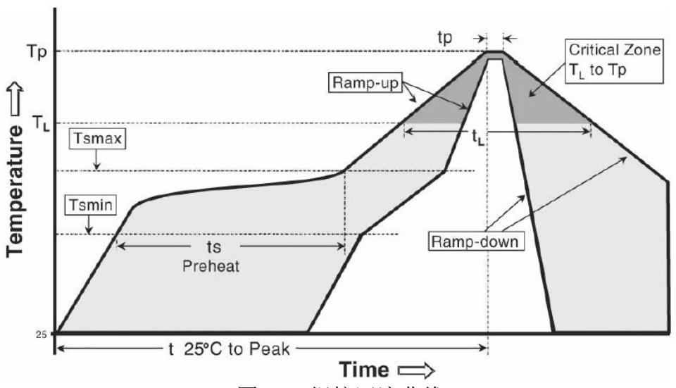

图 6.1 焊接回流曲线

### **7** 引脚排列和封装

### **7.1** 按引脚排列的封装引脚

表 7-1 按引脚排列的封装引脚表

| Pin Number | Net/Pwr | Group    | Pin Number | Net Name      | X Coord   | Y Coord   |
|------------|---------|----------|------------|---------------|-----------|-----------|
| F23        | n       | ACPI     | F23        | ACPI_BATLOWN  | 9500.00   | 7500.00   |
| B26        | n       | ACPI     | B26        | ACPI_DOTESTN  | 12500.00  | 11500.00  |
| D23        | n       | ACPI     | D23        | ACPI_EN       | 9500.00   | 9500.00   |
| G22        | n       | ACPI     | G22        | ACPI_LID      | 8500.00   | 6500.00   |
| G20        | n       | ACPI     | G20        | ACPI_PLTRSTN  | 6500.00   | 6500.00   |
| E23        | n       | ACPI     | E23        | ACPI_PWRBTNN  | 9500.00   | 8500.00   |
| D24        | n       | ACPI     | D24        | ACPI_PWROK    | 10500.00  | 9500.00   |
| H21        | n       | ACPI     | H21        | ACPI_PWRTYPE  | 7500.00   | 5500.00   |
| G21        | n       | ACPI     | G21        | ACPI_RINGN    | 7500.00   | 6500.00   |
| E22        | n       | ACPI     | E22        | ACPI_S3N      | 8500.00   | 8500.00   |
| F21        | n       | ACPI     | F21        | ACPI_S4N      | 7500.00   | 7500.00   |
| C24        | n       | ACPI     | C24        | ACPI_S5N      | 10500.00  | 10500.00  |
| D22        | n       | ACPI     | D22        | ACPI_SLPLANN  | 8500.00   | 9500.00   |
| B25        | n       | ACPI     | B25        | ACPI_SUSSTATN | 11500.00  | 11500.00  |
| C25        | n       | ACPI     | C25        | ACPI_SYSRSTN  | 11500.00  | 10500.00  |
| D26        | n       | ACPI     | D26        | ACPI_VID0     | 12500.00  | 9500.00   |
| E25        | n       | ACPI     | E25        | ACPI_VID1     | 11500.00  | 8500.00   |
| F24        | n       | ACPI     | F24        | ACPI_VID2     | 10500.00  | 7500.00   |
| H22        | n       | ACPI     | H22        | ACPI_VID3     | 8500.00   | 5500.00   |
| E26        | n       | ACPI     | E26        | ACPI_VID4     | 12500.00  | 8500.00   |
| H23        | n       | ACPI     | H23        | ACPI_VID5     | 9500.00   | 5500.00   |
| C26        | n       | ACPI     | C26        | ACPI_WAKEN    | 12500.00  | 10500.00  |
| AB24       | n       | CAN      | AB24       | CAN0_RX       | 10500.00  | -8500.00  |
| AA22       | n       | CAN      | AA22       | CAN0_TX       | 8500.00   | -7500.00  |
| AC24       | n       | CAN      | AC24       | CAN1_RX       | 10500.00  | -9500.00  |
| AD25       | n       | CAN      | AD25       | CAN1_TX       | 11500.00  | -10500.00 |
| V6         | n       | DDR_CTRL | V06        | DDR_A00       | -7500.00  | -4500.00  |
| W4         | n       | DDR_CTRL | W04        | DDR_A01       | -9500.00  | -5500.00  |
| AA4        | n       | DDR_CTRL | AA04       | DDR_A02       | -9500.00  | -7500.00  |
| AA3        | n       | DDR_CTRL | AA03       | DDR_A03       | -10500.00 | -7500.00  |
| W3         | n       | DDR_CTRL | W03        | DDR_A04       | -10500.00 | -5500.00  |
| Y4         | n       | DDR_CTRL | Y04        | DDR_A05       | -9500.00  | -6500.00  |
| Y1         | n       | DDR_CTRL | Y01        | DDR_A06       | -12500.00 | -6500.00  |
| W1         | n       | DDR_CTRL | W01        | DDR_A07       | -12500.00 | -5500.00  |
| Y2         | n       | DDR_CTRL | Y02        | DDR_A08       | -11500.00 | -6500.00  |
| V4         | n       | DDR_CTRL | V04        | DDR_A09       | -9500.00  | -4500.00  |
| Y5         | n       | DDR_CTRL | Y05        | DDR_A10       | -8500.00  | -6500.00  |

| W2   | n | DDR_CTRL | W02  | DDR_A11    | -11500.00 | -5500.00  |
|------|---|----------|------|------------|-----------|-----------|
| V3   | n | DDR_CTRL | V03  | DDR_A12    | -10500.00 | -4500.00  |
| AE4  | n | DDR_CTRL | AE04 | DDR_A13    | -9500.00  | -11500.00 |
| U1   | n | DDR_CTRL | U01  | DDR_A14    | -12500.00 | -3500.00  |
| U3   | n | DDR_CTRL | U03  | DDR_A15    | -10500.00 | -3500.00  |
| W6   | n | DDR_CTRL | W06  | DDR_BA0    | -7500.00  | -5500.00  |
| W5   | n | DDR_CTRL | W05  | DDR_BA1    | -8500.00  | -5500.00  |
| V1   | n | DDR_CTRL | V01  | DDR_BA2    | -12500.00 | -4500.00  |
| AB6  | n | DDR_CTRL | AB06 | DDR_CASN   | -7500.00  | -8500.00  |
| U6   | n | DDR_CTRL | U06  | DDR_CKE0   | -7500.00  | -3500.00  |
| U4   | n | DDR_CTRL | U04  | DDR_CKE1   | -9500.00  | -3500.00  |
| U5   | n | DDR_CTRL | U05  | DDR_CKE2   | -8500.00  | -3500.00  |
| U2   | n | DDR_CTRL | U02  | DDR_CKE3   | -11500.00 | -3500.00  |
| N4   | n | DDR_CTRL | N04  | DDR_CKN0   | -9500.00  | 500.00    |
| M4   | n | DDR_CTRL | M04  | DDR_CKN1   | -9500.00  | 1500.00   |
| AA1  | n | DDR_CTRL | AA01 | DDR_CKN2   | -12500.00 | -7500.00  |
| AB2  | n | DDR_CTRL | AB02 | DDR_CKN3   | -11500.00 | -8500.00  |
| AE9  | n | DDR_CTRL | AE09 | DDR_CKN4   | -4500.00  | -11500.00 |
| AF10 | n | DDR_CTRL | AF10 | DDR_CKN5   | -3500.00  | -12500.00 |
| AC1  | n | DDR_CTRL | AC01 | DDR_CKN6   | -12500.00 | -9500.00  |
| AE1  | n | DDR_CTRL | AE01 | DDR_CKN7   | -12500.00 | -11500.00 |
| N3   | n | DDR_CTRL | N03  | DDR_CKP0   | -10500.00 | 500.00    |
| M3   | n | DDR_CTRL | M03  | DDR_CKP1   | -10500.00 | 1500.00   |
| AA2  | n | DDR_CTRL | AA02 | DDR_CKP2   | -11500.00 | -7500.00  |
| AB1  | n | DDR_CTRL | AB01 | DDR_CKP3   | -12500.00 | -8500.00  |
| AF9  | n | DDR_CTRL | AF09 | DDR_CKP4   | -4500.00  | -12500.00 |
| AE10 | n | DDR_CTRL | AE10 | DDR_CKP5   | -3500.00  | -11500.00 |
| AC2  | n | DDR_CTRL | AC02 | DDR_CKP6   | -11500.00 | -9500.00  |
| AD1  | n | DDR_CTRL | AD01 | DDR_CKP7   | -12500.00 | -10500.00 |
| AD4  | n | DDR_CTRL | AD04 | DDR_CSN0   | -9500.00  | -10500.00 |
| AA7  | n | DDR_CTRL | AA07 | DDR_CSN1   | -6500.00  | -7500.00  |
| AD5  | n | DDR_CTRL | AD05 | DDR_CSN2   | -8500.00  | -10500.00 |
| AC6  | n | DDR_CTRL | AC06 | DDR_CSN3   | -7500.00  | -9500.00  |
| AC5  | n | DDR_CTRL | AC05 | DDR_ODT0   | -8500.00  | -9500.00  |
| AF3  | n | DDR_CTRL | AF03 | DDR_ODT1   | -10500.00 | -12500.00 |
| AB7  | n | DDR_CTRL | AB07 | DDR_ODT2   | -6500.00  | -8500.00  |
| AF4  | n | DDR_CTRL | AF04 | DDR_ODT3   | -9500.00  | -12500.00 |
| AE3  | n | DDR_CTRL | AE03 | DDR_RASN   | -10500.00 | -11500.00 |
| V2   | n | DDR_CTRL | V02  | DDR_RESETN | -11500.00 | -4500.00  |
| AB3  | n | DDR_CTRL | AB03 | DDR_REXT   | -10500.00 | -8500.00  |
| AF2  | n | DDR_CTRL | AF02 | DDR_WEN    | -11500.00 | -12500.00 |
| K4   | n | DDR_DATA | K04  | DDR_DQ00   | -9500.00  | 3500.00   |
| L6   | n | DDR_DATA | L06  | DDR_DQ01   | -7500.00  | 2500.00   |
| K6   | n | DDR_DATA | K06  | DDR_DQ02   | -7500.00  | 3500.00   |
| J3   | n | DDR_DATA | J03  | DDR_DQ03   | -10500.00 | 4500.00   |
| K7   | n | DDR_DATA | K07  | DDR_DQ04   | -6500.00  | 3500.00   |
|      |   |          |      |            |           |           |

| J5   | n | DDR_DATA | J05  | DDR_DQ05 | -8500.00  | 4500.00   |
|------|---|----------|------|----------|-----------|-----------|
| J4   | n | DDR_DATA | J04  | DDR_DQ06 | -9500.00  | 4500.00   |
| H1   | n | DDR_DATA | H01  | DDR_DQ07 | -12500.00 | 5500.00   |
| M1   | n | DDR_DATA | M01  | DDR_DQ08 | -12500.00 | 1500.00   |
| M6   | n | DDR_DATA | M06  | DDR_DQ09 | -7500.00  | 1500.00   |
| M7   | n | DDR_DATA | M07  | DDR_DQ10 | -6500.00  | 1500.00   |
| L3   | n | DDR_DATA | L03  | DDR_DQ11 | -10500.00 | 2500.00   |
| K2   | n | DDR_DATA | K02  | DDR_DQ12 | -11500.00 | 3500.00   |
| K1   | n | DDR_DATA | K01  | DDR_DQ13 | -12500.00 | 3500.00   |
| K3   | n | DDR_DATA | K03  | DDR_DQ14 | -10500.00 | 3500.00   |
| L4   | n | DDR_DATA | L04  | DDR_DQ15 | -9500.00  | 2500.00   |
| R4   | n | DDR_DATA | R04  | DDR_DQ16 | -9500.00  | -1500.00  |
| P7   | n | DDR_DATA | P07  | DDR_DQ17 | -6500.00  | -500.00   |
| P4   | n | DDR_DATA | P04  | DDR_DQ18 | -9500.00  | -500.00   |
| P3   | n | DDR_DATA | P03  | DDR_DQ19 | -10500.00 | -500.00   |
| N2   | n | DDR_DATA | N02  | DDR_DQ20 | -11500.00 | 500.00    |
| N1   | n | DDR_DATA | N01  | DDR_DQ21 | -12500.00 | 500.00    |
| N6   | n | DDR_DATA | N06  | DDR_DQ22 | -7500.00  | 500.00    |
| N5   | n | DDR_DATA | N05  | DDR_DQ23 | -8500.00  | 500.00    |
| T7   | n | DDR_DATA | T07  | DDR_DQ24 | -6500.00  | -2500.00  |
| T6   | n | DDR_DATA | T06  | DDR_DQ25 | -7500.00  | -2500.00  |
| T4   | n | DDR_DATA | T04  | DDR_DQ26 | -9500.00  | -2500.00  |
| R6   | n | DDR_DATA | R06  | DDR_DQ27 | -7500.00  | -1500.00  |
| R1   | n | DDR_DATA | R01  | DDR_DQ28 | -12500.00 | -1500.00  |
| R5   | n | DDR_DATA | R05  | DDR_DQ29 | -8500.00  | -1500.00  |
| R2   | n | DDR_DATA | R02  | DDR_DQ30 | -11500.00 | -1500.00  |
| R3   | n | DDR_DATA | R03  | DDR_DQ31 | -10500.00 | -1500.00  |
| AE5  | n | DDR_DATA | AE05 | DDR_DQ32 | -8500.00  | -11500.00 |
| AD6  | n | DDR_DATA | AD06 | DDR_DQ33 | -7500.00  | -10500.00 |
| AF5  | n | DDR_DATA | AF05 | DDR_DQ34 | -8500.00  | -12500.00 |
| AB8  | n | DDR_DATA | AB08 | DDR_DQ35 | -5500.00  | -8500.00  |
| Y10  | n | DDR_DATA | Y10  | DDR_DQ36 | -3500.00  | -6500.00  |
| AA9  | n | DDR_DATA | AA09 | DDR_DQ37 | -4500.00  | -7500.00  |
| AC8  | n | DDR_DATA | AC08 | DDR_DQ38 | -5500.00  | -9500.00  |
| AF7  | n | DDR_DATA | AF07 | DDR_DQ39 | -6500.00  | -12500.00 |
| AB9  | n | DDR_DATA | AB09 | DDR_DQ40 | -4500.00  | -8500.00  |
| AD7  | n | DDR_DATA | AD07 | DDR_DQ41 | -6500.00  | -10500.00 |
| AD8  | n | DDR_DATA | AD08 | DDR_DQ42 | -5500.00  | -10500.00 |
| AA10 | n | DDR_DATA | AA10 | DDR_DQ43 | -3500.00  | -7500.00  |
| AC9  | n | DDR_DATA | AC09 | DDR_DQ44 | -4500.00  | -9500.00  |
| Y11  | n | DDR_DATA | Y11  | DDR_DQ45 | -2500.00  | -6500.00  |
| AC10 | n | DDR_DATA | AC10 | DDR_DQ46 | -3500.00  | -9500.00  |
| AD9  | n | DDR_DATA | AD09 | DDR_DQ47 | -4500.00  | -10500.00 |
| AA11 | n | DDR_DATA | AA11 | DDR_DQ48 | -2500.00  | -7500.00  |
| AB11 | n | DDR_DATA | AB11 | DDR_DQ49 | -2500.00  | -8500.00  |
| AD11 | n | DDR_DATA | AD11 | DDR_DQ50 | -2500.00  | -10500.00 |
|      |   |          |      |          |           |           |

| AA12 | n | DDR_DATA | AA12 | DDR_DQ51  | -1500.00  | -7500.00  |
|------|---|----------|------|-----------|-----------|-----------|
| AC12 | n | DDR_DATA | AC12 | DDR_DQ52  | -1500.00  | -9500.00  |
| AB12 | n | DDR_DATA | AB12 | DDR_DQ53  | -1500.00  | -8500.00  |
| AE12 | n | DDR_DATA | AE12 | DDR_DQ54  | -1500.00  | -11500.00 |
| AD12 | n | DDR_DATA | AD12 | DDR_DQ55  | -1500.00  | -10500.00 |
| AF12 | n | DDR_DATA | AF12 | DDR_DQ56  | -1500.00  | -12500.00 |
| AA13 | n | DDR_DATA | AA13 | DDR_DQ57  | -500.00   | -7500.00  |
| AC13 | n | DDR_DATA | AC13 | DDR_DQ58  | -500.00   | -9500.00  |
| AD13 | n | DDR_DATA | AD13 | DDR_DQ59  | -500.00   | -10500.00 |
| AF14 | n | DDR_DATA | AF14 | DDR_DQ60  | 500.00    | -12500.00 |
| AE14 | n | DDR_DATA | AE14 | DDR_DQ61  | 500.00    | -11500.00 |
| AA14 | n | DDR_DATA | AA14 | DDR_DQ62  | 500.00    | -7500.00  |
| AB14 | n | DDR_DATA | AB14 | DDR_DQ63  | 500.00    | -8500.00  |
| L5   | n | DDR_DATA | L05  | DDR_DQM0  | -8500.00  | 2500.00   |
| M2   | n | DDR_DATA | M02  | DDR_DQM1  | -11500.00 | 1500.00   |
| P6   | n | DDR_DATA | P06  | DDR_DQM2  | -7500.00  | -500.00   |
| T5   | n | DDR_DATA | T05  | DDR_DQM3  | -8500.00  | -2500.00  |
| AC7  | n | DDR_DATA | AC07 | DDR_DQM4  | -6500.00  | -9500.00  |
| AE7  | n | DDR_DATA | AE07 | DDR_DQM5  | -6500.00  | -11500.00 |
| AD10 | n | DDR_DATA | AD10 | DDR_DQM6  | -3500.00  | -10500.00 |
| Y13  | n | DDR_DATA | Y13  | DDR_DQM7  | -500.00   | -6500.00  |
| J2   | n | DDR_DATA | J02  | DDR_DQSN0 | -11500.00 | 4500.00   |
| L2   | n | DDR_DATA | L02  | DDR_DQSN1 | -11500.00 | 2500.00   |
| P1   | n | DDR_DATA | P01  | DDR_DQSN2 | -12500.00 | -500.00   |
| T1   | n | DDR_DATA | T01  | DDR_DQSN3 | -12500.00 | -2500.00  |
| AF6  | n | DDR_DATA | AF06 | DDR_DQSN4 | -7500.00  | -12500.00 |
| AF8  | n | DDR_DATA | AF08 | DDR_DQSN5 | -5500.00  | -12500.00 |
| AF11 | n | DDR_DATA | AF11 | DDR_DQSN6 | -2500.00  | -12500.00 |
| AF13 | n | DDR_DATA | AF13 | DDR_DQSN7 | -500.00   | -12500.00 |
| J1   | n | DDR_DATA | J01  | DDR_DQSP0 | -12500.00 | 4500.00   |
|      |   |          |      |           |           |           |
| L1   | n | DDR_DATA | L01  | DDR_DQSP1 | -12500.00 | 2500.00   |
| P2   | n | DDR_DATA | P02  | DDR_DQSP2 | -11500.00 | -500.00   |
| T2   | n | DDR_DATA | T02  | DDR_DQSP3 | -11500.00 | -2500.00  |
| AE6  | n | DDR_DATA | AE06 | DDR_DQSP4 | -7500.00  | -11500.00 |
| AE8  | n | DDR_DATA | AE08 | DDR_DQSP5 | -5500.00  | -11500.00 |
| AE11 | n | DDR_DATA | AE11 | DDR_DQSP6 | -2500.00  | -11500.00 |
| AE13 | n | DDR_DATA | AE13 | DDR_DQSP7 | -500.00   | -11500.00 |
| AE16 | n | DVO      | AE16 | DVO0_CLKN | 2500.00   | -11500.00 |
| AF16 | n | DVO      | AF16 | DVO0_CLKP | 2500.00   | -12500.00 |
| AD15 | n | DVO      | AD15 | DVO0_D00  | 1500.00   | -10500.00 |
| AC15 | n | DVO      | AC15 | DVO0_D01  | 1500.00   | -9500.00  |
| AB15 | n | DVO      | AB15 | DVO0_D02  | 1500.00   | -8500.00  |
| AA15 | n | DVO      | AA15 | DVO0_D03  | 1500.00   | -7500.00  |
| AD16 | n | DVO      | AD16 | DVO0_D04  | 2500.00   | -10500.00 |
| AC16 | n | DVO      | AC16 | DVO0_D05  | 2500.00   | -9500.00  |
| AA16 | n | DVO      | AA16 | DVO0_D06  | 2500.00   | -7500.00  |

| AFI7         n         DVO         AFI7         DVOO_DO7         3500.00         -12500.00           AE17         n         DVO         AE18         DVOO_DO8         3500.00         -11500.00           AFI8         n         DVO         AE18         DVOO_DO9         4500.00         -12500.00           AD17         n         DVO         AB18         DVOO_DO1         3500.00         -1500.00           AD18         n         DVO         AB18         DVOO_DO1         4500.00         -1500.00           AC17         n         DVO         AC18         DVOO_DO1         4500.00         -1500.00           AC17         n         DVO         AC19         DVOO_DO1         4500.00         -1500.00           AC17         n         DVO         AC19         DVOO_DO1         5500.00         -1500.00           AC17         n         DVO         AC19         DVOO_DO1         5500.00         -1500.00           AC20         n         DVO         AC20         DVOO_DO1         5500.00         -1500.00           Y16         n         DVO         AC18         DVOO_DO1         2500.00         -8500.00           AC16         n                                                                                                                       |      |   |     |      |            |          |           |
|------------------------------------------------------------------------------------------------------------------------------------------------------------------------------------------------------------------------------------------------------------------------------------------------------------------------------------------------------------------------------------------------------------------------------------------------------------------------------------------------------------------------------------------------------------------------------------------------------------------------------------------------------------------------------------------------------------------------------------------------------------------------------------------------------------------------------------------------------------------------------------------------------------------------------------------------------------------------------------------------------------------------------------------------------------------------------------------------------------------------------------------------------------------------------------------------------------------------------------------------------------------------------------|------|---|-----|------|------------|----------|-----------|
| AF18         n         DVO         AF18         DVOO_D09         4500.00         -12500.00           AD17         n         DVO         AD17         DVOO_D10         3500.00         -10500.00           AE18         n         DVO         AD18         DVOO_D11         4500.00         -11500.00           AE18         n         DVO         AD18         DVOO_D12         4500.00         -11500.00           AC17         n         DVO         AC17         DVOO_D13         3500.00         -9500.00           AC17         n         DVO         AC19         DVOO_D14         5500.00         -12500.00           AC19         n         DVO         AE19         DVOO_D16         6500.00         -11500.00           AE20         n         DVO         AE20         DVOO_D16         6500.00         -11500.00           Y16         n         DVO         AE20         DVOO_D16         6500.00         -11500.00           Y16         n         DVO         AE17         DVOO_D19         4500.00         -8500.00           Y16         n         DVO         AC18         DVOO_D19         4500.00         -1500.00           AB17         n         <                                                                                                          | AF17 | n | DVO | AF17 | DVO0_D07   | 3500.00  | -12500.00 |
| AD17                                                                                                                                                                                                                                                                                                                                                                                                                                                                                                                                                                                                                                                                                                                                                                                                                                                                                                                                                                                                                                                                                                                                                                                                                                                                               | AE17 | n | DVO | AE17 | DVO0_D08   | 3500.00  | -11500.00 |
| AE18         n         DVO         AE18         DVOQ_D11         4500.00         -11500.00           AD18         n         DVO         AD18         DVOQ_D12         4500.00         -10500.00           AC17         n         DVO         AC17         DVOQ_D13         3500.00         -9500.00           AC19         n         DVO         AE19         DVOQ_D14         5500.00         -12500.00           AE19         n         DVO         AE20         DVOQ_D15         5500.00         -11500.00           AE20         n         DVO         AE20         DVOQ_D16         6500.00         -11500.00           AE20         n         DVO         AE16         DVOQ_D17         2500.00         -6500.00           AC18         n         DVO         AB17         DVOQ_D18         3500.00         -8500.00           AC18         n         DVO         AB17         DVOQ_D18         3500.00         -9500.00           AC18         n         DVO         AD19         DVOQ_D20         5500.00         -12500.00           AC18         n         DVO         AA17         DVOQ_D223         5500.00         -12500.00           AC19         n                                                                                                                 | AF18 | n | DVO | AF18 | DVO0_D09   | 4500.00  | -12500.00 |
| AD18                                                                                                                                                                                                                                                                                                                                                                                                                                                                                                                                                                                                                                                                                                                                                                                                                                                                                                                                                                                                                                                                                                                                                                                                                                                                               | AD17 | n | DVO | AD17 | DVO0_D10   | 3500.00  | -10500.00 |
| AC17                                                                                                                                                                                                                                                                                                                                                                                                                                                                                                                                                                                                                                                                                                                                                                                                                                                                                                                                                                                                                                                                                                                                                                                                                                                                               | AE18 | n | DVO | AE18 | DVO0_D11   | 4500.00  | -11500.00 |
| AF19         n         DVO         AF19         DVO0_D14         5500.00         -12500.00           AE19         n         DVO         AE19         DVO0_D15         5500.00         -11500.00           AE20         n         DVO         AE20         DVO0_D16         6500.00         -11500.00           Y16         n         DVO         Y16         DVO0_D17         2500.00         -6500.00           AB17         n         DVO         AB17         DVO0_D19         2500.00         -6500.00           AC18         n         DVO         AC18         DVO0_D19         4500.00         -9500.00           AC18         n         DVO         AC18         DVO0_D19         4500.00         -9500.00           AC19         n         DVO         AC20         DVO0_D20         5500.00         -15000.00           AC19         n         DVO         AC19         DVO0_D21         5500.00         -9500.00           AC19         n         DVO         AC19         DVO0_D22         3500.00         -7500.00           AC19         n         DVO         AC19         DVO0_D22         3500.00         -15000.00           AC15         n <td< td=""><td>AD18</td><td>n</td><td>DVO</td><td>AD18</td><td>DVO0_D12</td><td>4500.00</td><td>-10500.00</td></td<> | AD18 | n | DVO | AD18 | DVO0_D12   | 4500.00  | -10500.00 |
| AE19         n         DVO         AE19         DVO_DIS         5500.00         -11500.00           AE20         n         DVO         AE20         DVO0_DI6         6500.00         -11500.00           Y16         n         DVO         Y16         DVO0_DI7         2500.00         -6500.00           AB17         n         DVO         AB17         DVO0_DI8         3500.00         -8500.00           AC18         n         DVO         AC18         DVO0_D19         4500.00         -9500.00           AD19         n         DVO         AC18         DVO0_D20         5500.00         -10500.00           AF20         n         DVO         AC19         DVO0_D21         6500.00         -12500.00           AA17         n         DVO         AC19         DVO0_D22         3500.00         -7500.00           AC19         n         DVO         AC19         DVO0_D22         3500.00         -7500.00           AC19         n         DVO         AC19         DVO0_D22         3500.00         -7500.00           AC19         n         DVO         AC19         DVO0_D22         3500.00         -7500.00           AC19         n         D                                                                                                              | AC17 | n | DVO | AC17 | DVO0_D13   | 3500.00  | -9500.00  |
| AE20         n         DVO         AE20         DVO0_D16         6500.00         -11500.00           Y16         n         DVO         Y16         DVO0_D17         2500.00         -6500.00           AB17         n         DVO         AB17         DVO0_D18         3500.00         -8500.00           AC18         n         DVO         AC18         DVO0_D19         4500.00         -9500.00           AC19         n         DVO         AD19         DVO0_D20         5500.00         -10500.00           AA17         n         DVO         AA20         DVO0_D21         6500.00         -12500.00           AA17         n         DVO         AA17         DVO0_D22         3500.00         -7500.00           AC19         n         DVO         AC19         DVO0_D23         5500.00         -9500.00           AE15         n         DVO         AC19         DVO0_DE         1500.00         -11500.00           AF15         n         DVO         AC15         DVO0_BE         1500.00         -11500.00           AF21         n         DVO         AC15         DVO1_CLKN         7500.00         -11500.00           AF21         n <td< td=""><td>AF19</td><td>n</td><td>DVO</td><td>AF19</td><td>DVO0_D14</td><td>5500.00</td><td>-12500.00</td></td<> | AF19 | n | DVO | AF19 | DVO0_D14   | 5500.00  | -12500.00 |
| Y16         n         DVO         Y16         DVO_D17         2500.00         -6500.00           AB17         n         DVO         AB17         DVO_D18         3500.00         -8500.00           AC18         n         DVO         AC18         DVO_D19         4500.00         -9500.00           AD19         n         DVO         AD19         DVO_D20         5500.00         -12500.00           AD19         n         DVO         AD19         DVO_D20         5500.00         -12500.00           AA17         n         DVO         AA17         DVO_D22         3500.00         -7500.00           AC19         n         DVO         AC19         DVO_D23         5500.00         -9500.00           AE15         n         DVO         AE15         DVO_DE         1500.00         -11500.00           AF15         n         DVO         AF15         DVO_LEKYNC         1500.00         -12500.00           AF15         n         DVO         AF21         DVO_LEKYNC         500.00         -12500.00           AF21         n         DVO         AF21         DVO_LEKYNC         500.00         -12500.00           AF21         n         DVO                                                                                                              | AE19 | n | DVO | AE19 | DVO0_D15   | 5500.00  | -11500.00 |
| AB17         n         DVO         AB17         DVO_D18         3500.00         -8500.00           AC18         n         DVO         AC18         DVO_D19         4500.00         -9500.00           AD19         n         DVO         AD19         DVO_D20         5500.00         -10500.00           AF20         n         DVO         AF20         DVO_D21         6500.00         -12500.00           AA17         n         DVO         AA17         DVO_D22         3500.00         -7500.00           AC19         n         DVO         AC19         DVO_D23         5500.00         -9500.00           AE15         n         DVO         AE15         DVO_DE         1500.00         -11500.00           AE15         n         DVO         AF15         DVO_DE         1500.00         -12500.00           AF15         n         DVO         AF15         DVO_DE         1500.00         -12500.00           AF21         n         DVO         AF21         DVO_LSYNC         500.00         -10500.00           AF21         n         DVO         AF21         DVO_LCLKN         7500.00         -12500.00           AF21         n         DVO <td>AE20</td> <td>n</td> <td>DVO</td> <td>AE20</td> <td>DVO0_D16</td> <td>6500.00</td> <td>-11500.00</td>       | AE20 | n | DVO | AE20 | DVO0_D16   | 6500.00  | -11500.00 |
| AC18         n         DVO         AC18         DVO_D19         4500.00         .9500.00           AD19         n         DVO         AD19         DVO_D20         .5500.00         .10500.00           AF20         n         DVO         AF20         DVO_D21         .6500.00         .12500.00           AA17         n         DVO         AA17         DVO_D22         .3500.00         .7500.00           AC19         n         DVO         AC19         DVO_D23         .5500.00         .7500.00           AE15         n         DVO         AE15         DVO_DE         .1500.00         .11500.00           AF15         n         DVO         AF15         DVO_HSYNC         .500.00         .11500.00           AD14         n         DVO         AE21         DVO_LCLKN         .7500.00         .11500.00           AE21         n         DVO         AE21         DVO1_CLKN         .7500.00         .11500.00           AF21         n         DVO         AC20         DVO1_CLKN         .7500.00         .11500.00           AF21         n         DVO         AC20         DVO1_D00         .6500.00         .9500.00           AF21         n                                                                                                            | Y16  | n | DVO | Y16  | DVO0_D17   | 2500.00  | -6500.00  |
| AD19         n         DVO         AD19         DVO_D20         5500.00         -10500.00           AF20         n         DVO         AF20         DVO_D21         6500.00         -12500.00           AA17         n         DVO         AA17         DVO_D22         3500.00         -7500.00           AC19         n         DVO         AC19         DVO_D23         5500.00         -9500.00           AE15         n         DVO         AE15         DVO_DE         1500.00         -11500.00           AF15         n         DVO         AF15         DVO_HSYNC         1500.00         -12500.00           AF15         n         DVO         AF15         DVO_HSYNC         1500.00         -12500.00           AE21         n         DVO         AE21         DVO_LCLKN         7500.00         -12500.00           AE21         n         DVO         AE21         DVO1_CLKN         7500.00         -11500.00           AF21         n         DVO         AE21         DVO1_CLKN         7500.00         -12500.00           AF21         n         DVO         AE21         DVO1_CLKN         7500.00         -12500.00           AF21         n                                                                                                                | AB17 | n | DVO | AB17 | DVO0_D18   | 3500.00  | -8500.00  |
| AF20         n         DVO         AF20         DVO0_D21         6500.00         -12500.00           AA17         n         DVO         AA17         DVO0_D22         3500.00         -7500.00           AC19         n         DVO         AC19         DVO0_D23         5500.00         -9500.00           AE15         n         DVO         AE15         DVO0_DE         1500.00         -11500.00           AF15         n         DVO         AF15         DVO0_HSYNC         1500.00         -12500.00           AD14         n         DVO         AD14         DVO0_VSYNC         500.00         -15000.00           AE21         n         DVO         AE21         DVO1_CLKN         7500.00         -15000.00           AF21         n         DVO         AE21         DVO1_CLKP         7500.00         -12500.00           AC20         n         DVO         AC20         DVO1_D00         6500.00         -9500.00           AC21         n         DVO         AC21         DVO1_D01         7500.00         -10500.00           AC21         n         DVO         AA19         DVO1_D02         4500.00         -6500.00           AC21         n                                                                                                              | AC18 | n | DVO | AC18 | DVO0_D19   | 4500.00  | -9500.00  |
| AA17         n         DVO         AA17         DVO_D22         3500.00         -7500.00           AC19         n         DVO         AC19         DVO_D23         5500.00         -9500.00           AE15         n         DVO         AE15         DVO_DE         1500.00         -11500.00           AF15         n         DVO         AF15         DVO_LSYNC         1500.00         -12500.00           AD14         n         DVO         AD14         DVO_LCLKN         7500.00         -10500.00           AE21         n         DVO         AE21         DVOI_CLKP         7500.00         -12500.00           AF21         n         DVO         AF21         DVOI_CLKP         7500.00         -12500.00           AF21         n         DVO         AF21         DVOI_D00         6500.00         -9500.00           AD21         n         DVO         AD21         DVOI_D00         6500.00         -9500.00           AD21         n         DVO         AD21         DVOI_D00         4500.00         -6500.00           AB21         n         DVO         AA19         DVOI_D03         5500.00         -7500.00           AB21         n         <                                                                                                          | AD19 | n | DVO | AD19 | DVO0_D20   | 5500.00  | -10500.00 |
| AC19         n         DVO         AC19         DVO_D23         5500.00         -9500.00           AE15         n         DVO         AE15         DVO_DE         1500.00         -11500.00           AF15         n         DVO         AF15         DVO0_HSYNC         1500.00         -12500.00           AD14         n         DVO         AD14         DVO0_VSYNC         500.00         -10500.00           AE21         n         DVO         AE21         DVO1_CLKN         7500.00         -11500.00           AF21         n         DVO         AE21         DVO1_CLKP         7500.00         -12500.00           AC20         n         DVO         AC20         DVO1_D00         6500.00         -9500.00           AC20         n         DVO         AD21         DVO1_D01         7500.00         -10500.00           Y18         n         DVO         AD21         DVO1_D02         4500.00         -6500.00           AA19         n         DVO         AA19         DVO1_D03         5500.00         -7500.00           AF22         n         DVO         AF22         DVO1_D03         8500.00         -12500.00           AF22         n                                                                                                                 | AF20 | n | DVO | AF20 | DVO0_D21   | 6500.00  | -12500.00 |
| AE15         n         DVO         AE15         DVO_DE         1500.00         -11500.00           AF15         n         DVO         AF15         DVO0_HSYNC         1500.00         -12500.00           AD14         n         DVO         AD14         DVO0_VSYNC         500.00         -10500.00           AE21         n         DVO         AE21         DVO1_CLKN         7500.00         -11500.00           AF21         n         DVO         AF21         DVO1_CLKP         7500.00         -12500.00           AC20         n         DVO         AC20         DVO1_D00         6500.00         -9500.00           AD21         n         DVO         AD21         DVO1_D01         7500.00         -10500.00           Y18         n         DVO         AA19         DVO1_D02         4500.00         -6500.00           AA19         n         DVO         AA19         DVO1_D03         5500.00         -7500.00           AF22         n         DVO         AF22         DVO1_D04         7500.00         -9500.00           AF22         n         DVO         AF22         DVO1_D05         8500.00         -12500.00           AF23         n                                                                                                                | AA17 | n | DVO | AA17 | DVO0_D22   | 3500.00  | -7500.00  |
| AF15         n         DVO         AF15         DVO_HSYNC         1500.00         -12500.00           AD14         n         DVO         AD14         DVO_VSYNC         500.00         -10500.00           AE21         n         DVO         AE21         DVOI_CLKN         7500.00         -11500.00           AF21         n         DVO         AF21         DVOI_CLKP         7500.00         -12500.00           AC20         n         DVO         AC20         DVOI_D00         6500.00         -9500.00           AD21         n         DVO         AD21         DVOI_D01         7500.00         -10500.00           AD21         n         DVO         AD21         DVOI_D01         7500.00         -9500.00           AD21         n         DVO         AD21         DVOI_D02         4500.00         -6500.00           AD21         n         DVO         AA19         DVOI_D03         5500.00         -7500.00           AA19         n         DVO         AC21         DVOI_D04         7500.00         -9500.00           AF22         n         DVO         AF22         DVOI_D05         8500.00         -12500.00           AF22         n                                                                                                                | AC19 | n | DVO | AC19 | DVO0_D23   | 5500.00  | -9500.00  |
| AD14         n         DVO         AD14         DVO_VSYNC         500.00         -10500.00           AE21         n         DVO         AE21         DVO1_CLKN         7500.00         -11500.00           AF21         n         DVO         AF21         DVO1_CLKP         7500.00         -12500.00           AC20         n         DVO         AC20         DVO1_D00         6500.00         -9500.00           AD21         n         DVO         AD21         DVO1_D01         7500.00         -10500.00           Y18         n         DVO         AD21         DVO1_D02         4500.00         -6500.00           AA19         n         DVO         AA19         DVO1_D03         5500.00         -7500.00           AC21         n         DVO         AC21         DVO1_D04         7500.00         -9500.00           AF22         n         DVO         AF22         DVO1_D04         7500.00         -9500.00           AF22         n         DVO         AF22         DVO1_D05         8500.00         -12500.00           AF22         n         DVO         AF23         DVO1_D06         8500.00         -11500.00           AF23         n                                                                                                                  | AE15 | n | DVO | AE15 | DVO0_DE    | 1500.00  | -11500.00 |
| AE21         n         DVO         AE21         DVO1_CLKN         7500.00         -11500.00           AF21         n         DVO         AF21         DVO1_CLKP         7500.00         -12500.00           AC20         n         DVO         AC20         DVO1_D00         6500.00         -9500.00           AD21         n         DVO         AD21         DVO1_D01         7500.00         -10500.00           Y18         n         DVO         Y18         DVO1_D02         4500.00         -6500.00           AA19         n         DVO         AA19         DVO1_D03         5500.00         -7500.00           AC21         n         DVO         AC21         DVO1_D04         7500.00         -9500.00           AF22         n         DVO         AF22         DVO1_D05         8500.00         -12500.00           AE22         n         DVO         AE22         DVO1_D06         8500.00         -11500.00           AF23         n         DVO         AF23         DVO1_D06         8500.00         -12500.00           AE23         n         DVO         AF23         DVO1_D07         9500.00         -12500.00           AE23         n                                                                                                                  | AF15 | n | DVO | AF15 | DVO0_HSYNC | 1500.00  | -12500.00 |
| AF21         n         DVO         AF21         DVO1_CLKP         7500.00         -12500.00           AC20         n         DVO         AC20         DVO1_D00         6500.00         -9500.00           AD21         n         DVO         AD21         DVO1_D01         7500.00         -10500.00           Y18         n         DVO         Y18         DVO1_D02         4500.00         -6500.00           AA19         n         DVO         AA19         DVO1_D03         5500.00         -7500.00           AC21         n         DVO         AC21         DVO1_D04         7500.00         -9500.00           AF22         n         DVO         AF22         DVO1_D05         8500.00         -12500.00           AE22         n         DVO         AE22         DVO1_D06         8500.00         -11500.00           AE23         n         DVO         AF23         DVO1_D07         9500.00         -12500.00           AE23         n         DVO         AE23         DVO1_D08         8500.00         -11500.00           AE23         n         DVO         AE23         DVO1_D10         10500.00         -12500.00           AE24         n                                                                                                                  | AD14 | n | DVO | AD14 | DVO0_VSYNC | 500.00   | -10500.00 |
| AC20         n         DVO         AC20         DVOI_D00         6500.00         -9500.00           AD21         n         DVO         AD21         DVOI_D01         7500.00         -10500.00           Y18         n         DVO         Y18         DVOI_D02         4500.00         -6500.00           AA19         n         DVO         AA19         DVOI_D03         5500.00         -7500.00           AC21         n         DVO         AC21         DVOI_D04         7500.00         -9500.00           AF22         n         DVO         AF22         DVOI_D05         8500.00         -12500.00           AF22         n         DVO         AF22         DVOI_D06         8500.00         -12500.00           AF23         n         DVO         AF23         DVOI_D07         9500.00         -12500.00           AF23         n         DVO         AF23         DVOI_D08         8500.00         -10500.00           AE23         n         DVO         AE23         DVOI_D08         8500.00         -11500.00           AF24         n         DVO         AF24         DVOI_D09         9500.00         -11500.00           AF24         n         <                                                                                                          | AE21 | n | DVO | AE21 | DVO1_CLKN  | 7500.00  | -11500.00 |
| AD21         n         DVO         AD21         DVO1_D01         7500.00         -10500.00           Y18         n         DVO         Y18         DVO1_D02         4500.00         -6500.00           AA19         n         DVO         AA19         DVO1_D03         5500.00         -7500.00           AC21         n         DVO         AC21         DVO1_D04         7500.00         -9500.00           AF22         n         DVO         AF22         DVO1_D05         8500.00         -12500.00           AE22         n         DVO         AE22         DVO1_D06         8500.00         -11500.00           AF23         n         DVO         AF23         DVO1_D06         8500.00         -12500.00           AF23         n         DVO         AF23         DVO1_D07         9500.00         -12500.00           AD22         n         DVO         AD22         DVO1_D08         8500.00         -10500.00           AE23         n         DVO         AE23         DVO1_D08         8500.00         -11500.00           AE23         n         DVO         AE23         DVO1_D09         9500.00         -11500.00           AF24         n                                                                                                                   | AF21 | n | DVO | AF21 | DVO1_CLKP  | 7500.00  | -12500.00 |
| Y18         n         DVO         Y18         DVO1_D02         4500.00         -6500.00           AA19         n         DVO         AA19         DVO1_D03         5500.00         -7500.00           AC21         n         DVO         AC21         DVO1_D04         7500.00         -9500.00           AF22         n         DVO         AF22         DVO1_D05         8500.00         -12500.00           AE22         n         DVO         AE22         DVO1_D06         8500.00         -11500.00           AF23         n         DVO         AF23         DVO1_D07         9500.00         -12500.00           AD22         n         DVO         AF23         DVO1_D08         8500.00         -10500.00           AE23         n         DVO         AE23         DVO1_D08         8500.00         -10500.00           AE23         n         DVO         AE23         DVO1_D09         9500.00         -11500.00           AF24         n         DVO         AF24         DVO1_D10         10500.00         -12500.00           AF24         n         DVO         AF25         DVO1_D11         9500.00         -11500.00           AF25         n                                                                                                                  | AC20 | n | DVO | AC20 | DVO1_D00   | 6500.00  | -9500.00  |
| AA19         n         DVO         AA19         DVO1_D03         5500.00         -7500.00           AC21         n         DVO         AC21         DVO1_D04         7500.00         -9500.00           AF22         n         DVO         AF22         DVO1_D05         8500.00         -12500.00           AE22         n         DVO         AE22         DVO1_D06         8500.00         -11500.00           AF23         n         DVO         AF23         DVO1_D07         9500.00         -12500.00           AD22         n         DVO         AD22         DVO1_D08         8500.00         -10500.00           AE23         n         DVO         AE23         DVO1_D08         8500.00         -10500.00           AE23         n         DVO         AE23         DVO1_D09         9500.00         -11500.00           AE24         n         DVO         AF24         DVO1_D10         10500.00         -12500.00           AF24         n         DVO         AF25         DVO1_D11         9500.00         -10500.00           AF25         n         DVO         AE24         DVO1_D13         10500.00         -11500.00           AC22         n                                                                                                              | AD21 | n | DVO | AD21 | DVO1_D01   | 7500.00  | -10500.00 |
| AC21         n         DVO         AC21         DVO1_D04         7500.00         -9500.00           AF22         n         DVO         AF22         DVO1_D05         8500.00         -12500.00           AE22         n         DVO         AE22         DVO1_D06         8500.00         -11500.00           AF23         n         DVO         AF23         DVO1_D07         9500.00         -12500.00           AD22         n         DVO         AD22         DVO1_D08         8500.00         -10500.00           AE23         n         DVO         AE23         DVO1_D09         9500.00         -11500.00           AE23         n         DVO         AE23         DVO1_D10         10500.00         -12500.00           AF24         n         DVO         AF24         DVO1_D10         10500.00         -12500.00           AF25         n         DVO         AF25         DVO1_D11         9500.00         -12500.00           AF25         n         DVO         AF25         DVO1_D12         11500.00         -11500.00           AE24         n         DVO         AE24         DVO1_D13         10500.00         -9500.00           AB21         n                                                                                                            | Y18  | n | DVO | Y18  | DVO1_D02   | 4500.00  | -6500.00  |
| AF22         n         DVO         AF22         DVO1_D05         8500.00         -12500.00           AE22         n         DVO         AE22         DVO1_D06         8500.00         -11500.00           AF23         n         DVO         AF23         DVO1_D07         9500.00         -12500.00           AD22         n         DVO         AD22         DVO1_D08         8500.00         -10500.00           AE23         n         DVO         AE23         DVO1_D09         9500.00         -11500.00           AF24         n         DVO         AF24         DVO1_D10         10500.00         -12500.00           AD23         n         DVO         AF24         DVO1_D10         10500.00         -12500.00           AF25         n         DVO         AF25         DVO1_D11         9500.00         -10500.00           AE24         n         DVO         AE24         DVO1_D13         10500.00         -11500.00           AE24         n         DVO         AC22         DVO1_D13         10500.00         -11500.00           AB21         n         DVO         AB21         DVO1_D15         7500.00         -8500.00           AE25         n                                                                                                           | AA19 | n | DVO | AA19 | DVO1_D03   | 5500.00  | -7500.00  |
| AE22         n         DVO         AE22         DVO1_D06         8500.00         -11500.00           AF23         n         DVO         AF23         DVO1_D07         9500.00         -12500.00           AD22         n         DVO         AD22         DVO1_D08         8500.00         -10500.00           AE23         n         DVO         AE23         DVO1_D09         9500.00         -11500.00           AF24         n         DVO         AF24         DVO1_D10         10500.00         -12500.00           AD23         n         DVO         AP24         DVO1_D11         9500.00         -10500.00           AF25         n         DVO         AF25         DVO1_D12         11500.00         -12500.00           AE24         n         DVO         AE24         DVO1_D13         10500.00         -11500.00           AE24         n         DVO         AC22         DVO1_D14         8500.00         -9500.00           AB21         n         DVO         AA20         DVO1_D15         7500.00         -8500.00           AE25         n         DVO         AE25         DVO1_D16         6500.00         -7500.00           AE26         n                                                                                                              | AC21 | n | DVO | AC21 | DVO1_D04   | 7500.00  | -9500.00  |
| AF23         n         DVO         AF23         DVO1_D07         9500.00         -12500.00           AD22         n         DVO         AD22         DVO1_D08         8500.00         -10500.00           AE23         n         DVO         AE23         DVO1_D09         9500.00         -11500.00           AF24         n         DVO         AF24         DVO1_D10         10500.00         -12500.00           AD23         n         DVO         AD23         DVO1_D11         9500.00         -10500.00           AF25         n         DVO         AF25         DVO1_D12         11500.00         -12500.00           AE24         n         DVO         AE24         DVO1_D13         10500.00         -11500.00           AC22         n         DVO         AC22         DVO1_D14         8500.00         -9500.00           AB21         n         DVO         AB21         DVO1_D15         7500.00         -8500.00           AA20         n         DVO         AE25         DVO1_D16         6500.00         -7500.00           AE26         n         DVO         AE26         DVO1_D18         12500.00         -11500.00           AC23         n                                                                                                             | AF22 | n | DVO | AF22 | DVO1_D05   | 8500.00  | -12500.00 |
| AD22         n         DVO         AD22         DVO1_D08         8500.00         -10500.00           AE23         n         DVO         AE23         DVO1_D09         9500.00         -11500.00           AF24         n         DVO         AF24         DVO1_D10         10500.00         -12500.00           AD23         n         DVO         AD23         DVO1_D11         9500.00         -10500.00           AF25         n         DVO         AF25         DVO1_D12         11500.00         -12500.00           AE24         n         DVO         AE24         DVO1_D13         10500.00         -11500.00           AC22         n         DVO         AC22         DVO1_D14         8500.00         -9500.00           AB21         n         DVO         AB21         DVO1_D15         7500.00         -8500.00           AB20         n         DVO         AE25         DVO1_D16         6500.00         -7500.00           AE25         n         DVO         AE25         DVO1_D17         11500.00         -11500.00           AE26         n         DVO         AC23         DVO1_D18         12500.00         -9500.00           AD24         n                                                                                                             | AE22 | n | DVO | AE22 | DVO1_D06   | 8500.00  | -11500.00 |
| AE23         n         DVO         AE23         DVO1_D09         9500.00         -11500.00           AF24         n         DVO         AF24         DVO1_D10         10500.00         -12500.00           AD23         n         DVO         AD23         DVO1_D11         9500.00         -10500.00           AF25         n         DVO         AF25         DVO1_D12         11500.00         -12500.00           AE24         n         DVO         AE24         DVO1_D13         10500.00         -11500.00           AC22         n         DVO         AC22         DVO1_D14         8500.00         -9500.00           AB21         n         DVO         AB21         DVO1_D15         7500.00         -8500.00           AB20         n         DVO         AA20         DVO1_D16         6500.00         -7500.00           AE25         n         DVO         AE25         DVO1_D17         11500.00         -11500.00           AE26         n         DVO         AE26         DVO1_D18         12500.00         -9500.00           AD24         n         DVO         AD24         DVO1_D20         10500.00         -10500.00           AB22         n                                                                                                            | AF23 | n | DVO | AF23 | DVO1_D07   | 9500.00  | -12500.00 |
| AF24         n         DVO         AF24         DVO1_D10         10500.00         -12500.00           AD23         n         DVO         AD23         DVO1_D11         9500.00         -10500.00           AF25         n         DVO         AF25         DVO1_D12         11500.00         -12500.00           AE24         n         DVO         AE24         DVO1_D13         10500.00         -11500.00           AC22         n         DVO         AC22         DVO1_D14         8500.00         -9500.00           AB21         n         DVO         AB21         DVO1_D15         7500.00         -8500.00           AA20         n         DVO         AA20         DVO1_D16         6500.00         -7500.00           AE25         n         DVO         AE25         DVO1_D17         11500.00         -11500.00           AE26         n         DVO         AE26         DVO1_D18         12500.00         -1500.00           AC23         n         DVO         AC23         DVO1_D19         9500.00         -9500.00           AD24         n         DVO         AB22         DVO1_D20         10500.00         -8500.00           AB21         n                                                                                                              | AD22 | n | DVO | AD22 | DVO1_D08   | 8500.00  | -10500.00 |
| AD23         n         DVO         AD23         DVO1_D11         9500.00         -10500.00           AF25         n         DVO         AF25         DVO1_D12         11500.00         -12500.00           AE24         n         DVO         AE24         DVO1_D13         10500.00         -11500.00           AC22         n         DVO         AC22         DVO1_D14         8500.00         -9500.00           AB21         n         DVO         AB21         DVO1_D15         7500.00         -8500.00           AA20         n         DVO         AA20         DVO1_D16         6500.00         -7500.00           AE25         n         DVO         AE25         DVO1_D17         11500.00         -11500.00           AE26         n         DVO         AE26         DVO1_D18         12500.00         -9500.00           AC23         n         DVO         AC23         DVO1_D19         9500.00         -9500.00           AD24         n         DVO         AB22         DVO1_D20         10500.00         -10500.00           AB22         n         DVO         AA21         DVO1_D22         7500.00         -7500.00                                                                                                                                        | AE23 | n | DVO | AE23 | DVO1_D09   | 9500.00  | -11500.00 |
| AF25                                                                                                                                                                                                                                                                                                                                                                                                                                                                                                                                                                                                                                                                                                                                                                                                                                                                                                                                                                                                                                                                                                                                                                                                                                                                               | AF24 | n | DVO | AF24 | DVO1_D10   | 10500.00 | -12500.00 |
| AE24         n         DVO         AE24         DVO1_D13         10500.00         -11500.00           AC22         n         DVO         AC22         DVO1_D14         8500.00         -9500.00           AB21         n         DVO         AB21         DVO1_D15         7500.00         -8500.00           AA20         n         DVO         AA20         DVO1_D16         6500.00         -7500.00           AE25         n         DVO         AE25         DVO1_D17         11500.00         -11500.00           AE26         n         DVO         AE26         DVO1_D18         12500.00         -11500.00           AC23         n         DVO         AC23         DVO1_D19         9500.00         -9500.00           AD24         n         DVO         AD24         DVO1_D20         10500.00         -10500.00           AB22         n         DVO         AA21         DVO1_D22         7500.00         -7500.00                                                                                                                                                                                                                                                                                                                                                  | AD23 | n | DVO | AD23 | DVO1_D11   | 9500.00  | -10500.00 |
| AC22         n         DVO         AC22         DVO1_D14         8500.00         -9500.00           AB21         n         DVO         AB21         DVO1_D15         7500.00         -8500.00           AA20         n         DVO         AA20         DVO1_D16         6500.00         -7500.00           AE25         n         DVO         AE25         DVO1_D17         11500.00         -11500.00           AE26         n         DVO         AE26         DVO1_D18         12500.00         -11500.00           AC23         n         DVO         AC23         DVO1_D19         9500.00         -9500.00           AD24         n         DVO         AD24         DVO1_D20         10500.00         -10500.00           AB22         n         DVO         AB22         DVO1_D21         8500.00         -8500.00           AA21         n         DVO         AA21         DVO1_D22         7500.00         -7500.00                                                                                                                                                                                                                                                                                                                                                    | AF25 | n | DVO | AF25 | DVO1_D12   | 11500.00 | -12500.00 |
| AB21         n         DVO         AB21         DVO1_D15         7500.00         -8500.00           AA20         n         DVO         AA20         DVO1_D16         6500.00         -7500.00           AE25         n         DVO         AE25         DVO1_D17         11500.00         -11500.00           AE26         n         DVO         AE26         DVO1_D18         12500.00         -11500.00           AC23         n         DVO         AC23         DVO1_D19         9500.00         -9500.00           AD24         n         DVO         AD24         DVO1_D20         10500.00         -10500.00           AB22         n         DVO         AB22         DVO1_D21         8500.00         -8500.00           AA21         n         DVO         AA21         DVO1_D22         7500.00         -7500.00                                                                                                                                                                                                                                                                                                                                                                                                                                                        | AE24 | n | DVO | AE24 | DVO1_D13   | 10500.00 | -11500.00 |
| AA20         n         DVO         AA20         DVO1_D16         6500.00         -7500.00           AE25         n         DVO         AE25         DVO1_D17         11500.00         -11500.00           AE26         n         DVO         AE26         DVO1_D18         12500.00         -11500.00           AC23         n         DVO         AC23         DVO1_D19         9500.00         -9500.00           AD24         n         DVO         AD24         DVO1_D20         10500.00         -10500.00           AB22         n         DVO         AB22         DVO1_D21         8500.00         -8500.00           AA21         n         DVO         AA21         DVO1_D22         7500.00         -7500.00                                                                                                                                                                                                                                                                                                                                                                                                                                                                                                                                                            | AC22 | n | DVO | AC22 | DVO1_D14   | 8500.00  | -9500.00  |
| AE25         n         DVO         AE25         DVO1_D17         11500.00         -11500.00           AE26         n         DVO         AE26         DVO1_D18         12500.00         -11500.00           AC23         n         DVO         AC23         DVO1_D19         9500.00         -9500.00           AD24         n         DVO         AD24         DVO1_D20         10500.00         -10500.00           AB22         n         DVO         AB22         DVO1_D21         8500.00         -8500.00           AA21         n         DVO         AA21         DVO1_D22         7500.00         -7500.00                                                                                                                                                                                                                                                                                                                                                                                                                                                                                                                                                                                                                                                                | AB21 | n | DVO | AB21 | DVO1_D15   | 7500.00  | -8500.00  |
| AE26         n         DVO         AE26         DVO1_D18         12500.00         -11500.00           AC23         n         DVO         AC23         DVO1_D19         9500.00         -9500.00           AD24         n         DVO         AD24         DVO1_D20         10500.00         -10500.00           AB22         n         DVO         AB22         DVO1_D21         8500.00         -8500.00           AA21         n         DVO         AA21         DVO1_D22         7500.00         -7500.00                                                                                                                                                                                                                                                                                                                                                                                                                                                                                                                                                                                                                                                                                                                                                                      | AA20 | n | DVO | AA20 | DVO1_D16   | 6500.00  | -7500.00  |
| AC23 n DVO AC23 DVO1_D19 9500.00 -9500.00  AD24 n DVO AD24 DVO1_D20 10500.00 -10500.00  AB22 n DVO AB22 DVO1_D21 8500.00 -8500.00  AA21 n DVO AA21 DVO1_D22 7500.00                                                                                                                                                                                                                                                                                                                                                                                                                                                                                                                                                                                                                                                                                                                                                                                                                                                                                                                                                                                                                                                                                                                | AE25 | n | DVO | AE25 | DVO1_D17   | 11500.00 | -11500.00 |
| AD24 n DVO AD24 DVO1_D20 10500.00 -10500.00 AB22 n DVO AB22 DVO1_D21 8500.00 -8500.00 AA21 n DVO AA21 DVO1_D22 7500.00 -7500.00                                                                                                                                                                                                                                                                                                                                                                                                                                                                                                                                                                                                                                                                                                                                                                                                                                                                                                                                                                                                                                                                                                                                                    | AE26 | n | DVO | AE26 | DVO1_D18   | 12500.00 | -11500.00 |
| AB22 n DVO AB22 DVO1_D21 8500.00 -8500.00 AA21 n DVO AA21 DVO1_D22 7500.00 -7500.00                                                                                                                                                                                                                                                                                                                                                                                                                                                                                                                                                                                                                                                                                                                                                                                                                                                                                                                                                                                                                                                                                                                                                                                             | AC23 | n | DVO | AC23 | DVO1_D19   | 9500.00  | -9500.00  |
| AA21 n DVO AA21 DVO1_D22 7500.00 -7500.00                                                                                                                                                                                                                                                                                                                                                                                                                                                                                                                                                                                                                                                                                                                                                                                                                                                                                                                                                                                                                                                                                                                                                                                                                                          | AD24 | n | DVO | AD24 | DVO1_D20   | 10500.00 | -10500.00 |
| _                                                                                                                                                                                                                                                                                                                                                                                                                                                                                                                                                                                                                                                                                                                                                                                                                                                                                                                                                                                                                                                                                                                                                                                                                                                                                  | AB22 | n | DVO | AB22 | DVO1_D21   | 8500.00  | -8500.00  |
| Y20 n DVO Y20 DVO1_D23 6500.00 -6500.00                                                                                                                                                                                                                                                                                                                                                                                                                                                                                                                                                                                                                                                                                                                                                                                                                                                                                                                                                                                                                                                                                                                                                                                                                                            | AA21 | n | DVO | AA21 | DVO1_D22   | 7500.00  | -7500.00  |
|                                                                                                                                                                                                                                                                                                                                                                                                                                                                                                                                                                                                                                                                                                                                                                                                                                                                                                                                                                                                                                                                                                                                                                                                                                                                                    | Y20  | n | DVO | Y20  | DVO1_D23   | 6500.00  | -6500.00  |

| AB19 | n | DVO  | AB19 | DVO1_DE    | 5500.00  | -8500.00  |
|------|---|------|------|------------|----------|-----------|
| AA18 | n | DVO  | AA18 | DVO1_HSYNC | 4500.00  | -7500.00  |
| AD20 | n | DVO  | AD20 | DVO1_VSYNC | 6500.00  | -10500.00 |
| R25  | n | GMAC | R25  | GMAC0_MDCK | 11500.00 | -1500.00  |
| P21  | n | GMAC | P21  | GMAC0_MDIO | 7500.00  | -500.00   |
| N24  | n | GMAC | N24  | GMAC0_RCTL | 10500.00 | 500.00    |
| P25  | n | GMAC | P25  | GMAC0_RXCK | 11500.00 | -500.00   |
| M26  | n | GMAC | M26  | GMAC0_RXD0 | 12500.00 | 1500.00   |
| N25  | n | GMAC | N25  | GMAC0_RXD1 | 11500.00 | 500.00    |
| N26  | n | GMAC | N26  | GMAC0_RXD2 | 12500.00 | 500.00    |
| P26  | n | GMAC | P26  | GMAC0_RXD3 | 12500.00 | -500.00   |
| R26  | n | GMAC | R26  | GMAC0_TCTL | 12500.00 | -1500.00  |
| P24  | n | GMAC | P24  | GMAC0_TXCK | 10500.00 | -500.00   |
| N23  | n | GMAC | N23  | GMAC0_TXD0 | 9500.00  | 500.00    |
| P23  | n | GMAC | P23  | GMAC0_TXD1 | 9500.00  | -500.00   |
| N21  | n | GMAC | N21  | GMAC0_TXD2 | 7500.00  | 500.00    |
| N20  | n | GMAC | N20  | GMAC0_TXD3 | 6500.00  | 500.00    |
| M24  | n | GMAC | M24  | GMAC1_MDCK | 10500.00 | 1500.00   |
| M25  | n | GMAC | M25  | GMAC1_MDIO | 11500.00 | 1500.00   |
| K24  | n | GMAC | K24  | GMAC1_RCTL | 10500.00 | 3500.00   |
| K26  | n | GMAC | K26  | GMAC1_RXCK | 12500.00 | 3500.00   |
| L21  | n | GMAC | L21  | GMAC1_RXD0 | 7500.00  | 2500.00   |
| L22  | n | GMAC | L22  | GMAC1_RXD1 | 8500.00  | 2500.00   |
| L23  | n | GMAC | L23  | GMAC1_RXD2 | 9500.00  | 2500.00   |
| K25  | n | GMAC | K25  | GMAC1_RXD3 | 11500.00 | 3500.00   |
| M23  | n | GMAC | M23  | GMAC1_TCTL | 9500.00  | 1500.00   |
| L24  | n | GMAC | L24  | GMAC1_TXCK | 10500.00 | 2500.00   |
| L25  | n | GMAC | L25  | GMAC1_TXD0 | 11500.00 | 2500.00   |
| L26  | n | GMAC | L26  | GMAC1_TXD1 | 12500.00 | 2500.00   |
| M21  | n | GMAC | M21  | GMAC1_TXD2 | 7500.00  | 1500.00   |
| M22  | n | GMAC | M22  | GMAC1_TXD3 | 8500.00  | 1500.00   |
| W21  | n | GPIO | W21  | GPIO0      | 7500.00  | -5500.00  |
| AC25 | n | GPIO | AC25 | GPIO1      | 11500.00 | -9500.00  |
| AB23 | n | GPIO | AB23 | GPIO2      | 9500.00  | -8500.00  |
| AD26 | n | GPIO | AD26 | GPIO3      | 12500.00 | -10500.00 |
| W26  | n | HAD  | W26  | HDA_BITCLK | 12500.00 | -5500.00  |
| T20  | n | HAD  | T20  | HDA_RESETN | 6500.00  | -2500.00  |
| W25  | n | HAD  | W25  | HDA_SDI0   | 11500.00 | -5500.00  |
| V24  | n | HAD  | V24  | HDA_SDI1   | 10500.00 | -4500.00  |
| W24  | n | HAD  | W24  | HDA_SDI2   | 10500.00 | -5500.00  |
| Y26  | n | HAD  | Y26  | HDA_SDO    | 12500.00 | -6500.00  |
| U21  | n | HAD  | U21  | HDA_SYNC   | 7500.00  | -3500.00  |
| W22  | n | I2C  | W22  | I2C0_SCL   | 8500.00  | -5500.00  |
| Y23  | n | I2C  | Y23  | I2C0_SDA   | 9500.00  | -6500.00  |
| V20  | n | I2C  | V20  | I2C1_SCL   | 6500.00  | -4500.00  |
|      |   |      |      |            |          |           |

| G1 n JTAG G01 JTAG_TCK -12500.00 6500.00 F1 n JTAG F01 JTAG_TDI -12500.00 7500.00 J6 n JTAG J06 JTAG_TDO -7500.00 4500.00 H2 n JTAG H02 JTAG_TMS -11500.00 5500.00 G2 n JTAG G02 JTAG_TRSTN -11500.00 6500.00 H3 n JTAG H03 JTAG_TSEL -10500.00 5500.00 C5 n NAND C05 NAND_ALE -8500.00 10500.00 B4 n NAND B04 NAND_CEN0 -9500.00 11500.00 B5 n NAND B05 NAND_CEN1 -8500.00 11500.00 D6 n NAND D06 NAND_CEN2 -7500.00 9500.00 F8 n NAND F08 NAND_CEN3 -5500.00 7500.00 A4 n NAND A04 NAND_CLE -9500.00 12500.00 B6 n NAND B06 NAND_D0 -7500.00 11500.00 D7 n NAND D07 NAND_D1 -6500.00 9500.00 F9 n NAND F09 NAND_D2 -4500.00 7500.00 E8 n NAND E08 NAND_D3 -5500.00 8500.00 C6 n NAND C06 NAND_D4 -7500.00 10500.00 A5 n NAND A05 NAND_D5 -8500.00 12500.00 A6 n NAND A06 NAND_D6 -7500.00 12500.00 E9 n NAND E09 NAND_D7 -4500.00 8500.00 E7 n NAND E07 NAND_RDN -6500.00 8500.00 D5 n NAND D05 NAND_RDYN0 -8500.00 9500.00 B3 n NAND B03 NAND_RDYN1 -10500.00 11500.00 A3 n NAND A03 NAND_RDYN2 -10500.00 12500.00 C4 n NAND C04 NAND_RDYN3 -9500.00 10500.00 A2 n NAND A02 NAND_WRN -11500.00 12500.00 C11 n PCIE C11 PCIE1_REFCLKN1 -2500.00 10500.00 B11 n PCIE B11 PCIE1_REFCLKN0 -2500.00 11500.00 A12 n PCIE A12 PCIE0_REFCLKN3 -1500.00 12500.00 D12 n PCIE D12 PCIE0_REFCLKN2 -1500.00 9500.00 F13 n PCIE F13 PCIE0_REFCLKN1 -500.00 7500.00 E13 n PCIE E13 PCIE0_REFCLKN0 -500.00 8500.00 D11 n PCIE D11 PCIE1_REFCLKP1 -2500.00 9500.00 A11 n PCIE A11 PCIE1_REFCLKP0 -2500.00 12500.00 B12 n PCIE B12 PCIE0_REFCLKP3 -1500.00 11500.00 E12 n PCIE E12 PCIE0_REFCLKP2 -1500.00 8500.00 F14 n PCIE F14 PCIE0_REFCLKP1 500.00 7500.00 D13 n PCIE D13 PCIE0_REFCLKP0 -500.00 9500.00 A7 n PCIE A07 PCIE_RSTN -6500.00 12500.00 E15 n PCIE E15 PCIE0_CLKN 1500.00 8500.00 D15 n PCIE D15 PCIE0_CLKP 1500.00 9500.00 C7 n PCIE C07 PCIE0_PRSNTN0 -6500.00 10500.00 B7 n PCIE B07 PCIE0_PRSNTN1 -6500.00 11500.00 C8 n PCIE C08 PCIE0_PRSNTN2 -5500.00 10500.00 D9 n PCIE D09 PCIE0_PRSNTN3 -4500.00 9500.00 F15 n PCIE F15 PCIE0_REFRES 1500.00 7500.00 |  |  |  |  |
|--------------------------------------------------------------------------------------------------------------------------------------------------------------------------------------------------------------------------------------------------------------------------------------------------------------------------------------------------------------------------------------------------------------------------------------------------------------------------------------------------------------------------------------------------------------------------------------------------------------------------------------------------------------------------------------------------------------------------------------------------------------------------------------------------------------------------------------------------------------------------------------------------------------------------------------------------------------------------------------------------------------------------------------------------------------------------------------------------------------------------------------------------------------------------------------------------------------------------------------------------------------------------------------------------------------------------------------------------------------------------------------------------------------------------------------------------------------------------------------------------------------------------------------------------------------------------------------------------------------------------------------------------------------------------------------------------------------------------------------------------------------------------------------------------------------------------------------------------------------------------------------------------------------------------------------------------------------------------------------------------------------------------------------------------------------------------------------------------------------------------------------------------------------------------------------------------------------------------------------------------------------------------------------------------------------------------------------------------------------------------------------------------------------------------------------------------------------------------------------------------------------------------------------------------------------------------------------------------------------------------------------------------------------------------------------------------------------------------------------------------------------------------------------------------------------------------------------------------------------------------------------------------------------------------------------------------------------------------------------------------------------------------------------------------------------------|--|--|--|--|
|                                                                                                                                                                                                                                                                                                                                                                                                                                                                                                                                                                                                                                                                                                                                                                                                                                                                                                                                                                                                                                                                                                                                                                                                                                                                                                                                                                                                                                                                                                                                                                                                                                                                                                                                                                                                                                                                                                                                                                                                                                                                                                                                                                                                                                                                                                                                                                                                                                                                                                                                                                                                                                                                                                                                                                                                                                                                                                                                                                                                                                                                    |  |  |  |  |
|                                                                                                                                                                                                                                                                                                                                                                                                                                                                                                                                                                                                                                                                                                                                                                                                                                                                                                                                                                                                                                                                                                                                                                                                                                                                                                                                                                                                                                                                                                                                                                                                                                                                                                                                                                                                                                                                                                                                                                                                                                                                                                                                                                                                                                                                                                                                                                                                                                                                                                                                                                                                                                                                                                                                                                                                                                                                                                                                                                                                                                                                    |  |  |  |  |
|                                                                                                                                                                                                                                                                                                                                                                                                                                                                                                                                                                                                                                                                                                                                                                                                                                                                                                                                                                                                                                                                                                                                                                                                                                                                                                                                                                                                                                                                                                                                                                                                                                                                                                                                                                                                                                                                                                                                                                                                                                                                                                                                                                                                                                                                                                                                                                                                                                                                                                                                                                                                                                                                                                                                                                                                                                                                                                                                                                                                                                                                    |  |  |  |  |
|                                                                                                                                                                                                                                                                                                                                                                                                                                                                                                                                                                                                                                                                                                                                                                                                                                                                                                                                                                                                                                                                                                                                                                                                                                                                                                                                                                                                                                                                                                                                                                                                                                                                                                                                                                                                                                                                                                                                                                                                                                                                                                                                                                                                                                                                                                                                                                                                                                                                                                                                                                                                                                                                                                                                                                                                                                                                                                                                                                                                                                                                    |  |  |  |  |
|                                                                                                                                                                                                                                                                                                                                                                                                                                                                                                                                                                                                                                                                                                                                                                                                                                                                                                                                                                                                                                                                                                                                                                                                                                                                                                                                                                                                                                                                                                                                                                                                                                                                                                                                                                                                                                                                                                                                                                                                                                                                                                                                                                                                                                                                                                                                                                                                                                                                                                                                                                                                                                                                                                                                                                                                                                                                                                                                                                                                                                                                    |  |  |  |  |
|                                                                                                                                                                                                                                                                                                                                                                                                                                                                                                                                                                                                                                                                                                                                                                                                                                                                                                                                                                                                                                                                                                                                                                                                                                                                                                                                                                                                                                                                                                                                                                                                                                                                                                                                                                                                                                                                                                                                                                                                                                                                                                                                                                                                                                                                                                                                                                                                                                                                                                                                                                                                                                                                                                                                                                                                                                                                                                                                                                                                                                                                    |  |  |  |  |
|                                                                                                                                                                                                                                                                                                                                                                                                                                                                                                                                                                                                                                                                                                                                                                                                                                                                                                                                                                                                                                                                                                                                                                                                                                                                                                                                                                                                                                                                                                                                                                                                                                                                                                                                                                                                                                                                                                                                                                                                                                                                                                                                                                                                                                                                                                                                                                                                                                                                                                                                                                                                                                                                                                                                                                                                                                                                                                                                                                                                                                                                    |  |  |  |  |
|                                                                                                                                                                                                                                                                                                                                                                                                                                                                                                                                                                                                                                                                                                                                                                                                                                                                                                                                                                                                                                                                                                                                                                                                                                                                                                                                                                                                                                                                                                                                                                                                                                                                                                                                                                                                                                                                                                                                                                                                                                                                                                                                                                                                                                                                                                                                                                                                                                                                                                                                                                                                                                                                                                                                                                                                                                                                                                                                                                                                                                                                    |  |  |  |  |
|                                                                                                                                                                                                                                                                                                                                                                                                                                                                                                                                                                                                                                                                                                                                                                                                                                                                                                                                                                                                                                                                                                                                                                                                                                                                                                                                                                                                                                                                                                                                                                                                                                                                                                                                                                                                                                                                                                                                                                                                                                                                                                                                                                                                                                                                                                                                                                                                                                                                                                                                                                                                                                                                                                                                                                                                                                                                                                                                                                                                                                                                    |  |  |  |  |
|                                                                                                                                                                                                                                                                                                                                                                                                                                                                                                                                                                                                                                                                                                                                                                                                                                                                                                                                                                                                                                                                                                                                                                                                                                                                                                                                                                                                                                                                                                                                                                                                                                                                                                                                                                                                                                                                                                                                                                                                                                                                                                                                                                                                                                                                                                                                                                                                                                                                                                                                                                                                                                                                                                                                                                                                                                                                                                                                                                                                                                                                    |  |  |  |  |
|                                                                                                                                                                                                                                                                                                                                                                                                                                                                                                                                                                                                                                                                                                                                                                                                                                                                                                                                                                                                                                                                                                                                                                                                                                                                                                                                                                                                                                                                                                                                                                                                                                                                                                                                                                                                                                                                                                                                                                                                                                                                                                                                                                                                                                                                                                                                                                                                                                                                                                                                                                                                                                                                                                                                                                                                                                                                                                                                                                                                                                                                    |  |  |  |  |
|                                                                                                                                                                                                                                                                                                                                                                                                                                                                                                                                                                                                                                                                                                                                                                                                                                                                                                                                                                                                                                                                                                                                                                                                                                                                                                                                                                                                                                                                                                                                                                                                                                                                                                                                                                                                                                                                                                                                                                                                                                                                                                                                                                                                                                                                                                                                                                                                                                                                                                                                                                                                                                                                                                                                                                                                                                                                                                                                                                                                                                                                    |  |  |  |  |
|                                                                                                                                                                                                                                                                                                                                                                                                                                                                                                                                                                                                                                                                                                                                                                                                                                                                                                                                                                                                                                                                                                                                                                                                                                                                                                                                                                                                                                                                                                                                                                                                                                                                                                                                                                                                                                                                                                                                                                                                                                                                                                                                                                                                                                                                                                                                                                                                                                                                                                                                                                                                                                                                                                                                                                                                                                                                                                                                                                                                                                                                    |  |  |  |  |
|                                                                                                                                                                                                                                                                                                                                                                                                                                                                                                                                                                                                                                                                                                                                                                                                                                                                                                                                                                                                                                                                                                                                                                                                                                                                                                                                                                                                                                                                                                                                                                                                                                                                                                                                                                                                                                                                                                                                                                                                                                                                                                                                                                                                                                                                                                                                                                                                                                                                                                                                                                                                                                                                                                                                                                                                                                                                                                                                                                                                                                                                    |  |  |  |  |
|                                                                                                                                                                                                                                                                                                                                                                                                                                                                                                                                                                                                                                                                                                                                                                                                                                                                                                                                                                                                                                                                                                                                                                                                                                                                                                                                                                                                                                                                                                                                                                                                                                                                                                                                                                                                                                                                                                                                                                                                                                                                                                                                                                                                                                                                                                                                                                                                                                                                                                                                                                                                                                                                                                                                                                                                                                                                                                                                                                                                                                                                    |  |  |  |  |
|                                                                                                                                                                                                                                                                                                                                                                                                                                                                                                                                                                                                                                                                                                                                                                                                                                                                                                                                                                                                                                                                                                                                                                                                                                                                                                                                                                                                                                                                                                                                                                                                                                                                                                                                                                                                                                                                                                                                                                                                                                                                                                                                                                                                                                                                                                                                                                                                                                                                                                                                                                                                                                                                                                                                                                                                                                                                                                                                                                                                                                                                    |  |  |  |  |
|                                                                                                                                                                                                                                                                                                                                                                                                                                                                                                                                                                                                                                                                                                                                                                                                                                                                                                                                                                                                                                                                                                                                                                                                                                                                                                                                                                                                                                                                                                                                                                                                                                                                                                                                                                                                                                                                                                                                                                                                                                                                                                                                                                                                                                                                                                                                                                                                                                                                                                                                                                                                                                                                                                                                                                                                                                                                                                                                                                                                                                                                    |  |  |  |  |
|                                                                                                                                                                                                                                                                                                                                                                                                                                                                                                                                                                                                                                                                                                                                                                                                                                                                                                                                                                                                                                                                                                                                                                                                                                                                                                                                                                                                                                                                                                                                                                                                                                                                                                                                                                                                                                                                                                                                                                                                                                                                                                                                                                                                                                                                                                                                                                                                                                                                                                                                                                                                                                                                                                                                                                                                                                                                                                                                                                                                                                                                    |  |  |  |  |
|                                                                                                                                                                                                                                                                                                                                                                                                                                                                                                                                                                                                                                                                                                                                                                                                                                                                                                                                                                                                                                                                                                                                                                                                                                                                                                                                                                                                                                                                                                                                                                                                                                                                                                                                                                                                                                                                                                                                                                                                                                                                                                                                                                                                                                                                                                                                                                                                                                                                                                                                                                                                                                                                                                                                                                                                                                                                                                                                                                                                                                                                    |  |  |  |  |
|                                                                                                                                                                                                                                                                                                                                                                                                                                                                                                                                                                                                                                                                                                                                                                                                                                                                                                                                                                                                                                                                                                                                                                                                                                                                                                                                                                                                                                                                                                                                                                                                                                                                                                                                                                                                                                                                                                                                                                                                                                                                                                                                                                                                                                                                                                                                                                                                                                                                                                                                                                                                                                                                                                                                                                                                                                                                                                                                                                                                                                                                    |  |  |  |  |
|                                                                                                                                                                                                                                                                                                                                                                                                                                                                                                                                                                                                                                                                                                                                                                                                                                                                                                                                                                                                                                                                                                                                                                                                                                                                                                                                                                                                                                                                                                                                                                                                                                                                                                                                                                                                                                                                                                                                                                                                                                                                                                                                                                                                                                                                                                                                                                                                                                                                                                                                                                                                                                                                                                                                                                                                                                                                                                                                                                                                                                                                    |  |  |  |  |
|                                                                                                                                                                                                                                                                                                                                                                                                                                                                                                                                                                                                                                                                                                                                                                                                                                                                                                                                                                                                                                                                                                                                                                                                                                                                                                                                                                                                                                                                                                                                                                                                                                                                                                                                                                                                                                                                                                                                                                                                                                                                                                                                                                                                                                                                                                                                                                                                                                                                                                                                                                                                                                                                                                                                                                                                                                                                                                                                                                                                                                                                    |  |  |  |  |
|                                                                                                                                                                                                                                                                                                                                                                                                                                                                                                                                                                                                                                                                                                                                                                                                                                                                                                                                                                                                                                                                                                                                                                                                                                                                                                                                                                                                                                                                                                                                                                                                                                                                                                                                                                                                                                                                                                                                                                                                                                                                                                                                                                                                                                                                                                                                                                                                                                                                                                                                                                                                                                                                                                                                                                                                                                                                                                                                                                                                                                                                    |  |  |  |  |
|                                                                                                                                                                                                                                                                                                                                                                                                                                                                                                                                                                                                                                                                                                                                                                                                                                                                                                                                                                                                                                                                                                                                                                                                                                                                                                                                                                                                                                                                                                                                                                                                                                                                                                                                                                                                                                                                                                                                                                                                                                                                                                                                                                                                                                                                                                                                                                                                                                                                                                                                                                                                                                                                                                                                                                                                                                                                                                                                                                                                                                                                    |  |  |  |  |
|                                                                                                                                                                                                                                                                                                                                                                                                                                                                                                                                                                                                                                                                                                                                                                                                                                                                                                                                                                                                                                                                                                                                                                                                                                                                                                                                                                                                                                                                                                                                                                                                                                                                                                                                                                                                                                                                                                                                                                                                                                                                                                                                                                                                                                                                                                                                                                                                                                                                                                                                                                                                                                                                                                                                                                                                                                                                                                                                                                                                                                                                    |  |  |  |  |
|                                                                                                                                                                                                                                                                                                                                                                                                                                                                                                                                                                                                                                                                                                                                                                                                                                                                                                                                                                                                                                                                                                                                                                                                                                                                                                                                                                                                                                                                                                                                                                                                                                                                                                                                                                                                                                                                                                                                                                                                                                                                                                                                                                                                                                                                                                                                                                                                                                                                                                                                                                                                                                                                                                                                                                                                                                                                                                                                                                                                                                                                    |  |  |  |  |
|                                                                                                                                                                                                                                                                                                                                                                                                                                                                                                                                                                                                                                                                                                                                                                                                                                                                                                                                                                                                                                                                                                                                                                                                                                                                                                                                                                                                                                                                                                                                                                                                                                                                                                                                                                                                                                                                                                                                                                                                                                                                                                                                                                                                                                                                                                                                                                                                                                                                                                                                                                                                                                                                                                                                                                                                                                                                                                                                                                                                                                                                    |  |  |  |  |
|                                                                                                                                                                                                                                                                                                                                                                                                                                                                                                                                                                                                                                                                                                                                                                                                                                                                                                                                                                                                                                                                                                                                                                                                                                                                                                                                                                                                                                                                                                                                                                                                                                                                                                                                                                                                                                                                                                                                                                                                                                                                                                                                                                                                                                                                                                                                                                                                                                                                                                                                                                                                                                                                                                                                                                                                                                                                                                                                                                                                                                                                    |  |  |  |  |
|                                                                                                                                                                                                                                                                                                                                                                                                                                                                                                                                                                                                                                                                                                                                                                                                                                                                                                                                                                                                                                                                                                                                                                                                                                                                                                                                                                                                                                                                                                                                                                                                                                                                                                                                                                                                                                                                                                                                                                                                                                                                                                                                                                                                                                                                                                                                                                                                                                                                                                                                                                                                                                                                                                                                                                                                                                                                                                                                                                                                                                                                    |  |  |  |  |
|                                                                                                                                                                                                                                                                                                                                                                                                                                                                                                                                                                                                                                                                                                                                                                                                                                                                                                                                                                                                                                                                                                                                                                                                                                                                                                                                                                                                                                                                                                                                                                                                                                                                                                                                                                                                                                                                                                                                                                                                                                                                                                                                                                                                                                                                                                                                                                                                                                                                                                                                                                                                                                                                                                                                                                                                                                                                                                                                                                                                                                                                    |  |  |  |  |
|                                                                                                                                                                                                                                                                                                                                                                                                                                                                                                                                                                                                                                                                                                                                                                                                                                                                                                                                                                                                                                                                                                                                                                                                                                                                                                                                                                                                                                                                                                                                                                                                                                                                                                                                                                                                                                                                                                                                                                                                                                                                                                                                                                                                                                                                                                                                                                                                                                                                                                                                                                                                                                                                                                                                                                                                                                                                                                                                                                                                                                                                    |  |  |  |  |
|                                                                                                                                                                                                                                                                                                                                                                                                                                                                                                                                                                                                                                                                                                                                                                                                                                                                                                                                                                                                                                                                                                                                                                                                                                                                                                                                                                                                                                                                                                                                                                                                                                                                                                                                                                                                                                                                                                                                                                                                                                                                                                                                                                                                                                                                                                                                                                                                                                                                                                                                                                                                                                                                                                                                                                                                                                                                                                                                                                                                                                                                    |  |  |  |  |
|                                                                                                                                                                                                                                                                                                                                                                                                                                                                                                                                                                                                                                                                                                                                                                                                                                                                                                                                                                                                                                                                                                                                                                                                                                                                                                                                                                                                                                                                                                                                                                                                                                                                                                                                                                                                                                                                                                                                                                                                                                                                                                                                                                                                                                                                                                                                                                                                                                                                                                                                                                                                                                                                                                                                                                                                                                                                                                                                                                                                                                                                    |  |  |  |  |
|                                                                                                                                                                                                                                                                                                                                                                                                                                                                                                                                                                                                                                                                                                                                                                                                                                                                                                                                                                                                                                                                                                                                                                                                                                                                                                                                                                                                                                                                                                                                                                                                                                                                                                                                                                                                                                                                                                                                                                                                                                                                                                                                                                                                                                                                                                                                                                                                                                                                                                                                                                                                                                                                                                                                                                                                                                                                                                                                                                                                                                                                    |  |  |  |  |
|                                                                                                                                                                                                                                                                                                                                                                                                                                                                                                                                                                                                                                                                                                                                                                                                                                                                                                                                                                                                                                                                                                                                                                                                                                                                                                                                                                                                                                                                                                                                                                                                                                                                                                                                                                                                                                                                                                                                                                                                                                                                                                                                                                                                                                                                                                                                                                                                                                                                                                                                                                                                                                                                                                                                                                                                                                                                                                                                                                                                                                                                    |  |  |  |  |
|                                                                                                                                                                                                                                                                                                                                                                                                                                                                                                                                                                                                                                                                                                                                                                                                                                                                                                                                                                                                                                                                                                                                                                                                                                                                                                                                                                                                                                                                                                                                                                                                                                                                                                                                                                                                                                                                                                                                                                                                                                                                                                                                                                                                                                                                                                                                                                                                                                                                                                                                                                                                                                                                                                                                                                                                                                                                                                                                                                                                                                                                    |  |  |  |  |
|                                                                                                                                                                                                                                                                                                                                                                                                                                                                                                                                                                                                                                                                                                                                                                                                                                                                                                                                                                                                                                                                                                                                                                                                                                                                                                                                                                                                                                                                                                                                                                                                                                                                                                                                                                                                                                                                                                                                                                                                                                                                                                                                                                                                                                                                                                                                                                                                                                                                                                                                                                                                                                                                                                                                                                                                                                                                                                                                                                                                                                                                    |  |  |  |  |
|                                                                                                                                                                                                                                                                                                                                                                                                                                                                                                                                                                                                                                                                                                                                                                                                                                                                                                                                                                                                                                                                                                                                                                                                                                                                                                                                                                                                                                                                                                                                                                                                                                                                                                                                                                                                                                                                                                                                                                                                                                                                                                                                                                                                                                                                                                                                                                                                                                                                                                                                                                                                                                                                                                                                                                                                                                                                                                                                                                                                                                                                    |  |  |  |  |
|                                                                                                                                                                                                                                                                                                                                                                                                                                                                                                                                                                                                                                                                                                                                                                                                                                                                                                                                                                                                                                                                                                                                                                                                                                                                                                                                                                                                                                                                                                                                                                                                                                                                                                                                                                                                                                                                                                                                                                                                                                                                                                                                                                                                                                                                                                                                                                                                                                                                                                                                                                                                                                                                                                                                                                                                                                                                                                                                                                                                                                                                    |  |  |  |  |
|                                                                                                                                                                                                                                                                                                                                                                                                                                                                                                                                                                                                                                                                                                                                                                                                                                                                                                                                                                                                                                                                                                                                                                                                                                                                                                                                                                                                                                                                                                                                                                                                                                                                                                                                                                                                                                                                                                                                                                                                                                                                                                                                                                                                                                                                                                                                                                                                                                                                                                                                                                                                                                                                                                                                                                                                                                                                                                                                                                                                                                                                    |  |  |  |  |
|                                                                                                                                                                                                                                                                                                                                                                                                                                                                                                                                                                                                                                                                                                                                                                                                                                                                                                                                                                                                                                                                                                                                                                                                                                                                                                                                                                                                                                                                                                                                                                                                                                                                                                                                                                                                                                                                                                                                                                                                                                                                                                                                                                                                                                                                                                                                                                                                                                                                                                                                                                                                                                                                                                                                                                                                                                                                                                                                                                                                                                                                    |  |  |  |  |
|                                                                                                                                                                                                                                                                                                                                                                                                                                                                                                                                                                                                                                                                                                                                                                                                                                                                                                                                                                                                                                                                                                                                                                                                                                                                                                                                                                                                                                                                                                                                                                                                                                                                                                                                                                                                                                                                                                                                                                                                                                                                                                                                                                                                                                                                                                                                                                                                                                                                                                                                                                                                                                                                                                                                                                                                                                                                                                                                                                                                                                                                    |  |  |  |  |
|                                                                                                                                                                                                                                                                                                                                                                                                                                                                                                                                                                                                                                                                                                                                                                                                                                                                                                                                                                                                                                                                                                                                                                                                                                                                                                                                                                                                                                                                                                                                                                                                                                                                                                                                                                                                                                                                                                                                                                                                                                                                                                                                                                                                                                                                                                                                                                                                                                                                                                                                                                                                                                                                                                                                                                                                                                                                                                                                                                                                                                                                    |  |  |  |  |
|                                                                                                                                                                                                                                                                                                                                                                                                                                                                                                                                                                                                                                                                                                                                                                                                                                                                                                                                                                                                                                                                                                                                                                                                                                                                                                                                                                                                                                                                                                                                                                                                                                                                                                                                                                                                                                                                                                                                                                                                                                                                                                                                                                                                                                                                                                                                                                                                                                                                                                                                                                                                                                                                                                                                                                                                                                                                                                                                                                                                                                                                    |  |  |  |  |
|                                                                                                                                                                                                                                                                                                                                                                                                                                                                                                                                                                                                                                                                                                                                                                                                                                                                                                                                                                                                                                                                                                                                                                                                                                                                                                                                                                                                                                                                                                                                                                                                                                                                                                                                                                                                                                                                                                                                                                                                                                                                                                                                                                                                                                                                                                                                                                                                                                                                                                                                                                                                                                                                                                                                                                                                                                                                                                                                                                                                                                                                    |  |  |  |  |
|                                                                                                                                                                                                                                                                                                                                                                                                                                                                                                                                                                                                                                                                                                                                                                                                                                                                                                                                                                                                                                                                                                                                                                                                                                                                                                                                                                                                                                                                                                                                                                                                                                                                                                                                                                                                                                                                                                                                                                                                                                                                                                                                                                                                                                                                                                                                                                                                                                                                                                                                                                                                                                                                                                                                                                                                                                                                                                                                                                                                                                                                    |  |  |  |  |

| D14  | n | PCIE | D14  | PCIE0_RXN0    | 500.00   | 9500.00  |
|------|---|------|------|---------------|----------|----------|
| A14  | n | PCIE | A14  | PCIE0_RXN1    | 500.00   | 12500.00 |
| D16  | n | PCIE | D16  | PCIE0_RXN2    | 2500.00  | 9500.00  |
| A17  | n | PCIE | A17  | PCIE0_RXN3    | 3500.00  | 12500.00 |
| E14  | n | PCIE | E14  | PCIE0_RXP0    | 500.00   | 8500.00  |
| B14  | n | PCIE | B14  | PCIE0_RXP1    | 500.00   | 11500.00 |
| E16  | n | PCIE | E16  | PCIE0_RXP2    | 2500.00  | 8500.00  |
| B17  | n | PCIE | B17  | PCIE0_RXP3    | 3500.00  | 11500.00 |
| B13  | n | PCIE | B13  | PCIE0_TXN0    | -500.00  | 11500.00 |
| B15  | n | PCIE | B15  | PCIE0_TXN1    | 1500.00  | 11500.00 |
| A16  | n | PCIE | A16  | PCIE0_TXN2    | 2500.00  | 12500.00 |
| F17  | n | PCIE | F17  | PCIE0_TXN3    | 3500.00  | 7500.00  |
| A13  | n | PCIE | A13  | PCIE0_TXP0    | -500.00  | 12500.00 |
| A15  | n | PCIE | A15  | PCIE0_TXP1    | 1500.00  | 12500.00 |
| B16  | n | PCIE | B16  | PCIE0_TXP2    | 2500.00  | 11500.00 |
| F16  | n | PCIE | F16  | PCIE0_TXP3    | 2500.00  | 7500.00  |
| F19  | n | PCIE | F19  | PCIE1_CLKN    | 5500.00  | 7500.00  |
| F18  | n | PCIE | F18  | PCIE1_CLKP    | 4500.00  | 7500.00  |
| B8   | n | PCIE | B08  | PCIE1_PRSNTN0 | -5500.00 | 11500.00 |
| A8   | n | PCIE | A08  | PCIE1_PRSNTN1 | -5500.00 | 12500.00 |
| G18  | n | PCIE | G18  | PCIE1_REFRES  | 4500.00  | 6500.00  |
| B18  | n | PCIE | B18  | PCIE1_RXN0    | 4500.00  | 11500.00 |
| E18  | n | PCIE | E18  | PCIE1_RXN1    | 4500.00  | 8500.00  |
| E19  | n | PCIE | E19  | PCIE1_RXN2    | 5500.00  | 8500.00  |
| B21  | n | PCIE | B21  | PCIE1_RXN3    | 7500.00  | 11500.00 |
| A18  | n | PCIE | A18  | PCIE1_RXP0    | 4500.00  | 12500.00 |
| D18  | n | PCIE | D18  | PCIE1_RXP1    | 4500.00  | 9500.00  |
| D19  | n | PCIE | D19  | PCIE1_RXP2    | 5500.00  | 9500.00  |
| A21  | n | PCIE | A21  | PCIE1_RXP3    | 7500.00  | 12500.00 |
| E17  | n | PCIE | E17  | PCIE1_TXN0    | 3500.00  | 8500.00  |
| B19  | n | PCIE | B19  | PCIE1_TXN1    | 5500.00  | 11500.00 |
| A20  | n | PCIE | A20  | PCIE1_TXN2    | 6500.00  | 12500.00 |
| B22  | n | PCIE | B22  | PCIE1_TXN3    | 8500.00  | 11500.00 |
| D17  | n | PCIE | D17  | PCIE1_TXP0    | 3500.00  | 9500.00  |
| A19  | n | PCIE | A19  | PCIE1_TXP1    | 5500.00  | 12500.00 |
| B20  | n | PCIE | B20  | PCIE1_TXP2    | 6500.00  | 11500.00 |
| A22  | n | PCIE | A22  | PCIE1_TXP3    | 8500.00  | 12500.00 |
| Y22  | n | PWM  | Y22  | PWM0          | 8500.00  | -6500.00 |
| AA23 | n | PWM  | AA23 | PWM1          | 9500.00  | -7500.00 |
| AB25 | n | PWM  | AB25 | PWM2          | 11500.00 | -8500.00 |
| AC26 | n | PWM  | AC26 | PWM3          | 12500.00 | -9500.00 |
| A25  | n | RTC  | A25  | RTC_RSMRSTN   | 11500.00 | 12500.00 |
| A24  | n | RTC  | A24  | RTC_RSTN      | 10500.00 | 12500.00 |
| B23  | n | RTC  | B23  | RTC_XI        | 9500.00  | 11500.00 |
| A23  | n | RTC  | A23  | RTC_XO        | 9500.00  | 12500.00 |
| F10  | n | SATA | F10  | SATA_LEDN     | -3500.00 | 7500.00  |
|      |   |      |      |               |          |          |

| E10  | n | SATA   | E10  | SATA_REFCLKN    | -3500.00  | 8500.00  |
|------|---|--------|------|-----------------|-----------|----------|
| D10  | n | SATA   | D10  | SATA_REFCLKP    | -3500.00  | 9500.00  |
| F11  | n | SATA   | F11  | SATA_REFRES     | -2500.00  | 7500.00  |
| B10  | n | SATA   | B10  | SATA_RXN        | -3500.00  | 11500.00 |
| A10  | n | SATA   | A10  | SATA_RXP        | -3500.00  | 12500.00 |
| A9   | n | SATA   | A09  | SATA_TXN        | -4500.00  | 12500.00 |
| B9   | n | SATA   | B09  | SATA_TXP        | -4500.00  | 11500.00 |
| F2   | n | SDIO   | F02  | SDIO_CLK        | -11500.00 | 7500.00  |
| G3   | n | SDIO   | G03  | SDIO_CMD        | -10500.00 | 6500.00  |
| F3   | n | SDIO   | F03  | SDIO_DATA0      | -10500.00 | 7500.00  |
| H5   | n | SDIO   | H05  | SDIO_DATA1      | -8500.00  | 5500.00  |
| H4   | n | SDIO   | H04  | SDIO_DATA2      | -9500.00  | 5500.00  |
| E1   | n | SDIO   | E01  | SDIO_DATA3      | -12500.00 | 8500.00  |
| H6   | n | SPI    | H06  | SPI_CSN0        | -7500.00  | 5500.00  |
| D1   | n | SPI    | D01  | SPI_CSN1        | -12500.00 | 9500.00  |
| E2   | n | SPI    | E02  | SPI_CSN2        | -11500.00 | 8500.00  |
| F4   | n | SPI    | F04  | SPI_CSN3        | -9500.00  | 7500.00  |
| F5   | n | SPI    | F05  | SPI_SCK         | -8500.00  | 7500.00  |
| G6   | n | SPI    | G06  | SPI_SDI         | -7500.00  | 6500.00  |
| G5   | n | SPI    | G05  | SPI_SDO         | -8500.00  | 6500.00  |
| G7   | n | SYSTEM | G07  | SYS_BOOTSEL0    | -6500.00  | 6500.00  |
| E5   | n | SYSTEM | E05  | SYS_BOOTSEL1    | -8500.00  | 8500.00  |
| C3   | n | SYSTEM | C03  | SYS_CLKSEL0     | -10500.00 | 10500.00 |
| B2   | n | SYSTEM | B02  | SYS_CLKSEL1     | -11500.00 | 11500.00 |
| C1   | n | SYSTEM | C01  | SYS_NANDRSRD    | -12500.00 | 10500.00 |
| D3   | n | SYSTEM | D03  | SYS_NANDTYPE0   | -10500.00 | 9500.00  |
| E4   | n | SYSTEM | E04  | SYS_NANDTYPE1   | -9500.00  | 8500.00  |
| E3   | n | SYSTEM | E03  | SYS_PCIECLKDIV  | -10500.00 | 8500.00  |
| D2   | n | SYSTEM | D02  | SYS_PCIECLKSEL  | -11500.00 | 9500.00  |
| F6   | n | SYSTEM | F06  | SYS_SYSCLK      | -7500.00  | 7500.00  |
| D4   | n | SYSTEM | D04  | SYS_TESTCLK     | -9500.00  | 9500.00  |
| C2   | n | SYSTEM | C02  | SYS_USBCLKMODE0 | -11500.00 | 10500.00 |
| B1   | n | SYSTEM | B01  | SYS_USBCLKMODE1 | -12500.00 | 11500.00 |
| Y24  | n | UART   | Y24  | UART_CTS        | 10500.00  | -6500.00 |
| AB26 | n | UART   | AB26 | UART_DCD        | 12500.00  | -8500.00 |
| V21  | n | UART   | V21  | UART_DSR        | 7500.00   | -4500.00 |
| AA25 | n | UART   | AA25 | UART_DTR        | 11500.00  | -7500.00 |
| Y25  | n | UART   | Y25  | UART_RI         | 11500.00  | -6500.00 |
| AA26 | n | UART   | AA26 | UART_RTS        | 12500.00  | -7500.00 |
| V23  | n | UART   | V23  | UART_RXD        | 9500.00   | -4500.00 |
| W23  | n | UART   | W23  | UART_TXD        | 9500.00   | -5500.00 |
| T25  | n | USB    | T25  | USB0_DM         | 11500.00  | -2500.00 |
| T26  | n | USB    | T26  | USB0_DP         | 12500.00  | -2500.00 |
| R24  | n | USB    | R24  | USB0_ID         | 10500.00  | -1500.00 |
| G24  | n | USB    | G24  | USB0_OCN        | 10500.00  | 6500.00  |
| T24  | n | USB    | T24  | USB0_TXRTUNE    | 10500.00  | -2500.00 |

| R23 | n     | USB | R23  | USB0_VBUS    | 9500.00   | -1500.00  |
|-----|-------|-----|------|--------------|-----------|-----------|
| R21 | n     | USB | R21  | USB0_XI      | 7500.00   | -1500.00  |
| R22 | n     | USB | R22  | USB0_XO      | 8500.00   | -1500.00  |
| U25 | n     | USB | U25  | USB1_DM      | 11500.00  | -3500.00  |
| U26 | n     | USB | U26  | USB1_DP      | 12500.00  | -3500.00  |
| G25 | n     | USB | G25  | USB1_OCN     | 11500.00  | 6500.00   |
| U24 | n     | USB | U24  | USB1_TXRTUNE | 10500.00  | -3500.00  |
| T21 | n     | USB | T21  | USB2_DM      | 7500.00   | -2500.00  |
| T22 | n     | USB | T22  | USB2_DP      | 8500.00   | -2500.00  |
| F26 | n     | USB | F26  | USB2_OCN     | 12500.00  | 7500.00   |
| U23 | n     | USB | U23  | USB2_TXRTUNE | 9500.00   | -3500.00  |
| V25 | n     | USB | V25  | USB3_DM      | 11500.00  | -4500.00  |
| V26 | n     | USB | V26  | USB3_DP      | 12500.00  | -4500.00  |
| G26 | n     | USB | G26  | USB3_OCN     | 12500.00  | 6500.00   |
| U22 | n     | USB | U22  | USB3_TXRTUNE | 8500.00   | -3500.00  |
| G13 | n_pll | PLL | G13  | PLL_CORE_VDD | -500.00   | 6500.00   |
| G12 | n_pll | PLL | G12  | PLL_CORE_VSS | -1500.00  | 6500.00   |
| G9  | n_pll | PLL | G09  | PLL_DDR_VDD  | -4500.00  | 6500.00   |
| G8  | n_pll | PLL | G08  | PLL_DDR_VSS  | -5500.00  | 6500.00   |
| K12 | n_pll | PLL | K12  | PLL_PIX0_VDD | -1500.00  | 3500.00   |
| L12 | n_pll | PLL | L12  | PLL_PIX0_VSS | -1500.00  | 2500.00   |
| K11 | n_pll | PLL | K11  | PLL_PIX1_VDD | -2500.00  | 3500.00   |
| L11 | n_pll | PLL | L11  | PLL_PIX1_VSS | -2500.00  | 2500.00   |
| G11 | n_pll | PLL | G11  | PLL_SOC_VDD  | -2500.00  | 6500.00   |
| G10 | n_pll | PLL | G10  | PLL_SOC_VSS  | -3500.00  | 6500.00   |
| E24 | p     |     | E24  | ACPI_3V3     | 10500.00  | 8500.00   |
| F22 | p     |     | F22  | ACPI_3V3     | 8500.00   | 7500.00   |
| F25 | p     |     | F25  | ACPI_3V3     | 11500.00  | 7500.00   |
| AA5 | p     |     | AA05 | DDR_VDDE     | -8500.00  | -7500.00  |
| AA6 | p     |     | AA06 | DDR_VDDE     | -7500.00  | -7500.00  |
| AB4 | p     |     | AB04 | DDR_VDDE     | -9500.00  | -8500.00  |
| AB5 | p     |     | AB05 | DDR_VDDE     | -8500.00  | -8500.00  |
| AC3 | p     |     | AC03 | DDR_VDDE     | -10500.00 | -9500.00  |
| AC4 | p     |     | AC04 | DDR_VDDE     | -9500.00  | -9500.00  |
| AD2 | p     |     | AD02 | DDR_VDDE     | -11500.00 | -10500.00 |
| AD3 | p     |     | AD03 | DDR_VDDE     | -10500.00 | -10500.00 |
| AE2 | p     |     | AE02 | DDR_VDDE     | -11500.00 | -11500.00 |
| V7  | p     |     | V07  | DDR_VDDE     | -6500.00  | -4500.00  |
| V8  | p     |     | V08  | DDR_VDDE     | -5500.00  | -4500.00  |
| W9  | p     |     | W09  | DDR_VDDE     | -4500.00  | -5500.00  |
| Y6  | p     |     | Y06  | DDR_VDDE     | -7500.00  | -6500.00  |
| Y9  | p     |     | Y09  | DDR_VDDE     | -4500.00  | -6500.00  |
| J7  | p     |     | J07  | DDR_VREF     | -6500.00  | 4500.00   |
| W7  | p     |     | W07  | DDR_VREF     | -6500.00  | -5500.00  |
| Y8  | p     |     | Y08  | DDR_VREF     | -5500.00  | -6500.00  |
| Y14 | p     |     | Y14  | DDR_VREF     | 500.00    | -6500.00  |
|     |       |     |      |              |           |           |

| L20  | p | L20  | GMAC_VDDE | 6500.00  | 2500.00  |
|------|---|------|-----------|----------|----------|
| N22  | p | N22  | GMAC_VDDE | 8500.00  | 500.00   |
| P20  | p | P20  | GMAC_VDDE | 6500.00  | -500.00  |
| AB16 | p | AB16 | IO_3V3    | 2500.00  | -8500.00 |
| AB20 | p | AB20 | IO_3V3    | 6500.00  | -8500.00 |
| D8   | p | D08  | IO_3V3    | -5500.00 | 9500.00  |
| E6   | p | E06  | IO_3V3    | -7500.00 | 8500.00  |
| H7   | p | H07  | IO_3V3    | -6500.00 | 5500.00  |
| H9   | p | H09  | IO_3V3    | -4500.00 | 5500.00  |
| J8   | p | J08  | IO_3V3    | -5500.00 | 4500.00  |
|      |   |      |           |          |          |
| L10  | p | L10  | IO_3V3    | -3500.00 | 2500.00  |
| N10  | p | N10  | IO_3V3    | -3500.00 | 500.00   |
| R10  | p | R10  | IO_3V3    | -3500.00 | -1500.00 |
| U10  | p | U10  | IO_3V3    | -3500.00 | -3500.00 |
| U12  | p | U12  | IO_3V3    | -1500.00 | -3500.00 |
| U14  | p | U14  | IO_3V3    | 500.00   | -3500.00 |
| U16  | p | U16  | IO_3V3    | 2500.00  | -3500.00 |
| V22  | p | V22  | IO_3V3    | 8500.00  | -4500.00 |
| W20  | p | W20  | IO_3V3    | 6500.00  | -5500.00 |
| Y15  | p | Y15  | IO_3V3    | 1500.00  | -6500.00 |
| Y19  | p | Y19  | IO_3V3    | 5500.00  | -6500.00 |
| C10  | p | C10  | PEST_1V1  | -3500.00 | 10500.00 |
| C18  | p | C18  | PEST_1V1  | 4500.00  | 10500.00 |
| C21  | p | C21  | PEST_1V1  | 7500.00  | 10500.00 |
| F12  | p | F12  | PEST_1V1  | -1500.00 | 7500.00  |
| G15  | p | G15  | PEST_1V1  | 1500.00  | 6500.00  |
| G17  | p | G17  | PEST_1V1  | 3500.00  | 6500.00  |
| C12  | p | C12  | PEST_3V3  | -1500.00 | 10500.00 |
| C14  | p | C14  | PEST_3V3  | 500.00   | 10500.00 |
| C16  | p | C16  | PEST_3V3  | 2500.00  | 10500.00 |
| B24  | p | B24  | RTC_3V    | 10500.00 | 11500.00 |
| R20  | p | R20  | USB_A3V3  | 6500.00  | -1500.00 |
| T17  | p | T17  | USB_A3V3  | 3500.00  | -2500.00 |
| U20  | p | U20  | USB_A3V3  | 6500.00  | -3500.00 |
| H25  | p | H25  | VDD       | 11500.00 | 5500.00  |
| H26  | p | H26  | VDD       | 12500.00 | 5500.00  |
| J19  | p | J19  | VDD       | 5500.00  | 4500.00  |
| J20  | p | J20  | VDD       | 6500.00  | 4500.00  |
| J23  | p | J23  | VDD       | 9500.00  | 4500.00  |
| J24  | p | J24  | VDD       | 10500.00 | 4500.00  |
| K14  | p | K14  | VDD       | 500.00   | 3500.00  |
| K16  | p | K16  | VDD       | 2500.00  | 3500.00  |
| K21  | p | K21  | VDD       | 7500.00  | 3500.00  |
| K22  | p | K22  | VDD       | 8500.00  | 3500.00  |
| L14  | p | L14  | VDD       | 500.00   | 2500.00  |
|      |   |      |           |          |          |
| L16  | p | L16  | VDD       | 2500.00  | 2500.00  |

| M11  | p | M11  | VDD     | -2500.00  | 1500.00   |
|------|---|------|---------|-----------|-----------|
| M13  | p | M13  | VDD     | -500.00   | 1500.00   |
| M15  | p | M15  | VDD     | 1500.00   | 1500.00   |
| M17  | p | M17  | VDD     | 3500.00   | 1500.00   |
| N11  | p | N11  | VDD     | -2500.00  | 500.00    |
| N13  | p | N13  | VDD     | -500.00   | 500.00    |
| N15  | p | N15  | VDD     | 1500.00   | 500.00    |
| N17  | p | N17  | VDD     | 3500.00   | 500.00    |
| P12  | p | P12  | VDD     | -1500.00  | -500.00   |
| P14  | p | P14  | VDD     | 500.00    | -500.00   |
| P16  | p | P16  | VDD     | 2500.00   | -500.00   |
| R12  | p | R12  | VDD     | -1500.00  | -1500.00  |
| R14  | p | R14  | VDD     | 500.00    | -1500.00  |
| R16  | p | R16  | VDD     | 2500.00   | -1500.00  |
| T11  | p | T11  | VDD     | -2500.00  | -2500.00  |
| T13  | p | T13  | VDD     | -500.00   | -2500.00  |
| T15  | p | T15  | VDD     | 1500.00   | -2500.00  |
| D21  | p | D21  | VDD_RSM | 7500.00   | 9500.00   |
| E20  | p | E20  | VDD_RSM | 6500.00   | 8500.00   |
| G19  | p | G19  | VDD_RSM | 5500.00   | 6500.00   |
| H18  | p | H18  | VDD_RSM | 4500.00   | 5500.00   |
| K17  | p | K17  | VDD_RSM | 3500.00   | 3500.00   |
| A1   | p | A01  | VSS     | -12500.00 | 12500.00  |
| A26  | p | A26  | VSS     | 12500.00  | 12500.00  |
| AA8  | p | AA08 | VSS     | -5500.00  | -7500.00  |
| AB10 | p | AB10 | VSS     | -3500.00  | -8500.00  |
| AB13 | p | AB13 | VSS     | -500.00   | -8500.00  |
| AB18 | p | AB18 | VSS     | 4500.00   | -8500.00  |
| AC11 | p | AC11 | VSS     | -2500.00  | -9500.00  |
| AC14 | p | AC14 | VSS     | 500.00    | -9500.00  |
| AF1  | p | AF01 | VSS     | -12500.00 | -12500.00 |
| AF26 | p | AF26 | VSS     | 12500.00  | -12500.00 |
| C9   | p | C09  | VSS     | -4500.00  | 10500.00  |
| C13  | p | C13  | VSS     | -500.00   | 10500.00  |
| C15  | p | C15  | VSS     | 1500.00   | 10500.00  |
| C17  | p | C17  | VSS     | 3500.00   | 10500.00  |
| C19  | p | C19  | VSS     | 5500.00   | 10500.00  |
| C20  | p | C20  | VSS     | 6500.00   | 10500.00  |
| C22  | p | C22  | VSS     | 8500.00   | 10500.00  |
| C23  | p | C23  | VSS     | 9500.00   | 10500.00  |
| D20  | p | D20  | VSS     | 6500.00   | 9500.00   |
| D25  | p | D25  | VSS     | 11500.00  | 9500.00   |
| E11  | p | E11  | VSS     | -2500.00  | 8500.00   |
| E21  | p | E21  | VSS     | 7500.00   | 8500.00   |
| F7   | p | F07  | VSS     | -6500.00  | 7500.00   |
| F20  | p | F20  | VSS     | 6500.00   | 7500.00   |
|      |   |      |         |           |           |

| G4  | p | G04 | VSS           | -9500.00  | 6500.00  |
|-----|---|-----|---------------|-----------|----------|
| G14 | p | G14 | VSS           | 500.00    | 6500.00  |
| G16 | p | G16 | VSS           | 2500.00   | 6500.00  |
| G23 | p | G23 | VSS           | 9500.00   | 6500.00  |
| H8  | p | H08 | VSS           | -5500.00  | 5500.00  |
| H19 | p | H19 | VSS           | 5500.00   | 5500.00  |
| H20 | p | H20 | VSS           | 6500.00   | 5500.00  |
| H24 | p | H24 | VSS           | 10500.00  | 5500.00  |
| J21 | p | J21 | VSS           | 7500.00   | 4500.00  |
| J22 | p | J22 | VSS           | 8500.00   | 4500.00  |
| J25 | p | J25 | VSS           | 11500.00  | 4500.00  |
| J26 | p | J26 | VSS           | 12500.00  | 4500.00  |
| K5  | p | K05 | VSS           | -8500.00  | 3500.00  |
| K10 | p | K10 | VSS           | -3500.00  | 3500.00  |
| K13 | p | K13 | VSS           | -500.00   | 3500.00  |
| K15 | p | K15 | VSS           | 1500.00   | 3500.00  |
| K20 | p | K20 | VSS           | 6500.00   | 3500.00  |
| K23 | p | K23 | VSS           | 9500.00   | 3500.00  |
| L7  | p | L07 | NC_EFUSE_AVDD | -6500.00  | 2500.00  |
| L13 | p | L13 | VSS           | -500.00   | 2500.00  |
| L15 | p | L15 | VSS           | 1500.00   | 2500.00  |
| L17 | p | L17 | VSS           | 3500.00   | 2500.00  |
| M5  | p | M05 | VSS           | -8500.00  | 1500.00  |
| M10 | p | M10 | VSS           | -3500.00  | 1500.00  |
| M12 | p | M12 | VSS           | -1500.00  | 1500.00  |
| M14 | p | M14 | VSS           | 500.00    | 1500.00  |
| M16 | p | M16 | VSS           | 2500.00   | 1500.00  |
| M20 | p | M20 | VSS           | 6500.00   | 1500.00  |
| N7  | p | N07 | VSS           | -6500.00  | 500.00   |
| N12 | p | N12 | VSS           | -1500.00  | 500.00   |
| N14 | p | N14 | VSS           | 500.00    | 500.00   |
| N16 | p | N16 | VSS           | 2500.00   | 500.00   |
| P5  | p | P05 | VSS           | -8500.00  | -500.00  |
| P10 | p | P10 | VSS           | -3500.00  | -500.00  |
| P11 | p | P11 | VSS           | -2500.00  | -500.00  |
| P13 | p | P13 | VSS           | -500.00   | -500.00  |
| P15 | p | P15 | VSS           | 1500.00   | -500.00  |
| P17 | p | P17 | VSS           | 3500.00   | -500.00  |
| P22 | p | P22 | VSS           | 8500.00   | -500.00  |
| R7  | p | R07 | VSS           | -6500.00  | -1500.00 |
| R11 | p | R11 | VSS           | -2500.00  | -1500.00 |
| R13 | p | R13 | VSS           | -500.00   | -1500.00 |
| R15 | p | R15 | VSS           | 1500.00   | -1500.00 |
| R17 | p | R17 | VSS           | 3500.00   | -1500.00 |
| T3  | p | T03 | VSS           | -10500.00 | -2500.00 |
| T10 | p | T10 | VSS           | -3500.00  | -2500.00 |
|     |   |     |               |           |          |

#### 龙芯 **2K1000LA** 处理器数据手册

| T12 | p | T12 | VSS | -1500.00  | -2500.00 |
|-----|---|-----|-----|-----------|----------|
| T14 | p | T14 | VSS | 500.00    | -2500.00 |
| T16 | p | T16 | VSS | 2500.00   | -2500.00 |
| T23 | p | T23 | VSS | 9500.00   | -2500.00 |
| U7  | p | U07 | VSS | -6500.00  | -3500.00 |
| U11 | p | U11 | VSS | -2500.00  | -3500.00 |
| U13 | p | U13 | VSS | -500.00   | -3500.00 |
| U15 | p | U15 | VSS | 1500.00   | -3500.00 |
| U17 | p | U17 | VSS | 3500.00   | -3500.00 |
| V5  | p | V05 | VSS | -8500.00  | -4500.00 |
| V19 | p | V19 | VSS | 5500.00   | -4500.00 |
| W8  | p | W08 | VSS | -5500.00  | -5500.00 |
| W18 | p | W18 | VSS | 4500.00   | -5500.00 |
| W19 | p | W19 | VSS | 5500.00   | -5500.00 |
| Y3  | p | Y03 | VSS | -10500.00 | -6500.00 |
| Y7  | p | Y07 | VSS | -6500.00  | -6500.00 |
| Y12 | p | Y12 | VSS | -1500.00  | -6500.00 |
| Y17 | p | Y17 | VSS | 3500.00   | -6500.00 |
| Y21 | p | Y21 | VSS | 7500.00   | -6500.00 |

### **7.2 FCBGA** 引脚顶层排列

表 7-2 顶层引脚排列

|    | 1               | 2               | 3              | 4             | 5            |
|----|-----------------|-----------------|----------------|---------------|--------------|
| A  | VSS             | NAND_WRN        | NAND_RDYN2     | NAND_CLE      | NAND_D5      |
| B  | SYS_USBCLKMODE1 | SYS_CLKSEL1     | NAND_RDYN1     | NAND_CEN0     | NAND_CEN1    |
| C  | SYS_NANDRSRD    | SYS_USBCLKMODE0 | SYS_CLKSEL0    | NAND_RDYN3    | NAND_ALE     |
| D  | SPI_CSN1        | SYS_PCIECLKSEL  | SYS_NANDTYPE0  | SYS_TESTCLK   | NAND_RDYN0   |
| E  | SDIO_DATA3      | SPI_CSN2        | SYS_PCIECLKDIV | SYS_NANDTYPE1 | SYS_BOOTSEL1 |
| F  | JTAG_TDI        | SDIO_CLK        | SDIO_DATA0     | SPI_CSN3      | SPI_SCK      |
| G  | JTAG_TCK        | JTAG_TRSTN      | SDIO_CMD       | VSS           | SPI_SDO      |
| H  | DDR_DQ07        | JTAG_TMS        | JTAG_TSEL      | SDIO_DATA2    | SDIO_DATA1   |
| J  | DDR_DQSP0       | DDR_DQSN0       | DDR_DQ03       | DDR_DQ06      | DDR_DQ05     |
| K  | DDR_DQ13        | DDR_DQ12        | DDR_DQ14       | DDR_DQ00      | VSS          |
| L  | DDR_DQSP1       | DDR_DQSN1       | DDR_DQ11       | DDR_DQ15      | DDR_DQM0     |
| M  | DDR_DQ08        | DDR_DQM1        | DDR_CKP1       | DDR_CKN1      | VSS          |
| N  | DDR_DQ21        | DDR_DQ20        | DDR_CKP0       | DDR_CKN0      | DDR_DQ23     |
| P  | DDR_DQSN2       | DDR_DQSP2       | DDR_DQ19       | DDR_DQ18      | VSS          |
| R  | DDR_DQ28        | DDR_DQ30        | DDR_DQ31       | DDR_DQ16      | DDR_DQ29     |
| T  | DDR_DQSN3       | DDR_DQSP3       | VSS            | DDR_DQ26      | DDR_DQM3     |
| U  | DDR_A14         | DDR_CKE3        | DDR_A15        | DDR_CKE1      | DDR_CKE2     |
| V  | DDR_BA2         | DDR_RESETN      | DDR_A12        | DDR_A09       | VSS          |
| W  | DDR_A07         | DDR_A11         | DDR_A04        | DDR_A01       | DDR_BA1      |
| Y  | DDR_A06         | DDR_A08         | VSS            | DDR_A05       | DDR_A10      |
| AA | DDR_CKN2        | DDR_CKP2        | DDR_A03        | DDR_A02       | DDR_VDDE     |
| AB | DDR_CKP3        | DDR_CKN3        | DDR_REXT       | DDR_VDDE      | DDR_VDDE     |
| AC | DDR_CKN6        | DDR_CKP6        | DDR_VDDE       | DDR_VDDE      | DDR_ODT0     |
| AD | DDR_CKP7        | DDR_VDDE        | DDR_VDDE       | DDR_CSN0      | DDR_CSN2     |
| AE | DDR_CKN7        | DDR_VDDE        | DDR_RASN       | DDR_A13       | DDR_DQ32     |
| AF | VSS             | DDR_WEN         | DDR_ODT1       | DDR_ODT3      | DDR_DQ34     |

|    | 6          | 7             | 8             | 9             | 10           |
|----|------------|---------------|---------------|---------------|--------------|
| A  | NAND_D6    | PCIE_RSTN     | PCIE1_PRSNTN1 | SATA_TXN      | SATA_RXP     |
| B  | NAND_D0    | PCIE0_PRSNTN1 | PCIE1_PRSNTN0 | SATA_TXP      | SATA_RXN     |
| C  | NAND_D4    | PCIE0_PRSNTN0 | PCIE0_PRSNTN2 | VSS           | PEST_1V1     |
| D  | NAND_CEN2  | NAND_D1       | IO_3V3        | PCIE0_PRSNTN3 | SATA_REFCLKP |
| E  | IO_3V3     | NAND_RDN      | NAND_D3       | NAND_D7       | SATA_REFCLKN |
| F  | SYS_SYSCLK | VSS           | NAND_CEN3     | NAND_D2       | SATA_LEDN    |
| G  | SPI_SDI    | SYS_BOOTSEL0  | PLL_DDR_VSS   | PLL_DDR_VDD   | PLL_SOC_VSS  |
| H  | SPI_CSN0   | IO_3V3        | VSS           | IO_3V3        |              |
| J  | JTAG_TDO   | DDR_VREF      | IO_3V3        |               |              |
| K  | DDR_DQ02   | DDR_DQ04      |               |               | VSS          |
| L  | DDR_DQ01   | NC_EFUSE_AVDD |               |               | IO_3V3       |
| M  | DDR_DQ09   | DDR_DQ10      |               |               | VSS          |
| N  | DDR_DQ22   | VSS           |               |               | IO_3V3       |
| P  | DDR_DQM2   | DDR_DQ17      |               |               | VSS          |
| R  | DDR_DQ27   | VSS           |               |               | IO_3V3       |
| T  | DDR_DQ25   | DDR_DQ24      |               |               | VSS          |
| U  | DDR_CKE0   | VSS           |               |               | IO_3V3       |
| V  | DDR_A00    | DDR_VDDE      | DDR_VDDE      |               |              |
| W  | DDR_BA0    | DDR_VREF      | VSS           | DDR_VDDE      |              |
| Y  | DDR_VDDE   | VSS           | DDR_VREF      | DDR_VDDE      | DDR_DQ36     |
| AA | DDR_VDDE   | DDR_CSN1      | VSS           | DDR_DQ37      | DDR_DQ43     |
| AB | DDR_CASN   | DDR_ODT2      | DDR_DQ35      | DDR_DQ40      | VSS          |
| AC | DDR_CSN3   | DDR_DQM4      | DDR_DQ38      | DDR_DQ44      | DDR_DQ46     |
| AD | DDR_DQ33   | DDR_DQ41      | DDR_DQ42      | DDR_DQ47      | DDR_DQM6     |
| AE | DDR_DQSP4  | DDR_DQM5      | DDR_DQSP5     | DDR_CKN4      | DDR_CKP5     |
| AF | DDR_DQSN4  | DDR_DQ39      | DDR_DQSN5     | DDR_CKP4      | DDR_CKN5     |

|    | 11             | 12             | 13             | 14             | 15           |
|----|----------------|----------------|----------------|----------------|--------------|
| A  | PCIE1_REFCLKP0 | PCIE0_REFCLKN3 | PCIE0_TXP0     | PCIE0_RXN1     | PCIE0_TXP1   |
| B  | PCIE1_REFCLKN0 | PCIE0_REFCLKP3 | PCIE0_TXN0     | PCIE0_RXP1     | PCIE0_TXN1   |
| C  | PCIE1_REFCLKN1 | PEST_3V3       | VSS            | PEST_3V3       | VSS          |
| D  | PCIE1_REFCLKP1 | PCIE0_REFCLKN2 | PCIE0_REFCLKP0 | PCIE0_RXN0     | PCIE0_CLKP   |
| E  | VSS            | PCIE0_REFCLKP2 | PCIE0_REFCLKN0 | PCIE0_RXP0     | PCIE0_CLKN   |
| F  | SATA_REFRES    | PEST_1V1       | PCIE0_REFCLKN1 | PCIE0_REFCLKP1 | PCIE0_REFRES |
| G  | PLL_SOC_VDD    | PLL_CORE_VSS   | PLL_CORE_VDD   | VSS            | PEST_1V1     |
| H  |                |                |                |                |              |
| J  |                |                |                |                |              |
| K  | PLL_PIX1_VDD   | PLL_PIX0_VDD   | VSS            | VDD            | VSS          |
| L  | PLL_PIX1_VSS   | PLL_PIX0_VSS   | VSS            | VDD            | VSS          |
| M  | VDD            | VSS            | VDD            | VSS            | VDD          |
| N  | VDD            | VSS            | VDD            | VSS            | VDD          |
| P  | VSS            | VDD            | VSS            | VDD            | VSS          |
| R  | VSS            | VDD            | VSS            | VDD            | VSS          |
| T  | VDD            | VSS            | VDD            | VSS            | VDD          |
| U  | VSS            | IO_3V3         | VSS            | IO_3V3         | VSS          |
| V  |                |                |                |                |              |
| W  |                |                |                |                |              |
| Y  | DDR_DQ45       | VSS            | DDR_DQM7       | DDR_VREF       | IO_3V3       |
| AA | DDR_DQ48       | DDR_DQ51       | DDR_DQ57       | DDR_DQ62       | DVO0_D03     |
| AB | DDR_DQ49       | DDR_DQ53       | VSS            | DDR_DQ63       | DVO0_D02     |
| AC | VSS            | DDR_DQ52       | DDR_DQ58       | VSS            | DVO0_D01     |
| AD | DDR_DQ50       | DDR_DQ55       | DDR_DQ59       | DVO0_VSYNC     | DVO0_D00     |
| AE | DDR_DQSP6      | DDR_DQ54       | DDR_DQSP7      | DDR_DQ61       | DVO0_DE      |
| AF | DDR_DQSN6      | DDR_DQ56       | DDR_DQSN7      | DDR_DQ60       | DVO0_HSYNC   |

|    | 16         | 17         | 18           | 19         | 20           |
|----|------------|------------|--------------|------------|--------------|
| A  | PCIE0_TXN2 | PCIE0_RXN3 | PCIE1_RXP0   | PCIE1_TXP1 | PCIE1_TXN2   |
| B  | PCIE0_TXP2 | PCIE0_RXP3 | PCIE1_RXN0   | PCIE1_TXN1 | PCIE1_TXP2   |
| C  | PEST_3V3   | VSS        | PEST_1V1     | VSS        | VSS          |
| D  | PCIE0_RXN2 | PCIE1_TXP0 | PCIE1_RXP1   | PCIE1_RXP2 | VSS          |
| E  | PCIE0_RXP2 | PCIE1_TXN0 | PCIE1_RXN1   | PCIE1_RXN2 | VDD_RSM      |
| F  | PCIE0_TXP3 | PCIE0_TXN3 | PCIE1_CLKP   | PCIE1_CLKN | VSS          |
| G  | VSS        | PEST_1V1   | PCIE1_REFRES | VDD_RSM    | ACPI_PLTRSTN |
| H  |            |            | VDD_RSM      | VSS        | VSS          |
| J  |            |            |              | VDD        | VDD          |
| K  | VDD        | VDD_RSM    |              |            | VSS          |
| L  | VDD        | VSS        |              |            | GMAC_VDDE    |
| M  | VSS        | VDD        |              |            | VSS          |
| N  | VSS        | VDD        |              |            | GMAC0_TXD3   |
| P  | VDD        | VSS        |              |            | GMAC_VDDE    |
| R  | VDD        | VSS        |              |            | USB_A3V3     |
| T  | VSS        | USB_A3V3   |              |            | HDA_RESETN   |
| U  | IO_3V3     | VSS        |              |            | USB_A3V3     |
| V  |            |            |              | VSS        | I2C1_SCL     |
| W  |            |            | VSS          | VSS        | IO_3V3       |
| Y  | DVO0_D17   | VSS        | DVO1_D02     | IO_3V3     | DVO1_D23     |
| AA | DVO0_D06   | DVO0_D22   | DVO1_HSYNC   | DVO1_D03   | DVO1_D16     |
| AB | IO_3V3     | DVO0_D18   | VSS          | DVO1_DE    | IO_3V3       |
| AC | DVO0_D05   | DVO0_D13   | DVO0_D19     | DVO0_D23   | DVO1_D00     |
| AD | DVO0_D04   | DVO0_D10   | DVO0_D12     | DVO0_D20   | DVO1_VSYNC   |
| AE | DVO0_CLKN  | DVO0_D08   | DVO0_D11     | DVO0_D15   | DVO0_D16     |
| AF | DVO0_CLKP  | DVO0_D07   | DVO0_D09     | DVO0_D14   | DVO0_D21     |

|    | 21           | 22           | 23           | 24           | 25            |
|----|--------------|--------------|--------------|--------------|---------------|
| A  | PCIE1_RXP3   | PCIE1_TXP3   | RTC_XO       | RTC_RSTN     | RTC_RSMRSTN   |
| B  | PCIE1_RXN3   | PCIE1_TXN3   | RTC_XI       | RTC_3V       | ACPI_SUSSTATN |
| C  | PEST_1V1     | VSS          | VSS          | ACPI_S5N     | ACPI_SYSRSTN  |
| D  | VDD_RSM      | ACPI_SLPLANN | ACPI_EN      | ACPI_PWROK   | VSS           |
| E  | VSS          | ACPI_S3N     | ACPI_PWRBTNN | ACPI_3V3     | ACPI_VID1     |
| F  | ACPI_S4N     | ACPI_3V3     | ACPI_BATLOWN | ACPI_VID2    | ACPI_3V3      |
| G  | ACPI_RINGN   | ACPI_LID     | VSS          | USB0_OCN     | USB1_OCN      |
| H  | ACPI_PWRTYPE | ACPI_VID3    | ACPI_VID5    | VSS          | VDD           |
| J  | VSS          | VSS          | VDD          | VDD          | VSS           |
| K  | VDD          | VDD          | VSS          | GMAC1_RCTL   | GMAC1_RXD3    |
| L  | GMAC1_RXD0   | GMAC1_RXD1   | GMAC1_RXD2   | GMAC1_TXCK   | GMAC1_TXD0    |
| M  | GMAC1_TXD2   | GMAC1_TXD3   | GMAC1_TCTL   | GMAC1_MDCK   | GMAC1_MDIO    |
| N  | GMAC0_TXD2   | GMAC_VDDE    | GMAC0_TXD0   | GMAC0_RCTL   | GMAC0_RXD1    |
| P  | GMAC0_MDIO   | VSS          | GMAC0_TXD1   | GMAC0_TXCK   | GMAC0_RXCK    |
| R  | USB0_XI      | USB0_XO      | USB0_VBUS    | USB0_ID      | GMAC0_MDCK    |
| T  | USB2_DM      | USB2_DP      | VSS          | USB0_TXRTUNE | USB0_DM       |
| U  | HDA_SYNC     | USB3_TXRTUNE | USB2_TXRTUNE | USB1_TXRTUNE | USB1_DM       |
| V  | UART_DSR     | IO_3V3       | UART_RXD     | HDA_SDI1     | USB3_DM       |
| W  | GPIO0        | I2C0_SCL     | UART_TXD     | HDA_SDI2     | HDA_SDI0      |
| Y  | VSS          | PWM0         | I2C0_SDA     | UART_CTS     | UART_RI       |
| AA | DVO1_D22     | CAN0_TX      | PWM1         | I2C1_SDA     | UART_DTR      |
| AB | DVO1_D15     | DVO1_D21     | GPIO2        | CAN0_RX      | PWM2          |
| AC | DVO1_D04     | DVO1_D14     | DVO1_D19     | CAN1_RX      | GPIO1         |
| AD | DVO1_D01     | DVO1_D08     | DVO1_D11     | DVO1_D20     | CAN1_TX       |
| AE | DVO1_CLKN    | DVO1_D06     | DVO1_D09     | DVO1_D13     | DVO1_D17      |
| AF | DVO1_CLKP    | DVO1_D05     | DVO1_D07     | DVO1_D10     | DVO1_D12      |

|    | 26           |
|----|--------------|
| A  | VSS          |
| B  | ACPI_DOTESTN |
| C  | ACPI_WAKEN   |
| D  | ACPI_VID0    |
| E  | ACPI_VID4    |
| F  | USB2_OCN     |
| G  | USB3_OCN     |
| H  | VDD          |
| J  | VSS          |
| K  | GMAC1_RXCK   |
| L  | GMAC1_TXD1   |
| M  | GMAC0_RXD0   |
| N  | GMAC0_RXD2   |
| P  | GMAC0_RXD3   |
| R  | GMAC0_TCTL   |
| T  | USB0_DP      |
| U  | USB1_DP      |
| V  | USB3_DP      |
| W  | HDA_BITCLK   |
| Y  | HDA_SDO      |
| AA | UART_RTS     |
| AB | UART_DCD     |
| AC | PWM3         |
| AD | GPIO3        |
| AE | DVO1_D18     |
| AF | VSS          |

### 7.3 封装走线长度

表 7-3 封装走线长度

| DDR_A00         14949.19         DV00_D12         12691.14         ACPL_PWRBTNN         10397.34           DDR_A01         14950.49         DV00_D13         12757.51         ACPL_PWROK         11753.79           DDR_A02         14959.27         DV00_D14         12726.27         ACPL_PWRTYPE         7102.89           DDR_A03         14934.41         DV00_D15         12821.68         ACPL_RING         7125.09           DDR_A04         14930.29         DV00_D16         12733.59         ACPL_SING         7125.09           DDR_A05         14947.89         DV00_D18         12737.01         ACPL_SIN         6774.31           DDR_A06         14950.32         DV00_D18         12737.01         ACPL_SIN         6774.31           DDR_A06         149450.32         DV00_D19         12788.08         ACPL_SIN         9773.81           DDR_A08         14948.94         DV00_D20         12716.84         ACPL_SIN         973.83           DDR_A09         14941.69         DV00_D21         12781.61         ACPL_SIN         13243.15           DDR_A10         14943.87         DV00_D22         12822.9         ACPL_VID0         13625.05           DDR_A11         14933.93         DV00_D2         12842.59         AC                                                                                                                     | Net Name | Overall Total(um) | Net Name   | Overall Total(um) | Net Name      | Overall Total(um) |
|----------------------------------------------------------------------------------------------------------------------------------------------------------------------------------------------------------------------------------------------------------------------------------------------------------------------------------------------------------------------------------------------------------------------------------------------------------------------------------------------------------------------------------------------------------------------------------------------------------------------------------------------------------------------------------------------------------------------------------------------------------------------------------------------------------------------------------------------------------------------------------------------------------------------------------------------------------------------------------------------------------------------------------------------------------------------------------------------------------------------------------------------------------------------------------------------------------------------------------------------------------------------------------------------------------------------------------------------------------------------------|----------|----------------------|------------|----------------------|---------------|----------------------|
| DDR_A02                                                                                                                                                                                                                                                                                                                                                                                                                                                                                                                                                                                                                                                                                                                                                                                                                                                                                                                                                                                                                                                                                                                                                                                                                                                                                                                                                                    | DDR_A00  | 14949.19             | DVO0_D12   | 12691.14             | ACPI_PWRBTNN  | 10397.34             |
| DDR_A03         14934.41         DVO0_D15         12821.68         ACPLRINGN         7125.09           DDR_A04         14939.29         DVO0_D16         12733.59         ACPL_S3N         9134.19           DDR_A05         14947.89         DVO0_D17         12729.94         ACPL_S4N         6774.31           DDR_A06         14950.32         DVO0_D18         12737.01         ACPL_SSN         12189.89           DDR_A07         14945.67         DVO0_D19         12788.08         ACPL_SENAN         9773.53           DDR_A08         14948.94         DVO0_D20         12716.84         ACPL_SENSTATN         13243.15           DDR_A09         14941.69         DVO0_D20         12716.84         ACPL_SENSTATN         12431.14           DDR_A10         14943.87         DVO0_D22         12822.9         ACPL_VID0         13625.05           DDR_A11         14939.95         DVO0_DE         12847.59         ACPL_VID1         11564.4           DDR_A12         14943.93         DVO0_DE         12847.59         ACPL_VID3         7907.84           DDR_A14         14937.25         DVO0_USYNC         12767.17         ACPL_VID4         12473.5           DDR_A15         14946.81         DVO1_ECLKN         14865.96                                                                                                                         | DDR_A01  | 14950.49             | DVO0_D13   | 12757.51             | ACPI_PWROK    | 11753.79             |
| DDR_A04         14939.29         DVO0_D16         12733.59         ACPL_S3N         9134.19           DDR_A05         14947.89         DVO0_D17         12729.94         ACPL_S4N         6774.31           DDR_A06         14950.32         DVO0_D18         12737.01         ACPL_S4N         6774.31           DDR_A07         14945.67         DVO0_D19         12788.08         ACPL_SLYSRATN         12189.89           DDR_A08         14948.94         DVO0_D20         12716.84         ACPL_SUSSTATN         13243.15           DDR_A09         14941.69         DVO0_D21         12781.61         ACPL_SYSRSTN         122431.14           DDR_A10         14943.87         DVO0_D22         12822.9         ACPL_VID0         13625.05           DDR_A11         14943.93         DVO0_DB         12847.59         ACPL_VID1         11564.4           DDR_A12         14943.93         DVO0_DB         12847.59         ACPL_VID2         11404.31           DDR_A13         14958.11         DVO0_DWSYNC         12738.95         ACPL_VID3         7907.84           DDR_A14         14958.35         DVO1_CLKN         14865.96         ACPL_VID5         9563.12           DDR_BA0         14958.35         DVO1_CLKP         14887.03                                                                                                                    | DDR_A02  | 14959.27             | DVO0_D14   | 12726.27             | ACPI_PWRTYPE  | 7102.89              |
| DDR_A05         14947.89         DVO0_D17         12729.94         ACPL_S4N         6774.31           DDR_A06         14950.32         DVO0_D18         12737.01         ACPL_SSN         12189.89           DDR_A07         14945.67         DVO0_D19         12788.08         ACPL_SLPLANN         9773.53           DDR_A08         14948.94         DVO0_D20         12716.84         ACPL_SUSSTATN         13243.15           DDR_A09         14941.69         DVO0_D22         12822.9         ACPL_VID0         13625.05           DDR_A10         14943.87         DVO0_D22         12822.9         ACPL_VID0         13625.05           DDR_A11         14939.56         DVO0_D23         12685.7         ACPL_VID1         11564.4           DDR_A12         14943.93         DVO0_DE         12847.59         ACPL_VID2         11404.31           DDR_A13         14958.11         DVO0_DSYNC         12767.17         ACPL_VID3         7907.84           DDR_A14         14937.25         DVO0_DVSYNC         12767.17         ACPL_VID3         7907.84           DDR_BA1         14946.81         DVO1_CLKN         14865.96         ACPL_VID4         1498.13           DDR_BA2         14948.35         DVO1_D00         14818.16                                                                                                                        | DDR_A03  | 14934.41             | DVO0_D15   | 12821.68             | ACPI_RINGN    | 7125.09              |
| DDR_A06         14950.32         DVO0_D18         12737.01         ACPL_SSN         12189.89           DDR_A07         14945.67         DVO0_D19         12788.08         ACPL_SLPLANN         9773.53           DDR_A08         14948.94         DVO0_D20         12716.84         ACPL_SUSSTATN         13243.15           DDR_A09         14941.69         DVO0_D21         12781.61         ACPL_SYSRSTN         12431.14           DDR_A10         14943.87         DVO0_D22         12822.9         ACPL_VID0         13625.05           DDR_A11         14939.56         DVO0_D23         12685.7         ACPL_VID2         11404.31           DDR_A13         14958.11         DVO0_DE         12847.59         ACPL_VID3         7907.84           DDR_A13         14958.11         DVO0_DE         12738.95         ACPL_VID3         7907.84           DDR_A14         14937.25         DVO0_VSYNC         12767.17         ACPL_VID4         12473.5           DDR_A15         14946.81         DVO1_CLKN         14865.96         ACPL_VID5         9563.12           DDR_BA1         14943.97         DVO1_D00         14818.16         CANO_TX         8241.35           DDR_CSBA1         14944.21         DVO1_D00         14870.6                                                                                                                        | DDR_A04  | 14939.29             | DVO0_D16   | 12733.59             | ACPI_S3N      | 9134.19              |
| DDR_A07         14945.67         DVO0_D19         12788.08         ACPI_SLPLANN         9773.53           DDR_A08         14948.94         DVO0_D20         12716.84         ACPI_SUSSTATN         13243.15           DDR_A09         14941.69         DVO0_D21         12781.61         ACPI_SUSSTATN         12431.14           DDR_A10         14943.87         DVO0_D22         12822.9         ACPI_VID0         13625.05           DDR_A11         14939.56         DVO0_D23         12685.7         ACPI_VID1         11564.4           DDR_A12         14943.93         DVO0_DE         12847.59         ACPI_VID2         11404.31           DDR_A13         14958.11         DVO0_HSYNC         12738.95         ACPI_VID3         7907.84           DDR_A14         14937.25         DVO0_VSYNC         12767.17         ACPI_VID4         12473.5           DDR_A15         14946.81         DVO1_CLKN         14865.96         ACPI_VID5         9563.12           DDR_BA0         14958.35         DVO1_CLKP         14887.03         ACPI_WAKEN         14081.59           DDR_BA1         14944.21         DVO1_D00         14818.16         CANO_RX         10655.5           DDR_BA2         14943.97         DVO1_D01         14767.6                                                                                                                   | DDR_A05  | 14947.89             | DVO0_D17   | 12729.94             | ACPI_S4N      | 6774.31              |
| DDR_A08         14948.94         DVOO_D20         12716.84         ACPL_SUSSTATN         13243.15           DDR_A09         14941.69         DVOO_D21         12781.61         ACPL_SYSRSTN         12431.14           DDR_A10         14943.87         DVOO_D22         12822.9         ACPL_VIDO         13625.05           DDR_A11         14939.56         DVOO_DE         12847.59         ACPL_VID2         11404.31           DDR_A12         14943.93         DVOO_DE         12847.59         ACPL_VID3         7907.84           DDR_A13         14958.11         DVOO_HSYNC         12738.95         ACPL_VID3         7907.84           DDR_A14         149473.25         DVOO_VSYNC         12767.17         ACPL_VID4         12473.5           DDR_A15         14946.81         DVO1_CLKR         1485.96         ACPL_VID5         9563.12           DDR_BA0         14958.35         DVO1_CLKR         14887.03         ACPL_WAKEN         14081.59           DDR_BA1         14944.21         DVO1_D00         14818.16         CANO_TX         8241.35           DDR_CASN         14964.76         DVO1_D01         14767.6         CANO_TX         8241.35           DDR_CKE0         14947.88         DVO1_D03         14820.18                                                                                                                       | DDR_A06  | 14950.32             | DVO0_D18   | 12737.01             | ACPI_S5N      | 12189.89             |
| DDR_A09         14941.69         DVOO_D21         12781.61         ACPL_SYSRSTN         12431.14           DDR_A10         14943.87         DVOO_D22         12822.9         ACPL_VIDO         13625.05           DDR_A11         14939.56         DVOO_D23         12685.7         ACPL_VID1         11564.4           DDR_A12         14943.93         DVOO_DE         12847.59         ACPL_VID2         11404.31           DDR_A13         14958.11         DVOO_BSYNC         12767.17         ACPL_VID3         7907.84           DDR_A14         14937.25         DVOO_VSYNC         12767.17         ACPL_VID4         12473.5           DDR_A15         14946.81         DVO1_CLKN         14865.96         ACPL_VID5         9563.12           DDR_BA0         14958.35         DVO1_CLKP         14887.03         ACPL_WAKEN         14081.59           DDR_BA0         14958.35         DVO1_CLKP         14887.03         ACPL_WAKEN         14081.59           DDR_BA1         14944.21         DVO1_D00         14818.16         CANO_TX         8241.35           DDR_CASN         14964.76         DVO1_D02         14883.85         CANI_RX         10714.42           DDR_CKE0         14947.88         DVO1_D03         14820.18                                                                                                                       | DDR_A07  | 14945.67             | DVO0_D19   | 12788.08             | ACPI_SLPLANN  | 9773.53              |
| DDR_A10         14943.87         DVO0_D22         12822.9         ACPI_VIDO         13625.05           DDR_A11         14939.56         DVO0_D23         12685.7         ACPI_VID1         11564.4           DDR_A12         14943.93         DVO0_DE         12847.59         ACPI_VID2         11404.31           DDR_A13         14958.11         DVO0_DESYNC         12738.95         ACPI_VID3         7907.84           DDR_A14         14937.25         DVO0_VSYNC         12767.17         ACPI_VID4         12473.5           DDR_A15         14946.81         DVO1_CLKN         14865.96         ACPI_VID5         9563.12           DDR_BA0         14958.35         DVO1_CLKP         14887.03         ACPI_WAKEN         14081.59           DDR_BA1         14944.21         DVO1_D00         14818.16         CANO_RX         10655.5           DDR_BA2         14943.97         DVO1_D01         14767.6         CANO_TX         8241.35           DDR_CKSN         14964.76         DVO1_D02         14883.85         CANI_TX         10714.42           DDR_CKE0         14947.88         DVO1_D03         14853.19         DDR_RESETN         14941.31           DDR_CKE1         14929.35         DVO1_D04         14783.06 <td< td=""><td>DDR_A08</td><td>14948.94</td><td>DVO0_D20</td><td>12716.84</td><td>ACPI_SUSSTATN</td><td>13243.15</td></td<> | DDR_A08  | 14948.94             | DVO0_D20   | 12716.84             | ACPI_SUSSTATN | 13243.15             |
| DDR_A11         14939.56         DVO0_D23         12685.7         ACPL_VID1         11564.4           DDR_A12         14943.93         DVO0_DE         12847.59         ACPL_VID2         11404.31           DDR_A13         14958.11         DVO0_DE         12847.59         ACPL_VID3         7907.84           DDR_A14         14937.25         DVO0_VSYNC         12767.17         ACPL_VID4         12473.5           DDR_A15         14946.81         DVO1_CLKN         14865.96         ACPL_VID5         9563.12           DDR_BA0         14958.35         DVO1_CLKP         14887.03         ACPL_WAKEN         14081.59           DDR_BA1         14944.21         DVO1_D00         14818.16         CANO_RX         10655.5           DDR_CASN         14964.76         DVO1_D01         14767.6         CAN0_TX         8241.35           DDR_CKS0         14947.88         DVO1_D02         14883.85         CAN1_TX         10714.42           DDR_CKE0         14947.88         DVO1_D03         14853.19         DDR_RESTN         14941.31           DDR_CKE1         14929.35         DVO1_D04         14783.06         DDR_RESTN         14941.31           DDR_CKE2         14945.86         DVO1_D04         14853.19         D                                                                                                                     | DDR_A09  | 14941.69             | DVO0_D21   | 12781.61             | ACPI_SYSRSTN  | 12431.14             |
| DDR_A12         14943.93         DVO0_DE         12847.59         ACPI_VID2         11404.31           DDR_A13         14958.11         DVO0_HSYNC         12738.95         ACPI_VID3         7907.84           DDR_A14         14937.25         DVO0_VSYNC         12767.17         ACPI_VID4         12473.5           DDR_A15         14946.81         DVO1_CLKN         14865.96         ACPI_VID5         9563.12           DDR_BA0         14958.35         DVO1_D00         14818.16         CANO_RX         10655.5           DDR_BA1         14944.21         DVO1_D00         14818.16         CANO_RX         10655.5           DDR_BA2         14943.97         DVO1_D01         14767.6         CANO_TX         8241.35           DDR_CASN         14964.76         DVO1_D02         14883.85         CAN1_RX         10714.42           DDR_CKE0         14947.88         DVO1_D03         14820.18         CAN1_TX         11758.33           DDR_CKE1         14929.35         DVO1_D04         14783.06         DDR_REST         14941.31           DDR_CKE2         14945.86         DVO1_D05         14853.19         DDR_REXT         10717.47           DDR_CKE3         14947.23         DVO1_D06         14861.25         GMAC_                                                                                                                     | DDR_A10  | 14943.87             | DVO0_D22   | 12822.9              | ACPI_VID0     | 13625.05             |
| DDR_A13         14958.11         DV00_HSYNC         12738.95         ACPI_VID3         7907.84           DDR_A14         14937.25         DV00_VSYNC         12767.17         ACPI_VID4         12473.5           DDR_A15         14946.81         DV01_CLKN         14865.96         ACPI_VID5         9563.12           DDR_BA0         14958.35         DV01_D00         14818.16         CAN0_RX         10655.5           DDR_BA1         14944.21         DV01_D00         14818.16         CAN0_RX         10655.5           DDR_BA2         14943.97         DV01_D01         14767.6         CAN0_TX         8241.35           DDR_CASN         14964.76         DV01_D02         14883.85         CAN1_RX         10714.42           DDR_CKE0         14947.88         DV01_D03         14820.18         CAN1_TX         11758.33           DDR_CKE1         14929.35         DV01_D04         14783.06         DDR_RESETN         14941.31           DDR_CKE2         14945.86         DV01_D05         14853.19         DDR_REXT         10717.47           DDR_CKB3         14947.23         DV01_D06         14861.25         GMAC_VDDE         21903.66           DDR_CKN0         14945.35         DV01_D09         14822.02         G                                                                                                                     | DDR_A11  | 14939.56             | DVO0_D23   | 12685.7              | ACPI_VID1     | 11564.4              |
| DDR_A14         14937.25         DVOO_VSYNC         12767.17         ACPL_VID4         12473.5           DDR_A15         14946.81         DVO1_CLKN         14865.96         ACPL_VID5         9563.12           DDR_BA0         14958.35         DVO1_CLKP         14887.03         ACPL_WAKEN         14081.59           DDR_BA1         14944.21         DVO1_D00         14818.16         CANO_RX         10655.5           DDR_BA2         14943.97         DVO1_D01         14767.6         CANO_TX         8241.35           DDR_CASN         14964.76         DVO1_D02         14883.85         CANI_RX         10714.42           DDR_CKE0         14947.88         DVO1_D03         14820.18         CANI_TX         11758.33           DDR_CKE1         14929.35         DVO1_D04         14783.06         DDR_RESETN         14941.31           DDR_CKE2         14945.86         DVO1_D05         14853.19         DDR_REXT         10717.47           DDR_CKB3         14947.23         DVO1_D06         14861.25         GMAC_VDDE         21903.66           DDR_CKN0         14945.35         DVO1_D07         14838.35         GMACO_MDCK         10666.73           DDR_CKN1         14952.41         DVO1_D08         14850.21                                                                                                                         | DDR_A12  | 14943.93             | DVO0_DE    | 12847.59             | ACPI_VID2     | 11404.31             |
| DDR_A15         14946.81         DVO1_CLKN         14865.96         ACPI_VID5         9563.12           DDR_BA0         14958.35         DVO1_CLKP         14887.03         ACPI_WAKEN         14081.59           DDR_BA1         14944.21         DVO1_D00         14818.16         CANO_RX         10655.5           DDR_BA2         14943.97         DVO1_D01         14767.6         CANO_TX         8241.35           DDR_CASN         14964.76         DVO1_D02         14883.85         CANI_RX         10714.42           DDR_CKE0         14947.88         DVO1_D03         14820.18         CANI_TX         11758.33           DDR_CKE1         14929.35         DVO1_D04         14783.06         DDR_RESETN         14941.31           DDR_CKE2         14945.86         DVO1_D05         14853.19         DDR_REXT         10717.47           DDR_CKB3         14947.23         DVO1_D06         14861.25         GMAC_VDDE         21903.66           DDR_CKN0         14945.35         DVO1_D07         14838.35         GMACO_MDCK         10666.73           DDR_CKN1         14955.41         DVO1_D08         14850.21         GMACO_MDCK         10666.73           DDR_CKN2         14952.24         DVO1_D09         14820.02                                                                                                                        | DDR_A13  | 14958.11             | DVO0_HSYNC | 12738.95             | ACPI_VID3     | 7907.84              |
| DDR_BAO         14958.35         DVO1_CLKP         14887.03         ACPI_WAKEN         14081.59           DDR_BAI         14944.21         DVO1_D00         14818.16         CAN0_RX         10655.5           DDR_BA2         14943.97         DVO1_D01         14767.6         CAN0_TX         8241.35           DDR_CASN         14964.76         DVO1_D02         14883.85         CAN1_RX         10714.42           DDR_CKE0         14947.88         DVO1_D03         14820.18         CAN1_TX         11758.33           DDR_CKE1         14929.35         DVO1_D04         14783.06         DDR_RESETN         14941.31           DDR_CKE2         14945.86         DVO1_D05         14853.19         DDR_REXT         10717.47           DDR_CKB3         14947.23         DVO1_D06         14861.25         GMAC_VDDE         21903.66           DDR_CKN0         14945.35         DVO1_D07         14838.35         GMACO_MDCK         10666.73           DDR_CKN1         14955.41         DVO1_D08         14850.21         GMACO_MDCK         10666.73           DDR_CKN2         14952.24         DVO1_D09         14820.02         GMAC1_MDCK         8388.25           DDR_CKN3         14944.94         DVO1_D10         14866.87                                                                                                                       | DDR_A14  | 14937.25             | DVO0_VSYNC | 12767.17             | ACPI_VID4     | 12473.5              |
| DDR_BA1         14944.21         DVOI_D00         14818.16         CANO_RX         10655.5           DDR_BA2         14943.97         DVOI_D01         14767.6         CANO_TX         8241.35           DDR_CASN         14964.76         DVOI_D02         14883.85         CANI_RX         10714.42           DDR_CKE0         14947.88         DVOI_D03         14820.18         CANI_TX         11758.33           DDR_CKE1         14929.35         DVOI_D04         14783.06         DDR_RESETN         14941.31           DDR_CKE2         14945.86         DVOI_D05         14853.19         DDR_REXT         10717.47           DDR_CKE3         14947.23         DVOI_D06         14861.25         GMAC_VDDE         21903.66           DDR_CKN0         14945.35         DVOI_D07         14838.35         GMAC_VDDE         21903.66           DDR_CKN1         14955.41         DVOI_D08         14850.21         GMACO_MDCK         10666.73           DDR_CKN1         14955.41         DVOI_D08         14850.21         GMACO_MDCK         8388.25           DDR_CKN2         14952.24         DVOI_D09         14820.02         GMACI_MDCK         8388.25           DDR_CKN3         14944.94         DVOI_D10         14886.8                                                                                                                          | DDR_A15  | 14946.81             | DVO1_CLKN  | 14865.96             | ACPI_VID5     | 9563.12              |
| DDR_BA2         14943.97         DVOI_D01         14767.6         CAN0_TX         8241.35           DDR_CASN         14964.76         DVOI_D02         14883.85         CAN1_RX         10714.42           DDR_CKE0         14947.88         DVOI_D03         14820.18         CAN1_TX         11758.33           DDR_CKE1         14929.35         DVOI_D04         14783.06         DDR_RESETN         14941.31           DDR_CKE2         14945.86         DVOI_D05         14853.19         DDR_REXT         10717.47           DDR_CKE3         14947.23         DVOI_D06         14861.25         GMAC_VDDE         21903.66           DDR_CKN0         14945.35         DVOI_D07         14838.35         GMACO_MDCK         10666.73           DDR_CKN1         14955.41         DVOI_D08         14850.21         GMACO_MDIO         5355.83           DDR_CKN2         14952.24         DVOI_D09         14822.02         GMACI_MDCK         8388.25           DDR_CKN3         14944.94         DVOI_D10         14886.87         GMACI_MDIO         9832.85           DDR_CKN4         14954.15         DVOI_D11         14866.8         GPIO0         6452.2           DDR_CKN5         14960.78         DVOI_D12         14863.95 <t< td=""><td>DDR_BA0</td><td>14958.35</td><td>DVO1_CLKP</td><td>14887.03</td><td>ACPI_WAKEN</td><td>14081.59</td></t<>    | DDR_BA0  | 14958.35             | DVO1_CLKP  | 14887.03             | ACPI_WAKEN    | 14081.59             |
| DDR_CASN         14964.76         DVO1_D02         14883.85         CAN1_RX         10714.42           DDR_CKE0         14947.88         DVO1_D03         14820.18         CAN1_TX         11758.33           DDR_CKE1         14929.35         DVO1_D04         14783.06         DDR_RESETN         14941.31           DDR_CKE2         14945.86         DVO1_D05         14853.19         DDR_REXT         10717.47           DDR_CKE3         14947.23         DVO1_D06         14861.25         GMAC_VDDE         21903.66           DDR_CKN0         14945.35         DVO1_D07         14838.35         GMAC0_MDCK         10666.73           DDR_CKN1         14955.41         DVO1_D08         14850.21         GMAC0_MDIO         5355.83           DDR_CKN2         14952.24         DVO1_D09         14822.02         GMAC1_MDCK         8388.25           DDR_CKN3         14944.94         DVO1_D10         14886.87         GMAC1_MDIO         9832.85           DDR_CKN4         14954.15         DVO1_D11         14886.8         GPIO0         6452.2           DDR_CKN5         14960.78         DVO1_D12         14863.95         GPIO1         12144.61           DDR_CKN6         14948.35         DVO1_D13         14893.23         <                                                                                                                 | DDR_BA1  | 14944.21             | DVO1_D00   | 14818.16             | CAN0_RX       | 10655.5              |
| DDR_CKE0         14947.88         DVO1_D03         14820.18         CAN1_TX         11758.33           DDR_CKE1         14929.35         DVO1_D04         14783.06         DDR_RESETN         14941.31           DDR_CKE2         14945.86         DVO1_D05         14853.19         DDR_REXT         10717.47           DDR_CKE3         14947.23         DVO1_D06         14861.25         GMAC_VDDE         21903.66           DDR_CKN0         14945.35         DVO1_D07         14838.35         GMACO_MDCK         10666.73           DDR_CKN1         14955.41         DVO1_D08         14850.21         GMACO_MDIO         5355.83           DDR_CKN2         14952.24         DVO1_D09         14822.02         GMAC1_MDCK         8388.25           DDR_CKN3         14944.94         DVO1_D10         14886.8         GPIO0         6452.2           DDR_CKN4         14954.15         DVO1_D11         14886.8         GPIO0         6452.2           DDR_CKN5         14960.78         DVO1_D12         14863.95         GPIO1         12144.61           DDR_CKN6         14948.35         DVO1_D13         14893.23         GPIO2         9117.77           DR_CKN7         14940.28         DVO1_D14         14873.27         GPIO3 <td>DDR_BA2</td> <td>14943.97</td> <td>DVO1_D01</td> <td>14767.6</td> <td>CAN0_TX</td> <td>8241.35</td>                | DDR_BA2  | 14943.97             | DVO1_D01   | 14767.6              | CAN0_TX       | 8241.35              |
| DDR_CKE1         14929.35         DVO1_D04         14783.06         DDR_RESETN         14941.31           DDR_CKE2         14945.86         DVO1_D05         14853.19         DDR_REXT         10717.47           DDR_CKE3         14947.23         DVO1_D06         14861.25         GMAC_VDDE         21903.66           DDR_CKN0         14945.35         DVO1_D07         14838.35         GMACO_MDCK         10666.73           DDR_CKN1         14955.41         DVO1_D08         14850.21         GMACO_MDIO         5355.83           DDR_CKN2         14952.24         DVO1_D09         14822.02         GMAC1_MDCK         8388.25           DDR_CKN3         14944.94         DVO1_D10         14886.87         GMAC1_MDIO         9832.85           DDR_CKN4         14954.15         DVO1_D11         14886.8         GPIO0         6452.2           DDR_CKN5         14960.78         DVO1_D12         14863.95         GPIO1         12144.61           DDR_CKN6         14948.35         DVO1_D13         14893.23         GPIO2         9117.77           DDR_CKN7         14940.28         DVO1_D14         14873.27         GPIO3         13417.49           DDR_CKP0         14929.82         DVO1_D15         14792.45         HD                                                                                                                     | DDR_CASN | 14964.76             | DVO1_D02   | 14883.85             | CAN1_RX       | 10714.42             |
| DDR_CKE2         14945.86         DVO1_D05         14853.19         DDR_REXT         10717.47           DDR_CKE3         14947.23         DVO1_D06         14861.25         GMAC_VDDE         21903.66           DDR_CKN0         14945.35         DVO1_D07         14838.35         GMAC0_MDCK         10666.73           DDR_CKN1         14955.41         DVO1_D08         14850.21         GMAC0_MDIO         5355.83           DDR_CKN2         14952.24         DVO1_D09         14820.02         GMAC1_MDCK         8388.25           DDR_CKN3         14944.94         DVO1_D10         14886.87         GMAC1_MDIO         9832.85           DDR_CKN4         14954.15         DVO1_D10         14886.8         GPIO0         6452.2           DDR_CKN5         14960.78         DVO1_D12         14863.95         GPIO1         12144.61           DDR_CKN6         14948.35         DVO1_D13         14893.23         GPIO2         9117.77           DDR_CKN7         14940.28         DVO1_D14         14873.27         GPIO3         13417.49           DDR_CKP0         14929.82         DVO1_D15         14792.45         HDA_BITCLK         11359.97           DDR_CKP1         14942.06         DVO1_D16         14779.56         HD                                                                                                                     | DDR_CKE0 | 14947.88             | DVO1_D03   | 14820.18             | CAN1_TX       | 11758.33             |
| DDR_CKE3         14947.23         DVO1_D06         14861.25         GMAC_VDDE         21903.66           DDR_CKN0         14945.35         DVO1_D07         14838.35         GMAC0_MDCK         10666.73           DDR_CKN1         14955.41         DVO1_D08         14850.21         GMAC0_MDIO         5355.83           DDR_CKN2         14952.24         DVO1_D09         14822.02         GMAC1_MDCK         8388.25           DDR_CKN3         14944.94         DVO1_D10         14886.87         GMAC1_MDIO         9832.85           DDR_CKN4         14954.15         DVO1_D11         14886.8         GPIO0         6452.2           DDR_CKN5         14960.78         DVO1_D12         14863.95         GPIO1         12144.61           DDR_CKN6         14948.35         DVO1_D13         14893.23         GPIO2         9117.77           DDR_CKN7         14940.28         DVO1_D14         14873.27         GPIO3         13417.49           DDR_CKP0         14929.82         DVO1_D15         14792.45         HDA_BITCLK         11359.97           DR_CKP1         14942.06         DVO1_D16         14779.56         HDA_RESETN         4742.1           DR_CKP2         14939.04         DVO1_D17         14890.87         HDA_                                                                                                                     | DDR_CKE1 | 14929.35             | DVO1_D04   | 14783.06             | DDR_RESETN    | 14941.31             |
| DDR_CKN0         14945.35         DVO1_D07         14838.35         GMAC0_MDCK         10666.73           DDR_CKN1         14955.41         DVO1_D08         14850.21         GMAC0_MDIO         5355.83           DDR_CKN2         14952.24         DVO1_D09         14822.02         GMAC1_MDCK         8388.25           DDR_CKN3         14944.94         DVO1_D10         14886.87         GMAC1_MDIO         9832.85           DDR_CKN3         14944.94         DVO1_D10         14886.8         GPIO0         6452.2           DDR_CKN4         14954.15         DVO1_D11         14886.8         GPIO0         6452.2           DDR_CKN5         14960.78         DVO1_D12         14863.95         GPIO1         12144.61           DDR_CKN6         14948.35         DVO1_D13         14893.23         GPIO2         9117.77           DDR_CKN7         14940.28         DVO1_D14         14873.27         GPIO3         13417.49           DDR_CKP0         14929.82         DVO1_D15         14792.45         HDA_BITCLK         11359.97           DDR_CKP1         14942.06         DVO1_D16         14779.56         HDA_RESETN         4742.1           DDR_CKP2         14939.04         DVO1_D19         14890.87         HDA_SDIO<                                                                                                                     | DDR_CKE2 | 14945.86             | DVO1_D05   | 14853.19             | DDR_REXT      | 10717.47             |
| DDR_CKN1         14955.41         DVO1_D08         14850.21         GMAC0_MDIO         5355.83           DDR_CKN2         14952.24         DVO1_D09         14822.02         GMAC1_MDCK         8388.25           DDR_CKN3         14944.94         DVO1_D10         14886.87         GMAC1_MDIO         9832.85           DDR_CKN4         14954.15         DVO1_D11         14886.8         GPIO0         6452.2           DDR_CKN5         14960.78         DVO1_D12         14863.95         GPIO1         12144.61           DDR_CKN6         14948.35         DVO1_D13         14893.23         GPIO2         9117.77           DDR_CKN7         14940.28         DVO1_D14         14873.27         GPIO3         13417.49           DDR_CKP0         14929.82         DVO1_D15         14792.45         HDA_BITCLK         11359.97           DDR_CKP1         14942.06         DVO1_D16         14779.56         HDA_RESETN         4742.1           DDR_CKP2         14939.04         DVO1_D17         14890.87         HDA_SDI0         10932.37           DDR_CKP3         14944.54         DVO1_D18         14908.45         HDA_SDI1         9512.98           DDR_CKP4         14962.3         DVO1_D20         14845.95         HDA_SDO                                                                                                                     | DDR_CKE3 | 14947.23             | DVO1_D06   | 14861.25             | GMAC_VDDE     | 21903.66             |
| DDR_CKN2         14952.24         DVO1_D09         14822.02         GMAC1_MDCK         8388.25           DDR_CKN3         14944.94         DVO1_D10         14886.87         GMAC1_MDIO         9832.85           DDR_CKN4         14954.15         DVO1_D11         14886.8         GPIO0         6452.2           DDR_CKN5         14960.78         DVO1_D12         14863.95         GPIO1         12144.61           DDR_CKN6         14948.35         DVO1_D13         14893.23         GPIO2         9117.77           DDR_CKN7         14940.28         DVO1_D14         14873.27         GPIO3         13417.49           DDR_CKP0         14929.82         DVO1_D15         14792.45         HDA_BITCLK         11359.97           DR_CKP1         14942.06         DVO1_D16         14779.56         HDA_RESETN         4742.1           DDR_CKP2         14939.04         DVO1_D17         14890.87         HDA_SDI0         10932.37           DR_CKP3         14944.54         DVO1_D18         14908.45         HDA_SDI1         9512.98           DR_CKP4         14942.6         DVO1_D19         14784.18         HDA_SDI2         9271.14           DDR_CKP5         14962.3         DVO1_D20         14845.95         HDA_SDO                                                                                                                           | DDR_CKN0 | 14945.35             | DVO1_D07   | 14838.35             | GMAC0_MDCK    | 10666.73             |
| DDR_CKN3         14944.94         DVO1_D10         14886.87         GMAC1_MDIO         9832.85           DDR_CKN4         14954.15         DVO1_D11         14886.8         GPIO0         6452.2           DDR_CKN5         14960.78         DVO1_D12         14863.95         GPIO1         12144.61           DDR_CKN6         14948.35         DVO1_D13         14893.23         GPIO2         9117.77           DDR_CKN7         14940.28         DVO1_D14         14873.27         GPIO3         13417.49           DDR_CKP0         14929.82         DVO1_D15         14792.45         HDA_BITCLK         11359.97           DDR_CKP1         14942.06         DVO1_D16         14779.56         HDA_RESETN         4742.1           DDR_CKP2         14939.04         DVO1_D17         14890.87         HDA_SDI0         10932.37           DDR_CKP3         14944.54         DVO1_D18         14908.45         HDA_SDI1         9512.98           DDR_CKP4         14942.6         DVO1_D19         14784.18         HDA_SDI2         9271.14           DDR_CKP5         14962.3         DVO1_D20         14845.95         HDA_SDO         11888.46           DDR_CKP6         14949.33         DVO1_D21         14798.35         HDA_SDO                                                                                                                          | DDR_CKN1 | 14955.41             | DVO1_D08   | 14850.21             | GMAC0_MDIO    | 5355.83              |
| DDR_CKN4         14954.15         DVO1_D11         14886.8         GPIO0         6452.2           DDR_CKN5         14960.78         DVO1_D12         14863.95         GPIO1         12144.61           DDR_CKN6         14948.35         DVO1_D13         14893.23         GPIO2         9117.77           DDR_CKN7         14940.28         DVO1_D14         14873.27         GPIO3         13417.49           DDR_CKP0         14929.82         DVO1_D15         14792.45         HDA_BITCLK         11359.97           DDR_CKP1         14942.06         DVO1_D16         14779.56         HDA_RESETN         4742.1           DDR_CKP2         14939.04         DVO1_D17         14890.87         HDA_SDI0         10932.37           DDR_CKP3         14944.54         DVO1_D18         14908.45         HDA_SDI1         9512.98           DDR_CKP4         14942.6         DVO1_D19         14784.18         HDA_SDI2         9271.14           DDR_CKP5         14962.3         DVO1_D20         14845.95         HDA_SDO         11888.46           DDR_CKP6         14949.33         DVO1_D21         14798.35         HDA_SYNC         6252.67                                                                                                                                                                                                                  | DDR_CKN2 | 14952.24             | DVO1_D09   | 14822.02             | GMAC1_MDCK    | 8388.25              |
| DDR_CKN5         14960.78         DVO1_D12         14863.95         GPIO1         12144.61           DDR_CKN6         14948.35         DVO1_D13         14893.23         GPIO2         9117.77           DDR_CKN7         14940.28         DVO1_D14         14873.27         GPIO3         13417.49           DDR_CKP0         14929.82         DVO1_D15         14792.45         HDA_BITCLK         11359.97           DDR_CKP1         14942.06         DVO1_D16         14779.56         HDA_RESETN         4742.1           DDR_CKP2         14939.04         DVO1_D17         14890.87         HDA_SDI0         10932.37           DDR_CKP3         14944.54         DVO1_D18         14908.45         HDA_SDI1         9512.98           DDR_CKP4         14942.6         DVO1_D19         14784.18         HDA_SDI2         9271.14           DDR_CKP5         14962.3         DVO1_D20         14845.95         HDA_SDO         11888.46           DDR_CKP6         14949.33         DVO1_D21         14798.35         HDA_SYNC         6252.67                                                                                                                                                                                                                                                                                                                    | DDR_CKN3 | 14944.94             | DVO1_D10   | 14886.87             | GMAC1_MDIO    | 9832.85              |
| DDR_CKN6         14948.35         DVO1_D13         14893.23         GPIO2         9117.77           DDR_CKN7         14940.28         DVO1_D14         14873.27         GPIO3         13417.49           DDR_CKP0         14929.82         DVO1_D15         14792.45         HDA_BITCLK         11359.97           DDR_CKP1         14942.06         DVO1_D16         14779.56         HDA_RESETN         4742.1           DDR_CKP2         14939.04         DVO1_D17         14890.87         HDA_SDI0         10932.37           DDR_CKP3         14944.54         DVO1_D18         14908.45         HDA_SDI1         9512.98           DDR_CKP4         14942.6         DVO1_D19         14784.18         HDA_SDI2         9271.14           DDR_CKP5         14962.3         DVO1_D20         14845.95         HDA_SDO         11888.46           DDR_CKP6         14949.33         DVO1_D21         14798.35         HDA_SYNC         6252.67                                                                                                                                                                                                                                                                                                                                                                                                                         | DDR_CKN4 | 14954.15             | DVO1_D11   | 14886.8              | GPIO0         | 6452.2               |
| DDR_CKN7         14940.28         DVO1_D14         14873.27         GPIO3         13417.49           DDR_CKP0         14929.82         DVO1_D15         14792.45         HDA_BITCLK         11359.97           DDR_CKP1         14942.06         DVO1_D16         14779.56         HDA_RESETN         4742.1           DDR_CKP2         14939.04         DVO1_D17         14890.87         HDA_SDI0         10932.37           DDR_CKP3         14944.54         DVO1_D18         14908.45         HDA_SDI1         9512.98           DDR_CKP4         14942.6         DVO1_D19         14784.18         HDA_SDI2         9271.14           DDR_CKP5         14962.3         DVO1_D20         14845.95         HDA_SDO         11888.46           DDR_CKP6         14949.33         DVO1_D21         14798.35         HDA_SYNC         6252.67                                                                                                                                                                                                                                                                                                                                                                                                                                                                                                                             | DDR_CKN5 | 14960.78             | DVO1_D12   | 14863.95             | GPIO1         | 12144.61             |
| DDR_CKP0         14929.82         DVO1_D15         14792.45         HDA_BITCLK         11359.97           DDR_CKP1         14942.06         DVO1_D16         14779.56         HDA_RESETN         4742.1           DDR_CKP2         14939.04         DVO1_D17         14890.87         HDA_SDI0         10932.37           DDR_CKP3         14944.54         DVO1_D18         14908.45         HDA_SDI1         9512.98           DDR_CKP4         14942.6         DVO1_D19         14784.18         HDA_SDI2         9271.14           DDR_CKP5         14962.3         DVO1_D20         14845.95         HDA_SDO         11888.46           DDR_CKP6         14949.33         DVO1_D21         14798.35         HDA_SYNC         6252.67                                                                                                                                                                                                                                                                                                                                                                                                                                                                                                                                                                                                                                  | DDR_CKN6 | 14948.35             | DVO1_D13   | 14893.23             | GPIO2         | 9117.77              |
| DDR_CKP1         14942.06         DVO1_D16         14779.56         HDA_RESETN         4742.1           DDR_CKP2         14939.04         DVO1_D17         14890.87         HDA_SDI0         10932.37           DDR_CKP3         14944.54         DVO1_D18         14908.45         HDA_SDI1         9512.98           DDR_CKP4         14942.6         DVO1_D19         14784.18         HDA_SDI2         9271.14           DDR_CKP5         14962.3         DVO1_D20         14845.95         HDA_SDO         11888.46           DDR_CKP6         14949.33         DVO1_D21         14798.35         HDA_SYNC         6252.67                                                                                                                                                                                                                                                                                                                                                                                                                                                                                                                                                                                                                                                                                                                                            | DDR_CKN7 | 14940.28             | DVO1_D14   | 14873.27             | GPIO3         | 13417.49             |
| DDR_CKP2         14939.04         DVO1_D17         14890.87         HDA_SDI0         10932.37           DDR_CKP3         14944.54         DVO1_D18         14908.45         HDA_SDI1         9512.98           DDR_CKP4         14942.6         DVO1_D19         14784.18         HDA_SDI2         9271.14           DDR_CKP5         14962.3         DVO1_D20         14845.95         HDA_SDO         11888.46           DDR_CKP6         14949.33         DVO1_D21         14798.35         HDA_SYNC         6252.67                                                                                                                                                                                                                                                                                                                                                                                                                                                                                                                                                                                                                                                                                                                                                                                                                                                    | DDR_CKP0 | 14929.82             | DVO1_D15   | 14792.45             | HDA_BITCLK    | 11359.97             |
| DDR_CKP3         14944.54         DVO1_D18         14908.45         HDA_SDI1         9512.98           DDR_CKP4         14942.6         DVO1_D19         14784.18         HDA_SDI2         9271.14           DDR_CKP5         14962.3         DVO1_D20         14845.95         HDA_SDO         11888.46           DDR_CKP6         14949.33         DVO1_D21         14798.35         HDA_SYNC         6252.67                                                                                                                                                                                                                                                                                                                                                                                                                                                                                                                                                                                                                                                                                                                                                                                                                                                                                                                                                            | DDR_CKP1 | 14942.06             | DVO1_D16   | 14779.56             | HDA_RESETN    | 4742.1               |
| DDR_CKP4         14942.6         DVO1_D19         14784.18         HDA_SDI2         9271.14           DDR_CKP5         14962.3         DVO1_D20         14845.95         HDA_SDO         11888.46           DDR_CKP6         14949.33         DVO1_D21         14798.35         HDA_SYNC         6252.67                                                                                                                                                                                                                                                                                                                                                                                                                                                                                                                                                                                                                                                                                                                                                                                                                                                                                                                                                                                                                                                                   | DDR_CKP2 | 14939.04             | DVO1_D17   | 14890.87             | HDA_SDI0      | 10932.37             |
| DDR_CKP5         14962.3         DVO1_D20         14845.95         HDA_SDO         11888.46           DDR_CKP6         14949.33         DVO1_D21         14798.35         HDA_SYNC         6252.67                                                                                                                                                                                                                                                                                                                                                                                                                                                                                                                                                                                                                                                                                                                                                                                                                                                                                                                                                                                                                                                                                                                                                                         | DDR_CKP3 | 14944.54             | DVO1_D18   | 14908.45             | HDA_SDI1      | 9512.98              |
| DDR_CKP6 14949.33 DVO1_D21 14798.35 HDA_SYNC 6252.67                                                                                                                                                                                                                                                                                                                                                                                                                                                                                                                                                                                                                                                                                                                                                                                                                                                                                                                                                                                                                                                                                                                                                                                                                                                                                                                       | DDR_CKP4 | 14942.6              | DVO1_D19   | 14784.18             | HDA_SDI2      | 9271.14              |
|                                                                                                                                                                                                                                                                                                                                                                                                                                                                                                                                                                                                                                                                                                                                                                                                                                                                                                                                                                                                                                                                                                                                                                                                                                                                                                                                                                            | DDR_CKP5 | 14962.3              | DVO1_D20   | 14845.95             | HDA_SDO       | 11888.46             |
| DDR_CKP7   14942.79   DVO1_D22   14842.03   I2C0_SCL   7640.36                                                                                                                                                                                                                                                                                                                                                                                                                                                                                                                                                                                                                                                                                                                                                                                                                                                                                                                                                                                                                                                                                                                                                                                                                                                                                                             | DDR_CKP6 | 14949.33             | DVO1_D21   | 14798.35             | HDA_SYNC      | 6252.67              |
|                                                                                                                                                                                                                                                                                                                                                                                                                                                                                                                                                                                                                                                                                                                                                                                                                                                                                                                                                                                                                                                                                                                                                                                                                                                                                                                                                                            | DDR_CKP7 | 14942.79             | DVO1_D22   | 14842.03             | I2C0_SCL      | 7640.36              |
| DDR_CSN0                                                                                                                                                                                                                                                                                                                                                                                                                                                                                                                                                                                                                                                                                                                                                                                                                                                                                                                                                                                                                                                                                                                                                                                                                                                                                                                                                                   | DDR_CSN0 | 14945.49             | DVO1_D23   | 14812.28             | I2C0_SDA      | 8992.19              |

| DDR_CSN1  | 14931.91 | DVO1_DE    | 14829.9   | I2C1_SCL          | 4629.38  |
|-----------|----------|------------|-----------|-------------------|----------|
| DDR_CSN2  | 14927.91 | DVO1_HSYNC | 14799     | I2C1_SDA          | 9964.62  |
| DDR_CSN3  | 14954.62 | DVO1_VSYNC | 14793.5   | JTAG_TCK          | 11447.85 |
| DDR_ODT0  | 14946.58 | GMAC0_RCTL | 11831.65  | JTAG_TDI          | 12049.39 |
| DDR_ODT1  | 14953.53 | GMAC0_RXCK | 11847.88  | JTAG_TDO          | 6367.14  |
| DDR_ODT2  | 14944.51 | GMAC0_RXD0 | 11846.23  | JTAG_TMS          | 10747.78 |
| DDR_ODT3  | 14951.6  | GMAC0_RXD1 | 11852.47  | JTAG_TRSTN        | 10993.35 |
| DDR_RASN  | 14957.93 | GMAC0_RXD2 | 11843.26  | JTAG_TSEL         | 9718.28  |
| DDR_WEN   | 14952.66 | GMAC0_RXD3 | 11840.5   | NAND_ALE          | 12192.47 |
| DDR_DQ00  | 11887.97 | GMAC0_TCTL | 11386.18  | NAND_CEN0         | 13466.3  |
| DDR_DQ01  | 11892.87 | GMAC0_TXCK | 11368.39  | NAND_CEN1         | 13316.6  |
| DDR_DQ02  | 11881.26 | GMAC0_TXD0 | 11374.22  | NAND_CEN2         | 10990.4  |
| DDR_DQ03  | 11880.78 | GMAC0_TXD1 | 11380.13  | NAND_CEN3         | 7527.05  |
| DDR_DQ04  | 11868.18 | GMAC0_TXD2 | 11391.24  | NAND_CLE          | 15301.85 |
| DDR_DQ05  | 11867.03 | GMAC0_TXD3 | 11388.05  | NAND_D0           | 11637.57 |
| DDR_DQ06  | 11882.66 | GMAC1_RCTL | 11271.62  | NAND_D1           | 10952.41 |
| DDR_DQ07  | 11879.51 | GMAC1_RXCK | 11266.31  | NAND_D2           | 7222.29  |
| DDR_DQM0  | 11877.39 | GMAC1_RXD0 | 11261.65  | NAND_D3           | 7954.84  |
| DDR_DQSN0 | 11885.43 | GMAC1_RXD1 | 11259.67  | NAND_D4           | 12335.07 |
| DDR_DQSP0 | 11897.09 | GMAC1_RXD2 | 11248.33  | NAND_D5           | 14713.98 |
| DDR_DQ08  | 11747.38 | GMAC1_RXD3 | 11253.16  | NAND_D6           | 13057.79 |
| DDR_DQ09  | 11761.13 | GMAC1_TCTL | 11275.07  | NAND_D7           | 8851.11  |
| DDR_DQ10  | 11758.57 | GMAC1_TXCK | 11262.31  | NAND_RDN          | 8376.56  |
| DDR_DQ11  | 11748.5  | GMAC1_TXD0 | 11247.98  | NAND_RDYN0        | 11131.87 |
| DDR_DQ12  | 11756.19 | GMAC1_TXD1 | 11251.17  | NAND_RDYN1        | 13962.1  |
| DDR_DQ13  | 11752.06 | GMAC1_TXD2 | 11260.11  | NAND_RDYN2        | 14213.33 |
| DDR_DQ14  | 11754.5  | GMAC1_TXD3 | 11240.27  | NAND_RDYN3        | 12767.96 |
| DDR_DQ15  | 11749.82 | USB1_ID    | 0         | NAND_WRN          | 14535.57 |
| DDR_DQM1  | 11760.05 | USB1_OCN   | 11962.95  | NC_EFUSE_AVD D | 3519.72  |
| DDR_DQSN1 | 11742.24 | USB1_VBUS  | 0         | PCIE_RSTN         | 12745.99 |
| DDR_DQSP1 | 11752.32 | USB1_XI    | 0         | PCIE0_CLKN        | 8334.07  |
| DDR_DQ16  | 10773.24 | USB1_XO    | 0         | PCIE0_CLKP        | 8330.53  |
| DDR_DQ17  | 10774.11 | USB3_ID    | 0         | PCIE0_PRSNTN0     | 11556.23 |
| DDR_DQ18  | 10774.63 | USB3_VBUS  | 0         | PCIE0_PRSNTN1     | 11374.06 |
| DDR_DQ19  | 10769.74 | USB3_XI    | 0         | PCIE0_PRSNTN2     | 11772.6  |
| DDR_DQ20  | 10775.56 | USB3_XO    | 0         | PCIE0_PRSNTN3     | 9813.8   |
| DDR_DQ21  | 10767.9  | DDR_VDDE   | 99476.22  | PCIE0_REFRES      | 7190.82  |
| DDR_DQ22  | 10768.88 | DDR_VREF   | 33528.92  | PCIE1_PRSNTN0     | 12450.7  |
| DDR_DQ23  | 10770.55 | IO_3V3     | 86668.57  | PCIE1_PRSNTN1     | 13222.39 |
| DDR_DQM2  |          | RTC_3V     | 12254.69  | PCIE1_REFRES      | 6623.61  |
|           | 10774.84 |            |           |                   |          |
| DDR_DQSN2 | 10778.25 | USB_A3V3   | 20130.1   | PEST_1V1          | 49066.25 |
| DDR_DQSP2 | 10775.21 | USB0_VBUS  | 8377.41   | PEST_3V3          | 20960.09 |
| DDR_DQ24  | 10918.25 | VDD        | 362564.66 | PLL_CORE_VDD      | 10321.76 |
| DDR_DQ25  | 10936.15 | VDD_RSM    | 54327.5   | PLL_CORE_VSS      | 5017.13  |

| DDR_DQ27  | 10923.73 | PCIE0_REFCLKN 0 | 8509.3   | PLL_DDR_VSS        | 6012.24  |
|-----------|----------|--------------------|----------|--------------------|----------|
| DDR_DQ28  | 10914.52 | PCIE0_REFCLKP 0 | 8760.79  | PLL_PIX0_VDD       | 5204.56  |
| DDR_DQ29  | 10923.09 | PCIE0_REFCLKN 1 | 6334     | PLL_PIX0_VSS       | 5718.51  |
| DDR_DQ30  | 10924.53 | PCIE0_REFCLKP 1 | 6317.44  | PLL_PIX1_VDD       | 10362.57 |
| DDR_DQ31  | 10920.59 | PCIE0_REFCLKN 2 | 8671.43  | PLL_PIX1_VSS       | 6675.17  |
| DDR_DQM3  | 10924.35 | PCIE0_REFCLKP 2 | 8638.25  | PLL_SOC_VDD        | 9431.45  |
| DDR_DQSN3 | 10930.16 | PCIE0_REFCLKN 3 | 11874.24 | PLL_SOC_VSS        | 4348.89  |
| DDR_DQSP3 | 10914.48 | PCIE0_REFCLKP 3 | 11914.28 | PWM0               | 8058.67  |
| DDR_DQ32  | 12734.89 | PCIE0_RXN0         | 8117.67  | PWM1               | 8832.41  |
| DDR_DQ33  | 12712.76 | PCIE0_RXP0         | 8101.32  | PWM2               | 11818.77 |
| DDR_DQ34  | 12729.09 | PCIE0_RXN1         | 11488.44 | PWM3               | 13300.58 |
| DDR_DQ35  | 12712.23 | PCIE0_RXP1         | 11476.81 | RTC_RSMRSTN        | 13478.25 |
| DDR_DQ36  | 12721.27 | PCIE0_RXN2         | 8044.31  | RTC_RSTN           | 12957    |
| DDR_DQ37  | 12726.98 | PCIE0_RXP2         | 8064.63  | RTC_XI             | 11780.86 |
| DDR_DQ38  | 12727.89 | PCIE0_RXN3         | 11363.36 | RTC_XO             | 12927.3  |
| DDR_DQ39  | 12721.75 | PCIE0_RXP3         | 11375.45 | SATA_LEDN          | 6834.5   |
| DDR_DQM4  | 12725.29 | PCIE0_TXN0         | 11970.57 | SATA_REFRES        | 7382.68  |
| DDR_DQSN4 | 12730.52 | PCIE0_TXP0         | 11951.23 | SDIO_CLK           | 12111.03 |
| DDR_DQSP4 | 12727.67 | PCIE0_TXN1         | 11352.32 | SDIO_CMD           | 9940.14  |
| DDR_DQ40  | 12107.06 | PCIE0_TXP1         | 11346.23 | SDIO_DATA0         | 9654.97  |
| DDR_DQ41  | 12127.6  | PCIE0_TXN2         | 11359.94 | SDIO_DATA1         | 6875.58  |
| DDR_DQ42  | 12104.53 | PCIE0_TXP2         | 11334.94 | SDIO_DATA2         | 8754.19  |
| DDR_DQ43  | 12101.41 | PCIE0_TXN3         | 6810.5   | SDIO_DATA3         | 12668.48 |
| DDR_DQ44  | 12117.92 | PCIE0_TXP3         | 6824.6   | SPI_CSN0           | 5904.47  |
| DDR_DQ45  | 12120.11 | PCIE1_CLKN         | 7196.95  | SPI_CSN1           | 13229.66 |
| DDR_DQ46  | 12112.32 | PCIE1_CLKP         | 7199.66  | SPI_CSN2           | 12282.31 |
|           |          | PCIE1_REFCLKN      |          |                    |          |
| DDR_DQ47  | 12110.23 | 0                  | 11930.82 | SPI_CSN3           | 8884.49  |
| DDR_DQM5  | 12109.1  | PCIE1_REFCLKP 0 | 11865.17 | SPI_SCK            | 8639.26  |
| DDR_DQSN5 | 12109.89 | PCIE1_REFCLKN 1 | 9981.67  | SPI_SDI            | 6127.62  |
| DDR_DQSP5 | 12105.49 | PCIE1_REFCLKP 1 | 9966.48  | SPI_SDO            | 8003.75  |
| DDR_DQ48  | 11146.53 | PCIE1_RXN0         | 11695.94 | SYS_BOOTSEL0       | 6193.65  |
| DDR_DQ49  | 11166.57 | PCIE1_RXP0         | 11693.6  | SYS_BOOTSEL1       | 10748.28 |
| DDR_DQ50  | 11137.34 | PCIE1_RXN1         | 8780.07  | SYS_CLKSEL0        | 13269.5  |
| DDR_DQ51  | 11146.57 | PCIE1_RXP1         | 8768.02  | SYS_CLKSEL1        | 14391.89 |
| DDR_DQ52  | 11141.8  | PCIE1_RXN2         | 9286.02  | SYS_NANDRSRD       | 13232.64 |
| DDR_DQ53  | 11145.51 | PCIE1_RXP2         | 9261.39  | SYS_NANDTYPE 0  | 11097.38 |
| DDR_DQ54  | 11139.78 | PCIE1_RXN3         | 13886.48 | SYS_NANDTYPE 1  | 10158.46 |
| DDR_DQ55  | 11168.8  | PCIE1_RXP3         | 13903.14 | SYS_PCIECLKDI V | 10124.1  |
| DDR_DQM6  | 11146.89 | PCIE1_TXN0         | 8244.8   | SYS_PCIECLKSE L | 12312.23 |

| DDR_DQSN6 | 11156.84 | PCIE1_TXP0   | 8256.15  | SYS_SYSCLK          | 7818     |
|-----------|----------|--------------|----------|---------------------|----------|
| DDR_DQSP6 | 11155.67 | PCIE1_TXN1   | 11730.42 | SYS_TESTCLK         | 11328.67 |
| DDR_DQ56  | 10832.06 | PCIE1_TXP1   | 11736.7  | SYS_USBCLKMO DE0 | 13627.88 |
| DDR_DQ57  | 10852.26 | PCIE1_TXN2   | 12457.29 | SYS_USBCLKMO DE1 | 14742.51 |
| DDR_DQ58  | 10847.71 | PCIE1_TXP2   | 12438.1  | UART_CTS            | 9810.02  |
| DDR_DQ59  | 10831.39 | PCIE1_TXN3   | 13478.64 | UART_DCD            | 12950.94 |
| DDR_DQ60  | 10820.94 | PCIE1_TXP3   | 13484.51 | UART_DSR            | 5673.39  |
| DDR_DQ61  | 10854.78 | SATA_REFCLKN | 9009.14  | UART_DTR            | 11897.71 |
| DDR_DQ62  | 10829.45 | SATA_REFCLKP | 9024.31  | UART_RI             | 11241.17 |
| DDR_DQ63  | 10836.62 | SATA_RXN     | 12023.24 | UART_RTS            | 12980.01 |
| DDR_DQM7  | 10839.16 | SATA_RXP     | 12020.54 | UART_RXD            | 8433.95  |
| DDR_DQSN7 | 10842.34 | SATA_TXN     | 12384.02 | UART_TXD            | 8703.9   |
| DDR_DQSP7 | 10831.35 | SATA_TXP     | 12396.24 | USB0_ID             | 9418.55  |
| DVO0_CLKN | 12753.24 | USB0_DM      | 11673    | USB0_OCN            | 10220.48 |
| DVO0_CLKP | 12740.13 | USB0_DP      | 11661.89 | USB0_TXRTUNE        | 10336.82 |
| DVO0_D00  | 12799.78 | USB1_DM      | 11545.93 | USB0_XI             | 5821.14  |
| DVO0_D01  | 12797.67 | USB1_DP      | 11559.5  | USB0_XO             | 7203.12  |
| DVO0_D02  | 12828.07 | USB2_DM      | 6889.27  | USB1_TXRTUNE        | 9535.39  |
| DVO0_D03  | 12766.39 | USB2_DP      | 6906.47  | USB2_ID             | 0        |
| DVO0_D04  | 12756.16 | USB3_DM      | 11494.78 | USB2_OCN            | 11992.08 |
| DVO0_D05  | 12748.42 | USB3_DP      | 11505.11 | USB2_TXRTUNE        | 8234.44  |
| DVO0_D06  | 12843.81 | ACPI_3V3     | 19432.41 | USB2_VBUS           | 0        |
| DVO0_D07  | 12780.28 | ACPI_BATLOWN | 9830.18  | USB2_XI             | 0        |
| DVO0_D08  | 12843.13 | ACPI_DOTESTN | 14881.67 | USB2_XO             | 0        |
| DVO0_D09  | 12834.07 | ACPI_EN      | 9925.33  | USB3_OCN            | 12298.22 |
| DVO0_D10  | 12722.19 | ACPI_LID     | 7930.02  | USB3_TXRTUNE        | 7113.95  |
| DVO0_D11  | 12756.72 | ACPI_PLTRSTN | 7705.66  |                     |          |

### **8** 封装机械尺寸

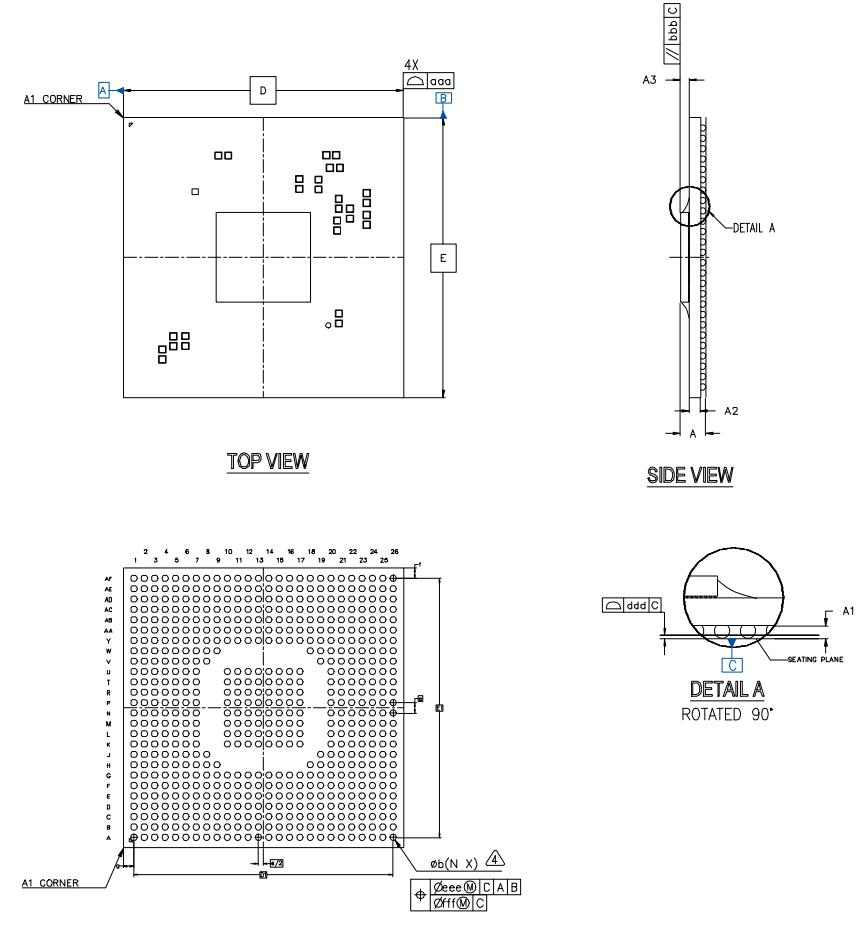

|       |       |       | 单位为毫米 |
|-------|-------|-------|-------|
| 尺寸符号  | 最小    | 公称    | 最大    |
| A     | 2.221 | -     | 2.621 |
| A1    | 0.40  | -     | 0.60  |
| A2    | 0.959 | -     | 1.173 |
| A3    | 0.805 | -     | 0.905 |
| b     | 0.50  | -     | 0.70  |
| D/E   | -     | 27.00 | -     |
| D1/E1 | -     | 25.00 | -     |
| e     | -     | 1.00  | -     |
| g/f   | -     | 1.00  | -     |
| aaa   | -     | -     | 0.20  |
| bbb   | -     | -     | 0.25  |
| ddd   | -     | -     | 0.20  |
| eee   | -     | -     | 0.25  |
| fff   | -     | -     | 0.10  |
| N     | -     | 608   | -     |

#### 下图为 DIE 位置信息

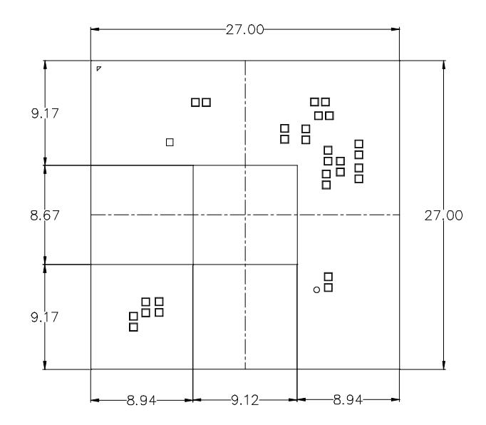

扣合力:最大承压 15kg。

88

### **9** 订货信息

### **9.1** 通用命名标识

龙芯 2K1000LA命名规则如下:

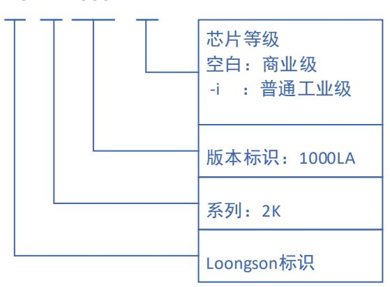

芯片表面标识:

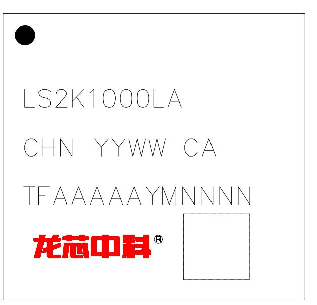

89

- a) ●:定位点;
- b) LS2K1000LA:器件识别号;
- c) CHN YYWW XX:设计厂,日期代码和版本号;
- d) TF AAAAA YMNNNN :芯片序列号;
- e) 龙芯中科®:注册商标;
- f) □:芯片序列号二维码。

