# 龙芯 2K1000LA 处理器

用户手册

V1.0

*2022* 年 *5* 月

龙芯中科技术股份有限公司


#### 版权声明

本文档版权归龙芯中科技术股份有限公司所有,并保留一切权利。未经书面许可,任何 公司和个人不得将此文档中的任何部分公开、转载或以其他方式散发给第三方。否则, 必将追究其法律责任。

#### 免责声明

本文档仅提供阶段性信息,所含内容可根据产品的实际情况随时更新,恕不另行通知。 如因文档使用不当造成的直接或间接损失,本公司不承担任何责任。

#### 龙芯中科技术股份有限公司

Loongson Technology Corporation Limited

地址:北京市海淀区中关村环保科技示范园龙芯产业园 2 号楼

Building No.2, Loongson Industrial Park, Zhongguancun Environmental Protection Park

电话(Tel):010-62546668 传真(Fax):010-62600826


### 阅读指南

《龙芯 2K1000LA 处理器用户手册》主要介绍龙芯 2K1000LA 架构与寄存器描述,对芯 片系统架构、主要模块的功能与配置、寄存器列表及位域进行详细说明。


## 版本信息

|      | 文档名 | 龙芯<br>处理器用户手册<br>2K1000LA |
|------|-----|---------------------------|
| 版本信息 | 版本号 | V1.0                      |
|      | 创建人 | 芯片研发部                     |

#### 更新历史

| 序号. | 版本号  | 更新内容 |
|-----|------|------|
| 1   | V1.0 | 第一版  |

手册信息反馈: [service@loongson.cn](mailto:service@loongson.cn)

。


## 目录

<span id="page-4-0"></span>

| 目录                              | 1  |
|---------------------------------|----|
| 图目录                             | IX |
| 表目录                             | X  |
| 1 概述                            |    |
| 1.1 体系结构框图                      |    |
| 1.2 芯片主要功能                      |    |
| 1.2.1 处理器核                      |    |
| 1.2.2 内存接口                      |    |
| 1.2.3 PCIE 接口                   | 3  |
| 1.2.4 GPU                       | 3  |
| 1.2.5 显示控制器                     | 3  |
| 1.2.6 SATA 控制器                  | 3  |
| 1.2.7 USB2.0 控制器                | 3  |
| 1.2.8 GMAC 控制器                  | 3  |
| 1.2.9 VPU 解码器                   | 4  |
| 1.2.10 CAMERA 控制器               | 4  |
| 1.2.11 HDA 控制器                  | 4  |
| 1.2.12 I2S 控制器                  | 4  |
| 1.2.13 NAND 控制器                 | 5  |
| 1.2.14 SPI 控制器                  | 5  |
| 1.2.15 UART                     | 5  |
| 1.2.16 I2C 总线                   |    |
| 1.2.17 PWM                      |    |
| 1.2.18 HPET                     |    |
| 1.2.19 RTC                      |    |
| 1.2.20 Watchdog<br>1.2.21 中断控制器 |    |
| 1.2.22 CAN                      |    |
| 1.2.23 ACPI 功耗管理                |    |
| 1.2.24 GPIO                     |    |
| 1.2.25 加解密模块                    |    |
| 1.2.26 SDIO 控制器                 |    |
| 2 引脚定义                          |    |
| 2.1 约定                          | 8  |
| 2.2 DDR3 接口                     | 8  |
| 2.3 PCIE 接口                     |    |
| 2.4 DVO 显示接口                    | 9  |
| 2.5 GMAC 接口                     | 11 |
| 2.6 SATA 接口                     | 12 |
| 2.7 USB 接口                      | 12 |
| 2.8 CAMERA 接口                   | 12 |
| 2.9 HDA 接口                      | 13 |
| 2.10 SPI 接口                     | 14 |
| 2.11 I2C 接口                     | 14 |
| 2.12 UART 接口                    | 14 |
| 2.13 CAN 接口                     | 15 |
| 2.14 NAND 接口                    | 16 |
| 2.15 SDIO 接口                    |    |
| 2.16 GPIO                       |    |
| 2.17 PWM                        | 17 |


|   | 2.18 PLL 电源接口               |      |
|---|-----------------------------|------|
|   | 2.19 电源管理接口                 | .17  |
|   | 2.20 测试接口                   | .18  |
|   | 2.21 JTAG 接口                | .18  |
|   | 2.22 时钟信号                   | . 18 |
|   | 2.23 RTC 相关信号               |      |
|   | 2.24 系统相关信号                 |      |
|   | 2.25 外设功能复用表                |      |
| 3 | 时钟结构                        |      |
| _ | 3.1 NODE PLL                |      |
|   | 3.2 PIX PLL                 |      |
|   | 3.3 DDR PLL                 | . 22 |
|   | 3.4 DC PLL                  |      |
|   | 3.5 内部 PLL 配置方法             | . 23 |
|   | 3.5.1 硬件配置                  | . 23 |
|   | 3.5.2 软件配置                  | . 23 |
|   | 3.6 BOOT 时钟                 | . 24 |
|   | 3.7 USB 参考时钟                | . 24 |
|   | 3.8 PCIE 参考时钟               | . 24 |
|   | 3.9 SATA 参考时钟输入             | . 24 |
| 4 | 电源管理                        |      |
|   | 4.1 电源管理模块介绍                |      |
|   | 4.2 电源级别                    |      |
|   | 4.3 控制引脚说明                  |      |
| 5 | 芯片配置寄存器                     |      |
| _ | 5.1 通用配置寄存器 0               |      |
|   | 5.2 通用配置寄存器 1               |      |
|   | 5.3 通用配置寄存器 2               |      |
|   | 5.4 APBDMA 配置寄存器            |      |
|   | 5.5 USB PHY0/1 配置寄存器        |      |
|   | 5.6 USB PHY2/3 配置寄存器        |      |
|   | 5.7 SATA 配置寄存器              |      |
|   | 5.8 NODE PLL 低 64 位配置寄存器    |      |
|   | 5.9 NODE PLL 高 64 位配置寄存器    |      |
|   |                             |      |
|   | 5.10 DDR PLL 低 64 位配置寄存器    |      |
|   | 5.11 DDR PLL 高 64 位配置寄存器    |      |
|   | 5.12 DC PLL 低 64 位配置寄存器     |      |
|   | 5.13 DC PLL 高 64 位配置寄存器     |      |
|   | 5.14 PIX0 PLL 低 64 位配置寄存器   |      |
|   | 5.15 PIX0 PLL 高 64 位配置寄存器   |      |
|   | 5.16 PIX1 PLL 低 64 位配置寄存器   |      |
|   | 5.17 PIX1 PLL 高 64 位配置寄存器   |      |
|   | 5.18 FREQSCALE 配置寄存器        |      |
|   | 5.19 PCIE0 配置寄存器 0          |      |
|   | 5.20 PCIE0 配置寄存器 1          |      |
|   | 5.21 PCIE0 PHY 配置控制寄存器      |      |
|   | 5.22 PCIE1 配置寄存器 0          |      |
|   | 5.23 PCIE1 配置寄存器 1          |      |
|   | 5.24 PCIE1 PHY 配置控制寄存器      |      |
|   | 5.25 DMA 命令控制寄存器(DMA_ORDER) |      |
|   | 5.26 PCICFG2 RECFG 寄存器      | .57  |


|     | 5.27 PCICFG30_RECFG 寄存器               | 57   |
|-----|---------------------------------------|------|
|     | 5.28 PCICFG31_RECFG 寄存器               | 58   |
|     | 5.29 PCICFG40_RECFG 寄存器               |      |
|     | 5.30 PCICFG41_RECFG 寄存器               |      |
|     | 5.31 PCICFG42 RECFG 寄存器               |      |
|     | 5.32 PCICFG5 RECFG 寄存器                |      |
|     | 5.33 PCICFG6_RECFG 寄存器                |      |
|     | 5.34 PCICFG7 RECFG 寄存器                |      |
|     | 5.35 PCICFG8_RECFG 寄存器                |      |
|     | 5.36 PCICFGF_RECFG 寄存器                |      |
|     | 5.37 PCICFG10_RECFG 寄存器               |      |
|     | 5.38 PCICFG11_RECFG 寄存器               |      |
| 6   | 地址空间分配                                |      |
| U   | 6.1 一级交叉开关                            |      |
|     | 6.2 二级交叉开关                            |      |
|     |                                       |      |
|     | 6.3 IO 互连网络                           |      |
|     | · · · · · · · · · · · · · · · · · · · |      |
|     | 6.3.2 APB 配置头                         |      |
|     | 6.3.3 GMAC0/1 配置头                     |      |
|     | 6.3.4 USB OTG 配置头                     |      |
|     | 6.3.5 USBEHCI 配置头                     |      |
|     | 6.3.6 USB OHCI 配置头                    |      |
|     | 6.3.7 GPU 配置头                         |      |
|     | 6.3.8 DC 配置头                          |      |
|     | 6.3.9 HDA 配置头                         |      |
|     | 6.3.10 SATA 配置头                       |      |
|     | 6.3.11 PCIE 配置头                       |      |
|     | 6.3.12 DMA 配置头                        |      |
|     | 6.3.13 VPU 配置头                        |      |
|     | 6.3.14 CAMERA 配置头                     |      |
|     | 6.3.15 N/A 处理                         |      |
|     | 6.4 IODMA 请求                          | 83   |
|     | 6.5 APB 设备路由                          |      |
| 7   | 处理器核间中断与通信                            | . 88 |
| 8   | 温度传感器                                 | . 90 |
|     | 8.1 实时温度采样                            | 90   |
|     | 8.2 高低温中断触发                           | 90   |
|     | 8.3 高温自动降频设置                          | 91   |
| 9   | I/O 中断                                |      |
|     | 9.1 中断触发类型                            | 94   |
|     | 9.2 中断分发模式                            | 94   |
|     | 9.3 中断相关寄存器描述                         |      |
|     | 9.4 GPIO 中断                           |      |
|     | 9.5 MSI 中断                            | 99   |
|     | 9.6 硬件中断负载均衡功能举例                      |      |
| 10  | ) SPI 控制器                             |      |
| - ( | 10.1 访问地址                             |      |
|     | 10.2 SPI 控制器结构                        |      |
|     | 10.3 配置寄存器                            |      |
|     | 10.3.1 控制寄存器(SPCR)                    |      |
|     |                                       | 103  |
|     |                                       |      |


| 10.3.3 数据寄存器(TxFIFO/RxFIFO)      | 104   |
|----------------------------------|-------|
| 10.3.4 外部寄存器(SPER)               | 104   |
| 10.3.5 参数控制寄存器(SFC_PARAM)        | 105   |
| 10.3.6 片选控制寄存器(SFC_SOFTCS)       | 105   |
| 10.3.7 时序控制寄存器(SFC_TIMING)       | 105   |
| 10.4 接口时序                        | . 106 |
| 10.4.1 SPI 主控制器接口时序              | 106   |
| 10.4.2 SPI Flash 访问时序            | 106   |
| 10.5 软件编程指南                      | . 107 |
| 10.5.1 SPI 主控制器的读写操作             |       |
| 10.5.2 硬件 SPI Flash 读            |       |
| 10.5.3 混合访问 SPI Flash 和 SPI 主控制器 |       |
| 11 LocalIO 控制器                   |       |
| 11.1 访问地址及引脚复用                   |       |
| 11.2 LocalIO 控制器功能概述             |       |
| 12 DDR3 控制器                      |       |
| 12.1 访问地址                        |       |
| 12.2 DDR3 SDRAM 控制器功能概述          |       |
| 12.3 DDR3 SDRAM 读操作协议            |       |
| 12.4 DDR3 SDRAM 写操作协议            |       |
| 12.5 DDR3 控制器寄存器                 |       |
| 13 GPIO                          |       |
| 13.1 GPIO 方向控制                   |       |
| 13.2 GPIO 输出设置                   |       |
| 13.3 GPIO 输入采样                   |       |
| 13.4 GPIO 中断使能                   |       |
| 13.5 GPIO 复用关系                   |       |
| 14 APB 设备(Dev 2)                 |       |
| 14.1 内部设备地址路由                    |       |
| 15 UART 控制器                      |       |
| 15.1 概述                          |       |
| 15.2 访问地址及引脚复用                   |       |
| 15.3 控制器结构                       |       |
| 15.4 寄存器描述                       |       |
| 15.4.1 数据寄存器(DAT)                |       |
| 15.4.2 中断使能寄存器(IER)              |       |
| 15.4.3 中断标识寄存器(IIR)              |       |
| 15.4.4 FIFO 控制寄存器(FCR)           |       |
| 15.4.5 线路控制寄存器(LCR)              |       |
| 15.4.6 MODEM 控制寄存器(MCR)          |       |
| 15.4.7 线路状态寄存器(LSR)              |       |
| 15.4.8 MODEM 状态寄存器(MSR)          |       |
| 15.4.9 分频锁存器                     |       |
| 16 CAN                           |       |
| 16.1 访问地址及引脚复用                   | .127  |
| 16.2 标准模式                        | . 127 |
| 16.2.1 控制寄存器(CR)                 | 128   |
| 16.2.2 命令寄存器(CMR)                | 129   |
| 16.2.3 状态寄存器(SR)                 | 129   |
| 16.2.4 中断寄存器(IR)                 | 130   |
| 16.2.5 验收代码寄存器(ACR)              | 130   |


| 16.2.6 验收屏蔽寄存器(AMR)                  | 130 |
|--------------------------------------|-----|
| 16.2.7 发送缓冲区列表                       | 131 |
| 16.2.8 接收缓冲区列表                       |     |
| 16.3 扩展模式                            |     |
| 16.3.1 模式寄存器(MOD)                    |     |
| 16.3.2 命令寄存器(CMR)                    |     |
| 16.3.3 状态寄存器(SR)                     |     |
| 16.3.4 中断寄存器(IR)                     |     |
| 16.3.5 中断使能寄存器(IER)                  |     |
| 16.3.6 仲裁丢失捕捉寄存器                     |     |
| 16.3.7 错误警报限制寄存器(EMLR)               |     |
| 16.3.8 RX 错误计数寄存器(RXERR)             |     |
| 16.3.9 TX 错误计数寄存器(TXERR)             |     |
|                                      |     |
| 16.3.10 验收滤波器                        |     |
| 16.3.11 RX 信息计数寄存器(RMCR)             |     |
| 16.4 公共寄存器                           |     |
| 16.4.1 总线定时寄存器 0 (BTR0)              |     |
| 16.4.2 总线定时寄存器 1 (BTR1)              |     |
| 16.4.3 输出控制寄存器(OCR)                  |     |
| 17 I2C 控制器                           |     |
| 17.1 概述                              |     |
| 17.2 访问地址及引脚复用                       |     |
| 17.3 I2C 控制器结构                       |     |
| 17.4 I2C 控制器寄存器说明                    |     |
| 17.4.1 分频锁存器低字节寄存器(PRERIo)           |     |
| 17.4.2 分频锁存器高字节寄存器(PRERhi)           |     |
| 17.4.3 控制寄存器(CTR)                    |     |
| 17.4.4 发送数据寄存器(TXR)                  |     |
| 17.4.5 接受数据寄存器(RXR)                  |     |
| 17.4.6 命令控制寄存器 (CR)                  |     |
| 17.4.7 状态寄存器(SR)                     |     |
| 18 PWM 控制器                           |     |
| 18.1 概述                              |     |
| 18.2 访问地址及引脚复用                       |     |
| 18.3 寄存器描述                           |     |
| 18.4 功能说明                            |     |
| 18.4.1 脉宽调制功能                        |     |
| 18.4.2 脉冲测量功能                        |     |
| 18.4.3 防死区功能                         |     |
| 19 HPET 控制器                          |     |
| 19.1 概述                              |     |
| 19.2 访问地址                            |     |
| 19.3 寄存器描述                           |     |
| 20 NAND 控制器                          |     |
| 20.1 NAND 控制器结构描述                    | 151 |
| 20.2 访问地址及引脚复用                       | 151 |
| 20.3 NAND 寄存器配置描述                    | 151 |
| 20.3.1 命令寄存器 NAND_CMD (偏移地址 0x00)    | 151 |
| 20.3.2 页内偏移地址寄存器 ADDR_C (偏移地址 0x04)  | 152 |
| 20.3.3 页地址寄存器 ADDR_R (偏移地址 0x08)     | 152 |
| 20.3.4 时序寄存器 NAND_TIMING (偏移地址 0x0C) | 152 |
|                                      |     |


| 20.3.5 ID 寄存器 ID_L (偏移地址 0x10)              | . 153 |
|---------------------------------------------|-------|
| 20.3.6 ID 和状态寄存器 STATUS & ID_H (偏移地址 0x14)  | . 153 |
| 20.3.7 参数配置寄存器 NAND_PARAMETER (偏移地址 0x18)   | .153  |
| 20.3.8 操作数量寄存器 NAND_OP_NUM (偏移地址 0x1C)      | .153  |
| 20.3.9 映射寄存器 CS_RDY_MAP (偏移地址 0x20)         |       |
| 20.3.10 DMA 读写数据寄存器 DMA_ADDRESS (偏移地址 0x40) |       |
| 20.4 NAND ADDR 说明                           |       |
| 20.5 NAND-FLASH 读写操作举例                      |       |
| 20.6 NAND ECC 说明                            |       |
| 20.7 支持 NAND 型号                             |       |
| 21 电源管理模块                                   |       |
| 21.1 概述                                     |       |
| 21.2 访问地址                                   |       |
| 21.3 寄存器描述                                  |       |
| 21.3 可任备抽处                                  |       |
| 22.1 概述                                     |       |
| 22.2 访问地址                                   |       |
| 22.3 寄存器描述                                  |       |
|                                             |       |
| 22.3.1 寄存器地址列表                              |       |
| 22.3.2 SYS_TOYWRITE0                        |       |
| 22.3.4 SYS TOYREAD0                         |       |
| 22.3.5 SYS_TOYREAD1                         |       |
| 22.3.6 SYS_TOYMATCH0/1/2                    |       |
| 22.3.7 SYS_RTCCTRL                          |       |
| 22.3.8 SYS_RTCWRITE                         |       |
| 22.3.9 SYS_RTCREAD                          |       |
| 22.3.10 SYS_RTCMATCH0/1/2                   |       |
| 23 加解密                                      |       |
| 23.1 DES                                    |       |
| 23.1.1 DES 功能概述                             |       |
| 23.1.2 <b>DES</b> 访问地址:                     |       |
| 23.1.3 DES 寄存器描述                            |       |
| 23.2 AES                                    |       |
| 23.2.1 AES 功能概述                             |       |
| 23.2.2 AES 访问地址:                            |       |
| 23.2.3 AES 寄存器描述                            |       |
| 23.3 RSA                                    |       |
| 23.3.1 RSA 访问地址:                            |       |
| 23.4 RNG                                    |       |
| 23.4.1 RNG 访问地址:                            |       |
| 24 SDIO 控制器                                 |       |
| 24.1 功能概述                                   |       |
| 24.2 访问地址及引脚复用                              |       |
| 24.3 SDIO 协议概述                              |       |
| 24.4 寄存器描述                                  |       |
| 24.5 软件编程指南                                 |       |
| 24.5.1 SD Memory 卡软件编程说明                    |       |
| 24.5.2 SDIO 卡软件编程说明                         |       |
| 24.6 支持 SDIO 型号                             |       |
| 25 I2S 控制器                                  | .190  |
| 25.1 概述                                     | 190   |


| 25.2 访问地址及引脚复用                                | 190 |
|-----------------------------------------------|-----|
| 25.3 接口协议                                     | 190 |
| 25.4 专用寄存器                                    | 191 |
| 25.5 配置操作                                     |     |
| 26 GMAC 控制器(Dev 3)                            |     |
| 26.1 访问地址及引脚复用                                |     |
| 27 OTG 控制器(Dev 4, Fun 0)                      |     |
| 27.1 概述                                       |     |
| 27.2 访问地址                                     |     |
| 28 USB 控制器(Dev 4, Fun 1/2)                    |     |
|                                               |     |
| 28.1总体概述                                      |     |
| 28.2 访问地址                                     |     |
| 29 图形处理器 (Dev 5)                              |     |
| 29.1 访问地址                                     |     |
| 30 显示控制器(Dev 6)                               | 199 |
| 30.1 概述                                       |     |
| 30.2 访问地址及引脚复用                                | 199 |
| 31 HDA 控制器(Dev 7)                             | 200 |
| 31.1 功能概述                                     | 200 |
| 31.2 访问地址                                     | 200 |
| 32 SATA 控制器(Dev 8)                            | 201 |
| 32.1 SATA 总体描述                                | 201 |
| 32.2 访问地址                                     | 201 |
| 32.3 SATA 控制器内部寄存器描述                          | 201 |
| 33 PCIE 控制器(Dev 9/A/B/C/D/E)                  |     |
| 33.1 总体结构                                     |     |
| 33.2 访问地址                                     |     |
| 33.3 地址空间划分                                   |     |
| 33.4 软件编程指南                                   |     |
| 33.4.1 PCIE 控制器使能                             |     |
| 33.4.2 PCIE 配置头访问                             |     |
| 33.4.3 PCIE 链路建立(Linkup)                      |     |
| 33.4.4 TYPE1 类型配置访问                           |     |
| 33.4.5 PCIE PHY 配置方法                          |     |
| 33.5 常用例程                                     |     |
| 34 DMA 控制器(Dev F)                             |     |
| 34.1 DMA 控制器结构描述                              |     |
| 34.2 访问地址                                     |     |
| 34.3 DMA 控制器与 APB 设备的交互                       |     |
|                                               |     |
| 34.4 DMA 描述符                                  |     |
| 34.4.1 DMA_ORDER_ADDR_LOW<br>34.4.2 DMA_SADDR |     |
| 34.4.2 DMA_SADDR                              |     |
| 34.4.4 DMA_LENGTH                             |     |
| 34.4.5 DMA_STEP_LENGTH                        |     |
| 34.4.6 DMA_STEP_TIMES                         |     |
| 34.4.7 DMA_CMD                                |     |
| 34.4.8 DMA_ORDER_ADDR_HIGH                    | 213 |
| 34.4.9 DMA_SADDR_HIGH                         |     |
| 35 VPU 控制器(Dev 16)                            | 214 |
| 35.1 访问地址                                     | 214 |


| 36 CAMERA 接口控制器(Dev 17) | 215 |
|-------------------------|-----|
| 36.1 功能概述               | 215 |
| 36.2 访问地址               | 215 |


## 图目录

<span id="page-12-0"></span>

| 图 1-1 龙芯 2K1000 结构图         | 2   |
|-----------------------------|-----|
| 图 3-1 NODE PLL 结构图          | 21  |
| 图 3-2 PIX PLL 结构图           | 22  |
| 图 3-3 DDR PLL 结构图           | 22  |
| 图 3-4 DC PLL 结构图            | 23  |
| 图 3-5 BOOT 时钟结构图            | 24  |
| 图 6-1 二级交叉开关地址路由示意图         | 66  |
| 图 6-2 IO 互连结构图              | 70  |
| 图 6-3 64 位配置访问地址格式          | 70  |
| 图 6-4 32 位配置访问地址格式          | 71  |
| 图 9-1 龙芯 2K1000 处理器中断路由示意图  | 93  |
| 图 10-1 SPI 主控制器接口时序         | 106 |
| 图 10-2 SPI Flash 标准读时序      | 106 |
| 图 10-3 SPI Flash 快速读时序      | 106 |
| 图 10-4 SPI Flash 双向 I/O 读时序 | 107 |
| 图 11-1 LocalIO 读时序          | 109 |
| 图 11-2 LocalIO 写时序          | 110 |
| 图 12-1 DDR3 SDRAM 读操作协议     | 112 |
| 图 12-2 DDR3 SDRAM 写操作协议     | 112 |
| 图 15-1 UART 控制器结构           | 122 |
| 图 17-1 I2C 主控制器结构           | 141 |
| 图 18-1 防死区功能                | 146 |
| 图 24-1 SD 卡多块写操作示意图         | 180 |
| 图 24-2 SD 卡多块读操作示意图         | 180 |
| 图 24-3 SD Memory 卡初始化流程示意图  | 187 |
| 图 25-1 I2S 传输协议             | 191 |
| 图 28-1 USB 主机控制器模块图         |     |
| 图 33-1 PCIE 控制器结构           | 203 |


## 表目录

<span id="page-13-0"></span>

| 表 2-1           | 信号类型代码               | 8  |
|-----------------|----------------------|----|
| 表 2- <b>2</b> I | DDR3SDRAM 控制器接口信号    | 8  |
| 表 2-3 I         | PCIE 总线信号            | 9  |
| 表 2-4 1         | DVO 接口信号             | 9  |
| 表 2-5           | DVO 接口 RGB 对应关系      | 10 |
| 表 2-6 I         | DVO0 与 LIO 复用关系      | 10 |
| 表 2-7           | DVO0 与 UART 复用关系     | 10 |
| 表 2-8 (         | GMAC 接口信号            | 11 |
| 表 2-9           | GMAC1 与 GPIO 复用关系    | 11 |
| 表 2-10          | SATA 接口信号            | 12 |
| 表 2-11          | SATA 与 GPIO 复用关系     | 12 |
| 表 2-12          | USB 接口信号             | 12 |
| 表 2-13          | CAMERA 接口信号          | 12 |
|                 | · CAMERA 与 DVO1 复用关系 |    |
| 表 2-15          | HDA 接口信号             | 13 |
| 表 2-16          | HDA 与 I2S 复用关系       | 13 |
| 表 2-17          | HDA 与 GPIO 复用关系      |    |
| 表 2-18          |                      |    |
| 表 2-19          | I2C 接口信号             | 14 |
| 表 2-20          | I2C 与 GPIO 复用关系      | 14 |
|                 | UART 接口信号            |    |
| 表 2-22          | UART 接口复用关系          | 15 |
| 表 2-23          | CAN 接口信号             | 15 |
|                 | CAN 与 GPIO 复用关系      |    |
|                 | NAND 接口信号            |    |
| 表 2-26          | NAND 与 GPIO 复用关系     | 16 |
|                 | SDIO 接口信号            |    |
|                 | SDIO 与 GPIO 复用关系     |    |
| 表 2-29          | GPIO 信号              | 17 |
|                 | PWM 信号               |    |
|                 | PWM 与 GPIO 复用关系      |    |
| 表 2-32          | PLL 电源接口             | 17 |
| 表 2-33          | 电源管理接口               | 17 |


| 表 2-34 测试接口                 | 18 |
|-----------------------------|----|
| 表 2-35 JTAG 接口              | 18 |
| 表 2-36 时钟信号                 | 18 |
| 表 2-37 时钟信号                 | 18 |
| 表 2-38 系统相关信号               | 19 |
| 表 2-39 外设功能复用表              | 20 |
| 表 3-1 PLL 硬件配置              | 23 |
| 表 4-1 ACPI 状态说明             | 25 |
| 表 4-2 控制引脚说明                | 25 |
| 表 5-1 芯片配置寄存器列表             | 27 |
| 表 5-2 通用配置寄存器 0             | 34 |
| 表 5-3 通用配置寄存器 1             | 36 |
| 表 5-4 通用配置寄存器 2             | 37 |
| 表 5-5 APBDMA 配置寄存器          | 39 |
| 表 5-6 USB 0/1 PHY 配置寄存器     | 40 |
| 表 5-7 USB 2/3 PHY 配置寄存器     | 44 |
| 表 5-8 SATA 配置寄存器            | 45 |
| 表 5-9 NODE PLL 低 64 位配置寄存器  | 46 |
| 表 5-10 NODE PLL 高 64 位配置寄存器 | 47 |
| 表 5-11 DDR PLL 低 64 位配置寄存器  | 47 |
| 表 5-12 DDR PLL 高 64 位配置寄存器  | 48 |
| 表 5-13 DC PLL 低 64 位配置寄存器   | 48 |
| 表 5-14 DC PLL 高 64 位配置寄存器   | 49 |
| 表 5-15 PIX0 PLL 低 64 位配置寄存器 | 49 |
| 表 5-16 PIX0 PLL 高 64 位配置寄存器 | 50 |
| 表 5-17 PIX1 PLL 低 64 位配置寄存器 | 51 |
| 表 5-18 PIX1 PLL 高 64 位配置寄存器 | 51 |
| 表 5-19 FRESCALE 配置寄存器       | 52 |
| 表 5-20 PCIE0 配置寄存器 0        | 52 |
| 表 5-21 PCIE0 配置寄存器 1        | 53 |
| 表 5-22 PCIE0 PHY 配置寄存器      | 54 |
| 表 5-23 PCIE1 配置寄存器 0        |    |
| 表 5-24 PCIE1 配置寄存器 1        | 55 |
| 表 5-25 PCIE1 PHY 配置寄存器      | 56 |


| 表 5-26 DMA 命令控制寄存器          | 56 |
|-----------------------------|----|
| 表 5-27 PCICFG2_RECFG 配置寄存器  | 57 |
| 表 5-28 PCICFG30_RECFG 配置寄存器 | 57 |
| 表 5-29 PCICFG31_RECFG 配置寄存器 | 58 |
| 表 5-30 PCICFG40_RECFG 配置寄存器 | 59 |
| 表 5-31 PCICFG41_RECFG 配置寄存器 | 59 |
| 表 5-32 PCICFG42_RECFG 配置寄存器 | 60 |
| 表 5-33 PCICFG5_RECFG 配置寄存器  | 60 |
| 表 5-34 PCICFG6_RECFG 配置寄存器  | 61 |
| 表 5-35 PCICFG7_RECFG 配置寄存器  | 61 |
| 表 5-36 PCICFG8_RECFG 配置寄存器  | 62 |
| 表 5-37 PCICFGf_RECFG 配置寄存器  | 63 |
| 表 5-38 PCICFG10_RECFG 配置寄存器 | 63 |
| 表 5-39 PCICFG11_RECFG 配置寄存器 | 64 |
| 表 6-1 芯片地址空间划分              | 65 |
| 表 6-2 一级交叉开关路由规则            | 66 |
| 表 6-3 二级交叉开关处标号与所述模块的对应关系   | 67 |
| 表 6-4 MMAP 字段对应的该空间访问属性     | 67 |
| 表 6-5 二级交叉开关地址窗口转换寄存器表      | 67 |
| 表 6-6 各个设备的配置头访问对应关系        | 71 |
| 表 6-7 Type0 类型配置头           | 72 |
| 表 6-8 Type0 的配置头寄存器         | 72 |
| 表 6-9 Type1 类型配置头           | 74 |
| 表 6-10 Type1 的配置头寄存器        | 75 |
| 表 6-11 APB 总线控制器的配置头缺省值     | 77 |
| 表 6-12 GMAC0 控制器的配置头缺省值     | 78 |
| 表 6-13 USB-OTG 控制器的配置头缺省值   | 78 |
| 表 6-14 USB-EHCI 控制器的配置头缺省值  | 79 |
| 表 6-15 USB-OHCI 控制器的配置头缺省值  | 79 |
| 表 6-16 GPU 控制器的配置头缺省值       | 80 |
| 表 6-17 DC 控制器的配置头缺省值        | 80 |
| 表 6-18 HDA 控制器的配置头缺省值       | 80 |
| 表 6-19 SATA 控制器的配置头缺省值      | 81 |
| 表 6-20 PCIF0 Port() 的配置斗缺省值 | 81 |


| 表 6-21 DMA 控制器的配置头缺省值           | 82  |
|---------------------------------|-----|
| 表 6-22 VPU 解码器的配置头缺省值           | 82  |
| 表 6-23 CAMERA 控制器的配置头缺省值        | 83  |
| 表 6-24 MMAP 字段对应的该空间访问属性        | 84  |
| 表 6-25 IO 设备 DMA 访存地址转换寄存器表     | 84  |
| 表 6-26 APB 设备地址译码               | 86  |
| 表 7-1 处理器核间中断相关的寄存器及其功能描述       | 88  |
| 表 7-2 0 号处理器核核间中断与通信寄存器列表       | 88  |
| 表 7-3 1号处理器核的核间中断与通信寄存器列表       |     |
| 表 8-1 温度采样寄存器说明                 | 90  |
| 表 8-2 高低温中断寄存器说明                | 91  |
| 表 8-3 高温降频控制寄存器说明               |     |
| 表 9-1 中断控制寄存器属性                 | 94  |
| 表 9-2 中断控制寄存器地址                 | 96  |
| 表 9-3 中断路由寄存器的说明                |     |
| 表 9-4 中断路由寄存器地址                 | 97  |
| 表 9-5 GPIO 中断                   | 99  |
| 表 9-6 MSI 中断相关寄存器               |     |
| 表 10-1 SPI 控制器地址空间分配            | 103 |
| 表 10-2 SPI 配置寄存器列表              | 103 |
| 表 10-3 SPI 控制寄存器(SPCR)          |     |
| 表 10-4 SPI 状态寄存器(SPSR)          | 104 |
| 表 10-5 SPI 数据寄存器(TxFIFO/RXFIFO) |     |
| 表 10-6 SPI 外部寄存器(SPER)          |     |
| 表 10-7 SPI 分频系数                 | 104 |
| 表 10-8 SPI 参数控制寄存器(SFC_PARAM)   | 105 |
| 表 10-9 SPI 片选控制寄存器(SFC_SOFTCS)  | 105 |
| 表 10-10 SPI 时序控制寄存器(SFC_TIMING) | 105 |
| 表 11-1 LocalIO 地址空间分配           |     |
| 表 12-1 内存控制器地址空间分配              |     |
| 表 12-2 DDR3 控制器配置寄存器            | 112 |
| 表 13-1 GPIO 配置寄存器               |     |
| 表 13-2 GPIO 方向控制                | 116 |
| 表 13-3 GPIO 输出设置                | 116 |


#### 龙芯 2K1000LA 处理器用户手册表目录

| 表 | 13-4  | GPIO 输入采样            | 116 |
|---|-------|----------------------|-----|
| 表 | 13-5  | 5 GPIO 中断使能          | 116 |
| 表 | 13-6  | 6 GPIO 复用关系          | 117 |
| 表 | 14-1  | APB 配置访问信息           | 119 |
| 表 | 14-2  | 2 APB 设备地址译码         | 119 |
| 表 | 15-1  | UART 控制器物理地址构成       | 121 |
| 表 | 15-2  | 2 UART 数据寄存器         | 122 |
| 表 | 15-3  | 3 UART 中断使能寄存器       | 123 |
| 表 | 15-4  | UART 中断标识寄存器         | 123 |
| 表 | 15-5  | 5 UART 中断控制功能表       | 123 |
| 表 | 15-6  | UART 的 FIFO 控制寄存器    | 124 |
| 表 | 15-7  | UART 线路控制寄存器         | 124 |
| 表 | 15-8  | UART 的 MODEM 控制寄存器   | 125 |
| 表 | 15-9  | UART 线路状态寄存器         | 125 |
| 表 | 15-10 | 0 UART 的 MODEM 状态寄存器 | 126 |
| 表 | 15-1  | 1 UART 分频锁存器 1       | 126 |
| 表 | 15-12 | 2 UART 分频锁存器 2       | 126 |
| 表 | 16-1  | CAN 内部寄存器物理地址构成      | 127 |
| 表 | 18-1  | PWM 寄存器列表            | 144 |
| 表 | 18-2  | PWM 控制寄存器设置          | 144 |
| 表 | 25-1  | 寄存器定义                | 191 |
| 表 | 25-2  | 2 标识寄存器              | 191 |
| 表 | 25-3  | 3 配置寄存器              | 191 |
| 表 | 25-4  | - 控制寄存器              | 192 |
| 表 | 34-1  | DMA ORDER 寄存器        | 209 |


## <span id="page-18-0"></span>**1** 概述

龙芯 2K1000LA 处理器(简称龙芯 2K1000)主要面向于网络应用,兼顾平板应用及工 控领域应用。片内集成 2 个 LA264 处理器核,采用 LoongArch 指令系统(龙架构),主频 1GHz,64 位 DDR3 控制器,并集成各种系统 IO 接口。

龙芯 2K1000 的主要特征如下:

- ⚫ 片内集成两个 64 位的双发射超标量 LA264 处理器核,主频 1GHz
- ⚫ 片内集成共享的 1MB 二级 Cache
- ⚫ 片内集成 GPU
- ⚫ 片内集成显示控制器,支持双路 DVO 显示
- ⚫ 片内集成 64 位 533MHz 的 DDR3 控制器
- ⚫ 片内集成 2 个 x4 PCIE2.0 接口;可以拆分为 6 个独立 x1 接口
- ⚫ 片内集成 1 个 SATA2.0 接口
- ⚫ 片内集成 4 个 USB2.0 接口
- ⚫ 片内集成 2 个 RGMII 千兆网接口
- ⚫ 片内集成 HDA/I2S 接口
- ⚫ 片内集成 RTC/HPET 模块
- ⚫ 片内集成 12 个 UART 控制器
- ⚫ 片内集成 1 个 NAND 控制器
- ⚫ 片内集成 2 个 CAN 控制器
- ⚫ 片内集成 1 个 SDIO 控制器
- ⚫ 片内集成 2 个 I2C 控制器
- ⚫ 片内集成 1 个 LIO 控制器
- ⚫ 片内集成 1 个 VPU 解码器
- ⚫ 片内集成 1 个 CAMERA 接口控制器
- ⚫ 片内集成 1 个温度传感器
- ⚫ 集成动态功耗控制模块
- ⚫ 采用 FC-BGA 封装

## <span id="page-18-1"></span>**1.1** 体系结构框图

龙芯 2K1000 的结构如图 [1-1](#page-19-4) 所示。一级交叉开关连接两个处理器核、两个二级 Cache 以及 IO 子网络(Cache 访问路径)。二级交叉开关连接两个二级 Cache、内存控制器、启动 模块(SPI 或者 LIO)以及 IO 子网络(Uncache 访问路径)。IO 子网络连接一级交叉开关,


以减少处理器访问延迟。IO 子网络中包括需要 DMA 的模块(PCIE、GMAC、SATA、USB、HDA/I2S、NAND、SDIO、DC、GPU、VPU、CAMERA 和加解密模块)和不需要 DMA 的模块,需要 DMA 的模块可以通过 Cache 或者 Uncache 方式访问内存。

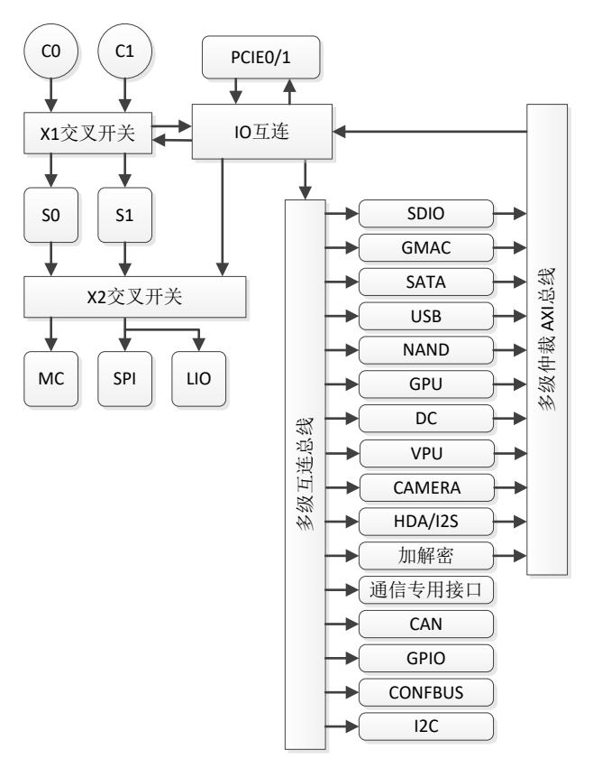

<span id="page-19-3"></span>图 1-1 龙芯 2K1000 结构图

## <span id="page-19-4"></span><span id="page-19-0"></span>1.2 芯片主要功能

#### <span id="page-19-1"></span>1.2.1 处理器核

- LA264
- 采用 LoongArch 指令系统(龙架构)
- 32KB 数据 Cache 和 32KB 的指令 Cache
- 1M 共享二级 Cache
- 通过目录协议维护 I/O DMA 访问的 Cache 一致性

#### <span id="page-19-2"></span>1.2.2 内存接口

- 64 位 DDR3 控制器,最高工作频率 533MHz
- 不支持 ECC
- 可配置为 32/16 位模式
- 支持命令调度


#### <span id="page-20-0"></span>**1.2.3** PCIE 接口

- ⚫ 兼容 PCIE 2.0
- ⚫ 双独立 X4 接口
- ⚫ 其中一路 X4 接口可以配置为 4 个 X1 接口
- ⚫ 其中一路 X4 接口可以配置为 2 个 X1 接口

#### <span id="page-20-1"></span>**1.2.4** GPU

- ⚫ 支持 OpenVG
- ⚫ YUV 色域空间转换
- ⚫ 高质量缩放

#### <span id="page-20-2"></span>**1.2.5** 显示控制器

- ⚫ 双 DVO(通用并行显示接口)输出
- ⚫ 硬件光标
- ⚫ 伽玛校正
- ⚫ 输出抖动
- ⚫ 最高支持 165MHz 1080p
- ⚫ 支持线性显示缓冲
- ⚫ 上电序列控制

#### <span id="page-20-3"></span>**1.2.6** SATA 控制器

- ⚫ 1 个 SATA 端口
- ⚫ 支持 SATA 1.5Gbps 和 SATA2 代 3Gbps 的传输
- ⚫ 兼容串行 ATA 2.6 规范和 AHCI 1.1 规范

#### <span id="page-20-4"></span>**1.2.7** USB2.0 控制器

- ⚫ 4 个独立的 USB2.0 的 HOST 端口
- ⚫ 其中端口 0 固定为 OTG 工作模式
- ⚫ 兼容 USB1.1 和 USB2.0
- ⚫ 内部 EHCI 控制和实现高速传输可达 480Mbps
- ⚫ 内部 OHCI 控制和实现全速和低速传输
- ⚫ 低功耗管理

#### <span id="page-20-5"></span>**1.2.8** GMAC 控制器

- ⚫ 两路 10/100/1000Mbps 自适应以太网 MAC
- ⚫ 双网卡均兼容 IEEE 802.3
- ⚫ 对外部 PHY 实现 RGMII 接口


- ⚫ 半双工/全双工自适应
- ⚫ Timestamp 功能
- ⚫ 半双工时,支持碰撞检测与重发(CSMA/CD)协议
- ⚫ 支持 CRC 校验码的自动生成与校验,支持前置符生成与删除
- ⚫ 支持网络开机

#### <span id="page-21-0"></span>**1.2.9** VPU 解码器

- ⚫ 支持 H264
- ⚫ 支持 MPEG-4
- ⚫ 支持 MPEG-2
- ⚫ 支持 MPEG-1
- ⚫ 支持 JPEG

#### <span id="page-21-1"></span>**1.2.10** CAMERA 控制器

- ⚫ 兼容 ITU-R BT 601/656 8-bit 模式外部接口(支持同步信号产生的同步或是嵌 入式同步)
- ⚫ 使用内嵌的 DMA 方式进行存取数据操作
- ⚫ 8-bit 视频数据输入,输入数据顺序固定,为 U01Y0V01Y1U23Y2V23Y3…… (因为这是最为常用的 4:2:2 格式的数据顺序)
- ⚫ 独立于图片尺寸的水平和垂直的尺寸设置
- ⚫ 可编程水平、垂直同步信号极性

#### <span id="page-21-2"></span>**1.2.11** HDA 控制器

- ⚫ 支持 16,18 和 20 位采样精度支持可变速率
- ⚫ 最高达 192KHz
- ⚫ 7.1 频道环绕立体声输出
- ⚫ 三路音频输入

#### <span id="page-21-3"></span>**1.2.12** I2S 控制器

- ⚫ 支持 master 模式下 I2S 输入
- ⚫ 支持 master 模式下 I2S 输出
- ⚫ 支持 8、16、18、20、24、32 位宽
- ⚫ 支持单声道和立体声道音频数据
- ⚫ 支持(16、22.05、32、44.1、48)kHz 采样频率
- ⚫ 支持 DMA 传输模式


#### <span id="page-22-0"></span>**1.2.13** NAND 控制器

- ⚫ 最大支持单片 16GB NAND Flash
- ⚫ 最大支持 4 个片选
- ⚫ 支持 MLC
- ⚫ 支持 512/2K/4K/8K 页

#### <span id="page-22-1"></span>**1.2.14** SPI 控制器

- ⚫ 双缓冲接收器
- ⚫ 极性和相位可编程的串行时钟
- ⚫ 主模式支持
- ⚫ 支持到 4 个的变长字节传输
- ⚫ 支持系统启动
- ⚫ 支持标准读、连续地址读、快速读、双路 I/O 等 SPI Flash 读模式

#### <span id="page-22-2"></span>**1.2.15** UART

⚫ 3 个全功能 UART 和流控 TXD,RXD,CTS, RTS, DSR,DTR,DCD, RI

5

- ⚫ 最多 12 个 UART 接口
- ⚫ 在寄存器与功能上兼容 NS16550A
- ⚫ 两路全双工异步数据接收/发送
- ⚫ 可编程的数据格式
- ⚫ 16 位可编程时钟计数器
- ⚫ 支持接收超时检测
- ⚫ 带仲裁的多中断系统

#### <span id="page-22-3"></span>**1.2.16** I2C 总线

- ⚫ 兼容 SMBUS(100Kbps)
- ⚫ 与 PHILIPS I2C 标准相兼容
- ⚫ 履行双向同步串行协议
- ⚫ 只实现主设备操作
- ⚫ 能够支持多主设备的总线
- ⚫ 总线的时钟频率可编程
- ⚫ 可以产生开始/停止/应答等操作
- ⚫ 能够对总线的状态进行探测
- ⚫ 支持低速和快速模式
- ⚫ 支持 7 位寻址和 10 位寻址
- ⚫ 支持时钟延伸和等待状态


#### <span id="page-23-0"></span>**1.2.17** PWM

- ⚫ 32 位计数器
- ⚫ 支持脉冲生成及捕获
- ⚫ 4 路控制器

#### <span id="page-23-1"></span>**1.2.18** HPET

- ⚫ 32 位计数器
- ⚫ 支持 1 个周期性中断
- ⚫ 支持 2 个非周期性中断

#### <span id="page-23-2"></span>**1.2.19** RTC

- ⚫ 计时精确到 0.1 秒
- ⚫ 可产生 3 个计时中断
- ⚫ 支持定时开机功能

#### <span id="page-23-3"></span>**1.2.20** Watchdog

- ⚫ 32 比特计数器及初始化寄存器
- ⚫ 低功耗模式暂停功能

#### <span id="page-23-4"></span>**1.2.21** 中断控制器

- ⚫ 支持软件设置中断
- ⚫ 支持电平与边沿触发
- ⚫ 支持中断屏蔽与使能
- ⚫ 支持多种中断分发模式

#### <span id="page-23-5"></span>**1.2.22** CAN

- ⚫ 符合 CAN2.0 规范
- ⚫ 两路 CAN 接口
- ⚫ 支持中断
- ⚫ 复用 GPIO

#### <span id="page-23-6"></span>**1.2.23** ACPI 功耗管理

- ⚫ 处理器核动态频率电压调节
- ⚫ 全芯片时钟门控
- ⚫ PHY 可关断
- ⚫ USB/GMAC 可唤醒
- ⚫ 来电可自动启动


#### <span id="page-24-0"></span>**1.2.24** GPIO

- ⚫ 4 位专用 GPIO 引脚,56 位复用 GPIO 引脚
- ⚫ 其余引脚与其他接口相复用,使用各个接口电压域

#### <span id="page-24-1"></span>**1.2.25** 加解密模块

- ⚫ AES、DES 算法支持
- ⚫ RSA 算法支持

#### <span id="page-24-2"></span>**1.2.26** SDIO 控制器

- ⚫ 1 路独立 SDIO 控制器
- ⚫ 兼容 SD Memory 2.0/MMC/SDIO 2.0 协议


## <span id="page-25-0"></span>**2** 引脚定义

龙芯 2K1000 的引脚进行了大量的功能复用。对于有复用关系的引脚,在介绍完其本身 的功能之外会同时在下方给出其他复用功能的描述。

## <span id="page-25-1"></span>**2.1** 约定

本章对龙芯 2K1000 引脚定义的说明使用以下约定:

#### ⚫ 信号名

信号名的选取以方便记忆和明确标识功能为原则。低有效信号以 n 结尾,高有效信号 则不带 n。

#### ⚫ 类型

<span id="page-25-5"></span>信号的输入输出类型由一个代码表示,见表 [2-1](#page-25-5)。

<span id="page-25-3"></span>表 2-1 信号类型代码

| 代码       | 描述   |
|----------|------|
| A        | 模拟   |
| DIFF I/O | 双向差分 |
| DIFF IN  | 差分输入 |
| DIFF OUT | 差分输出 |
| I        | 输入   |
| I/O      | 双向   |
| O        | 输出   |
| OD       | 开漏输出 |
| P        | 电源   |
| G        | 地    |

## <span id="page-25-2"></span>**2.2 DDR3** 接口

<span id="page-25-4"></span>表 2-2DDR3SDRAM 控制器接口信号

| 信号名称          | 类型       | 描述                      |
|---------------|----------|-------------------------|
| DDR_DQ[63:0]  | I/O      | DDR3 SDRAM 数据总线信号       |
| DDR_DQSp[7:0] |          |                         |
| DDR_DQSn[7:0] | DIFF I/O | DDR3 SDRAM 数据选通         |
| DDR_DQM[7:0]  | O        | DDR3 SDRAM 数据屏蔽         |
| DDR_A[15:0]   | O        | DDR3 SDRAM 地址总线信号       |
| DDR_BA[2:0]   | O        | DDR3 SDRAM 逻辑 BANK 地址信号 |
| DDR_WEn       | O        | DDR3 SDRAM 写使能信号        |
| DDR_CASn      | O        | DDR3 SDRAM 列地址选择信号      |
| DDR_RASn      | O        | DDR3 SDRAM 行地址选择信号      |
| DDR_CSn[3:0]  | O        | DDR3 SDRAM 片选信号         |
| DDR_CKE[3:0]  | O        | DDR3 SDRAM 时钟使能信号       |


| 信号名称         | 类型       | 描述                  |
|--------------|----------|---------------------|
| DDR_CKp[7:0] |          |                     |
| DDR_CKn[7:0] | DIFF OUT | DDR3 SDRAM 差分时钟输出信号 |
| DDR_ODT[3:0] | O        | DDR3 SDRAM ODT 信号   |
| DDR_RESETn   | O        | DDR3 SDRAM 复位控制信号   |

## <span id="page-26-0"></span>**2.3 PCIE** 接口

<span id="page-26-2"></span>表 2-3PCIE 总线信号

| 信号名称               | 类型       | 描述                                  |
|--------------------|----------|-------------------------------------|
| PCIE[1:0]_REFCLKp  | DIFF IN  | PCIE 参考时钟输入                         |
| PCIE[1:0]_REFCLKn  |          |                                     |
| PCIE0_REFCLKp[3:0] |          |                                     |
| PCIE0_REFCLKn[3:0] | DIFF OUT | PCIE0 参考时钟输出                        |
| PCIE1_REFCLKp[1:0] |          |                                     |
| PCIE1_REFCLKn[1:0] | DIFF OUT | PCIE1 参考时钟输出                        |
| PCIE[1:0]_REFRES   | A        | 外部参考电阻,通过 200ohm(+/-1%)电阻连至地        |
| PCIE[1:0]_TXp[3:0] |          |                                     |
| PCIE[1:0]_TXn[3:0] | DIFF OUT | PCIE 差分数据输出                         |
| PCIE[1:0]_RXp[3:0] |          |                                     |
| PCIE[1:0]_RXn[3:0] | DIFF IN  | PCIE 差分数据输入                         |
|                    |          | PCIE0 插卡检测,bit3-1 任意一位置低时 PCIE0 工作  |
| PCIE0_PRSNT[3:0]   | I        | 在 4X1 模式,否则工作在 1X4 模式               |
|                    | I        | PCIE1 插卡检测,bit1 置低时 PCIE1 工作在 2X1 模 |
| PCIE1_PRSNT[1:0]   |          | 式,否则工作在 1X4 模式                      |
| PCIE_RSTn          | O        | PCIE 复位                             |

## <span id="page-26-1"></span>**2.4 DVO** 显示接口

<span id="page-26-3"></span>表 2-4DVO 接口信号

| 信号名称             | 类型 | 描述                                     |
|------------------|----|----------------------------------------|
| DVO[1:0]_CLKp    | O  | DVO 时钟输出                               |
| DVO[1:0]_CLKn    | O  | DVO 时钟输出,与 DVO*_CLKp 相差 180°,非差<br>分关系 |
| DVO[1:0]_HSYNC   | O  | DVO 水平同步                               |
| DVO[1:0]_VSYNC   | O  | DVO 垂直同步                               |
| DVO[1:0]_DE      | O  | DVO 数据有效                               |
|                  |    | DVO 显示数据                               |
| DVO[1:0]_D[23:0] |    | [23:16]为 R 数据                          |
|                  | O  | [15:08]为 G 数据                          |
|                  |    | [07:00]为 B 数据                          |

DVO 接口数据信号与 RGB 对应关系如下:


表 2-5 DVO 接口 RGB 对应关系

<span id="page-27-0"></span>

| DVO 接口信号 | 24 位模式 | 18 位模式 |
|----------|--------|--------|
| DVO_D0   | B0     |        |
| DVO_D1   | B1     |        |
| DVO_D2   | B2     | B0     |
| DVO_D3   | B3     | B1     |
| DVO_D4   | B4     | B2     |
| DVO_D5   | B5     | B3     |
| DVO_D6   | B6     | B4     |
| DVO_D7   | B7     | B5     |
| DVO_D8   | G0     |        |
| DVO_D9   | G1     |        |
| DVO_D10  | G2     | G0     |
| DVO_D11  | G3     | G1     |
| DVO_D12  | G4     | G2     |
| DVO_D13  | G5     | G3     |
| DVO_D14  | G6     | G4     |
| DVO_D15  | G7     | G5     |
| DVO_D16  | R0     |        |
| DVO_D17  | R1     |        |
| DVO_D18  | R2     | R0     |
| DVO_D19  | R3     | R1     |
| DVO_D20  | R4     | R2     |
| DVO_D21  | R5     | R3     |
| DVO_D22  | R6     | R4     |
| DVO_D23  | R7     | R5     |

DVO0 接口与 LIO 以及 UART 有复用关系,如表 [2-6](#page-27-3) 和表 2-7 DVO0 与 UART [复用关系](#page-27-4) 所示。复用配置请参考表 5-3 [通用配置寄存器](#page-53-2) 1 和表 5-4 [通用配置寄存器](#page-54-2) 2。

<span id="page-27-1"></span>表 2-6DVO0 与 LIO 复用关系

<span id="page-27-3"></span>

| 信号名称          | 复用名称         | 复用类型 | 复用信号描述               |
|---------------|--------------|------|----------------------|
| DVO0_CLKp     | LIO_RDn      | O    | LIORDn 输出            |
| DVO0_CLKn     | LIO_WRn      | O    | LIOWRn 输出            |
| DVO0_HSYNC    | LIO_DEN      | O    | LIO 数据使能             |
| DVO0_VSYNC    | LIO_DIR      | O    | LIO 方向控制,0 代表读,1 代表写 |
| DVO0_DE       | LIO_ADLOCK   | O    | LIO 地址/数据选择信号        |
| DVO0_D[15:0]  | LIO_AD[15:0] | I/O  | LIO 双向 AD 信号         |
| DVO0_D[22:16] | LIO_A[6:0]   | O    | LIO 地址低位             |
| DVO0_D23      | LIO_CSn      | O    | LIO 片选信号             |

<span id="page-27-4"></span><span id="page-27-2"></span>10 表 2-7 DVO0 与 UART 复用关系


| 信号名称       | 复用名称      | 复用类型 | 复用信号描述           |
|------------|-----------|------|------------------|
| DVO0_HSYNC | UART1_TXD | O    | 串口数据输出           |
| DVO0_VSYNC | UART1_RXD | I    | 串口数据输入           |
| DVO0_DE    | UART1_RTS | O    | 串口数据传输请求         |
| DVO0_D00   | UART1_DTR | O    | 串口初始化完成          |
| DVO0_D01   | UART1_RI  | I    | 外部 MODEM 探测到振铃信号 |
| DVO0_D02   | UART1_CTS | I    | 设备接受数据就绪         |
| DVO0_D03   | UART1_DSR | I    | 设备初始化完成          |
| DVO0_D04   | UART1_DCD | I    | 外部 MODEM 探测到载波信号 |
| DVO0_D05   | UART2_TXD | O    | 串口数据输出           |
| DVO0_D06   | UART2_RXD | I    | 串口数据输入           |
| DVO0_D07   | UART2_RTS | O    | 串口数据传输请求         |
| DVO0_D08   | UART2_DTR | O    | 串口初始化完成          |
| DVO0_D09   | UART2_RI  | I    | 外部 MODEM 探测到振铃信号 |
| DVO0_D11   | UART2_CTS | I    | 设备接受数据就绪         |
| DVO0_D12   | UART2_DSR | I    | 设备初始化完成          |
| DVO0_D13   | UART2_DCD | I    | 外部 MODEM 探测到载波信号 |

DVO1 接口与CAMERA接口有复用关系,参考 [2.8](#page-29-2) 节。

## <span id="page-28-0"></span>**2.5 GMAC** 接口

<span id="page-28-1"></span>表 2-8GMAC 接口信号

| 信号名称               | 类型  | 描述         |  |
|--------------------|-----|------------|--|
| GMAC[1:0]_TXCK     | O   | RGMII 发送时钟 |  |
| GMAC[1:0]_TCTL     | O   | RGMII 发送控制 |  |
| GMAC[1:0]_TXD[3:0] | O   | RGMII 发送数据 |  |
| GMAC[1:0]_RXCK     | I   | RGMII 接收时钟 |  |
| GMAC[1:0]_RCTL     | I   | RGMII 接收控制 |  |
| GMAC[1:0]_RXD[3:0] | I   | RGMII 接收数据 |  |
| GMAC[1:0]_MDCK     | O   | SMA 接口时钟   |  |
| GMAC[1:0]_MDIO     | I/O | SMA 接口数据   |  |

GMAC1 接口与 GPIO 有复用关系,如下表所示。复用配置请参考表 5-2 [通用配置寄存](#page-51-2) [器](#page-51-2) 0。

<span id="page-28-2"></span>表 2-9 GMAC1 与 GPIO 复用关系

| 信号名称           | 复用名称       | 复用类型 | 复用信号描述      |
|----------------|------------|------|-------------|
| GMAC1_TXCK     | -          | -    | -           |
| GMAC1_TCTL     | GPIO13     | I/O  | 通用输入输出 13   |
| GMAC1_TXD[3:0] | GPIO[12:9] | I/O  | 通用输入输出 12-9 |
| GMAC1_RXCK     | -          | -    | -           |


| 信号名称           | 复用名称      | 复用类型 | 复用信号描述     |
|----------------|-----------|------|------------|
| GMAC1_RCTL     | GPIO8     | I/O  | 通用输入输出 8   |
| GMAC1_RXD[3:0] | GPIO[7:4] | I/O  | 通用输入输出 7-4 |
| GMAC1_MDCK     | -         | -    | -          |
| GMAC1_MDIO     | -         | -    | -          |

## <span id="page-29-0"></span>**2.6 SATA** 接口

<span id="page-29-3"></span>表 2-10SATA 接口信号

| 信号名称         | 类型       | 描述                           |
|--------------|----------|------------------------------|
| SATA_REFCLKp |          | 差分 100MHz 参考时钟输入(内部有备份时钟,通过  |
| SATA_REFCLKn | I        | 软件控制)                        |
| SATA_REFRES  | A        | 外部参考电阻,通过 200ohm(+/-1%)电阻连至地 |
| SATA_TXp     |          |                              |
| SATA_TXn     | DIFF OUT | SATA 差分数据输出                  |
| SATA_RXp     |          |                              |
| SATA_RXn     | DIFF IN  | SATA 差分数据输入                  |
| SATA_LEDn    | O        | SATA 工作状态,低表示有数据传输           |

SATA 接口的 SATA\_LEDn 与 GPIO 有复用关系,如下表所示。复用配置请参考表 [5-2](#page-51-2) [通用配置寄存器](#page-51-2) 0。

<span id="page-29-4"></span>表 2-11 SATA 与 GPIO 复用关系

| 信号名称      | 复用名称   | 复用类型 | 复用信号描述    |
|-----------|--------|------|-----------|
| SATA_LEDn | GPIO14 | I/O  | 通用输入输出 14 |

## <span id="page-29-1"></span>**2.7 USB** 接口

<span id="page-29-5"></span>表 2-12USB 接口信号

| 信号名称             | 类型  | 描述                          |
|------------------|-----|-----------------------------|
| USB_XI           |     |                             |
| USB_XO           | I/O | 必须在 USB_XO 上接晶振,USB_XI 保留不用 |
| USB[3:0]_TXRTUNE | A   | 参考电阻,通过 200ohm/1%电阻连接到地     |
| USB[3:0]_DP      | I/O | USB D+                      |
| USB[3:0]_DM      | I/O | USB D                       |
| USB[3:1]_OC      | I   | USB 过流检测输入,需注意该信号为高有效       |
| USB0_OC          | O   | OTG DRVVBUS 输出              |
| USB0_ID          | I   | USB0 OTG ID 输入              |
| USB0_VBUS        | A   | USB0 OTG VBUS 输入            |

## <span id="page-29-2"></span>**2.8 CAMERA** 接口

<span id="page-29-6"></span>表 2-13 CAMERA 接口信号


| 信号名称          | 类型 | 描述                     |
|---------------|----|------------------------|
| CAM_PCLK      | I  | 像素时钟,被摄像头的处理器驱动        |
| CAM_HSYNC     | I  | 水平同步,被摄像头的处理器驱动        |
| CAM_VSYNC     | I  | 帧同步,被摄像头的处理器驱动         |
| CAM_DATA[7:0] | I  | 像素数据,被摄像头的处理器驱动        |
| CAM_CLOCK     | O  | XCLK 被摄像头控制器驱动,用于摄像头模块 |

注:控制信号都是单向的,只支持 camera 提供时钟和同步信号的模式

<span id="page-30-1"></span>表 2-14CAMERA 与 DVO1 复用关系

| 信号名称          | 复用名称        | 复用类型 | 复用信号描述      |
|---------------|-------------|------|-------------|
| CAM_PCLK      | DVO1_CKN    | I    | DVO1 负时钟输出  |
| CAM_HSYNC     | DVO1_HSYNC  | I    | DVO1 水平同步信号 |
| CAM_VSYNC     | DVO1_VSYNC  | I    | DVO1 垂直同步信号 |
| CAM_DATA[7:0] | DVO1_D[7:0] | I    | DOV1 数据输出信号 |
| CAM_CLOCK     | DVO1_CKP    | O    | DVO1 正时钟输出  |

## <span id="page-30-0"></span>**2.9 HDA** 接口

<span id="page-30-2"></span>表 2-15HDA 接口信号

| 信号名称       | 类型 | 描述                   |
|------------|----|----------------------|
| HDA_BITCLK | O  | HDA BITCLK 输出        |
| HDA_SDI0   | I  | HDA 数据输入,连接第一个 codec |
| HDA_SDI1   | I  | HDA 数据输入,连接第二个 codec |
| HDA_SDI2   | I  | HDA 数据输入,连接第三个 codec |
| HDA_SDO    | O  | HDA 数据输出             |
| HDA_SYNC   | O  | HDA 同步               |
| HDA_RESETn | O  | HDA 复位               |

HDA 接口与 I2S 以及 GPIO 复用,具体复用关系如下。复用配置请参考表 5-2 [通用配置](#page-51-2) [寄存器](#page-51-2) 0。

<span id="page-30-3"></span>表 2-16HDA 与 I2S 复用关系

| 信号名称       | 复用名称     | 复用类型 | 复用信号描述     |
|------------|----------|------|------------|
| HDA_BITCLK | I2S_BCLK | O    | I2S bit 时钟 |
| HDA_SDI0   | I2S_DI   | I    | I2S 数据输入   |
| HDA_SDI1   | -        | -    | -          |
| HDA_SDI2   | -        | -    | -          |
| HDA_SDO    | I2S_DO   | O    | I2S 数据输出   |
| HDA_SYNC   | I2S_MCLK | O    | I2S MCLK   |
| HDA_RESETn | I2S_LR   | O    | I2S 左右声道选择 |

<span id="page-30-4"></span>表 2-17HDA 与 GPIO 复用关系


| 信号名称       | 复用名称   | 复用类型 | 复用信号描述    |
|------------|--------|------|-----------|
| HDA_BITCLK | GPIO24 | I/O  | 通用输入输出 24 |
| HDA_SDI0   | GPIO28 | I/O  | 通用输入输出 28 |
| HDA_SDI1   | GPIO29 | I/O  | 通用输入输出 29 |
| HDA_SDI2   | GPIO30 | I/O  | 通用输入输出 30 |
| HDA_SDO    | GPIO27 | I/O  | 通用输入输出 27 |
| HDA_SYNC   | GPIO25 | I/O  | 通用输入输出 25 |
| HDA_RESETn | GPIO26 | I/O  | 通用输入输出 26 |

### <span id="page-31-0"></span>**2.10 SPI** 接口

<span id="page-31-3"></span>表 2-18 SPI 接口信号

| 信号名称     | 类型 | 描述       |
|----------|----|----------|
| SPI_SCK  | O  | SPI 时钟输出 |
| SPI_CSn0 | O  | SPI 片选 0 |
| SPI_CSn1 | O  | SPI 片选 1 |
| SPI_CSn2 | O  | SPI 片选 2 |
| SPI_CSn3 | O  | SPI 片选 3 |
| SPI_SDO  | O  | SPI 数据输出 |
| SPI_SDI  | I  | SPI 数据输入 |

## <span id="page-31-1"></span>**2.11 I2C** 接口

<span id="page-31-5"></span><span id="page-31-4"></span>表 2-19 I2C 接口信号

| 信号名称     | 类型  | 描述      |
|----------|-----|---------|
| I2C0_SCL | O   | I2C0 时钟 |
| I2C0_SDA | I/O | I2C0 数据 |
| I2C1_SCL | O   | I2C1 时钟 |
| I2C1_SDA | I/O | I2C1 数据 |

I2C 与 GPIO 有复用,复用关系见下表。复用配置请参考表 5-2 [通用配置寄存器](#page-51-2) 0。 表 2-20 I2C 与 GPIO 复用关系

| 信号名称     | 复用名称   | 复用类型 | 复用信号描述    |
|----------|--------|------|-----------|
| I2C0_SCL | GPIO16 | I/O  | 通用输入输出 16 |
| I2C0_SDA | GPIO17 | I/O  | 通用输入输出 17 |
| I2C1_SCL | GPIO18 | I/O  | 通用输入输出 18 |
| I2C1_SDA | GPIO19 | I/O  | 通用输入输出 19 |

## <span id="page-31-2"></span>**2.12 UART** 接口

<span id="page-31-6"></span>表 2-21 UART 接口信号


| 信号名称     | 类型 | 描述               |  |
|----------|----|------------------|--|
| UART_TXD | O  | 串口数据输出           |  |
| UART_RXD | I  | 串口数据输入           |  |
| UART_RTS | O  | 串口数据传输请求         |  |
| UART_DTR | O  | 串口初始化完成          |  |
| UART_RI  | I  | 外部 MODEM 探测到振铃信号 |  |
| UART_CTS | I  | 设备接受数据就绪         |  |
| UART_DSR | I  | 设备初始化完成          |  |
| UART_DCD | I  | 外部 MODEM 探测到载波信号 |  |

UART 与 DVO 接口有复用关系,具体见 [2.4](#page-26-1) 节。

2K1000 仅有一个独立的全功能串口,该串口通过设置可以工作在 2x4 和 4x2 模式,各 种模式的管脚对应关系如下。其它引脚复用的 UART 接口的内部复用关系也如下表所示。

1x8 2x4 4x2 TXD0(O) **TXD0(O) TXD0(O)** RTS0(O) **RTS0(O)** *TXD5(O)* DTR0(O) *TXD3(O)* TXD3(O) RXD0(I) **RXD0(I) RXD0(I)** CTS0(I) **CTS0(I)** *RXD5(I)* DSR0(I) *RXD3(I)* RXD3(I) DCD0(I) *CTS3(I)* RXD4(I) RI0(I) *RTS3(O)* TXD4(O)

<span id="page-32-1"></span>表 2-22UART 接口复用关系

## <span id="page-32-0"></span>**2.13 CAN** 接口

<span id="page-32-2"></span>表 2-23 CAN 接口信号

| 信号名称    | 类型 | 描述            |
|---------|----|---------------|
| CAN0_RX | I  | CAN 通道 0 数据接收 |
| CAN0_TX | O  | CAN 通道 0 数据发送 |
| CAN1_RX | I  | CAN 通道 1 数据接收 |
| CAN1_TX | O  | CAN 通道 1 数据发送 |

CAN 接口与 GPIO 有复用,如下表所示。复用配置请参考表 5-2 [通用配置寄存器](#page-51-2) 0。

<span id="page-32-3"></span>表 2-24 CAN 与 GPIO 复用关系

| 信号名称    | 复用名称   | 复用类型 | 复用信号描述    |
|---------|--------|------|-----------|
| CAN0_RX | GPIO32 | I/O  | 通用输入输出 32 |
| CAN0_TX | GPIO33 | I/O  | 通用输入输出 33 |
| CAN1_RX | GPIO34 | I/O  | 通用输入输出 34 |
| CAN1_TX | GPIO35 | I/O  | 通用输入输出 35 |


## <span id="page-33-0"></span>**2.14 NAND** 接口

<span id="page-33-3"></span>表 2-25 NAND 接口信号

| 信号名称           | 类型  | 描述             |
|----------------|-----|----------------|
| NAND_CEn[3:0]  | O   | NAND 片选 3-0    |
| NAND_CLE       | O   | NAND 命令锁存      |
| NAND_ALE       | I   | NAND 地址锁存      |
| NAND_WRn       | O   | NAND 写信号       |
| NAND_RDn       | I   | NAND 读信号       |
| NAND_RDYn[3:0] | I   | NAND 准备好输入 3-0 |
| NAND_D[7:0]    | I/O | NAND 命令/地址/数据线 |

<span id="page-33-4"></span>NAND 与 GPIO 有复用,复用关系见下表。复用配置请参考表 5-2 [通用配置寄存器](#page-51-2) 0。 表 2-26NAND 与 GPIO 复用关系

| 信号名称           | 复用名称        | 复用类型 | 复用信号描述       |
|----------------|-------------|------|--------------|
| NAND_CEn[3:0]  | GPIO[47:44] | I/O  | 通用输入输出 47-44 |
| NAND_CLE       | GPIO48      | I/O  | 通用输入输出 48    |
| NAND_ALE       | GPIO49      | I/O  | 通用输入输出 49    |
| NAND_WRn       | GPIO50      | I/O  | 通用输入输出 50    |
| NAND_RDn       | GPIO51      | I/O  | 通用输入输出 51    |
| NAND_RDYn[3:0] | GPIO[55:52] | I/O  | 通用输入输出 55-52 |
| NAND_D[7:0]    | GPIO[63:56] | I/O  | 通用输入输出 63-56 |

## <span id="page-33-1"></span>**2.15 SDIO** 接口

<span id="page-33-6"></span><span id="page-33-5"></span>表 2-27 SDIO 接口信号

| 信号名称           | 类型  | 描述          |
|----------------|-----|-------------|
| SDIO_CLK       | O   | SDIO 时钟输出   |
| SDIO_CMD       | I/O | SDIO 命令输入输出 |
| SDIO_DATA[3:0] | I/O | SDIO 数据信号   |

SDIO 与 GPIO 有复用,复用关系见下表。复用配置请参考表 5-2 [通用配置寄存器](#page-51-2) 0。 表 2-28 SDIO 与 GPIO 复用关系

| 信号名称           | 复用名称        | 复用类型 | 复用信号描述       |
|----------------|-------------|------|--------------|
| SDIO_CLK       | GPIO41      | I/O  | 通用输入输出 41    |
| SDIO_CMD       | GPIO40      | I/O  | 通用输入输出 40    |
| SDIO_DATA[3:0] | GPIO[39:36] | I/O  | 通用输入输出 39-36 |

### <span id="page-33-2"></span>**2.16 GPIO**

下表仅列出专用的 4 个 GPIO 引脚信号,其他 GPIO 为复用信号,可参考其他信号定 义。默认情况下所有与 GPIO 复用的引脚为 GPIO 功能(GMAC1 除外),且都为输入状态。


#### <span id="page-34-3"></span>表 2-29GPIO 信号

| 信号名称   | 类型  | 描述     |
|--------|-----|--------|
| GPIO00 | I/O | 通用输入输出 |
| GPIO01 | I/O | 通用输入输出 |
| GPIO02 | I/O | 通用输入输出 |
| GPIO03 | I/O | 通用输入输出 |

### <span id="page-34-0"></span>**2.17 PWM**

#### <span id="page-34-4"></span>表 2-30 PWM 信号

| 信号名称     | 类型 | 描述     |
|----------|----|--------|
| PWM[3:0] | O  | PWM 输出 |

PWM 与 GPIO 有复用,复用关系如下。复用配置请参考表 5-2 [通用配置寄存器](#page-51-2) 0。

#### <span id="page-34-5"></span>表 2-31 PWM 与 GPIO 复用关系

| 信号名称     | 复用名称        | 复用类型 | 复用信号描述       |
|----------|-------------|------|--------------|
| PWM[3:0] | GPIO[23:20] | I/O  | 通用输入输出 23-20 |

## <span id="page-34-1"></span>**2.18 PLL** 电源接口

<span id="page-34-6"></span>表 2-32PLL 电源接口

| 信号名称         | 类型 | 描述            |
|--------------|----|---------------|
| PLL_NODE_VDD | P  | NODE PLL 电源   |
| PLL_SOC_VDD  | P  | SOC PLL 电源    |
| PLL_DDR_VDD  | P  | DDR PLL 电源    |
| PLL_PIX0_VDD | P  | PIXEL0 PLL 电源 |
| PLL_PIX1_VDD | P  | PIXEL1 PLL 电源 |
| PLL_NODE_VSS | P  | NODE PLL 地    |
| PLL_SOC_VSS  | P  | SOC PLL 地     |
| PLL_DDR_VSS  | P  | DDR PLL 地     |
| PLL_PIX0_VSS | P  | PIXEL0 PLL 地  |
| PLL_PIX1_VSS | P  | PIXEL1 PLL 地  |

## <span id="page-34-2"></span>**2.19** 电源管理接口

<span id="page-34-7"></span>表 2-33 电源管理接口

| 信号名称         | 类型 | 描述      |
|--------------|----|---------|
| ACPI_SYSRSTn | I  | 系统复位    |
| ACPI_RINGn   | I  | 振铃唤醒    |
| ACPI_WAKEn   | I  | PCIE 唤醒 |
| ACPI_LID     | I  | 屏盖状态    |
| ACPI_PWRTYPE | I  | 供电来源    |
| ACPI_BATLOWn | I  | 电源电量低   |


| 信号名称          | 类型 | 描述      |
|---------------|----|---------|
| ACPI_SUSSTATn | O  | 低功耗状态   |
| ACPI_S3n      | O  | S3 状态   |
| ACPI_S4n      | O  | S4 状态   |
| ACPI_S5n      | O  | S5 状态   |
| ACPI_VID[5:0] | O  | 调压控制    |
| ACPI_PLTRSTn  | O  | 平台复位    |
| ACPI_SLPLANn  | O  | 网络电源控制  |
| ACPI_PWRBTNn  | I  | 电源开关    |
| ACPI_PWROK    | I  | 电源有效    |
| ACPI_EN       | I  | ACPI 使能 |

## <span id="page-35-0"></span>**2.20** 测试接口

<span id="page-35-4"></span>表 2-34 测试接口

| 信号名称         | 类型 | 描述              |
|--------------|----|-----------------|
|              |    | 测试模式控制(RTC 电压域) |
| ACPI_DOTESTn | I  | 0: 测试模式         |
|              |    | 1: 功能模式         |

## <span id="page-35-1"></span>**2.21 JTAG** 接口

<span id="page-35-5"></span>表 2-35 JTAG 接口

| 信号名称      | 类型 | 描述                         |
|-----------|----|----------------------------|
| JTAG_SEL  | I  | JTAG 选择(1:JTAG;0:CPU_JTAG) |
| JTAG_TCK  | I  | JTAG 时钟                    |
| JTAG_TDI  | I  | JTAG 数据输入                  |
| JTAG_TMS  | I  | JTAG 模式                    |
| JTAG_TRST | I  | JTAG 复位                    |
| JTAG_TDO  | O  | JTAG 数据输出                  |

## <span id="page-35-2"></span>**2.22** 时钟信号

<span id="page-35-6"></span>表 2-36 时钟信号

| 信号名称        | 类型 | 描述            |
|-------------|----|---------------|
| SYS_SYSCLK  | I  | 100MHz 参考时钟   |
| SYS_TESTCLK | I  | 测试时钟输入,默认不用连接 |

## <span id="page-35-3"></span>**2.23 RTC** 相关信号

<span id="page-35-7"></span>表 2-37 时钟信号

| 信号名称        | 类型 | 描述                             |
|-------------|----|--------------------------------|
| RTC_RSMRSTn | I  | RSM 域复位,要求在 RSM 域电源稳定 1ms 后拉高, |


|          |     | 在 RSM 域电源降至 95%及以下时立即拉低。               |
|----------|-----|----------------------------------------|
| RTC_RSTn | I   | RTC 域复位,建议在 RTC 电源稳定 500ms 后再解除<br>复位。 |
| RTC_XI   | I/O | 32.768KHz 晶体接口                         |
| RTC_XO   | I/O | 32.768KHz 晶体接口                         |

## <span id="page-36-0"></span>**2.24** 系统相关信号

<span id="page-36-1"></span>表 2-38 系统相关信号

| 信号名称                | 类型 | 描述                                |
|---------------------|----|-----------------------------------|
|                     |    | PLL 时钟配置输入                        |
|                     |    | 00=低频模式                           |
| SYS_CLKSEL[1:0]     | I  | 01=高频模式                           |
|                     |    | 10=软件模式(DFT)                      |
|                     |    | 11=bypass 模式                      |
|                     |    | 启动选择输入                            |
| SYS_BOOTSEL[1:0]    | I  | 00=LIO                            |
|                     |    | 01=SPI(DFT)                       |
|                     |    | USB 时钟输入配置输入                      |
|                     |    | 00=保留                             |
| SYS_USBCLKMODE[1:0] | I  | 01=保留                             |
|                     |    | 10=one 12MHz clock input          |
|                     |    | 11=use sysclk(DFT)                |
|                     |    | PCIE 参考时钟选择输入                     |
|                     |    | {SYS_PCIECLKSEL, SYS_PCIECLKDIV}: |
| SYS_PCIECLKSEL      | I  | 00=内部 100MHz 时钟                   |
|                     |    | 01=保留                             |
|                     |    | 10=外部 100MHz 时钟                   |
|                     |    | 11=外部 200MHz 时钟                   |
|                     |    | PCIE 参考时钟选择输入                     |
|                     |    | {SYS_PCIECLKSEL, SYS_PCIECLKDIV}: |
| SYS_PCIECLKDIV      | I  | 00=内部 100MHz 时钟                   |
|                     |    | 01=保留                             |
|                     |    | 10=外部 100MHz 时钟                   |
|                     |    | 11=外部 200MHz 时钟                   |
|                     |    | NAND ECC 功能使能输入,                  |
| SYS_NANDRSRD        | I  | 1=enable                          |
|                     |    | 0=disable(DFT)                    |
|                     |    | NAND 类型选择                         |
|                     | I  | 00=512Mb(page 512B)               |
| SYS_NANDTYPE[1:0]   |    | 01=1Gb(page 2KB)                  |
|                     |    | 10=16Gb(page 4KB)                 |
|                     |    | 11=128Gb(page 8KB)                |


## <span id="page-37-0"></span>**2.25** 外设功能复用表

模块层次的功能复用关系如下表所示:

#### <span id="page-37-1"></span>表 2-39 外设功能复用表

| 功能 0     | 功能 1     | 功能 2      | 功能 3     | 功能 4     | 功能 5      |
|----------|----------|-----------|----------|----------|-----------|
| DDR3     |          |           |          |          |           |
| PCIE     |          |           |          |          |           |
| SATA     | GPIO(1)  |           |          |          |           |
| USB      |          |           |          |          |           |
| GMAC0    |          |           |          |          |           |
| GMAC1    | GPIO(14) |           |          |          |           |
| DVO0     |          | Local Bus | UART1(8) | UART1(4) | UART1(2)  |
|          |          |           |          |          | UART8(2)  |
|          |          |           |          | UART6(4) | UART6(2)  |
|          |          |           |          |          | UART7(2)  |
|          |          |           | UART2(8) | UART2(4) | UART2(2)  |
|          |          |           |          |          | UART11(2) |
|          |          |           |          | UART9(4) | UART9(2)  |
|          |          |           |          |          | UART10(2) |
|          |          |           |          |          |           |
| DVO1     |          |           | CAMERA   |          |           |
|          |          |           |          |          |           |
| CAN      | GPIO(4)  |           |          |          |           |
| HDA      | GPIO(7)  |           |          | I2S      |           |
| SPI      |          |           |          |          |           |
| RTC      |          |           |          |          |           |
| I2C      | GPIO(4)  |           |          |          |           |
|          |          |           | UART0(8) | UART0(4) | UART0(2)  |
|          |          |           |          |          | UART5(2)  |
|          |          |           |          | UART3(4) | UART3(2)  |
|          |          |           |          |          | UART4(2)  |
| NAND     | GPIO(16) |           |          |          |           |
| CPU_JTAG |          | JTAG      |          |          |           |
|          | GPIO(4)  |           |          |          |           |
| PWM      | GPIO(4)  |           |          |          |           |
| SDIO     | GPIO(6)  |           |          |          |           |
| ACPI     |          |           |          |          |           |


## <span id="page-38-0"></span>3 时钟结构

龙芯 2K1000 由一个 100MHz 时钟作为参考时钟,内部共有 5 个独立的 PLL,其中每个 PLL 最多可以提供 3 组频率上相互依赖的时钟输出。这 5 个 PLL 的用途分别为:

- ✓ 一个 NODE PLL 仅用于产生 node 时钟,该时钟为芯片的主要时钟,供 CPU 核、二级 Cache、一二级交叉开关以及 IO 子网络使用;
- ✓ 两个 PIX PLL 各产生一个像素时钟供 DC 使用,以便支持双路独立显示;
- ✓ 一个 DC PLL 同时产生 DC 控制器的内部时钟和 GMAC 控制器时钟,进一步产生 APB, SATA 以及 USB 的时钟:
- ✓ 一个 DDR PLL 同时产生 DDR、GPU 以及 HDA 的时钟;

除了内部的 PLL 之外,对于 SATA、PCIE、USB 这几个采用 PHY 自己产生时钟的模块,也使用外部输入的同一个参考时钟进行了参考时钟通路设计。

还有一个启动时钟,直接使用 100MHz 参考时钟通过分频得到。

#### <span id="page-38-1"></span>3.1 NODE PLL

node clock 的产生结构图如图 3-1 所示,

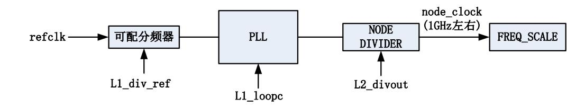

<span id="page-38-3"></span>图 3-1NODE PLL 结构图

<span id="page-38-4"></span>输出时钟频率的计算方式如下:

node\_clock=refclk/L1\_div\_ref\*L1\_loopc/L2\_divout;

node\_clock 的工作频率在 1GHz 左右, 其 PLL 的分频系数以及倍频系数可以任意配置, 但是需要保证可配分频器的输出 refclk/L1\_div\_ref 在 20~40MHz 范围内, PLL 倍频值 refclk/L1\_div\_ref\*L1\_loopc 需要在 1.2GHz~3.2GHz。该限制对其他 4 个内部 PLL 也适用, 所以下文不再赘述。

输出的时钟还可以经由 freq\_scale 模块进行细粒度分频控制。具体分频方法请参考 5.18 节。

#### <span id="page-38-2"></span>3.2 PIX PLL

pix pll 结构基本与 node pll 结构相同,但是不包含 freq\_scale 模块。2K1000 内包含两个独立的 pix pll 用于双路显示输出。像素时钟 pix clock 频率范围 100-250MHz。


<span id="page-39-2"></span>图 3-2PIX PLL 结构图

#### <span id="page-39-0"></span>3.3 DDR PLL

DDR PLL 会输出三个时钟,分别为:

- ✓ ddr\_clock 用于内存控制器,频率范围 400-700MHz
- ✓ gpu\_clock 用于 GPU 模块, 频率范围 300-500MHz
- ✓ hda clock 用于 HDA 模块, 频率固定为 24MHz

因为三个时钟共用一个 PLL, 只是通过设置各自的 L2\_divout 值来实现不同的频率输出。所以在调整其中一个模块时钟时, 如果对公用 PLL 的倍频系数进行了调整, 那么需要注意对其他时钟的影响。

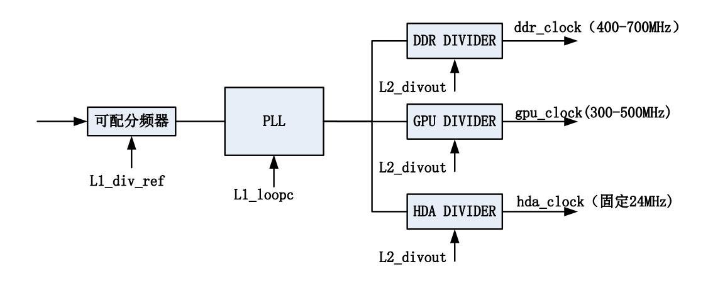

<span id="page-39-3"></span>图 3-3DDR PLL 结构图

#### <span id="page-39-1"></span>3.4 DC PLL

DC PLL 输出两个时钟:

- ✓ dc\_clock 用于 DC 控制器,频率可设为 200MHz 左右,需保证其频率大于像素时钟. 该时钟也作为 VPU 模块的主时钟。
- ✓ gmac\_clock 用于 GMAC 控制器,频率固定 125MHz。

APB、SATA 以及 USB 控制器的时钟由 125MHz gmac 时钟分频产生,所以这三个模块时钟频率最高为 125MHz,通过 freq\_scale 模块可以进一步调整分频系数。具体分频方法请参考 5.18 节。

Loongson Technology Corporation Limited


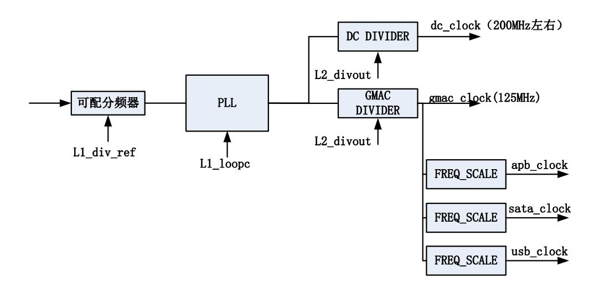

<span id="page-40-3"></span>图 3-4DC PLL 结构图

### <span id="page-40-0"></span>3.5 内部 PLL 配置方法

以上 5 个内部 PLL 提供硬件配置和软件配置两种配置方法。这两种配置方法通过 SYS\_CLKSEL[1:0]的设置来区分。

#### <span id="page-40-1"></span>3.5.1 硬件配置

具体如下表所示。

01 (硬件高频) SYS\_CLKSEL 00(硬件低频) 10 11 NODE 0.875G 1G DDR 480M 600M **GPU** 320M 400M HDA 24M 24M 硬件 bypass 所有 DC 200M 400M PLL, 所有时钟频 软件配置 率与参考时钟相同 PIX0 100M 200M (100MHz) PIX1 100M 200M 不可硬件配置 不可硬件配置 **GMAC** SATA 85M 150M USB 85M 150M APB 85M 150M

<span id="page-40-4"></span>表 3-1PLL 硬件配置

#### <span id="page-40-2"></span>3.5.2 软件配置

当 SYS\_CLKSEL 设置为 2'b10 时表示 PLL 频率通过软件配置。这种配置下,默认对应的时钟频率为外部参考时钟频率,即所有 PLL 输出都是 SYS\_SYSCLK,需要在处理器启动过程中对时钟进行软件配置。各个时钟设置的过程应该按照以下方式:

Loongson Technology Corporation Limited


- 1. 将对应的 PLL 的 PD 信号设置为 1;
- 2. 设置寄存器除了 sel\_pll\_\*及 soft\_set\_pll 之外的其它寄存器,即这两个寄存器 在设置的过程中写为 0;
- 3. 将对应的 PLL 的 PD 信号设置为 0;
- 4. 其他寄存器值不变,将 soft\_set\_pll 设置为 1;
- 5. 等待寄存器中的锁定信号 locked\_\*为 1;
- 6. 设置 sel\_pll\_\*为 1,此时对应的时钟频率将切换为软件设置的频率。

具体的配置寄存器说明请参考第 [5](#page-44-0) 章。

## <span id="page-41-0"></span>**3.6 BOOT** 时钟

BOOT 时钟通过 100MHz 参考时钟分频得到,用于 SPI 和 LIO 两个启动模块,同时该 时钟也作为 CAMERA 模块的主时钟。

<span id="page-41-4"></span>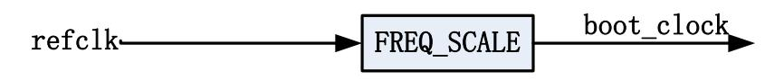

图 3-5BOOT 时钟结构图

## <span id="page-41-1"></span>**3.7 USB** 参考时钟

USB PHY 为 4 个独立的单端口 PHY,参考时钟输入提供以下 2 种方式供选择:

- ✓ 使用 1 个 12MHz 晶振输入,其它使用 0 号 PHY 的时钟输出作为参考源
- ✓ 不使用单独的参考时钟输入,都使用50MHz的内部参考时钟(100MHz的SYSCLK 经二分频后)

## <span id="page-41-2"></span>**3.8 PCIE** 参考时钟

PCIE 采用两个独立的 x4 PHY,为了简化主板设计,提供以下 2 种方式供选择,使用引 脚进行控制。

- ✓ 使用 2 个 100MHz 差分输入
- ✓ 不使用单独的参考时钟输入,使用 100MHz 的内部参考时钟

### <span id="page-41-3"></span>**3.9 SATA** 参考时钟输入

SATA PHY 与 PCIE PHY 类似,也提供以下 2 种方式供选择,使用寄存器进行选择。

- ✓ 使用 1 个 100MHz 差分输入
- ✓ 不使用单独的参考时钟输入,都使用 100MHz 的内部参考时钟


## <span id="page-42-0"></span>**4** 电源管理

本章对电源管理进行简单介绍,具体寄存器及使用方法请参考第 [21](#page-177-0) 章。

## <span id="page-42-1"></span>**4.1** 电源管理模块介绍

- ⚫ 龙芯 2K1000 电源管理模块提供系统功耗管理实现机制。
- ⚫ 支持 Advanced Configuration and Power Interface, Version 4.0a(ACPI),提供相应的功 耗管理功能。
- ⚫ 系统休眠与唤醒,支持 ACPI S3(待机到内存),ACPI S4(待机到硬盘),ACPI S5(软关机),并且支持电源失效检测和自动系统恢复。支持多种唤醒方式(USB, GMAC,电源开关等)。
- ⚫ 动态性能功耗控制,支持处理器核 DVFS 控制,支持动态关闭媒体解码协处理器 电源。
- ⚫ 系统时钟控制,模块时钟门控,多种方式调节频率。
- ⚫ 提供温度管理控制功能。支持 3 级报警机制。

## <span id="page-42-2"></span>**4.2** 电源级别

表 [4-1](#page-42-6) 显示了系统支持的 ACPI 状态及其相关说明。

<span id="page-42-4"></span>表 4-1 ACPI 状态说明

<span id="page-42-6"></span>

| 状态    | 描述                                         |  |  |  |  |  |
|-------|--------------------------------------------|--|--|--|--|--|
| G0/S0 | 全部工作,该模式下系统全部工作,处理器子状态可由 Cx 或 Px 决定,媒体处理器由 |  |  |  |  |  |
|       | 状态 Dx 决定。                                  |  |  |  |  |  |
| G1/S1 | 暂不支持                                       |  |  |  |  |  |
| G1/S3 | Suspend to RAM(STR),上下文保存到内存               |  |  |  |  |  |
| G1/S4 | Suspend to Disk(STD),保存到硬盘,除唤醒电路全部掉电       |  |  |  |  |  |
| G2/S5 | Soft off,只有唤醒电路上电                          |  |  |  |  |  |
| G3    | Mechanical off,所有供电失效                      |  |  |  |  |  |

## <span id="page-42-3"></span>**4.3** 控制引脚说明

表 [4-2](#page-42-7) 为电源管理部分的 IO 信号描述。

<span id="page-42-5"></span>表 4-2 控制引脚说明

<span id="page-42-7"></span>

| 名称           | 类型 | 描述                                                    | 供电     |
|--------------|----|-------------------------------------------------------|--------|
| ACPI_SYSRSTn | I  | 系统复位                                                  | RSM3V3 |
| RTC_RSMRSTn  | I  | 复位 Resume 域逻辑,该信号需在 resume 域上电稳<br>定后保持一段时间有效(推荐>5ms) | RTC2V5 |
| RTC_RSTn     | I  | 电池更换后,重启 RTC 逻辑                                       | RTC2V5 |
| ACPI_PLTRSTn | O  | 对系统平台其它设备进行复位                                         | RSM3V3 |


| ACPI_PWROK    | I | 主供电电源上电稳定,如有多个供电,该信号表示<br>最后一个电源稳定。               | RSM3V3 |
|---------------|---|---------------------------------------------------|--------|
| ACPI_PWRBTNn  | I | 电源按钮                                              | RSM3V3 |
| ACPI_RINGn    | I | Modem 唤醒信号                                        | RSM3V3 |
| ACPI_WAKEn    | I | PCIE 边带唤醒信号                                       | RSM3V3 |
| ACPI_BATLOWn  | I | 电池电量低                                             | RSM3V3 |
| ACPI_LID      | I | 显示器开关信号                                           | RSM3V3 |
| ACPI_PWRTYPE  | I | 识别电池供电和电源供电,1 指示 AC Power;0 指<br>示 System Battery | RSM3V3 |
| ACPI_SUSSTATn | O | 指示系统将要进入低功耗状态                                     | RSM3V3 |
| ACPI_S3n      | O | STR,待机到内存指示信号                                     | RSM3V3 |
| ACPI_S4n      | O | STD,待机到硬盘指示信号                                     | RSM3V3 |
| ACPI_S5n      | O | Soft off,只有唤醒电路上电                                 | RSM3V3 |
| ACPI_SLPLANn  | O | 以太网 PHY 休眠指示信号                                    | RSM3V3 |
| ACPI_VID[5:0] | O | 电压值指示信号                                           | RSM3V3 |


## <span id="page-44-0"></span>**5** 芯片配置寄存器

龙芯 2K1000 有大量的配置寄存器,多数分布于各个功能模块中,本节介绍芯片级的配 置寄存器。

<span id="page-44-1"></span>表 5-1 芯片配置寄存器列表

| 地址         | 名称         | 描述                  |
|------------|------------|---------------------|
| 0x1fe00000 | Version    | 寄存器版本               |
| 0x1fe00008 | Feature    | 芯片特性                |
| 0x1fe00010 | Vendor     | 厂商名称                |
| 0x1fe00020 | ID         | 芯片名称                |
|            |            |                     |
| 0x1fe00480 | PLL_SYS_0  | 系统的 PLL 低 64 位配置    |
| 0x1fe00488 | PLL_SYS_1  | 系统的 PLL 高 64 位配置    |
| 0x1fe00490 | PLL_DDR_0  | 内存控制器的 PLL 低 64 位配置 |
| 0x1fe00498 | PLL_DDR_1  | 内存控制器的 PLL 高 64 位配置 |
| 0x1fe004a0 | PLL_DC_0   | DC 的 PLL 低 64 位配置   |
| 0x1fe004a8 | PLL_DC_1   | DC 的 PLL 高 64 位配置   |
| 0x1fe004b0 | PLL_PIX0_0 | PIX0 的 PLL 低 64 位配置 |
| 0x1fe004b8 | PLL_PIX0_1 | PIX0 的 PLL 高 64 位配置 |
| 0x1fe004c0 | PLL_PIX1_0 | PIX1 的 PLL 低 64 位配置 |
| 0x1fe004c8 | PLL_PIX1_1 | PIX1 的 PLL 高 64 位配置 |
| 0x1fe004d0 | FREQSCALE  | 各设备的分频控制            |
|            |            |                     |
| 0x1fe00500 | GPIO0_OEN  | GPIO 的低 64 位输出使能    |
| 0x1fe00508 | GPIO1_OEN  | 保留                  |
| 0x1fe00510 | GPIO0_O    | GPIO 的低 64 位输出值     |
| 0x1fe00518 | GPIO1_O    | 保留                  |
| 0x1fe00520 | GPIO0_I    | GPIO 的低 64 位输入值     |
| 0x1fe00528 | GPIO1_I    | 保留                  |
| 0x1fe00530 | GPIO0_INT  | GPIO 的低 64 位中断      |
| 0x1fe00538 | GPIO1_INT  | 保留                  |
|            |            |                     |
| 0x1fe00580 | PCIE0_REG0 | PCIE0 的配置寄存器 0      |
| 0x1fe00588 | PCIE0_REG1 | PCIE0 的配置寄存器 1      |
| 0x1fe00590 | PCIE0PHY   | PCIE0 的 PHY 配置寄存器   |
|            |            |                     |
| 0x1fe005a0 | PCIE1_REG0 | PCIE1 的配置寄存器 0      |
| 0x1fe005a8 | PCIE1_REG1 | PCIE1 的配置寄存器 1      |
| 0x1fe005b0 | PCIE1PHY   | PCIE1 的 PHY 配置寄存器   |
|            |            |                     |


| 地址         | 名称            | 描述                                |
|------------|---------------|-----------------------------------|
| 0x1fe00c00 | CONFDMA0      | DMA0 控制器的配置寄存器                    |
| 0x1fe00c10 | CONFDMA1      | DMA1 控制器的配置寄存器                    |
| 0x1fe00c20 | CONFDMA2      | DMA2 控制器的配置寄存器                    |
| 0x1fe00c30 | CONFDMA3      | DMA3 控制器的配置寄存器                    |
| 0x1fe00c40 | CONFDMA4      | DMA4 控制器的配置寄存器                    |
|            |               |                                   |
| 0x1fe01000 | CORE0_IPISR   | 0 号处理器核的 IPI_Status 寄存器           |
| 0x1fe01004 | CORE0_IPIEN   | 0 号处理器核的 IPI_Enable 寄存器           |
| 0x1fe01008 | CORE0_IPISET  | 0 号处理器核的 IPI_Set 寄存器              |
| 0x1fe0100c | CORE0_IPICLR  | 0 号处理器核的 IPI_Clear 寄存器            |
|            |               |                                   |
| 0x1fe01020 | CORE0_BUF0    | 0 号处理器核的 IPI_MailBox0 寄存器         |
| 0x1fe01028 | CORE0_BUF1    | 0 号处理器核的 IPI_MailBox1 寄存器         |
| 0x1fe01030 | CORE0_BUF2    | 0 号处理器核的 IPI_MailBox2 寄存器         |
| 0x1fe01038 | CORE0_BUF3    | 0 号处理器核的 IPI_MailBox3 寄存器         |
| 0x1fe01040 | CORE0_INTISR0 | 路由给 CORE0 的低 32 位中断状态             |
| 0x1fe01048 | CORE0_INTISR1 | 路由给 CORE0 的高 32 位中断状态             |
|            |               |                                   |
| 0x1fe01100 | CORE1_IPISR   | 1 号处理器核的 IPI_Status 寄存器           |
| 0x1fe01104 | CORE1_IPIEN   | 1 号处理器核的 IPI_Enable 寄存器           |
| 0x1fe01108 | CORE1_IPISET  | 1 号处理器核的 IPI_Set 寄存器              |
| 0x1fe0110c | CORE1_IPICLR  | 1 号处理器核的 IPI_Clear 寄存器            |
|            |               |                                   |
| 0x1fe01120 | CORE1_BUF0    | 1 号处理器核的 IPI_MailBox0 寄存器         |
| 0x1fe01128 | CORE1_BUF1    | 1 号处理器核的 IPI_MailBox1 寄存器         |
| 0x1fe01130 | CORE1_BUF2    | 1 号处理器核的 IPI_MailBox2 寄存器         |
| 0x1fe01138 | CORE1_BUF3    | 1 号处理器核的 IPI_MailBox3 寄存器         |
| 0x1fe01140 | CORE1_INTISR0 | 路由给 CORE1 的低 32 位中断状态             |
| 0x1fe01148 | CORE1_INTISR1 | 路由给 CORE1 的高 32 位中断状态             |
| 0x1fe01400 | ENTRY0_0      | 8 位中断路由寄存器[07]                    |
| 0x1fe01408 | ENTRY8_0      | 8 位中断路由寄存器[815]                   |
| 0x1fe01410 | ENTRY16_0     | 8 位中断路由寄存器[1623]                  |
| 0x1fe01418 | ENTRY24_0     | 8 位中断路由寄存器[2431]                  |
| 0x1fe01420 | INTISR_0      | 低 32 位中断状态寄存器                     |
| 0x1fe01424 | INTIEN_0      | 低 32 位中断使能状态寄存器                   |
| 0x1fe01428 | INTSET_0      | 低 32 位设置使能寄存器                     |
| 0x1fe0142c | INTCLR_0      | 低 32 位中断清除寄存器,清除使能寄存器和脉冲触发<br>的中断 |
| 0x1fe01430 | INTPOL_0      | 低 32 位中断极性寄存器                     |
| 0x1fe01434 | INTEDGE_0     | 低 32 位触发方式寄存器(1:脉冲触发;0:电平触发)      |
| 0x1fe01438 | BOUNCE_0      | 低 32 位中断分发模式控制,与 auto 合用。         |
|            |               |                                   |


| 地址         | 名称                    | 描述                                      |
|------------|-----------------------|-----------------------------------------|
| 0x1fe0143c | AUTO_0                | 低 32 位中断分发模式控制,与 bounce 合用。             |
| 0x1fe01440 | ENTRY0_1              | 8 位中断路由寄存器[3239]                        |
| 0x1fe01448 | ENTRY8_1              | 8 位中断路由寄存器[4047]                        |
| 0x1fe01450 | ENTRY16_1             | 8 位中断路由寄存器[4855]                        |
| 0x1fe01458 | ENTRY24_1             | 8 位中断路由寄存器[5663]                        |
| 0x1fe01460 | INTISR_1              | 高 32 位中断状态寄存器                           |
| 0x1fe01464 | INTIEN_1              | 高 32 位中断使能状态寄存器                         |
| 0x1fe01468 | INTSET_1              | 高 32 位设置使能寄存器                           |
| 0x1fe0146c | INTCLR_1              | 高 32 位中断清除寄存器,清除使能寄存器和脉冲触发<br>的中断       |
| 0x1fe01470 | INTPOL_1              | 高 32 位中断极性寄存器                           |
| 0x1fe01474 | INTEDGE_1             | 高 32 位触发方式寄存器(1:脉冲触发;0:电平触发)            |
| 0x1fe01478 | BOUNCE_1              | 高 32 位中断分发模式控制,与 auto 合用。               |
| 0x1fe0147c | AUTO_1                | 高 32 位中断分发模式控制,与 bounce 合用。             |
| 0x1fe014a0 | INT_MSI_0             | 保留                                      |
| 0x1fe014a8 | INT_MSI_EN_0          | 保留                                      |
| 0x1fe014b0 | INT_MSI_ADDR_0        | MSI 地址 0                                |
| 0x1fe014b4 | INT_MSI_TRIGGER_EN_0  | 32 位 MSI 中断使能,每位对应一个写入 MSI 地址 0 的<br>中断 |
| 0x1fe014e0 | INT_MSI_1             | 保留                                      |
| 0x1fe014e8 | INT_MSI_EN_1          | 保留                                      |
| 0x1fe014f0 | INT_MSI_ADDR_1        | MSI 地址 1                                |
| 0x1fe014f4 | INT_MSI_TRIGGER_EN_1  | 32 位 MSI 中断使能,每位对应一个写入 MSI 地址 1 的<br>中断 |
|            |                       |                                         |
| 0x1fe01500 | Thsens_int_ctrl_Hi    | 温度传感器高温中断控制寄存器                          |
| 0x1fe01508 | Thsens_int_ctrl_Lo    | 温度传感器低温中断控制寄存器                          |
| 0x1fe01510 | Thsens_int_status/clr | 温度传感器中断状态寄存器                            |
| 0x1fe01520 | Thsens_scale_hi       | 高温自动降频控制寄存器                             |
| 0x1fe01528 | Thsens_scale_lo       | 保留                                      |
| 0x1fe02000 | CPU_WIN0_BASE         | cache 通路二级窗口 0 的基地址                     |
| 0x1fe02008 | CPU_WIN1_BASE         | cache 通路二级窗口 1 的基地址                     |
| 0x1fe02010 | CPU_WIN2_BASE         | cache 通路二级窗口 2 的基地址                     |
| 0x1fe02018 | CPU_WIN3_BASE         | cache 通路二级窗口 3 的基地址                     |
| 0x1fe02020 | CPU_WIN4_BASE         | cache 通路二级窗口 4 的基地址                     |
| 0x1fe02028 | CPU_WIN5_BASE         | cache 通路二级窗口 5 的基地址                     |
| 0x1fe02030 | CPU_WIN6_BASE         | cache 通路二级窗口 6 的基地址                     |
| 0x1fe02038 | CPU_WIN7_BASE         | cache 通路二级窗口 7 的基地址                     |
| 0x1fe02040 | CPU_WIN0_MASK         | cache 通路二级窗口 0 的掩码                      |
| 0x1fe02048 | CPU_WIN1_MASK         | cache 通路二级窗口 1 的掩码                      |
| 0x1fe02050 | CPU_WIN2_MASK         | cache 通路二级窗口 2 的掩码                      |
| 0x1fe02058 | CPU_WIN3_MASK         | cache 通路二级窗口 3 的掩码                      |


| 0x1fe02060<br>CPU_WIN4_MASK<br>cache 通路二级窗口 4 的掩码<br>0x1fe02068<br>CPU_WIN5_MASK<br>cache 通路二级窗口 5 的掩码<br>0x1fe02070<br>CPU_WIN6_MASK<br>cache 通路二级窗口 6 的掩码<br>0x1fe02078<br>CPU_WIN7_MASK<br>cache 通路二级窗口 7 的掩码<br>cache 通路二级窗口 0 的新基地址<br>0x1fe02080<br>CPU_WIN0_MMAP |  |
|-------------------------------------------------------------------------------------------------------------------------------------------------------------------------------------------------------------------------------------------------------------------------|--|
|                                                                                                                                                                                                                                                                         |  |
|                                                                                                                                                                                                                                                                         |  |
|                                                                                                                                                                                                                                                                         |  |
|                                                                                                                                                                                                                                                                         |  |
|                                                                                                                                                                                                                                                                         |  |
| cache 通路二级窗口 1 的新基地址<br>0x1fe02088<br>CPU_WIN1_MMAP                                                                                                                                                                                                                     |  |
| cache 通路二级窗口 2 的新基地址<br>0x1fe02090<br>CPU_WIN2_MMAP                                                                                                                                                                                                                     |  |
| cache 通路二级窗口 3 的新基地址<br>0x1fe02098<br>CPU_WIN3_MMAP                                                                                                                                                                                                                     |  |
| cache 通路二级窗口 4 的新基地址<br>0x1fe020a0<br>CPU_WIN4_MMAP                                                                                                                                                                                                                     |  |
| cache 通路二级窗口 5 的新基地址<br>0x1fe020a8<br>CPU_WIN5_MMAP                                                                                                                                                                                                                     |  |
| cache 通路二级窗口 6 的新基地址<br>0x1fe020b0<br>CPU_WIN6_MMAP                                                                                                                                                                                                                     |  |
| cache 通路二级窗口 7 的新基地址<br>0x1fe020b8<br>CPU_WIN7_MMAP                                                                                                                                                                                                                     |  |
|                                                                                                                                                                                                                                                                         |  |
| 0x1fe02100<br>PCI_WIN0_BASE<br>uncache 通路二级窗口 0 的基地址                                                                                                                                                                                                                    |  |
| 0x1fe02108<br>PCI_WIN1_BASE<br>uncache 通路二级窗口 1 的基地址                                                                                                                                                                                                                    |  |
| 0x1fe02110<br>PCI_WIN2_BASE<br>uncache 通路二级窗口 2 的基地址                                                                                                                                                                                                                    |  |
| 0x1fe02118<br>PCI_WIN3_BASE<br>uncache 通路二级窗口 3 的基地址                                                                                                                                                                                                                    |  |
| 0x1fe02120<br>PCI_WIN4_BASE<br>uncache 通路二级窗口 4 的基地址                                                                                                                                                                                                                    |  |
| 0x1fe02128<br>PCI_WIN5_BASE<br>uncache 通路二级窗口 5 的基地址                                                                                                                                                                                                                    |  |
| 0x1fe02130<br>PCI_WIN6_BASE<br>uncache 通路二级窗口 6 的基地址                                                                                                                                                                                                                    |  |
| 0x1fe02138<br>PCI_WIN7_BASE<br>uncache 通路二级窗口 7 的基地址                                                                                                                                                                                                                    |  |
| 0x1fe02140<br>PCI_WIN0_MASK<br>uncache 通路二级窗口 0 的掩码                                                                                                                                                                                                                     |  |
| 0x1fe02148<br>PCI_WIN1_MASK<br>uncache 通路二级窗口 1 的掩码                                                                                                                                                                                                                     |  |
| 0x1fe02150<br>PCI_WIN2_MASK<br>uncache 通路二级窗口 2 的掩码                                                                                                                                                                                                                     |  |
| 0x1fe02158<br>PCI_WIN3_MASK<br>uncache 通路二级窗口 3 的掩码                                                                                                                                                                                                                     |  |
| 0x1fe02160<br>PCI_WIN4_MASK<br>uncache 通路二级窗口 4 的掩码                                                                                                                                                                                                                     |  |
| 0x1fe02168<br>PCI_WIN5_MASK<br>uncache 通路二级窗口 5 的掩码                                                                                                                                                                                                                     |  |
| 0x1fe02170<br>PCI_WIN6_MASK<br>uncache 通路二级窗口 6 的掩码                                                                                                                                                                                                                     |  |
| 0x1fe02178<br>PCI_WIN7_MASK<br>uncache 通路二级窗口 7 的掩码                                                                                                                                                                                                                     |  |
| uncache 通路二级窗口 0 的新基地址<br>0x1fe02180<br>PCI_WIN0_MMAP                                                                                                                                                                                                                   |  |
| uncache 通路二级窗口 1 的新基地址<br>0x1fe02188<br>PCI_WIN1_MMAP                                                                                                                                                                                                                   |  |
| uncache 通路二级窗口 2 的新基地址<br>0x1fe02190<br>PCI_WIN2_MMAP                                                                                                                                                                                                                   |  |
| uncache 通路二级窗口 3 的新基地址<br>0x1fe02198<br>PCI_WIN3_MMAP                                                                                                                                                                                                                   |  |
| uncache 通路二级窗口 4 的新基地址<br>0x1fe021a0<br>PCI_WIN4_MMAP                                                                                                                                                                                                                   |  |
| uncache 通路二级窗口 5 的新基地址<br>0x1fe021a8<br>PCI_WIN5_MMAP                                                                                                                                                                                                                   |  |
| uncache 通路二级窗口 6 的新基地址<br>0x1fe021b0<br>PCI_WIN6_MMAP                                                                                                                                                                                                                   |  |
| uncache 通路二级窗口 7 的新基地址<br>0x1fe021b8<br>PCI_WIN7_MMAP                                                                                                                                                                                                                   |  |
|                                                                                                                                                                                                                                                                         |  |
| IO 设备(除 PCIE)DMA 访问窗口 0 基地址<br>0x1fe02400<br>XBAR_WIN4_BASE0                                                                                                                                                                                                            |  |
| IO 设备(除 PCIE)DMA 访问窗口 1 基地址<br>0x1fe02408<br>XBAR_WIN4_BASE1                                                                                                                                                                                                            |  |
| IO 设备(除 PCIE)DMA 访问窗口 2 基地址<br>0x1fe02410<br>XBAR_WIN4_BASE2                                                                                                                                                                                                            |  |


| 地址         | 名称              | 描述                           |
|------------|-----------------|------------------------------|
| 0x1fe02418 | XBAR_WIN4_BASE3 | IO 设备(除 PCIE)DMA 访问窗口 3 基地址  |
| 0x1fe02420 | XBAR_WIN4_BASE4 | IO 设备(除 PCIE)DMA 访问窗口 4 基地址  |
| 0x1fe02428 | XBAR_WIN4_BASE5 | IO 设备(除 PCIE)DMA 访问窗口 5 基地址  |
| 0x1fe02430 | XBAR_WIN4_BASE6 | IO 设备(除 PCIE)DMA 访问窗口 6 基地址  |
| 0x1fe02438 | XBAR_WIN4_BASE7 | IO 设备(除 PCIE)DMA 访问窗口 7 基地址  |
| 0x1fe02440 | XBAR_WIN4_MASK0 | IO 设备(除 PCIE)DMA 访问窗口 0 掩码   |
| 0x1fe02448 | XBAR_WIN4_MASK1 | IO 设备(除 PCIE)DMA 访问窗口 1 掩码   |
| 0x1fe02450 | XBAR_WIN4_MASK2 | IO 设备(除 PCIE)DMA 访问窗口 2 掩码   |
| 0x1fe02458 | XBAR_WIN4_MASK3 | IO 设备(除 PCIE)DMA 访问窗口 3 掩码   |
| 0x1fe02460 | XBAR_WIN4_MASK4 | IO 设备(除 PCIE)DMA 访问窗口 4 掩码   |
| 0x1fe02468 | XBAR_WIN4_MASK5 | IO 设备(除 PCIE)DMA 访问窗口 5 掩码   |
| 0x1fe02470 | XBAR_WIN4_MASK6 | IO 设备(除 PCIE)DMA 访问窗口 6 掩码   |
| 0x1fe02478 | XBAR_WIN4_MASK7 | IO 设备(除 PCIE)DMA 访问窗口 7 掩码   |
| 0x1fe02480 | XBAR_WIN4_MMAP0 | IO 设备(除 PCIE)DMA 访问窗口 0 新基地址 |
| 0x1fe02488 | XBAR_WIN4_MMAP1 | IO 设备(除 PCIE)DMA 访问窗口 1 新基地址 |
| 0x1fe02490 | XBAR_WIN4_MMAP2 | IO 设备(除 PCIE)DMA 访问窗口 2 新基地址 |
| 0x1fe02498 | XBAR_WIN4_MMAP3 | IO 设备(除 PCIE)DMA 访问窗口 3 新基地址 |
| 0x1fe024a0 | XBAR_WIN4_MMAP4 | IO 设备(除 PCIE)DMA 访问窗口 4 新基地址 |
| 0x1fe024a8 | XBAR_WIN4_MMAP5 | IO 设备(除 PCIE)DMA 访问窗口 5 新基地址 |
| 0x1fe024b0 | XBAR_WIN4_MMAP6 | IO 设备(除 PCIE)DMA 访问窗口 6 新基地址 |
| 0x1fe024b8 | XBAR_WIN4_MMAP7 | IO 设备(除 PCIE)DMA 访问窗口 7 新基地址 |
|            |                 |                              |
| 0x1fe02500 | XBAR_WIN5_BASE0 | PCIE 设备 DMA 访问窗口 0 基地址       |
| 0x1fe02508 | XBAR_WIN5_BASE1 | PCIE 设备 DMA 访问窗口 1 基地址       |
| 0x1fe02510 | XBAR_WIN5_BASE2 | PCIE 设备 DMA 访问窗口 2 基地址       |
| 0x1fe02518 | XBAR_WIN5_BASE3 | PCIE 设备 DMA 访问窗口 3 基地址       |
| 0x1fe02520 | XBAR_WIN5_BASE4 | PCIE 设备 DMA 访问窗口 4 基地址       |
| 0x1fe02528 | XBAR_WIN5_BASE5 | PCIE 设备 DMA 访问窗口 5 基地址       |
| 0x1fe02530 | XBAR_WIN5_BASE6 | PCIE 设备 DMA 访问窗口 6 基地址       |
| 0x1fe02538 | XBAR_WIN5_BASE7 | PCIE 设备 DMA 访问窗口 7 基地址       |
| 0x1fe02540 | XBAR_WIN5_MASK0 | PCIE 设备 DMA 访问窗口 0 掩码        |
| 0x1fe02548 | XBAR_WIN5_MASK1 | PCIE 设备 DMA 访问窗口 1 掩码        |
| 0x1fe02550 | XBAR_WIN5_MASK2 | PCIE 设备 DMA 访问窗口 2 掩码        |
| 0x1fe02558 | XBAR_WIN5_MASK3 | PCIE 设备 DMA 访问窗口 3 掩码        |
| 0x1fe02560 | XBAR_WIN5_MASK4 | PCIE 设备 DMA 访问窗口 4 掩码        |
| 0x1fe02568 | XBAR_WIN5_MASK5 | PCIE 设备 DMA 访问窗口 5 掩码        |
| 0x1fe02570 | XBAR_WIN5_MASK6 | PCIE 设备 DMA 访问窗口 6 掩码        |
| 0x1fe02578 | XBAR_WIN5_MASK7 | PCIE 设备 DMA 访问窗口 7 掩码        |
| 0x1fe02580 | XBAR_WIN5_MMAP0 | PCIE 设备 DMA 访问窗口 0 新基地址      |
| 0x1fe02588 | XBAR_WIN5_MMAP1 | PCIE 设备 DMA 访问窗口 1 新基地址      |
| 0x1fe02590 | XBAR_WIN5_MMAP2 | PCIE 设备 DMA 访问窗口 2 新基地址      |


| 地址         | 名称              | 描述                      |
|------------|-----------------|-------------------------|
| 0x1fe02598 | XBAR_WIN5_MMAP3 | PCIE 设备 DMA 访问窗口 3 新基地址 |
| 0x1fe025a0 | XBAR_WIN5_MMAP4 | PCIE 设备 DMA 访问窗口 4 新基地址 |
| 0x1fe025a8 | XBAR_WIN5_MMAP5 | PCIE 设备 DMA 访问窗口 5 新基地址 |
| 0x1fe025b0 | XBAR_WIN5_MMAP6 | PCIE 设备 DMA 访问窗口 6 新基地址 |
| 0x1fe025b8 | XBAR_WIN5_MMAP7 | PCIE 设备 DMA 访问窗口 7 新基地址 |
|            |                 |                         |
| 0x1fe02810 | CONFAML         | QOS 控制使能寄存器             |
| 0x1fe02818 | CONFAML0        | AML0 的读操作带宽、延迟配置寄存器     |
| 0x1fe02820 | CONFAML1        | AML0 的写操作带宽、延迟配置寄存器     |
| 0x1fe02828 | CONFAML2        | AML1 的读操作带宽、延迟配置寄存器     |
| 0x1fe02830 | CONFAML3        | AML1 的写操作带宽、延迟配置寄存器     |
| 0x1fe02838 | CONFAML4        | AML2 的读操作带宽、延迟配置寄存器     |
| 0x1fe02840 | CONFAML5        | AML2 的写操作带宽、延迟配置寄存器     |
| 0x1fe02848 | CONFAML6        | AML3 的读操作带宽、延迟配置寄存器     |
| 0x1fe02850 | CONFAML7        | AML3 的写操作带宽、延迟配置寄存器     |
| 0x1fe02858 | CONFAML8        | AML4 的读操作带宽、延迟配置寄存器     |
| 0x1fe02860 | CONFAML9        | AML4 的写操作带宽、延迟配置寄存器     |
| 0x1fe02868 | CONFAML10       | AML5 的读操作带宽、延迟配置寄存器     |
| 0x1fe02870 | CONFAML11       | AML5 的写操作带宽、延迟配置寄存器     |
| 0x1fe02878 | CONFAML12       | AML6 的读操作带宽、延迟配置寄存器     |
| 0x1fe02880 | CONFAML13       | AML6 的写操作带宽、延迟配置寄存器     |
| 0x1fe02888 | CONFAML14       | AML7 的读操作带宽、延迟配置寄存器     |
| 0x1fe02890 | CONFAML15       | AML7 的写操作带宽、延迟配置寄存器     |
| 0x1fe02898 | CONFAML16       | AML0-3 的延迟屏蔽配置寄存器       |
| 0x1fe028a0 | CONFAML17       | AML4-7 的延迟屏蔽配置寄存器       |
| 0x1fe028a8 | CONFAML18       | AML0-3 的带宽屏蔽配置寄存器       |
| 0x1fe028b0 | CONFAML19       | AML4-7 的带宽屏蔽配置寄存器       |
| 0x1fe028b8 | CONFAML20       | AML0 的读操作实时带宽监测寄存器      |
| 0x1fe028c0 | CONFAML21       | AML0 的写操作实时带宽监测寄存器      |
| 0x1fe028c8 | CONFAML22       | AML1 的读操作实时带宽监测寄存器      |
| 0x1fe028d0 | CONFAML23       | AML1 的写操作实时带宽监测寄存器      |
| 0x1fe028d8 | CONFAML24       | AML2 的读操作实时带宽监测寄存器      |
| 0x1fe028e0 | CONFAML25       | AML2 的写操作实时带宽监测寄存器      |
| 0x1fe028e8 | CONFAML26       | AML3 的读操作实时带宽监测寄存器      |
| 0x1fe028f0 | CONFAML27       | AML3 的写操作实时带宽监测寄存器      |
| 0x1fe028f8 | CONFAML28       | AML4 的读操作实时带宽监测寄存器      |
| 0x1fe02900 | CONFAML29       | AML4 的写操作实时带宽监测寄存器      |
| 0x1fe02908 | CONFAML30       | AML5 的读操作实时带宽监测寄存器      |
| 0x1fe02910 | CONFAML31       | AML5 的写操作实时带宽监测寄存器      |
| 0x1fe02918 | CONFAML32       | AML6 的读操作实时带宽监测寄存器      |
| 0x1fe02920 | CONFAML33       | AML6 的写操作实时带宽监测寄存器      |


| 地址         | 名称              | 描述                                                  |
|------------|-----------------|-----------------------------------------------------|
| 0x1fe02928 | CONFAML34       | AML7 的读操作实时带宽监测寄存器                                  |
| 0x1fe02930 | CONFAML35       | AML7 的写操作实时带宽监测寄存器                                  |
|            |                 |                                                     |
| 0x1fe03000 | PCICFG_HEADER2  | APB 设备的配置头寄存器(一般采用配置头访问形式,<br>不建议使用配置寄存器的形式访问)      |
| 0x1fe03040 | PCICFG_HEADER30 | GMAC0 设备的配置头寄存器(一般采用配置头访问形<br>式,不建议使用配置寄存器的形式访问)    |
| 0x1fe03080 | PCICFG_HEADER31 | GMAC1 设备的配置头寄存器(一般采用配置头访问形<br>式,不建议使用配置寄存器的形式访问)    |
| 0x1fe030c0 | PCICFG_HEADER40 | USB-OTG 设备的配置头寄存器(一般采用配置头访问<br>形式,不建议使用配置寄存器的形式访问)  |
| 0x1fe03100 | PCICFG_HEADER41 | USB-EHCI 设备的配置头寄存器(一般采用配置头访问<br>形式,不建议使用配置寄存器的形式访问) |
| 0x1fe03140 | PCICFG_HEADER42 | USB-OHCI 设备的配置头寄存器(一般采用配置头访问<br>形式,不建议使用配置寄存器的形式访问) |
| 0x1fe03180 | PCICFG_HEADER5  | GPU设备的配置头寄存器(一般采用配置头访问形式,<br>不建议使用配置寄存器的形式访问)       |
| 0x1fe031c0 | PCICFG_HEADER6  | DC 设备的配置头寄存器(一般采用配置头访问形式,<br>不建议使用配置寄存器的形式访问)       |
| 0x1fe03200 | PCICFG_HEADER7  | HDA 设备的配置头寄存器(一般采用配置头访问形<br>式,不建议使用配置寄存器的形式访问)      |
| 0x1fe03240 | PCICFG_HEADER8  | SATA 设备的配置头寄存器(一般采用配置头访问形<br>式,不建议使用配置寄存器的形式访问)     |
| 0x1fe03280 | N/A_HEADER      | 无效设备的配置头寄存器(一般采用配置头访问形式,<br>不建议使用配置寄存器的形式访问)        |
| 0x1fe032c0 | PCICFG_HEADERf  | DMA 控制器的配置头寄存器(一般采用配置头访问形<br>式,不建议使用配置寄存器的形式访问)     |
| 0x1fe03300 | PCICFG_HEADER10 | VPU设备的配置头寄存器(一般采用配置头访问形式,<br>不建议使用配置寄存器的形式访问)       |
| 0x1fe03340 | PCICFG_HEADER11 | CAMERA 控制器的配置头寄存器(一般采用配置头访<br>问形式,不建议使用配置寄存器的形式访问)  |
| 0x1fe03800 | PCICFG2_RECFG   | APB 设备配置头空间的重配置使能寄存器                                |
| 0x1fe03808 | PCICFG30_RECFG  | GMAC0 设备配置头空间的重配置使能寄存器                              |
| 0x1fe03810 | PCICFG31_RECFG  | GMAC1 设备配置头空间的重配置使能寄存器                              |
| 0x1fe03818 | PCICFG40_RECFG  | USB-OTG 设备配置头空间的重配置使能寄存器                            |
| 0x1fe03820 | PCICFG41_RECFG  | USB-EHCI 设备配置头空间的重配置使能寄存器                           |
| 0x1fe03828 | PCICFG42_RECFG  | USB-OHCI 设备配置头空间的重配置使能寄存器                           |
| 0x1fe03830 | PCICFG5_RECFG   | GPU 设备配置头空间的重配置使能寄存器                                |
| 0x1fe03838 | PCICFG6_RECFG   | DC 设备配置头空间的重配置使能寄存器                                 |
| 0x1fe03840 | PCICFG7_RECFG   | HDA 设备配置头空间的重配置使能寄存器                                |
| 0x1fe03848 | PCICFG8_RECFG   | SATA 设备配置头空间的重配置使能寄存器                               |
| 0x1fe03850 | PCICFGf_RECFG   | DMA 控制器配置头空间的重配置使能寄存器                               |
| 0x1fe03858 | PCICFG10_RECFG  | VPU 设备配置头空间的重配置使能寄存器                                |
| 0x1fe03860 | PCICFG11_RECFG  | CAMERA 控制器配置头空间的重配置使能寄存器                            |
|            |                 |                                                     |
| 0x1fe03ff8 | CHIP_ID         | 芯片版本号                                               |

上表中关于二级交叉开关以及DMA 访问窗口相关的配置寄存器将在第 [6](#page-82-0)章介绍,中断


相关寄存器将在第 [7](#page-105-0) 章介绍,这里不再赘述。下面详细介绍其他的配置寄存器。

## <span id="page-51-0"></span>**5.1** 通用配置寄存器 **0**

通用配置寄存器 0,包括对管脚复用的控制,以及 HDA、USB、PCIE 的一致性、内存 控制器、RTC 控制器及 LIO 控制器的配置等。

<span id="page-51-1"></span>表 5-2 通用配置寄存器 0

<span id="page-51-2"></span>

| 位域    | 名称                   | 访问 | 缺省值  | 描述                           |
|-------|----------------------|----|------|------------------------------|
| 63    | LIO big_mem          | RW | 0x0  | LIO big_mem 模式控制             |
| 62    | LIO iopf_en          | RW | 0x0  | 保留                           |
|       |                      |    |      | IO 数据位宽:                     |
| 61    | LIO io_width_16      | RW | 0x1  | 0:8 位                        |
|       |                      |    |      | 1:16 位                       |
| 60:56 | LIO io_count_init_i  | RW | 0x1f | IO 数据读取延迟(boot 时钟周期数)        |
|       |                      |    |      | Rom 数据位宽:                    |
| 55    | LIO rom_width16      | RW | 0x1  | 0:8 位                        |
|       |                      |    |      | 1:16 位                       |
| 54:50 | LIO rom_count_init_i | RW | 0x1f | ROM 数据读取延迟(boot 时钟周期数)       |
|       |                      |    |      | 内部等待计数器步长设置:                 |
|       |                      |    |      | 0:步长为 1                      |
| 49:48 | LIO clock_period_i   | RW | 0x0  | 1:步长为 4                      |
|       |                      |    |      | 2:步长为 2                      |
|       |                      |    |      | 3:步长为 1                      |
| 47    | rtc_restart          | RW | 0x0  | 内部振荡器重启控制                    |
| 46:44 | rtc_ds               | RW | 0x0  | 内部振荡器接口控制信号                  |
| 43:42 | Reserved             | RO | 0x0  | 保留                           |
|       |                      |    |      | 窗口不命中处理                      |
|       |                      |    |      | 0:关闭内存控制器的该功能                |
| 41    | mc_default_reg       | RW | 0x1  | 1:当所有窗口不命中时,由内存控制器给出         |
|       |                      |    |      | 响应,防止 CPU 卡死。                |
|       |                      |    |      | DDR 配置空间关闭,高有效               |
|       |                      |    |      | DDR 控制器在内存空间中开辟了一小段配置        |
| 40    | mc_disable_reg       | RW | 0x0  | 空间(1MB @0x0ff0,0000),在关闭后软件就 |
|       |                      |    |      | 可以使用这段空间。为避免意外访问,建议          |
|       |                      |    |      | 在配置完成后及时关闭                   |
| 39:37 | Reserved             | RO | 0x0  | 保留                           |
|       |                      |    |      | USB 端口的 EHCI 控制器 64 位地址模式    |
| 36    | usbehci64_en         | RW | 0x0  | 0:32 位地址模式                   |
|       |                      |    |      | 1:64 位地址模式                   |


| 位域    | 名称            | 访问 | 缺省值 | 描述                                    |
|-------|---------------|----|-----|---------------------------------------|
|       |               |    |     | HPET 中断模式                             |
|       |               |    |     | 0:正常模式,即 timer0/1/2 的中断都映射到中          |
| 35    | hpet_int_mode | RW | 0x0 | 断引脚 21                                |
|       |               |    |     | 1:中断分开模式,timer0/1/2 的中断分别映射           |
|       |               |    |     | 到中断引脚 21/38/39                        |
|       |               |    |     | PCIE 设备的 DMA 请求类别:                    |
| 34    | pcie_coherent | RW | 0x1 | 0:非一致性请求                              |
|       |               |    |     | 1:为一致性请求                              |
|       |               |    |     | USB 设备的 DMA 请求类别:                     |
| 33    | usb_coherent  | RW | 0x1 | 0:非一致性请求                              |
|       |               |    |     | 1:为一致性请求                              |
|       |               |    |     | HDA 设备的 DMA 请求类别:                     |
| 32    | hda_coherent  | RW | 0x1 | 0:非一致性请求                              |
|       |               |    |     | 1:为一致性请求                              |
| 31:21 | Reserved      | RO | 0x0 | 保留                                    |
|       |               |    |     | SDIO 管脚复用控制:                          |
| 20    | sdio_sel      | RW | 0x0 | 0:管脚为 GPIO                            |
|       |               |    |     | 1:管脚为 SDIO                            |
| 19:18 |               |    |     |                                       |
|       |               |    |     | CAN 管脚复用控制:当专用通信接口为 0 时               |
|       |               |    |     | 0:管脚为 GPIO                            |
| 17:16 | can_sel       | RW | 0x0 | 1:管脚为 CAN                             |
|       |               |    |     | 否则,管脚为专用通信接口                          |
|       |               |    |     | PWM 管脚复用控制:                           |
| 15:12 | pwm_sel       | RW | 0x0 | 0:管脚为 GPIO                            |
|       |               |    |     | 1:管脚为 PWM                             |
|       |               |    |     | I2C 管脚复用控制:                           |
| 11:10 | i2c_sel       | RW | 0x0 | 0:管脚为 GPIO                            |
|       |               |    |     | 1:管脚为 I2C                             |
|       |               |    |     | NAND 管脚复用控制:                          |
| 9     | nand_sel      | RW | 0x0 | 0:管脚为 GPIO                            |
|       |               |    |     | 1:管脚为 NAND                            |
|       |               |    |     | SATA 管脚复用控制:                          |
| 8     | sata_sel      | RW | 0x0 | 0:管脚为 GPIO                            |
|       |               |    |     | 1:管脚为 SATA                            |
|       |               |    |     | 当 dvo0_sel 为 0 时,LIO 管脚复用控制:          |
|       |               |    |     | 0:管脚为 GPIO                            |
| 7     | lio_sel       | RW | 0x0 | 1:管脚为 LIO                             |
|       |               |    |     | 注:dvo0_sel、lio_sel 和 uart1/2_sel 三者只能 |
|       |               |    |     | 有一个为 1                                |


| 位域 | 名称                 | 访问 | 缺省值 | 描述                               |
|----|--------------------|----|-----|----------------------------------|
|    |                    |    |     | 表示 I2S 管脚复用控制:                   |
|    |                    |    |     | 0:管脚为 HDA 或 GPIO                 |
| 6  | i2s_sel            | RW | 0x0 | 1:管脚为 I2S                        |
|    |                    |    |     | 注:hda_sel、和 i2s_sel 只能有一个为 1,二者  |
|    |                    |    |     | 都设 0 为 GPIO 模式                   |
| 5  | -                  | RW | 0x0 | 保留                               |
|    |                    |    |     | HDA 管脚复用控制:                      |
|    |                    |    |     | 0:管脚为 I2S 或 GPIO                 |
| 4  | hda_sel            | RW | 0x0 | 1:管脚为 HDA                        |
|    |                    |    |     | 注:hda_sel 和 i2s_sel 只能有一个为 1,二者  |
|    |                    |    |     | 都设 0 为 GPIO 模式                   |
|    |                    |    |     | GMAC1 管脚复用控制:                    |
| 3  | gmac1_sel          | RW | 0x1 | 0:管脚为 GPIO                       |
|    |                    |    |     | 1:管脚为 GMAC1                      |
|    |                    |    |     | GMAC1 的边带流控制,当 GMAC 控制器的         |
|    |                    |    |     | EFC 使能时,可以让 MAC 产生 Pause Control |
| 2  | gmac1_sdb_flowctrl | RW | 0x0 | Frame 控制 Rx FIFO 的流量:            |
|    |                    |    |     | 0:关闭该功能                          |
|    |                    |    |     | 1:使能该功能                          |
|    |                    |    |     | GMAC0 的边带流控制,当 GMAC 控制器的         |
|    |                    |    |     | EFC 使能时,可以让 MAC 产生 Pause Control |
| 1  | gmac0_sdb_flowctrl | RW | 0x0 | Frame 控制 Rx FIFO 的流量:            |
|    |                    |    |     | 0:关闭该功能                          |
|    |                    |    |     | 1:使能该功能                          |
|    |                    |    |     | GMAC 设备的 DMA 请求类别:               |
| 0  | gmac_coherence_en  | RW | 0x1 | 0:非一致性请求                         |
|    |                    |    |     | 1:为一致性请求                         |

## <span id="page-53-0"></span>**5.2** 通用配置寄存器 **1**

通用配置寄存器 1,包括对管脚复用的控制以及流控制等。

<span id="page-53-1"></span>表 5-3 通用配置寄存器 1

<span id="page-53-2"></span>

| 位域    | 名称          | 访问 | 缺省值 | 描述                |
|-------|-------------|----|-----|-------------------|
| 63:60 | delay_hda   | RW | 0x0 | HDA 访存通路写命令堵塞时间   |
| 59:56 | delay_pcie0 | RW | 0x4 | PCIE0 访存通路写命令堵塞时间 |
| 55:52 | delay_usb   | RW | 0x4 | USB 访存通路写命令堵塞时间   |
| 51:48 | delay_sata  | RW | 0x4 | SATA 访存通路写命令堵塞时间  |
| 47:44 | delay_dc    | RW | 0x2 | DC 访存通路写命令堵塞时间    |
| 43:40 | delay_gpu   | RW | 0x2 | GPU 访存通路写命令堵塞时间   |
| 39:36 | delay_dma   | RW | 0x4 | DMA 访存写命令堵塞时间     |
| 35:32 | delay_gmac  | RW | 0x4 | GMAC 访存通路写命令堵塞时间  |


| 位域    | 名称             | 访问 | 缺省值 | 描述                                                                                                                               |
|-------|----------------|----|-----|----------------------------------------------------------------------------------------------------------------------------------|
| 31:28 | awmon_channel  | RW | 0x0 | 访存写命令通路 monitor 通道选择                                                                                                             |
| 27:26 | awmon_select   | RW | 0x0 | 访存写命令通路 monitor 类型选择                                                                                                             |
| 25    | awmon_clear    | RW | 0x0 | 访存写命令通路 monitor 清空                                                                                                               |
| 24    | awmon_start    | RW | 0x0 | 访存写命令通路 monitor 开始工作                                                                                                             |
| 23:20 | usb_flush_idle | RW | 0xf | 设置清空 write buffer 前空闲周期数                                                                                                         |
| 19    | usb_prefetch   | RW | 0x1 | 使能读预取                                                                                                                            |
| 18    | usb_flush_wr   | RW | 0x0 | 设置写命令发出后是否清空 read buffer                                                                                                         |
| 17    | usb_stop_waw   | RW | 0x0 | 是否允许在上一个写完成前发出写命令                                                                                                                |
| 16    | usb_stop_raw   | RW | 0x1 | 是否允许在上一个写完成前发出读命令                                                                                                                |
| 15:14 | Reserved       | RO | 0x0 | 保留                                                                                                                               |
| 13    | uart2_sel      | RW | 0x0 | 当 dvo0_sel 为 0 时,UART2 管脚复用控制:<br>0:管脚为 GPIO<br>1:管脚为 UART2<br>注:dvo0_sel、lio_sel 和 uart1/2_sel 三者只能有<br>一个为 1                   |
| 12    | uart1_sel      | RW | 0x0 | 当 dvo0_sel 为 0 时,UART1 管脚复用控制:<br>0:管脚为 GPIO<br>1:管脚为 UART1<br>注:dvo0_sel、lio_sel 和 uart1/2_sel 三者只能有<br>一个为 1                   |
| 11:8  | uart2_enable   | RW | 0x1 | UART2 对应的 UART 控制器:<br>4'b0001:8 线模式(仅 uart2)<br>4'b0011:4 线模式(uart2+uart9)<br>4'b1111:2 线模式(uart2+uart9+uart10+uart11)<br>其他:保留 |
| 7:4   | uart1_enable   | RW | 0x1 | UART1 对应的 UART 控制器:<br>4'b0001:8 线模式(仅 uart1)<br>4'b0011:4 线模式(uart1+uart6)<br>4'b1111:2 线模式(uart1+uart6+uart7+uart8)<br>其他:保留   |
| 3:0   | uart0_enable   | RW | 0x1 | UART0 对应的 UART 控制器:<br>4'b0001:8 线模式(仅 uart0)<br>4'b0011:4 线模式(uart0+uart3)<br>4'b1111:2 线模式(uart0+uart3+uart4+uart5)<br>其他:保留   |

## <span id="page-54-0"></span>**5.3** 通用配置寄存器 **2**

通用配置寄存器 2,包括对 GPU 的软复位,管脚复用及 PCIE 设备的使能等。 地址:0x1fe00430

<span id="page-54-1"></span>表 5-4 通用配置寄存器 2

<span id="page-54-2"></span>

| 位域 | 名称 | 访问 | 缺省值 | 描述 |
|----|----|----|-----|----|
|    |    |    |     |    |


| 位域    | 名称              | 访问  | 缺省值 | 描述                                         |
|-------|-----------------|-----|-----|--------------------------------------------|
| 63:32 | Reserved        | RO  | 0x0 | 保留                                         |
| 31:28 | cam_flush_idle  | R/W | 0xf | cam 接口空闲写入周期数                              |
| 27    | cam_prefetch    | R/W | 0x1 | cam 接口预取                                   |
| 26    | cam_flush_wr    | R/W | 0x0 | cam 接口读请求刷出写请求                             |
| 25    | cam_stop_waw    | R/W | 0x0 | cam 接口停止写后写                                |
| 24    | cam_stop_raw    | R/W | 0x1 | cam 接口停止写后读                                |
| 23:21 | Reserved        | RO  | 0x0 | 保留                                         |
| 20    | vpu_disable     | RW  | 0x0 | VPU 模块使能信号,1 关闭,0 打开                       |
| 19    | cam_disable     | RW  | 0x0 | CAMERA 模块使能信号,1 关闭,0 打开                    |
| 18    | cam_soft_resetn | RW  | 0x0 | CAMERA 模块软件复位,低有效。                         |
| 17    | pcie1_enable    | RW  | 0x0 | PCIE1 控制器使能信号,高有效。当不使能时软<br>件扫描不到该 PCIE 桥。 |
| 16    | pcie0_enable    | RW  | 0x0 | PCIE0 控制器使能信号,高有效。当不使能时软<br>件扫描不到该 PCIE 桥。 |
| 15:8  | iodma_spare_rd  | RW  | 0x0 | iodma 读操作最大数设置                             |
|       |                 |     |     | CAMERA 设备的 DMA 请求类别:                       |
| 7     | cam_coherent    | RW  | 0x1 | 0:非一致性请求                                   |
|       |                 |     |     | 1:为一致性请求                                   |
|       |                 |     |     | VPU 设备的 DMA 请求类别:                          |
| 6     | vpu_coherent    | RW  | 0x1 | 0:非一致性请求                                   |
|       |                 |     |     | 1:为一致性请求                                   |
|       |                 |     |     | 使能 CAMERA 的管脚功能:                           |
|       |                 |     |     | 0:管脚保留                                     |
| 5     | cam_sel         | RW  | 0x0 | 1:管脚为 CAMERA                               |
|       |                 |     |     | 注:dvo1_sel、cam_sel 二者只能有一个为 1              |
|       |                 |     |     | 使能 DVO1 的管脚功能:                             |
|       |                 |     |     | 0:管脚保留                                     |
| 4     | dvo1_sel        | RW  | 0x0 | 1:管脚为 DVO1                                 |
|       |                 |     |     | 注:dvo1_sel、cam_sel 二者只能有一个为 1              |
|       |                 |     |     | DC 设备的 DMA 请求类别:                           |
| 3     | dc_coherent     | RW  | 0x1 | 0:非一致性请求                                   |
|       |                 |     |     | 1:为一致性请求                                   |
|       |                 |     |     | GPU 设备的 DMA 请求类别:                          |
| 2     | gpu_coherent    | RW  | 0x1 | 0:非一致性请求                                   |
|       |                 |     |     | 1:为一致性请求                                   |
|       |                 |     |     | 使能 DVO0 的管脚功能:                             |
|       |                 |     |     | 0:管脚保留                                     |
| 1     | dvo0_sel        | RW  | 0x0 | 1:管脚为 DVO0                                 |
|       |                 |     |     | 注:dvo0_sel、lio_sel 和 uart1/2_sel 三者只能有     |
|       |                 |     |     | 一个为 1                                      |


| 位域 | 名称             | 访问 | 缺省值 | 描述                              |
|----|----------------|----|-----|---------------------------------|
| 0  | gpu_soft_reset | RW | 0x0 | GPU 的软件复位:<br>1:代表复位<br>0:代表解复位 |

## <span id="page-56-0"></span>**5.4 APBDMA** 配置寄存器

APBDMA 配置寄存器用于给 APB 设备配置对应的 DMA 控制器。 地址:0x1fe00438

<span id="page-56-1"></span>表 5-5 APBDMA 配置寄存器

| 位域    | 名称       | 访问 | 缺省值 | 描述                                                                                                                             |
|-------|----------|----|-----|--------------------------------------------------------------------------------------------------------------------------------|
| 63:30 | Reserved | RO | 0x0 | 保留                                                                                                                             |
| 29:27 | Reserved | RW | 0x2 | 保留                                                                                                                             |
| 26:24 | Reserved | RW | 0x1 | 保留                                                                                                                             |
| 23:21 | dma_sel7 | RW | 0x1 | I2S 控制器接收端所用的 DMA 控制器:<br>0x0:对应 DMA0 控制器<br>0x1:对应 DMA1 控制器<br>0x2:对应 DMA2 控制器<br>0x3:对应 DMA3 控制器<br>0x4:对应 DMA4 控制器<br>其他:保留 |
| 20:18 | dma_sel6 | RW | 0x0 | I2S 控制器发送端所用的 DMA 控制器:<br>0x0:对应 DMA0 控制器<br>0x1:对应 DMA1 控制器<br>0x2:对应 DMA2 控制器<br>0x3:对应 DMA3 控制器<br>0x4:对应 DMA4 控制器<br>其他:保留 |
| 17:15 | dma_sel5 | RW | 0x0 | SDIO 控制器所用的 DMA 控制器:<br>0x0:对应 DMA0 控制器<br>0x1:对应 DMA1 控制器<br>0x2:对应 DMA2 控制器<br>0x3:对应 DMA3 控制器<br>0x4:对应 DMA4 控制器<br>其他:保留   |
| 14:12 | dma_sel4 | RW | 0x1 | DES 控制器写操作所用的 DMA 控制器:<br>0x0:对应 DMA0 控制器<br>0x1:对应 DMA1 控制器<br>0x2:对应 DMA2 控制器<br>0x3:对应 DMA3 控制器<br>0x4:对应 DMA4 控制器<br>其他:保留 |


| 位域   | 名称       | 访问 | 缺省值 | 描述                     |
|------|----------|----|-----|------------------------|
|      |          |    |     | DES 控制器读操作所用的 DMA 控制器: |
|      |          |    |     | 0x0:对应 DMA0 控制器        |
|      |          |    |     | 0x1:对应 DMA1 控制器        |
| 11:9 | dma_sel3 | RW | 0x2 | 0x2:对应 DMA2 控制器        |
|      |          |    |     | 0x3:对应 DMA3 控制器        |
|      |          |    |     | 0x4:对应 DMA4 控制器        |
|      |          |    |     | 其他:保留                  |
|      |          |    |     | AES 控制器写操作所用的 DMA 控制器: |
|      |          |    |     | 0x0:对应 DMA0 控制器        |
|      |          |    |     | 0x1:对应 DMA1 控制器        |
| 8:6  | dma_sel2 | RW | 0x1 | 0x2:对应 DMA2 控制器        |
|      |          |    |     | 0x3:对应 DMA3 控制器        |
|      |          |    |     | 0x4:对应 DMA4 控制器        |
|      |          |    |     | 其他:保留                  |
|      |          |    |     | AES 控制器读操作所用的 DMA 控制器: |
|      |          |    |     | 0x0:对应 DMA0 控制器        |
|      |          |    |     | 0x1:对应 DMA1 控制器        |
| 5:3  | dma_sel1 | RW | 0x2 | 0x2:对应 DMA2 控制器        |
|      |          |    |     | 0x3:对应 DMA3 控制器        |
|      |          |    |     | 0x4:对应 DMA4 控制器        |
|      |          |    |     | 其他:保留                  |
|      |          |    |     | NAND 控制器所用的 DMA 控制器:   |
|      |          |    |     | 0x0:对应 DMA0 控制器        |
|      |          |    |     | 0x1:对应 DMA1 控制器        |
| 2:0  | dma_sel0 | RW | 0x0 | 0x2:对应 DMA2 控制器        |
|      |          |    |     | 0x3:对应 DMA3 控制器        |
|      |          |    |     | 0x4:对应 DMA4 控制器        |
|      |          |    |     | 其他:保留                  |

## <span id="page-57-0"></span>**5.5 USB PHY0/1** 配置寄存器

配置 USB 接口 0/1 相关的电气特性

地址:0x1fe00440

<span id="page-57-1"></span>表 5-6USB 0/1 PHY 配置寄存器

| 位域 | 名称          | 访问  | 缺省值 | 描述                                                                                                     |
|----|-------------|-----|-----|--------------------------------------------------------------------------------------------------------|
| 61 | usb_phy_cfg | R/W | 0   | 通用模块关电模式<br>1:在 suspend 时,XO,Bias,PLL 模<br>块掉电;在睡眠时,Bias,PLL 掉电<br>0:在 suspend 或睡眠时 XO,Bias,PLL<br>都有电 |
| 60 | usb_phy_cfg | R/W | 0   | dm 端口下拉电阻使能<br>0:D-使能<br>1:D-关闭                                                                        |


| 位域    | 名称          | 访问  | 缺省值 | 描述                       |
|-------|-------------|-----|-----|--------------------------|
|       |             |     |     | dp 端口下拉电阻使能              |
| 59    | usb_phy_cfg | R/W | 0   | 0:D+使能                   |
|       |             |     |     | 1:D+关闭                   |
|       |             |     |     | 该信号调整了驱动电阻,用来补偿在发        |
|       |             |     |     | 送器到电缆之间的寄生电阻             |
|       | usb_phy_cfg |     |     | 11:-4Ω                   |
| 58:57 |             | R/W | 0   | 10:-2Ω                   |
|       |             |     |     | 01:默认                    |
|       |             |     |     | 00:+1.5Ω                 |
|       |             |     |     | 调整了在高速模式下预加强电流在          |
|       |             |     |     | dp,dm 电缆上的持续时间,高速收发器     |
|       | usb_phy_cfg |     |     | 预加强电流持续时间根据时间单位来         |
| 56    |             | R/W | 0   | 定义                       |
|       |             |     |     | 1:1X,短持续时间               |
|       |             |     |     | 0:2X,长持续时间               |
|       |             |     | 0   | 调整了在高速模式从 J 到 K 或从 K 到 J |
|       |             |     |     | 的跳变时提供的电流量,高速收发器预        |
|       |             |     |     | 加强电流量根据电流量单位来定义          |
| 55:54 | usb_phy_cfg | R/W |     | 11:HS 传输预加强 3X 电流        |
|       |             |     |     | 10:HS 传输预加强 2X 电流        |
|       |             |     |     | 01:HS 传输预加强 1X 电流        |
|       |             |     |     | 00:HS 传输预加强电流关闭          |
|       |             |     |     | 在高速模式下调整 dp,dm 信号交叉时     |
|       |             |     |     | 的电压                      |
| 53:52 | usb_phy_cfg | R/W | 0   | 11:default               |
|       |             |     |     | 10:+15mv                 |
|       |             |     |     | 01:-15mv                 |
|       |             |     |     | 00:reserved              |
|       |             |     |     | 调整了高速波形上升、下降沿次数          |
|       |             |     |     | 11:-10%                  |
| 51:50 | usb_phy_cfg | R/W | 0   | 10:default               |
|       |             |     |     | 01:+15%                  |
|       |             |     |     | 00:+20%                  |


| 位域    | 名称          | 访问  | 缺省值 | 描述               |
|-------|-------------|-----|-----|------------------|
|       |             |     |     | 调整高速直流电压         |
|       |             |     |     | 1111:+8.75%      |
|       |             |     |     | 1110:+7.5%       |
|       |             |     |     | 1101:+6.25%      |
|       |             |     |     | 1100:+5%         |
|       |             |     |     | 1011:+3.75%      |
|       |             |     |     | 1010:+2.5%       |
|       |             |     |     | 1001:+1.25%      |
| 49:46 | usb_phy_cfg | R/W | 0   | 1000:default     |
|       |             |     |     | 0111:-1.25%      |
|       |             |     |     | 0110:-2.5%       |
|       |             |     |     | 0101:-3.75%      |
|       |             |     |     | 0100:-5%         |
|       |             |     |     | 0011:-6.25%      |
|       |             |     |     | 0010:-7.5%       |
|       |             |     |     | 0001:-8.75%      |
|       |             |     |     | 0000:-10%        |
|       | usb_phy_cfg | R/W | 0   | 调整了低、全速单端源阻抗     |
|       |             |     |     | 1111:-5%         |
|       |             |     |     | 0111:-2.5%       |
| 45:42 |             |     |     | 0011:default     |
|       |             |     |     | 0001:+2.5%       |
|       |             |     |     | 0000:+5%         |
|       |             |     |     | 调整门限电压来检测有效的高速数据 |
|       |             |     |     | 111:-20%         |
|       |             |     |     | 110:-15%         |
|       |             |     |     | 101:-10%         |
| 41:39 | usb_phy_cfg | R/W | 0   | 100:-5%          |
|       |             |     |     | 011:default      |
|       |             |     |     | 010:+5%          |
|       |             |     |     | 001:+10%         |
|       |             |     |     | 000:+15%         |
|       |             |     |     | 调整门限电压用于检测在主控制器上 |
|       |             |     |     | 的一个断开连接事件        |
|       |             |     |     | 111:+4.5%        |
|       |             |     |     | 110:+3%          |
|       | usb_phy_cfg |     |     | 101:+1.5%        |
| 38:36 |             | R/W | 0   | 100:default      |
|       |             |     |     | 011:-1.5%        |
|       |             |     |     | 010:-3%          |
|       |             |     |     | 001:-4.5%        |
|       |             |     |     | 000:-6%          |


| 位域    | 名称          | 访问  | 缺省值 | 描述                           |
|-------|-------------|-----|-----|------------------------------|
|       |             |     |     | 调整 Vbus Valid 的门限电压          |
|       |             |     |     | 111:+9%                      |
|       |             |     |     | 110:+6%                      |
|       |             |     |     | 101:+3%                      |
| 35:33 | usb_phy_cfg | R/W | 0   | 100:default                  |
|       |             |     |     | 011:-3%                      |
|       |             |     |     | 010:-6%                      |
|       |             |     |     | 001:-9%                      |
|       |             |     |     | 000:-12%                     |
|       |             |     |     | 配置使能                         |
| 32    | usb_phy_cfg | R/W | 0   | 0: 使用硬件默认配置                  |
|       |             |     |     | 1: 使用该寄存器的软件配置               |
|       |             |     |     | 低速模式数据有效使能控制                 |
|       |             |     |     | 0: 低速模式下,数据信号不受使能信号          |
| 30    | usb_phy_cfg | R/W | 0   | 控制其有效性                       |
|       |             |     |     | 1: 低速模式下,数据信号受到使能信号          |
|       |             |     |     | 控制其有效性                       |
|       |             |     |     | 通用模块关电模式                     |
|       |             |     |     | 1:在 suspend 时,XO,Bias,PLL 模  |
| 29    | usb_phy_cfg | R/W | 0   | 块掉电;在睡眠时,Bias,PLL 掉电         |
|       |             |     |     | 0:在 suspend 或睡眠时 XO,Bias,PLL |
|       |             |     |     | 都有电                          |
|       |             |     |     | dm 端口下拉电阻使能                  |
| 28    | usb_phy_cfg | R/W | 0   | 1:D-使能                       |
|       |             |     |     | 0:D-关闭                       |
|       |             |     |     | dp 端口下拉电阻使能                  |
| 27    | usb_phy_cfg | R/W | 0   | 1:D+使能                       |
|       |             |     |     | 0:D+关闭                       |
| 26:25 | usb_phy_cfg | R/W | 0   | 同上                           |
| 24    | usb_phy_cfg | R/W | 0   | 同上                           |
| 23:22 | usb_phy_cfg | R/W | 0   | 同上                           |
| 21:20 | usb_phy_cfg | R/W | 0   | 同上                           |
| 19:18 | usb_phy_cfg | R/W | 0   | 同上                           |
| 17:14 | usb_phy_cfg | R/W | 0   | 同上                           |
| 13:10 | usb_phy_cfg | R/W | 0   | 同上                           |
| 9:7   | usb_phy_cfg | R/W | 0   | 同上                           |
| 6:4   | usb_phy_cfg | R/W | 0   | 同上                           |
| 3:1   | usb_phy_cfg | R/W | 0   | 同上                           |
|       |             |     |     | 配置使能                         |
| 0     | usb_phy_cfg | R/W | 0   | 0: 使用硬件默认配置                  |
|       |             |     |     | 1: 使用该寄存器的软件配置               |


## <span id="page-61-0"></span>**5.6 USB PHY2/3** 配置寄存器

配置 USB 接口 2/3 相关的电气特性。

地址:0x1fe00448

<span id="page-61-1"></span>表 5-7USB 2/3 PHY 配置寄存器

| 位域    | 名称          | 访问  | 缺省值 | 描述                           |
|-------|-------------|-----|-----|------------------------------|
|       |             |     |     | 通用模块关电模式                     |
|       |             |     |     | 1:在 suspend 时,XO,Bias,PLL 模  |
| 61    | usb_phy_cfg | R/W | 0   | 块掉电;在睡眠时,Bias,PLL 掉电         |
|       |             |     |     | 0:在 suspend 或睡眠时 XO,Bias,PLL |
|       |             |     |     | 都有电                          |
|       |             |     |     | dm 端口下拉电阻使能                  |
| 60    | usb_phy_cfg | R/W | 0   | 0:D-使能                       |
|       |             |     |     | 1:D-关闭                       |
|       |             |     |     | dp 端口下拉电阻使能                  |
| 59    | usb_phy_cfg | R/W | 0   | 0:D+使能                       |
|       |             |     |     | 1:D+关闭                       |
| 58:57 | usb_phy_cfg | R/W | 0   | 同上                           |
| 56    | usb_phy_cfg | R/W | 0   | 同上                           |
| 55:54 | usb_phy_cfg | R/W | 0   | 同上                           |
| 53:52 | usb_phy_cfg | R/W | 0   | 同上                           |
| 51:50 | usb_phy_cfg | R/W | 0   | 同上                           |
| 49:46 | usb_phy_cfg | R/W | 0   | 同上                           |
| 45:42 | usb_phy_cfg | R/W | 0   | 同上                           |
| 41:39 | usb_phy_cfg | R/W | 0   | 同上                           |
| 38:36 | usb_phy_cfg | R/W | 0   | 同上                           |
| 35:33 | usb_phy_cfg | R/W | 0   | 同上                           |
|       |             |     |     | 配置使能                         |
| 32    | usb_phy_cfg | R/W | 0   | 0: 使用硬件默认配置                  |
|       |             |     |     | 1: 使用该寄存器的软件配置               |
|       |             |     |     | 通用模块关电模式                     |
|       |             |     |     | 1:在 suspend 时,XO,Bias,PLL 模  |
| 29    | usb_phy_cfg | R/W | 0   | 块掉电;在睡眠时,Bias,PLL 掉电         |
|       |             |     |     | 0:在 suspend 或睡眠时 XO,Bias,PLL |
|       |             |     |     | 都有电                          |
|       |             |     |     | dm 端口下拉电阻使能                  |
| 28    | usb_phy_cfg | R/W | 0   | 1:D-使能                       |
|       |             |     |     | 0:D-关闭                       |
|       |             |     |     | dp 端口下拉电阻使能                  |
| 27    | usb_phy_cfg | R/W | 0   | 1:D+使能                       |
|       |             |     |     | 0:D+关闭                       |
| 26:25 | usb_phy_cfg | R/W | 0   | 同上                           |
| 24    | usb_phy_cfg | R/W | 0   | 同上                           |


| 位域    | 名称          | 访问  | 缺省值 | 描述             |
|-------|-------------|-----|-----|----------------|
| 23:22 | usb_phy_cfg | R/W | 0   | 同上             |
| 21:20 | usb_phy_cfg | R/W | 0   | 同上             |
| 19:18 | usb_phy_cfg | R/W | 0   | 同上             |
| 17:14 | usb_phy_cfg | R/W | 0   | 同上             |
| 13:10 | usb_phy_cfg | R/W | 0   | 同上             |
| 9:7   | usb_phy_cfg | R/W | 0   | 同上             |
| 6:4   | usb_phy_cfg | R/W | 0   | 同上             |
| 3:1   | usb_phy_cfg | R/W | 0   | 同上             |
|       |             |     |     | 配置使能           |
| 0     | usb_phy_cfg | R/W | 0   | 0: 使用硬件默认配置    |
|       |             |     |     | 1: 使用该寄存器的软件配置 |

## <span id="page-62-0"></span>**5.7 SATA** 配置寄存器

配置 SATA 的控制信号。

<span id="page-62-1"></span>表 5-8 SATA 配置寄存器

| 位域    | 名称           | 访问  | 缺省值  | 描述                  |  |  |
|-------|--------------|-----|------|---------------------|--|--|
| 63    | sata_phy_cfg | R/W | 0    | 关闭 SATA PHY         |  |  |
| 62:57 | sata_phy_cfg | R/W | 0x3f | GEN3 模式下发送端预加重设置    |  |  |
| 56:51 | sata_phy_cfg | R/W | 0x3f | GEN2 模式下发送端预加重设置    |  |  |
| 50:45 | sata_phy_cfg | R/W | 0x3f | GEN1 模式下发送端预加重设置    |  |  |
| 44:38 | sata_phy_cfg | R/W | 0x7f | GEN3 模式下发送端摆幅设置     |  |  |
| 37:31 | sata_phy_cfg | R/W | 0x7f | GEN2 模式下发送端摆幅设置     |  |  |
| 30:24 | sata_phy_cfg | R/W | 0x7f | GEN1 模式下发送端摆幅设置     |  |  |
| 23    | sata_phy_cfg | R/W | 0x1  | Sata 接口预取           |  |  |
| 22    | sata_phy_cfg | R/W | 0x0  | Sata 接口读请求刷出写请求     |  |  |
| 21    | sata_phy_cfg | R/W | 0x0  | Sata 接口停止写后写        |  |  |
| 20    | sata_phy_cfg | R/W | 0x1  | Sata 接口停止写后读        |  |  |
| 19:16 | sata_phy_cfg | R/W | 0xf  | Sata 接口空闲写入周期数      |  |  |
|       |              |     |      | PHY 内部继电器使能。Vph 接   |  |  |
| 15    | sata_phy_cfg | R/W | 0x0  | 2.5V 电压时设置为 1,Vph 接 |  |  |
|       |              |     |      | 3.3V 电压时设置为 0       |  |  |
| 14:12 | sata_phy_cfg | R/W | 0x0  | Rx equalizer 设置     |  |  |
| 11    | sata_phy_cfg |     |      |                     |  |  |
| 10    | sata_phy_cfg | R/W | 0x1  | dma cache 一致性使能     |  |  |
|       |              |     |      | LANE0 发送端极性反向使能     |  |  |
| 9     | sata_phy_cfg | R/W | 0x0  | 1 代表反向,0 代表不反向      |  |  |
|       |              |     |      | LANE0 接收端极性反向使能     |  |  |
| 8     | sata_phy_cfg | R/W | 0x0  | 1 代表反向,0 代表不反向      |  |  |
| 7     | sata_phy_cfg | R/W | 0x0  | Spread Spectrum 使能  |  |  |


| 位域  | 名称           | 访问  | 缺省值 | 描述                                        |
|-----|--------------|-----|-----|-------------------------------------------|
| 6:4 | sata_phy_cfg | R/W | 0x0 | Spread Spectrum Clock Range               |
| 3   | sata_phy_cfg | R/W | 0x1 | LANE0 软复位,0 有效                            |
| 2   | sata_phy_cfg | R/W | 0x1 | PHY 软复位,0 有效                              |
| 1   | sata_phy_cfg | R/W | 0x0 | 参考时钟输入选择:<br>选择内部时钟<br>0-<br>选择外部时钟<br>1- |
| 0   | sata_phy_cfg | R/W | 0x1 | PHY 参考时钟使能                                |

## <span id="page-63-0"></span>**5.8 NODE PLL** 低 **64** 位配置寄存器

该寄存器用来设置 NODE PLL,具体参数用法请参考第 [3](#page-38-0) 章(时钟结构)。

<span id="page-63-1"></span>表 5-9 NODE PLL 低 64 位配置寄存器

| 位域    | 名称               | 访问  | 缺省值 | 描述                 |
|-------|------------------|-----|-----|--------------------|
| 63:54 | L2_div_loop_node | R/W | 0   | 保留                 |
| 53:48 | L2_div_refc_node | R/W | 0   | 保留                 |
| 47:42 | L1_div_out       | R/W | 0   | 保留                 |
| 41:32 | L1_div_loopc     | R/W | 0   | L1 PLL 倍频系数        |
| 31:26 | L1_div_ref       | R/W | 0   | L1 PLL 参考时钟分频系数    |
| 23    | serial_mode3     | R/W | 0   | 保留                 |
| 22    | serial_mode      | R/W | 0   | 保留                 |
| 21    | pd_pll_L2_core   | R/W | 0   | 保留                 |
| 20    | pd_pll_L2_node   | R/W | 0   | 保留                 |
| 19    | pd_pll_L1        | R/W | 0   | L1 PLL 关电控制,1 代表关电 |
| 18    | locked_L2_core   | R/W | 0   | 保留                 |
| 17    | locked_L2_node   | R/W | 0   | 保留                 |
| 16    | locked_L1        | R   | 0   | L1 PLL 锁定标志,1 代表锁定 |
| 15:14 | lockc_L2_core    | R/W | 0   | 保留                 |
| 13:12 | lockc_L2_node    | R/W | 0   | 保留                 |
| 11:10 | lockc_L1         | R/W | 0   | 判定 L1 PLL 是否锁定使用的相 |
|       |                  |     |     | 位的精度               |
| 9     | locken_L2_core   | R/W | 0   | 保留                 |
| 8     | locken_L2_node   | R/W | 0   | 保留                 |
| 7     | locken_L1        | R/W | 0   | 允许锁定 L1 PLL        |
| 6     | bypass_refin_L2  | R/W | 0   | 保留                 |
| 5     | bypass_L2_core   | R/W | 0   | 保留                 |
| 4     | bypass_L2_node   | R/W | 0   | 保留                 |
| 3     | bypass_L1        | R/W | 0   | Bypass L1 PLL      |
| 2     | pll_soft_set     | R/W | 0   | 允许软件设置 PLL         |
| 1     | sel_pll_core     | R/W | 0   | 保留                 |


| 位域 | 名称           | 访问  | 缺省值 | 描述                   |
|----|--------------|-----|-----|----------------------|
| 0  | sel_pll_node | R/W | 0   | NODE 时钟非软件 bypass 整个 |
|    |              |     |     | PLL                  |

## <span id="page-64-0"></span>**5.9 NODE PLL** 高 **64** 位配置寄存器

该寄存器用来设置 NODE PLL,具体参数用法请参考第 [3](#page-38-0) 章(时钟结构)。

地址:0x1fe00488

<span id="page-64-2"></span>表 5-10 NODE PLL 高 64 位配置寄存器

| 位域    | 名称                | 访问  | 缺省值 | 描述               |
|-------|-------------------|-----|-----|------------------|
| 63:34 | -                 | R/W | 0   | 保留               |
| 33:28 | L2_div_out_pcie   | R/W | 0   | 保留               |
| 27:22 | L2_div_out_core   | R/W | 0   | 保留               |
| 21:12 | L2_div_loopc_core | R/W | 0   | 保留               |
| 11:6  | L2_div_refc_core  | R/W | 0   | 保留               |
| 5:0   | L2_div_out_node   | R/W | 0   | L2 NODE PLL 分频系数 |

## <span id="page-64-1"></span>**5.10 DDR PLL** 低 **64** 位配置寄存器

该寄存器用来设置 DDR PLL,具体参数用法请参考第 [3](#page-38-0) 章(时钟结构)。

<span id="page-64-3"></span>表 5-11 DDR PLL 低 64 位配置寄存器

| 位域    | 名称           | 访问  | 缺省值 | 描述                 |
|-------|--------------|-----|-----|--------------------|
| 63:54 | -            | R/W | 0   | 保留                 |
| 53:48 | -            | R/W | 0   | 保留                 |
| 47:42 | L1_div_out   | R/W | 0   | 保留                 |
| 41:32 | L1_div_loopc | R/W | 0   | L1 PLL 倍频系数        |
| 31:26 | L1_div_ref   | R/W | 0   | L1 PLL 参考时钟分频系数    |
| 23    | -            | R/W | 0   | 保留                 |
| 22    | -            | R/W | 0   | 保留                 |
| 21    | -            | R/W | 0   | 保留                 |
| 20    | -            | R/W | 0   | 保留                 |
| 19    | pd_pll_L1    | R/W | 0   | L1 PLL 关电控制,1 代表关电 |
| 18    | -            | R/W | 0   | 保留                 |
| 17    | -            | R/W | 0   | 保留                 |
| 16    | locked_L1    | R   | 0   | L1 PLL 锁定标志,1 代表锁定 |
| 15:14 | -            | R/W | 0   | 保留                 |
| 13:12 | -            | R/W | 0   | 保留                 |
| 11:10 | lockc_L1     | R/W | 0   | 判定 L1 PLL 是否锁定使用的相 |
|       |              |     |     | 位的精度               |
| 9     | -            | R/W | 0   | 保留                 |


| 位域 | 名称           | 访问  | 缺省值 | 描述                   |
|----|--------------|-----|-----|----------------------|
| 8  | -            | R/W | 0   | 保留                   |
| 7  | locken_L1    | R/W | 0   | 允许锁定 L1 PLL          |
| 6  | -            | R/W | 0   | 保留                   |
| 5  | -            | R/W | 0   | 保留                   |
| 4  | -            | R/W | 0   | 保留                   |
| 3  | bypass_L1    | R/W | 0   | Bypass L1 PLL        |
| 2  | pll_soft_set | R/W | 0   | 允许软件设置 PLL           |
| 1  | sel_pll_gpu  | R/W | 0   | GPU/HDA 时钟非软件 bypass |
|    |              |     |     | 整个 PLL               |
| 0  | sel_pll_ddr  | R/W | 0   | DDR 时钟非软件 bypass 整个  |
|    |              |     |     | PLL                  |

## <span id="page-65-0"></span>**5.11 DDR PLL** 高 **64** 位配置寄存器

该寄存器用来设置 DDR PLL,具体参数用法请参考第 [3](#page-38-0) 章(时钟结构)。

地址:0x1fe00498

<span id="page-65-2"></span>表 5-12 DDR PLL 高 64 位配置寄存器

| 位域    | 名称             | 访问  | 缺省值 | 描述              |
|-------|----------------|-----|-----|-----------------|
| 63:51 | -              | R/W | 0   | 保留              |
| 50:44 | L2_div_out_hda | R/W | 0   | L2 HDA PLL 分频系数 |
| 43:28 | -              | R/W | 0   | 保留              |
| 27:22 | L2_div_out_gpu | R/W | 0   | L2 GPU PLL 分频系数 |
| 21:12 | -              | R/W | 0   | 保留              |
| 11:6  | -              | R/W | 0   | 保留              |
| 5:0   | L2_div_out_ddr | R/W | 0   | L2 DDR PLL 分频系数 |

## <span id="page-65-1"></span>**5.12 DC PLL** 低 **64** 位配置寄存器

该寄存器用来设置 DCPLL,具体参数用法请参考第 [3](#page-38-0) 章(时钟结构)。

地址:0x1fe004a0

<span id="page-65-3"></span>表 5-13 DC PLL 低 64 位配置寄存器

| 位域    | 名称           | 访问  | 缺省值 | 描述              |
|-------|--------------|-----|-----|-----------------|
| 63:54 | -            | R/W | 0   | 保留              |
| 53:48 | -            | R/W | 0   | 保留              |
| 47:42 | L1_div_out   | R/W | 0   | 保留              |
| 41:32 | L1_div_loopc | R/W | 0   | L1 PLL 倍频系数     |
| 31:26 | L1_div_ref   | R/W | 0   | L1 PLL 参考时钟分频系数 |
| 23    | -            | R/W | 0   | 保留              |
| 22    | -            | R/W | 0   | 保留              |
| 21    | -            | R/W | 0   | 保留              |


| 位域    | 名称           | 访问  | 缺省值 | 描述                   |
|-------|--------------|-----|-----|----------------------|
| 20    | -            | R/W | 0   | 保留                   |
| 19    | pd_pll_L1    | R/W | 0   | L1 PLL 关电控制,1 代表关电   |
| 18    | -            | R/W | 0   | 保留                   |
| 17    | -            | R/W | 0   | 保留                   |
| 16    | locked_L1    | R   | 0   | L1 PLL 锁定标志,1 代表锁定   |
| 15:14 | -            | R/W | 0   | 保留                   |
| 13:12 | -            | R/W | 0   | 保留                   |
| 11:10 | lockc_L1     | R/W | 0   | 判定 L1 PLL 是否锁定使用的相   |
|       |              |     |     | 位的精度                 |
| 9     | -            | R/W | 0   | 保留                   |
| 8     | -            | R/W | 0   | 保留                   |
| 7     | locken_L1    | R/W | 0   | 允许锁定 L1 PLL          |
| 6     | -            | R/W | 0   | 保留                   |
| 5     | -            | R/W | 0   | 保留                   |
| 4     | -            | R/W | 0   | 保留                   |
| 3     | bypass_L1    | R/W | 0   | Bypass L1 PLL        |
| 2     | pll_soft_set | R/W | 0   | 允许软件设置 PLL           |
| 1     | sel_pll_gmac | R/W | 0   | GMAC 时钟非软件 bypass 整个 |
|       |              |     |     | PLL                  |
| 0     | sel_pll_dc   | R/W | 0   | DC时钟非软件bypass整个PLL   |

### <span id="page-66-0"></span>**5.13 DC PLL** 高 **64** 位配置寄存器

该寄存器用来设置 DC PLL,具体参数用法请参考第 [3](#page-38-0) 章(时钟结构)。

地址:0x1fe004a8

<span id="page-66-2"></span>表 5-14 DC PLL 高 64 位配置寄存器

| 位域    | 名称             | 访问  | 缺省值 | 描述               |
|-------|----------------|-----|-----|------------------|
| 63:34 | -              | R/W | 0   | 保留               |
| 33:28 | -              | R/W | 0   | 保留               |
| 27:22 | L2_div_out_gma | R/W | 0   | L2 GMAC PLL 分频系数 |
| 21:12 | -              | R/W | 0   | 保留               |
| 11:6  | -              | R/W | 0   | 保留               |
| 5:0   | L2_div_out_dc  | R/W | 0   | L2 DC PLL 分频系数   |

## <span id="page-66-1"></span>**5.14 PIX0 PLL** 低 **64** 位配置寄存器

该寄存器用来设置 PIX0 PLL,具体参数用法请参考第 [3](#page-38-0) 章(时钟结构)。

地址:0x1fe004b0

<span id="page-66-3"></span>表 5-15 PIX0 PLL 低 64 位配置寄存器

| 位域    | 名称 | 访问  | 缺省值 | 描述 |
|-------|----|-----|-----|----|
| 63:54 | -  | R/W | 0   | 保留 |


| 位域    | 名称           | 访问  | 缺省值 | 描述                   |
|-------|--------------|-----|-----|----------------------|
| 53:48 | -            | R/W | 0   | 保留                   |
| 47:42 | L1_div_out   | R/W | 0   | 保留                   |
| 41:32 | L1_div_loopc | R/W | 0   | L1 PLL 倍频系数          |
| 31:26 | L1_div_ref   | R/W | 0   | L1 PLL 参考时钟分频系数      |
| 23    | -            | R/W | 0   | 保留                   |
| 22    | -            | R/W | 0   | 保留                   |
| 21    | -            | R/W | 0   | 保留                   |
| 20    | -            | R/W | 0   | 保留                   |
| 19    | pd_pll_L1    | R/W | 0   | L1 PLL 关电控制,1 代表关电   |
| 18    | -            | R/W | 0   | 保留                   |
| 17    | -            | R/W | 0   | 保留                   |
| 16    | locked_L1    | R   | 0   | L1 PLL 锁定标志,1 代表锁定   |
| 15:14 | -            | R/W | 0   | 保留                   |
| 13:12 | -            | R/W | 0   | 保留                   |
| 11:10 | lockc_L1     | R/W | 0   | 判定 L1 PLL 是否锁定使用的相   |
|       |              |     |     | 位的精度                 |
| 9     | -            | R/W | 0   | 保留                   |
| 8     | -            | R/W | 0   | 保留                   |
| 7     | locken_L1    | R/W | 0   | 允许锁定 L1 PLL          |
| 6     | -            | R/W | 0   | 保留                   |
| 5     | -            | R/W | 0   | 保留                   |
| 4     | -            | R/W | 0   | 保留                   |
| 3     | bypass_L1    | R/W | 0   | Bypass L1 PLL        |
| 2     | pll_soft_set | R/W | 0   | 允许软件设置 PLL           |
| 1     | -            | R/W | 0   | 保留                   |
| 0     | sel_pll_pix0 | R/W | 0   | PIX0 时钟非软件 bypass 整个 |
|       |              |     |     | PLL                  |

## <span id="page-67-0"></span>**5.15 PIX0 PLL** 高 **64** 位配置寄存器

该寄存器用来设置 PIX0 PLL,具体参数用法请参考第 [3](#page-38-0) 章(时钟结构)。

地址:0x1fe004b8

<span id="page-67-1"></span>表 5-16 PIX0 PLL 高 64 位配置寄存器

| 位域    | 名称              | 访问  | 缺省值 | 描述               |
|-------|-----------------|-----|-----|------------------|
| 63:34 | -               | R/W | 0   | 保留               |
| 33:28 | -               | R/W | 0   | 保留               |
| 27:22 | -               | R/W | 0   | 保留               |
| 21:12 | -               | R/W | 0   | 保留               |
| 11:6  | -               | R/W | 0   | 保留               |
| 5:0   | L2_div_out_pix0 | R/W | 0   | L2 PIX0 PLL 分频系数 |


## <span id="page-68-0"></span>**5.16 PIX1 PLL** 低 **64** 位配置寄存器

该寄存器用来设置 PIX1 PLL,具体参数用法请参考第 [3](#page-38-0) 章(时钟结构)。

地址:0x1fe004c0

<span id="page-68-2"></span>表 5-17 PIX1 PLL 低 64 位配置寄存器

| 位域    | 名称           | 访问  | 缺省值 | 描述                   |
|-------|--------------|-----|-----|----------------------|
| 63:54 | -            | R/W | 0   | 保留                   |
| 53:48 | -            | R/W | 0   | 保留                   |
| 47:42 | L1_div_out   | R/W | 0   | 保留                   |
| 41:32 | L1_div_loopc | R/W | 0   | L1 PLL 倍频系数          |
| 31:26 | L1_div_ref   | R/W | 0   | L1 PLL 参考时钟分频系数      |
| 23    | -            | R/W | 0   | 保留                   |
| 22    | -            | R/W | 0   | 保留                   |
| 21    | -            | R/W | 0   | 保留                   |
| 20    | -            | R/W | 0   | 保留                   |
| 19    | pd_pll_L1    | R/W | 0   | L1 PLL 关电控制,1 代表关电   |
| 18    | -            | R/W | 0   | 保留                   |
| 17    | -            | R/W | 0   | 保留                   |
| 16    | locked_L1    | R   | 0   | L1 PLL 锁定标志,1 代表锁定   |
| 15:14 | -            | R/W | 0   | 保留                   |
| 13:12 | -            | R/W | 0   | 保留                   |
| 11:10 | lockc_L1     | R/W | 0   | 判定 L1 PLL 是否锁定使用的相   |
|       |              |     |     | 位的精度                 |
| 9     | -            | R/W | 0   | 保留                   |
| 8     | -            | R/W | 0   | 保留                   |
| 7     | locken_L1    | R/W | 0   | 允许锁定 L1 PLL          |
| 6     | -            | R/W | 0   | 保留                   |
| 5     | -            | R/W | 0   | 保留                   |
| 4     | -            | R/W | 0   | 保留                   |
| 3     | bypass_L1    | R/W | 0   | Bypass L1 PLL        |
| 2     | pll_soft_set | R/W | 0   | 允许软件设置 PLL           |
| 1     | -            | R/W | 0   | 保留                   |
| 0     | sel_pll_pix1 | R/W | 0   | PIX1 时钟非软件 bypass 整个 |
|       |              |     |     | PLL                  |

## <span id="page-68-1"></span>**5.17 PIX1 PLL** 高 **64** 位配置寄存器

该寄存器用来设置 PIX1 PLL,具体参数用法请参考第 [3](#page-38-0) 章(时钟结构)。

地址:0x1fe004c8

<span id="page-68-3"></span>表 5-18 PIX1 PLL 高 64 位配置寄存器


| 位域    | 名称              | 访问  | 缺省值 | 描述               |
|-------|-----------------|-----|-----|------------------|
| 63:34 | -               | R/W | 0   | 保留               |
| 33:28 | -               | R/W | 0   | 保留               |
| 27:22 | -               | R/W | 0   | 保留               |
| 21:12 | -               | R/W | 0   | 保留               |
| 11:6  | -               | R/W | 0   | 保留               |
| 5:0   | L2_div_out_pix1 | R/W | 0   | L2 PIX1 PLL 分频系数 |

## <span id="page-69-0"></span>**5.18 FREQSCALE** 配置寄存器

该寄存器用于配置时钟的分频系数以及 CPU 核的时钟使能。

地址:0x1fe004d0

<span id="page-69-2"></span>表 5-19 FRESCALE 配置寄存器

| 位域    | 名称             | 访问  | 缺省值 | 描述                    |
|-------|----------------|-----|-----|-----------------------|
| 63:34 | -              | R/W | 0   | 保留                    |
| 33    | core1_en       | R/W | 0x1 | CPU 核 1 时钟使能          |
| 32    | core0_en       | R/W | 0x1 | CPU 核 0 时钟使能          |
| 22:20 | apb_freqscale  | R/W | 0x7 | apb 时钟分频系数            |
|       |                |     |     | 计算公式为 8/(n+1),比如设置成 3 |
|       |                |     |     | 时代表 2 分频              |
| 18:16 | usb_freqscale  | R/W | 0x7 | usb 时钟分频系数,计算方法同上     |
| 14:12 | sata_freqscale | R/W | 0x7 | sata 时钟分频系数,计算方法同上    |
| 10:8  | boot_freqscale | R/W | 0x7 | boot 时钟分频系数,计算方法同上    |
| 7:3   | -              | -   | -   | 保留                    |
| 2:0   | node_freqscale | R/W | 0x7 | node 时钟分频系数           |

Freqscale 分频计算公式为:f = fref \*(freqscale + 1) / 8.

## <span id="page-69-1"></span>**5.19 PCIE0** 配置寄存器 **0**

配置 PCIE0 PHY 的控制信号。

<span id="page-69-3"></span>表 5-20 PCIE0 配置寄存器 0

| 位域    | 名称           | 访问  | 缺省值         | 描述                      |
|-------|--------------|-----|-------------|-------------------------|
|       |              |     |             | 设置 PCIE LANE0 发送端阻抗     |
| 63:59 | pcie_phy_cfg | R/W | 0           | 在 50 欧左右的微调值            |
| 58:52 | pcie_phy_cfg | R/W | 0x2         | 设置PCIE PHY发送低摆幅幅值       |
| 51:45 | pcie_phy_cfg | R/W | 0x10        | 设置PCIE PHY发送满摆幅幅值       |
|       |              |     | R/W<br>0x30 | 设置 PCIE PHY 在 GEN2 模式下  |
| 44:39 | pcie_phy_cfg |     |             | 的-6dB tx deemphasis 值   |
|       |              |     |             | 设置 PCIE PHY 在 GEN2 模式下  |
| 38:33 | pcie_phy_cfg | R/W | 0x20        | 的-3.5dB tx deemphasis 值 |


| 位域    | 名称           | 访问  | 缺省值  | 描述                                                    |
|-------|--------------|-----|------|-------------------------------------------------------|
| 32:27 | pcie_phy_cfg | R/W | 0x10 | 设置 PCIE PHY 在 GEN1 模式下<br>的 tx deemphasis 值           |
| 26:24 | pcie_phy_cfg | R/W | 0x2  | LANE3 接收端 equalizer 设置                                |
| 23:21 | pcie_phy_cfg | R/W | 0x2  | LANE2 接收端 equalizer 设置                                |
| 20:18 | pcie_phy_cfg | R/W | 0x2  | LANE1 接收端 equalizer 设置                                |
| 17:15 | pcie_phy_cfg | R/W | 0x2  | LANE0 接收端 equalizer 设置                                |
| 14    | pcie_phy_cfg | R/W | 0    | common clock mode 设置,只有<br>PCIE 链路两端使用相同参考时<br>钟时才可设置 |
| 13    | pcie_phy_cfg | R/W | 0x1  | 表示 PCIE PHY 在 P2 状态下需<br>要输出 PIPE 时钟                  |
| 12    | pcie_phy_cfg | -   | -    | 保留                                                    |
| 11:5  | pcie_phy_cfg | R/W | 0x19 | PCIE PHY PLL 的倍频数                                     |
| 4     | pcie_phy_cfg | -   | -    | 保留                                                    |
| 3     | pcie_phy_cfg | R/W | 0x0  | 保留                                                    |
| 2     | pcie_phy_cfg | R/W | 0x0  | 保留                                                    |
| 1     | pcie_phy_cfg | R/W | 0x0  | 保留                                                    |
| 0     | pcie_phy_cfg | R/W | 0x1  | 保留                                                    |

## <span id="page-70-0"></span>**5.20 PCIE0** 配置寄存器 **1**

配置 PCIE0 PHY 的接口信号。

<span id="page-70-1"></span>表 5-21 PCIE0 配置寄存器 1

| 位域    | 名称           | 访问  | 缺省值 | 描述                                                                                  |
|-------|--------------|-----|-----|-------------------------------------------------------------------------------------|
| 63:25 | -            | -   | -   | 保留                                                                                  |
| 24    | pcie_phy_cfg | R/W | 0   | 设置 PCIE PHY 进入低功耗模式                                                                 |
| 23:20 | pcie_phy_cfg | R/W | 0   | PCIE 参考时钟输出使能                                                                       |
| 19    | pcie_phy_cfg | R/W | 0   | 发起 resister tune 请求                                                                 |
| 18    | pcie_phy_cfg | R/W | 0   | PCIE PHY 内部 voltage regulator<br>使能位。Vph 接 2.5V 电压时设置<br>为 1,Vph 接 3.3V 电压时设置为<br>0 |
| 17:15 | pcie_phy_cfg | R/W | 0x4 | Tx voltage boost level                                                              |
| 14:10 | pcie_phy_cfg | R/W | 0   | 设置 PCIE LANE3 发送端阻抗在<br>50 欧左右的微调值                                                  |
| 9:5   | pcie_phy_cfg | R/W | 0   | 设置 PCIE LANE2 发送端阻抗在<br>50 欧左右的微调值                                                  |
| 4:0   | pcie_phy_cfg | R/W | 0   | 设置 PCIE LANE1 发送端阻抗在<br>50 欧左右的微调值                                                  |


## <span id="page-71-0"></span>**5.21 PCIE0 PHY** 配置控制寄存器

通过这些寄存器配置 PCIE0 PHY 的内部寄存器。

地址:0x1fe00590

<span id="page-71-2"></span>表 5-22 PCIE0 PHY 配置寄存器

| 位域    | 名称              | 访问  | 缺省值 | 描述                                                                                                   |
|-------|-----------------|-----|-----|------------------------------------------------------------------------------------------------------|
| 63:39 | -               | -   | -   | 保留                                                                                                   |
| 38    | phy_cfg_reset   | R/W | 0   | PHY 配置重置,高有效                                                                                         |
| 37:35 | phy_cfg_state   | R   | 0   | PHY 配置状态机状态指示                                                                                        |
| 34    | phy_cfg_done    | R/W | 0   | PHY 一次访问完成,指示此次对<br>PHY 的读写完成。写完成表示写<br>的数据已经写入 PHY 内部寄存<br>器,读完成表示读的数据已经存<br>储到 write/read data 寄存器 |
| 33    | phy_cfg_disable | R/W | 0x0 | 0对该组寄存器读写会触发PHY<br>配置操作<br>1-对该组寄存器读写不触发 PHY<br>配置操作,仅为简单的寄存器读<br>写                                  |
| 32    | phy_cfg_rw      | R/W | 0   | 开始读操作或写操作。为 1 时为<br>写操作,为 0 时为读操作。                                                                   |
| 31:16 | phy_cfg_data    | R/W | 0   | PHY 配置读写数据。在写操作时,<br>将数据先写入该寄存,然后再执<br>行写操作;在读操作时,从 PHY<br>返回的读数据存储到该寄存器。                            |
| 15:0  | phycfg_addr     | R/W | 0   | PHY 配置地址                                                                                             |

### <span id="page-71-1"></span>**5.22 PCIE1** 配置寄存器 **0**

配置 PCIE1 PHY 的控制信号。

地址:0x1fe005a0

<span id="page-71-3"></span>表 5-23 PCIE1 配置寄存器 0

| 位域    | 名称           | 访问  | 缺省值         | 描述                      |
|-------|--------------|-----|-------------|-------------------------|
|       |              |     |             | 设置 PCIE LANE0 发送端阻抗在    |
| 63:59 | pcie_phy_cfg | R/W | 0           | 50 欧左右的微调值              |
| 58:52 | pcie_phy_cfg | R/W | 0x2         | 设置 PCIE PHY 发送低摆幅幅值     |
| 51:45 | pcie_phy_cfg | R/W | 0x10        | 设置 PCIE PHY 发送满摆幅幅值     |
|       |              |     |             | 设置 PCIE PHY 在 GEN2 模式下  |
| 44:39 | pcie_phy_cfg |     | R/W<br>0x30 | 的-6dB tx deemphasis 值   |
|       |              |     |             | 设置 PCIE PHY 在 GEN2 模式下  |
| 38:33 | pcie_phy_cfg | R/W | 0x20        | 的-3.5dB tx deemphasis 值 |


| 位域    | 名称           | 访问  | 缺省值  | 描述                                                   |
|-------|--------------|-----|------|------------------------------------------------------|
| 32:27 | pcie_phy_cfg | R/W | 0x10 | 设置 PCIE PHY 在 GEN1 模式下<br>的 tx deemphasis 值          |
| 26:24 | pcie_phy_cfg | R/W | 0x2  | LANE3 接收端 equalizer 设置                               |
| 23:21 | pcie_phy_cfg | R/W | 0x2  | LANE2 接收端 equalizer 设置                               |
| 20:18 | pcie_phy_cfg | R/W | 0x2  | LANE1 接收端 equalizer 设置                               |
| 17:15 | pcie_phy_cfg | R/W | 0x2  | LANE0 接收端 equalizer 设置                               |
| 14    | pcie_phy_cfg | R/W | 0    | common clock mode 设置,只有<br>PCIE链路两端使用相同参考时钟<br>时才可设置 |
| 13    | pcie_phy_cfg | R/W | 0x1  | 表示 PCIE PHY 在 P2 状态下需要<br>输出 PIPE 时钟                 |
| 12    | pcie_phy_cfg | -   | -    | 保留                                                   |
| 11:5  | pcie_phy_cfg | R/W | 0x19 | PCIE PHY PLL 的倍频数                                    |
| 4     | pcie_phy_cfg | -   | -    | 保留                                                   |
| 3     | pcie_phy_cfg | R/W | 0x0  | 保留                                                   |
| 2     | pcie_phy_cfg | R/W | 0x0  | 保留                                                   |
| 1     | pcie_phy_cfg | R/W | 0x0  | 保留                                                   |
| 0     | pcie_phy_cfg | R/W | 0x1  | 保留                                                   |

## <span id="page-72-0"></span>**5.23 PCIE1** 配置寄存器 **1**

配置 PCIE1 PHY 的接口信号。

地址:0x1fe005a8

<span id="page-72-1"></span>表 5-24 PCIE1 配置寄存器 1

| 位域    | 名称           | 访问  | 缺省值 | 描述                                                                                  |
|-------|--------------|-----|-----|-------------------------------------------------------------------------------------|
| 63:25 | -            | -   | -   | 保留                                                                                  |
| 24    | pcie_phy_cfg | R/W | 0   | 设置 PCIE PHY 进入低功耗模式                                                                 |
| 23:20 | pcie_phy_cfg | R/W | 0   | PCIE 参考时钟输出使能                                                                       |
| 19    | pcie_phy_cfg | R/W | 0   | 发起 resister tune 请求                                                                 |
| 18    | pcie_phy_cfg | R/W | 0   | PCIE PHY 内部 voltage regulator<br>使能位。Vph 接 2.5V 电压时设置<br>为 1,Vph 接 3.3V 电压时设置为<br>0 |
| 17:15 | pcie_phy_cfg | R/W | 0x4 | Tx voltage boost level                                                              |
| 14:10 | pcie_phy_cfg | R/W | 0   | 设置 PCIE LANE3 发送端阻抗在<br>50 欧左右的微调值                                                  |
| 9:5   | pcie_phy_cfg | R/W | 0   | 设置 PCIE LANE2 发送端阻抗在<br>50 欧左右的微调值                                                  |
| 4:0   | pcie_phy_cfg | R/W | 0   | 设置 PCIE LANE1 发送端阻抗在<br>50 欧左右的微调值                                                  |


## <span id="page-73-0"></span>**5.24 PCIE1 PHY** 配置控制寄存器

通过这些寄存器配置 PCIE1 PHY 的内部寄存器。

地址:0x1fe005b0

<span id="page-73-2"></span>表 5-25 PCIE1 PHY 配置寄存器

| 位域    | 名称              | 访问  | 缺省值 | 描述                                                                                                   |
|-------|-----------------|-----|-----|------------------------------------------------------------------------------------------------------|
| 63:39 | -               | -   | -   | 保留                                                                                                   |
| 38    | phy_cfg_reset   | R/W | 0   | PHY 配置重置,高有效                                                                                         |
| 37:35 | phy_cfg_state   | R   | 0   | PHY 配置状态机状态指示                                                                                        |
| 34    | phy_cfg_done    | R/W | 0   | PHY 一次访问完成,指示此次对<br>PHY 的读写完成。写完成表示写<br>的数据已经写入 PHY 内部寄存<br>器,读完成表示读的数据已经存<br>储到 write/read data 寄存器 |
| 33    | phy_cfg_disable | R/W | 0x0 | 0对该组寄存器读写会触发PHY<br>配置操作<br>1-对该组寄存器读写不触发 PHY<br>配置操作,仅为简单的寄存器读<br>写                                  |
| 32    | phy_cfg_rw      | R/W | 0   | 开始读操作或写操作。为 1 时为<br>写操作,为 0 时为读操作。                                                                   |
| 31:16 | phy_cfg_data    | R/W | 0   | PHY 配置读写数据。在写操作时,<br>将数据先写入该寄存,然后再执<br>行写操作;在读操作时,从 PHY<br>返回的读数据存储到该寄存器。                            |
| 15:0  | phycfg_addr     | R/W | 0   | PHY 配置地址                                                                                             |

## <span id="page-73-1"></span>**5.25 DMA** 命令控制寄存器**(dma\_order)**

该寄存器用来控制 DMA 控制器。2K1000 中包含 5 个 DMA 控制器,它们的结构相同, 所以控制寄存器的内容也一致,所以这里仅列出一个。

DMA0 地址:0x1fe00c00 DMA1 地址:0x1fe00c10 DMA2 地址:0x1fe00c20 DMA3 地址:0x1fe00c30 DMA4 地址:0x1fe00c40

<span id="page-73-3"></span>表 5-26 DMA 命令控制寄存器

| 位域   | 名称       | 访问  | 缺省值 | 描述         |
|------|----------|-----|-----|------------|
| 63:5 | ask_addr | R/W | 0   | 64 位地址高 59 |
| 5    | -        | -   | 0   | 保留         |


| 位域 | 名称           | 访问  | 缺省值 | 描述                         |
|----|--------------|-----|-----|----------------------------|
| 4  | dma_stop     | R/W | 0   | 停止 DMA 操作。DMA 控制器完成当前数     |
|    |              |     |     | 据读写后停止。                    |
| 3  | dma_start    | R/W | 0   | 开始 DMA 操作。DMA 控制器读取描述符     |
|    |              |     |     | 地址(ask_addr)后将该位清零。        |
| 2  | ask_valid    | R/W | 0   | DMA 工作寄存器写回到(ask_addr)所指向的 |
|    |              |     |     | 内存,完成后清零。                  |
| 1  | axi_coherent | R/W | 0   | DMA 访问地址一致性使能              |
| 0  | dma_64bit    | R/W | 0   | DMA 控制器 64 位地址支持           |

## <span id="page-74-0"></span>**5.26 PCICFG2\_RECFG** 寄存器

PCICFG2\_RECFG 控制器用于使能 APB 总线控制器的配置头空间的重配置功能,表示 对应的字节是否可写。该寄存器主要用于调试。

地址:0x1fe03800

<span id="page-74-2"></span>表 5-27 PCICFG2\_RECFG 配置寄存器

| 位域    | 名称                      | 访问 | 缺省值  | 描述                               |
|-------|-------------------------|----|------|----------------------------------|
| 63:56 | Pcicfg2_reconfig[63:56] | RW | 0xff | APB 设备配置头空间 Byte63-56 的重配置使<br>能 |
| 55:48 | Pcicfg2_reconfig[55:48] | RW | 0xff | APB 设备配置头空间 Byte55-48 的重配置使<br>能 |
| 47:40 | Pcicfg2_reconfig[47:40] | RW | 0xff | APB 设备配置头空间 Byte47-40 的重配置使<br>能 |
| 39:32 | Pcicfg2_reconfig[39:32] | RW | 0xff | APB 设备配置头空间 Byte39-32 的重配置使<br>能 |
| 31:24 | Pcicfg2_reconfig[31:24] | RW | 0xff | APB 设备配置头空间 Byte31-24 的重配置使<br>能 |
| 23:16 | Pcicfg2_reconfig[23:16] | RW | 0xff | APB 设备配置头空间 Byte23-16 的重配置使<br>能 |
| 15:08 | Pcicfg2_reconfig[15:08] | RW | 0xff | APB 设备配置头空间 Byte15-08 的重配置使<br>能 |
| 07:00 | Pcicfg2_reconfig[07:00] | RW | 0xf0 | APB 设备配置头空间 Byte07-00 的重配置使<br>能 |

## <span id="page-74-1"></span>**5.27 PCICFG30\_RECFG** 寄存器

PCICFG30\_RECFG 控制器用于使能 GMAC0 控制器的配置头空间的重配置功能,表示 对应的字节是否可写。该寄存器主要用于调试。

地址:0x1fe03808

<span id="page-74-3"></span>57 表 5-28 PCICFG30\_RECFG 配置寄存器


| 位域    | 名称                       | 访问 | 缺省值  | 描述                                 |
|-------|--------------------------|----|------|------------------------------------|
| 63:56 | Pcicfg30_reconfig[63:56] | RW | 0xff | GMAC0 设备配置头空间 Byte63-56 的重<br>配置使能 |
| 55:48 | Pcicfg30_reconfig[55:48] | RW | 0xff | GMAC0 设备配置头空间 Byte55-48 的重<br>配置使能 |
| 47:40 | Pcicfg30_reconfig[47:40] | RW | 0xff | GMAC0 设备配置头空间 Byte47-40 的重<br>配置使能 |
| 39:32 | Pcicfg30_reconfig[39:32] | RW | 0xff | GMAC0 设备配置头空间 Byte39-32 的重<br>配置使能 |
| 31:24 | Pcicfg30_reconfig[31:24] | RW | 0xff | GMAC0 设备配置头空间 Byte31-24 的重<br>配置使能 |
| 23:16 | Pcicfg30_reconfig[23:16] | RW | 0xff | GMAC0 设备配置头空间 Byte23-16 的重<br>配置使能 |
| 15:08 | Pcicfg30_reconfig[15:08] | RW | 0xff | GMAC0 设备配置头空间 Byte15-08 的重<br>配置使能 |
| 07:00 | Pcicfg30_reconfig[07:00] | RW | 0xf0 | GMAC0 设备配置头空间 Byte07-00 的重<br>配置使能 |

## <span id="page-75-0"></span>**5.28 PCICFG31\_RECFG** 寄存器

PCICFG31\_RECFG 控制器用于使能 GMAC1 控制器的配置头空间的重配置功能,表示 对应的字节是否可写。该寄存器主要用于调试。

<span id="page-75-1"></span>表 5-29 PCICFG31\_RECFG 配置寄存器

| 位域    | 名称                       | 访问 | 缺省值  | 描述                         |
|-------|--------------------------|----|------|----------------------------|
| 63:56 | Pcicfg31_reconfig[63:56] | RW | 0xff | GMAC1 设备配置头空间 Byte63-56 的重 |
|       |                          |    |      | 配置使能                       |
|       |                          |    |      | GMAC1 设备配置头空间 Byte55-48 的重 |
| 55:48 | Pcicfg31_reconfig[55:48] | RW | 0xff | 配置使能                       |
|       |                          |    |      | GMAC1 设备配置头空间 Byte47-40 的重 |
| 47:40 | Pcicfg31_reconfig[47:40] | RW | 0xff | 配置使能                       |
|       |                          |    |      | GMAC1 设备配置头空间 Byte39-32 的重 |
| 39:32 | Pcicfg31_reconfig[39:32] | RW | 0xff | 配置使能                       |
|       |                          |    |      | GMAC1 设备配置头空间 Byte31-24 的重 |
| 31:24 | Pcicfg31_reconfig[31:24] | RW | 0xff | 配置使能                       |
|       |                          |    |      | GMAC1 设备配置头空间 Byte23-16 的重 |
| 23:16 | Pcicfg31_reconfig[23:16] | RW | 0xff | 配置使能                       |
|       |                          |    |      | GMAC1 设备配置头空间 Byte15-08 的重 |
| 15:08 | Pcicfg31_reconfig[15:08] | RW | 0xff | 配置使能                       |
|       |                          |    |      | GMAC1 设备配置头空间 Byte07-00 的重 |
| 07:00 | Pcicfg31_reconfig[07:00] | RW | 0xf0 | 配置使能                       |


## <span id="page-76-0"></span>**5.29 PCICFG40\_RECFG** 寄存器

PCICFG40\_RECFG 控制器用于使能 USB-OTG 控制器的配置头空间的重配置功能,表 示对应的字节是否可写。该寄存器主要用于调试。

地址:0x1fe03818

<span id="page-76-2"></span>表 5-30 PCICFG40\_RECFG 配置寄存器

| 位域    | 名称                       | 访问 | 缺省值  | 描述                                   |
|-------|--------------------------|----|------|--------------------------------------|
| 63:56 | Pcicfg40_reconfig[63:56] | RW | 0xff | USB-OTG 设备配置头空间 Byte63-56 的<br>重配置使能 |
| 55:48 | Pcicfg40_reconfig[55:48] | RW | 0xff | USB-OTG 设备配置头空间 Byte55-48 的<br>重配置使能 |
| 47:40 | Pcicfg40_reconfig[47:40] | RW | 0xff | USB-OTG 设备配置头空间 Byte47-40 的<br>重配置使能 |
| 39:32 | Pcicfg40_reconfig[39:32] | RW | 0xff | USB-OTG 设备配置头空间 Byte39-32 的<br>重配置使能 |
| 31:24 | Pcicfg40_reconfig[31:24] | RW | 0xff | USB-OTG 设备配置头空间 Byte31-24 的<br>重配置使能 |
| 23:16 | Pcicfg40_reconfig[23:16] | RW | 0xff | USB-OTG 设备配置头空间 Byte23-16 的<br>重配置使能 |
| 15:08 | Pcicfg40_reconfig[15:08] | RW | 0xff | USB-OTG 设备配置头空间 Byte15-08 的<br>重配置使能 |
| 07:00 | Pcicfg40_reconfig[07:00] | RW | 0xf0 | USB-OTG 设备配置头空间 Byte07-00 的<br>重配置使能 |

## <span id="page-76-1"></span>**5.30 PCICFG41\_RECFG** 寄存器

PCICFG41\_RECFG 控制器用于使能 USB-EHCI 控制器的配置头空间的重配置功能,表 示对应的字节是否可写。该寄存器主要用于调试。

<span id="page-76-3"></span>表 5-31 PCICFG41\_RECFG 配置寄存器

| 位域    | 名称                       | 访问 | 缺省值  | 描述                           |
|-------|--------------------------|----|------|------------------------------|
| 63:56 | Pcicfg41_reconfig[63:56] | RW | 0xff | USB-EHCI 设备配置头空间 Byte63-56 的 |
|       |                          |    |      | 重配置使能                        |
|       |                          |    |      | USB-EHCI 设备配置头空间 Byte55-48 的 |
| 55:48 | Pcicfg41_reconfig[55:48] | RW | 0xff | 重配置使能                        |
|       |                          |    |      | USB-EHCI 设备配置头空间 Byte47-40 的 |
| 47:40 | Pcicfg41_reconfig[47:40] | RW | 0xff | 重配置使能                        |
|       |                          |    |      | USB-EHCI 设备配置头空间 Byte39-32 的 |
| 39:32 | Pcicfg41_reconfig[39:32] | RW | 0xff | 重配置使能                        |
|       |                          |    |      | USB-EHCI 设备配置头空间 Byte31-24 的 |
| 31:24 | Pcicfg41_reconfig[31:24] | RW | 0xff | 重配置使能                        |


| 位域    | 名称                       | 访问 | 缺省值  | 描述                           |
|-------|--------------------------|----|------|------------------------------|
|       |                          |    |      | USB-EHCI 设备配置头空间 Byte23-16 的 |
| 23:16 | Pcicfg41_reconfig[23:16] | RW | 0xff | 重配置使能                        |
|       |                          |    |      | USB-EHCI 设备配置头空间 Byte15-08 的 |
| 15:08 | Pcicfg41_reconfig[15:08] | RW | 0xff | 重配置使能                        |
|       |                          |    |      | USB-EHCI 设备配置头空间 Byte07-00 的 |
| 07:00 | Pcicfg41_reconfig[07:00] | RW | 0xf0 | 重配置使能                        |

## <span id="page-77-0"></span>**5.31 PCICFG42\_RECFG** 寄存器

PCICFG42\_RECFG 控制器用于使能 USB-OHCI 控制器的配置头空间的重配置功能,表 示对应的字节是否可写。该寄存器主要用于调试。

地址:0x1fe03828

<span id="page-77-2"></span>表 5-32 PCICFG42\_RECFG 配置寄存器

| 位域    | 名称                       | 访问 | 缺省值  | 描述                        |
|-------|--------------------------|----|------|---------------------------|
|       |                          |    |      | USB-OHCI设备配置头空间Byte63-56的 |
| 63:56 | Pcicfg42_reconfig[63:56] | RW | 0xff | 重配置使能                     |
|       |                          |    |      | USB-OHCI设备配置头空间Byte55-48的 |
| 55:48 | Pcicfg42_reconfig[55:48] | RW | 0xff | 重配置使能                     |
|       |                          |    |      | USB-OHCI设备配置头空间Byte47-40的 |
| 47:40 | Pcicfg42_reconfig[47:40] | RW | 0xff | 重配置使能                     |
|       |                          |    |      | USB-OHCI设备配置头空间Byte39-32的 |
| 39:32 | Pcicfg42_reconfig[39:32] | RW | 0xff | 重配置使能                     |
|       |                          |    |      | USB-OHCI设备配置头空间Byte31-24的 |
| 31:24 | Pcicfg42_reconfig[31:24] | RW | 0xff | 重配置使能                     |
|       |                          |    |      | USB-OHCI设备配置头空间Byte23-16的 |
| 23:16 | Pcicfg42_reconfig[23:16] | RW | 0xff | 重配置使能                     |
|       |                          |    |      | USB-OHCI设备配置头空间Byte15-08的 |
| 15:08 | Pcicfg42_reconfig[15:08] | RW | 0xff | 重配置使能                     |
|       |                          |    |      | USB-OHCI设备配置头空间Byte07-00的 |
| 07:00 | Pcicfg42_reconfig[07:00] | RW | 0xf0 | 重配置使能                     |

## <span id="page-77-1"></span>**5.32 PCICFG5\_RECFG** 寄存器

PCICFG5\_RECFG 控制器用于使能 GPU 控制器的配置头空间的重配置功能,表示对应 的字节是否可写。该寄存器主要用于调试。

<span id="page-77-3"></span>表 5-33 PCICFG5\_RECFG 配置寄存器

| 位域    | 名称                      | 访问 | 缺省值  | 描述                               |
|-------|-------------------------|----|------|----------------------------------|
| 63:56 | Pcicfg5_reconfig[63:56] | RW | 0xff | GPU 设备配置头空间 Byte63-56 的重配置使<br>能 |


| 位域    | 名称                      | 访问 | 缺省值  | 描述                               |
|-------|-------------------------|----|------|----------------------------------|
| 55:48 | Pcicfg5_reconfig[55:48] | RW | 0xff | GPU 设备配置头空间 Byte55-48 的重配置使<br>能 |
| 47:40 | Pcicfg5_reconfig[47:40] | RW | 0xff | GPU 设备配置头空间 Byte47-40 的重配置使<br>能 |
| 39:32 | Pcicfg5_reconfig[39:32] | RW | 0xff | GPU 设备配置头空间 Byte39-32 的重配置使<br>能 |
| 31:24 | Pcicfg5_reconfig[31:24] | RW | 0xff | GPU 设备配置头空间 Byte31-24 的重配置使<br>能 |
| 23:16 | Pcicfg5_reconfig[23:16] | RW | 0xff | GPU 设备配置头空间 Byte23-16 的重配置使<br>能 |
| 15:08 | Pcicfg5_reconfig[15:08] | RW | 0xff | GPU 设备配置头空间 Byte15-08 的重配置使<br>能 |
| 07:00 | Pcicfg5_reconfig[07:00] | RW | 0xf0 | GPU 设备配置头空间 Byte07-00 的重配置使<br>能 |

## <span id="page-78-0"></span>**5.33 PCICFG6\_RECFG** 寄存器

PCICFG6\_RECFG 控制器用于使能 DC 控制器的配置头空间的重配置功能,表示对应的 字节是否可写。该寄存器主要用于调试。

地址:0x1fe03838

<span id="page-78-2"></span>表 5-34 PCICFG6\_RECFG 配置寄存器

| 位域    | 名称                      | 访问 | 缺省值  | 描述                       |
|-------|-------------------------|----|------|--------------------------|
| 63:56 | Pcicfg6_reconfig[63:56] | RW | 0xff | DC设备配置头空间Byte63-56的重配置使能 |
| 55:48 | Pcicfg6_reconfig[55:48] | RW | 0xff | DC设备配置头空间Byte55-48的重配置使能 |
| 47:40 | Pcicfg6_reconfig[47:40] | RW | 0xff | DC设备配置头空间Byte47-40的重配置使能 |
| 39:32 | Pcicfg6_reconfig[39:32] | RW | 0xff | DC设备配置头空间Byte39-32的重配置使能 |
| 31:24 | Pcicfg6_reconfig[31:24] | RW | 0xff | DC设备配置头空间Byte31-24的重配置使能 |
| 23:16 | Pcicfg6_reconfig[23:16] | RW | 0xff | DC设备配置头空间Byte23-16的重配置使能 |
| 15:08 | Pcicfg6_reconfig[15:08] | RW | 0xff | DC设备配置头空间Byte15-08的重配置使能 |
| 07:00 | Pcicfg6_reconfig[07:00] | RW | 0xf0 | DC设备配置头空间Byte07-00的重配置使能 |

## <span id="page-78-1"></span>**5.34 PCICFG7\_RECFG** 寄存器

PCICFG7\_RECFG 控制器用于使能 HDA 控制器的配置头空间的重配置功能,表示对应 的字节是否可写。该寄存器主要用于调试。

<span id="page-78-3"></span>表 5-35 PCICFG7\_RECFG 配置寄存器

| 位域    | 名称                      | 访问 | 缺省值  | 描述                               |
|-------|-------------------------|----|------|----------------------------------|
| 63:56 | Pcicfg7_reconfig[63:56] | RW | 0xff | HDA 设备配置头空间 Byte63-56 的重配置使<br>能 |


| 位域    | 名称                      | 访问 | 缺省值  | 描述                               |
|-------|-------------------------|----|------|----------------------------------|
| 55:48 | Pcicfg7_reconfig[55:48] | RW | 0xff | HDA 设备配置头空间 Byte55-48 的重配置使<br>能 |
| 47:40 | Pcicfg7_reconfig[47:40] | RW | 0xff | HDA 设备配置头空间 Byte47-40 的重配置使<br>能 |
| 39:32 | Pcicfg7_reconfig[39:32] | RW | 0xff | HDA 设备配置头空间 Byte39-32 的重配置使<br>能 |
| 31:24 | Pcicfg7_reconfig[31:24] | RW | 0xff | HDA 设备配置头空间 Byte31-24 的重配置使<br>能 |
| 23:16 | Pcicfg7_reconfig[23:16] | RW | 0xff | HDA 设备配置头空间 Byte23-16 的重配置使<br>能 |
| 15:08 | Pcicfg7_reconfig[15:08] | RW | 0xff | HDA 设备配置头空间 Byte15-08 的重配置使<br>能 |
| 07:00 | Pcicfg7_reconfig[07:00] | RW | 0xf0 | HDA 设备配置头空间 Byte07-00 的重配置使<br>能 |

## <span id="page-79-0"></span>**5.35 PCICFG8\_RECFG** 寄存器

PCICFG8\_RECFG 控制器用于使能 SATA 控制器的配置头空间的重配置功能,表示对应 的字节是否可写。该寄存器主要用于调试。

<span id="page-79-1"></span>表 5-36 PCICFG8\_RECFG 配置寄存器

| 位域    | 名称                      | 访问 | 缺省值  | 描述                        |
|-------|-------------------------|----|------|---------------------------|
| 63:56 | Pcicfg8_reconfig[63:56] | RW | 0xff | SATA设备配置头空间Byte63-56的重配置使 |
|       |                         |    |      | 能                         |
|       |                         |    |      | SATA设备配置头空间Byte55-48的重配置使 |
| 55:48 | Pcicfg8_reconfig[55:48] | RW | 0xff | 能                         |
|       |                         |    |      | SATA设备配置头空间Byte47-40的重配置使 |
| 47:40 | Pcicfg8_reconfig[47:40] | RW | 0xff | 能                         |
|       |                         |    | 0xff | SATA设备配置头空间Byte39-32的重配置使 |
| 39:32 | Pcicfg8_reconfig[39:32] | RW |      | 能                         |
|       |                         |    |      | SATA设备配置头空间Byte31-24的重配置使 |
| 31:24 | Pcicfg8_reconfig[31:24] | RW | 0xff | 能                         |
|       |                         |    |      | SATA设备配置头空间Byte23-16的重配置使 |
| 23:16 | Pcicfg8_reconfig[23:16] | RW | 0xff | 能                         |
|       |                         |    |      | SATA设备配置头空间Byte15-08的重配置使 |
| 15:08 | Pcicfg8_reconfig[15:08] | RW | 0xff | 能                         |
|       |                         |    |      | SATA设备配置头空间Byte07-00的重配置使 |
| 07:00 | Pcicfg8_reconfig[07:00] | RW | 0xf0 | 能                         |


## <span id="page-80-0"></span>**5.36 PCICFGf\_RECFG** 寄存器

PCICFGf\_RECFG 控制器用于使能 DMA 控制器的配置头空间的重配置功能,表示对应 的字节是否可写。该寄存器主要用于调试。

地址:0x1fe03850

<span id="page-80-2"></span>表 5-37 PCICFGf\_RECFG 配置寄存器

| 位域    | 名称                      | 访问 | 缺省值  | 描述                                |
|-------|-------------------------|----|------|-----------------------------------|
| 63:56 | Pcicfgf_reconfig[63:56] | RW | 0xff | DMA 控制器配置头空间 Byte63-56 的重配置<br>使能 |
| 55:48 | Pcicfgf_reconfig[55:48] | RW | 0xff | DMA 控制器配置头空间 Byte55-48 的重配置<br>使能 |
| 47:40 | Pcicfgf_reconfig[47:40] | RW | 0xff | DMA 控制器配置头空间 Byte47-40 的重配置<br>使能 |
| 39:32 | Pcicfgf_reconfig[39:32] | RW | 0xff | DMA 控制器配置头空间 Byte39-32 的重配置<br>使能 |
| 31:24 | Pcicfgf_reconfig[31:24] | RW | 0xff | DMA 控制器配置头空间 Byte31-24 的重配置<br>使能 |
| 23:16 | Pcicfgf_reconfig[23:16] | RW | 0xff | DMA 控制器配置头空间 Byte23-16 的重配置<br>使能 |
| 15:08 | Pcicfgf_reconfig[15:08] | RW | 0xff | DMA 控制器配置头空间 Byte15-08 的重配置<br>使能 |
| 07:00 | Pcicfgf_reconfig[07:00] | RW | 0xf0 | DMA 控制器配置头空间 Byte07-00 的重配置<br>使能 |

## <span id="page-80-1"></span>**5.37 PCICFG10\_RECFG** 寄存器

PCICFG10\_RECFG 控制器用于使能 VPU 解码器的配置头空间的重配置功能,表示对应 的字节是否可写。该寄存器主要用于调试。

<span id="page-80-3"></span>表 5-38 PCICFG10\_RECFG 配置寄存器

| 位域    | 名称                       | 访问 | 缺省值  | 描述                          |
|-------|--------------------------|----|------|-----------------------------|
|       |                          |    |      | VPU 解码器配置头空间 Byte63-56 的重配置 |
| 63:56 | Pcicfg10_reconfig[63:56] | RW | 0xff | 使能                          |
|       |                          |    |      | VPU 解码器配置头空间 Byte55-48 的重配置 |
| 55:48 | Pcicfg10_reconfig[55:48] | RW | 0xff | 使能                          |
|       |                          |    | 0xff | VPU 解码器配置头空间 Byte47-40 的重配置 |
| 47:40 | Pcicfg10_reconfig[47:40] | RW |      | 使能                          |
|       |                          |    |      | VPU 解码器配置头空间 Byte39-32 的重配置 |
| 39:32 | Pcicfg10_reconfig[39:32] | RW | 0xff | 使能                          |
|       |                          |    |      | VPU 解码器配置头空间 Byte31-24 的重配置 |
| 31:24 | Pcicfg10_reconfig[31:24] | RW | 0xff | 使能                          |


| 位域    | 名称                       | 访问 | 缺省值  | 描述                          |
|-------|--------------------------|----|------|-----------------------------|
| 23:16 | Pcicfg10_reconfig[23:16] | RW | 0xff | VPU 解码器配置头空间 Byte23-16 的重配置 |
|       |                          |    |      | 使能                          |
| 15:08 | Pcicfg10_reconfig[15:08] | RW | 0xff | VPU 解码器配置头空间 Byte15-08 的重配置 |
|       |                          |    |      | 使能                          |
|       |                          |    |      | VPU 解码器配置头空间 Byte07-00 的重配置 |
| 07:00 | Pcicfg10_reconfig[07:00] | RW | 0xf0 | 使能                          |

## <span id="page-81-0"></span>**5.38 PCICFG11\_RECFG** 寄存器

PCICFG11\_RECFG 控制器用于使能 CAMERA 模块的配置头空间的重配置功能,表示 对应的字节是否可写。该寄存器主要用于调试。

<span id="page-81-1"></span>表 5-39 PCICFG11\_RECFG 配置寄存器

| 位域    | 名称                       | 访问 | 缺省值  | 描述                                  |
|-------|--------------------------|----|------|-------------------------------------|
| 63:56 | Pcicfg11_reconfig[63:56] | RW | 0xff | CAMERA 模块配置头空间 Byte63-56 的重配<br>置使能 |
| 55:48 | Pcicfg11_reconfig[55:48] | RW | 0xff | CAMERA 模块配置头空间 Byte55-48 的重配<br>置使能 |
| 47:40 | Pcicfg11_reconfig[47:40] | RW | 0xff | CAMERA 模块配置头空间 Byte47-40 的重配<br>置使能 |
| 39:32 | Pcicfg11_reconfig[39:32] | RW | 0xff | CAMERA 模块配置头空间 Byte39-32 的重配<br>置使能 |
| 31:24 | Pcicfg11_reconfig[31:24] | RW | 0xff | CAMERA 模块配置头空间 Byte31-24 的重配<br>置使能 |
| 23:16 | Pcicfg11_reconfig[23:16] | RW | 0xff | CAMERA 模块配置头空间 Byte23-16 的重配<br>置使能 |
| 15:08 | Pcicfg11_reconfig[15:08] | RW | 0xff | CAMERA 模块配置头空间 Byte15-08 的重配<br>置使能 |
| 07:00 | Pcicfg11_reconfig[07:00] | RW | 0xf0 | CAMERA 模块配置头空间 Byte07-00 的重配<br>置使能 |


## <span id="page-82-0"></span>**6** 地址空间分配

龙芯 2K1000 的路由主要通过系统的两级交叉开关以及 IO 子网络组成。一级交叉开关 采用固定路由;二级交叉开关可以对每个 Master 端口接收到的请求进行路由配置;IO 子网 络采用 PCI 总线的拓扑结构,通过对软件扫描设备并配置寄存器基地址的方式来访问,因此 每个设备都有一个标准的 PCI 配置头。

龙芯 2K1000 的地址空间与 PCI 定义的地址空间形式相同,主要分为三类:

- 1. 配置空间:该地址空间用于访问各个 IO 设备的 PCI 配置头,其地址组成符合 PCI 配置访问的地址组织形式;
- 2. IO 空间:该地址空间用于访问 PCI 协议定义的 IO 地址空间。在 2K1000 中只有 PCIE 有这段地址空间,用于通过 IO 类型的请求访问 PCIE 控制器的下游设备。
- 3. MEM 空间:除了以上两种地址空间之外的所有地址空间为 MEM 空间。

全芯片的地址空间划分如下表所示:

<span id="page-82-1"></span>表 6-1 芯片地址空间划分

| NAME                | BASE             | MASK                    | SIZE | 备注                                         |
|---------------------|------------------|-------------------------|------|--------------------------------------------|
| Memory              | 64'h0000_0000    | 64'hFFFF_FFFF_F000_0000 | 256M | 内存空间                                       |
| Memory mapped<br>IO | 64'h1000_0000    | 64'hFFFF_FFFF_F800_0000 | 128M | 用于映射内部所使用<br>的设备空间(BAR)                    |
| PCIE IO             | 64'h1800_0000    | 64'hFFFF_FFFF_FE00_0000 | 32M  | 用于映射 PCIE 控制<br>器对外的 IO 空间                 |
| Type0               | 64'h1A00_0000    | 64'hFFFF_FFFF_FF00_0000 | 16M  | Type0 配置空间                                 |
| Type1               | 64'h1B00_0000    | 64'hFFFF_FFFF_FF00_0000 | 16M  | Type1 配置空间                                 |
| BOOT                | 64'h1C00_0000    | 64'hFFFF_FFFF_FFC0_0000 | 1M   | 启动空间,可映射至<br>SPI 和 LIO 上                   |
| LIO Memory          | 64'h1C00_0000    | 64'hFFFF_FFFF_FC00_0000 | 55M  | 除去BOOT空间可配<br>置之外,其它的部分<br>映射至 LIO         |
| Flash               | 64'h1FC0_0000    | 64'hFFFF_FFFF_FFF0_0000 | 1M   | 可映射至<br>SPI 、<br>NAND 、 SDIO<br>和<br>LIO 上 |
| CONFIG              | 64'h1FE0_0000    | 64'hFFFF_FFFF_FFF0_0000 | 1M   | 芯片配置寄存器空间                                  |
| SPI                 | 64'h1FFF_0000    | 64'hFFFF_FFFF_FFFF_0000 | 64K  | SPI 配置空间                                   |
| Memory mapped<br>IO | 64'h4000_0000    | 64'hFFFF_FFFF_C000_0000 | 1G   | PCIE MEM 空间                                |
| Memory              | 64'h8000_0000    | 64'hFFFF_FFFF_8000_0000 | 2G   | 内存空间                                       |
| Memory              | 64'h1_0000_0000  | 64'hFFFF_FFFF_0000_0000 | 4G   | 内存空间                                       |
| Memory              | 64'h2_0000_0000  | 64'hFFFF_FFFE_0000_0000 | 8G   | 内存空间                                       |
| Memory mapped<br>IO | 64'h40_0000_0000 | 64'hFFFF_FFC0_0000_0000 | 256G | PCIE MEM 空间                                |
| Type0               | 64'hFE_0000_0000 | 64'hFFFF_FFFF_FF00_0000 | 256M | Type0 配置空间                                 |
| Type1               | 64'hFE_1000_0000 | 64'hFFFF_FFFF_FF00_0000 | 256M | Type1 配置空间                                 |


| Type0 | 64'hFE_2000_0000 | 64'hFFFF_FFFF_FF00_0000 | 256M | Type0 配置空间 |
|-------|------------------|-------------------------|------|------------|
| Type1 | 64'hFE_3000_0000 | 64'hFFFF_FFFF_FF00_0000 | 256M | Type1 配置空间 |

## <span id="page-83-0"></span>**6.1** 一级交叉开关

- 一级交叉开关一共有 3 个主端口,分别连接 CORE0、CORE1 和 IO DMA。
- 一级开关的路由不可配置,具体的地址空间分配如下表所示。其中包含了 32 位和 64 位地址空间访问模式。

<span id="page-83-3"></span>表 6-2 一级交叉开关路由规则

| 地址空间                            | 大小   | 设备/路由目的空间                                     | 备注                                                     |
|---------------------------------|------|-----------------------------------------------|--------------------------------------------------------|
| 0x1000_0000 - 0x17FF_FFFF       | 128M | I/O 设备的配置寄存器空间                                | 需注意 该 段 地 址 空 间 为<br>MEM 类型。各个 IO 设备的<br>BAR 地址在该地址空间。 |
| 0x1800_0000 - 0x19FF_FFFF       | 32M  | PCIE 的 I/O 空间                                 | 32 位模式                                                 |
| 0x1A00_0000 - 0x1BFF_FFFF       | 32M  | 各个 I/O 设备的配置头空间                               | 32 位模式                                                 |
| 0x1C00_0000 - 0x1C0F_FFFF       | 1M   | 启动空间                                          | BOOT                                                   |
| 0x1FE0_0000 - 0x1FEF_FFFF       | 1M   | Confbus                                       | 芯片配置空间                                                 |
| 0x4000_0000 - 0x7FFF_FFFF       | 1G   | 32 位访问模式下 I/O 设备的<br>MEM 空间                   | 32 位模式                                                 |
| 0x40_0000_0000 - 0x4F_FFFF_FFFF | 256G | 64 位访问模式下 I/O 设备的<br>MEM 空间                   | 64 位模式                                                 |
| 0xFE_0000_0000 - 0xFE_FFFF_FFFF | 4G   | 各个 I/O 设备的配置头空间                               | 64 位模式                                                 |
| 0xFD_FC00_0000 - 0xFD_FDFF_FFFF | 32M  | PCIE 的 I/O 空间                                 | 64 位模式                                                 |
| 其他地址或上述空间若为 CACHED              |      | Bit6 为 0,路由到 scache0;<br>Bit6 为 1,路由到 scache1 | 由地址的第 6 位决定路由目<br>的                                    |

## <span id="page-83-1"></span>**6.2** 二级交叉开关

龙芯 2K1000 的二级交叉开关连接两个二级 Cache、内存控制器、启动模块(SPI 或者 LIO)以及 IO 子网络(Uncache 访问路径),如下图所示:

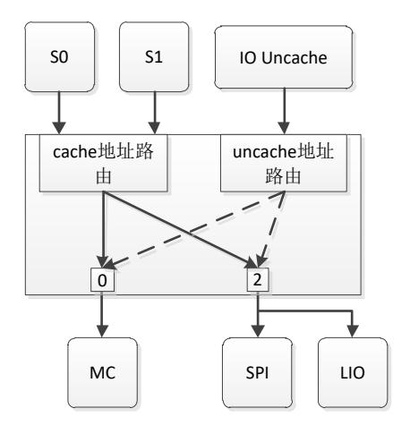

<span id="page-83-2"></span>图 6-1 二级交叉开关地址路由示意图


地址窗口是供 SCACHE0、SCACHE1 和 IO DMA 三个具有主功能的 IP 进行路由选择和 地址转换而设置的。CPU 和 IO DMA 的访问都拥有 8 个地址窗口,可以完成目标地址空间 的选择以及从源地址空间到目标地址空间的转换。每个地址窗口由 BASE、MASK 和 MMAP 三个 64 位寄存器组成,BASE 以 K 字节对齐,MASK 采用类似网络掩码高位为 1 的格式,MMAP 的低三位是路由选择。

在二级交叉开关处,标号与所述模块的对应关系如下表所示。

<span id="page-84-0"></span>表 6-3 二级交叉开关处标号与所述模块的对应关系

| 标号 | 缺省值             |
|----|-----------------|
| 0  | DDR3 内存控制器      |
| 1  | 保留              |
| 2  | 启动模块(SPI 或 LIO) |
| 3  | 保留              |

MMAP[4]表示允许取指,MMAP[5]表示允许块读,MMAP[7]表示窗口使能。

<span id="page-84-1"></span>表 6-4 MMAP 字段对应的该空间访问属性

| [4]  | [5]  | [7]  |
|------|------|------|
| 允许取指 | 允许块读 | 窗口使能 |

二级交叉开关的地址配置具有地址转换的功能。不需要维护 CACHE 一致性。

窗口命中公式: (IN\_ADDR & MASK) == BASE

新地址换算公式: OUT\_ADDR = (IN\_ADDR & ~MASK) | {MMAP[63:10],10'h0} 地址窗口转换寄存器如下表。

<span id="page-84-2"></span>表 6-5 二级交叉开关地址窗口转换寄存器表

| 地址         | 寄存器           | R/W | 描述                   | 缺省值                   |
|------------|---------------|-----|----------------------|-----------------------|
| 0x1fe02000 | CPU_WIN0_BASE | RW  | cache通路二级窗口0的<br>基地址 | 0x1FC0_0000           |
| 0x1fe02008 | CPU_WIN1_BASE | RW  | cache通路二级窗口1的<br>基地址 | 0x1000_0000           |
| 0x1fe02010 | CPU_WIN2_BASE | RW  | cache通路二级窗口2的<br>基地址 | 0x0000_0000           |
| 0x1fe02018 | CPU_WIN3_BASE | RW  | cache通路二级窗口3的<br>基地址 | 0x1_0000_0000         |
| 0x1fe02020 | CPU_WIN4_BASE | RW  | cache通路二级窗口4的<br>基地址 | 0x0000_0000           |
| 0x1fe02028 | CPU_WIN5_BASE | RW  | cache通路二级窗口5的<br>基地址 | 0x0000_0000           |
| 0x1fe02030 | CPU_WIN6_BASE | RW  | cache通路二级窗口6的<br>基地址 | 0x0000_0000           |
| 0x1fe02038 | CPU_WIN7_BASE | RW  | cache通路二级窗口7的<br>基地址 | 0x0000_0000           |
| 0x1fe02040 | CPU_WIN0_MASK | RW  | cache通路二级窗口0的<br>掩码  | 0xFFFF_FFFF_FFF0_0000 |
| 0x1fe02048 | CPU_WIN1_MASK | RW  | cache通路二级窗口1的<br>掩码  | 0xFFFF_FFFF_F000_0000 |
| 0x1fe02050 | CPU_WIN2_MASK | RW  | cache通路二级窗口2的<br>掩码  | 0xFFFF_FFFF_F000_0000 |


| 地址         | 寄存器           | R/W | 描述                               | 缺省值                   |
|------------|---------------|-----|----------------------------------|-----------------------|
| 0x1fe02058 | CPU_WIN3_MASK | RW  | cache通路二级窗口3的<br>掩码              | 0xFFFF_FFFF_0000_0000 |
| 0x1fe02060 | CPU_WIN4_MASK | RW  | cache通路二级窗口4的<br>掩码              | 0x0000_0000           |
| 0x1fe02068 | CPU_WIN5_MASK | RW  | cache通路二级窗口5的<br>掩码              | 0x0000_0000           |
| 0x1fe02070 | CPU_WIN6_MASK | RW  | cache通路二级窗口6的<br>掩码              | 0x0000_0000           |
| 0x1fe02078 | CPU_WIN7_MASK | RW  | cache通路二级窗口7的<br>掩码              | 0x0000_0000           |
| 0x1fe02080 | CPU_WIN0_MMAP | RW  | cache通路二级窗口0的<br>新基地址            | 0x1FC0_00F2           |
| 0x1fe02088 | CPU_WIN1_MMAP | RW  | cache通路二级窗口1的<br>新基地址            | 0x1000_0082           |
| 0x1fe02090 | CPU_WIN2_MMAP | RW  | cache通路二级窗口2的<br>新基地址            | 0x0000_00F0           |
| 0x1fe02098 | CPU_WIN3_MMAP | RW  | cache通路二级窗口3的<br>新基地址            | 0x0000_00F0           |
| 0x1fe020a0 | CPU_WIN4_MMAP | RW  | cache通路二级窗口4的<br>新基地址            | 0x0000_0000           |
| 0x1fe020a8 | CPU_WIN5_MMAP | RW  | cache通路二级窗口5的<br>新基地址            | 0x0000_0000           |
| 0x1fe020b0 | CPU_WIN6_MMAP | RW  | cache通路二级窗口6的<br>新基地址            | 0x0000_0000           |
| 0x1fe020b8 | CPU_WIN7_MMAP | RW  | cache通路二级窗口7的<br>新基地址            | 0x0000_0000           |
| 0x1fe02100 | PCI_WIN0_BASE | RW  | uncache 通路二级窗口 0                 | 0x0000_0000           |
| 0x1fe02108 | PCI_WIN1_BASE | RW  | 的基地址<br>uncache 通路二级窗口 1         | 0x0000_0000           |
| 0x1fe02110 | PCI_WIN2_BASE | RW  | 的基地址<br>uncache 通路二级窗口 2         | 0x0000_0000           |
| 0x1fe02118 | PCI_WIN3_BASE | RW  | 的基地址<br>uncache 通路二级窗口 3         | 0x0000_0000           |
| 0x1fe02120 | PCI_WIN4_BASE | RW  | 的基地址<br>uncache 通路二级窗口 4         | 0x0000_0000           |
| 0x1fe02128 | PCI_WIN5_BASE | RW  | 的基地址<br>uncache 通路二级窗口 5<br>的基地址 | 0x0000_0000           |
| 0x1fe02130 | PCI_WIN6_BASE | RW  | uncache 通路二级窗口 6<br>的基地址         | 0x0000_0000           |
| 0x1fe02138 | PCI_WIN7_BASE | RW  | uncache 通路二级窗口 7<br>的基地址         | 0x0000_0000           |
| 0x1fe02140 | PCI_WIN0_MASK | RW  | uncache 通路二级窗口 0<br>的掩码          | 0xFFFF_FFFF_F000_0000 |
| 0x1fe02148 | PCI_WIN1_MASK | RW  | uncache 通路二级窗口 1<br>的掩码          | 0x0000_0000           |
| 0x1fe02150 | PCI_WIN2_MASK | RW  | uncache 通路二级窗口 2<br>的掩码          | 0x0000_0000           |
| 0x1fe02158 | PCI_WIN3_MASK | RW  | uncache 通路二级窗口 3<br>的掩码          | 0x0000_0000           |
| 0x1fe02160 | PCI_WIN4_MASK | RW  | uncache 通路二级窗口 4<br>的掩码          | 0x0000_0000           |
| 0x1fe02168 | PCI_WIN5_MASK | RW  | uncache 通路二级窗口 5<br>的掩码          | 0x0000_0000           |
| 0x1fe02170 | PCI_WIN6_MASK | RW  | uncache 通路二级窗口 6                 | 0x0000_0000           |


| 地址         | 寄存器           | R/W | 描述                        | 缺省值         |
|------------|---------------|-----|---------------------------|-------------|
|            |               |     | 的掩码                       |             |
| 0x1fe02178 | PCI_WIN7_MASK | RW  | uncache 通路二级窗口 7<br>的掩码   | 0x0000_0000 |
| 0x1fe02180 | PCI_WIN0_MMAP | RW  | uncache 通路二级窗口 0<br>的新基地址 | 0x0000_00F0 |
| 0x1fe02188 | PCI_WIN1_MMAP | RW  | uncache 通路二级窗口 1<br>的新基地址 | 0x0000_0000 |
| 0x1fe02190 | PCI_WIN2_MMAP | RW  | uncache 通路二级窗口 2<br>的新基地址 | 0x0000_0000 |
| 0x1fe02198 | PCI_WIN3_MMAP | RW  | uncache 通路二级窗口 3<br>的新基地址 | 0x0000_0000 |
| 0x1fe021a0 | PCI_WIN4_MMAP | RW  | uncache 通路二级窗口 4<br>的新基地址 | 0x0000_0000 |
| 0x1fe021a8 | PCI_WIN5_MMAP | RW  | uncache 通路二级窗口 5<br>的新基地址 | 0x0000_0000 |
| 0x1fe021b0 | PCI_WIN6_MMAP | RW  | uncache 通路二级窗口 6<br>的新基地址 | 0x0000_0000 |
| 0x1fe021b8 | PCI_WIN7_MMAP | RW  | uncache 通路二级窗口 7<br>的新基地址 | 0x0000_0000 |

根据缺省的寄存器配置,芯片启动后,CPU 的 0x1C00\_0000-0x1C0F\_FFFF 的地址区间 (1M)映射到 BOOT 设备(SPI 或 LIO)存储空间的 0x00000000-0x000F\_FFFF 区间,CPU 的 0x10000000 - 0x1FFFFFFF 区间(256M)映射到 BOOT 设备的 0x10000000 - 0x1FFFFFFF 区间,CPU 的 0x00000000 - 0x0FFFFFFF 的地址区间(256M)映射到 DDR3 的 0x00000000 - 0x0FFFFFFF 的地址区间,CPU 的 0x100000000 - 0x1FFFFFFFF 的地址区间(4G)映射到 DDR3 的 0x00000000 - 0xFFFFFFFF 的地址区间。软件可以通过修改相应的配置寄存器实现 新的地址空间路由和转换。

此外,当出现 8 个地址窗口都不命中时,由内存控制器模块返回数据。

## <span id="page-86-0"></span>**6.3 IO** 互连网络

2K1000 中的 IO 互连网络结构图如图 [6-2](#page-87-3) 所示。为了便于说明,这里把 IO 设备分成 PCIE 设备(包括 PCIE0 与 PCIE1)和其他 IO 设备(除 PCIE 之外的所有其他设备)两部分。

- IO 互连网络主要由以下两部分通路组成:
- 1. CPU 访问 IO 设备的通路,其地址路由形式主要包括:
  - ⚫配置访问:CPU 通过配置请求访问 IO 设备的配置头,其地址组织形式在 [6.3.1](#page-87-0) 节 有介绍;
  - ⚫IO 访问:IO 访问用于访问 PCIE 控制器下游设备的 IO 地址空间,根据 PCIE 配置 头的 IO Base 和 IO Limit 配置决定地址路由方式;
  - ⚫内部寄存器访问:通过各个 IO 设备配置头的 BAR 地址访问 IO 设备的内部配置寄 存器,MEM 访问类型。
  - 69 ⚫PCIE 下游设备 MEM 访问:根据 PCIE 配置头的 Memory Base 和 Memory Limit、 Prefetchable Memory Base 和 Prefetchable Memory Limit 进行地址路由,用于访问


PCIE 下游设备的 MEM 空间。

2. IO DMA 访问内存的通路,包括 CACHE 访问和 UNCACHE 访问。该部分地址路由方式在 6.4 节介绍。

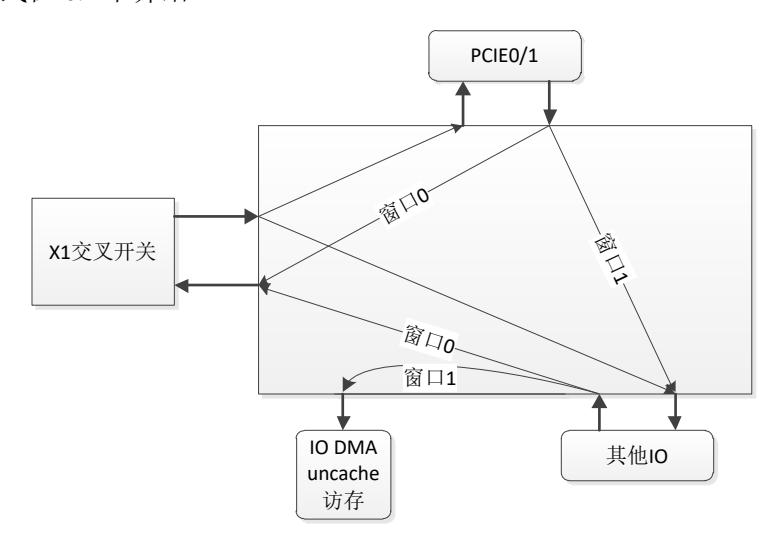

<span id="page-87-1"></span>图 6-2IO 互连结构图

#### <span id="page-87-3"></span><span id="page-87-0"></span>6.3.1 IO 设备的配置空间

这里需要先区分配置头空间和设备寄存器空间两个概念。配置头空间指的是每个 IO 设备的配置头所在的地址空间,而设备寄存器空间指的是配置头中的 BAR 所指定的设备配置寄存器的地址空间。访问 I/O 设备的设备寄存器空间需要先读取其配置头空间中的 BAR 地址作为其配置空间的起始地址,然后再对相应设备寄存器进行读写。

首先介绍 64 位模式下访问配置头空间的地址格式,龙芯 2K1000 中定义地址段 0xFE\_0000\_0000 – 0xFE\_1FFF\_FFFF 是 CPU 的 64 位配置地址空间,CPU 通过这段地址访问各个设备的 PCI 配置头。由地址的[63:28]决定配置头类型(0xFE0 是 Type0,0xFE1 是 Type1,其他保留);[23:16]在 Type1 类型配置头访问时表示总线号(Bus Number),Type0时保留;[15:11]表示设备号(Device Number);[10:8]表示功能号(Function Number);[27:24]和[7:0]组合起来表示偏移(offset),大小为 4K。下图是 CPU 访问 PCI 配置头空间的 64 位地址格式。

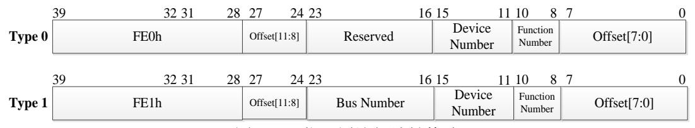

<span id="page-87-2"></span>图 6-364 位配置访问地址格式

为了保证系统的兼容性,还提供了 32 位地址模式下的配置地址格式,如下图所示。该模式下,地址偏移只有 8 位(即 256B)。其中,地址的[31:24]决定配置头类型(0x1A 是 Type0,0x1B 是 Type1); [23:16]在 Type1 类型配置头访问时表示总线号(Bus Number),


Type0 时保留;[15:11]表示设备号(Device Number);[10:8]表示功能号(Function Number); [7:0]表示偏移(offset),大小为 256B。

|        | 31  | 24 23 |            | 16 15 | 11 10            | 8                   | 7<br>0 |
|--------|-----|-------|------------|-------|------------------|---------------------|--------|
| Type 0 | 1Ah |       | Reserved   |       | Device<br>Number | Function N<br>umber | Offset |
|        | 31  | 24 23 |            | 16 15 |                  | 11 10<br>8          | 0<br>7 |
| Type 1 | 1Bh |       | Bus Number |       | Device<br>Number | Function N<br>umber | Offset |

<span id="page-88-0"></span>图 6-432 位配置访问地址格式

龙芯 2K1000 芯片中,具备配置头空间的设备包括:APB 总线控制器、GMAC0/1 控制 器、USB 控制器、GPU 控制器、DC 控制器、HDA 控制器、SATA 控制器、PCIE0/1 控制器 和 DMA 控制器。其中所有 APB 设备都作为一个整体挂在 APB 总线控制器上,由地址的 [15:12]位进行译码,下文中将会做详细说明。各个设备的设备号、功能号以及配置头访问 首地址如下表所示(该表只包括各个控制器本身的配置空间,不关注 PCIE 控制器的 Type1 访问等)。除了 PCIE 控制器之外,其他设备的配置头空间大小都只有 256B。

<span id="page-88-1"></span>表 6-6 各个设备的配置头访问对应关系

| 设备          | 总线号 | 设备号 | 功能号 | 配置空<br>间掩码 | 配置头访问首地址(64<br>位模式) | 备注                                        |  |
|-------------|-----|-----|-----|------------|---------------------|-------------------------------------------|--|
| APB         | 0x0 | 0x2 | 0x0 | 0xffff     | 0xFE_0000_1000      | -                                         |  |
| GMAC0       | 0x0 | 0x3 | 0x0 | 0x7fff     | 0xFE_0000_1800      | GMAC 设备有 2 个功能,<br>Func 0 是 GMAC0         |  |
| GMAC1       | 0x0 | 0x3 | 0x1 | 0x7fff     | 0xFE_0000_1900      | GMAC 设备有 2 个功能,<br>Func 1 是 GMAC1         |  |
| USB-OTG     | 0x0 | 0x4 | 0x0 | 0xffff     | 0xFE_0000_2000      | USB 设备共 3 个功能:<br>Func 0 是 OTG            |  |
| USB-EHCI    | 0x0 | 0x4 | 0x1 | 0x7fff     | 0xFE_0000_2100      | USB 设备共 3 个功能:<br>Func 1 是 EHCI           |  |
| USB-OHCI    | 0x0 | 0x4 | 0x2 | 0x7fff     | 0xFE_0000_2200      | USB 设备共 3 个功能:<br>Func 2 是 OHCI           |  |
| GPU         | 0x0 | 0x5 | 0x0 | 0x3ffff    | 0xFE_0000_2800      | -                                         |  |
| DC          | 0x0 | 0x6 | 0x0 | 0xffff     | 0xFE_0000_3000      | -                                         |  |
| HDA         | 0x0 | 0x7 | 0x0 | 0xffff     | 0xFE_0000_3800      | -                                         |  |
| SATA        | 0x0 | 0x8 | 0x0 | 0xffff     | 0xFE_0000_4000      | -                                         |  |
| PCIE0-Port0 | 0x0 | 0x9 | 0x0 | 0xfff      | 0xFE_0000_4800      |                                           |  |
| PCIE0-Port1 | 0x0 | 0xa | 0x0 | 0xfff      | 0xFE_0000_5000      | Func 1 和 Type1 的访问没<br>有在此表中说明。           |  |
| PCIE0-Port2 | 0x0 | 0xb | 0x0 | 0xfff      | 0xFE_0000_5800      | 当PCIE0控制器为X4模式<br>时,只能访问设备号为              |  |
| PCIE0-Port3 | 0x0 | 0xc | 0x0 | 0xfff      | 0xFE_0000_6000      | 0x9 的控制器。                                 |  |
| PCIE1-Port0 | 0x0 | 0xd | 0x0 | 0xfff      | 0xFE_0000_6800      | Func 1 和 Type1 的访问没<br>有在此表中说明。           |  |
| PCIE1-Port1 | 0x0 | 0xe | 0x0 | 0xfff      | 0xFE_0000_7000      | 当PCIE1控制器为X4模式<br>时,只能访问设备号为<br>0xd 的控制器。 |  |
| DMA         | 0x0 | 0xf | 0x0 | 0xff       | 0xFE_0000_7800      | -                                         |  |


| 设备  | 总线号   | 设备号  | 功能号 | 配置空<br>间掩码 | 配置头访问首地址(64<br>位模式) | 备注                                |
|-----|-------|------|-----|------------|---------------------|-----------------------------------|
| N/A | 无效的配置 | 是头访问 |     |            |                     | Vendor ID 为 16'hFFFF,<br>表示没有有效设备 |

除 PCIE 外,所有的配置头空间都遵循 PCI Type0 类型的格式,如下表所示,但是每个设备的缺省值不尽相同,后文中将展开介绍。

<span id="page-89-0"></span>表 6-7 Type0 类型配置头

| 31 24                         | 23 16               | 15 8           | 7 0             | ADDR |  |  |  |
|-------------------------------|---------------------|----------------|-----------------|------|--|--|--|
| Devic                         | Device ID Vendor ID |                |                 |      |  |  |  |
| Sta                           | tus                 | Comn           | nand            | 04h  |  |  |  |
|                               | Class Code          |                | Revison ID      | 08h  |  |  |  |
| BIST                          | Header Type         | Lantency Timer | Cache Line Size | 0Ch  |  |  |  |
|                               | Base A              | ddress 0       |                 | 10h  |  |  |  |
|                               | Base A              | ddress 1       |                 | 14h  |  |  |  |
|                               | Base A              | ddress 2       |                 | 18h  |  |  |  |
| Base Address 3                |                     |                |                 |      |  |  |  |
|                               | Base A              | ddress 4       |                 | 20h  |  |  |  |
|                               | Base A              | ddress 5       |                 | 24h  |  |  |  |
|                               | CardBus (           | CIS Pointer    |                 | 28h  |  |  |  |
| Subsys                        | tem ID              | Subsystem      | Vendor ID       | 2Ch  |  |  |  |
|                               | Expension RO        | M Base Address |                 | 30h  |  |  |  |
| Reserved Capabilities Pointer |                     |                |                 |      |  |  |  |
|                               | Reserved            |                |                 |      |  |  |  |
| Max_Lat                       | Min_Gnt             | Interrupt Pin  | Interrupt Line  | 3Ch  |  |  |  |

<span id="page-89-1"></span>表 6-8 Type0 的配置头寄存器

| 寄存器名称                 | 偏移地址 | 读/写 | 功能描述                            | 说明<br>(除 PCIE 控制器) |
|-----------------------|------|-----|---------------------------------|--------------------|
| Vendor ID<br>制造商 ID 号 | 0x0  | RO  | 制造商 ID 号                        | 缺省值都为 0x0014       |
| Device ID<br>设备 ID 号  | 0x2  | RO  | 设备 ID 号                         |                    |
| Command<br>命令寄存器      | 0x4  | RW  | Bit0: I/O 访问使能<br>Bit1: 存储器访问使能 | 扫描配置地址后,需要使能相应设备的存 |


| 寄存器名称                          | 偏移地址 | 读/写   | 功能描述                                                                                                                                                                                                               | 说明<br>(除 PCIE 控制器) |
|--------------------------------|------|-------|--------------------------------------------------------------------------------------------------------------------------------------------------------------------------------------------------------------------|--------------------|
|                                |      |       | Bit2: 主设备使能 Bit3: 专用周期监视 Bit4: 存储器写与使失效使 能 Bit5: VGA 画板侦测 Bit6: 奇偶校验错响应 Bit7: 等待周期控制 Bit8: SERR#使能 Bit9: 快速背靠背使能 其它: 保留                                                                                            | 储器访问使能             |
| Status<br>状态寄存器<br>Revision ID | 0x6  | RO/RW | Bit3-0: RO, 保留 Bit4: RO, 能力列表 Bit5: RO, 66MHz 能力 Bit6: 保留 Bit7: RO, 快速背靠背能力 Bit8: RW, 主设备数据奇偶校验错 Bit10-9: RO, 设备选择定时 Bit11: RW, 发出目标失败信号 Bit12: RW, 收到目标失败 Bit13: RW, 收到主设备失败 Bit14: RW, 发出系统错信号 Bit15: RW, 检测到奇偶错 |                    |
| 版本索引                           | 0x8  | RO    | 设备版本号                                                                                                                                                                                                              | 缺省值都为 0x0          |
| Class Code<br>类代码              | 0x9  | RO    | Bit7-0: Prog.I/F 编程接口<br>Bit15-8: Subclass code,子<br>类码<br>Bit23-16: Class code 类别码                                                                                                                                |                    |
| Cache Line Size<br>缓存行大小       | 0xC  | RO    | 龙芯 2K1000 的缓存行大小为<br>64Byte                                                                                                                                                                                        | 缺省值都为 0x10         |
| Latency Timer<br>等待计时器         | 0xD  | RW    |                                                                                                                                                                                                                    | 保留                 |
| Header Type<br>配置头类型           | 0xE  | RO    | 除 PCIE 控制器外,都是<br>Type0。<br>另外 bit7 表示多功能属性:<br>1-多功能设备<br>0-单功能设备                                                                                                                                                 |                    |
| BIST<br>内自建测试                  | 0xF  | RW    | Bit3-0: 完成代码, 0-成功完成, 非 0-设备指定的错误<br>Bit5-4: 保留<br>Bit6: 起动 BIST<br>Bit7: BIST 能力, 1-提供<br>BIST 功能, 0-不提供                                                                                                          | 保留                 |


| 寄存器名称                                    | 偏移地址 | 读/写   | 功能描述                                                                                                                                                                                                                         | 说明<br>(除 PCIE 控制器) |
|------------------------------------------|------|-------|------------------------------------------------------------------------------------------------------------------------------------------------------------------------------------------------------------------------------|--------------------|
| Base Address Register 0<br>0 号基址寄存器      | 0x10 | RW/RO | 基地址寄存器 0-<br>Bit0:RO,1-I/O 基地址寄存<br>器,0-MEM 基地址寄存器<br>I/O 基地址寄存器:<br>Bit1:保留<br>Bit31-2:RO,基地址单<br>元<br>Bit63-32:保留<br>MEM 基地址存储器:<br>Bit2-1:RO,MEM 基地<br>址寄存器-译码器宽度单元,<br>00-32 位,10-64 位<br>Bit3:RO,预提取属性<br>Bit64-4:基地址单元 | 只支持 64 位模式         |
| Base Address Register 1<br>1 号基址寄存器      | 0x18 | RW    | 基址寄存器 1                                                                                                                                                                                                                      | 只支持 64 位模式         |
| Base Address Register 2<br>2 号基址寄存器      | 0x20 | RW    | 基址寄存器 2                                                                                                                                                                                                                      | 只支持 64 位模式         |
| Cardbus CIS Pointer<br>CIS 卡总线指针         | 0x28 | RW    | CIS 卡总线指针                                                                                                                                                                                                                    | 保留                 |
| Subsystem Vendor ID<br>子系统版本号            | 0x2C | RO    | 子系统供应商 ID 号                                                                                                                                                                                                                  | 保留                 |
| Subsystem ID<br>子系统版本号                   | 0x2D | RO    | 子系统版本 ID 号                                                                                                                                                                                                                   | 保留                 |
| Expansion ROM Base Address<br>扩展 ROM 基地址 | 0x30 | RW    | 扩展 ROM 基地址寄存器<br>Bit0:地址译码使能<br>Bit10-1:保留<br>Bit31-11:用于指定 ROM 的<br>起始地址                                                                                                                                                    | 保留                 |
| Capabilities Pointer<br>扩展能力指针           | 0x34 | RW    | 扩展指针                                                                                                                                                                                                                         | 保留                 |
| Reserved                                 | 0x35 |       |                                                                                                                                                                                                                              | 保留                 |
| Reserved                                 | 0x38 |       |                                                                                                                                                                                                                              | 保留                 |
| Interrupt Line<br>中断线寄存器                 | 0x3C | RW    | 中断线寄存器                                                                                                                                                                                                                       |                    |
| Interrupt Pin<br>中断引脚寄存器                 | 0x3D | RO    | 中断引脚寄存器                                                                                                                                                                                                                      | 保留(除 PCIE 控制器)     |
| Min Gnt<br>最小突发期时间                       | 0x3E | RW    |                                                                                                                                                                                                                              | 保留(除 PCIE 控制器)     |
| Max Lat<br>获取 PCI 总线最大时间                 | 0x3F | RW    |                                                                                                                                                                                                                              | 保留(除 PCIE 控制器)     |

PCIE 控制器的配置头为 Type1 类型,具体如下:

#### <span id="page-91-0"></span>表 6-9 Type1 类型配置头

| 31        | 24 | 23 | 16 | 15        | 8 | 7 | 0   | ADDR |
|-----------|----|----|----|-----------|---|---|-----|------|
| Device ID |    |    |    | Vendor ID |   |   | 00h |      |
| Status    |    |    |    | Command   |   |   |     |      |


|                                 | Class Code                                 |                                | Revison ID           | 08h |  |  |  |
|---------------------------------|--------------------------------------------|--------------------------------|----------------------|-----|--|--|--|
| BIST                            | Header Type                                | Lantency Timer                 | Cache Line Size      | 0Ch |  |  |  |
|                                 | Base Address 0                             |                                |                      |     |  |  |  |
|                                 | Base Address 1                             |                                |                      | 14h |  |  |  |
| Secondary Lantency<br>Timer     | Subordinate Bus #                          | Secondary Bus #                | Primary Bus #        | 18h |  |  |  |
| Secondary Status                |                                            | IO Limit                       | IO Base              | 1Ch |  |  |  |
| (Non-Prefetchable) Memory Limit |                                            | (Non-Prefetchable) Memory Base | 20h                  |     |  |  |  |
| PrefetchableMemory Limit        |                                            | PrefetchableMemory Base        | 24h                  |     |  |  |  |
|                                 | Prefetchable Memory Base<br>Upper 32 Bits  |                                |                      | 28h |  |  |  |
|                                 | Prefetchable Memory Limit<br>Upper 32 Bits |                                |                      | 2Ch |  |  |  |
| IO Limit<br>Upper 16 Bits       |                                            | IO Base<br>Upper 16 Bits       |                      | 30h |  |  |  |
|                                 | Reserved                                   |                                | Capabilities Pointer | 34h |  |  |  |
|                                 | Expansion ROM Base Address                 |                                |                      |     |  |  |  |
| Bridge Control                  |                                            | Interrupt Pin                  | Interrupt Line       | 3Ch |  |  |  |

#### <span id="page-92-0"></span>表 6-10 Type1 的配置头寄存器

| 寄存器名称                 | 偏移地址 | 读/写   | 功能描述                                                                                                                                                                       | 说明<br>(PCIE 控制器)                 |
|-----------------------|------|-------|----------------------------------------------------------------------------------------------------------------------------------------------------------------------------|----------------------------------|
| Vendor ID<br>制造商 ID 号 | 0x0  | RO    | 制造商 ID 号                                                                                                                                                                   | 缺省值都为 0x0014                     |
| Device ID<br>设备 ID 号  | 0x2  | RO    | 设备 ID 号                                                                                                                                                                    |                                  |
| Command<br>命令寄存器      | 0x4  | RW    | Bit0:I/O 访问使能<br>Bit1:存储器访问使能<br>Bit2:主设备使能<br>Bit3:专用周期监视<br>Bit4:存储器写与使失效使<br>能<br>Bit5:VGA 画板侦测<br>Bit6:奇偶校验错响应<br>Bit7:等待周期控制<br>Bit8:SERR#使能<br>Bit9:快速背靠背使能<br>其它:保留 | 扫描配置地址后,需<br>要使能相应设备的存<br>储器访问使能 |
| Status<br>状态寄存器       | 0x6  | RO/RW | Bit3-0:RO,保留<br>Bit4:RO,能力列表<br>Bit5:RO,66MHz 能力<br>Bit6:保留<br>Bit7:RO,快速背靠背能力<br>Bit8:RW,主设备数据奇偶<br>校验错<br>Bit10-9:RO,设备选择定时                                              |                                  |


| 寄存器名称                    | 偏移地址 | 读/写   | 功能描述                                                                                                                                                                                                                         | 说明<br>(PCIE 控制器) |
|--------------------------|------|-------|------------------------------------------------------------------------------------------------------------------------------------------------------------------------------------------------------------------------------|------------------|
|                          |      |       | Bit11:RW,发出目标失败<br>信号<br>Bit12:RW,收到目标失败<br>Bit13:RW,收到主设备失<br>败<br>Bit14:RW,发出系统错信<br>号<br>Bit15: RW,检测到奇偶错                                                                                                                 |                  |
| Revision ID<br>版本索引      | 0x8  | RO    | 设备版本号                                                                                                                                                                                                                        | 缺省值都为 0x0        |
| Class Code<br>类代码        | 0x9  | RO    | Bit7-0:Prog.I/F 编程接口<br>Bit15-8:Subclass code,子<br>类码<br>Bit23-16:Class code 类别码                                                                                                                                             | 缺省值为 0x0b3000    |
| Cache Line Size<br>缓存行大小 | 0xC  | RO    | 缓存行大小                                                                                                                                                                                                                        | 缺省值都为 0x00       |
| Latency Timer<br>等待计时器   | 0xD  | RW    |                                                                                                                                                                                                                              | 保留               |
| Header Type<br>配置头类型     | 0xE  | RO    | PCIE 控制器都是 Type1                                                                                                                                                                                                             | 缺省值为 0x01        |
| BIST<br>内自建测试            | 0xF  | RW    | Bit3-0:完成代码,0-成功完<br>成,非 0-设备指定的错误<br>Bit5-4:保留<br>Bit6:起动 BIST<br>Bit7 : BIST<br>能力, 1- 提 供<br>BIST 功能,0-不提供                                                                                                                | 保留               |
| Base Address Register 0  | 0x10 | RW/RO | 基地址寄存器 0-<br>Bit0:RO,1-I/O 基地址寄存<br>器,0-MEM 基地址寄存器<br>I/O 基地址寄存器:<br>Bit1:保留<br>Bit31-2:RO,基地址单<br>元<br>Bit63-32:保留<br>MEM 基地址存储器:<br>Bit2-1:RO,MEM 基地<br>址寄存器-译码器宽度单元,<br>00-32 位,10-64 位<br>Bit3:RO,预提取属性<br>Bit64-4:基地址单元 | 64 位 MEM 空间      |
| Primary Bus #            | 0x18 | RW    | Primary Bus 编号                                                                                                                                                                                                               | 默认为 0            |
| Secondary Bus #          | 0x19 | RW    | Secondary Bus 编号                                                                                                                                                                                                             | 默认为 0            |
| Subordinate Bus #        | 0x1A | RW    | Subordinate Bus 编号                                                                                                                                                                                                           | 默认为 0            |
| IO Base                  | 0x1C | RW/RO | [3:0] RO,0h-16bit,1h-32bit<br>[7:4] RW                                                                                                                                                                                       | 默认为 0x1          |
| IO Limit                 | 0X1D | RW/R0 | [3:0] RO,0h-16bit,1h-32bit<br>[7:4] RW                                                                                                                                                                                       | 默认为 0x1          |


| 寄存器名称                                     | 偏移地址 | 读/写   | 功能描述                                                                                                                                                                                                                                                                                                                                            | 说明<br>(PCIE 控制器) |
|-------------------------------------------|------|-------|-------------------------------------------------------------------------------------------------------------------------------------------------------------------------------------------------------------------------------------------------------------------------------------------------------------------------------------------------|------------------|
| Secondary Lantency Timer                  | 0x1E | RO    | Secondary Bus 状态寄存器                                                                                                                                                                                                                                                                                                                             | 默认为0             |
| (Non-Prefetchable) Memory<br>Base         | 0x20 | RW/R0 | [3:0] RO, must be 0<br>[15:4] RW                                                                                                                                                                                                                                                                                                                | 默认为 0x0          |
| (Non-Prefetchable) Memory<br>Limit        | 0x22 | RW/R0 | [3:0] RO, must be 0<br>[15:4] RW                                                                                                                                                                                                                                                                                                                | 默认为 0x0          |
| Prefetchable Memory Base                  | 0x24 | RW/R0 | [3:0] RO, 0h-32bit, 1h-64bit<br>[15:4] RW                                                                                                                                                                                                                                                                                                       | 默认为 0x1          |
| Prefetchable Memory Limit                 | 0x26 | RW/R0 | [3:0] RO, 0h-32bit, 1h-64bit<br>[15:4] RW                                                                                                                                                                                                                                                                                                       | 默认为 0x1          |
| Prefetchable Memory Base<br>Upper 32bits  | 0x28 | RW    | 可预取 MEM 地址空间高 32 位                                                                                                                                                                                                                                                                                                                              | 默认为0             |
| Prefetchable Memory Limit<br>Upper 32bits | 0x2C | RW    | 可预取 MEM 地址空间高 32<br>位                                                                                                                                                                                                                                                                                                                           | 默认为0             |
| IO Base Upper 16 Bits                     | 0x30 | RW    | IO 地址 Base 高 16 位                                                                                                                                                                                                                                                                                                                               | 默认为0             |
| IO Limit Upper 16 Bits                    | 0x32 | RW    | IO 地址 Limit 高 16 位                                                                                                                                                                                                                                                                                                                              | 默认为0             |
| Capabilities Pointer<br>扩展能力指针            | 0x34 | RW    | 扩展指针                                                                                                                                                                                                                                                                                                                                            | 默认为 0x40         |
| Expansion ROM Base Address<br>扩展 ROM 基地址  | 0x38 | RW    | 扩展 ROM 基地址寄存器<br>Bit0: 地址译码使能<br>Bit10-1: 保留<br>Bit31-11: 用于指定 ROM 的<br>起始地址                                                                                                                                                                                                                                                                    | 保留               |
| Interrupt Line<br>中断线寄存器                  | 0x3C | RW    | 中断线寄存器                                                                                                                                                                                                                                                                                                                                          | 默认为 0xFF         |
| Interrupt Pin<br>中断引脚寄存器                  | 0x3D | RO    | 中断引脚寄存器                                                                                                                                                                                                                                                                                                                                         | 默认为 0x0          |
| Bridge Control                            | 0x3E | RW/RO | 0(RW): Parity Error Response Enable 1(RW): SERR# Enable 2(RW): ISA Enable 3(RW): VGA Enable 4(RW): VGA 16bit Decode 5(RW): Master-Abort Mode 6(RW) Secondary Bus Reset 7(RW): Fast Back-to-Back Enable 8(RO): Primary Discard Timer 9: Secondary Discard Timer 10(RW1C): Discard Timer Status 11(RW): Discard Timer SERR# Enable 15:12 Reserved | 默认为 0            |

#### <span id="page-94-0"></span>**6.3.2** APB 配置头

APB 总线控制器下挂载多个 APB 设备。该总线控制器作为一个设备具有相应的配置头空间。其配置头访问的基址为 0xFE\_0000\_1000。

<span id="page-94-1"></span>表 6-11 APB 总线控制器的配置头缺省值

| 31 | 24   | 23   | 16 | 15 | 8        | 7 | 0    | ADDR |
|----|------|------|----|----|----------|---|------|------|
|    | 16'h | 7a02 |    |    | 16'h0014 |   |      |      |
|    | 保    | :留   |    |    | 保留       |   | 3'h0 | 04h  |


| 8'h 08 | 8'h80 | 8'h0  | 保留    | 08h |  |  |
|--------|-------|-------|-------|-----|--|--|
| 保留     | 8'h0  | 保留    | 8'h10 | 0Ch |  |  |
|        | 24'h0 |       | 8'h4  | 10h |  |  |
|        |       | 32'h0 |       | 14h |  |  |
|        |       | 保留    |       | 18h |  |  |
|        |       | 保留    |       | 1Ch |  |  |
|        |       | 保留    |       | 20h |  |  |
|        |       | 保留    |       | 24h |  |  |
|        |       | 保留    |       | 28h |  |  |
|        |       | 保留    |       | 2Ch |  |  |
|        |       | 保留    |       | 30h |  |  |
|        |       | 保留    |       | 34h |  |  |
|        | 保留    |       |       |     |  |  |
|        | 保留    | 0xFF  | 3Ch   |     |  |  |

#### <span id="page-95-0"></span>**6.3.3** GMAC0/1 配置头

GMAC0 控制器和 GMAC1 控制器的配置头缺省值一致。其配置头访问的基址分别为 0xFE\_0000\_1800 和 0xFE\_0000\_1900。

<span id="page-95-2"></span>表 6-12 GMAC0 控制器的配置头缺省值

| 31    | 24 | 23       | 16 | 15    | 8    | 7        | 0   | ADDR |
|-------|----|----------|----|-------|------|----------|-----|------|
|       |    | 16'h7a03 |    |       |      | 16'h0014 |     | 00h  |
|       | 保留 |          | 保留 |       | 3'h0 | 04h      |     |      |
| 8'h02 |    | 8'h00    |    | 8'h00 |      | 保留       |     | 08h  |
| 保留    |    | 8'h0     |    | 保留    |      | 8'h10    |     | 0Ch  |
|       |    | 24'h0    |    |       |      | 8'h4     |     | 10h  |
|       |    |          |    | 32'h0 |      |          |     | 14h  |
|       | 保留 |          |    |       |      |          | 18h |      |
|       |    |          |    | 保留    |      |          |     | 1Ch  |
|       |    |          |    | 保留    |      |          |     | 20h  |
|       |    |          |    | 保留    |      |          |     | 24h  |
|       |    |          |    | 保留    |      |          |     | 28h  |
|       |    |          |    | 保留    |      |          |     | 2Ch  |
|       |    |          |    | 保留    |      |          |     | 30h  |
|       |    |          |    | 保留    |      |          |     | 34h  |
|       |    |          |    | 保留    |      |          |     | 38h  |
|       |    | 保留       |    |       |      | 0xFF     |     | 3Ch  |

#### <span id="page-95-1"></span>**6.3.4** USB OTG 配置头

该设备的配置头访问的基址为 0xFE\_0000\_2000。

<span id="page-95-3"></span>表 6-13 USB-OTG 控制器的配置头缺省值

| 31<br>24      | 23<br>16             | 15<br>8 | 7     | 0   | ADDR |
|---------------|----------------------|---------|-------|-----|------|
|               | 16'h7a04<br>16'h0014 |         |       | 00h |      |
|               | 保留                   | 保留      | 3'h0  |     |      |
| 8'h 0c        | 8'h03                | 8'h80   | 保留    |     | 08h  |
| 保留            | 8'h80                | 保留      | 8'h10 |     | 0Ch  |
| 24'h0<br>8'h4 |                      |         |       | 10h |      |
|               |                      | 32'h0   |       |     | 14h  |
|               |                      | 保留      |       |     | 18h  |
|               |                      | 保留      |       |     | 1Ch  |
|               | 保留                   |         |       |     |      |
|               |                      | 保留      |       |     | 24h  |
|               |                      | 保留      |       |     | 28h  |


| 保留 |      | 2Ch |
|----|------|-----|
| 保留 |      | 30h |
| 保留 |      | 34h |
| 保留 |      | 38h |
| 保留 | 0xFF | 3Ch |

#### <span id="page-96-0"></span>**6.3.5** USBEHCI 配置头

该设备的配置头访问的基址为 0xFE\_0000\_2100。

<span id="page-96-3"></span>表 6-14 USB-EHCI 控制器的配置头缺省值

| 31<br>24 | 23<br>16 | 15<br>8 | 7     | 0    | ADDR |
|----------|----------|---------|-------|------|------|
|          | 16'h7a14 |         |       |      | 00h  |
|          | 保留       | 保留      |       | 3'h0 | 04h  |
| 8'h 0c   | 8'h03    | 8'h20   | 保留    |      | 08h  |
| 保留       | 8'h80    | 保留      | 8'h10 |      | 0Ch  |
|          | 24'h0    |         | 8'h4  |      | 10h  |
|          |          | 32'h0   |       |      | 14h  |
|          | 保留       |         |       |      |      |
|          |          | 保留      |       |      | 1Ch  |
|          |          | 保留      |       |      | 20h  |
|          |          | 保留      |       |      | 24h  |
|          |          | 保留      |       |      | 28h  |
|          |          | 保留      |       |      | 2Ch  |
|          |          | 保留      |       |      | 30h  |
|          |          | 保留      |       |      | 34h  |
|          |          | 保留      |       |      | 38h  |
|          | 保留       |         | 0xFF  |      | 3Ch  |

#### <span id="page-96-1"></span>**6.3.6** USB OHCI 配置头

该设备的配置头访问的基址为 0xFE\_0000\_2200。

<span id="page-96-4"></span>表 6-15 USB-OHCI 控制器的配置头缺省值

| 31<br>24 | 23<br>16     | 15<br>8 | 7        | 0    | ADDR |  |  |
|----------|--------------|---------|----------|------|------|--|--|
|          | 16'h7a24     |         | 16'h0014 |      | 00h  |  |  |
|          | 保留           | 保留      |          | 3'h0 | 04h  |  |  |
| 8'h 0c   | 8'h03        | 8'h10   | 保留       |      | 08h  |  |  |
| 保留       | 8'h80        | 保留      | 8'h10    |      | 0Ch  |  |  |
|          | 24'h0        |         | 8'h4     |      | 10h  |  |  |
|          | 32'h0<br>14h |         |          |      |      |  |  |
|          | 保留           |         |          |      |      |  |  |
|          |              | 保留      |          |      | 1Ch  |  |  |
|          |              | 保留      |          |      | 20h  |  |  |
|          |              | 保留      |          |      | 24h  |  |  |
|          |              | 保留      |          |      | 28h  |  |  |
|          |              | 保留      |          |      | 2Ch  |  |  |
|          |              | 保留      |          |      | 30h  |  |  |
|          | 保留           |         |          |      |      |  |  |
|          | 保留           |         |          |      |      |  |  |
|          | 保留           |         | 0xFF     |      | 3Ch  |  |  |

#### <span id="page-96-2"></span>**6.3.7** GPU 配置头

该设备的配置头访问的基址为 0xFE\_0000\_2800。

<span id="page-97-2"></span>

表 6-16 GPU 控制器的配置头缺省值

| 31<br>24 | 23<br>16 | 15<br>8 | 7        | 0    | ADDR |
|----------|----------|---------|----------|------|------|
| 16'h7a05 |          |         | 16'h0014 |      | 00h  |
| 保留       |          | 保留      |          | 3'h0 | 04h  |
| 8'h 03   | 8'h02    | 8'h00   | 保留       |      | 08h  |
| 保留       | 8'h0     | 保留      | 8'h10    |      | 0Ch  |
|          | 24'h0    |         | 8'h4     |      | 10h  |
|          |          | 32'h0   |          |      | 14h  |
| 保留       |          |         |          |      | 18h  |
|          |          | 保留      |          |      | 1Ch  |
|          |          | 保留      |          |      | 20h  |
|          |          | 保留      |          |      | 24h  |
|          |          | 保留      |          |      | 28h  |
|          |          | 保留      |          |      | 2Ch  |
|          |          | 保留      |          |      | 30h  |
|          |          | 保留      |          |      | 34h  |
|          |          | 保留      |          |      | 38h  |
|          | 保留       |         | 0xFF     |      | 3Ch  |

#### <span id="page-97-0"></span>**6.3.8** DC 配置头

该设备的配置头访问的基址为 0xFE\_0000\_3000。

<span id="page-97-3"></span>表 6-17 DC 控制器的配置头缺省值

| 31<br>24 | 23<br>16 | 15<br>8 | 7        | 0    | ADDR |  |
|----------|----------|---------|----------|------|------|--|
| 16'h7a06 |          |         | 16'h0014 |      | 00h  |  |
| 保留       |          | 保留      |          | 3'h0 | 04h  |  |
| 8'h 03   | 8'h00    | 8'h00   | 保留       |      | 08h  |  |
| 保留       | 8'h0     | 保留      | 8'h10    |      | 0Ch  |  |
|          | 24'h0    |         | 8'h4     |      | 10h  |  |
|          |          | 32'h0   |          |      | 14h  |  |
|          | 保留       |         |          |      |      |  |
|          |          | 保留      |          |      | 1Ch  |  |
|          |          | 保留      |          |      | 20h  |  |
|          |          | 保留      |          |      | 24h  |  |
|          |          | 保留      |          |      | 28h  |  |
|          |          | 保留      |          |      | 2Ch  |  |
|          |          | 保留      |          |      | 30h  |  |
|          |          | 保留      |          |      | 34h  |  |
|          |          | 保留      |          |      | 38h  |  |
|          | 保留       |         | 0xFF     |      | 3Ch  |  |

#### <span id="page-97-1"></span>**6.3.9** HDA 配置头

该设备的配置头访问的基址为 0xFE\_0000\_3800。

<span id="page-97-4"></span>表 6-18 HDA 控制器的配置头缺省值

| 31<br>24 | 23<br>16 | 15<br>8    | 7        | 0   | ADDR |
|----------|----------|------------|----------|-----|------|
|          | 16'h7a07 |            | 16'h0014 |     |      |
|          | 保留       | 保留<br>3'h0 |          |     | 04h  |
| 8'h 04   | 8'h03    | 8'h00      | 保留       |     | 08h  |
| 保留       | 8'h0     | 保留         | 8'h10    | 0Ch |      |
|          | 24'h0    | 8'h4       |          |     | 10h  |
|          |          | 32'h0      |          |     | 14h  |
|          |          | 保留         |          |     | 18h  |
|          |          | 保留         |          |     | 1Ch  |


| 31 | 24 | 23 | 16 | 15 | 8 | 7 |      | 0 | ADDR |
|----|----|----|----|----|---|---|------|---|------|
|    |    |    |    | 保留 |   |   |      |   | 20h  |
|    |    |    |    | 保留 |   |   |      |   | 24h  |
|    |    |    |    | 保留 |   |   |      |   | 28h  |
|    |    |    |    | 保留 |   |   |      |   | 2Ch  |
|    |    |    |    | 保留 |   |   |      |   | 30h  |
|    |    |    |    | 保留 |   |   |      |   | 34h  |
|    |    |    |    | 保留 |   |   |      |   | 38h  |
|    |    |    | 保留 |    |   |   | 0xFF |   | 3Ch  |

#### <span id="page-98-0"></span>**6.3.10** SATA 配置头

该设备的配置头访问的基址为 0xFE\_0000\_4000。

<span id="page-98-2"></span>表 6-19 SATA 控制器的配置头缺省值

| 31     | 24    | 23       | 16 | 15    | 8  | 7        | 0    | ADDR |
|--------|-------|----------|----|-------|----|----------|------|------|
|        |       | 16'h7a08 |    |       |    | 16'h0014 |      | 00h  |
|        |       | 保留       |    |       | 保留 |          | 3'h0 | 04h  |
| 8'h 01 |       | 8'h06    |    | 8'h01 |    | 保留       |      | 08h  |
| 保留     |       | 8'h0     |    | 保留    |    | 8'h10    |      | 0Ch  |
|        |       | 24'h0    |    |       |    | 8'h4     |      | 10h  |
|        | 32'h0 |          |    |       |    |          |      | 14h  |
|        | 保留    |          |    |       |    |          |      | 18h  |
|        |       |          |    |       |    |          |      | 1Ch  |
|        |       |          |    | 保留    |    |          |      | 20h  |
|        |       |          |    | 保留    |    |          |      | 24h  |
|        |       |          |    | 保留    |    |          |      | 28h  |
|        |       |          |    | 保留    |    |          |      | 2Ch  |
|        |       |          |    | 保留    |    |          |      | 30h  |
|        |       |          |    | 保留    |    |          |      | 34h  |
|        |       |          |    | 保留    |    |          |      | 38h  |
|        |       | 保留       |    |       |    | 0xFF     |      | 3Ch  |

#### <span id="page-98-1"></span>**6.3.11** PCIE 配置头

龙芯 2K1000 中的两个 PCIE 共包含 6 个端口(Port),每个 Port 内都有一个 TYPE1 类 型的配置头。其中

PCIE0 Port0 的配置头基址为 0xFE\_0000\_4800;

PCIE0 Port1 的配置头基址为 0xFE\_0000\_5000;

PCIE0 Port2 的配置头基址为 0xFE\_0000\_5800;

PCIE0 Port3 的配置头基址为 0xFE\_0000\_6000;

PCIE1 Port0 的配置头基址为 0xFE\_0000\_6800;

PCIE1 Port1 的配置头基址为 0xFE\_0000\_7000;

下表列出 PCIE0 Port0 的配置头缺省值,其他 Port 与 Port0 相比仅有 Device ID 的差别, Port1/2/3 的 Device ID 都是 16'h7a09。同样的,PCIE1 port0 的 Device ID 为 16'h7a19,Port1 的 Device ID 为 16'h7a09。

<span id="page-98-3"></span>表 6-20PCIE0 Port0 的配置头缺省值


| 31<br>24 | 23<br>16   | 15<br>8        | 7<br>0   | ADDR |
|----------|------------|----------------|----------|------|
|          | 16'h7a19   | 16'h0014       | 00h      |      |
|          | 16'h0010   |                | 16'h0000 | 04h  |
|          | 24'h0b0300 |                | 8'h01    | 08h  |
| 8'h00    | 8'h01      | 8'h00<br>8'h00 |          | 0Ch  |
|          |            | 32'h4          |          | 10h  |
|          |            | 32'h0          |          | 14h  |
| 8'h00    | 8'h00      | 8'h00          | 8'h00    | 18h  |
|          | 16'h0      | 8'h01<br>8'h01 |          | 1Ch  |
|          | 16'h0      | 16'h0          | 20h      |      |
|          | 16'h0      |                | 16'h0    | 24h  |
|          |            | 32'h0          |          | 28h  |
|          |            | 32'h0          |          | 2Ch  |
|          | 32'h0      | 32'h0          | 30h      |      |
|          | Reserved   |                | 34h      |      |
|          |            | 32'h0          | 38h      |      |
|          | 16'h0      | 8'h01          | 0xFF     | 3Ch  |

#### <span id="page-99-0"></span>**6.3.12** DMA 配置头

该设备的配置头访问的基址为 0xFE\_0000\_7800。

<span id="page-99-2"></span>表 6-21 DMA 控制器的配置头缺省值

| 31<br>24 | 23<br>16     | 15<br>8 | 7        | 0    | ADDR |  |  |
|----------|--------------|---------|----------|------|------|--|--|
|          | 16'h7a0f     |         | 16'h0014 |      | 00h  |  |  |
|          | 保留           | 保留      |          | 3'h0 | 04h  |  |  |
| 8'h 08   | 8'h80        | 8'h00   | 保留       |      | 08h  |  |  |
| 保留       | 8'h0         | 保留      | 8'h10    |      | 0Ch  |  |  |
|          | 24'h0        | 8'h4    |          | 10h  |      |  |  |
|          | 32'h0<br>14h |         |          |      |      |  |  |
|          |              | 保留      |          |      | 18h  |  |  |
|          |              | 保留      |          |      | 1Ch  |  |  |
|          |              | 保留      |          |      | 20h  |  |  |
|          |              | 保留      |          |      | 24h  |  |  |
|          |              | 保留      |          |      | 28h  |  |  |
|          |              | 保留      |          |      | 2Ch  |  |  |
|          |              | 保留      |          |      | 30h  |  |  |
|          |              | 34h     |          |      |      |  |  |
|          | 保留           |         |          | 38h  |      |  |  |
|          | 保留           |         | 0xFF     |      | 3Ch  |  |  |

#### <span id="page-99-1"></span>**6.3.13** VPU 配置头

该设备的配置头访问的基址为 0xFE\_0000\_8000。

<span id="page-99-3"></span>表 6-22 VPU 解码器的配置头缺省值

| 31<br>24 | 23    | 16 | 15<br>8  | 7     | 0    | ADDR |
|----------|-------|----|----------|-------|------|------|
| 16'h7a16 |       |    | 16'h0014 |       |      | 00h  |
| 保留       |       |    | 保留       |       | 3'h0 | 04h  |
| 8'h 04   | 8'h80 |    | 8'h00    | 保留    |      | 08h  |
| 保留       | 8'h0  |    | 保留       | 8'h10 |      | 0Ch  |
|          | 24'h0 |    |          | 8'h4  |      | 10h  |
|          |       |    | 32'h0    |       |      | 14h  |
|          |       |    | 保留       |       |      | 18h  |


| 31 | 24 | 23<br>16 | 15 | 8 | 7<br>0 | ADDR |
|----|----|----------|----|---|--------|------|
|    |    |          | 保留 |   |        | 1Ch  |
|    |    |          | 保留 |   |        | 20h  |
|    |    |          | 保留 |   |        | 24h  |
|    |    |          | 保留 |   |        | 28h  |
|    |    |          | 保留 |   |        | 2Ch  |
|    |    |          | 保留 |   |        | 30h  |
|    |    |          | 保留 |   |        | 34h  |
|    |    |          | 保留 |   |        | 38h  |
|    |    | 保留       |    |   | 0xFF   | 3Ch  |

#### <span id="page-100-0"></span>**6.3.14** CAMERA 配置头

该设备的配置头访问的基址为 0xFE\_0000\_8800。

<span id="page-100-3"></span>表 6-23 CAMERA 控制器的配置头缺省值

| 31     | 24    | 23       | 16<br>15 | 8     | 7        | 0    | ADDR |
|--------|-------|----------|----------|-------|----------|------|------|
|        |       | 16'h7a26 |          |       | 16'h0014 |      | 00h  |
|        |       | 保留       |          | 保留    |          | 3'h0 | 04h  |
| 8'h 04 |       | 8'h80    |          | 8'h00 | 保留       |      | 08h  |
| 保留     |       | 8'h0     |          | 保留    | 8'h10    |      | 0Ch  |
|        |       | 24'h0    |          |       | 8'h4     |      | 10h  |
|        | 32'h0 |          |          |       |          |      | 14h  |
|        | 保留    |          |          |       |          |      | 18h  |
|        |       |          | 保留       |       |          |      | 1Ch  |
|        |       |          | 保留       |       |          |      | 20h  |
|        |       |          | 保留       |       |          |      | 24h  |
|        |       |          | 保留       |       |          |      | 28h  |
|        |       |          | 保留       |       |          |      | 2Ch  |
|        |       |          | 保留       |       |          |      | 30h  |
|        |       |          | 保留       |       |          |      | 34h  |
|        |       |          | 保留       |       |          |      | 38h  |
|        |       | 保留       |          |       | 0xFF     |      | 3Ch  |

#### <span id="page-100-1"></span>**6.3.15** N/A 处理

当配置头访问的总线号、设备号、功能号和地址偏移无效时,写入操作执行,但是无 效。读取操作得到的数据为全 1,表示该访问到无效设备。

| N/A | 位    | 读写 | 缺省值                   |
|-----|------|----|-----------------------|
| N/A | 63:0 | RO | 0xffff_ffff_ffff_ffff |

## <span id="page-100-2"></span>**6.4 IODMA** 请求

IODMA 请求的路由方式由访存属性(CACHE/UNCACHE 类型,通过设备对应的 \*\_coherent 寄存器配置)以及 IO 互连网络的地址窗口共同决定。

PCIE 设备(包括所有 PCIE0 和 PCIE1 下游设备)与其他 IO 设备(除 PCIE 之外的所有 设备)的 DMA 访问各拥有 8 组地址窗口,可以完成目标地址空间的选择以及从源地址空间 到目标地址空间的转换。每个地址窗口由 BASE、MASK和 MMAP 三个 64 位寄存器组成,


BASE 以 K 字节对齐,MASK 采用类似网络掩码高位为 1 的格式。MMAP 各字段含义如下 表所示,MMAP[5]表示是否允许 CACHE 访问类型命中,MMAP[6]表示映射后访问类型(0 为 UNCACHE,1 为 CACHE),MMAP[7]表示窗口使能。

<span id="page-101-0"></span>表 6-24 MMAP 字段对应的该空间访问属性

| [4] | [5]           | [6]     | [7]  |
|-----|---------------|---------|------|
| 保留  | 允许 cache 访问命中 | 映射后访问类型 | 窗口使能 |

MMAP[0]用于选择目标地址窗口,为 0 代表窗口 0,为 1 代表窗口 1。窗口 0 和窗口 1 的路由方式如图 [6-2](#page-87-3) 所示。需注意,PCIE 设备与其他 IO 设备对于目标窗口 0 和目标窗口 1 的路由方式并不相同,PCIE 设备的目标窗口 0 路由到一级交叉开关,目标窗口 1 路由到其 他 IO 设备;其他 IO 设备的目标窗口 0 路由到一级交叉开关,目标窗口 1 路由到 Uncache 访存通路,直接通过二级交叉开关访问内存。

判断窗口是否命中需要同时满足以下两个条件:

- 1. (IN\_ADDR & MASK) == BASE
- 2. ~IN\_CACHE | MMAP[5]

其中 IN\_CACHE 为 DMA 的访存属性,通过设备对应的\*\_coherent 配置。如果 DMA 访 问为 CACHE 类型,由 MMAP[5]决定是否允许命中;如果 DMA 访问为 UNCACHED 类型,则不受 MMAP[5]的控制。

IO 互连网络的地址窗口还具有地址转换和访存类型转换的作用。

窗口命中情况下,新地址换算公式:

OUT\_ADDR = (IN\_ADDR & ~MASK) | {MMAP[63:10], 10'h0}

窗口命中情况下,新的访存类型由 MMAP[6]指定。

所有窗口都不命中的情况下,默认路由到窗口 0,同时不做地址转换和访存类型转换。 地址窗口转换寄存器如下表。

<span id="page-101-1"></span>表 6-25 IO 设备 DMA 访存地址转换寄存器表

| 地址         | 寄存器             | R/W | 描述                                 | 缺省值 |
|------------|-----------------|-----|------------------------------------|-----|
| 0x1fe02400 | XBAR_WIN4_BASE0 | RW  | 除 PCIE 外的 IO 设备 DMA<br>访问窗口 0 的基地址 | 0x0 |
| 0x1fe02408 | XBAR_WIN4_BASE1 | RW  | 除 PCIE 外的 IO 设备 DMA<br>访问窗口 1 的基地址 | 0x0 |
| 0x1fe02410 | XBAR_WIN4_BASE2 | RW  | 除 PCIE 外的 IO 设备 DMA<br>访问窗口 2 的基地址 | 0x0 |
| 0x1fe02418 | XBAR_WIN4_BASE3 | RW  | 除 PCIE 外的 IO 设备 DMA<br>访问窗口 3 的基地址 | 0x0 |
| 0x1fe02420 | XBAR_WIN4_BASE4 | RW  | 除 PCIE 外的 IO 设备 DMA<br>访问窗口 4 的基地址 | 0x0 |
| 0x1fe02428 | XBAR_WIN4_BASE5 | RW  | 除 PCIE 外的 IO 设备 DMA<br>访问窗口 5 的基地址 | 0x0 |
| 0x1fe02430 | XBAR_WIN4_BASE6 | RW  | 除 PCIE 外的 IO 设备 DMA<br>访问窗口 6 的基地址 | 0x0 |
| 0x1fe02438 | XBAR_WIN4_BASE7 | RW  | 除 PCIE 外的 IO 设备 DMA<br>访问窗口 7 的基地址 | 0x0 |


| 地址         | 寄存器             | R/W | 描述                                  | 缺省值 |
|------------|-----------------|-----|-------------------------------------|-----|
| 0x1fe02440 | XBAR_WIN4_MASK0 | RW  | 除 PCIE 外的 IO 设备 DMA<br>访问窗口 0 的掩码   | 0x0 |
| 0x1fe02448 | XBAR_WIN4_MASK1 | RW  | 除 PCIE 外的 IO 设备 DMA<br>访问窗口 1 的掩码   | 0x0 |
| 0x1fe02450 | XBAR_WIN4_MASK2 | RW  | 除 PCIE 外的 IO 设备 DMA<br>访问窗口 2 的掩码   | 0x0 |
| 0x1fe02458 | XBAR_WIN4_MASK3 | RW  | 除 PCIE 外的 IO 设备 DMA<br>访问窗口 3 的掩码   | 0x0 |
| 0x1fe02460 | XBAR_WIN4_MASK4 | RW  | 除 PCIE 外的 IO 设备 DMA<br>访问窗口 4 的掩码   | 0x0 |
| 0x1fe02468 | XBAR_WIN4_MASK5 | RW  | 除 PCIE 外的 IO 设备 DMA<br>访问窗口 5 的掩码   | 0x0 |
| 0x1fe02470 | XBAR_WIN4_MASK6 | RW  | 除 PCIE 外的 IO 设备 DMA<br>访问窗口 6 的掩码   | 0x0 |
| 0x1fe02478 | XBAR_WIN4_MASK7 | RW  | 除 PCIE 外的 IO 设备 DMA<br>访问窗口 7 的掩码   | 0x0 |
| 0x1fe02480 | XBAR_WIN4_MMAP0 | RW  | 除 PCIE 外的 IO 设备 DMA<br>访问窗口 0 的新基地址 | 0x0 |
| 0x1fe02488 | XBAR_WIN4_MMAP1 | RW  | 除 PCIE 外的 IO 设备 DMA<br>访问窗口 1 的新基地址 | 0x0 |
| 0x1fe02490 | XBAR_WIN4_MMAP2 | RW  | 除 PCIE 外的 IO 设备 DMA<br>访问窗口 2 的新基地址 | 0x0 |
| 0x1fe02498 | XBAR_WIN4_MMAP3 | RW  | 除 PCIE 外的 IO 设备 DMA<br>访问窗口 3 的新基地址 | 0x0 |
| 0x1fe024a0 | XBAR_WIN4_MMAP4 | RW  | 除 PCIE 外的 IO 设备 DMA<br>访问窗口 4 的新基地址 | 0x0 |
| 0x1fe024a8 | XBAR_WIN4_MMAP5 | RW  | 除 PCIE 外的 IO 设备 DMA<br>访问窗口 5 的新基地址 | 0x0 |
| 0x1fe024b0 | XBAR_WIN4_MMAP6 | RW  | 除 PCIE 外的 IO 设备 DMA<br>访问窗口 6 的新基地址 | 0x0 |
| 0x1fe024b8 | XBAR_WIN4_MMAP7 | RW  | 除 PCIE 外的 IO 设备 DMA<br>访问窗口 7 的新基地址 | 0x0 |
| 0x1fe02500 | XBAR_WIN5_BASE0 | RW  | PCIE 设备 DMA 访问窗口 0<br>的基地址          | 0x0 |
| 0x1fe02508 | XBAR_WIN5_BASE1 | RW  | PCIE 设备 DMA 访问窗口 1<br>的基地址          | 0x0 |
| 0x1fe02510 | XBAR_WIN5_BASE2 | RW  | PCIE 设备 DMA 访问窗口 2<br>的基地址          | 0x0 |
| 0x1fe02518 | XBAR_WIN5_BASE3 | RW  | PCIE 设备 DMA 访问窗口 3<br>的基地址          | 0x0 |
| 0x1fe02520 | XBAR_WIN5_BASE4 | RW  | PCIE 设备 DMA 访问窗口 4<br>的基地址          | 0x0 |
| 0x1fe02528 | XBAR_WIN5_BASE5 | RW  | PCIE 设备 DMA 访问窗口 5<br>的基地址          | 0x0 |
| 0x1fe02530 | XBAR_WIN5_BASE6 | RW  | PCIE 设备 DMA 访问窗口 6<br>的基地址          | 0x0 |
| 0x1fe02538 | XBAR_WIN5_BASE7 | RW  | PCIE 设备 DMA 访问窗口 7<br>的基地址          | 0x0 |
| 0x1fe02540 | XBAR_WIN5_MASK0 | RW  | PCIE 设备 DMA 访问窗口 0<br>的掩码           | 0x0 |
| 0x1fe02548 | XBAR_WIN5_MASK1 | RW  | PCIE 设备 DMA 访问窗口 1<br>的掩码           | 0x0 |
| 0x1fe02550 | XBAR_WIN5_MASK2 | RW  | PCIE 设备 DMA 访问窗口 2<br>的掩码           | 0x0 |
| 0x1fe02558 | XBAR_WIN5_MASK3 | RW  | PCIE 设备 DMA 访问窗口 3<br>的掩码           | 0x0 |
| 0x1fe02560 | XBAR_WIN5_MASK4 | RW  | PCIE 设备 DMA 访问窗口 4                  | 0x0 |


| 地址         | 寄存器             | R/W | 描述                          | 缺省值 |
|------------|-----------------|-----|-----------------------------|-----|
|            |                 |     | 的掩码                         |     |
| 0x1fe02568 | XBAR_WIN5_MASK5 | RW  | PCIE 设备 DMA 访问窗口 5<br>的掩码   | 0x0 |
| 0x1fe02570 | XBAR_WIN5_MASK6 | RW  | PCIE 设备 DMA 访问窗口 6<br>的掩码   | 0x0 |
| 0x1fe02578 | XBAR_WIN5_MASK7 | RW  | PCIE 设备 DMA 访问窗口 7<br>的掩码   | 0x0 |
| 0x1fe02580 | XBAR_WIN5_MMAP0 | RW  | PCIE 设备 DMA 访问窗口 0<br>的新基地址 | 0x0 |
| 0x1fe02588 | XBAR_WIN5_MMAP1 | RW  | PCIE 设备 DMA 访问窗口 1<br>的新基地址 | 0x0 |
| 0x1fe02590 | XBAR_WIN5_MMAP2 | RW  | PCIE 设备 DMA 访问窗口 2<br>的新基地址 | 0x0 |
| 0x1fe02598 | XBAR_WIN5_MMAP3 | RW  | PCIE 设备 DMA 访问窗口 3<br>的新基地址 | 0x0 |
| 0x1fe025a0 | XBAR_WIN5_MMAP4 | RW  | PCIE 设备 DMA 访问窗口 4<br>的新基地址 | 0x0 |
| 0x1fe025a8 | XBAR_WIN5_MMAP5 | RW  | PCIE 设备 DMA 访问窗口 5<br>的新基地址 | 0x0 |
| 0x1fe025b0 | XBAR_WIN5_MMAP6 | RW  | PCIE 设备 DMA 访问窗口 6<br>的新基地址 | 0x0 |
| 0x1fe025b8 | XBAR_WIN5_MMAP7 | RW  | PCIE 设备 DMA 访问窗口 7<br>的新基地址 | 0x0 |

以 PCIE MSI 中断的路由配置方法为例。因为系统分配给 MSI 的地址分别为 0x1fe014b0 和 0x1fe014f0,这两个地址都需要通过 uncache 方式访问,所以可以配置以下窗口:

XBAR\_WIN5\_BASE0 配置为 0x1fe0\_0000;

XBAR\_WIN5\_MASK0 配置为 0xFFFF\_FFFF\_FFFF\_0000;

XBAR\_WIN5\_MMAP0 配置为 0x81;

## <span id="page-103-0"></span>**6.5 APB** 设备路由

APB 总线控制器下挂载了 UART 控制器、CAN 控制器、I2C 控制器、PWM 控制器、 RTC 控制器、HPET 控制器、NAND 控制器、ACPI 控制器、DES 控制器、AES 控制器、 RSA控制器、RNG控制器、专用通信接口、SDIO控制器和I2S控制器。由访问地址的[15:12] 来进行路由,具体如下表所示。

<span id="page-103-1"></span>表 6-26 APB 设备地址译码

| 地址[15:12] | 设备                   | 备注                                                                                                                                                                  |
|-----------|----------------------|---------------------------------------------------------------------------------------------------------------------------------------------------------------------|
| 0x0       | UART * 12<br>CAN * 2 | 用地址的[11:8]做下一级地址译码:<br>0x0:UART0<br>0x1:UART1<br>0x2:UART2<br>0x3:UART3<br>0x4:UART4<br>0x5:UART5<br>0x6:UART6<br>0x7:UART7<br>0x8:UART8<br>0x9:UART9<br>0xA:UART10 |


|     |           | 0xB:UART11         |
|-----|-----------|--------------------|
|     |           | 0xC:CAN0           |
|     |           | 0xD:CAN1           |
|     |           | 0xE:NULL           |
|     |           | 0xF:NULL           |
|     |           | 用地址[11]做下一级地址译码:   |
| 0x1 | I2C * 2   | 0x0:I2C0           |
|     |           |                    |
|     |           | 0x1:I2C1           |
| 0x2 | PWM       |                    |
| 0x3 | Reserved  |                    |
| 0x4 | HPET      |                    |
| 0x5 | Reserved  |                    |
| 0x6 | NAND      |                    |
|     |           | ACPI 的偏移地址为 0x7000 |
| 0x7 | ACPI/RTC  | RTC 的偏移地址为 0x7800  |
| 0x8 | DES       |                    |
| 0x9 | AES       |                    |
| 0xA | RSA       |                    |
| 0xB | RNG       |                    |
| 0xC | SDIO      |                    |
| 0xD | I2S       |                    |
| 0xE | 专用通信接口 E1 |                    |
| 0xF | NULL      |                    |


## <span id="page-105-0"></span>**7** 处理器核间中断与通信

龙芯 2K1000 为每个处理器核都实现了 8 个核间中断寄存器(IPI)以支持多核 BIOS 启 动和操作系统运行时在处理器核之间进行中断和通信,其说明和地址见表 7-1 到表 7-3。

<span id="page-105-1"></span>表 7-1 处理器核间中断相关的寄存器及其功能描述

| 名称      | 读写权限 | 描述                                 |
|---------|------|------------------------------------|
| IPISR   | R    | 32 位状态寄存器,任何一位有被置 1 且对应位使能情况下,处    |
|         |      | 理器核 INT4 中断线被置位。                   |
| IPIEN   | RW   | 32 位使能寄存器,控制对应中断位是否有效              |
| IPISET  | W    | 32 位置位寄存器,往对应的位写 1,则对应的 STATUS 寄存器 |
|         |      | 位被置 1                              |
| IPI_CLR | W    | 32 位清除寄存器,往对应的位写 1,则对应的 STATUS 寄存器 |
|         |      | 位被清 0                              |
| BUF0    | RW   | 缓存寄存器,供启动时传递参数使用,按 64 或者 32 位的     |
|         |      | uncache 方式进行访问。                    |
| BUF1    | RW   | 缓存寄存器,供启动时传递参数使用,按 64 或者 32 位的     |
|         |      | uncache 方式进行访问。                    |
| BUF2    | RW   | 缓存寄存器,供启动时传递参数使用,按 64 或者 32 位的     |
|         |      | uncache 方式进行访问。                    |
| BUF3    | RW   | 缓存寄存器,供启动时传递参数使用,按 64 或者 32 位的     |
|         |      | uncache 方式进行访问。                    |

在龙芯 2K1000 与处理器核间中断相关的寄存器及其功能描述如下:

<span id="page-105-2"></span>表 7-2 0 号处理器核核间中断与通信寄存器列表

| 名称           | 地址         | 权限 | 描述                        |
|--------------|------------|----|---------------------------|
| CORE0_IPISR  | 0x1fe01000 | R  | 0 号处理器核的 IPI_Status 寄存器   |
| CORE0_IPIEN  | 0x1fe01004 | RW | 0 号处理器核的 IPI_Enalbe 寄存器   |
| CORE0_IPISET | 0x1fe01008 | W  | 0 号处理器核的 IPI_Set 寄存器      |
| CORE0_IPICLR | 0x1fe0100c | W  | 0 号处理器核的 IPI_Clear 寄存器    |
| CORE0_BUF0   | 0x1fe01020 | RW | 0 号处理器核的 IPI_MailBox0 寄存器 |
| CORE0_BUF1   | 0x1fe01028 | RW | 0 号处理器核的 IPI_MailBox1 寄存器 |
| CORE0_BUF2   | 0x1fe01030 | RW | 0 号处理器核的 IPI_MailBox2 寄存器 |
| CORE0_BUF3   | 0x1fe01038 | RW | 0 号处理器核的 IPI_MailBox3 寄存器 |

<span id="page-105-3"></span>表 7-3 1 号处理器核的核间中断与通信寄存器列表

| 名称           | 地址         | 权限 | 描述                      |
|--------------|------------|----|-------------------------|
| CORE1_IPISR  | 0x1fe01100 | R  | 1 号处理器核的 IPI_Status 寄存器 |
| CORE1_IPIEN  | 0x1fe01104 | RW | 1 号处理器核的 IPI_Enalbe 寄存器 |
| CORE1_IPISET | 0x1fe01108 | W  | 1 号处理器核的 IPI_Set 寄存器    |


| CORE1_IPICLR | 0x1fe0110c | W  | 1 号处理器核的 IPI_Clear 寄存器    |
|--------------|------------|----|---------------------------|
| CORE1_BUF0   | 0x1fe01120 | RW | 1 号处理器核的 IPI_MailBox0 寄存器 |
| CORE1_BUF1   | 0x1fe01128 | RW | 1 号处理器核的 IPI_MailBox1 寄存器 |
| CORE1_BUF2   | 0x1fe01130 | RW | 1 号处理器核的 IPI_MailBox2 寄存器 |
| CORE1_BUF3   | 0x1fe01138 | RW | 1 号处理器核的 IPI_MailBox3 寄存器 |


## <span id="page-107-0"></span>**8** 温度传感器

## <span id="page-107-1"></span>**8.1** 实时温度采样

龙芯2K1000内部集成一个温度传感器,可以通过0x1fe01510开始的采样寄存器进行观 测,同时,可以使用灵活的高低温中断报警或者自动调频功能进行控制。温度传感器在采 样寄存器的对应位如下(基地址为 0x1fe01510):

| 位域    | 字段名             | 访问 | 复位值 | 描述                   |
|-------|-----------------|----|-----|----------------------|
|       |                 |    |     | 低温触发中断状态,写入任意值清      |
| 0     | Thsens_int_lo   | RW |     | 除中断                  |
|       |                 |    |     | 高温触发中断状态,写入任意值清      |
| 1     | Thsens_int_hi   | RW |     | 除中断                  |
| 3:2   |                 | R  |     | 保留                   |
| 4     | Thsens_overflow | R  |     | 温度传感器上溢(超过 125℃)     |
|       |                 |    |     | 温度传感器 0 摄氏温度         |
| 39:32 | Thsens_out      | R  |     | 结点温度=Thens0_out -100 |
|       |                 |    |     | 温度范围 -40 度 – 125 度   |
| 其它    |                 | R  |     | 保留                   |

<span id="page-107-3"></span>表 8-1 温度采样寄存器说明

通过对控制寄存器的设置,可以实现超过预设温度中断、低于预设温度中断及高温自 动降频功能。

## <span id="page-107-2"></span>**8.2** 高低温中断触发

对于高低温中断报警功能,分别有 4 组控制寄存器对其阈值进行设置。每组寄存器包 含以下三个控制位:

GATE:设置高温或低温的阈值。当输入温度高于高温阈值或低于低温阈值时,将会产 生中断;

EN:中断使能控制。置 1 之后该组寄存器的设置才有效;

SEL:输入温度选择。当前 2K1000 内部集成一个温度传感器,所以该位只可以配置成 0。

高温中断控制寄存器中包含 4 组用于控制高温中断触发的设置位;低温中断控制寄存 器中包含 4 组用于控制低温中断触发的设置位。另外还有一组寄存器用于显示中断状态, 分别对应于高温中断和低温中断,对该寄存器进行任意写操作将清除中断状态。

这几个寄存器的具体描述如下:


#### <span id="page-108-1"></span>表 8-2 高低温中断寄存器说明

| 寄存器                              | 地址         | 控制 | 说明                                                                                                                                                                                                                                                                                                                                                                                                                       |
|----------------------------------|------------|----|--------------------------------------------------------------------------------------------------------------------------------------------------------------------------------------------------------------------------------------------------------------------------------------------------------------------------------------------------------------------------------------------------------------------------|
| 高温中断控制寄存器                        |            |    | [7:0]:Hi_gate0:高温阈值 0,超过这个温度将产生中断<br>[8:8]:Hi_en0:高温中断使能 0<br>[11:10]:Hi_Sel0:选择高温中断 0 的温度传感器输入源<br>[23:16]:Hi_gate1:高温阈值 1,超过这个温度将产生中断<br>[24:24]:Hi_en1:高温中断使能 1<br>[27:26]:Hi_Sel1:选择高温中断 1 的温度传感器输入源<br>[39:32]:Hi_gate2:高温阈值 2,超过这个温度将产生中断<br>[40:40]:Hi_en2:高温中断使能 2<br>[43:42]:Hi_Sel2:选择高温中断 2 的温度传感器输入源<br>[55:48]:Hi_gate3:高温阈值 3,超过这个温度将产生中断<br>[56:56]:Hi_en3:高温中断使能 3                                       |
| Thsens_int_ctrl_Hi               | 0x1fe01500 | RW | [59:58]:Hi_Sel3:选择高温中断 3 的温度传感器输入源                                                                                                                                                                                                                                                                                                                                                                                       |
| 低温中断控制寄存器<br>Thsens_int_ctrl_Lo  | 0x1fe01508 | RW | [7:0]:Lo_gate0:低温阈值 0,低于这个温度将产生中断<br>[8:8]:Lo_en0:低温中断使能 0<br>[11:10]:Lo_Sel0:选择低温中断 0 的温度传感器输入源<br>[23:16]:Lo_gate1:低温阈值 1,低于这个温度将产生中断<br>[24:24]:Lo_en1:低温中断使能 1<br>[27:26]:Lo_Sel1:选择低温中断 1 的温度传感器输入源<br>[39:32]:Lo_gate2:低温阈值 2,低于这个温度将产生中断<br>[40:40]:Lo_en2:低温中断使能 2<br>[43:42]:Lo_Sel2:选择低温中断 2 的温度传感器输入源<br>[55:48]:Lo_gate3:低温阈值 3,低于这个温度将产生中断<br>[56:56]:Lo_en3:低温中断使能 3<br>[59:58]:Lo_Sel3:选择低温中断 3 的温度传感器输入源 |
|                                  |            |    | 中断状态寄存器,写任意值清除中断                                                                                                                                                                                                                                                                                                                                                                                                         |
| 中断状态寄存器<br>Thsens_int_status/clr | 0x1fe01510 | RW | [0]:高温中断触发<br>[1]:低温中断触发                                                                                                                                                                                                                                                                                                                                                                                                 |

## <span id="page-108-0"></span>**8.3** 高温自动降频设置

为了在高温环境中保证芯片的运行,可以设置令高温自动降频,使得芯片在超过预设 范围时主动进行时钟分频,达到降低芯片翻转率的效果。

对于高温降频功能,有 4 组控制寄存器对其行为进行设置。每组寄存器包含以下四个 控制位:

GATE:设置高温或低温的阈值。当输入温度高于高温阈值或低于低温阈值时,将触发 分频操作;

EN:高温降频使能控制。置 1 之后该组寄存器的设置才有效;

SEL:输入温度选择。当前 2K1000 内部集成一个温度传感器,所以该位只可以配置成 0。

FREQ:分频数。当触发分频操作时,将频率调整为当前时钟频率的 FREQ/8 倍。


#### <span id="page-109-0"></span>表 8-3 高温降频控制寄存器说明

| 寄存器             | 地址         | 控制 | 说明                                    |
|-----------------|------------|----|---------------------------------------|
|                 |            |    | 四组设置优先级由高到低                           |
|                 |            |    | [7:0]:Scale_gate0:高温阈值 0,超过这个温度将降频    |
|                 |            |    | [8:8]:Scale_en0:高温降频使能 0              |
|                 |            |    | [11:10]:Scale_Sel0:选择高温降频 0 的温度传感器输入源 |
|                 |            |    | [14:12]:Scale_freq0:降频时的分频值           |
|                 |            |    | [23:16]:Scale_gate1:高温阈值 1,超过这个温度将降频  |
|                 |            |    | [24:24]:Scale_en1:高温降频使能 1            |
|                 |            |    | [27:26]:Scale_Sel1:选择高温降频 1 的温度传感器输入源 |
|                 |            |    | [30:28]:Scale_freq1:降频时的分频值           |
|                 |            |    | [39:32]:Scale_gate2:高温阈值 2,超过这个温度将降频  |
|                 |            |    | [40:40]:Scale_en2:高温降频使能 2            |
|                 |            |    | [43:42]:Scale_Sel2:选择高温降频 2 的温度传感器输入源 |
|                 |            |    | [46:44]:Scale_freq2:降频时的分频值           |
|                 |            |    | [55:48]:Scale_gate3:高温阈值 3,超过这个温度将降频  |
|                 |            |    | [56:56]:Scale_en3:高温降频使能 3            |
| 高温降频控制寄存器       |            |    | [59:58]:Scale_Sel3:选择高温降频 3 的温度传感器输入源 |
| Thsens_scale_hi | 0x1fe01520 | RW | [62:60]:Scale_freq3:降频时的分频值           |


## <span id="page-110-0"></span>9 I/O 中断

龙芯 2K1000 芯片最多支持 64 个中断源,以统一方式进行管理,如下图所示,任意一个 IO 中断源可以被配置为是否使能、触发的方式、以及被路由的目标处理器核中断脚。

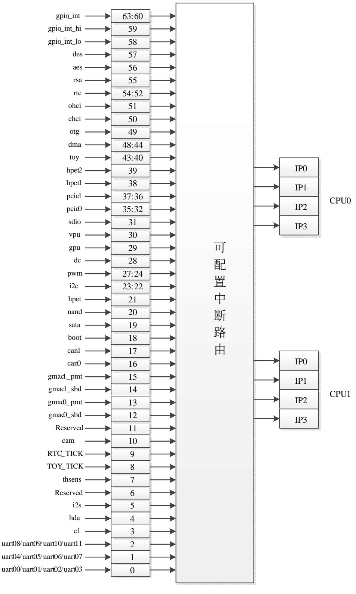

<span id="page-110-1"></span>图 9-1 龙芯 2K1000 处理器中断路由示意图

Loongson Technology Corporation Limited


中断相关配置寄存器都是以位的形式对相应的中断线进行控制,中断控制位连接及属 性配置见表 [9-1](#page-111-4)。中断使能(Enable)的配置有三个寄存器:Intenset、Intenclr 和 Inten。 Intenset设置中断使能,Intenset寄存器写1的位对应的中断被使能。Intenclr清除中断使能, Intenclr 寄存器写 1 的位对应的中断被清除。Inten 寄存器读取当前各中断使能的情况。脉冲 形式的中断信号由 Intedge 配置寄存器来选择,写 1 表示脉冲触发,写 0 表示电平触发。中 断处理程序可以通过 Intenclr 的相应位来清除脉冲记录,在中断被清除后,需要配置相应的 Intenset 才能采集到该中断的下一次脉冲触发。

## <span id="page-111-0"></span>**9.1** 中断触发类型

对于 2K1000 来说,dma 控制器中断和 PCIE MSI 中断为脉冲触发类型,gpio 中断根据 需要可以配置成电平触发或者脉冲触发,其余中断均为电平触发类型。

## <span id="page-111-1"></span>**9.2** 中断分发模式

在龙芯 2K1000 中支持硬件中断负载均衡功能,使得中断可以在软件预设的几个处理 器核上进行路由,分为四种模式:

- 1. 固定分发模式。
- 2. 轮转分发模式
- 3. 忙碌分发模式。
- 4. 空闲分发模式。

硬件负载均衡使能由寄存器 Intbounce 和 Intauto 共同控制。如果仅当 Intbounce 有效, 而 Intauto 对应位为无效,则采用轮转分发模式;在 Intbounce 对应位有效的情况下,如果 Intauto 对应位也有效,则采用忙碌分发模式;在仅当 Intauto 有效时,则采用空闲分发模 式。当 Intbounce 或 Intauto 对应位有效的情况下,Entry 寄存器代表可用的处理器核。当 Intbounce和Intauto对应位均无效的情况下,Entry寄存器中处理器核向量配置只能有一个处 理器核,且该中断路由到该核上。需要注意到的是,一旦配置完 Intbounce 和 Intauto 后不应 该在运行中途修改。

### <span id="page-111-2"></span>**9.3** 中断相关寄存器描述

<span id="page-111-3"></span>表 9-1 中断控制寄存器属性

<span id="page-111-4"></span>

| 位域 |         | 访问属性/缺省值                                                        |       |       |       |        |        |               |  |  |
|----|---------|-----------------------------------------------------------------|-------|-------|-------|--------|--------|---------------|--|--|
|    | Intedge | Intpol<br>Inten<br>Intenset<br>Intenclr<br>Intbounce<br>Intauto |       |       |       |        |        |               |  |  |
| 0  | RW / 0  | RW / 0                                                          | R / 0 | W / 0 | W / 0 | RW / 0 | RW / 0 | Uart00-uart03 |  |  |
| 1  | RW / 0  | RW / 0                                                          | R / 0 | W / 0 | W / 0 | RW / 0 | RW / 0 | Uart04-uart07 |  |  |
| 2  | RW / 0  | RW / 0                                                          | R / 0 | W / 0 | W / 0 | RW / 0 | RW / 0 | Uart08-uart11 |  |  |
| 3  | RW / 0  | RW / 0                                                          | R / 0 | W / 0 | W / 0 | RW / 0 | RW / 0 | 专用通信接口        |  |  |


| 位域    |        |        |       |       |       |        |        |               |
|-------|--------|--------|-------|-------|-------|--------|--------|---------------|
| 4     | RW / 0 | RW / 0 | R / 0 | W / 0 | W / 0 | RW / 0 | RW / 0 | Had_int       |
| 5     | RW / 0 | RW / 0 | R / 0 | W / 0 | W / 0 | RW / 0 | RW / 0 | I2s_int       |
| 6     | RW / 0 | RW / 0 | R / 0 | W / 0 | W / 0 | RW / 0 | RW / 0 | Reserved      |
| 7     | RW / 0 | RW / 0 | R / 0 | W / 0 | W / 0 | RW / 0 | RW / 0 | Thsens_int    |
| 8     | RW / 0 | RW / 0 | R / 0 | W / 0 | W / 0 | RW / 0 | RW / 0 | TOY_TICK      |
| 9     | RW / 0 | RW / 0 | R / 0 | W / 0 | W / 0 | RW / 0 | RW / 0 | RTC_TICK      |
| 10    | RW / 0 | RW / 0 | R / 0 | W / 0 | W / 0 | RW / 0 | RW / 0 | cam_int       |
| 11    | RW / 0 | RW / 0 | R / 0 | W / 0 | W / 0 | RW / 0 | RW / 0 | Reserved      |
| 12    | RW / 0 | RW / 0 | R / 0 | W / 0 | W / 0 | RW / 0 | RW / 0 | Gmac0_sbd_int |
| 13    | RW / 0 | RW / 0 | R / 0 | W / 0 | W / 0 | RW / 0 | RW / 0 | Gmac0_pmt_int |
| 14    | RW / 0 | RW / 0 | R / 0 | W / 0 | W / 0 | RW / 0 | RW / 0 | Gmac1_sbd_int |
| 15    | RW / 0 | RW / 0 | R / 0 | W / 0 | W / 0 | RW / 0 | RW / 0 | Gmac1_pmt_int |
| 16    | RW / 0 | RW / 0 | R / 0 | W / 0 | W / 0 | RW / 0 | RW / 0 | Can0_int      |
| 17    | RW / 0 | RW / 0 | R / 0 | W / 0 | W / 0 | RW / 0 | RW / 0 | Can1_int      |
| 18    | RW / 0 | RW / 0 | R / 0 | W / 0 | W / 0 | RW / 0 | RW / 0 | Spi_int       |
| 19    | RW / 0 | RW / 0 | R / 0 | W / 0 | W / 0 | RW / 0 | RW / 0 | Sata_int      |
| 20    | RW / 0 | RW / 0 | R / 0 | W / 0 | W / 0 | RW / 0 | RW / 0 | Nand_int      |
| 21    | RW / 0 | RW / 0 | R / 0 | W / 0 | W / 0 | RW / 0 | RW / 0 | Hpet_int      |
| 23:22 | RW / 0 | RW / 0 | R / 0 | W / 0 | W / 0 | RW / 0 | RW / 0 | I2c_int       |
| 27:24 | RW / 0 | RW / 0 | R / 0 | W / 0 | W / 0 | RW / 0 | RW / 0 | Pwm_int       |
| 28    | RW / 0 | RW / 0 | R / 0 | W / 0 | W / 0 | RW / 0 | RW / 0 | Dc_int        |
| 29    | RW / 0 | RW / 0 | R / 0 | W / 0 | W / 0 | RW / 0 | RW / 0 | Gpu_int       |
| 30    | RW / 0 | RW / 0 | R / 0 | W / 0 | W / 0 | RW / 0 | RW / 0 | vpu_int       |
| 31    | RW / 0 | RW / 0 | R / 0 | W / 0 | W / 0 | RW / 0 | RW / 0 | Sdio_int      |
| 35:32 | RW / 0 | RW / 0 | R / 0 | W / 0 | W / 0 | RW / 0 | RW / 0 | Pcie0_int     |
| 37:36 | RW / 0 | RW / 0 | R / 0 | W / 0 | W / 0 | RW / 0 | RW / 0 | Pcie1_int     |
| 38    | RW / 0 | RW / 0 | R / 0 | W / 0 | W / 0 | RW / 0 | RW / 0 | hpet1_int     |
| 39    | RW / 0 | RW / 0 | R / 0 | W / 0 | W / 0 | RW / 0 | RW / 0 | hpet2_int     |
| 43:40 | RW / 0 | RW / 0 | R / 0 | W / 0 | W / 0 | RW / 0 | RW / 0 | Toy_int       |
| 48:44 | RW / 0 | RW / 0 | R / 0 | W / 0 | W / 0 | RW / 0 | RW / 0 | Dma_int[4:0]  |
| 49    | RW / 0 | RW / 0 | R / 0 | W / 0 | W / 0 | RW / 0 | RW / 0 | Otg_int       |
| 50    | RW / 0 | RW / 0 | R / 0 | W / 0 | W / 0 | RW / 0 | RW / 0 | Ehci_int      |
| 51    | RW / 0 | RW / 0 | R / 0 | W / 0 | W / 0 | RW / 0 | RW / 0 | Ohci_int      |
| 54:52 | RW / 0 | RW / 0 | R / 0 | W / 0 | W / 0 | RW / 0 | RW / 0 | Rtc_int       |
| 55    | RW / 0 | RW / 0 | R / 0 | W / 0 | W / 0 | RW / 0 | RW / 0 | Rsa_int       |
| 56    | RW / 0 | RW / 0 | R / 0 | W / 0 | W / 0 | RW / 0 | RW / 0 | Aes_int       |


| 位域    |        | 访问属性/缺省值 |       |       |       |        |        |             |  |  |
|-------|--------|----------|-------|-------|-------|--------|--------|-------------|--|--|
| 57    | RW / 0 | RW / 0   | R / 0 | W / 0 | W / 0 | RW / 0 | RW / 0 | Des_int     |  |  |
| 58    | RW / 0 | RW / 0   | R / 0 | W / 0 | W / 0 | RW / 0 | RW / 0 | Gpio_int_lo |  |  |
| 59    | RW / 0 | RW / 0   | R / 0 | W / 0 | W / 0 | RW / 0 | RW / 0 | Gpio_int_hi |  |  |
| 63:60 | RW / 0 | RW / 0   | R / 0 | W / 0 | W / 0 | RW / 0 | RW / 0 | Gpio_int    |  |  |

<span id="page-113-0"></span>表 9-2 中断控制寄存器地址

| 名称          | 地址偏移       | 访问属性 | 缺省值 | 描述                                                                                                            |
|-------------|------------|------|-----|---------------------------------------------------------------------------------------------------------------|
| Intisr_0    | 0x1fe01420 | RO   | NA  | 低 32 位中断状态寄存器                                                                                                 |
| Inten_0     | 0x1fe01424 | RO   | NA  | 低 32 位中断使能状态寄存器                                                                                               |
| Intenset_0  | 0x1fe01428 | WO   | NA  | 低 32 位设置使能寄存器                                                                                                 |
| Intenclr_0  | 0x1fe0142c | WO   | NA  | 低 32 位清除使能寄存器和脉冲触发的中断                                                                                         |
| Intpol_0    | 0x1fe01430 | WR   | 0x0 | 中断极性控制:1 代表低电平,0 代表高电平                                                                                        |
| Intedge_0   | 0x1fe01434 | WR   | 0x0 | 低 32 位触发方式寄存器(1:脉冲触发;0:电平<br>触发)                                                                              |
| Intbounce_0 | 0x1fe01438 | WO   | 0x0 | 低 32 位中断分发模式控制,与 auto 合用。<br>{auto,bounce}:<br>2'b00-固定分发模式<br>2'b01-轮转分发模式<br>2'b10-空闲分发模式<br>2'b11-忙碌分发模式   |
| Intauto_0   | 0x1fe0143c | WO   | 0x0 | 低 32 位中断分发模式控制,与 bounce 合用。<br>{auto,bounce}:<br>2'b00-固定分发模式<br>2'b01-轮转分发模式<br>2'b10-空闲分发模式<br>2'b11-忙碌分发模式 |
| Intisr_1    | 0x1fe01460 | RO   | NA  | 高 32 位中断状态寄存器                                                                                                 |
| Inten_1     | 0x1fe01464 | RO   | NA  | 高 32 位中断使能状态寄存器                                                                                               |
| Intenset_1  | 0x1fe01468 | WO   | NA  | 高 32 位设置使能寄存器                                                                                                 |
| Intenclr_1  | 0x1fe0146c | WO   | NA  | 高 32 位清除使能寄存器和脉冲触发的中断                                                                                         |
| Intpol_1    | 0x1fe01470 | WR   | 0x0 | 中断极性控制:1 代表低电平,0 代表高电平                                                                                        |
| Intedge_1   | 0x1fe01474 | WR   | 0x0 | 高 32 位触发方式寄存器(1:脉冲触发;0:电平<br>触发)                                                                              |
| Intbounce_1 | 0x1fe01478 | WO   | 0x0 | 高 32 位中断分发模式控制,与 auto 合用。<br>{auto,bounce}:<br>2'b00-固定分发模式<br>2'b01-轮转分发模式<br>2'b10-空闲分发模式<br>2'b11-忙碌分发模式   |
| Intauto_1   | 0x1fe01464 | RO   | 0x0 | 高 32 位中断分发模式控制,与 bounce 合用。<br>{auto,bounce}:<br>2'b00-固定分发模式<br>2'b01-轮转分发模式<br>2'b10-空闲分发模式<br>2'b11-忙碌分发模式 |


| 名称            | 地址偏移       | 访问属性 | 缺省值 | 描述                        |
|---------------|------------|------|-----|---------------------------|
| CORE0_IPISR   | 0x1fe01000 | RO   | NA  | 0 号处理器核的 IPI_Status 寄存器   |
| CORE0_IPIEN   | 0x1fe01004 | RW   | 0x0 | 0 号处理器核的 IPI_Enalbe 寄存器   |
| CORE0_IPISET  | 0x1fe01008 | WO   | NA  | 0 号处理器核的 IPI_Set 寄存器      |
| CORE0_IPI_CLR | 0x1fe0100c | WO   | NA  | 0 号处理器核的 IPI_Clear 寄存器    |
| CORE0_INTISR0 | 0x1fe01010 | RO   | NA  | 路由给 CORE0 的低 32 位中断状态     |
| CORE0_INTISR1 | 0x1fe01018 | RO   | NA  | 路由给 CORE0 的高 32 位中断状态     |
| CORE0_BUF0    | 0x1fe01020 | RW   | 0x0 | 0 号处理器核的 IPI_MailBox0 寄存器 |
| CORE0_BUF1    | 0x1fe01028 | RW   | 0x0 | 0 号处理器核的 IPI_MailBox1 寄存器 |
| CORE0_BUF2    | 0x1fe01030 | RW   | 0x0 | 0 号处理器核的 IPI_MailBox2 寄存器 |
| CORE0_BUF3    | 0x1fe01038 | RW   | 0x0 | 0 号处理器核的 IPI_MailBox3 寄存器 |
| CORE0_INTISR0 | 0x1fe01040 | RO   | NA  | 路由给 CORE0 的低 32 位中断状态     |
| CORE0_INTISR1 | 0x1fe01048 | RO   | NA  | 路由给 CORE0 的高 32 位中断状态     |
| CORE1_IPISR   | 0x1fe01100 | RO   | NA  | 1 号处理器核的 IPI_Status 寄存器   |
| CORE1_IPIEN   | 0x1fe01104 | RW   | 0x0 | 1 号处理器核的 IPI_Enalbe 寄存器   |
| CORE1_IPISET  | 0x1fe01108 | WO   | NA  | 1 号处理器核的 IPI_Set 寄存器      |
| CORE1_IPI_CLR | 0x1fe0110c | WO   | NA  | 1 号处理器核的 IPI_Clear 寄存器    |
| CORE1_INTISR0 | 0x1fe01110 | RO   | NA  | 路由给 CORE1 的低 32 位中断状态     |
| CORE1_INTISR1 | 0x1fe01118 | RO   | NA  | 路由给 CORE1 的高 32 位中断状态     |
| CORE1_BUF0    | 0x1fe01120 | RW   | 0x0 | 1 号处理器核的 IPI_MailBox0 寄存器 |
| CORE1_BUF1    | 0x1fe01128 | RW   | 0x0 | 1 号处理器核的 IPI_MailBox1 寄存器 |
| CORE1_BUF2    | 0x1fe01130 | RW   | 0x0 | 1 号处理器核的 IPI_MailBox2 寄存器 |
| CORE1_BUF3    | 0x1fe01138 | RW   | 0x0 | 1 号处理器核的 IPI_MailBox3 寄存器 |
| CORE1_INTISR0 | 0x1fe01140 | RO   | NA  | 路由给 CORE1 的低 32 位中断状态     |
| CORE1_INTISR1 | 0x1fe01148 | RO   | NA  | 路由给 CORE1 的高 32 位中断状态     |

龙芯 2K1000 中集成了 2 个处理器核,上述的 64 位中断源可以通过软件配置选择期望 中断的目标处理器核。更进一步,中断源可以选择路由到处理器核中断 INT0 到 INT3 中的 任意一个。64 个 I/O 中断源中每一个都对应一个 8 位的路由控制器,其格式和地址如下表 所示。路由寄存器采用向量的方式进行路由选择,如 0x42 表示路由到 1 号处理器的 INT2 上。

<span id="page-114-0"></span>表 9-3 中断路由寄存器的说明

| 位域  | 说明             |
|-----|----------------|
| 3:0 | 路由的处理器核向量号     |
| 7:4 | 路由的处理器核中断引脚向量号 |

<span id="page-114-1"></span>表 9-4 中断路由寄存器地址

| 名称 | 地址偏移 | 描述 | 名称 | 地址偏移 | 描述 |
|----|------|----|----|------|----|
|----|------|----|----|------|----|


| 名称      | 地址偏移           | 描述            | 名称      | 地址偏移           | 描述         |
|---------|----------------|---------------|---------|----------------|------------|
| Entry0  | 0x1fe0140      | Uart00-03     | Entry32 | 0x1fe0144      | Pcie0_int0 |
|         | 0              |               |         | 0              |            |
| Entry1  | 0x1fe0140      | Uart04-07     | Entry33 | 0x1fe0144      | Pcie0_int1 |
|         | 1              |               |         | 1              |            |
| Entry2  | 0x1fe0140      | Uart08-11     | Entry34 | 0x1fe0144      | Pcie0_int2 |
|         | 2              |               |         | 2              |            |
| Entry3  | 0x1fe0140      | 专用通信接口        | Entry35 | 0x1fe0144      | Pcie0_int3 |
| Entry4  | 3<br>0x1fe0140 | Hda_int       | Entry36 | 3<br>0x1fe0144 | Pcie1_int0 |
|         | 4              |               |         | 4              |            |
| Entry5  | 0x1fe0140      | I2s_int       | Entry37 | 0x1fe0144      | Pcie1_int1 |
|         | 5              |               |         | 5              |            |
| Entry6  | 0x1fe0140      | Reserved      | Entry38 | 0x1fe0144      | hpet1_int  |
|         | 6              |               |         | 6              |            |
| Entry7  | 0x1fe0140      | Thsens_int    | Entry39 | 0x1fe0144      | hpet2_int  |
|         | 7              |               |         | 7              |            |
| Entry8  | 0x1fe0140      | TOY_TICK      | Entry40 | 0x1fe0144      | Toy_int0   |
|         | 8              |               |         | 8              |            |
| Entry9  | 0x1fe0140<br>9 | RTC_TICK      | Entry41 | 0x1fe0144<br>9 | Toy_int1   |
| Entry10 | 0x1fe0140a     | cam           | Entry42 | 0x1fe0144a     | Toy_int2   |
| Entry11 | 0x1fe0140      | Reserved      | Entry43 | 0x1fe0144      | Toy_int3   |
|         | b              |               |         | b              |            |
| Entry12 | 0x1fe0140c     | Gmac0_sbd_int | Entry44 | 0x1fe0144c     | Dma_int0   |
| Entry13 | 0x1fe0140      | Gmac0_pmt_int | Entry45 | 0x1fe0144      | Dma_int1   |
|         | d              |               |         | d              |            |
| Entry14 | 0x1fe0140e     | Gmac1_sbd_int | Entry46 | 0x1fe0144e     | Dma_int2   |
| Entry15 | 0x1fe0140f     | Gmac1_pmt_int | Entry47 | 0x1fe0144f     | Dma_int3   |
| Entry16 | 0x1fe0141      | Can0_int      | Entry48 | 0x1fe0145      | Dma_int4   |
|         | 0              |               |         | 0              |            |
| Entry17 | 0x1fe01411     | Can1_int      | Entry49 | 0x1fe0145<br>1 | Otg_int    |
| Entry18 | 0x1fe0141      | Spi_int       | Entry50 | 0x1fe0145      | Ehci_int   |
|         | 2              |               |         | 2              |            |
| Entry19 | 0x1fe0141      | Sata_int      | Entry51 | 0x1fe0145      | Ohci_int   |
|         | 3              |               |         | 3              |            |
| Entry20 | 0x1fe0141      | Nand_int      | Entry52 | 0x1fe0145      | Rtc_int0   |
|         | 4              |               |         | 4              |            |


| 名称      | 地址偏移           | 描述       | 名称      | 地址偏移           | 描述          |
|---------|----------------|----------|---------|----------------|-------------|
| Entry21 | 0x1fe0141<br>5 | Hpet_int | Entry53 | 0x1fe0145<br>5 | Rtc_int1    |
| Entry22 | 0x1fe0141<br>6 | I2c_int0 | Entry54 | 0x1fe0145<br>6 | Rtc_int3    |
| Entry23 | 0x1fe0141<br>7 | I2c_int1 | Entry55 | 0x1fe0145<br>7 | Rsa_int     |
| Entry24 | 0x1fe0141<br>8 | Pwm_int0 | Entry56 | 0x1fe0145<br>8 | Aes_int     |
| Entry25 | 0x1fe0141<br>9 | Pwm_int1 | Entry57 | 0x1fe0145<br>9 | Des_int     |
| Entry26 | 0x1fe0141a     | Pwm_int2 | Entry58 | 0x1fe0145a     | Gpio_int_lo |
| Entry27 | 0x1fe0141<br>b | Pwm_int3 | Entry59 | 0x1fe0145<br>b | Gpio_int_hi |
| Entry28 | 0x1fe0141c     | Dc_int   | Entry60 | 0x1fe0145c     | Gpio_int0   |
| Entry29 | 0x1fe0141<br>d | Gpu_int  | Entry61 | 0x1fe0145<br>d | Gpio_int1   |
| Entry30 | 0x1fe0141e     | vpu      | Entry62 | 0x1fe0145e     | Gpio_int2   |
| Entry31 | 0x1fe0141f     | Sdio_int | Entry63 | 0x1fe0145f     | Gpio_int3   |

## <span id="page-116-0"></span>**9.4 GPIO** 中断

龙芯 2K1000 有 60 个 GPIO 引脚,具体请参考 [13.5](#page-134-0) 节。这些 GPIO 引脚与中断引脚 的对应关系如下:

<span id="page-116-2"></span>表 9-5 GPIO 中断

| GPIO 引脚     | 中断引脚        | 说明                               |
|-------------|-------------|----------------------------------|
| GPIO0       | Gpio_int0   |                                  |
| GPIO1       | Gpio_int1   | 专用 GPIO 引脚,与中断引脚一一对应,需设          |
| GPIO2       | Gpio_int2   | 置中断使能,参考 13.4 节                  |
| GPIO3       | Gpio_int3   |                                  |
| GPIO[31:04] | Gpio_int_lo | GPIO31-GPIO4 复用中断引脚 Gpio_int_lo  |
| GPIO[63:32] | Gpio_int_hi | GPIO63-GPIO32 复用中断引脚 Gpio_int_hi |

## <span id="page-116-1"></span>**9.5 MSI** 中断

龙芯 2K1000 的 PCIE 控制器支持 MSI 中断类型。当接收到 MSI 中断时,PCIE 控制器 把对应的中断请求转发到中断控制器。中断控制器将 MSI 中断的 Message Data 译码成中断


线的形式,与现有的中断引脚复用。

龙芯 2K1000 分配给 MSI 的地址有两个,分别对应寄存器 INT\_MSI\_ADDR\_0 (0x1fe014b0)和 INT\_MSI\_ADDR\_1(0x1fe014f0),每个地址可以接受 32 个中断消息, 分别与现有的中断引脚低 32 位和高 32 位复用。与 MSI 相关的寄存器如下表所示: 表 9-6 MSI 中断相关寄存器

<span id="page-117-1"></span>

| 0x1fe014a0 | INT_MSI_0            | 保留                                  |
|------------|----------------------|-------------------------------------|
| 0x1fe014a8 | INT_MSI_EN_0         | 保留                                  |
| 0x1fe014b0 | INT_MSI_ADDR_0       | MSI 地址 0                            |
| 0x1fe014b4 | INT_MSI_TRIGGER_EN_0 | 32位MSI中断使能,每位对应一个写入<br>MSI 地址 0 的中断 |
| 0x1fe014e0 | INT_MSI_1            | 保留                                  |
| 0x1fe014e8 | INT_MSI_EN_1         | 保留                                  |
| 0x1fe014f0 | INT_MSI_ADDR_1       | MSI 地址 1                            |
| 0x1fe014f4 | INT_MSI_TRIGGER_EN_1 | 32位MSI中断使能,每位对应一个写入<br>MSI 地址 1 的中断 |

在接收 MSI 中断之前需要先将对应的 MSI 中断使能位设为 1。另外,MSI 中断为脉冲 触发类型。

MSI 中断配置流程:

- 1. 配置设备的 MSI 相关 capability,系统分配的 MSI 地址为 INT\_MSI\_ADDR\_0 (0x1fe014b0)和 INT\_MSI\_ADDR\_1(0x1fe014f0);
- 2. 配置中断触发类型 INTEDGE 寄存器,将 MSI 中断设置为脉冲触发,即对应位设为 1;
  - 3. 配置对应的 INT\_MSI\_TRIGGER\_EN 寄存器,即将对应的 MSI 中断使能位设为 1;
  - 4. 配置对应的 INTENSET 寄存器,即将对应的中断使能位设为 1;
  - 5. 读对应的中断状态 INTISR 寄存器,获取相应的中断信息;
  - 6. 读到对应的中断后,配置对应的 INTENCLR 寄存器,将其对应位设为 1,清除中断;
  - 7. 再重新将对应的中断使能位(INTENSET 寄存器)设为 1。

### <span id="page-117-0"></span>**9.6** 硬件中断负载均衡功能举例

1. 轮转分发模式(bounce)

| 步<br>骤 | 处理器核向量配置                                       | Bounce | Auto  | 触发<br>中断 | 处理<br>器核 | 清除<br>中断 | 说明                                    |
|--------|------------------------------------------------|--------|-------|----------|----------|----------|---------------------------------------|
| 1      | Entry0[3:0] = 4'b0011<br>Entry1[3:0] = 4'b0010 | 32'b1  | 32'b0 |          |          |          | Int0 的 bounce 有效                      |
| 2      |                                                |        |       | Int0     | Core0    |          | 路由到配置中最右边的<br>处理器核,即 Core0            |
| 3      |                                                |        |       |          |          | Int0     |                                       |
| 4      |                                                |        |       | Int1     | Core1    |          | 使 Core1 上有未被处理<br>的中断                 |
| 5      |                                                |        |       | Int0     | Core1    |          | 仍旧路由到 Entry 配置的<br>下一个处理器核,即<br>Core1 |


| 6 |  |      |       | Int0         |                                  |
|---|--|------|-------|--------------|----------------------------------|
| 7 |  | Int0 | Core0 |              | 路由到 Entry 配置的下一<br>个处理器核,即 Core0 |
| 8 |  |      |       | Int0<br>Int1 |                                  |

#### 2. 忙碌分发模式

| 步<br>骤 | 处理器核向量配置                                                                | Bounce | Auto  | 触发<br>中断 | 处理<br>器核 | 清除<br>中断     | 说明                                                          |
|--------|-------------------------------------------------------------------------|--------|-------|----------|----------|--------------|-------------------------------------------------------------|
| 1      | Entry0[3:0] = 4'b0011<br>Entry1[3:0] = 4'b0001<br>Entry2[3:0] = 4'b0010 | 32'b1  | 32'b1 |          |          |              | Int0 的 bounce 和 auto 有<br>效                                 |
| 2      |                                                                         |        |       | Int0     | Core0    |              | 路由到 Entry 配置中最右<br>边的处理器核,即 Core0                           |
| 3      |                                                                         |        |       | Int1     | Core0    |              | 使 Core0 上有未被处理<br>的中断                                       |
| 4      |                                                                         |        |       | Int2     | Core1    |              | 使 Core1 上有未被处理<br>的中断                                       |
| 5      |                                                                         |        |       |          |          | Int0         |                                                             |
| 6      |                                                                         |        |       | Int0     | Core1    |              | 由于 Core0 上有未被处<br>理的中断,路由到 Entry<br>配置的下一个处理器核,<br>即 core1。 |
| 7      |                                                                         |        |       |          |          | Int0         |                                                             |
| 8      |                                                                         |        |       | Int0     | Core0    |              | 由于 Core1 上有未被处<br>理的中断,路由到 Entry<br>配置的下一个处理器核,<br>即 Core0  |
| 9      |                                                                         |        |       |          |          | Int0<br>Int1 |                                                             |
| 10     |                                                                         |        |       | Int0     | Core0    |              | Core0上没有未被处理的<br>中断,继续中断该核,即<br>Core0                       |
| 11     |                                                                         |        |       |          |          | Int0<br>Int2 |                                                             |

#### 3. 空闲分发模式

| 步<br>骤 | 处理器核向量配置                                                                | Bounce | Auto  | 触发<br>中断 | 处理<br>器核 | 清除<br>中断 | 说明                                                                                           |
|--------|-------------------------------------------------------------------------|--------|-------|----------|----------|----------|----------------------------------------------------------------------------------------------|
| 1      | Entry0[3:0] = 4'b0011<br>Entry1[3:0] = 4'b0001<br>Entry2[3:0] = 4'b0010 | 32'b0  | 32'b1 |          |          |          | Int0 的 auto 有效                                                                               |
| 2      |                                                                         |        |       | Int0     | Core0    |          | 路由到 Entry 配置中最<br>右边的处理器核,即<br>Core0                                                         |
| 3      |                                                                         |        |       | Int2     | Core1    |          | 使 Core1 上有未被处理<br>的中断                                                                        |
| 4      |                                                                         |        |       |          |          | Int0     |                                                                                              |
| 5      |                                                                         |        |       | Int0     | Core0    |          | 由于 Core1 上有未被处<br>理的中断,而 Core0 上<br>没有未被处理的中断,<br>所以路由到 Entry 配置<br>的下一个空闲的处理器<br>核,即 Core0。 |
| 6      |                                                                         |        |       |          |          | Int0     |                                                                                              |
| 7      |                                                                         |        |       | Int1     | Core0    |          | 使 Core0 上有未被处理<br>的中断                                                                        |
| 8      |                                                                         |        |       | Int0     | Core0    |          | 由于 Entry 配置的核                                                                                |


#### 龙芯 2K1000LA 处理器用户手册

| 步<br>骤 | 处理器核向量配置 | Bounce | Auto | 触发<br>中断 | 处理<br>器核 | 清除<br>中断     | 说明                                                         |
|--------|----------|--------|------|----------|----------|--------------|------------------------------------------------------------|
|        |          |        |      |          |          |              | (Core0 和 Core1)都有<br>未被处理的中断,只能<br>继续中断该核,即 Core0          |
| 9      |          |        |      |          |          | Int2<br>Int0 |                                                            |
| 10     |          |        |      | Int0     | Core1    |              | 由于 Core1 空闲,所以<br>路由到 Entry 配置的下<br>一个空闲的处理器核,<br>即 Core1。 |
| 11     |          |        |      |          |          | Int0<br>Int1 |                                                            |
|        |          |        |      |          |          |              |                                                            |


## <span id="page-120-0"></span>**10 SPI** 控制器

串行外围设备接口 SPI 总线技术是多种微处理器、微控制器以及外围设备之间的一种 全双工、同步、串行数据接口标准。

## <span id="page-120-1"></span>**10.1**访问地址

SPI 控制器包括两个地址空间,分别如下:

<span id="page-120-5"></span>表 10-1 SPI 控制器地址空间分配

| 起始地址        | 结束地址        | 名称      | 说明                                    |
|-------------|-------------|---------|---------------------------------------|
| 0x1C00_0000 | 0x1C0F_FFFF | 启动空间    | 当引脚设置为<br>启动时可访问,<br>SPI<br>其它情况下不可访问 |
| 0x1FFF_0220 | 0x1FFF_022F | 配置寄存器空间 |                                       |

### <span id="page-120-2"></span>**10.2 SPI** 控制器结构

本系统集成的 SPI 控制器仅可作为主控端,所连接的是从设备。对于软件而言,SPI 控 制器除了有若干 IO 寄存器外还有一段映射到 SPI Flash 的只读 memory 空间。如果将这段 memory空间分配在0x1c000000,复位后不需要软件干预就可以直接访问,从而支持处理器 从 SPI Flash 启动。SPI 的 IO 寄存器的基地址 0x1fff0220。

## <span id="page-120-3"></span>**10.3**配置寄存器

<span id="page-120-6"></span>表 10-2 SPI 配置寄存器列表

| 偏移 | 名称            | 描述      |
|----|---------------|---------|
| 0  | SPCR          | 控制寄存器   |
| 1  | SPSR          | 状态寄存器   |
| 2  | TxFIFO/RxFIFO | 数据寄存器   |
| 3  | SPER          | 外部寄存器   |
| 4  | SFC_PARAM     | 参数控制寄存器 |
| 5  | SFC_SOFTCS    | 片选控制寄存器 |
| 6  | SFC_TIMING    | 时序控制寄存器 |

#### <span id="page-120-4"></span>**10.3.1** 控制寄存器(SPCR)

偏移地址:0x0

<span id="page-120-7"></span>表 10-3 SPI 控制寄存器(SPCR)

| 位域 | 名称   | 访问  | 初值 | 描述          |
|----|------|-----|----|-------------|
| 7  | spie | R/W | 0  | 中断输出使能信号高有效 |
| 6  | spe  | R/W | 0  | 系统工作使能信号高有效 |


| 位域  | 名称   | 访问  | 初值 | 描述                               |  |  |  |  |
|-----|------|-----|----|----------------------------------|--|--|--|--|
| 5   | -    | -   | 0  | 保留                               |  |  |  |  |
| 4   | mstr | -   | 1  | master 模式选择位,此位一直保持 1            |  |  |  |  |
| 3   | cpol | R/W | 0  | 时钟极性位                            |  |  |  |  |
| 2   | cpha | R/W | 0  | 时钟相位位 1 则相位相反,为 0 则相同            |  |  |  |  |
| 1:0 | spr  | R/W | 0  | sclk_o 分频设定,需要与 sper 的 spre 一起使用 |  |  |  |  |

#### <span id="page-121-0"></span>**10.3.2** 状态寄存器(SPSR)

偏移地址:0x1

<span id="page-121-3"></span>表 10-4 SPI 状态寄存器(SPSR)

| 位域  | 名称      | 访问  | 初值 | 描述                              |
|-----|---------|-----|----|---------------------------------|
| 7   | spif    | R/W | 0  | 中断标志位 1 表示有中断申请,写 1 则清零         |
| 6   | wcol    | R/W | 0  | 写寄存器溢出标志位为 1 表示已经溢出,写 1 则<br>清零 |
| 5:4 | -       | -   | 0  | 保留                              |
| 3   | wffull  | R   | 0  | 写寄存器满标志 1 表示已经满                 |
| 2   | wfempty | R   | 1  | 写寄存器空标志 1 表示空                   |
| 1   | rffull  | R   | 0  | 读寄存器满标志 1 表示已经满                 |
| 0   | rfempty | R   | 1  | 读寄存器空标志 1 表示空                   |

#### <span id="page-121-1"></span>**10.3.3** 数据寄存器(TxFIFO/RxFIFO)

偏移地址:0x2

<span id="page-121-4"></span>表 10-5 SPI 数据寄存器(TxFIFO/RXFIFO)

| 位域  | 名称     | 访问 | 初值 | 描述     |
|-----|--------|----|----|--------|
| 7:0 | TxFIFO | W  | -  | 数据发送端口 |
|     | RxFIFO | R  |    | 数据接收端口 |

#### <span id="page-121-2"></span>**10.3.4** 外部寄存器(SPER)

偏移地址:0x3

<span id="page-121-5"></span>表 10-6 SPI 外部寄存器(SPER)

| 位域  | 名称   | 访问  | 初值 | 描述                                               |
|-----|------|-----|----|--------------------------------------------------|
| 7:6 | icnt | R/W | 0  | 传输完多少个字节后发中断<br>00: 1<br>01: 2<br>10: 3<br>11: 4 |
| 5:3 | -    | -   | -  | 保留                                               |
| 2   | mode | R/W | 0  | spi 接口模式控制<br>0: 采样与发送时机同时<br>1: 采样与发送时机错开半周期    |
| 1:0 | spre | R/W | 0  | 与 spr 一起设定分频的比率                                  |

<span id="page-121-6"></span>表 10-7 SPI 分频系数


| spre | 00 | 00 | 00 | 00 | 01 | 01 | 01  | 01  | 10  | 10   | 10   | 10   |
|------|----|----|----|----|----|----|-----|-----|-----|------|------|------|
| spr  | 00 | 01 | 10 | 11 | 00 | 01 | 10  | 11  | 00  | 01   | 10   | 11   |
| 分频系数 | 2  | 4  | 16 | 32 | 8  | 64 | 128 | 256 | 512 | 1024 | 2048 | 4096 |

#### <span id="page-122-0"></span>**10.3.5** 参数控制寄存器(SFC\_PARAM)

偏移地址:0x4

<span id="page-122-3"></span>表 10-8 SPI 参数控制寄存器(SFC\_PARAM)

| 位域  | 名称        | 访问       | 初值 | 描述                              |
|-----|-----------|----------|----|---------------------------------|
| 7:4 | clk_div   | R/W      | 2  | 时钟分频数选择                         |
|     |           |          |    | 分频系数与{spre, spr}组合相同            |
| 3   | dual_io   | R/W      | 0  | 双 I/O 模式,优先级高于快速读               |
| 2   | fast_read | R/W      | 0  | 快速读模式                           |
| 1   | burst_en  | R/W<br>0 |    | SPI flash 支持连续地址读模式             |
| 0   | memory_en | R/W      | 1  | SPI flash 读使能,无效时 csn[0]可由软件控制。 |

#### <span id="page-122-1"></span>**10.3.6** 片选控制寄存器(SFC\_SOFTCS)

偏移地址:0x5

<span id="page-122-4"></span>表 10-9 SPI 片选控制寄存器(SFC\_SOFTCS)

| 位域  | 名称   | 访问  | 初值 | 描述                       |
|-----|------|-----|----|--------------------------|
| 7:4 | csn  | R/W | 0  | csn 引脚输出值                |
| 3:0 | csen | R/W | 0  | 为 1 时对应位的 csn 线由 7:4 位控制 |

#### <span id="page-122-2"></span>**10.3.7** 时序控制寄存器(SFC\_TIMING)

偏移地址:0x6

#### <span id="page-122-5"></span>表 10-10 SPI 时序控制寄存器(SFC\_TIMING)

| 位域  | 名称    | 访问  | 初值 | 描述                                                                              |
|-----|-------|-----|----|---------------------------------------------------------------------------------|
| 7:3 | -     | -   | -  | 保留                                                                              |
| 2   | tFAST | R/W | 0  | SPI flash 读采样模式<br>0: 上沿采样,间隔半个 SPI 周期<br>1: 上沿采样,间隔一个 SPI 周期                   |
| 1:0 | tCSH  | R/W | 3  | SPI Flash 的片选信号最短无效时间,以分频后<br>时钟周期 T 计算<br>00: 1T<br>01: 2T<br>10: 4T<br>11: 8T |


## <span id="page-123-0"></span>10.4接口时序

#### <span id="page-123-1"></span>10.4.1 SPI 主控制器接口时序

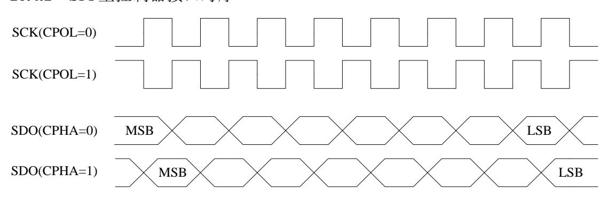

<span id="page-123-3"></span>图 10-1 SPI 主控制器接口时序

#### <span id="page-123-2"></span>**10.4.2** SPI Flash 访问时序

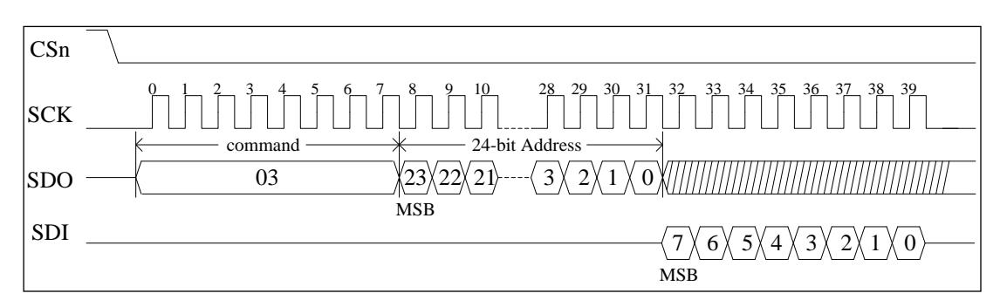

<span id="page-123-4"></span>图 10-2 SPI Flash 标准读时序

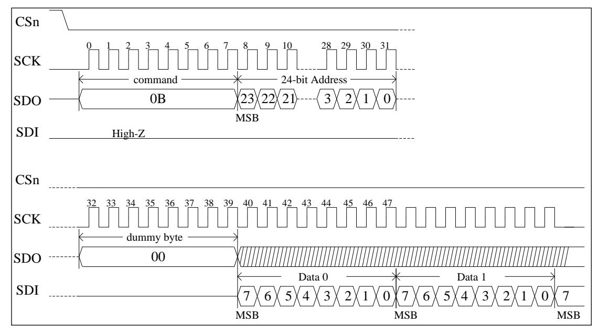

<span id="page-123-5"></span>图 10-3 SPI Flash 快速读时序


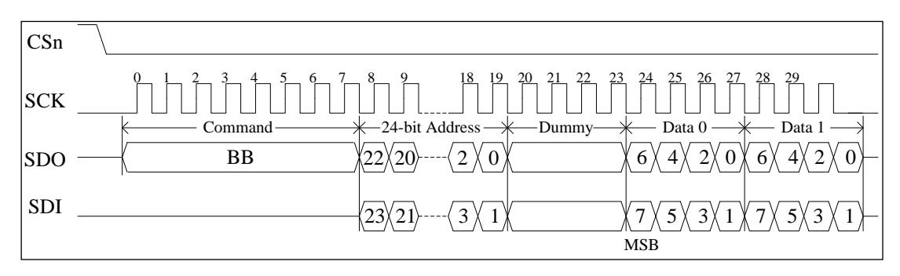

<span id="page-124-3"></span>图 10-4 SPI Flash 双向 I/O 读时序

### <span id="page-124-0"></span>10.5 软件编程指南

#### <span id="page-124-1"></span>10.5.1 SPI 主控制器的读写操作

#### 模块初始化.

- 停止 SPI 控制器工作,对控制寄存器 spcr 的 spe 位写 0
- 重置状态寄存器 spsr,对寄存器写入 8'b1100\_0000
- 设置外部寄存器 sper,包括中断申请条件 sper[7:6]和分频系数 sper[1:0],具体 参考寄存器说明
- 配置 SPI 时序,包括 spcr 的 cpol、cpha 和 sper 的 mode 位。mode 为 1 时是标 准 SPI 实现,为0时为兼容模式。
- 配置中断使能, spcr 的 spie 位
- 启动 SPI 控制器,对控制寄存器 spcr 的 spe 位写 1

#### 模块的发送/传输操作

- 往数据传输寄存器写入数据
- 传输完成后从数据传输寄存器读出数据。由于发送和接收同时进行,即使SPI 从设备没有发送有效数据也必须进行读出操作。

#### 中断处理

- 接收到中断申请
- 读状态寄存器 spsr 的值,若 spsr[2]为 1 则表示数据发送完成,若 spsr[0]为 1 则表示已经接收数据
- 读或写数据传输寄存器
- 往状态寄存器 spsr 的 spif 位写 1,清除控制器的中断申请

#### <span id="page-124-2"></span>**10.5.2** 硬件 SPI Flash 读

#### 初始化

将 SFC\_PARAM 的 memory\_en 位写 1。当 SPI 被选为启动设备时此位复位为

107

Loongson Technology Corporation Limited


1。

⚫ 设置读参数(时钟分频、连续地址读、快速读、双 I/O、tCSH 等)。这些参数复 位值均为最保守的值。

#### ⚫ 更改参数

如果所使用的 SPI Flash 支持更高的频率或者提供增强功能,修改相应参数可以大大加 快 Flash 的访问速度。参数的修改不需要关闭 SPI Flash 读使能(memory\_en)。具体参考寄存 器说明。

#### <span id="page-125-0"></span>**10.5.3** 混合访问 SPI Flash 和 SPI 主控制器

### ⚫ 对 **SPI Flash** 进行读以外的访问

将 SPI Flash 读使能关闭后,软件就可直接控制 csn[0],并通过 SPI 主控制器访问 SPI 总线。这意味着在进行此操作时,不能从 SPI Flash 中取指。

除了读以外,SPI Flash 还实现了很多命令(如擦除、写入),具体参见相关 Flash 的文 档。


## <span id="page-126-0"></span>**11 LocalIO** 控制器

## <span id="page-126-1"></span>**11.1**访问地址及引脚复用

<span id="page-126-4"></span>表 11-1LocalIO 地址空间分配

| 起始地址        | 结束名称        | 名称   | 说明                                    |
|-------------|-------------|------|---------------------------------------|
| 0x1C00_0000 | 0x1C0F_FFFF | 启动空间 | 当引脚设置为<br>启动时可访问,其<br>LIO<br>它情况下不可访问 |
| 0x1C10_0000 | 0x1FBF_FFFF |      |                                       |
| 0x1FD0_0000 | 0x1FDF_FFFF | 存储空间 |                                       |
| 0x1FF0_0000 | 0x1FFF_FFFF |      |                                       |

对于 LocalIO 模块,使用时要注意将对应的引脚设置为相应的功能。

与 LocalIO 相关的引脚设置寄存器为 [5.1](#page-51-0) 节中的 lio\_sel。

## <span id="page-126-2"></span>**11.2LocalIO** 控制器功能概述

LocalIO 控制器提供了简单外设访问接口,主要用于连接系统启动 ROM。它对外提供 一个片选,具有可配置的数据位宽和访问延迟。其中 wait 参数指 liord 或 liowr 信号为低的 周期数减一,读写时序可参考图 10-1,图 10-2。当数据位宽为 16 时,送出的地址由 CPU 物理地址右移一位得到。

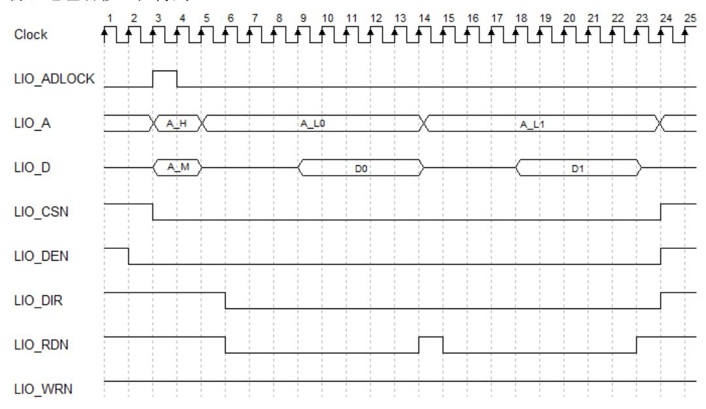

<span id="page-126-3"></span>图 11-1LocalIO 读时序


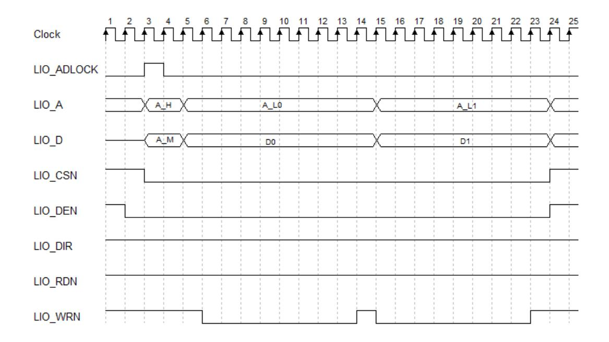

<span id="page-127-0"></span>图 11-2LocalIO 写时序

#### 说明:

- ⚫ 图中 clock 信号实际并不存在,只是为了方便时序描述
- ⚫ A\_H 代表地址 bit23-bit29(8 位模式)/bit24-bit30(16 位模式)
- ⚫ A\_M 代表地址 bit7-bit22(8 位模式)/bit8-bit23(16 位模式)
- ⚫ A\_L 代表低 7 位地址
- ⚫ 在 big\_mem 设置为 0 时,第 4 拍波形不存在,第 4 拍之后的波形向前推一拍
- ⚫ LIO\_WRN 和 LIO\_RDN 低有效时间与 LIO clock\_period\_i 设置有关:
  - LIO clock\_period\_i 设置为 1 时-低电平持续 8 拍;
  - LIO clock\_period\_i 设置为 2 时-低电平持续 16 拍;
  - LIO clock\_period\_i 设置为 3/0 时-低电平持续 32 拍;
- ⚫ 一次 CS 有效期间可能出现多次读写操作,以上时序图仅作为一种示例。


## <span id="page-128-0"></span>**12 DDR3** 控制器

龙芯 2K1000 处理器内部集成的内存控制器的设计遵守 DDR3 SDRAM 的行业标准 (JESD79-3)。所实现的所有内存读/写操作都遵守 JESD79-3 的规定。

## <span id="page-128-1"></span>**12.1**访问地址

<span id="page-128-4"></span>DDR3 控制器包括两个地址空间,分别如下: 表 12-1 内存控制器地址空间分配

| 起始地址        | 结束名称        | 名称   | 说明                                                                                                            |
|-------------|-------------|------|---------------------------------------------------------------------------------------------------------------|
| 0x0FF0_0000 | 0x0FFF_FFFF | 配置空间 | 当<br>时;<br>mc_default_reg =1<br>或当<br>mc_default_reg = 0<br>且<br>时,为配置空<br>mc_disable_reg = 0<br>间。其它情况下为内存空间 |
| 其它          |             | 内存空间 | 使用<br>的窗口配置路由至<br>的所有<br>X2<br>DDR<br>地址                                                                      |

具体的 mc\_default\_reg 和 mc\_disable\_reg 配置请参考表 5-2 [通用配置寄存器](#page-51-2) 0。

## <span id="page-128-2"></span>**12.2 DDR3 SDRAM** 控制器功能概述

龙芯 2K1000 处理器支持最大 4 个 CS(由 4 个片选信号实现,即两个双面内存条), 一共含有 19 位的地址总线(即:16 位的行列地址总线和 3 位的逻辑 Bank 总线)。

在具体选择使用不同内存芯片类型时,可以调整 DDR3 控制器参数设置进行支持。其 中,支持的最大片选(CS\_n)数为 4,行地址(RAS\_n)数为 16,列地址(CAS\_n)数为 16,逻辑体地址(BANK\_n)数为 3。

CPU 发送的内存请求物理地址可以根据控制器内部不同的配置进行多种不同的地址映 射。

龙芯 2K1000 处理器中内存控制器具有如下特征:

- 1. 接口上命令、读写数据全流水操作
- 2. 内存命令合并、排序提高整体带宽
- 3. 配置寄存器读写端口,可以修改内存设备的基本参数
- 4. 内建动态延迟补偿电路(DCC),用于数据的可靠发送和接收
- 5. 支持 133-533MHZ 工作频率

## <span id="page-128-3"></span>**12.3 DDR3 SDRAM** 读操作协议

DDR3 SDRAM 读操作的协议如图 [12-1](#page-129-5) 所示。在图中命令(Command,简称 CMD)由 RAS\_n,CAS\_n 和 WE\_n,共三个信号组成。对于读操作,RAS\_n=1,CAS\_n=0,WE\_n =1。


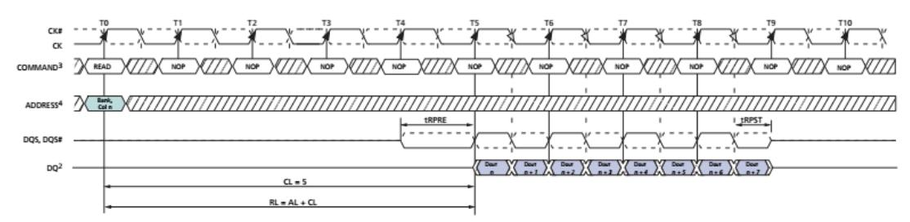

<span id="page-129-2"></span>图 12-1DDR3 SDRAM 读操作协议

<span id="page-129-5"></span>上图中,Cas Latency (CL) = 5,Read Latency (RL) = 5,Burst Length = 8。

## <span id="page-129-0"></span>**12.4 DDR3 SDRAM** 写操作协议

DDR3 SDRAM 写操作的协议如图 [12-2](#page-129-6) 所示。在图中命令 CMD 是由 RAS\_n,CAS\_n 和 WE\_n,共三个信号组成的。对于写操作,RAS\_n=1,CAS\_n=0,WE\_n=0。另外,与 读操作不同,写操作需要 DQM 来标识写操作的掩码,即需要写入的字节数。DQM 与图中 DQs 信号同步。

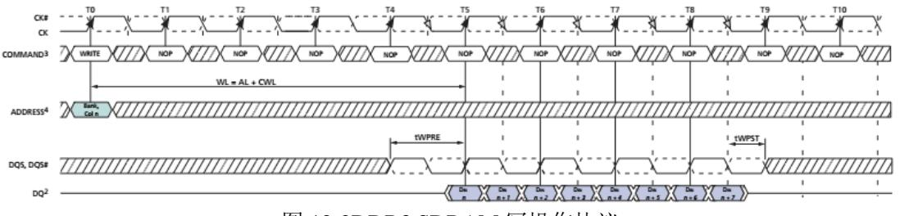

<span id="page-129-3"></span>图 12-2DDR3 SDRAM 写操作协议

<span id="page-129-6"></span>上图中,Cas Latency (CL) = 5,Write Latency (WL) = 5,Burst Length = 8。

## <span id="page-129-1"></span>**12.5 DDR3** 控制器寄存器

DDR3 控制器的配置寄存器内容如表 [12-2](#page-129-7) 所示。

<span id="page-129-4"></span>表 12-2 DDR3 控制器配置寄存器

<span id="page-129-7"></span>

| 63:56                                                                    | 55:48                           | 47:40            | 39:32           | 31:24             | 23:16           | 15:8            | 7:0                            |  |
|--------------------------------------------------------------------------|---------------------------------|------------------|-----------------|-------------------|-----------------|-----------------|--------------------------------|--|
| 0x000 Dll_value_0(RD)/Dll_adj_cnt/dll_sync_d<br>isable/dll_close_disable |                                 | Dll_value_ck(RD) |                 | Dll_init_done(RD) |                 | Version(RD)     |                                |  |
| 0x008 Dll_value_4(RD)                                                    |                                 | Dll_value_3(RD)  |                 | Dll_value_2(RD)   |                 |                 | Dll_value_1(RD)/capability(RD) |  |
| 0x010 Dll_value_8(RD)                                                    |                                 | Dll_value_7(RD)  |                 | Dll_value_6(RD)   |                 | Dll_value_5(RD) |                                |  |
| 0x018 Dll_ck_3                                                           | Dll_ck_2                        | Dll_ck_1         | Dll_ck_0        | Dll_increment     | Dll_start_point | Dll_bypass      | Init_start                     |  |
| 0x020 Dq_oe_end_0                                                        | Dq_oe_begin_0                   | Dq_stop_edge_0   | Dq_start_edge_0 | Rddata_delay_0    | Rddqs_lt_half_0 | Wrdqs_lt_half_0 | Wrdq_lt_half_0                 |  |
| 0x028 Rd_oe_end_0                                                        | Rd_oe_begin_0                   | Rd_stop_edge_0   | Rd_start_edge_0 | Dqs_oe_end_0      | Dqs_oe_begin_0  | Dqs_stop_edge_0 | Dqs_start_edge_0               |  |
| 0x030 Enzi_end_0                                                         | Enzi_begin_0                    | Wrclk_sel_0      | Wrdq_clkdelay_0 | Odt_oe_end_0      | Odt_oe_begin_0  | Odt_stop_edge_0 | Odt_start_edge_0               |  |
| 0x038 Enzi_stop_0                                                        | Enzi_start_0                    | Dll_oe_shorten_0 | Dll_rddqs_n_0   | Dll_rddqs_p_0     | Dll_wrdqs_0     | Dll_wrdata_0    | Dll_gate_0                     |  |
| 0x040 Dq_oe_end_1                                                        | Dq_oe_begin_1                   | Dq_stop_edge_1   | Dq_start_edge_1 | Rddata_delay_1    | Rddqs_lt_half_1 | Wrdqs_lt_half_1 | Wrdq_lt_half_1                 |  |
| 0x048 Rd_oe_end_1                                                        | Rd_oe_begin_1<br>Rd_stop_edge_1 |                  | Rd_start_edge_1 | Dqs_oe_end_1      | Dqs_oe_begin_1  | Dqs_stop_edge_1 | Dqs_start_edge_1               |  |
| 0x050 Enzi_end_1                                                         | Enzi_begin_1                    | Wrclk_sel_1      | Wrdq_clkdelay_1 | Odt_oe_end_1      | Odt_oe_begin_1  | Odt_stop_edge_1 | Odt_start_edge_1               |  |


|       | 63:56                         | 55:48          | 47:40            | 39:32           | 31:24            | 23:16             | 15:8              | 7:0              |
|-------|-------------------------------|----------------|------------------|-----------------|------------------|-------------------|-------------------|------------------|
| 0x058 | Enzi_stop_1                   | Enzi_start_1   | Dll_oe_shorten_1 | Dll_rddqs_n_1   | Dll_rddqs_p_1    | Dll_wrdqs_1       | Dll_wrdata_1      | Dll_gate_1       |
| 0x060 | Dq_oe_end_2                   | Dq_oe_begin_2  | Dq_stop_edge_2   | Dq_start_edge_2 | Rddata_delay_2   | Rddqs_lt_half_2   | Wrdqs_lt_half_2   | Wrdq_lt_half_2   |
| 0x068 | Rd_oe_end_2                   | Rd_oe_begin_2  | Rd_stop_edge_2   | Rd_start_edge_2 | Dqs_oe_end_2     | Dqs_oe_begin_2    | Dqs_stop_edge_2   | Dqs_start_edge_2 |
| 0x070 | Enzi_end_2                    | Enzi_begin_2   | Wrclk_sel_2      | Wrdq_clkdelay_2 | Odt_oe_end_2     | Odt_oe_begin_2    | Odt_stop_edge_2   | Odt_start_edge_2 |
| 0x078 | Enzi_stop_2                   | Enzi_start_2   | Dll_oe_shorten_2 | Dll_rddqs_n_2   | Dll_rddqs_p_2    | Dll_wrdqs_2       | Dll_wrdata_2      | Dll_gate_2       |
| 0x080 | Dq_oe_end_3                   | Dq_oe_begin_3  | Dq_stop_edge_3   | Dq_start_edge_3 | Rddata_delay_3   | Rddqs_lt_half_3   | Wrdqs_lt_half_3   | Wrdq_lt_half_3   |
| 0x088 | Rd_oe_end_3                   | Rd_oe_begin_3  | Rd_stop_edge_3   | Rd_start_edge_3 | Dqs_oe_end_3     | Dqs_oe_begin_3    | Dqs_stop_edge_3   | Dqs_start_edge_3 |
| 0x090 | Enzi_end_3                    | Enzi_begin_3   | Wrclk_sel_3      | Wrdq_clkdelay_3 | Odt_oe_end_3     | Odt_oe_begin_3    | Odt_stop_edge_3   | Odt_start_edge_3 |
| 0x098 | Enzi_stop_3                   | Enzi_start_3   | Dll_oe_shorten_3 | Dll_rddqs_n_3   | Dll_rddqs_p_3    | Dll_wrdqs_3       | Dll_wrdata_3      | Dll_gate_3       |
| 0x0A0 | Dq_oe_end_4                   | Dq_oe_begin_4  | Dq_stop_edge_4   | Dq_start_edge_4 | Rddata_delay_4   | Rddqs_lt_half_4   | Wrdqs_lt_half_4   | Wrdq_lt_half_4   |
| 0x0A8 | Rd_oe_end_4                   | Rd_oe_begin_4  | Rd_stop_edge_4   | Rd_start_edge_4 | Dqs_oe_end_4     | Dqs_oe_begin_4    | Dqs_stop_edge_4   | Dqs_start_edge_4 |
| 0x0B0 | Enzi_end_4                    | Enzi_begin_4   | Wrclk_sel_4      | Wrdq_clkdelay_4 | Odt_oe_end_4     | Odt_oe_begin_4    | Odt_stop_edge_4   | Odt_start_edge_4 |
| 0x0B8 | Enzi_stop_4                   | Enzi_start_4   | Dll_oe_shorten_4 | Dll_rddqs_n_4   | Dll_rddqs_p_4    | Dll_wrdqs_4       | Dll_wrdata_4      | Dll_gate_4       |
| 0x0C0 | Dq_oe_end_5                   | Dq_oe_begin_5  | Dq_stop_edge_5   | Dq_start_edge_5 | Rddata_delay_5   | Rddqs_lt_half_5   | Wrdqs_lt_half_5   | Wrdq_lt_half_5   |
| 0x0C8 | Rd_oe_end_5                   | Rd_oe_begin_5  | Rd_stop_edge_5   | Rd_start_edge_5 | Dqs_oe_end_5     | Dqs_oe_begin_5    | Dqs_stop_edge_5   | Dqs_start_edge_5 |
| 0x0D0 | Enzi_end_5                    | Enzi_begin_5   | Wrclk_sel_5      | Wrdq_clkdelay_5 | Odt_oe_end_5     | Odt_oe_begin_5    | Odt_stop_edge_5   | Odt_start_edge_5 |
| 0x0D8 | Enzi_stop_5                   | Enzi_start_5   | Dll_oe_shorten_5 | Dll_rddqs_n_5   | Dll_rddqs_p_5    | Dll_wrdqs_5       | Dll_wrdata_5      | Dll_gate_5       |
| 0x0E0 | Dq_oe_end_6                   | Dq_oe_begin_6  | Dq_stop_edge_6   | Dq_start_edge_6 | Rddata_delay_6   | Rddqs_lt_half_6   | Wrdqs_lt_half_6   | Wrdq_lt_half_6   |
| 0x0E8 | Rd_oe_end_6                   | Rd_oe_begin_6  | Rd_stop_edge_6   | Rd_start_edge_6 | Dqs_oe_end_6     | Dqs_oe_begin_6    | Dqs_stop_edge_6   | Dqs_start_edge_6 |
| 0x0F0 | Enzi_end_6                    | Enzi_begin_6   | Wrclk_sel_6      | Wrdq_clkdelay_6 | Odt_oe_end_6     | Odt_oe_begin_6    | Odt_stop_edge_6   | Odt_start_edge_6 |
| 0x0F8 | Enzi_stop_6                   | Enzi_start_6   | Dll_oe_shorten_6 | Dll_rddqs_n_6   | Dll_rddqs_p_6    | Dll_wrdqs_6       | Dll_wrdata_6      | Dll_gate_6       |
| 0x100 | Dq_oe_end_7                   | Dq_oe_begin_7  | Dq_stop_edge_7   | Dq_start_edge_7 | Rddata_delay_7   | Rddqs_lt_half_7   | Wrdqs_lt_half_7   | Wrdq_lt_half_7   |
| 0x108 | Rd_oe_end_7                   | Rd_oe_begin_7  | Rd_stop_edge_7   | Rd_start_edge_7 | Dqs_oe_end_7     | Dqs_oe_begin_7    | Dqs_stop_edge_7   | Dqs_start_edge_7 |
| 0x110 | Enzi_end_7                    | Enzi_begin_7   | Wrclk_sel_7      | Wrdq_clkdelay_7 | Odt_oe_end_7     | Odt_oe_begin_7    | Odt_stop_edge_7   | Odt_start_edge_7 |
| 0x118 | Enzi_stop_7                   | Enzi_start_7   | Dll_oe_shorten_7 | Dll_rddqs_n_7   | Dll_rddqs_p_7    | Dll_wrdqs_7       | Dll_wrdata_7      | Dll_gate_7       |
| 0x120 | Dq_oe_end_8                   | Dq_oe_begin_8  | Dq_stop_edge_8   | Dq_start_edge_8 | Rddata_delay_8   | Rddqs_lt_half_8   | Wrdqs_lt_half_8   | Wrdq_lt_half_8   |
| 0x128 | Rd_oe_end_8                   | Rd_oe_begin_8  | Rd_stop_edge_8   | Rd_start_edge_8 | Dqs_oe_end_8     | Dqs_oe_begin_8    | Dqs_stop_edge_8   | Dqs_start_edge_8 |
| 0x130 | Enzi_end_8                    | Enzi_begin_8   | Wrclk_sel_8      | Wrdq_clkdelay_8 | Odt_oe_end_8     | Odt_oe_begin_8    | Odt_stop_edge_8   | Odt_start_edge_8 |
| 0x138 | Enzi_stop_8                   | Enzi_start_8   | Dll_oe_shorten_8 | Dll_rddqs_n_8   | Dll_rddqs_p_8    | Dll_wrdqs_8       | Dll_wrdata_8      | Dll_gate_8       |
| 0x140 | Pad_ocd_clk                   | Pad_ocd_ctl    | Pad_ocd_dqs      | Pad_ocd_dq      | Pad_enzi         |                   | Pad_en_ctl        | Pad_en_clk       |
| 0x148 | Pad_adj_code_dqs              | Pad_code_dqs   | Pad_adj_code_dq  | Pad_code_dq     |                  | Pad_vref_internal | Pad_odt_se        | Pad_modezi1v8    |
| 0x150 | T                             | Pad_reset_po   | Pad_adj_code_clk | Pad_code_lk     | Pad_adj_code_cmd | Pad_code_cmd      | Pad_adj_code_addr | Pad_code_addr    |
| 0x158 | Pad_co                        | mp_code_o      | Pad_comp_okn     | Pad_            | comp_code_i      | Pad_comp_mode     | Pad_comp_tm       | Pad_comp_pd      |
| 0x160 | Rdfifo_empty(RD)              |                | Overflow(RD)     |                 | Dram_init(RD)    | Rdfifo_valid      | Cmd_timming       | Ddr3_mode        |
| 0x168 | Ba_xor_row_offset Addr_mirror |                | Cmd_delay        | Burst_length    | Bank/Cs_resync   | Cs_zq             | Cs_mrs            | Cs_enable        |
| 0x170 | Odt_wr_cs_map                 |                | Odt_wr_length    | Odt_wr_delay    | Odt_rd_cs_map    |                   | Odt_rd_length     | Odt_rd_delay     |
| 0x178 |                               |                |                  |                 |                  |                   |                   |                  |
| 0x180 | Lvl_resp_0(RD)                | Lvl_done(RD)   | Lvl_ready(RD)    |                 | Lvl_cs           | tLVL_DELAY        | Lvl_req(WR)       | Lvl_mode         |
| 0x188 | Lvl_resp_8(RD)                | Lvl_resp_7(RD) | Lvl_resp_6(RD)   | Lvl_resp_5(RD)  | Lvl_resp_4(RD)   | Lvl_resp_3(RD)    | Lvl_resp_2(RD)    | Lvl_resp_1(RD)   |
| 0x190 | Cmd_a                         |                | Cmd_ba           | Cmd_cmd         | Cmd_cs           | Status_cmd(RD)    | Cmd_req(WR)       | Command_mode     |
| 0x198 |                               |                | Status_sref(RD)  | Srefresh_req    | Pre_all_done(RD) | Pre_all_req(RD)   | Mrs_done(RD)      | Mrs_req(WR)      |

113


#### 龙芯 2K1000LA 处理器用户手册

|            | 63:56                                         | 55:48       | 47:40              | 39:32       | 31:24                  | 23:16       | 15:8             | 7:0          |
|------------|-----------------------------------------------|-------------|--------------------|-------------|------------------------|-------------|------------------|--------------|
|            | 0x1A0 Mr_3_cs_0                               |             | Mr_2_cs_0          |             | Mr_1_cs_0              |             | Mr_0_cs_0        |              |
|            | 0x1A8 Mr_3_cs_1                               |             | Mr_2_cs_1          |             | Mr_1_cs_1              |             | Mr_0_cs_1        |              |
|            | 0x1B0 Mr_3_cs_2                               | Mr_2_cs_2   |                    |             | Mr_1_cs_2<br>Mr_0_cs_2 |             |                  |              |
|            | 0x1B8 Mr_3_cs_3                               |             | Mr_2_cs_3          |             | Mr_1_cs_3              |             | Mr_0_cs_3        |              |
|            | 0x1C0 tRESET                                  | tCKE        | tXPR               | tMOD        | tZQCL                  | tZQ_CMD     | tWLDQSEN         | tRDDATA      |
| 0x1C8 tFAW |                                               | tRRD        | tRCD               | tRP         | tREF                   | tRFC        | tZQCS            | tZQperiod    |
|            | 0x1D0 tODTL                                   | tXSRD       | tPHY_RDLAT         | tPHY_WRLAT  | tRAS_max               |             |                  | tRAS_min     |
|            | 0x1D8 tXPDLL                                  | tXP         | tWR                | tRTP        | tRL                    | tWL         | tCCD             | tWTR         |
|            | 0x1E0 tW2R_diffCS                             | tW2W_diffCS | tR2P_sameBA        | tW2P_sameBA | tR2R_sameBA            | tR2W_sameBA | tW2R_sameBA      | tW2W_sameBA  |
|            | 0x1E8 tR2R_diffCS                             | tR2W_diffCS | tR2P_sameCS        | tW2P_sameCS | tR2R_sameCS            | tR2W_sameCS | tW2R_sameCS      | tW2W_sameCS  |
|            | 0x1F0 Power_up                                | Age_step    | tCPDED             | Cs_map      | Bs_config              | Nc          | Pr_r2w           | Placement_en |
|            | 0x1F8 Hw_pd_3                                 | Hw_pd_2     | Hw_pd_1            | Hw_pd_0     | Credit_16              | Credit_32   | Credit_64        | Selection_en |
|            | 0x200 Cmdq_age_16                             |             | Cmdq_age_32        |             | Cmdq_age_64            |             | tCKESR           | tRDPDEN      |
|            | 0x208 Wfifo_age                               |             | Rfifo_age          |             | Power_stat3            | Power_stat2 | Power_stat1      | Power_stat0  |
|            | 0x210 Active_age                              |             | Cs_place_0         | Addr_win_0  | Cs_diff_0              | Row_diff_0  | Ba_diff_0        | Col_diff_0   |
|            | 0x218 Fastpd_age                              |             | Cs_place_1         | Addr_win_1  | Cs_diff_1              | Row_diff_1  | Ba_diff_1        | Col_diff_1   |
|            | 0x220 Slowpd_age<br>Cs_place_2                |             |                    | Addr_win_2  | Cs_diff_2              | Row_diff_2  | Ba_diff_2        | Col_diff_2   |
|            | 0x228 Selfref_age<br>Cs_place_3<br>Addr_win_3 |             |                    | Cs_diff_3   | Row_diff_3             | Ba_diff_3   | Col_diff_3       |              |
|            | 0x230 Win_mask_0                              |             |                    |             | Win_base_0             |             |                  |              |
|            | 0x238 Win_mask_1                              |             |                    |             | Win_base_1             |             |                  |              |
|            | 0x240 Win_mask_2                              |             |                    |             | Win_base_2             |             |                  |              |
|            | 0x248 Win_mask_3                              |             |                    |             | Win_base_3             |             |                  |              |
| 0x250      |                                               | Cmd_monitor | Axi_monitor        |             | Ecc_code(RD)           | Ecc_enable  | Int_vector       | Int_enable   |
| 0x258      |                                               |             |                    |             |                        |             |                  |              |
|            | 0x260 Ecc_addr(RD)                            |             |                    |             |                        |             |                  |              |
|            | 0x268 Ecc_data(RD)                            |             |                    |             |                        |             |                  |              |
|            | 0x270 Lpbk_ecc_mask(RD)                       | Prbs_init   |                    |             | Lpbk_error(RD)         | Prbs_23     | Lpbk_start       | Lpbk_en      |
|            | 0x278 Lpbk_ecc(RD)                            |             | Lpbk_data_mask(RD) |             | Lpbk_correct(RD)       |             | Lpbk_counter(RD) |              |
|            | 0x280 Lpbk_data_r(RD)                         |             |                    |             |                        |             |                  |              |
|            | 0x288 Lpbk_data_f(RD)                         |             |                    |             |                        |             |                  |              |
|            | 0x290 Axi0_bandwidth_w                        |             |                    |             | Axi0_bandwidth_r       |             |                  |              |
|            | 0x298 Axi0_latency_w                          |             |                    |             | Axi0_latency_r         |             |                  |              |
|            | 0x2A0 Axi1_bandwidth_w                        |             |                    |             | Axi1_bandwidth_r       |             |                  |              |
|            | 0x2A8 Axi1_latency_w                          |             |                    |             | Axi1_latency_r         |             |                  |              |
|            | 0x2B0 Axi2_bandwidth_w                        |             |                    |             | Axi2_bandwidth_r       |             |                  |              |
|            | 0x2B8 Axi2_latency_w                          |             |                    |             | Axi2_latency_r         |             |                  |              |
|            | 0x2C0 Axi3_bandwidth_w                        |             |                    |             | Axi3_bandwidth_r       |             |                  |              |
|            | 0x2C8 Axi3_latency_w                          |             |                    |             | Axi3_latency_r         |             |                  |              |
|            | 0x2D0 Axi4_bandwidth_w                        |             |                    |             | Axi4_bandwidth_r       |             |                  |              |
|            | 0x2D8 Axi4_latency_w                          |             |                    |             | Axi4_latency_r         |             |                  |              |
|            | 0x2E0 Cmdq0_bandwidth_w                       |             |                    |             | Cmdq0_bandwidth_r      |             |                  |              |


#### 龙芯 2K1000LA 处理器用户手册

|       | 63:56                          | 55:48                   | 47:40             | 39:32             | 31:24             | 23:16             | 15:8         | 7:0               |  |
|-------|--------------------------------|-------------------------|-------------------|-------------------|-------------------|-------------------|--------------|-------------------|--|
|       | 0x2E8 Cmdq0_latency_w          |                         |                   |                   | Cmdq0_latency_r   |                   |              |                   |  |
|       |                                | 0x2F0 Cmdq1_bandwidth_w |                   |                   |                   | Cmdq1_bandwidth_r |              |                   |  |
|       | 0x2F8 Cmdq1_latency_w          |                         |                   |                   | Cmdq1_latency_r   |                   |              |                   |  |
|       | 0x300 Cmdq2_bandwidth_w        |                         |                   |                   | Cmdq2_bandwidth_r |                   |              |                   |  |
|       | 0x308 Cmdq2_latency_w          |                         |                   |                   | Cmdq2_latency_r   |                   |              |                   |  |
|       | 0x310 Cmdq3_bandwidth_w        |                         |                   |                   | Cmdq3_bandwidth_r |                   |              |                   |  |
|       | 0x318 Cmdq3_latency_w          |                         |                   |                   | Cmdq3_latency_r   |                   |              |                   |  |
|       | 0x320 tRESYNC_length           | tRESYNC_shift           | tRESYNC_max       | tRESYNC_min       | Pre_predict       |                   | tXS          | tREF_low          |  |
| 0x328 |                                |                         |                   |                   |                   |                   |              | tRESYNC_delay     |  |
|       | 0x330 Stat_en                  | Rdbuffer_max            | Retry             | Wr_pkg_num        | Rwq_rb            | Stb_en            | Addr_new     | tRDQidle          |  |
| 0x338 | Rd_fifo_depth                  |                         |                   | Retry_cnt         |                   |                   |              |                   |  |
|       | 0x340 tREFretention            |                         |                   |                   |                   | Ref_num           | tREF_IDLE    | Ref_sch_en        |  |
| 0x348 |                                |                         |                   |                   |                   |                   |              |                   |  |
|       | 0x350 Lpbk_data_en             |                         |                   |                   |                   |                   |              |                   |  |
| 0x358 |                                |                         |                   |                   |                   | Lpbk_ecc_mask_en  | Lpbk_ecc_en  | Lpbk_data_mask_en |  |
| 0x360 |                                |                         | Int_ecc_cnt_fatal | Int_ecc_cnt_error | Ecc_cnt_cs_3      | Ecc_cnt_cs_2      | Ecc_cnt_cs_1 | Ecc_cnt_cs_0      |  |
| 0x368 |                                |                         |                   |                   |                   |                   |              |                   |  |
|       | 0x370 Prior_age3<br>Prior_age2 |                         |                   | Prior_age1        |                   | Prior_age_0       |              |                   |  |
| 0x378 |                                |                         |                   |                   | No_dead_inorder   | Row_hit_place     |              |                   |  |
|       | 0x380 Zq_cnt_1                 |                         |                   |                   | Zq_cnt_0          |                   |              |                   |  |
|       | 0x388 Zq_cnt_3                 |                         |                   | Zq_cnt_2          |                   |                   |              |                   |  |
| 0x390 |                                |                         |                   |                   |                   |                   |              | Nc16_map          |  |
| 0x398 |                                |                         |                   |                   |                   |                   |              |                   |  |


## <span id="page-133-0"></span>**13 GPIO**

龙芯 2K1000 共有 60 个 GPIO 引脚,4 个为专用 GPIO,其余 56 个与其他功能复用。下 面具体介绍与 GPIO 相关的配置寄存器。

<span id="page-133-5"></span>表 13-1 GPIO 配置寄存器

| 地址         | 名称          | 描述               |
|------------|-------------|------------------|
| 0x1fe00500 | GPIO0_OEN   | GPIO 输出使能,低有效    |
| 0x1fe00508 | GPIO1_OEN   | 保留               |
| 0x1fe00510 | GPIO0_O     | GPIO 输出值         |
| 0x1fe00518 | GPIO1_O     | 保留               |
| 0x1fe00520 | GPIO0_I     | GPIO 输入值         |
| 0x1fe00528 | GPIO1_I     | 保留               |
| 0x1fe00530 | GPIO0_INTEN | GPIO 的低 64 位中断使能 |
| 0x1fe00538 | GPIO1_INTEN | 保留               |

## <span id="page-133-1"></span>**13.1GPIO** 方向控制

地址:0x1fe00500

<span id="page-133-6"></span>表 13-2 GPIO 方向控制

| 位域   | 名称        | 访问  | 初值                      | 描述          |
|------|-----------|-----|-------------------------|-------------|
| 63:0 | GPIO0_OEN | R/W | 64'hFFFF_FFFF_FFFF_FFFF | 0 为输出,1 为输入 |

## <span id="page-133-2"></span>**13.2GPIO** 输出设置

地址:0x1fe00510

<span id="page-133-7"></span>表 13-3 GPIO 输出设置

| 位域   | 名称      | 访问  | 初值 | 描述              |
|------|---------|-----|----|-----------------|
| 63:0 | GPIO0_O | R/W | 0  | 0 输出低电平,1 输出高电平 |

## <span id="page-133-3"></span>**13.3GPIO** 输入采样

地址:0x1fe00520

#### <span id="page-133-8"></span>表 13-4GPIO 输入采样

| 位域   | 名称      | 访问 | 初值 | 描述           |
|------|---------|----|----|--------------|
| 63:0 | GPIO0_I | R  | -  | 反映 GPIO 引脚的值 |

## <span id="page-133-4"></span>**13.4GPIO** 中断使能

<span id="page-133-9"></span>表 13-5GPIO 中断使能

| 位域   | 名称          | 访问  | 初值 | 描述                       |
|------|-------------|-----|----|--------------------------|
| 63:0 | GPIO0_INTEN | R/W | 0  | 中断使能位,每一位对应一个<br>GPIO 引脚 |


## <span id="page-134-0"></span>**13.5GPIO** 复用关系

GPIO 与其他功能的复用关系如下表所示:

<span id="page-134-1"></span>表 13-6 GPIO 复用关系

| GPIO 编号 | 复用信号       | 备注                                        |
|---------|------------|-------------------------------------------|
| 63      | NAND_D7    |                                           |
| 62      | NAND_D6    |                                           |
| 61      | NAND_D5    |                                           |
| 60      | NAND_D4    |                                           |
| 59      | NAND_D3    |                                           |
| 58      | NAND_D2    |                                           |
| 57      | NAND_D1    |                                           |
| 56      | NAND_D0    |                                           |
| 55      | NAND_RDYn3 |                                           |
| 54      | NAND_RDYn2 | 默认为 GPIO 功能,使用 NAND 时需要设置 nand_sel 为 1,   |
| 53      | NAND_RDYn1 | nand_sel 配置参考表 5-2 通用配置寄存器 0 设置。          |
| 52      | NAND_RDYn0 |                                           |
| 51      | NAND_RDn   |                                           |
| 50      | NAND_WRn   |                                           |
| 49      | NAND_ALE   |                                           |
| 48      | NAND_CLE   |                                           |
| 47      | NAND_CEn3  |                                           |
| 46      | NAND_CEn2  |                                           |
| 45      | NAND_CEn1  |                                           |
| 44      | NAND_CEn0  |                                           |
| 43      | -          | 保留                                        |
| 42      | -          | 保留                                        |
| 41      | SDIO_CLK   |                                           |
| 40      | SDIO_CMD   |                                           |
| 39      | SDIO_DATA3 | 默认为 GPIO 功能,使用 SDIO 时需要设置 sdio_sel[1]为 1, |
| 38      | SDIO_DATA2 | sdio_sel 配置参考表 5-2 通用配置寄存器 0 设置。          |
| 37      | SDIO_DATA1 |                                           |
| 36      | SDIO_DATA0 |                                           |
| 35      | CAN1_TX    | 默认为 GPIO 功能,使用 CAN 时需要设置 can_sel[1]为 1,   |
| 34      | CAN1_RX    | can_sel 配置参考表 5-2 通用配置寄存器 0 设置。           |
| 33      | CAN0_TX    | 默认为 GPIO 功能,使用 CAN 时需要设置 can_sel[1]为 1,   |
| 32      | CAN0_RX    | can_sel 配置参考表 5-2 通用配置寄存器 0 设置。           |
| 31      | -          | 保留                                        |
| 30      | HDA_SDI2   | 默认为 GPIO 功能,使用 HDA 时需要设置 hda_sel 为 1,参    |


| 29 | HDA_SDI1   | 考表 5-2 通用配置寄存器 0 设置。                                             |
|----|------------|------------------------------------------------------------------|
| 28 | HDA_SDI0   |                                                                  |
| 27 | HDA_SDO    |                                                                  |
| 26 | HDA_RESETn |                                                                  |
| 25 | HDA_SYNC   |                                                                  |
| 24 | HDA_BITCLK |                                                                  |
| 23 | PWM3       | 默认为 GPIO 功能,使用 PWM 时需要设置 pwm_sel[3]为 1,<br>参考表 5-2 通用配置寄存器 0 设置。 |
| 22 | PWM2       | 默认为 GPIO 功能,使用 PWM 时需要设置 pwm_sel[2]为 1,<br>参考表 5-2 通用配置寄存器 0 设置。 |
| 21 | PWM1       | 默认为 GPIO 功能,使用 PWM 时需要设置 pwm_sel[1]为 1,<br>参考表 5-2 通用配置寄存器 0 设置。 |
| 20 | PWM0       | 默认为 GPIO 功能,使用 PWM 时需要设置 pwm_sel[0]为 1,<br>参考表 5-2 通用配置寄存器 0 设置。 |
| 19 | I2C1_SDA   | 默认为 GPIO 功能,使用 I2C 时需要设置 i2c_sel[1]为 1,参                         |
| 18 | I2C1_SCL   | 考表 5-2 通用配置寄存器 0 设置。                                             |
| 17 | I2C0_SDA   | 默认为 GPIO 功能,使用 I2C 时需要设置 i2c_sel[1]为 1,参                         |
| 16 | I2C0_SCL   | 考表 5-2 通用配置寄存器 0 设置                                              |
| 15 | -          | 保留                                                               |
| 14 | SATA_LEDn  | 默认为 GPIO 功能,使用 SATA 时需要设置 sata_sel 为 1,参<br>考表 5-2 通用配置寄存器 0 设置  |
| 13 | GMAC1_TCTL |                                                                  |
| 12 | GMAC1_TXD3 |                                                                  |
| 11 | GMAC1_TXD2 |                                                                  |
| 10 | GMAC1_TXD1 |                                                                  |
| 9  | GMAC1_TXD0 | 默认为 GPIO 功能,使用 GMAC1 时需要设置 gmac1_sel 为 1,                        |
| 8  | GMAC1_RCTL | gmac1_sel 配置参考表 5-2 通用配置寄存器 0 设置                                 |
| 7  | GMAC1_RXD3 |                                                                  |
| 6  | GMAC1_RXD2 |                                                                  |
| 5  | GMAC1_RXD1 |                                                                  |
| 4  | GMAC1_RXD0 |                                                                  |
| 3  | 无复用        | 专用 GPIO 引脚                                                       |
| 2  | 无复用        | 专用 GPIO 引脚                                                       |
| 1  | 无复用        | 专用 GPIO 引脚                                                       |
| 0  | 无复用        | 专用 GPIO 引脚                                                       |
|    |            |                                                                  |


## <span id="page-136-0"></span>**14 APB** 设备(**Dev 2**)

APB 设备的配置空间基本信息如下:

<span id="page-136-2"></span>表 14-1 APB 配置访问信息

| 设备  | 总线号 | 设备号 | 功能号 | 配置空间掩码 | 配置头访问首地址(64 位模式) | 备注 |
|-----|-----|-----|-----|--------|------------------|----|
| APB | 0x0 | 0x2 | 0x0 | 0xFFFF | 0xFE_0000_1000   | -  |

### <span id="page-136-1"></span>**14.1**内部设备地址路由

APB 总线控制器下挂载了 UART 控制器、CAN 控制器、I2C 控制器、PWM 控制器、 RTC 控制器、HPET 控制器、NAND 控制器、ACPI 控制器、DES 控制器、AES 控制器、 RSA 控制器、RNG 控制器、SDIO 控制器和 I2S 控制器。由访问地址的[15:12]来进行路由, 具体如下表所示。

<span id="page-136-3"></span>表 14-2 APB 设备地址译码

| 地址[15:12] | 设备                   | 备注                                                                                                                                                                                                                                |
|-----------|----------------------|-----------------------------------------------------------------------------------------------------------------------------------------------------------------------------------------------------------------------------------|
| 0x0       | UART * 12<br>CAN * 2 | 用地址的[11:8]做下一级地址译码:<br>0x0:UART0<br>0x1:UART1<br>0x2:UART2<br>0x3:UART3<br>0x4:UART4<br>0x5:UART5<br>0x6:UART6<br>0x7:UART7<br>0x8:UART8<br>0x9:UART9<br>0xA:UART10<br>0xB:UART11<br>0xC:CAN0<br>0xD:CAN1<br>0xE:NULL<br>0xF:NULL |
| 0x1       | I2C * 2              | 用地址[11]做下一级地址译码:<br>0x0:I2C0<br>0x1:I2C1                                                                                                                                                                                          |
| 0x2       | PWM * 4              | 用地址[7:4]做下一级地址译码:<br>0x0:PWM0<br>0x1:PWM1<br>0x2:PWM2<br>0x3:PWM3                                                                                                                                                                 |
| 0x3       | Reserved             |                                                                                                                                                                                                                                   |
| 0x4       | HPET                 |                                                                                                                                                                                                                                   |
| 0x5       | Reserved             |                                                                                                                                                                                                                                   |
| 0x6       | NAND                 |                                                                                                                                                                                                                                   |


| 0x7 | ACPI/RTC | ACPI 的偏移地址为 0x7000<br>RTC 的偏移地址为 0x7800 |
|-----|----------|-----------------------------------------|
| 0x8 | DES      |                                         |
| 0x9 | AES      |                                         |
| 0xA | RSA      |                                         |
| 0xB | RNG      |                                         |
| 0xC | SDIO     |                                         |
| 0xD | I2S      |                                         |
| 0xE | 专用通信接口   |                                         |
| 0xF | NULL     |                                         |

后续章节将分别对 APB 总线的各个设备控制器进行介绍。


## <span id="page-138-0"></span>**15 UART** 控制器

## <span id="page-138-1"></span>**15.1**概述

2K1000 集成了 12 个 UART 控制器,通过 APB 总线与总线桥通信。UART 控制器提供 与 MODEM 或其他外部设备串行通信的功能,例如与另外一台计算机,以 RS232 为标准使 用串行线路进行通信。该控制器在设计上能很好地兼容国际工业标准半导体设备 16550A。

其中,UART0、UART3、UART4、UART5 复用 UART0 接口;UART1、UART6、UART7、 UART8 复用 UART1 接口;UART2、UART9、UART10、UART11 复用 UART2 接口。参见 [2.25](#page-37-0) 节。

## <span id="page-138-2"></span>**15.2**访问地址及引脚复用

各个 UART 控制器内部寄存器的物理地址构成如下:

<span id="page-138-4"></span>表 15-1 UART 控制器物理地址构成

| 地址位     | 构成       | 备注                      |
|---------|----------|-------------------------|
| [27:16] | BAR_BASE | Device 2 的基地址寄存器值       |
| [15:12] | 0        | 固定为 0                   |
| [11:08] | UART 号   | 0x0 - 0xB,分别表示各个 UART 号 |
| [07:00] | REG      | 内部寄存器地址                 |

对于各个 UART,使用时要注意将对应的引脚设置为相应的功能。

与 UART 相关的引脚设置寄存器为 [5.2](#page-53-0) 节中的 uart1\_sel、uart2\_sel、uart0\_enable、 uart1\_enable 及 uart2\_enable。

## <span id="page-138-3"></span>**15.3**控制器结构

UART 控制器有发送和接收模块(Transmitter and Receiver)、MODEM 模块、中断仲 裁模块(Interrupt Arbitrator)、和访问寄存器模块(Register Access Control),这些模块之 间的关系见下图所示。主要模块功能及特征描述如下:

- 1) 发送和接收模块:负责处理数据帧的发送和接收。发送模块是将 FIFO 发送队列中 的数据按照设定的格式把并行数据转换为串行数据帧,并通过发送端口送出去。接收模块 则监视接收端信号,一旦出现有效开始位,就进行接收,并实现将接收到的异步串行数据 帧转换为并行数据,存入 FIFO 接收队列中,同时检查数据帧格式是否有错。UART 的帧结 构是通过行控制寄存器(LCR)设置的,发送和接收器的状态被保存在行状态寄存器(LSR) 中
- 2) MODEM 模块:MODEM 控制寄存器(MCR)控制输出信号 DTR 和 RTS 的状态。 MODEM 控制模块监视输入信号 DCD,CTS,DSR 和 RI 的线路状态,并将这些信号的状态记


录在 MODEM 状态寄存器(MSR)的相对应位中。

- 3) 中断仲裁模块:当任何一种中断条件被满足,并且在中断使能寄存器(IER)中相 应位置 1,那么 UART 的中断请求信号 UAT\_INT 被置为有效状态。为了减少和外部软件的 交互,UART 把中断分为四个级别,并且在中断标识寄存器(IIR)中标识这些中断。四个 级别的中断按优先级级别由高到低的排列顺序为,接收线路状态中断;接收数据准备好中 断;传送拥有寄存器为空中断;MODEM 状态中断。
- 4) 访问寄存器模块:当 UART 模块被选中时,CPU 可通过读或写操作访问被地址线 选中的寄存器。

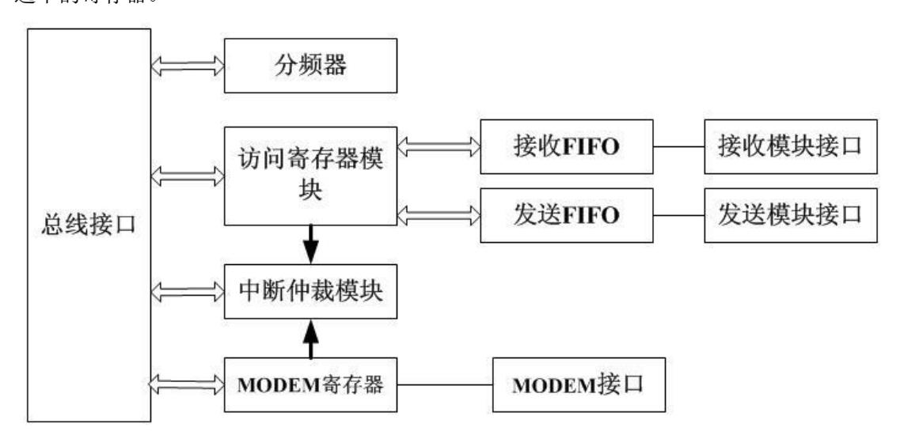

<span id="page-139-3"></span>图 15-1 UART 控制器结构

## <span id="page-139-0"></span>**15.4**寄存器描述

#### <span id="page-139-1"></span>**15.4.1** 数据寄存器(DAT)

中文名:数据传输寄存器

寄存器位宽: [7:0]

偏移量: 0x00 复位值: 0x00

<span id="page-139-4"></span>表 15-2 UART 数据寄存器

| 位域  | 位域名称    | 位宽 | 访问 | 描述      |
|-----|---------|----|----|---------|
| 7:0 | Tx FIFO | 8  | RW | 数据传输寄存器 |

#### <span id="page-139-2"></span>**15.4.2** 中断使能寄存器(IER)

中文名:中断使能寄存器

寄存器位宽: [7:0]


偏移量: 0x01 复位值: 0x00

<span id="page-140-2"></span>表 15-3 UART 中断使能寄存器

| 位域  | 位域名称     | 位宽 | 访问 | 描述                               |
|-----|----------|----|----|----------------------------------|
| 7:4 | Reserved | 4  | RW | 保留                               |
| 3   | IME      | 1  | RW | Modem 状态中断使能'0'–关闭<br>'1'–打<br>开 |
| 2   | ILE      | 1  | RW | 接收器线路状态中断使能'0'–关闭<br>'1'<br>–打开  |
| 1   | ITxE     | 1  | RW | 传输保存寄存器为空中断使能'0'–关闭'1'<br>–打开    |
| 0   | IRxE     | 1  | RW | 接收有效数据中断使能'0'–关闭<br>'1'–打<br>开   |

#### <span id="page-140-0"></span>**15.4.3** 中断标识寄存器(IIR)

中文名:中断源寄存器

寄存器位宽: [7:0]

偏移量: 0x02

复位值: 0xc1

<span id="page-140-3"></span>表 15-4 UART 中断标识寄存器

| 位域  | 位域名称     | 位宽 | 访问 | 描述          |
|-----|----------|----|----|-------------|
| 7:4 | Reserved | 4  | R  | 保留          |
| 3:1 | II       | 3  | R  | 中断源表示位,详见下表 |
| 0   | INTp     | 1  | R  | 中断表示位       |

#### 中断控制功能表:

<span id="page-140-4"></span>表 15-5 UART 中断控制功能表

| Bit 3 | Bit 2 | Bit 1 | 优先级     | 中断类型     | 中断源                  | 中断复位控制       |
|-------|-------|-------|---------|----------|----------------------|--------------|
| 0     | 1     | 1     | st<br>1 | 接收线路状态   | 奇偶、溢出或帧错误,           | 读 LSR        |
|       |       |       |         |          | 或打断中断                |              |
| 0     | 1     | 0     | nd<br>2 | 接收到有效数   | FIFO 的字符个数达到         | FIFO 的字符个数低于 |
|       |       |       |         | 据        | trigger 的水平          | trigger 的值   |
| 1     | 1     | 0     | nd<br>2 | 接收超时     | 在 FIFO 至少有一个字        | 读接收 FIFO     |
|       |       |       |         |          | 符,但在 4 个字符时间         |              |
|       |       |       |         |          | 内没有任何操作,包括           |              |
|       |       |       |         |          | 读和写操作                |              |
| 0     | 0     | 1     | rd<br>3 | 传输保存寄存   | 传输保存寄存器为空            | 写数据到 THR 或者多 |
|       |       |       |         | 器为空      |                      | IIR          |
| 0     | 0     | 0     | th<br>4 | Modem 状态 | CTS, DSR, RI or DCD. | 读 MSR        |

123

#### <span id="page-140-1"></span>**15.4.4** FIFO 控制寄存器(FCR)

中文名: FIFO 控制寄存器

寄存器位宽: [7:0] 偏移量: 0x02


复位值: 0xc0

#### <span id="page-141-2"></span>表 15-6 UART 的 FIFO 控制寄存器

| 位域  | 位域名称     | 位宽 | 访问 | 描述                               |
|-----|----------|----|----|----------------------------------|
| 7:6 | TL       | 2  | W  | 接收 FIFO 提出中断申请的 trigger 值'00'– 1 |
|     |          |    |    | 字节<br>'01'– 4 字节                 |
|     |          |    |    | '10'– 8 字节<br>'11'– 14 字节        |
| 5:3 | Reserved | 3  | W  | 保留                               |
| 2   | Txset    | 1  | W  | '1'清除发送 FIFO 的内容,复位其逻辑           |
| 1   | Rxset    | 1  | W  | '1'清除接收 FIFO 的内容,复位其逻辑           |
| 0   | Reserved | 1  | W  | 保留                               |

#### <span id="page-141-0"></span>**15.4.5** 线路控制寄存器(LCR)

中文名:线路控制寄存器

寄存器位宽: [7:0] 偏移量: 0x03 复位值: 0x03

#### <span id="page-141-3"></span>表 15-7 UART 线路控制寄存器

| 位域  | 位域名称 | 位宽 | 访问            | 描述                               |
|-----|------|----|---------------|----------------------------------|
| 7   | dlab | 1  | RW            | 分频锁存器访问位                         |
|     |      |    |               | '1'–访问操作分频锁存器                    |
|     |      |    | '0'–访问操作正常寄存器 |                                  |
| 6   | bcb  | 1  | RW            | 打断控制位                            |
|     |      |    |               | '1'–此时串口的输出被置为 0(打断状态).          |
|     |      |    |               | '0'–正常操作                         |
| 5   | spb  | 1  | RW            | 指定奇偶校验位                          |
|     |      |    |               | '0'–不用指定奇偶校验位                    |
|     |      |    |               | '1'–如果LCR[4]位是1则传输和检查奇偶校验位为0。    |
|     |      |    |               | 如果 LCR[4]位是 0 则传输和检查奇偶校验位为 1。    |
| 4   | eps  | 1  | RW            | 奇偶校验位选择                          |
|     |      |    |               | '0'–在每个字符中有奇数个 1(包括数据和奇偶校验       |
|     |      |    |               | 位)<br>'1'–在每个字符中有偶数个 1           |
| 3   | pe   | 1  | RW            | 奇偶校验位使能                          |
|     |      |    |               | '0'–没有奇偶校验位                      |
|     |      |    |               | '1'–在输出时生成奇偶校验位,输入则判断奇偶校验        |
|     |      |    |               | 位                                |
| 2   | sb   | 1  | RW            | 定义生成停止位的位数                       |
|     |      |    |               | '0'– 1 个停止位                      |
|     |      |    |               | '1'–在 5 位字符长度时是 1.5 个停止位,其他长度是 2 |
|     |      |    |               | 个停止位                             |
| 1:0 | bec  | 2  | RW            | 设定每个字符的位数                        |
|     |      |    |               | '00'– 5 位<br>'01'– 6 位           |
|     |      |    |               | '10'– 7 位<br>'11'– 8 位           |

#### <span id="page-141-1"></span>**15.4.6** MODEM 控制寄存器(MCR)

中文名: Modem 控制寄存器

寄存器位宽: [7:0]


偏移量: 0x04 复位值: 0x00

#### <span id="page-142-1"></span>表 15-8 UART 的 MODEM 控制寄存器

| 位域  | 位域名称     | 位宽 | 访问 | 描述                                                                                                                                               |
|-----|----------|----|----|--------------------------------------------------------------------------------------------------------------------------------------------------|
| 7:5 | Reserved | 3  | W  | 保留                                                                                                                                               |
| 4   | Loop     | 1  | W  | 回环模式控制位<br>'0'–正常操作<br>'1'–回环模式。在在回环模式中,TXD 输出<br>一直为 1,输出移位寄存器直接连到输入移位<br>寄存器中。其他连接如下。<br>DTR<br>DSR<br>RTS<br>CTS<br>Out1<br>RI<br>Out2<br>DCD |
| 3   | OUT2     | 1  | W  | 在回环模式中连到 DCD 输入                                                                                                                                  |
| 2   | OUT1     | 1  | W  | 在回环模式中连到 RI 输入                                                                                                                                   |
| 1   | RTSC     | 1  | W  | RTS 信号控制位                                                                                                                                        |
| 0   | DTRC     | 1  | W  | DTR 信号控制位                                                                                                                                        |

#### <span id="page-142-0"></span>**15.4.7** 线路状态寄存器(LSR)

中文名:线路状态寄存器

寄存器位宽: [7:0]

偏移量: 0x05 复位值: 0x00

<span id="page-142-2"></span>表 15-9 UART 线路状态寄存器

| 位域 | 位域名称  | 位宽 | 访问 | 描述                           |
|----|-------|----|----|------------------------------|
| 7  | ERROR | 1  | R  | 错误表示位                        |
|    |       |    |    | '1'–至少有奇偶校验位错误,帧错误或打断        |
|    |       |    |    | 中断的一个。                       |
|    |       |    |    | '0'–没有错误                     |
| 6  | TE    | 1  | R  | 传输为空表示位                      |
|    |       |    |    | '1'–传输 FIFO 和传输移位寄存器都为空。     |
|    |       |    |    | 给传输 FIFO 写数据时清零              |
|    |       |    |    | '0'–有数据                      |
| 5  | TFE   | 1  | R  | 传输 FIFO 位空表示位                |
|    |       |    |    | '1'–当前传输 FIFO 为空,给传输 FIFO 写数 |
|    |       |    |    | 据时清零                         |
|    |       |    |    | '0'–有数据                      |
| 4  | BI    | 1  | R  | 打断中断表示位                      |
|    |       |    |    | '1'–接收到起始位+数据+奇偶位+停止位        |
|    |       |    |    | 都是 0,即有打断中断                  |
|    |       |    |    | '0'–没有打断                     |
| 3  | FE    | 1  | R  | 帧错误表示位                       |
|    |       |    |    | '1'–接收的数据没有停止位               |
|    |       |    |    | '0'–没有错误                     |
| 2  | PE    | 1  | R  | 奇偶校验位错误表示位                   |
|    |       |    |    | '1'–当前接收数据有奇偶错误              |
|    |       |    |    | '0'–没有奇偶错误                   |
| 1  | OE    | 1  | R  | 数据溢出表示位                      |
|    |       |    |    | '1'–有数据溢出                    |


| 位域 | 位域名称 | 位宽 | 访问 | 描述              |
|----|------|----|----|-----------------|
|    |      |    |    | '0'–无溢出         |
| 0  | DR   | 1  | R  | 接收数据有效表示位       |
|    |      |    |    | '0'–在 FIFO 中无数据 |
|    |      |    |    | '1'–在 FIFO 中有数据 |

对这个寄存器进行读操作时,LSR[4:1]和 LSR[7]被清零,LSR[6:5]在给传输 FIFO 写数 据时清零,LSR[0]则对接收 FIFO 进行判断。

#### <span id="page-143-0"></span>**15.4.8** MODEM 状态寄存器(MSR)

中文名: Modem 状态寄存器

寄存器位宽: [7:0] 偏移量: 0x06 复位值: 0x00

<span id="page-143-2"></span>表 15-10 UART 的 MODEM 状态寄存器

| 位域 | 位域名称 | 位宽 | 访问 | 描述                        |
|----|------|----|----|---------------------------|
| 7  | CDCD | 1  | R  | DCD 输入值的反,或者在回环模式中连到 Out2 |
| 6  | CRI  | 1  | R  | RI 输入值的反,或者在回环模式中连到 OUT1  |
| 5  | CDSR | 1  | R  | DSR 输入值的反,或者在回环模式中连到 DTR  |
| 4  | CCTS | 1  | R  | CTS 输入值的反,或者在回环模式中连到 RTS  |
| 3  | DDCD | 1  | R  | DDCD 指示位                  |
| 2  | TERI | 1  | R  | RI 边沿检测。RI 状态从低到高变化       |
| 1  | DDSR | 1  | R  | DDSR 指示位                  |
| 0  | DCTS | 1  | R  | DCTS 指示位                  |

#### <span id="page-143-1"></span>**15.4.9** 分频锁存器

中文名:分频锁存器 1

寄存器位宽: [7:0]

偏移量: 0x00 复位值: 0x00

<span id="page-143-3"></span>表 15-11 UART 分频锁存器 1

| 位域  | 位域名称 | 位宽 | 访问 | 描述            |
|-----|------|----|----|---------------|
| 7:0 | LSB  | 8  | RW | 存放分频锁存器的低 8 位 |

中文名:分频锁存器 2

寄存器位宽: [7:0]

偏移量: 0x01

复位值: 0x00

<span id="page-143-4"></span>表 15-12 UART 分频锁存器 2

| 位域  | 位域名称 | 位宽 | 访问 | 描述            |
|-----|------|----|----|---------------|
| 7:0 | MSB  | 8  | RW | 存放分频锁存器的高 8 位 |


## <span id="page-144-0"></span>**16 CAN**

龙芯 2K1000 集成了两路 CAN 接口控制器。CAN 总线是由发送数据线 TX 和接收数据 线 RX 构成的串行总线,可发送和接收数据。器件与器件之间进行双向传送,最高传送速率 1Mbps。

## <span id="page-144-1"></span>**16.1**访问地址及引脚复用

两个 CAN 控制器内部寄存器的物理地址构成如下: 表 16-1 CAN 内部寄存器物理地址构成

<span id="page-144-3"></span>

| 地址位     | 构成       | 备注                |
|---------|----------|-------------------|
| [27:16] | BAR_BASE | Device 2 的基地址寄存器值 |
| [15:12] | 0        | 固定为 0             |
| [11:08] | CAN 编号   | 分别为 0xC 和 0xD     |
| [07:00] | REG      | 内部寄存器地址           |

对于 CAN 模块,使用时要注意将对应的引脚设置为相应的功能。

与 CAN 相关的引脚设置寄存器为 [5.1](#page-51-0) 节中的 can\_sel。

### <span id="page-144-2"></span>**16.2**标准模式

地址区包括控制段和信息缓冲区,控制段在初始化载入是可被编程来配置通讯参数的, 应发送的信息会被写入发送缓冲器,成功接收信息后,微控制器从接收缓冲器中读取接收的 信息,然后释放空间以做下一步应用。

初始载入后,寄存器的验收代码,验收屏蔽,总线定时寄存器 0 和 1 以及输出控制就 不能改变了。只有控制寄存器的复位位被置高时,才可以访问这些寄存器。在复位模式和工 作模式两种不同的模式中,访问寄存器是不同的。当硬件复位或控制器掉线,状态寄存器的 总线状态位时会自动进入复位模式。工作模式是通过置位控制寄存器的复位请求位激活的。

在标准模式下,CAN 控制器将 ID[10:3]的值和验收代码的值相同的消息包存入接收缓 冲区。如果验收屏蔽码的某位为 1,则验收码对应的位不参与对 ID 的检查。


#### 表 13-2 CAN 控制器标准模式下寄存器定义

|        |       |                     | 工作模式                | 复位模式   |        |
|--------|-------|---------------------|---------------------|--------|--------|
| CAN 地址 | 段     | 读                   | 写                   | 读      | 写      |
| 0      |       | 控制                  | 控制                  | 控制     | 控制     |
| 1      |       | FF                  | 命令                  | FF     | 命令     |
| 2      |       | 状态                  | -                   | 状态     | -      |
| 3      |       | FF                  | -                   | 中断     | -      |
| 4      |       | FF                  | -                   | 验收代码   | 验收代码   |
| 5      |       | FF                  | -                   | 验收屏蔽   | 验收屏蔽   |
| 6      |       | FF                  | -                   | 总线定时 0 | 总线定时 0 |
| 7      |       | FF                  | -                   | 总线定时 1 | 总线定时 1 |
| 8      |       | 保留                  | 保留                  | 保留     | 保留     |
| 9      | 控制    | 保留                  | 保留                  | 保留     | 保留     |
| 10     |       | ID(10-3)            | ID(10-3)            | FF     | -      |
|        |       | ID(2-0),            | ID(2-0),            |        |        |
| 11     |       | RTR,DLC             | RTR,DLC             | FF     | -      |
| 12     |       | 数据字节 1              | 数据字节 1              | FF     | -      |
| 13     |       | 数据字节 2              | 数据字节 2              | FF     | -      |
| 14     |       | 数据字节 3              | 数据字节 3              | FF     | -      |
| 15     |       | 数据字节 4              | 数据字节 4              | FF     | -      |
| 16     |       | 数据字节 5              | 数据字节 5              | FF     | -      |
| 17     |       | 数据字节 6              | 数据字节 6              | FF     | -      |
| 18     |       | 数据字节 7              | 数据字节 7              | FF     | -      |
| 19     | 发送缓冲器 | 数据字节 8              | 数据字节 8              | FF     | -      |
| 20     |       | ID(10-3)            | ID(10-3)            | FF     | -      |
| 21     |       | ID(2-0),<br>RTR,DLC | ID(2-0),<br>RTR,DLC | FF     | -      |
| 22     |       | 数据字节 1              | 数据字节 1              | FF     | -      |
| 23     |       | 数据字节 2              | 数据字节 2              | FF     | -      |
| 24     |       | 数据字节 3              | 数据字节 3              | FF     | -      |
| 25     |       | 数据字节 4              | 数据字节 4              | FF     | -      |
| 26     |       | 数据字节 5              | 数据字节 5              | FF     | -      |
| 27     |       | 数据字节 6              | 数据字节 6              | FF     | -      |
| 28     |       | 数据字节 7              | 数据字节 7              | FF     | -      |
| 29     | 接收缓冲器 | 数据字节 8              | 数据字节 8              | FF     | -      |

#### <span id="page-145-0"></span>**16.2.1** 控制寄存器(CR)

中文名:控制寄存器

寄存器位宽: [7:0]

偏移量: 0x00

复位值: 0x01

读此位的值总是逻辑 1。在硬启动或总线状态位设置为 1(总线关闭)时,复位请求位 被置为 1。如果这些位被软件访问,其值将发生变化而且会影响内部时钟的下一个上升沿, 在外部复位期间微控制器不能把复位请求位置为 0。如果把复位请求位设为 0,微控制器就


必须检查这一位以保证外部复位引脚不保持为低。复位请求位的变化是同内部分频时钟同步 的。读复位请求位能够反映出这种同步状态。

复位请求位被设为 0 后控制器将会等待

- a) 一个总线空闲信号(11 个弱势位),如果前一次复位请求是硬件复位或 CPU 初始 复位。
- b) 128 个总线空闲,如果前一次复位请求是 CAN 控制器在重新进入总线开启模式前初 始化总线造成的。

表 13-3 CAN 控制器标准模式下的控制寄存器格式

| 位域  | 位域名称    | 位宽 | 访问 | 描述     |
|-----|---------|----|----|--------|
| 7:5 | Reserve | 3  | -  | 保留     |
| 4   | OIE     | 1  | RW | 溢出中断使能 |
| 3   | EIE     | 1  | RW | 错误中断使能 |
| 2   | TIE     | 1  | RW | 发送中断使能 |
| 1   | RIE     | 1  | RW | 接收中断使能 |
| 0   | RR      | 1  | RW | 复位请求   |

#### <span id="page-146-0"></span>**16.2.2** 命令寄存器(CMR)

中文名:命令寄存器

寄存器位宽: [7:0]

偏移量: 0x01

复位值: 0x00

命令寄存器对微控制器来说是只写存储器如果去读这个地址返回值是 0xff 表 13-4 CAN 控制器标准模式下命令寄存器格式

| 位域  | 位域名称    | 位宽 | 访问 | 描述      |
|-----|---------|----|----|---------|
| 7   | EFF     | 1  | W  | 扩展模式    |
| 6:5 | Reserve | 2  | -  | 保留      |
| 4   | GTS     | 1  | W  | 睡眠      |
| 3   | CDO     | 1  | W  | 清除数据溢出  |
| 2   | RRB     | 1  | W  | 释放接收缓冲器 |
| 1   | AT      | 1  | W  | 中止发送    |
| 0   | TR      | 1  | W  | 发送请求    |

#### <span id="page-146-1"></span>**16.2.3** 状态寄存器(SR)

中文名:状态寄存器

寄存器位宽: [7:0]

偏移量: 0x02

复位值: 0x00

129 表 13-5 CAN 控制器标准模式下状态寄存器格式


| 位域 | 位域名称 | 位宽 | 访问 | 描述      |
|----|------|----|----|---------|
| 7  | BS   | 1  | R  | 总线状态    |
| 6  | ES   | 1  | R  | 出错状态    |
| 5  | TS   | 1  | R  | 发送状态    |
| 4  | RS   | 1  | R  | 接收状态    |
| 3  | TCS  | 1  | R  | 发送完毕状态  |
| 2  | TBS  | 1  | R  | 发送缓存器状态 |
| 1  | DOS  | 1  | R  | 数据溢出状态  |
| 0  | RBS  | 1  | R  | 接收缓存器状态 |

#### <span id="page-147-0"></span>**16.2.4** 中断寄存器(IR)

中文名:中断寄存器

寄存器位宽: [7:0]

偏移量: 0x03

复位值: 0x00

表 13-6 CAN 控制器标准模式下中断寄存器格式

| 位域  | 位域名称     | 位宽 | 访问 | 描述     |
|-----|----------|----|----|--------|
| 7:5 | Reserved | 1  | R  | 保留     |
| 4   | WUI      | 1  | R  | 唤醒中断   |
| 3   | DOI      | 1  | R  | 数据溢出中断 |
| 2   | EI       | 1  | R  | 错误中断   |
| 1   | TI       | 1  | R  | 发送中断   |
| 0   | RI       | 1  | R  | 接收中断   |

#### <span id="page-147-1"></span>**16.2.5** 验收代码寄存器(ACR)

中文名:验收代码寄存器

寄存器位宽: [7:0]

偏移量: 0x04

复位值: 0x00

在复位情况下,该寄存器是可以读写的。

表 16-7 CAN 验收代码寄存器

| 位域  | 位域名称 | 位宽 | 访问 | 描述      |
|-----|------|----|----|---------|
| 7:0 | AC   | 8  | RW | ID 验收代码 |

#### <span id="page-147-2"></span>**16.2.6** 验收屏蔽寄存器(AMR)

中文名:验收屏蔽寄存器

寄存器位宽: [7:0]

偏移量: 0x05

复位值: 0x00


验收代码位 AC 和信息识别码的高 8 位 ID.10-ID.3 相等且与验收屏蔽位 AM 的相应位 相或为 1 时数据可以接收。在复位情况下,该寄存器是可以读写的。

表 16-8 CAN 验收屏蔽寄存器

| 位域  | 位域名称 | 位宽 | 访问 | 描述     |
|-----|------|----|----|--------|
| 7:0 | AM   | 8  | RW | ID 屏蔽位 |

#### <span id="page-148-0"></span>**16.2.7** 发送缓冲区列表

缓冲器是用来存储微控制器要 CAN 控制器发送的信息,它被分为描述符区和数据区。 发送缓冲器的读/写只能由微控制器在工作模式下完成,在复位模式下读出的值总是 0xff。 表 13-9 CAN 控制器标准模式下发送缓冲区格式

| 地址 | 区     | 名称      | 数据位              |
|----|-------|---------|------------------|
| 10 |       | 识别码字节 1 | ID(10-3)         |
|    |       |         |                  |
| 11 |       | 识别码字节 2 | ID(2-0), RTR,DLC |
| 12 |       | TX 数据 1 | TX 数据 1          |
| 13 |       | TX 数据 2 | TX 数据 2          |
| 14 |       | TX 数据 3 | TX 数据 3          |
| 15 |       | TX 数据 4 | TX 数据 4          |
| 16 |       | TX 数据 5 | TX 数据 5          |
| 17 |       | TX 数据 6 | TX 数据 6          |
| 18 |       | TX 数据 7 | TX 数据 7          |
| 19 | 发送缓冲器 | TX 数据 8 | TX 数据 8          |

#### <span id="page-148-1"></span>**16.2.8** 接收缓冲区列表

接收缓冲区的配置和发送缓冲区的一样,只是地址变为 20-29。

## <span id="page-148-2"></span>**16.3**扩展模式

在扩展模式下,允许使用 11 位 ID 的标准帧和 29 位 ID 的扩展帧(是标准帧还是扩展 帧由 TX 帧信息的最高位 IDE 位确定)。

在扩展模式下,CAN 控制器可以接收 11 位 ID 的标准帧也可以接收 29 位 ID 的扩展帧。 在接收不同格式的帧的时候,验收代码 0~验收代码 3(code0 ~ code3)所检查的内容有所 不同。验收屏蔽码 0~验收屏蔽码 3(mask0 ~ mask3)对应验收代码 0~验收代码 3。如果验 收屏蔽码的某 1 位为 1,则对应的验收代码的那一位就不参与对接收包的 ID 的检查。

在扩展模式下,CAN 控制器可以对接收到的消息包进行单滤波也可以进行双滤波。在 进行单滤波时,验收代码 0~验收代码 3 仅对单一 ID 进行过滤。在进行双滤波时,验收代 码 0~验收代码 3 可以对两个不同的 ID 进行。CAN 控制器只将 ID 符合滤波条件的消息包 存入接收缓冲区。

对 11 位 ID 包的单滤波:


允许将 rdata0 和 rdata1 用来扩展对 ID 的验收长度

(rx\_id[10:3] == code0)&&(rtr == code1[4])&&(rx\_id[2:0] == code1[7:5])&&(rx\_data0 == code2)&&(rx\_data1 == code3)

对 11 位 ID 包的双滤波:

(rx\_id[10:3] == code0)&&(rtr == code1[4])&&(rx\_id[2:0] == code1[7:5])&&(rx\_data0 == {code1[3:0],code3[3:0]})

或者

(rx\_id[10:3] == code2)&&(rtr == code3[4])&&(rx\_id[2:0] == code3[7:5])

对 29 位 ID 包的单滤波:

(rx\_id[28:21] == code0) && (rx\_id[20:13] == code1)&&(rx\_id[12:5] == code2)&&(rtr == code3[2])&&(rx\_id[4:0] == code3[7:3])

对 29 位 ID 的双滤波:

(rx\_id[28:21] == code0) && (rx\_id[20:13] == code1)

或者

(rx\_id[28:21] == code2) && (rx\_id[20:13] == code3) 表 13-10 扩展模式下 CAN 控制器的地址列表

| 地<br>CAN | 工作模式             |                 | 复位模式         |           |
|----------|------------------|-----------------|--------------|-----------|
| 址        | 读                | 写               | 读            | 写         |
| 0        | 控制               | 控制              | 控制           | 控制        |
| 1        | 0                | 命令              | 0            | 命令        |
| 2        | 状态               | -               | 状态           | -         |
| 3        | 中断               | -               | 中断           | -         |
| 4        | 中断使能             | 中断使能            | 中断使能         | 中断使能      |
| 5        | -                | -               | 验收屏蔽         | 验收屏蔽      |
| 6        | 总线定时<br>0        | -               | 总线定时<br>0    | 总线定时<br>0 |
| 7        | 总线定时<br>1        | -               | 总线定时<br>1    | 总线定时<br>1 |
| 8        | 保留               | 保留              | 保留           | 保留        |
| 9        | 保留               | 保留              | 保留           | 保留        |
| 10       | 保留               | 保留              | 保留           | 保留        |
| 11       | 仲裁丢失捕捉           | -               | 仲裁丢失捕捉       | -         |
| 12       | 错误代码捕捉           | -               | 错误代码捕捉       | -         |
| 13       | 错误警报限制           | -               | 错误警报限制       | -         |
| 14       | 错误计数器<br>RX      | -               | 错误计数器<br>RX  | -         |
| 15       | 错误计数器<br>TX      | -               | 错误计数器<br>TX  | -         |
|          |                  |                 | 验收代码<br>0    |           |
|          |                  |                 | Id[28:21](扩展 |           |
|          | 帧信息<br>RX        | 帧信息<br>TX       | 帧)           |           |
|          | {IDE,RTR,2'h0,DL | {IDE,RTR,2'h0,D | Id[10:3](非扩展 | 验收代码<br>0 |
| 16       | C[3:0]}          | LC[3:0]}        | 帧)           |           |
|          | RX_Id[28:21] (扩  | TX_Id[28:21]    | 验收代码<br>1    |           |
|          | 展帧)              | (扩展帧)           | Id[20:13](扩展 | 验收代码<br>1 |
| 17       | RX_Id[10:3] (非   | TX_Id[10:3] (非  | 帧)           |           |

132


| 地<br>CAN | 工作模式               |                   | 复位模式            |           |
|----------|--------------------|-------------------|-----------------|-----------|
| 址        | 扩展帧)               | 扩展帧)              | {Id[2:0],RTR,4' |           |
|          |                    |                   | h0}(非扩展帧,       |           |
|          |                    |                   | 单滤波)            |           |
|          |                    |                   |                 |           |
|          |                    |                   | {Id[2:0],RTR,da |           |
|          |                    |                   | ta0[7:4] }(非扩   |           |
|          |                    |                   | 展帧,双滤波)         |           |
|          |                    |                   | {Id[2:0],RTR,4' |           |
|          |                    |                   | h0] }(非扩展       |           |
|          |                    |                   | 帧,单滤波)          |           |
|          |                    |                   | 验收代码<br>2       |           |
|          |                    |                   | Id2[28:21](扩    |           |
|          |                    |                   | 展帧,双滤波)         |           |
|          |                    |                   | Id[12:5](扩展     |           |
|          |                    |                   | 帧,单滤波)          |           |
|          |                    |                   | Id2[10:3](非扩    |           |
|          | RX_Id[20:13](扩展    | TX_Id[20:13](扩    | 展帧,双滤波)         |           |
|          | 帧)                 | 展帧)               |                 |           |
|          | {RX_Id[2:0],5'h0}( | {TX_Id[2:0],5'h0  | Data0(非扩展       | 验收代码<br>2 |
| 18       | 非扩展帧)              | }(非扩展帧)           | 帧,单滤波)          |           |
|          |                    |                   | 验收代码<br>3       |           |
|          |                    |                   | Id2[20:13](扩    |           |
|          |                    |                   | 展帧,双滤波)         |           |
|          |                    |                   | {id[4:0],RTR,2' |           |
|          |                    |                   | h0}(扩展帧,        |           |
|          |                    |                   | 单滤波)            |           |
|          |                    |                   | {id2[2:0],RTR,d |           |
|          |                    | Id[12:5](扩展<br>TX | ata0[3:0]}(非扩   |           |
|          | Id[12:5](扩展<br>RX  | 帧)                | 展帧,双滤波)         |           |
|          | 帧)                 | data0(非扩展<br>TX   | Data1(非扩展       | 验收代码<br>3 |
| 19       | data0(非扩展帧)<br>RX  | 帧)                | 帧,单滤波)          |           |
|          |                    | {TX_id[4:0],3'h0  |                 |           |
|          | {RX_id[4:0],3'h0}  | }(扩展帧)            | 验收屏蔽<br>0       |           |
|          | (扩展帧)              | data1(非扩展<br>TX   | (不判断为<br>1      |           |
|          | data1(非扩展帧)        | 帧)                | 的那位的<br>值)      | 验收屏蔽      |
| 20       | RX                 |                   | id              | 0         |
|          |                    | data0(扩展帧)<br>TX  |                 |           |
|          | data0(扩展帧)<br>RX   | data2(非扩展<br>TX   |                 |           |
| 21       | data2(非扩展帧)<br>RX  | 帧)                | 验收屏蔽<br>1       | 验收屏蔽<br>1 |
|          |                    | data1(扩展帧)<br>TX  |                 |           |
|          | data1(扩展帧)<br>RX   | data3(非扩展<br>TX   |                 |           |
| 22       | data3(非扩展帧)<br>RX  | 帧)                | 验收屏蔽<br>2       | 验收屏蔽<br>2 |
|          | data2(扩展帧)<br>RX   | data2(扩展帧)<br>TX  |                 |           |
|          | RX Data4(非扩展       | TX Data4(非扩展      |                 |           |
| 23       | 帧)                 | 帧)                | 验收屏蔽<br>3       | 验收屏蔽<br>3 |
|          |                    | data3(扩展帧)<br>TX  |                 |           |
|          | data3(扩展帧)<br>RX   | data5(非扩展<br>TX   |                 |           |
| 24       | data5(非扩展帧)<br>RX  | 帧)                | -               | -         |
|          |                    | data4(扩展帧)<br>TX  |                 |           |
|          | data4(扩展帧)<br>RX   | data6(非扩展<br>TX   |                 |           |
|          |                    |                   |                 |           |
| 25       | data6(非扩展帧)<br>RX  | 帧)                | -               | -         |
|          | data5(扩展帧)<br>RX   | data5(扩展帧)<br>TX  |                 |           |
| 26       | data7(非扩展帧)<br>RX  | data7(非扩展<br>TX   | -               | -         |


| 地<br>CAN | 工作模式             |                  | 复位模式        |   |
|----------|------------------|------------------|-------------|---|
| 址        |                  | 帧)               |             |   |
|          | data6(扩展帧)<br>RX | data6(扩展帧)<br>TX |             |   |
| 27       |                  |                  | -           | - |
| 28       | data7(扩展帧)<br>RX | data7(扩展帧)<br>TX | -           | - |
| 29       | 信息计数器<br>RX      | -                | 信息计数器<br>RX | - |

#### <span id="page-151-0"></span>**16.3.1** 模式寄存器(MOD)

中文名:模式寄存器

寄存器位宽: [7:0]

偏移量: 0x00

复位值: 0x01

读此位的值总是逻辑 1。在硬启动或总线状态位设置为 1(总线关闭)时,复位请求位 被置为 1。如果这些位被软件访问,其值将发生变化而且会影响内部时钟的下一个上升沿, 在外部复位期间微控制器不能把复位请求位置为 0。如果把复位请求位设为 0,微控制器就 必须检查这一位以保证外部复位引脚不保持为低。复位请求位的变化是同内部分频时钟同步 的。读复位请求位能够反映出这种同步状态。

复位请求位被设为 0 后控制器将会等待

- a) 一个总线空闲信号(11 个弱势位),如果前一次复位请求是硬件复位或 CPU 初始 复位。
- b) 128 个总线空闲,如果前一次复位请求是 CAN 控制器在重新进入总线开启模式前初 始化总线造成的。

表 13-11 CAN 控制器扩展模式下的模式寄存器格式

| 位域  | 位域名称    | 位宽 | 访问 | 描述                       |
|-----|---------|----|----|--------------------------|
| 7:5 | Reserve | 3  | -  | 保留                       |
| 4   | SM      | 1  | RW | 睡眠模式                     |
| 3   | AFM     | 1  | RW | 单/双滤波模式(0 为双滤波,仅复位模式可写)  |
| 2   | STM     | 1  | RW | 正常工作模式(1 为自测试模式,仅复位模式可写) |
| 1   | LOM     | 1  | RW | 只听模式(仅复位模式可写)            |
| 0   | RM      | 1  | RW | 复位模式                     |

#### <span id="page-151-1"></span>**16.3.2** 命令寄存器(CMR)

中文名:命令寄存器

寄存器位宽: [7:0]

偏移量: 0x01

复位值: 0x00

命令寄存器对微控制器来说是只写存储器如果去读这个地址返回值是 0xff


#### 表 13-12 CAN 控制器扩展模式下命令寄存器格式

| 位域  | 位域名称    | 位宽 | 访问 | 描述                  |
|-----|---------|----|----|---------------------|
| 7   | EFF     | 1  | W  | 扩展模式(仅在复位模式下可写)     |
| 6:5 | Reserve | 2  | -  | 保留                  |
| 4   | SRR     | 1  | W  | 自接收请求(和 TR 不能同时为 1) |
| 3   | CDO     | 1  | W  | 清除数据溢出              |
| 2   | RRB     | 1  | W  | 释放接收缓冲器             |
| 1   | AT      | 1  | W  | 中止发送                |
| 0   | TR      | 1  | W  | 发送请求(和 SRR 不能同时为 1) |

#### <span id="page-152-0"></span>**16.3.3** 状态寄存器(SR)

中文名:状态寄存器

寄存器位宽: [7:0]

偏移量: 0x02

复位值: 0x00

#### 表 13-13 CAN 控制器扩展模式下状态寄存器格式

| 位域 | 位域名称 | 位宽 | 访问 | 描述      |
|----|------|----|----|---------|
| 7  | BS   | 1  | R  | 总线状态    |
| 6  | ES   | 1  | R  | 出错状态    |
| 5  | TS   | 1  | R  | 发送状态    |
| 4  | RS   | 1  | R  | 接收状态    |
| 3  | TCS  | 1  | R  | 发送完毕状态  |
| 2  | TBS  | 1  | R  | 发送缓存器状态 |
| 1  | DOS  | 1  | R  | 数据溢出状态  |
| 0  | RBS  | 1  | R  | 接收缓存器状态 |

#### <span id="page-152-1"></span>**16.3.4** 中断寄存器(IR)

中文名:中断寄存器

寄存器位宽: [7:0]

偏移量: 0x03

复位值: 0x00

表 13-14 CAN 控制器扩展模式下中断寄存器格式

| 位域 | 位域名称 | 位宽 | 访问 | 描述     |
|----|------|----|----|--------|
| 7  | BEI  | 1  | R  | 总线错误中断 |
| 6  | ALI  | 1  | R  | 仲裁丢失中断 |
| 5  | EPI  | 1  | R  | 错误消极中断 |
| 4  | WUI  | 1  | R  | 唤醒中断   |
| 3  | DOI  | 1  | R  | 数据溢出中断 |
| 2  | EI   | 1  | R  | 错误中断   |
| 1  | TI   | 1  | R  | 发送中断   |
| 0  | RI   | 1  | R  | 接收中断   |


#### <span id="page-153-0"></span>**16.3.5** 中断使能寄存器(IER)

中文名:中断使能寄存器

寄存器位宽: [7:0]

偏移量: 0x04

复位值: 0x00

#### 表 13-15 CAN 控制器扩展模式下中断使能寄存器格式

| 位域 | 位域名称 | 位宽 | 访问 | 描述       |
|----|------|----|----|----------|
| 7  | BEIE | 1  | RW | 总线错误中断使能 |
| 6  | ALIE | 1  | RW | 仲裁丢失中断使能 |
| 5  | EPIE | 1  | RW | 错误消极中断使能 |
| 4  | WUIE | 1  | RW | 唤醒中断使能   |
| 3  | DOIE | 1  | RW | 数据溢出中断使能 |
| 2  | EIE  | 1  | RW | 错误中断使能   |
| 1  | TIE  | 1  | RW | 发送中断使能   |
| 0  | RIE  | 1  | RW | 接收中断使能   |

#### <span id="page-153-1"></span>**16.3.6** 仲裁丢失捕捉寄存器

中文名:仲裁丢失捕捉寄存器

寄存器位宽: [7:0]

偏移量: 0xB

复位值: 0x00

#### 表 13-16 CAN 控制器扩展模式下仲裁丢失捕捉寄存器格式

| 位域  | 位域名称   | 位宽 | 访问 | 描述  |
|-----|--------|----|----|-----|
| 7:5 | -      | 3  | R  | 保留  |
| 4   | BITNO4 | 1  | R  | 第四位 |
| 3   | BITNO3 | 1  | R  | 第三位 |
| 2   | BITNO2 | 1  | R  | 第二位 |
| 1   | BITNO1 | 1  | R  | 第一位 |
| 0   | BITNO0 | 1  | R  | 第零位 |


| 位      |        |        |        | 上洲土体   | TÁ ÁL |                 |
|--------|--------|--------|--------|--------|-------|-----------------|
| ALC. 4 | ALC. 3 | ALC. 2 | ALC. 1 | ALC. 0 | 十进制值  | 功能              |
| 0      | 0      | 0      | 0      | 0      | 0     | 仲裁丢失在识别码的bit1   |
| 0      | 0      | 0      | 0      | 1      | 1     | 仲裁丢失在识别码的bit2   |
| 0      | 0      | 0      | 1      | 0      | 2     | 仲裁丢失在识别码的bit3   |
| 0      | 0      | 0      | 1      | 1      | 3     | 仲裁丢失在识别码的bit4   |
| 0      | 0      | 1      | 0      | 0      | 4     | 仲裁丢失在识别码的bit5   |
| 0      | 0      | 1      | 0      | 1      | 5     | 仲裁丢失在识别码的bit6   |
| 0      | 0      | 1      | 1      | 0      | 6     | 仲裁丢失在识别码的bit7   |
| 0      | 0      | 1      | 1      | 1      | 7     | 仲裁丢失在识别码的bit8   |
| 0      | 1      | 0      | 0      | 0      | 8     | 仲裁丢失在识别码的bit9   |
| 0      | 1      | 0      | 0      | 1      | 9     | 仲裁丢失在识别码的bit10  |
| 0      | 1      | 0      | 1      | 0      | 10    | 仲裁丢失在识别码的bit11  |
| 0      | 1      | 0      | 1      | 1      | 11    | 仲裁丢失在SRTR位      |
| 0      | 1      | 1      | 0      | 0      | 12    | 仲裁丢失在IDE位       |
| 0      | 1      | 1      | 0      | 1      | 13    | 仲裁丢失在识别码的bit12  |
| 0      | 1      | 1      | 1      | 0      | 14    | 仲裁丢失在识别码的bit13  |
| 0      | 1      | 1      | 1      | 1      | 15    | 仲裁丢失在识别码的bit14  |
| 1      | 0      | 0      | 0      | 0      | 16    | 仲裁丢失在识别码的bit15  |
| 1      | 0      | 0      | 0      | 1      | 17    | 仲裁丢失在识别码的bit16  |
| 1      | 0      | 0      | 1      | 0      | 18    | 仲裁丢失在识别码的bit17  |
| 1      | 0      | 0      | 1      | 1      | 19    | 仲裁丢失在识别码的bit18  |
| 1      | 0      | 1      | 0      | 0      | 20    | 仲裁丢失在识别码的bit19  |
| 1      | 0      | 1      | 0      | 1      | 21    | 仲裁丢失在识别码的bit20  |
| 1      | 0      | 1      | 1      | 0      | 22    | 仲裁丢失在识别码的bit21  |
| 1      | 0      | 1      | 1      | 1      | 23    | 仲裁丢失在识别码的bit22  |
| 1      | 1      | 0      | 0      | 0      | 24    | 仲裁丢失在识别码的bit23  |
| 1      | 1      | 0      | 0      | 1      | 25    | 仲裁丢失在识别码的bit24; |
| 1      | 1      | 0      | 1      | 0      | 26    | 仲裁丢失在识别码的bit25; |
| 1      | 1      | 0      | 1      | 1      | 27    | 仲裁丢失在识别码的bit26; |
| 1      | 1      | 1      | 0      | 0      | 28    | 仲裁丢失在识别码的bit27  |
| 1      | 1      | 1      | 0      | 1      | 29    | 仲裁丢失在识别码的bit28  |
| 1      | 1      | 1      | 1      | 0      | 30    | 仲裁丢失在识别码的bit29  |
| 1      | 1      | 1      | 1      | 1      | 31    | 仲裁丢失在RTR位       |

#### <span id="page-154-0"></span>**16.3.7** 错误警报限制寄存器(EMLR)

中文名:错误警报限制寄存器

寄存器位宽: [7:0]

偏移量: 0xD

复位值: 0x60

表 16-17 CAN 错误劲爆限制寄存器

| 位域  | 位域名称 | 位宽 | 访问 | 描述     |
|-----|------|----|----|--------|
| 7:0 | EML  | 8  | RW | 错误警报阀值 |


#### <span id="page-155-0"></span>**16.3.8** RX 错误计数寄存器(RXERR)

中文名: RX 错误计数寄存器

寄存器位宽: [7:0] 偏移量: 0xE 复位值: 0x60

表 16-18 CAN 的 RX 错误计数寄存器

| 位域  | 位域名称  | 位宽 | 访问 | 描述     |
|-----|-------|----|----|--------|
| 7:0 | RXERR | 8  | R  | 接收错误计数 |

#### <span id="page-155-1"></span>**16.3.9** TX 错误计数寄存器(TXERR)

中文名: TX 错误计数寄存器

寄存器位宽: [7:0]

偏移量: 0xF 复位值: 0x60

表 16-19 CAN 的 TX 错误计数寄存器

| 位域  | 位域名称  | 位宽 | 访问 | 描述     |
|-----|-------|----|----|--------|
| 7:0 | TXERR | 8  | R  | 发送错误计数 |

#### <span id="page-155-2"></span>**16.3.10** 验收滤波器

在验收滤波器的帮助下,只有当接收信息中的识别位和验收滤波器预定义的值相等时, CAN 控制器才允许将已接收信息存入 RXFIFO。验收滤波器由验收代码寄存器和验收屏蔽 寄存器定义。在模式寄存器中选择单滤波器模式或者双滤波器模式。具体的配置可以参考 SJA1000 的数据手册。

#### <span id="page-155-3"></span>**16.3.11** RX 信息计数寄存器(RMCR)

中文名: RX 信息计数寄存器

寄存器位宽: [7:0] 偏移量: 0x1D

复位值: 0x00

表 16-20 CAN 的 RX 错信息计数寄存器

| 位域  | 位域名称 | 位宽 | 访问 | 描述        |
|-----|------|----|----|-----------|
| 7:0 | RMCR | 8  | R  | 接收的数据帧计数器 |

## <span id="page-155-4"></span>**16.4**公共寄存器

<span id="page-155-5"></span>1bit time = internal\_clock\_time \* ( ( BRP + 1) \* 2) \*( 1+ ( TESG2 + 1 ) + ( TESG1 + 1)) **16.4.1** 总线定时寄存器 0(BTR0)

中文名:总线定时寄存器

寄存器位宽: [7:0]


偏移量: 0x06 复位值: 0x00

注:在复位模式是可以读写的,工作模式是只读的。

表 16-21 CAN 总线定时寄存器 0

| 位域  | 位域名称 | 位宽 | 访问 | 描述      |
|-----|------|----|----|---------|
| 7:6 | SJW  | 8  | RW | 同步跳转宽度  |
| 5:0 | BRP  | 8  | RW | 波特率分频系数 |

#### <span id="page-156-0"></span>**16.4.2** 总线定时寄存器 1(BTR1)

中文名:总线定时寄存器 1

寄存器位宽: [7:0]

偏移量: 0x07

复位值: 0x00

表 16-22 CAN 总线定时寄存器 1

| 位域  | 位域名称  | 位宽 | 访问 | 描述                  |
|-----|-------|----|----|---------------------|
| 7   | SAM   | 1  | RW | 为 1 时三次采样,否则是一次采用   |
| 6:4 | TESG2 | 3  | RW | 一个 bit 中的时间段 2 的计数值 |
| 3:0 | TSEG1 | 4  | RW | 一个 bit 中的时间段 1 的计数值 |

#### <span id="page-156-1"></span>**16.4.3** 输出控制寄存器(OCR)

中文名:输出控制寄存器

寄存器位宽: [7:0]

偏移量: 0x08

复位值: 0x00

表 16-23 CAN 输出控制寄存器

| 位域  | 位域名称 | 位宽 | 访问 | 描述      |
|-----|------|----|----|---------|
| 7:0 | OCR  | 8  | RW | 保留(未使用) |


## <span id="page-157-0"></span>**17 I2C** 控制器

## <span id="page-157-1"></span>**17.1**概述

本章给出I2C的详细描述和配置使用。本系统芯片集成了I2C接口,主要用于实现两个 器件之间数据的交换。I2C 总线是由数据线 SDA 和时钟 SCL 构成的串行总线,可发送和接 收数据。器件与器件之间进行双向传送,最高传送速率 400kbps。

## <span id="page-157-2"></span>**17.2**访问地址及引脚复用

两个 I2C 控制器内部寄存器的物理地址构成如下:

| 地址位     | 构成       | 备注                      |
|---------|----------|-------------------------|
| [27:16] | BAR_BASE | Device 2 的基地址寄存器值       |
| [15:12] | 1        | 固定为 1                   |
| [11]    | I2C 编号   | 0x0 代表 I2C0;0x1 代表 I2C1 |
| [10:03] | 0        | 保留                      |
| [02:00] | REG      | 内部寄存器地址                 |

对于 I2C 模块,使用时要注意将对应的引脚设置为相应的功能。

与 I2C 相关的引脚设置寄存器为 [5.1](#page-51-0) 节中的 i2c\_sel。

## <span id="page-157-3"></span>**17.3 I2C** 控制器结构

I2C 主控制器的结构,主要模块有,时钟发生器(Clock Generator)、字节命令控制器 (Byte Command Controller)、位命令控制器(Bit Command controller)、数据移位寄存器 (Data Shift Register)。其余为 APB 总线接口和一些寄存器。

- 1) 时钟发生器模块:产生分频时钟,同步位命令的工作。
- 2) 字节命令控制器模块:将一个命令解释为按字节操作的时序,即把字节操作分解 为位操作。
  - 3) 位命令控制器模块:进行实际数据的传输,以及位命令信号产生。
  - 4) 数据移位寄存器模块:串行数据移位。


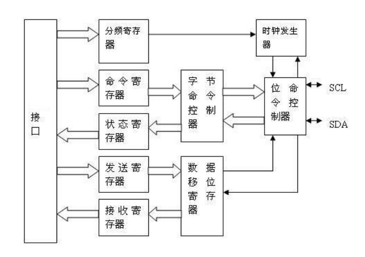

<span id="page-158-4"></span>图 17-1 I2C 主控制器结构

## <span id="page-158-0"></span>**17.4 I2C** 控制器寄存器说明

本芯片集成了两个 I2C 控制器 I2C-0、I2C-1。

#### <span id="page-158-1"></span>**17.4.1** 分频锁存器低字节寄存器(PRERlo)

中文名:分频锁存器低字节寄存器

寄存器位宽: [7:0]

偏移量: 0x00

复位值: 0xff

| 位域  | 位域名称   | 位宽 | 访问 | 描述            |
|-----|--------|----|----|---------------|
| 7:0 | PRERlo | 8  | RW | 存放分频锁存器的低 8 位 |

#### <span id="page-158-2"></span>**17.4.2** 分频锁存器高字节寄存器(PRERhi)

中文名:分频锁存器高字节寄存器

寄存器位宽: [7:0]

偏移量: 0x01

复位值: 0xff

| 位域  | 位域名称   | 位宽 | 访问 | 描述            |
|-----|--------|----|----|---------------|
| 7:0 | PRERhi | 8  | RW | 存放分频锁存器的高 8 位 |

假设分频锁存器的值为 prescale,从 LPB 总线 PCLK 时钟输入的频率为 clock\_a,SCL 总线的输出频率为 clock\_s,则应满足如下关系:

141

Prcescale = clock\_a/(4\*clock\_s)-1

#### <span id="page-158-3"></span>**17.4.3** 控制寄存器(CTR)

中文名:控制寄存器


寄存器位宽: [7:0]

偏移量: 0x02

复位值: 0x00

| 位域  | 位域名称     | 位宽 | 访问 | 描述                                     |
|-----|----------|----|----|----------------------------------------|
| 7   | EN       | 1  | RW | 模块工作使能位<br>为 1 正常工作模式,<br>0 对分频寄存器进行操作 |
| 6   | IEN      | 1  | RW | 中断使能位为 1 则打开中断                         |
| 5:0 | Reserved | 6  | RW | 保留                                     |

#### <span id="page-159-0"></span>**17.4.4** 发送数据寄存器(TXR)

中文名:发送寄存器

寄存器位宽: [7:0]

偏移量: 0x03

复位值: 0x00

| 位域  | 位域名称 | 位宽 | 访问 | 描述                                      |
|-----|------|----|----|-----------------------------------------|
| 7:1 | DATA | 7  | W  | 存放下个将要发送的字节                             |
| 0   | DRW  | 1  | W  | 当数据传送时,该位保存的是数据的最低位;<br>当地址传送时,该位指示读写状态 |

#### <span id="page-159-1"></span>**17.4.5** 接受数据寄存器(RXR)

中文名:接收寄存器

寄存器位宽: [7:0]

偏移量: 0x03

复位值: 0x00

| 位域  | 位域名称 | 位宽 | 访问 | 描述           |
|-----|------|----|----|--------------|
| 7:0 | RXR  | 8  | R  | 存放最后一个接收到的字节 |

#### <span id="page-159-2"></span>**17.4.6** 命令控制寄存器(CR)

中文名:命令寄存器

寄存器位宽: [7:0]

偏移量: 0x04

复位值: 0x00

| 位域 | 位域名称 | 位宽 | 访问 | 描述          |
|----|------|----|----|-------------|
| 7  | STA  | 1  | W  | 产生 START 信号 |
| 6  | STO  | 1  | W  | 产生 STOP 信号  |
| 5  | RD   | 1  | W  | 产生读信号       |
| 4  | WR   | 1  | W  | 产生写信号       |
| 3  | ACK  | 1  | W  | 产生应答信号      |

142


| 2:1 | Reserved | 2 | W | 保留       |
|-----|----------|---|---|----------|
| 0   | IACK     | 1 | W | 产生中断应答信号 |

都是在 I2C 发送数据后硬件自动清零。对这些位读操作时候总是读回'0'。bit 3 为 1 时表示此次传输结束时控制器不发送 ack,反之结束时发送 ack。

#### <span id="page-160-0"></span>**17.4.7** 状态寄存器(SR)

中文名:状态寄存器

寄存器位宽: [7:0]

偏移量: 0x04

复位值: 0x00

| 位域  | 位域名称     | 位宽 | 访问 | 描述                         |
|-----|----------|----|----|----------------------------|
| 7   | RxACK    | 1  | R  | 收到应答位                      |
|     |          |    |    | 1 没收到应答位                   |
|     |          |    |    | 0 收到应答位                    |
| 6   | Busy     | 1  | R  | I2c 总线忙标志位                 |
|     |          |    |    | 1 总线在忙                     |
|     |          |    |    | 0 总线空闲                     |
| 5   | AL       | 1  | R  | 当 I2C 核失去 I2C 总线控制权时,该位置 1 |
| 4:2 | Reserved | 3  | R  | 保留                         |
| 1   | TIP      | 1  | R  | 指示传输的过程                    |
|     |          |    |    | 1 表示正在传输数据                 |
|     |          |    |    | 0 表示数据传输完毕                 |
| 0   | IF       | 1  | R  | 中断标志位,一个数据传输完,或另外一个器件      |
|     |          |    |    | 发起数据传输,该位置 1               |


## <span id="page-161-0"></span>**18 PWM** 控制器

## <span id="page-161-1"></span>**18.1**概述

2K1000 芯片里实现了四路脉冲宽度调节/计数控制器,以下简称 PWM。每一路 PWM 工作和控制方式完全相同。每路 PWM 有一路脉冲宽度输出信号和一路待测脉冲输入信号。 系统时钟高达 125MHz,计数寄存器和参考寄存器均 32 位数据宽度。

## <span id="page-161-2"></span>**18.2**访问地址及引脚复用

PWM 控制器内部寄存器的物理地址构成如下:

| 地址位     | 构成       | 备注                        |
|---------|----------|---------------------------|
| [27:16] | BAR_BASE | Device 2 的基地址寄存器值         |
| [15:12] | 2        | 固定为 2                     |
| [11:08] | 0        | 保留                        |
| [07:04] | PWM 编号   | 取值 0x0-0x3 分别代表 PWM0-PWM3 |
| [03:00] | REG      | 内部寄存器地址                   |

对于 PWM 模块,使用时要注意将对应的引脚设置为相应的功能。与 PWM 相关的引脚 设置寄存器为 [5.1](#page-51-0) 节中的 pwm\_sel。

## <span id="page-161-3"></span>**18.3**寄存器描述

每路控制器共有五个寄存器,具体描述如下:

<span id="page-161-4"></span>表 18-1 PWM 寄存器列表

| 名称          | 地址         | 宽度 | 访问  | 说明        |
|-------------|------------|----|-----|-----------|
| Low_buffer  | Base + 0x4 | 32 | R/W | 低脉冲缓冲寄存器  |
| Full_buffer | Base + 0x8 | 32 | R/W | 脉冲周期缓冲寄存器 |
| CTRL        | Base + 0xC | 11 | R/W | 控制寄存器     |

<span id="page-161-5"></span>表 18-2 PWM 控制寄存器设置

| 位域  | 名称     | 访问       | 复位值  | 说明                          |
|-----|--------|----------|------|-----------------------------|
| 0   | EN     | R/W      | 0    | 计数器使能位                      |
|     |        |          |      | 置 1 时:CNTR 用来计数             |
|     |        |          |      | 置 0 时:CNTR 停止计数(输出保持)       |
| 2:1 |        | Reserved | 2'b0 | 预留                          |
|     |        |          |      |                             |
| 3   | OE     | R/W      | 0    | 脉冲输出使能控制位,低有效               |
|     |        |          |      | 置 0 时:脉冲输出使能                |
|     |        |          |      | 置 1 时:脉冲输出屏蔽                |
|     | SINGLE |          |      | 单脉冲控制位                      |
| 4   |        | R/W      | 0    | 置 1 时:脉冲仅产生一次               |
|     |        |          |      | 置 0 时:脉冲持续产生                |
| 5   | INTE   | R/W      | 0    | 中断使能位                       |
|     |        |          |      | 置 1 时:当 full_pulse 到 1 时送中断 |
|     |        |          |      | 置 0 时:不产生中断                 |


| 6  | INT    | R/W | 0 | 中断位                             |
|----|--------|-----|---|---------------------------------|
|    |        |     |   | 读操作:1 表示有中断产生,0 表示没有中断          |
|    |        |     |   | 写入 1:清中断                        |
| 7  | RST    | R/W | 0 | 使得 Low_level 和 full_pluse 计数器重置 |
|    |        |     |   | 置 1 时:计数器重置(从 buffer 读,输出低电平)   |
|    |        |     |   | 置 0 时:计数器正常工作                   |
| 8  | CAPTE  | R/W | 0 | 测量脉冲使能                          |
|    |        |     |   | 置 1 时:测量脉冲模式                    |
|    |        |     |   | 置 0 时:非测量脉冲模式(一般而言则是脉冲输出        |
|    |        |     |   | 模式)                             |
| 9  | INVERT | R/W | 0 | 输出翻转使能                          |
|    |        |     |   | 置 1 时:使脉冲在输出去发生信号翻转(周期以高        |
|    |        |     |   | 电平开始)                           |
|    |        |     |   | 置 0 时:使脉冲保持原始输出(周期以低电平开始)       |
| 10 | DZONE  | R/W | 0 | 防死区功能使能                         |
|    |        |     |   | 置 1 时:该计数模块需要启用防死区功能            |
|    |        |     |   | 置 0 时:该模块无需防死区功能                |

### <span id="page-162-0"></span>**18.4**功能说明

#### <span id="page-162-1"></span>**18.4.1** 脉宽调制功能

Low\_buffer 和 Full\_buffer 寄存器可以由系统编程写入获得初始值。系统编程写入完毕 后,模块内部的 low\_level 和 full\_pulse 寄存器分别从 Low\_buffer 和 Full\_buffer 缓冲寄存器 中读取初值,之后在系统时钟驱动下不断自减(初始输出低电平)。当 low\_level 寄存器到 达 1 之后,输出变为高电平,此时 full\_pulse 仍在自减。当 full\_pulse 寄存器到达 1 之后,输 出变为低电平,low\_level 和 full\_pulse 又分别从 Low\_buffer 和 Full\_buffer 缓冲寄存器中读取 初值,然后重新开始不断自减,控制器就产生连续不断的脉冲宽度输出。当 full\_pulse 寄存 器的值等于 1 的时候,可以配置产生一个中断,从而作为定时器使用。

例:如果要产生宽度为系统时钟周期 50 倍的高脉宽和 90 倍的低脉宽,在 low\_buffer 中应该配置初始值 90,在 full\_buffer 寄存器中配置初始值(50+90)=140.

值得说明的是,由于两个缓冲寄存器的写入有先后之分,在某些特殊的情况下(比如写 入时刻刚好是旧脉冲结束时)会使得输出脉冲有异于预期。推荐的做法是在向缓冲寄存器写 入新数前,将控制寄存器 EN 位写 0,在写入新数之后再将 EN 位写 1。值得说明的是,即 使没有重写 EN 位,紊乱的脉冲输出最多只会维持一个周期。

如果对两个缓冲寄存器都写 0,则输出为低电平;如果对 low\_buffer写 0,对 full\_buffer 写 1,则输出高电平;如果写入 Low\_buffer 的值不小于 full\_buffer,则输出低电平。但这三 类数值都是不推荐的。

此外,缓冲寄存器的数值写入应当先于 CTRL 控制寄存器。

#### <span id="page-162-2"></span>**18.4.2** 脉冲测量功能

待测脉冲信号连在 PWM 输入信号接口上,在设置完 CTRL 控制寄存器后,在系统时钟 的驱动下,Low\_level 和 full\_pulse 寄存器开始不断自增。当检测到输入脉冲信号上跳变时,


将 Low\_level 寄存器的值传送到 low\_buffer 寄存器中;当检测到输入脉冲信号下跳变时,将 full\_pulse 寄存器的值传送到 full\_buffer 寄存器中,并将 Low\_level 和 full\_pulse 寄存器置 1, 重新开始计数。

例:如果要输入脉冲为系统时钟 50 倍的高脉宽和 90 倍的低脉宽,在 low\_buffer 中最终 读出的值为 90,在 full\_buffer 寄存器中读出的值为(50+90)=140.

待测脉冲应当是周期信号,且脉冲周期不应超出 32 位计数器能计量的范围。

每次测量均是从下跳变开始,到下一个下跳变结束。由于测量及缓冲的需要,在连续测 量两个脉冲周期后,low\_buffer 和 full\_buffer 寄存器中存储的才是正确的脉冲参数。

若出现持续的周期超过 0xFFFF\_FFF9 的脉冲,控制寄存器 INT 位会被置 1,表示待测 脉冲超出了计量范围。

#### <span id="page-163-0"></span>**18.4.3** 防死区功能

四路 PWM 都配备了防死区功能,可以防止四路脉冲输出同时发生跳变。

将四路模块分别标记为 PWM\_0、PWM\_1、PWM\_2、PWM\_3,它们的优先级为 0>1>2>3, 即若要同时产生跳变,在 PWM\_0 跳变之后 PWM\_1 才能跳变(低优先级的信号被"抹去" 一个或多个系统时钟),依此类推。该优先级是固化的,不可配置。

一个典型的防死区示例如下(PWM\_\*为未开防死区的输出,PWM\_\*'为打开防死区后 的输出):

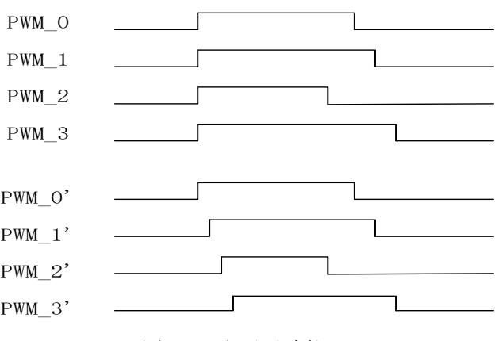

<span id="page-163-1"></span>图 18-1 防死区功能


## <span id="page-164-0"></span>**19 HPET** 控制器

## <span id="page-164-1"></span>**19.1**概述

HPET(High Precision Event Timer, 高精度事件定时器)定义了一组新的定时器,这组 定时器被操作系统使用,用来给线程调度,内核以及多媒体定时器服务器等产生中断。操作 系统可以将不同的定时器分配给不同的应用程序使用。通过配置,每个定时器都能独立产生 中断。

这组定时器由一个向上累加的主计时器(up-counter)以及一组比较器构成。这个计时 器以固定的频率(125MHz)向上累加,因此当软件两次读取计时器的值时,除非遇到计时 器溢出,否则第二次读取的值总是比第一次读取的值大。而每个定时器都包含一个 match 寄 存器以及一个比较器。当 match 寄存器的值与主计时器相等时,那么定时器产生中断。部分 定时器可产生周期性中断。

HPET 模块包括一个主计数器(main count)以及三个比较器(comparator),且他们的 宽度都是 32 位。在这三个比较器中,有且仅有一个比较器支持周期性中断(periodic-capable); 这三个比较器都支持非周期性中断。

### <span id="page-164-2"></span>**19.2**访问地址

HPET 控制器内部寄存器的物理地址构成如下:

| 地址位     | 构成       | 备注                |
|---------|----------|-------------------|
| [27:16] | BAR_BASE | Device 2 的基地址寄存器值 |
| [15:12] | 4        | 固定为 4             |
| [01:00] | REG      | 内部寄存器地址           |

## <span id="page-164-3"></span>**19.3**寄存器描述

下表列出了 HPET 的寄存器:

| 寄存器偏移地址  | 寄存器                                           | 类型   |
|----------|-----------------------------------------------|------|
|          |                                               |      |
| 000-007h | General Capabilities and ID Register          | 只读   |
| 008-00Fh | Reserved                                      |      |
| 010-017h | General Configuration Register                | 读/写  |
| 018-01Fh | Reserved                                      | R/WC |
| 020-027h | General Interrupt Status Register             | R/W  |
| 028-0EFh | Reserved                                      |      |
| 0F0-0F7h | Main Counter Value Register                   | R/W  |
| 100-107h | Timer 0 Configuration and Capability Register | R/W  |
| 108-10Fh | Timer 0 Comparator Value Register             | R/W  |
| 110-11Fh | Reserved                                      |      |
| 120-127h | Timer 1 Configuration and Capability Register | R/W  |


| 128-12Fh | Timer 1 Comparator Value Register             | R/W |
|----------|-----------------------------------------------|-----|
| 130-13Fh | Reserved                                      |     |
| 140-147h | Timer 2 Configuration and Capability Register | R/W |
| 148-14Fh | Timer 2 Comparator Value Register             | R/W |
| 150-15Fh | Reserved                                      |     |

若系统在状态转换过程中需要保存这些寄存器的的值以便随后恢复,那么操作系统负 责保存这些寄存器的值,硬件无需保存这些寄存器的值。因此当系统处于 S3,S4,S5 状态 时,这些寄存器无需维持。

**General Capabilities and ID Register**

| 位     | 名称              | 描述                                    | 读写特性 |
|-------|-----------------|---------------------------------------|------|
| 63:32 | COUNTER_CLK_PER | Main Counter Tick Period:这个域标示了主计时器的计 | RO   |
|       | IOD             | 时频率,以 fs(10^-15s)为单位。这个值必须大于 0,       |      |
|       |                 | 且小于或等于 0x05F5E100(100ns,即 10MHz)      |      |
| 31:16 | VENDOR_ID       |                                       | RO   |
| 15:14 | Reserved        |                                       |      |
| 13    | COUNT_SIZE_CAP  | Counter Size:主计时器的宽度;                 | RO   |
|       |                 | 0:32 bits                             |      |
|       |                 | 1:64 bits                             |      |
| 12:8  | NUM_TIM_CAP     | Num of Timer:定时器的个数;这个域的值指示最后一        | RO   |
|       |                 | 个定时器的编号,2K1000 中有三个定时器,因此这个           |      |
|       |                 | 域的值是 2。                               |      |
| 7:0   | REV_ID          | 版本号;不可为 0                             | RO   |

**General Configuaration Register**

| 位    | 名称         | 描述                              | 读写特性 |
|------|------------|---------------------------------|------|
| 63:1 | Reserved   |                                 |      |
| 0    | ENABLE_CNF | Overal Enable;用来使能所有定时器产生中断。如果为 | R/W  |
|      |            | 0,主计时器停止计时且所有的定时器都不再产生中         |      |
|      |            | 断。                              |      |
|      |            | 0:主计时器停止计时且所有的定时器都不再产生中         |      |
|      |            | 断;                              |      |
|      |            | 1:主计时器计时且允许定时器产生中断;             |      |

**General Interrupt Status Register**

| 位    | 名称         | 描述                                      | 读写特性 |  |  |  |
|------|------------|-----------------------------------------|------|--|--|--|
| 63:3 | Reserved   |                                         |      |  |  |  |
| 2    | T2_INT_STS | Timer 2 Interrupt Active:功能同 T0_INT_STS | R/WC |  |  |  |
| 1    | T1_INT_STS | Timer 1 Interrupt Active:功能同 T0_INT_STS | R/WC |  |  |  |
| 0    | T0_INT_STS | Timer 0 Interrupt Active:功能依赖于这个定时器的中断  | R/WC |  |  |  |
|      |            | 触发模式是电平触发还是边沿触发:                        |      |  |  |  |


| 如果是电平触发模式:                   |  |
|------------------------------|--|
| 这位默认是 0。当对应的定时器发生中断,那么有硬件    |  |
| 将其置 1.一旦被置位,软件往这位写 1 将会清空这位。 |  |
| 往这位写 0,则无意义。                 |  |
| 如果边沿触发模式:                    |  |
| 软件将忽略这位。软件通常往这位写 0.          |  |

各 个 定 时 器 的 中 断 触 发 模 式 由 各 自 Configuartion and Capability 寄存器的 Tn\_TYPE\_CNF 位确定。

**Main Counter Value Register**

| 位     | 名称               | 描述                      | 读写特性 |
|-------|------------------|-------------------------|------|
| 63:32 | Reserved         |                         |      |
| 31:0  | Main_Counter_Val | 主计时器的值;只有当主计时器停止计时时,才允许 | R/W  |
|       |                  | 修改这个寄存器的值。              |      |

**Timer N Configuration and Capabilities Register**

| 位    | 名称             | 描述                                           | 读写特性 |
|------|----------------|----------------------------------------------|------|
| 63:9 | Reserved       |                                              |      |
| 8    | Tn_32MODE_CNF  | Timer n 32-bit 模式(N 为 0-2)。当定时器为 32 位时,      | RO   |
|      |                | 这位为 0,且只读                                    |      |
| 7    | Reserved       |                                              | RO   |
| 6    | Tn_VAL_SET_CNF | Timer N Value Set(N 为 0-2):只有能产生周期性中断        | R/W  |
|      |                | 的定时器才会使用这个域。通过对这位写 1,软件能                     |      |
|      |                | 直接修改周期性定时期的累加器。软件无需对这位清                      |      |
|      |                | 0                                            |      |
|      |                | 只有 Timer 0 能产生周期性中断,因此对 Timer0 来             |      |
|      |                | 讲,这位是可读可写。而对于 Timer1, Timer2,这               |      |
|      |                | 位默认为 0,且为只读。                                 |      |
| 5    | Tn_SIZE_CAP    | Timer N Size;Timer N 的宽度(N 为 0-2)。           | RO   |
|      |                | 0:32 位宽。                                     |      |
| 4    | Tn_PER_INT_CAP | Timer N Periodic Interrupt Capable(N 为 0-2): | RO   |
|      |                | 1:定时器能产生周期性中断;                               |      |
|      |                | 0:定时器不能产生周期性中断;                              |      |
| 3    | Tn_TYPE_CNF    | Timer N type(N 为 0-2):                       | R/W  |
|      |                | 如果对应的 Tn_PER_INT_CAP 位为 0,那么这位为只             |      |
|      |                | 读,且默认为 0.                                    |      |
|      |                | 若对应的 Tn_PER_INT_CAP 位为 1,那么这位可读可             |      |
|      |                | 写。用作使能相应的定时器产生周期性中断。                         |      |
|      |                | 1:使能定时器产生周期性中断                               |      |


|   |                 | 0:使能定时器产生非周期性中断                              |     |
|---|-----------------|----------------------------------------------|-----|
| 2 | Tn_INT_ENB_CNF  | Timer N interrupt Enable(N 为 0-2):使能定时器产生    | R/W |
|   |                 | 中断                                           |     |
| 1 | Tn_INT_TYPE_CNF | Timer N Interrupt Type(N 为 0-2):             |     |
|   |                 | 0:定时器的中断触发模式为边沿触发;这意位着对                      |     |
|   |                 | 应的定时器将产生边沿触发中断。若另外的的中断产                      |     |
|   |                 | 生,那么将产生另外的边沿。                                |     |
|   |                 | 1:定时器的中断触发模式为电平触发;这意味着对                      |     |
|   |                 | 应的定时器将产生电平触发中断。这个中断将一直有                      |     |
|   |                 | 效直到被软件清掉(General Interrupt Status Register)。 |     |
| 0 | Reserved        |                                              |     |

|       |            | Timer N Comparator Value Register      |      |  |  |  |
|-------|------------|----------------------------------------|------|--|--|--|
| 位     | 名称         | 描述                                     | 读写特性 |  |  |  |
| 63:32 | Reserved   |                                        |      |  |  |  |
| 31:0  | Tn_Com_VAL | Tn_Comparator value(N 为 0-2):定时器比较器的值; | R/W  |  |  |  |
|       |            | 当对应的定时器配置为非周期性模式时:                     |      |  |  |  |
|       |            | 这个寄存器的值将与主计时器寄存器的值做比较;<br>◆            |      |  |  |  |
|       |            | 若主计时器的值与比较器的值相等时,则产生定时中断(如<br>◆        |      |  |  |  |
|       |            | 果;对应的中断使能打开)。                          |      |  |  |  |
|       |            | 比较器的值不会因为中断的产生而发生变化<br>◆               |      |  |  |  |
|       |            | 若对应的定时器配置为周期性模式时:                      |      |  |  |  |
|       |            | 当主计时器的值域比较器的值相等时,产生中断(如果对应<br>•        |      |  |  |  |
|       |            | 的中断使能被打开);                             |      |  |  |  |
|       |            | 如果产生中断,那么比较器的值将累加最后一次软件写入比<br>•        |      |  |  |  |
|       |            | 较器的值。比如当比较器的值被写入 0x0123h,              |      |  |  |  |
|       |            | •<br>那么当主计时器的值为 0x123h 时,产生中断;         |      |  |  |  |
|       |            | 比较器的值被硬件修改为 0x246h;<br>•               |      |  |  |  |
|       |            | 当主计时器的值达到 0x246h 时,产生另外一个中断;<br>•      |      |  |  |  |
|       |            | 比较器的值被硬件修改为 0x369h。<br>•               |      |  |  |  |
|       |            | 只要产生中断,那么比较器的值都会累加;直到比较器的<br>◆         |      |  |  |  |
|       |            | 值达到最大(0xffffffff),那么累加器的值将会继续累加。       |      |  |  |  |
|       |            | 比如当比较器的值是 FFFF0000h,而最后一次由软件写入比        |      |  |  |  |
|       |            | 较器的值是 20000。当中断发生后,比较器的值变为             |      |  |  |  |
|       |            | 00010000h。                             |      |  |  |  |


## <span id="page-168-0"></span>**20 NAND** 控制器

## <span id="page-168-1"></span>**20.1 NAND** 控制器结构描述

NAND FLASH 控制器最大支持单片 16GB FLASH 的容量,最大页大小 8KB,芯片最多 支持 4 个片选和 4 个 RDY 信号,控制器支持 SLC 和 MLC 两种类型 FLASH 的操作。

## <span id="page-168-2"></span>**20.2**访问地址及引脚复用

NAND 控制器内部寄存器的物理地址构成如下:

| 地址位     | 构成       | 备注                |
|---------|----------|-------------------|
| [27:16] | BAR_BASE | Device 2 的基地址寄存器值 |
| [15:12] | 6        | 固定为 6             |
| [11]    | 0        | 保留                |
| [10:00] | REG      | 内部寄存器地址           |

对于 NAND 模块,使用时要注意将对应的引脚设置为相应的功能。 与 NAND 相关的引脚设置寄存器为 [5.1](#page-51-0) 节中的 nand\_sel。

## <span id="page-168-3"></span>**20.3 NAND** 寄存器配置描述

NAND 内部的寄存器设置如下:

| 偏移地址 | 寄存器名称              |
|------|--------------------|
| 0x00 | NAND_CMD           |
| 0x04 | ADDR_C             |
| 0x08 | ADDR_R             |
| 0x0C | NAND_TIMING        |
| 0x10 | ID_L               |
| 0x14 | STATUS & ID_H      |
| 0x18 | NAND_PARAMETER     |
| 0x1C | NAND_OP_NUM        |
| 0x20 | CS_RDY_MAP         |
| 0x40 | DMA access address |

#### <span id="page-168-4"></span>**20.3.1** 命令寄存器 NAND\_CMD (偏移地址 0x00)

| 位     | 位域名             | 读写  | 描述                                |  |  |
|-------|-----------------|-----|-----------------------------------|--|--|
| 31    | DMA_REQ         | R/- | 非 ECC 模式下 NAND 发出 DMA 请求          |  |  |
| 30    | ECC_DMA_R<br>EQ | R/- | ECC 模式下 NAND 发出 DMA 请求            |  |  |
| 29:25 | STATUS          | R/- | 内部状态机(供测试用)                       |  |  |
| 24    |                 | R/- | Reserved                          |  |  |
| 23:20 | NAND_CE         | R/- | 外部 NAND 芯片片选情况,四位分别对应片外四个片选,0 表示选 |  |  |


|       |                 |     | 中                                              |
|-------|-----------------|-----|------------------------------------------------|
| 19:16 | NAND_RDY        | R/- | 外部 NAND 芯片 RDY 情况,对应关系和 NAND_CE 一致,1 表示准<br>备好 |
| 15    |                 |     | Reserved                                       |
| 14    | wait_ecc        | R/W | 为 1 表示等待 ECC 读完成(用于 ECC 读)                     |
| 13    | INT_EN          | R/W | NAND 中断使能信号,为 1 表示使能中断                         |
| 12    | RS_WR           | R/W | 为 1 表示写操作时候 ECC 功能开启                           |
| 11    | RS_RD           | R/W | 为 1 表示读操作时候 ECC 功能开启                           |
| 10    | done            | R/W | 为 1 表示操作完成,需要软件清零                              |
| 9     | Spare           | R/W | 为 1 表示操作发生在 NAND 的 SPARE 区                     |
| 8     | Main            | R/W | 为 1 表示操作发生在 NAND 的 MAIN 区                      |
| 7     | Read status     | R/W | 为 1 表示读 NAND 的状态操作                             |
| 6     | Reset           | R/W | 为 1 表示 Nand 复位操作                               |
| 5     | read id         | R/W | 为 1 表示读 ID 操作                                  |
| 4     | blocks erase    | R/W | 连续擦除标志,缺省 0;1 有效,连续擦擦块的数目由 nand_op_num<br>决定   |
| 3     | erase operation | R/W | 为 1 表示擦除操作                                     |
| 2     | write operation | R/W | 为 1 表示写操作                                      |
| 1     | read operation  | R/W | 为 1 表示读操作                                      |
| 0     | command valid   | R/W | 为 1 表示命令有效,操作完成后硬件自动清零                         |

#### <span id="page-169-0"></span>**20.3.2** 页内偏移地址寄存器 ADDR\_C (偏移地址 0x04)

| 位     | 位域名      | 读写  | 描述                                                                                                                                                                                                                                   |
|-------|----------|-----|--------------------------------------------------------------------------------------------------------------------------------------------------------------------------------------------------------------------------------------|
| 31:14 |          | R/- | Reserved                                                                                                                                                                                                                             |
| 13:0  | Nand_Col | R/W | 读、写、擦除操作起始地址页内地址(必须以<br>字对齐,为 4 的倍数),和页大小对应关系如<br>下:<br>512Bytes:只需要填充[8:0]<br>2K:需要填充[11:0],[11]表示 spare 区,[10:0]<br>表示页内偏移地址<br>4K:需要填充[12:0],[12]表示 spare 区,[11:0]<br>表示页内偏移地址<br>8K:需要填充[13:0],[13]表示 spare 区,[12:0]<br>表示页内偏移地址 |

#### <span id="page-169-1"></span>**20.3.3** 页地址寄存器 ADDR\_R (偏移地址 0x08)

| 位     | 位域名      | 读写  | 描述                             |
|-------|----------|-----|--------------------------------|
| 31:25 |          | R/- | Reserved                       |
| 24:0  | Nand_Row | R/W | 读、写、擦除操作起始地址页地址,地址组成           |
|       |          |     | 如下:                            |
|       |          |     | {片选,页数}                        |
|       |          |     | 其中片选固定为 2 位,页数根据实际的单片颗         |
|       |          |     | 粒容量确定,如 1M 页则为[19:0],[21:20]用于 |
|       |          |     | 选择 4 片中的第几片                    |

#### <span id="page-169-2"></span>**20.3.4** 时序寄存器 NAND\_TIMING (偏移地址 0x0C)

| 位     | 位域名        | 读写  | 描述                      |
|-------|------------|-----|-------------------------|
| 31:16 |            | R/- | Reserved                |
| 15:8  | Hold cycle | R/W | NAND 命令有效需等待的周期数,缺省 4   |
| 7:0   | Wait cycle | R/W | NAND 一次读写所需总时钟周期数,缺省 18 |
|       |            |     | ECC 模式下配置为 8'hb         |


#### <span id="page-170-0"></span>**20.3.5** ID 寄存器 ID\_L (偏移地址 0x10)

| 位    | 位域名      | 读写  | 描述       |
|------|----------|-----|----------|
| 31:0 | ID[31:0] | R/- | ID[31:0] |

#### <span id="page-170-1"></span>**20.3.6** ID 和状态寄存器 STATUS & ID\_H (偏移地址 0x14)

| 位     | 位域名称      | 访问  |                  |
|-------|-----------|-----|------------------|
| 31:24 |           | R/- | Reserved         |
| 23:16 | STATUS    | R/- | NAND 设备当前的读写完成状态 |
| 15:0  | ID[47:32] | R/- | ID 高 16 位        |

#### <span id="page-170-2"></span>**20.3.7** 参数配置寄存器 NAND\_PARAMETER (偏移地址 0x18)

| 位     | 位域名称      | 访问  | 描述                                                                                                                                                                                                                             |
|-------|-----------|-----|--------------------------------------------------------------------------------------------------------------------------------------------------------------------------------------------------------------------------------|
| 31:20 |           | R/- | Reserved                                                                                                                                                                                                                       |
| 29:16 | op_scope  | R/W | 每次能操作的范围,配置如下:<br>1.操作 main 区,配置为一页的 main 区大小<br>2.操作 spare 区,配置为一页的 spare 区大小<br>3.操作 main 加 spare 区,配置为一页的 main 区加上 spare<br>区大小                                                                                             |
| 15    |           | R/- | Reserved                                                                                                                                                                                                                       |
| 14:12 | ID_number | R/W | ID 号的字节数                                                                                                                                                                                                                       |
| 11:8  | 外部颗粒容量大小  | R/W | 0:1Gb(2K 页)<br>1:2Gb(2K 页)<br>2:4Gb(2K 页)<br>3:8Gb(2K 页)<br>4:16Gb(4K 页)<br>5:32Gb(8K 页)<br>6:64Gb(8K 页)<br>7:128Gb(8K 页)<br>9:64Mb(512B 页)<br>a:128Mb(512B 页)<br>b:256Mb(512B 页)<br>c:512Mb(512B 页)<br>d:1Gb(512B 页)<br>(bit) |
| 7:0   |           | R/- | Reserved                                                                                                                                                                                                                       |

#### <span id="page-170-3"></span>**20.3.8** 操作数量寄存器 NAND\_OP\_NUM (偏移地址 0x1C)

| 位    | 位域名         | 读写  | 描述                                                                                                  |
|------|-------------|-----|-----------------------------------------------------------------------------------------------------|
| 31:0 | NAND_OP_NUM | R/W | NAND 读写操作 Byte 数(非 ECC 模式下必须<br>以字对齐,为 4 的倍数;ECC 模式下,配置<br>成 527*N+2,其中 512*N 为 main 区大小);<br>擦除为块数 |


#### <span id="page-171-0"></span>**20.3.9** 映射寄存器 CS\_RDY\_MAP (偏移地址 0x20)

NAND 的 4 个 CS 由所访问的地址硬件自动生成,CS0/RDY0 对应最低一块空间, CS1/RDY1 对应次低一块空间,其它以此类推。如果需要调整外部芯片和 NAND 地址的关 系,可通过设置本寄存器,对 cs\_rdy1/2/3 进行重新映射。

| 31:28<br>rdy3_sel<br>R/W<br>4'b0001:NAND_RDY[0]<br>4'b0010:NAND_RDY[1]<br>4'b0100:NAND_RDY[2]<br>4'b1000:NAND_RDY[3]<br>27:24<br>cs3_sel<br>R/W<br>4'b0001:NAND_CS[0]<br>4'b0010:NAND_CS[1]<br>4'b0100:NAND_CS[2]<br>4'b1000:NAND_CS[3]<br>23:20<br>rdy2_sel<br>R/W<br>4'b0001:NAND_RDY[0]<br>4'b0010:NAND_RDY[1]<br>4'b0100:NAND_RDY[2]<br>4'b1000:NAND_RDY[3]<br>19:16<br>cs2_sel<br>R/W<br>4'b0001:NAND_CS[0]<br>4'b0010:NAND_CS[1]<br>4'b0100:NAND_CS[2]<br>4'b1000:NAND_CS[3]<br>15:12<br>rdy1_sel<br>R/W<br>4'b0001:NAND_RDY[0]<br>4'b0010:NAND_RDY[1]<br>4'b0100:NAND_RDY[2]<br>4'b1000:NAND_RDY[3]<br>11:8<br>cs1_sel<br>R/W<br>4'b0001:NAND_CS[0]<br>4'b0010:NAND_CS[1]<br>4'b0100:NAND_CS[2]<br>4'b1000:NAND_CS[3] | 位   | 位域名 | 读写  | 描述                       |
|------------------------------------------------------------------------------------------------------------------------------------------------------------------------------------------------------------------------------------------------------------------------------------------------------------------------------------------------------------------------------------------------------------------------------------------------------------------------------------------------------------------------------------------------------------------------------------------------------------------------------------------------------------------------------------------------------------------------------|-----|-----|-----|--------------------------|
|                                                                                                                                                                                                                                                                                                                                                                                                                                                                                                                                                                                                                                                                                                                              |     |     |     | rdy3信号从芯片引脚到NAND控制器的映射   |
|                                                                                                                                                                                                                                                                                                                                                                                                                                                                                                                                                                                                                                                                                                                              |     |     |     |                          |
|                                                                                                                                                                                                                                                                                                                                                                                                                                                                                                                                                                                                                                                                                                                              |     |     |     |                          |
|                                                                                                                                                                                                                                                                                                                                                                                                                                                                                                                                                                                                                                                                                                                              |     |     |     |                          |
|                                                                                                                                                                                                                                                                                                                                                                                                                                                                                                                                                                                                                                                                                                                              |     |     |     |                          |
|                                                                                                                                                                                                                                                                                                                                                                                                                                                                                                                                                                                                                                                                                                                              |     |     |     | cs3 信号从 NAND 控制器到芯片引脚的映射 |
|                                                                                                                                                                                                                                                                                                                                                                                                                                                                                                                                                                                                                                                                                                                              |     |     |     |                          |
|                                                                                                                                                                                                                                                                                                                                                                                                                                                                                                                                                                                                                                                                                                                              |     |     |     |                          |
|                                                                                                                                                                                                                                                                                                                                                                                                                                                                                                                                                                                                                                                                                                                              |     |     |     |                          |
|                                                                                                                                                                                                                                                                                                                                                                                                                                                                                                                                                                                                                                                                                                                              |     |     |     |                          |
|                                                                                                                                                                                                                                                                                                                                                                                                                                                                                                                                                                                                                                                                                                                              |     |     |     | rdy2信号从芯片引脚到NAND控制器的映射   |
|                                                                                                                                                                                                                                                                                                                                                                                                                                                                                                                                                                                                                                                                                                                              |     |     |     |                          |
|                                                                                                                                                                                                                                                                                                                                                                                                                                                                                                                                                                                                                                                                                                                              |     |     |     |                          |
|                                                                                                                                                                                                                                                                                                                                                                                                                                                                                                                                                                                                                                                                                                                              |     |     |     |                          |
|                                                                                                                                                                                                                                                                                                                                                                                                                                                                                                                                                                                                                                                                                                                              |     |     |     |                          |
|                                                                                                                                                                                                                                                                                                                                                                                                                                                                                                                                                                                                                                                                                                                              |     |     |     | cs2 信号从 NAND 控制器到芯片引脚的映射 |
|                                                                                                                                                                                                                                                                                                                                                                                                                                                                                                                                                                                                                                                                                                                              |     |     |     |                          |
|                                                                                                                                                                                                                                                                                                                                                                                                                                                                                                                                                                                                                                                                                                                              |     |     |     |                          |
|                                                                                                                                                                                                                                                                                                                                                                                                                                                                                                                                                                                                                                                                                                                              |     |     |     |                          |
|                                                                                                                                                                                                                                                                                                                                                                                                                                                                                                                                                                                                                                                                                                                              |     |     |     |                          |
|                                                                                                                                                                                                                                                                                                                                                                                                                                                                                                                                                                                                                                                                                                                              |     |     |     | rdy1信号从芯片引脚到NAND控制器的映射   |
|                                                                                                                                                                                                                                                                                                                                                                                                                                                                                                                                                                                                                                                                                                                              |     |     |     |                          |
|                                                                                                                                                                                                                                                                                                                                                                                                                                                                                                                                                                                                                                                                                                                              |     |     |     |                          |
|                                                                                                                                                                                                                                                                                                                                                                                                                                                                                                                                                                                                                                                                                                                              |     |     |     |                          |
|                                                                                                                                                                                                                                                                                                                                                                                                                                                                                                                                                                                                                                                                                                                              |     |     |     |                          |
|                                                                                                                                                                                                                                                                                                                                                                                                                                                                                                                                                                                                                                                                                                                              |     |     |     | cs1 信号从 NAND 控制器到芯片引脚的映射 |
|                                                                                                                                                                                                                                                                                                                                                                                                                                                                                                                                                                                                                                                                                                                              |     |     |     |                          |
|                                                                                                                                                                                                                                                                                                                                                                                                                                                                                                                                                                                                                                                                                                                              |     |     |     |                          |
|                                                                                                                                                                                                                                                                                                                                                                                                                                                                                                                                                                                                                                                                                                                              |     |     |     |                          |
|                                                                                                                                                                                                                                                                                                                                                                                                                                                                                                                                                                                                                                                                                                                              |     |     |     |                          |
|                                                                                                                                                                                                                                                                                                                                                                                                                                                                                                                                                                                                                                                                                                                              | 7:0 |     | R/- | reserved                 |

#### <span id="page-171-1"></span>**20.3.10**DMA 读写数据寄存器 DMA\_ADDRESS (偏移地址 0x40)

| 位    | 位域名         | 读写  | 描述                                                                        |
|------|-------------|-----|---------------------------------------------------------------------------|
| 31:0 | DMA_ADDRESS | R/W | NAND 读写 NAND flash 数据(ID/STATUS<br>除外)时候的访问地址,读/写地址相同,读<br>写方向通过 DMA 配置实现 |

## <span id="page-171-2"></span>**20.4 NAND ADDR** 说明

以 2K 页的 NAND flash 为例,定义如下:

每一页的 main 区大小为 2KB,spare 区大小为 64B

main\_op = NAND\_CMD[8];

spare\_op = NAND\_CMD[9];

addr\_in\_page ={ A11, A10.. A2, A1, A0}=ADDR\_C


page\_number ={ …A30,A29,A28,A27…A13,A12}= ADDR\_R

NAND flash 的 main 区总容量计算公式为

容量=2(ADDR\_C-1) \* 2(ADDR\_R)\*8bit = 2K\*2(ADDR\_R)\*8bit

NAND 地址空间示例如下表:

|         | I/O       | 0   | 1   | 2   | 3   | 4   | 5   | 6   | 7   |
|---------|-----------|-----|-----|-----|-----|-----|-----|-----|-----|
| Column1 | 1st Cycle | A0  | A1  | A2  | A3  | A4  | A5  | A6  | A7  |
| Column2 | 2nd Cycle | A8  | A9  | A10 | A11 | *L  | *L  | *L  | *L  |
| Row1    | 3rd Cycle | A12 | A13 | A14 | A15 | A16 | A17 | A18 | A19 |
| Row2    | 4th Cycle | A20 | A21 | A22 | A23 | A24 | A25 | A26 | A27 |
| Row3    | 5th Cycle | A28 | A29 | A30 | A31 | A32 | A33 |     |     |

(注:2K页的1Gb容量NAND flash对应的Row最大值为A27,发送地址给NAND flash 时只用发 Column1~2 和 Row1~2,不用发 Row3。配置 NAND 参数时,注意不要配错型号, 否则可能会读不出数据并且控制器会死等)

对系统板上 NAND 颗粒来说,如果仅仅操作 spare 区,A11=1 是唯一标志。所以软件 配置内部寄存器时,需要配置 A11 和 spare\_op 均为 1(见 Examples5) ,错误的示例见 Examples2。

对系统板上 NAND 颗粒来说,如果仅仅操作 main 区,A11=0 是唯一标志.;所以软件 配置内部寄存器时,需要配置 A11 和 spare\_op 均为 0(见 Examples1),错误的示例见 Examples4。

对系统板上NAND颗粒来说,如果操作main+spare区,A11可以为0(见Examples3); 也可以为 1(见 Examples6)。

Examples1:(非 ECC 模式下。NAND 颗粒中一个 page 的数据只能位于 0x0-0x83f,第 一个 op 表示读写开始的数据,接下来的 op 表示随后的读写数据;NO\_op 表示不能被本次 NAND 配置读写的数据)

(spare\_op =0 & main\_op =0) equal to (spare\_op =0 & main\_op =1); ADDR\_C =0x30

| Data in a page | 0     | 0x30 |    | 0x7ff | 0x800 | 0x830 | 0x83f |
|----------------|-------|------|----|-------|-------|-------|-------|
| Page 0         | NO_op | op   | op | op    | NO_op | NO_op | NO_op |
| Page 1         | op    | op   | op | op    | NO_op | NO_op | NO_op |
| Page 2         | op    | op   | op | op    | NO_op | NO_op | NO_op |

#### Examples2:

spare\_op=1 & main\_op=0; ADDR\_C = 0x30 (配置出错!!开始操作不在 spare 区,下图 是可能的错误访问顺序)

| Data in a page | 0     | 0x30  |       | 0x7ff | 0x800 | 0x830 | 0x83f |
|----------------|-------|-------|-------|-------|-------|-------|-------|
| Page 0         | NO_op | op    | op    | op    | Op    | op    | op    |
| Page 1         | NO_op | NO_op | NO_op | NO_op | Op    | op    | op    |
| Page 2         | NO_op | NO_op | NO_op | NO_op | Op    | op    | op    |


| Page 3 | NO_op | NO_op | op |
|--------|-------|-------|----|
| NO_op  | NO_op | Op    | op |

#### Examples3:

spare\_op = 1 & main\_op =1; ADDR\_C = 0x30

| Data in a page | 0     | 0x30 |    | 0x7ff | 0x800 | 0x830 | 0x83f |
|----------------|-------|------|----|-------|-------|-------|-------|
| Page 0         | NO_op | op   | op | op    | op    | op    | op    |
| Page 1         | op    | op   | op | op    | op    | op    | op    |
| Page 2         | op    | op   | op | op    | op    | op    | op    |

#### Examples4:

(spare\_op=0 & main\_op=0), (equal to spare\_op=0 & main\_op=1); ADDR\_C =0x830: (配 置出错!!开始操作在 spare 区,下图是可能的错误访问顺序)

| Data in a page | 0     | 0x30  |       | 0x7ff | 0x800 | 0x830 | 0x83f |
|----------------|-------|-------|-------|-------|-------|-------|-------|
| Page 0         | NO_op | NO_op | NO_op | NO_op | NO_op | NO_op | NO_op |
| Page 1         | NO_op | op    | op    | op    | op    | NO_op | NO_op |
| Page 2         | op    | op    | op    | op    | op    | NO_op | NO_op |
| Page 3         | op    | op    | op    | op    | op    | NO_op | NO_op |

#### Examples5:

spare\_op = 1 and main\_op =0; ADDR\_C = 0x830

| Data in a page | 0     | 0x30  |       | 0x7ff | 0x800 | 0x830 | 0x83f |
|----------------|-------|-------|-------|-------|-------|-------|-------|
| Page 0         | NO_op | NO_op | NO_op | NO_op | NO_op | op    | op    |
| Page 1         | NO_op | NO_op | NO_op | NO_op | op    | op    | op    |
| Page 2         | NO_op | NO_op | NO_op | NO_op | op    | op    | op    |

#### Examples6:

spare\_op = 1 & main\_op =1; ADDR\_C = 0x830

| Data in a page | 0     | 0x30  |       | 0x7ff | 0x800 | 0x830 | 0x83f |
|----------------|-------|-------|-------|-------|-------|-------|-------|
| Page 0         | NO_op | NO_op | NO_op | NO_op | NO_op | op    | op    |
| Page 1         | op    | op    | op    | op    | op    | op    | op    |
| Page 2         | op    | op    | op    | op    | op    | op    | op    |
| Page 3         | op    | op    | op    | op    | op    | op    | op    |

512B 页大小的 NAND flash 和 2KB 页大小配置类似,但在以下几个地方会有不同,需 要注意:

每一页的 main 区大小为 512B,spare 区大小为 16B。其中 main 区分为两个 256B 区, 每个 256B 区通过 A0~A7 来寻址。读写操作时,通过发送命令 0x00、0x01 和 0x50 来选择 是在哪个 256B 区或者 spare 区(软件不必关心,硬件自动选择,如配置 NAND 控制器写 0x100 时,硬件会自动发送到高 256B 区)。

发送地址命令顺序如下:

|         | I/O       | 0  | 1   | 2   | 3   | 4   | 5   | 6   | 7   |
|---------|-----------|----|-----|-----|-----|-----|-----|-----|-----|
| Column1 | 1st Cycle | A0 | A1  | A2  | A3  | A4  | A5  | A6  | A7  |
| Row1    | 2nd Cycle | A9 | A10 | A11 | A12 | A13 | A14 | A15 | A16 |


| Row2    | 3rd Cycle | A17 | A18 | A19 | A20 | A21 | A22 | A23 | A24 |
|---------|-----------|-----|-----|-----|-----|-----|-----|-----|-----|
| Row3(注) | 4th Cycle | A25 | A26 | *L  | *L  | *L  | *L  | *L  | *L  |

(注:Nand flash 容量为 64Mb、128Mb 和 256Mb 时,对应的最大列地址 ADDR\_R 分 别为 A22、A23 和 A24,只用发送三次地址命令 Column1 和 Row1~2,不用发送 Row3;容 量为 512Mb 和 1Gb 时,需要发送 Row3)

4K/8K 页大小的配置和 2K 页配置一样,4K 页的 main 区大小为 4KB,spare 区大小为 128B;8K 页的 main 区大小为 8KB,spare 区大小为 640B。都需要发送五次地址命令。

## <span id="page-174-0"></span>**20.5 NAND-flash** 读写操作举例

命令寄存器的'command valid '位不能与其他读写使能位同时置位,要先设置好要 进行的操作,最后才置'command valid '位。

例如:现在要读 Main 区的数据,那么操作分成以下两步:

- a、先 NAND\_CMD = 0x102
- b、再 NAND\_CMD = 0x103

## <span id="page-174-1"></span>**20.6 NAND ECC** 说明

硬件集成 ECC 功能,ECC 采用 RS(527,512)方法进行编码和解码,即每 512Byte 的有 效数据对应 15Byte 的 ECC 编码。在配置软件过程中需要注意以下几点:

- 1. 每次读写 NAND 的时候,需要每次操作一个 Page,即使原始数据不够一个 Page;
- 2. 原始数据存储在 main 区,ECC 编码存储在 spare 区。ECC 码从 spare 区的第三个 字节开始存储,防止缺陷标记区 defect area 被覆盖,该功能由硬件完成,软件只需按下文要 求配置参数即可;
- 3. NAND 的 op\_num 参数与 DMA 控制器的操作数的关系在不同情况下处理方式不一 样,具体见下文;
- 4. ECC 操作和 OOB 操作可以分开,比如对一个页完成 ECC 读/写后可以对其 OOB 进行操作;
  - 5. ECC 模式下,不支持 512B 页大小。

在软件控制上,写操作与读操作流程有些差别,下面给出具体操作步骤: 写操作:

- 1. 设置 NAND\_CMD[12]为 1,表示接下来写操作为 ECC 写
- 2. 设置 NAND\_CMD[8]和 NAND\_CMD[9]为 1,表示同时操作 main 区和 spare 区
- 3. 设置 NAND\_OP\_NUM 为(main 区大小+main 区数据对应的 ECC+2)
- 4. 设置 ADDR\_C 为 0


- 5. 设置其他寄存器
- 6. 设置 NAND\_CMD[2]表示写操作
- 7. 设置 NAND\_CMD[0]开始写操作
- 8. 等待 NAND\_CMD[10]完成

以上每步的设置需要保证对应寄存器的其他位保持不变。对应的 DMA 控制器的操 作数配置为 main 区大小/4。

#### 读操作:

读操作比写操作复杂一些,其需要两个步骤来完成。第一个步骤先将 spare 区的 ECC 码读到 NAND 控制器的 FIFO 中暂存,具体步骤为:

- 1. 设置 NAND\_CMD[9]和 NAND\_CMD[11],表示接下来的操作在 spare 区进行, 而且读回来的数据是为 ECC 解码做准备
- 2. 设置 NAND\_OP\_NUM 为 ECC 码 byte 数
- 3. 设置 ADDR\_C 为 main 区大小
- 4. 设置 NAND\_CMD[14]
- 5. 设置其他寄存器
- 6. 设置 NAND\_CMD[1]表示读操作
- 7. 设置 NAND\_CMD[0]开始读操作
- 8. 等待 NAND\_CMD[10]完成

该步骤不需要 DMA 控制器,因此不必启动 DMA 控制器。

第二个步骤,读 main 区数据,NAND 控制器会同步将译码后的数据返回给 DMA 控制器,其步骤为:

- 1. 设置NAND\_CMD[8],同时设置NAND\_CMD[9]为无效,表示接下来操作在main 区,同时需保证 NAND\_CMD[11]为 1
- 2. 设置 NAND\_OP\_NUM 为 main 区大小
- 3. 设置 ADDR\_C 为 0
- 4. 设置 NAND\_CMD[1]表示读操作
- 5. 设置 NAND\_CMD[0]开始读操作
- 6. 等待 NAND\_CMD[10]完成

该步骤中 DMA 控制器的操作数配置为 main 区大小/4。

需注意在整个读操作过程中保持 NAND\_CMD[11](rs\_rd)为 1,否则 NAND 控制器的 FIFO 会被复位。

可以在 ECC 操作完成后通过普通方式读回所有内容,包括原始数据和 ECC 校验增加 的数据(此时配置操作数 op\_num 和 DMA 相同)。

校验能力说明:最多可以纠错 6 个 10bit 单元,这些 10bit 单元内部出错的位数可以是


1-10 个。10bit 单元指的是对于每个 512Byte 原始数据+15Byte ECC 码数据,从 bit0 开始把 每个连续的 10bit 数据作为一个单元来看待。

## <span id="page-176-0"></span>**20.7**支持 **NAND** 型号

本节列出经过验证的可支持的 NAND 型号,其它类型的 NAND 颗粒未经验证,不保证 与本控制器兼容。

- ⚫ 镁光 L84A\_64Gb\_128Gb\_256Gb\_AsyncSync\_NAND:可用于存储
- ⚫ 三星 K9F1G08U0C:可用于存储


## <span id="page-177-0"></span>**21** 电源管理模块

## <span id="page-177-1"></span>**21.1**概述

龙芯 2K1000 电源管理模块提供系统功耗管理实现机制。支持 Advanced Configuration and Power Interface, Version 4.0a(ACPI),提供相应的功耗管理功能。

- ⚫ 系统休眠与唤醒,支持 ACPI S3(待机到内存),ACPI S4(待机到硬盘),ACPI S5(软关机),并且支持电源失效检测和自动系统恢复。支持多种唤醒方式(USB, GMAC,电源开关等)
- ⚫ 动态性能功耗控制,支持处理器核 DVFS 控制,支持动态关闭媒体解码协处理器 电源。
- ⚫ 系统时钟控制,模块时钟门控,多种方式调节频率。
- ⚫ 提供温度管理控制功能。支持 3 级报警机制。

### <span id="page-177-2"></span>**21.2**访问地址

电源管理模块内部寄存器的物理地址构成如下:

| 地址位     | 构成       | 备注                     |
|---------|----------|------------------------|
| [27:16] | BAR_BASE | Device 2 的基地址寄存器值      |
| [15:12] | 7        | 固定为 7                  |
| [11]    | ACPI/RTC | 0x0 代表 ACPI;0x1 代表 RTC |
| [10:00] | REG      | 内部寄存器地址                |

### <span id="page-177-3"></span>**21.3**寄存器描述

本节介绍电源管理控制器相关寄存器,使用方法可参见下一节描述。

寄存器电压域表示寄存器的该位所属电压域。

寄存器属性简写包括:

R/W(可读可写),RO(只读),

R/WC(可读,写清除),WO(只写,读无效)

#### ◼ **PMCON\_SOC : SOC General PM Configuration Register**

| 地址偏移 | 电压域 | 属性     |  |
|------|-----|--------|--|
| 0x00 | SOC | R/W,RO |  |

| 位域   | 描述                        |
|------|---------------------------|
| 25   | PWRBTN_LVL – RO           |
|      | 该位指示当前 PWRBTNn 信号状态。      |
| 24   | PWRTYP – RO               |
|      | 该位指示供电模式                  |
|      | 1:AC(适配器) 0:Battery(电池)   |
| 23:9 | 保留                        |
| 8:0  | TEMP_NOW – RO.            |
|      | CPU 内部温度传感器温度值,第 8 位为溢出位。 |


#### ◼ **PMCON\_RESUME : RESUME General PM Configuration Register**

| 地址偏移 | 电压域    | 属性          |  |
|------|--------|-------------|--|
| 0x04 | RESUME | R/W,RO,R/WC |  |

| 位域   | 描述                                                                 |
|------|--------------------------------------------------------------------|
| 31:8 | 保留                                                                 |
| 7    | USB_GMAC_OK – R/W                                                  |
|      | 如果 RSMRSTn 有效过,该位为 0,表示 USB 和 GMAC 没有配置,不能唤醒系统。重新上电<br>后由系统配置该位。   |
| 6    | CTT_STS – R/WC                                                     |
|      | 系统在 S0 状态时发生 temperature trip,系统进入 G2/S5 状态,该位为重新上电后系统检测记录<br>事件状态 |
| 5    | CTT_EN – R/W                                                       |
|      | 使能 temperature trip 保护机制                                           |
| 4    | LID_OPEN – RO                                                      |
|      | 显示屏状态检测位                                                           |
|      | 1:显示屏打开 0:显示屏合上                                                    |
| 3    | 保留                                                                 |
| 2    | SRS (System Reset Status) – R/WC                                   |
|      | 0:SYS_RESETn 没有被按下                                                 |
|      | 1: SYS_RESETn 被按下过,系统重新复位后需检查此位并作出相应清除操作。                          |
| 1    | PWROK_FLR (PWROK Failure) – R/WC                                   |
|      | 当系统在 S0 状态时,PWROK 信号变无效该位置 1,软件通过写 1 将该位清除。                        |
| 0    | DRAM_INIT – R/W                                                    |
|      | 该位不影响硬件功能,PMON 在进行 DRAM 初始化前将该位置 1,结束 DRAM 初始化后将该                  |
|      | 位写 0,软件可通过此位检查 DRAM 初始化是否被打断过。                                     |

#### ◼ **PMCON\_RTC : RTC General PM Configuration Register**

| 地址偏移 | 电压域 | 属性       |
|------|-----|----------|
| 0x08 | RTC | R/W,R/WC |

| 位域   | 描述                                                                           |
|------|------------------------------------------------------------------------------|
| 31:9 | 保留                                                                           |
| 8    | WOL_EN – R/W enable wake on LAN don't shut off SLP_LANn, use with WOL_BAT_EN |
|      | 使能 wake on LAN,与 WOL_BAT_EN 共同使用                                             |
| 7    | WOL_BAT_EN – R/W                                                             |
|      | 如果系统使用电池供电,如果该位置 1,使能 WOL,如果该位置 0,不论 WOL_EN,WOL 无                            |
|      | 效                                                                            |
| 6:5  | S3_ASSERTION_WIDTH – R/W                                                     |
|      | 这 2 bit 值代表 S3n 信号从有效到重新无效的最小时间间隔。                                           |
|      | 11: 1s                                                                       |
|      | 10: 125ms                                                                    |
|      | 01: 1ms                                                                      |
|      | 00: 60us                                                                     |
| 4:3  | S4_ASSERTION_WIDTH – R/W                                                     |
|      | 这 2 bit 值代表 S4n 信号从有效到重新无效的最小时间间隔。                                           |
|      | 11: 4 s                                                                      |
|      | 10: 2 s                                                                      |
|      | 01: 1 s                                                                      |
| 2    | 00: 125 us<br>S4_ASSERTION_EN – R/W                                          |
|      |                                                                              |
|      | 0: S4n 信号从有效到重新无效的间隔为几个 RTC 周期。                                              |
|      | 1: S4n 信号从有效到重新无效的间隔为 S4_ASSERTION_WIDTH 决定。                                 |
| 1    | PWR_FLR (Power Failure) – R/WC.                                              |
|      | 该位在 RTC 域,只能被 RTC_RSTn 复位。                                                   |
|      | 如果置 1 表示系统发生过电源失效(进入 G3 状态),即除 RTC 以外所有供电失效过(RSMRSTn                         |


|   | 有效过),软件通过写 1 将该位清除。                               |
|---|---------------------------------------------------|
| 0 | AFTERG3_EN – R/W                                  |
|   | 该位决定系统进入 G3 状态后重新供电后的动作。                          |
|   | 0:系统在供电恢复后将自动回复到 S0 状态。                           |
|   | 1:系统将恢复到 S5 状态,如果发生电源失效时系统在 S4 状态,重新供电后系统恢复到 S4 状 |
|   | 态。                                                |
|   | 该位会被 power button override 和 thermal trip 事件置 1。  |

#### ◼ **PM1\_STS : Power Management 1 Status Register**

| 地址偏移 | 电压域            | 属性   |
|------|----------------|------|
| 0x0C | RESUME/RTC/SOC | R/WC |

| 位域    | 描述                                                     | 电压域    |
|-------|--------------------------------------------------------|--------|
| 31:16 | Reserved                                               |        |
| 15    | WAK_STS (Wake Status) – R/WC                           | Resume |
|       | 0:软件写 1 将该位清除。                                         |        |
|       | 1:如果系统从任何一个休眠状态被唤醒事件唤醒,硬件将该位置 1。                       |        |
| 14    | PCIEXP_WAKE_STS – R/WC.                                | Resume |
|       | 1:PCIE 唤醒事件发生                                          |        |
|       | 0:软件写 1 将该位清除                                          |        |
| 13:12 | Reserved                                               |        |
| 11    | PRBTNOR_STS (Power Button Override Status) – R/WC      | RTC    |
|       | 0:软件写 1 将该位清除                                          |        |
|       | 1:当 power button override 发生时,该位置 1,系统无条件进入 G2/S5 状态,同 |        |
|       | 时将 AFTERG3_EN 位置 1。                                    |        |
| 10    | RTC_STS (RTC Status) – R/WC                            | Resume |
|       | 0:软件写 1 将该位清除                                          |        |
|       | 1: 当 RTC 产生 alarm 时该位置 1。此外当 RTC_EN 有效时,该位产生唤醒事件。      |        |
| 9     | Reserved                                               |        |
| 8     | PWRBTN_STS (Power Button Status) – R/WC                | Resume |
|       | 0:软件写 1 将该位清除。Thermal trip 会清除该位。                      |        |
|       | 1:当按下 PWRBTNn 保持 16ms 以上(4s 以下)时,该位会置 1。               |        |
|       | 在 S0 状态时,当 PWRBTN_EN 和 PWRBTN_STS 同时有效时,将产生中断。         |        |
|       | 在 S3-S5 任何休眠状态时,如果 PWRBTN_STS 置位,系统将恢复。                |        |
| 7:1   | 保留                                                     |        |
| 0     | TMROF_STS (PM Timer Overflow Status) – R/WC            | SOC    |
|       | 0:软件写 1 将该位清除                                          |        |
|       | 1:当 24bit 计数器(周期 8ns)的最高位翻转时,该位置 1,该记时功能推荐使用           |        |
|       | HPET 完成。                                               |        |

#### ◼ **PM1\_EN : Power Management 1 Enable Register**

| 地址偏移 | 电压域            | 属性  |
|------|----------------|-----|
| 0x10 | RESUME/RTC/SOC | R/W |

| 位域    | 描述                                             | 电压域    |
|-------|------------------------------------------------|--------|
| 31:15 | 保留                                             |        |
| 14    | PCIEXP_WAKE_DIS – R/W                          | resume |
|       | 当置位时,不产生 PCIE 唤醒事件,但是该位的值不影响 PCIEXP_WAKE_STS 的 |        |
|       | 值。                                             |        |
| 13:11 | 保留                                             |        |
| 10    | RTC_EN (RTC Event Enable) – R/W                | rtc    |
|       | RTC 唤醒和中断使能                                    |        |
| 9     | 保留                                             |        |
| 8     | PWRBTN_EN (Power Button Enable) – R/W.         | resume |
|       | PWRBTN 中断事件产生使能,该位不影响 PWRBTN 唤醒事件产生。           |        |
| 7:1   | 保留                                             |        |
| 0     | TMROF_EN (PM Timer Overflow Enable) – R/W.     | SOC    |


如果该位置位,TMROF\_STS 将产生中断。

#### ◼ **PM1\_CNT : Power Management 1 Control Register**

| 地址偏移 | 电压域            | 属性  |
|------|----------------|-----|
| 0x14 | RESUME/RTC/SOC | R/W |

| 位域    | 描述                                            | 电压域    |
|-------|-----------------------------------------------|--------|
| 31:14 | 保留                                            |        |
| 13    | SLP_EN (Sleep Enable) – R/W.                  | resume |
|       | 该位写 1 将会使系统进入 SLP_TYP 声明的休眠状态,进入相关休眠状态后该      |        |
|       | 位自动恢复为 0。                                     |        |
| 12:10 | SLP_TYP (Sleep Type) – R/W.                   | rtc    |
|       | 该 3bit 表示系统的休眠状态。                             |        |
|       | 000: 表示 S0 状态。                                |        |
|       | 001: Reserved.                                |        |
|       | 010: Reserved.                                |        |
|       | 011: Reserved.                                |        |
|       | 100: Reserved.                                |        |
|       | 101: Suspend-to-RAM. S3n 信号有效,进入 S3 状态。       |        |
|       | 110: Suspend-to-Disk. S3n, S4n 信号有效,进入 S4 状态。 |        |
|       | 111: Soft Off. S3n, S4n, S5n 信号有效,进入 S5 状态。   |        |
| 9:1   | Reserved                                      |        |
| 0     | INT_EN – R/W                                  | SOC    |
|       | 中断使能开关,使能电源管理控制器中断信号的产生。                      |        |

#### ◼ **PM1\_TMR : Power Management 1 Timer**

| 地址偏移 | 电压域 | 属性 |
|------|-----|----|
| 0x18 | SOC | RO |

| 位域    | 描述                                     |
|-------|----------------------------------------|
| 31:24 | 保留                                     |
| 23:0  | TMR_VAL (Timer Value) – RO.            |
|       | 计数器计数,周期 8ns。当 23 位翻转时,置位 TNROF_STS 位。 |
|       | 推荐使用 HPET。                             |

#### ◼ **P\_CNT : Processor Control Register**

| 地址偏移 | 电压域 | 属性     |
|------|-----|--------|
| 0x1C | SOC | R/W,RO |

| 位域   | 描述                                                     |  |  |
|------|--------------------------------------------------------|--|--|
| 31:5 | 保留                                                     |  |  |
| 4    | THTL_EN – R/W                                          |  |  |
|      | 当系统处于 C0 状态时,使能该位可以通过 clock throttling 对 CPU 时钟进行控制。   |  |  |
| 3:1  | THTL_DTY – R/W                                         |  |  |
|      | 该 3-bit 确定 throttling 的百分比,throttling 周期是 1024 APB 时钟。 |  |  |
|      | 000: no throttling                                     |  |  |
|      | 001: 87.5% throttling                                  |  |  |
|      | 010: 75% throttling                                    |  |  |
|      | 011: 62.5% throttling                                  |  |  |
|      | 100: 50% throttling                                    |  |  |
|      | 101: 37.5% throttling                                  |  |  |
|      | 110: 25% throttling                                    |  |  |
|      | 111: 12.5% throttling                                  |  |  |
| 0    | 保留                                                     |  |  |

#### ◼ **GPE0\_STS : General Purpose Event0 Status Register**


| 地址偏移 | 电压域    | 属性   |
|------|--------|------|
| 0x28 | RESUME | R/WC |

| 位域    | 描述                                                   |  |
|-------|------------------------------------------------------|--|
| 31:16 | 保留                                                   |  |
| 15:10 | USB[6:1]_STS – R/WC.                                 |  |
|       | 只有第 10 位有意义,15:11 位暂无意义。                             |  |
|       | 0:软件写 1 将该位清除。                                       |  |
|       | 1:当 USB 发生 wake 事件时这些位被置位,当 USBx_EN 位有效时,产生唤醒事件或中断。  |  |
| 9     | 保留                                                   |  |
| 8     | RI_STS – R/WC.                                       |  |
|       | 0:软件写 1 将该位清除。                                       |  |
|       | 1:当 RIn 信号有效时被置位。                                    |  |
| 7     | BATLOW_STS – R/WC.                                   |  |
|       | 0:软件写 1 将该位清除。                                       |  |
|       | 1:当 BATLOWn 信号有效时被置位                                 |  |
|       | 如果 BATLOW_EN 有效,BATLOW_STS 将产生中断。该位不产生唤醒事件。          |  |
| 6     | GMAC1_STS – R/WC.                                    |  |
|       | 0:软件写 1 将该位清除。                                       |  |
|       | 1:当 GMAC1 发生 wake 事件时这些位被置位,当 GMAC1_EN 位有效时,产生唤醒事件或中 |  |
|       | 断。                                                   |  |
| 5     | GMAC0_STS – R/WC.                                    |  |
|       | 0:软件写 1 将该位清除。                                       |  |
|       | 1:当 GMAC0 发生 wake 事件时这些位被置位,当 GMAC0_EN 位有效时,产生唤醒事件或中 |  |
|       | 断。                                                   |  |
| 4     | LID_STS – R/WC.                                      |  |
|       | 0:软件写 1 将该位清除。<br>1:当 LID_EN 位有效时,产生唤醒事件。            |  |
| 3     | CTW_STS – R/WC.                                      |  |
|       | CPU thermal warning 发生                               |  |
| 2     | CTA_STS – R/WC.                                      |  |
|       | CPU thermal alert 发生                                 |  |
| 1     | PWRSWITCH_STS – R/WC.                                |  |
|       | 供电状态发生变化,PWRTYP 变化。该位会产生中断。                          |  |
| 0     | 保留                                                   |  |
|       |                                                      |  |

#### ◼ **GPE0\_EN : General Purpose Event0 Status Register**

| 地址偏移 | 电压域        | 属性  |
|------|------------|-----|
| 0x2C | RESUME/RTC | R/W |

| 位域    | 描述                                    | 电压域 |
|-------|---------------------------------------|-----|
| 31:16 | 保留                                    |     |
| 15:10 | USB[6 :1]_EN – R/W.                   |     |
|       | 0:无效                                  |     |
|       | 1:使能 USBx_STS 产生唤醒事件,当回到 S0 将产生中断信号。  |     |
| 9     | 保留                                    |     |
| 8     | RI_EN – R/W.                          | RTC |
|       | 0:无效                                  |     |
|       | 1:使能 RIn_STS 产生唤醒事件,当回到 S0 将产生中断信号。   |     |
| 7     | BATLOW_EN – R/W.                      | RTC |
|       | 0: 无效                                 |     |
|       | 1: 使能 BATLOWn 产生中断事件。                 |     |
| 6     | GMAC1_EN – R/W.                       | RTC |
|       | 0:无效                                  |     |
|       | 1:使能 GMAC1_STS 产生唤醒事件,当回到 S0 将产生中断信号。 |     |
| 5     | GMAC0_EN – R/W.                       |     |
|       | 0:无效                                  |     |


|   | 1:使能 GMAC0_STS 产生唤醒事件,当回到 S0 将产生中断信号。 |
|---|---------------------------------------|
| 4 | LID_EN – R/W.                         |
|   | 0:无效                                  |
|   | 1:使能 LID_STS 产生唤醒事件, S0 状态时将产生中断信号。   |
| 3 | CTW_EN – R/W                          |
|   | 使能 CPU THERMAL WARNING 产生中断。          |
| 2 | CTA_EN – R/W                          |
|   | 使能 CPU THERMAL ALERT 产生中断。            |
| 1 | PWRSWITCH_EN – R/W                    |
|   | 使能 PWRSWITCH_STS 产生中断。                |
| 0 | LID_POL – R/W                         |
|   | 该位设置 LID 的极性。                         |

#### ◼ **RST\_CNT : Reset Control Register**

| 地址偏移 | 电压域 | 属性  |
|------|-----|-----|
| 0x30 | SOC | R/W |

| 位域   | 描述             |
|------|----------------|
| 31:2 | 保留             |
| 1    | WD_EN – R/W    |
|      | Watch dog 功能使能 |
| 0    | OS_RST – R/W   |
|      | 软件写该位使系统复位。    |

#### ◼ **WD\_SET : Watch Dog Set Register**

| 地址偏移 | 电压域 | 属性 |
|------|-----|----|
| 0x34 | SOC | WO |

| 位域   | 描述                   |
|------|----------------------|
| 31:1 | 保留                   |
| 0    | 写该位将重填 watch dog 计数器 |

#### ◼ **WD\_Timer : Watch Dog Timer Register**

| 地址偏移 | 电压域 | 属性  |
|------|-----|-----|
| 0x38 | SOC | R/W |

| 位域   | 描述                               |
|------|----------------------------------|
| 31:0 | 该寄存器的值为 watch dog 重填的值,复位后为全 1 。 |

#### ◼ **THSENS\_CNT : CPU Thermal Sensor Control Register**

| 地址偏移 | 电压域 | 属性  |
|------|-----|-----|
| 0x4C | SOC | R/W |

| 位域    | 描述                                          |  |
|-------|---------------------------------------------|--|
| 31:24 | WARNING_TMP – R/W                           |  |
|       | CPU 温度超过该值,如果被使能,将产生中断。如果温度位降低到该值以下,不会重复产生中 |  |
|       | 断。                                          |  |
|       | 推荐操作:系统采取降低功耗操作。                            |  |
| 23:16 | ALERT_TMP – R/W                             |  |
|       | CPU 温度超过该值,如果被使能,将产生中断。如果温度位降低到该值以下,不会重复产生中 |  |
|       | 断。                                          |  |
|       | 推荐操作:采取正常关闭系统操作                             |  |


| 15:8 | TRIP_TMP – R/W                     |
|------|------------------------------------|
|      | CPU 温度超过该值,如果被使能,系统无条件进入 G2/S5 状态。 |
| 7:0  | OFFSET – R/W                       |
|      | 设置温度传感器的校正偏移(软件),最高位为符号位。          |

#### ◼ **GEN\_RTC\_1 : General RTC Register 1**

| 地址偏移 | 电压域 | 属性  |
|------|-----|-----|
| 0x50 | RTC | R/W |

| 位域   | 描述        |
|------|-----------|
| 31:0 | RTC 通用寄存器 |

#### ◼ **GEN\_RTC\_2 : General RTC Register 2**

| 地址偏移 | 电压域 | 属性  |
|------|-----|-----|
| 0x54 | RTC | R/W |

| 位域   | 描述        |
|------|-----------|
| 31:0 | RTC 通用寄存器 |

#### ◼ **DPM\_CFG : Dynamic Power Management Configuration**

| 地址偏移  | 电压域 | 属性  |
|-------|-----|-----|
| 0x400 | SOC | R/W |

| 位域   | 描述                |
|------|-------------------|
| 31:7 | 保留                |
| 6    | DPM_EN_GMAC1– R/W |
|      | 使能 GMAC1 的时钟电源管理  |
| 5    | DPM_EN_GMAC0– R/W |
|      | 使能 GMAC0 的时钟电源管理  |
| 4    | DPM_EN_SATA– R/W  |
|      | 使能 SATA 的时钟电源管理   |
| 3    | DPM_EN_PCIE1– R/W |
|      | 使能 PCIE1 的时钟电源管理  |
| 2    | DPM_EN_PCIE0– R/W |
|      | 使能 PCIE0 的时钟电源管理  |
| 1    | DPM_EN_GPU– R/W   |
|      | 使能 GPU 的时钟电源管理    |
| 0    | DPM_EN_DC– R/W    |
|      | 使能 DC 的时钟电源管理     |

#### ◼ **DPM\_STS : Dynamic Power Management Status**

| 地址偏移  | 电压域 | 属性 |
|-------|-----|----|
| 0x404 | SOC | RO |

| 位域 | 描述                     |
|----|------------------------|
| 31 | 保留                     |
| 30 | DPM_RUNNING_GMAC1– R/W |
|    | GMAC1 正在进行时钟电源状态转换     |
| 29 | DPM_RUNNING_GMAC0– R/W |
|    | GMAC0 正在进行时钟电源状态转换     |
| 28 | DPM_RUNNING_SATA– R/W  |
|    | SATA 正在进行时钟电源状态转换      |
| 27 | DPM_RUNNING_PCIE1– R/W |
|    | PCIE1 正在进行时钟电源状态转换     |
| 26 | DPM_RUNNING_PCIE0– R/W |


|       | PCIE0 正在进行时钟电源状态转换            |
|-------|-------------------------------|
| 25    | DPM_RUNNING_GPUDC– R/W        |
|       | GPU 和 DC 正在进行时钟电源状态转换         |
| 24    | DPM_RUNNING_GPUDC– R/W        |
|       | GPU 和 DC 正在进行时钟电源状态转换         |
| 23:14 | 保留                            |
| 13:12 | DPM_STS_GMAC1– R/W            |
|       | GMAC1 的时钟电源状态                 |
|       | 00:D0 ALL_ON 正常工作             |
|       | 01:D1 STP_CLK 停时钟             |
|       | 11:D3 ALL_OFF 电源关断(保留,未实现)    |
| 11:10 | DPM_STS_GMAC0– R/W            |
|       | GMAC0 的时钟电源状态                 |
|       | 00:D0 ALL_ON 正常工作             |
|       | 01:D1 STP_CLK 停时钟             |
|       | 11:D3 ALL_OFF 电源关断(保留,未实现)    |
| 9:8   | DPM_STS_SATA– R/W             |
|       | SATA 的时钟电源状态                  |
|       | 00:D0 ALL_ON 正常工作             |
|       | 01:D1 STP_CLK 停时钟             |
|       | 11:D3 ALL_OFF 电源关断(保留,未实现)    |
| 7:6   | DPM_STS_PCIE1– R/W            |
|       | PCIE1 的时钟电源状态                 |
|       | 00:D0 ALL_ON 正常工作             |
|       | 01:D1 STP_CLK 停时钟             |
|       | 11:D3 ALL_OFF 电源关断(保留,未实现)    |
| 5:4   | DPM_STS_PCIE0– R/W            |
|       | PCIE0 的时钟电源状态                 |
|       | 00:D0 ALL_ON 正常工作             |
|       | 01:D1 STP_CLK 停时钟             |
|       | 11:D3 ALL_OFF 电源关断(保留,未实现)    |
| 3:2   | DPM_STS_GPU– R/W              |
|       | GPU 的时钟电源状态                   |
|       | 00:D0 ALL_ON 正常工作             |
|       | 01:D1 STP_CLK 停时钟             |
| 1:0   | 11:D3 ALL_OFF 电源关断(保留,未实现)    |
|       | DPM_STS_DC– R/W<br>DC 的时钟电源状态 |
|       | 00:D0 ALL_ON 正常工作             |
|       | 01:D1 STP_CLK 停时钟             |
|       | 11:D3 ALL_OFF 电源关断(保留,未实现)    |
|       |                               |

#### ◼ **DPM\_CNT : Dynamic Power Management Control**

| 地址偏移  | 电压域 | 属性  |
|-------|-----|-----|
| 0x408 | SOC | R/W |

| 位域    | 描述                                 |
|-------|------------------------------------|
| 31:20 | 保留                                 |
| 19:18 | DPM_PCIE1_CG – RW                  |
|       | PCIE1 的两个 PORT 的独立 clock gating 使能 |
| 17:14 | DPM_PCIE0_CG – RW                  |
|       | PCIE0 的四个 PORT 的独立 clock gating 使能 |
| 13:12 | DPM_TGT_GMAC1– R/W                 |
|       | GMAC1 的时钟电源控制                      |
|       | 00:D0 ALL_ON 正常工作                  |
|       | 01:D1 STP_CLK 停时钟                  |
|       | 11:D3 ALL_OFF 电源关断(保留,未实现)         |
| 11:10 | DPM_TGT_GMAC0– R/W                 |


|     | GMAC0 的时钟电源状态              |
|-----|----------------------------|
|     | 00:D0 ALL_ON 正常工作          |
|     | 01:D1 STP_CLK 停时钟          |
|     | 11:D3 ALL_OFF 电源关断(保留,未实现) |
| 9:8 | DPM_TGT _SATA– R/W         |
|     | SATA 的时钟电源状态               |
|     | 00:D0 ALL_ON 正常工作          |
|     | 01:D1 STP_CLK 停时钟          |
|     | 11:D3 ALL_OFF 电源关断(保留,未实现) |
| 7:6 | DPM_TGT_PCIE1– R/W         |
|     | PCIE1 的时钟电源状态              |
|     | 00:D0 ALL_ON 正常工作          |
|     | 01:D1 STP_CLK 停时钟          |
|     | 11:D3 ALL_OFF 电源关断(保留,未实现) |
| 5:4 | DPM_TGT_PCIE0– R/W         |
|     | PCIE0 的时钟电源状态              |
|     | 00:D0 ALL_ON 正常工作          |
|     | 01:D1 STP_CLK 停时钟          |
|     | 11:D3 ALL_OFF 电源关断(保留,未实现) |
| 3:2 | DPM_TGT_GPU– R/W           |
|     | GPU 的时钟电源状态                |
|     | 00:D0 ALL_ON 正常工作          |
|     | 01:D1 STP_CLK 停时钟          |
|     | 11:D3 ALL_OFF 电源关断(保留,未实现) |
| 1:0 | DPM_TGT_DC– R/W            |
|     | DC 的时钟电源状态                 |
|     | 00:D0 ALL_ON 正常工作          |
|     | 01:D1 STP_CLK 停时钟          |
|     | 11:D3 ALL_OFF 电源关断(保留,未实现) |

#### ◼ **DVFS\_CFG : Dynamic Voltage Frequency Scaling Config Register**

| 地址偏移  | 电压域 | 属性     |
|-------|-----|--------|
| 0x410 | SOC | R/W,RO |

| 位域    | 描述                                   |
|-------|--------------------------------------|
| 31:28 | 保留                                   |
| 27:22 | VID_DEFAULT – RO                     |
|       | 上电时默认 VID 值                          |
| 21:12 | VOLT_ADJUST_TIME– R/W                |
|       | 该部分值表示 DVFS 电压转换时的延时值,该延时值期间可进行保护操作。 |
|       | 范围:0—1000us。                         |
| 11:8  | FREQ_ADJUST_TIME–R/W                 |
|       | 该部分值表示 DVFS 电压转换时的延时值,单位为 apb 总线时钟周期 |
| 7:6   | DVFS_CNT_1 (DVFS Control 1) –R/W     |
|       | DVFS 转换时何时进行保护操作                     |
|       | 00: 不进行保护操作。                         |
|       | 01: 电压转换阶段进行保护操作。                    |
|       | 10: 频率变换是进行保护操作。                     |
|       | 11: 电压和频率转换阶段都进行保护操作。                |
| 5:4   | DVFS_CNT_0 (DVFS Control 2) –R/W     |
|       | DVFS 转换时保护操作类型                       |
|       | 00: 停时钟。                             |
|       | 01: 使用备份时钟。                          |
|       | 10: 保留。                              |
|       | 11: 对时钟设置不做操作。                       |
| 3     | 保留                                   |
| 2     | VID_VALID– R/W                       |
|       | 使能电压控制                               |

168


| 1 | PWROK_MASK_EN – R/W            |
|---|--------------------------------|
|   | 如果有效,在 DVFS 电压转换阶段时屏蔽 PWROK 信号 |
| 0 | DVFS _EN – R/W                 |
|   | 该位使能处理器核 DVFS 功能               |
|   | 0:无效 DVFS 使能 1:使能 DVFS 功能      |

#### ◼ **DVFS\_STS : Dynamic Voltage Frequency Scaling Status Register**

| 地址偏移  | 电压域 | 属性 |
|-------|-----|----|
| 0x414 | SOC | RO |

| 位域    | 描述                              |
|-------|---------------------------------|
| 31:23 | 保留                              |
| 22:16 | FEQ_STS– RO                     |
|       | CPU 分频器分频值。                     |
| 9:4   | VID_STS – RO                    |
|       | 当前 VID 值                        |
| 3:1   | 保留                              |
| 0     | CPU_DVFS_STS(DVFS status) – RO. |
|       | 0:DVFS 控制器空闲,可进行 DVFS 操作        |
|       | 1:系统正在进行 DVFS 转换。保留             |

#### ◼ **DVFS\_CNT : Dynamic Voltage Frequency Scaling Control Register**

| 地址偏移  | 电压域 | 属性  |
|-------|-----|-----|
| 0x418 | SOC | R/W |

| 位域    | 描述                              |
|-------|---------------------------------|
| 31:23 | 保留                              |
| 22:16 | FEQ_TGT – R/W                   |
|       | 修改 CPU 分频器分频值。                  |
|       | 22:update en                    |
|       | 21:DIV enable                   |
|       | 20:16 DIV number                |
| 15:10 | 保留                              |
| 9:4   | VID_TGT – R/W                   |
|       | 设置目标电压值(目标 VID)                 |
| 3     | 保留                              |
| 2     | DVFS_POL – R/W                  |
|       | 写 1 表示需提升性能,升压升频。               |
|       | 写 0 表示降低性能节约功耗,降压降频。            |
| 1     | VID_UPDATE_EN R/W               |
|       | 如果不想改变电压 VID 值,将该位置 0(即只进行频率转换) |
| 0     | DVFS_START – R/W                |
|       | 写 1 开始一个 DVFS 转换。               |


## <span id="page-187-0"></span>**22 RTC**

## <span id="page-187-1"></span>**22.1**概述

实时时钟(RTC)单元可以在主板上电后进行配置,当主板断电后,该单元仍然运作, 可以仅靠板上的电池供电就正常运行。RTC 单元运行时电流仅几个微安。

RTC 包含振荡器,结合外部 32.768KHZ 晶体产生工作时钟。该时钟用于时间信息的维 护以及产生各种定时和计数中断。

RTC 模块中包含两个计数器,分别为 TOY(Time of Year)计数器和 RTC 计数器。其中 TOY 计数器按年月日时分秒计数,精度为以 0.1 秒;RTC 计数器以 32.768KHz 时钟计数, 宽度为 32 位。

## <span id="page-187-2"></span>**22.2**访问地址

电源管理模块内部寄存器的物理地址构成如下:

| 地址位     | 构成       | 备注                     |
|---------|----------|------------------------|
| [27:16] | BAR_BASE | Device 2 的基地址寄存器值      |
| [15:12] | 7        | 固定为 7                  |
| [11]    | ACPI/RTC | 0x0 代表 ACPI;0x1 代表 RTC |
| [10:00] | REG      | 内部寄存器地址                |

### <span id="page-187-3"></span>**22.3**寄存器描述

RTC 模块寄存器和 ACPI 模块位于同一地址空间内,其偏移为 0x800,其基地址由 BAR 给定,所有寄存器位宽均为 32 位。

#### <span id="page-187-4"></span>**22.3.1** 寄存器地址列表

| 名称            | 偏移地址 | 位宽 | RW | 描述              |
|---------------|------|----|----|-----------------|
| sys_toytrim   | 0x20 | 32 | RW | 软件必须初始化为 0      |
| sys_toywrite0 | 0x24 | 32 | W  | TOY 低 32 位数值写入  |
| sys_toywrite1 | 0x28 | 32 | W  | TOY 高 32 位数值写入  |
| sys_toyread0  | 0x2C | 32 | R  | TOY 低 32 位数值读出  |
| sys_toyread1  | 0x30 | 32 | R  | TOY 高 32 位数值读出  |
| sys_toymatch0 | 0x34 | 32 | RW | TOY 定时中断 0      |
| sys_toymatch1 | 0x38 | 32 | RW | TOY 定时中断 1      |
| sys_toymatch2 | 0x3C | 32 | RW | TOY 定时中断 2      |
| sys_rtcctrl   | 0x40 | 32 | RW | TOY 和 RTC 控制寄存器 |
|               |      |    |    | 软件必须初始化         |
| sys_rtctrim   | 0x60 | 32 | RW | 软件必须初始化为 0      |
| sys_rtcwrite0 | 0x64 | 32 | W  | RTC 定时计数写入      |
| sys_rtcread0  | 0x68 | 32 | R  | RTC 定时计数读出      |
| sys_rtcmatch0 | 0x6C | 32 | RW | RTC 时钟定时中断 0    |
| sys_rtcmatch1 | 0x70 | 32 | RW | RTC 时钟定时中断 1    |
| sys_rtcmatch2 | 0x74 | 32 | RW | RTC 时钟定时中断 2    |


#### <span id="page-188-0"></span>**22.3.2** SYS\_TOYWRITE0

中文名: TOY 计数器低 32 位数值

寄存器位宽: [31:0] 偏移量: 0x24

复位值: 0x00000000

| 位域    | 位域名称         | 访问 | 缺省 | 描述           |
|-------|--------------|----|----|--------------|
| 31:26 | TOY_MONTH    | W  |    | 月,范围 1~12    |
| 25:21 | TOY_DAY      | W  |    | 日,范围 1~31    |
| 20:16 | TOY_HOUR     | W  |    | 小时,范围 0~23   |
| 15:10 | TOY_MIN      | W  |    | 分,范围 0~59    |
| 9:4   | TOY_SEC      | W  |    | 秒,范围 0~59    |
| 3:0   | TOY_MILLISEC | W  |    | 0.1 秒,范围 0~9 |

#### <span id="page-188-1"></span>**22.3.3** SYS\_TOYWRITE1

中文名: TOY 计数器高 32 位数值

寄存器位宽: [31:0]

偏移量: 0x28

复位值: 0x00000000

| 位域   | 位域名称     | 访问 | 缺省 | 描述           |
|------|----------|----|----|--------------|
| 31:0 | TOY_YEAR | W  |    | 年,范围 0~16383 |

#### <span id="page-188-2"></span>**22.3.4** SYS\_TOYREAD0

中文名: TOY 计数器低 32 位数值

寄存器位宽: [31:0]

偏移量: 0x2C

复位值: 0x00000000

| 位域    | 位域名称         | 访问 | 缺省 | 描述           |
|-------|--------------|----|----|--------------|
| 31:26 | TOY_MONTH    | R  |    | 月,范围 1~12    |
| 25:21 | TOY_DAY      | R  |    | 日,范围 1~31    |
| 20:16 | TOY_HOUR     | R  |    | 小时,范围 0~23   |
| 15:10 | TOY_MIN      | R  |    | 分,范围 0~59    |
| 9:4   | TOY_SEC      | R  |    | 秒,范围 0~59    |
| 3:0   | TOY_MILLISEC | R  |    | 0.1 秒,范围 0~9 |

#### <span id="page-188-3"></span>**22.3.5** SYS\_TOYREAD1

中文名: TOY 计数器高 32 位数值

寄存器位宽: [31:0] 偏移量: 0x30

复位值: 0x00000000


| 位域   | 位域名称     | 访问 | 缺省 | 描述           |
|------|----------|----|----|--------------|
| 31:0 | TOY_YEAR | R  |    | 年,范围 0~16383 |

#### <span id="page-189-0"></span>**22.3.6** SYS\_TOYMATCH0/1/2

中文名: TOY 计数器中断寄存器 0/1/2

寄存器位宽: [31:0]

偏移量: 0x34/38/3C

复位值: 0x00000000

| 位域    | 位域名称  | 访问 | 缺省 | 描述           |
|-------|-------|----|----|--------------|
| 31:26 | YEAR  | RW |    | 年,范围 0~16383 |
| 25:22 | MONTH | RW |    | 月,范围 1~12    |
| 21:17 | DAY   | RW |    | 日,范围 1~31    |
| 16:12 | HOUR  | RW |    | 小时,范围 0~23   |
| 11:6  | MIN   | RW |    | 分,范围 0~59    |
| 5:0   | SEC   | RW |    | 秒,范围 0~59    |

#### <span id="page-189-1"></span>**22.3.7** SYS\_RTCCTRL

中文名: RTC 定时器中断寄存器 0/1/2

寄存器位宽: [31:0]

偏移量: 0x40

复位值:无

| 位域    | 位域名称 | 访问  | 缺省 | 描述                                    |
|-------|------|-----|----|---------------------------------------|
| 31:24 | 保留   | R   | 0  | 保留,置 0                                |
| 23    | ERS  | R   | 0  | REN(bit13)写状态                         |
| 22:21 | 保留   | R   | 0  | 保留,置 0                                |
| 20    | RTS  | R   | 0  | Sys_rtctrim 写状态                       |
| 19    | RM2  | R   | 0  | Sys_rtcmatch2 写状态                     |
| 18    | RM2  | R   | 0  | Sys_rtcmatch2 写状态                     |
| 17    | RM0  | R   | 0  | Sys_rtcmatch0 写状态                     |
| 16    | RS   | R   | 0  | Sys_rtcwrite 写状态                      |
| 15    | 保留   | R   | 0  | 保留,置 0                                |
| 14    | 保留   | R   | 0  | 保留,置 0                                |
| 13    | REN  | R/W | 0  | RTC 使能,高有效。需要初始化为 1                   |
| 12    | 保留   | R   | 0  | 保留,置 0                                |
| 11    | TEN  | R/W | 0  | TOY 使能,高有效。需要初始化为 1                   |
| 10    | 保留   | R   | 0  | 保留,置 0                                |
| 9     | 保留   | R   | 0  | 保留,置 0                                |
| 8     | EO   | R/W | 0  | 0: 32.768k 晶振禁止;<br>1: 32.768k 晶振使能   |
| 7     | 保留   | R   | 0  | 保留,置 0                                |
| 6     | 保留   | R   | 0  | 保留,置 0                                |
| 5     | 32S  | R   | 0  | 0:32.768k 晶振不工作;<br>1:32.768k 晶振正常工作。 |


| 4 | 保留  | R | 0 | 保留,置 0            |
|---|-----|---|---|-------------------|
| 3 | TM2 | R | 0 | Sys_toymatch2 写状态 |
| 2 | TM1 | R | 0 | Sys_toymatch1 写状态 |
| 1 | TM0 | R | 0 | Sys_toymatch0 写状态 |
| 0 | TS  | R | 0 | Sys_toywrite 写状态  |

#### <span id="page-190-0"></span>**22.3.8** SYS\_RTCWRITE

中文名: RTC 计数器写入端口

寄存器位宽: [31:0] 偏移量: 0x64

复位值: 0x00000000

| 位域   | 位域名称 | 访问 | 缺省 | 描述 |
|------|------|----|----|----|
| 31:0 | RTC  | W  |    |    |

#### <span id="page-190-1"></span>**22.3.9** SYS\_RTCREAD

中文名:RTC 计数器读出端口

寄存器位宽: [31:0]

偏移量: 0x68

复位值: 0x00000000

| 位域   | 位域名称 | 访问 | 缺省 | 描述 |
|------|------|----|----|----|
| 31:0 | RTC  | R  |    |    |

#### <span id="page-190-2"></span>**22.3.10**SYS\_RTCMATCH0/1/2

中文名: RTC 定时器中断寄存器 0/1/2

寄存器位宽: [31:0]

偏移量: 0x6C/70/74

复位值: 0x00000000

| 位域    | 位域名称 | 访问 | 缺省 | 描述 |
|-------|------|----|----|----|
| 31:26 | RTC  | RW |    |    |


## <span id="page-191-0"></span>**23** 加解密

### <span id="page-191-1"></span>**23.1 DES**

#### <span id="page-191-2"></span>**23.1.1** DES 功能概述

DES 控制器采用 32 位的 APB 接口,支持使用 DES/TDEA 算法进行加/解密,并支持使 用 APB 接口进行 DMA 操作。DES 控制器采用了 OpenCore 的面积节约方案的 DES3 加/解 密单元作为实现加/解密的运算单元。这个运算单元每 16 个时钟周期完成一次 DES 加/解密, 每 48 个时钟周期完成一次 TDEA 加/解密。为了减少加/解密的等待时间,DES 控制器使用 2 个时钟域分别处理 APB 接口的操作和进行 DES 加/解密计算(DES 加解密使用的时钟的频 率更高)。两个不同的时钟域通过 2 个 4 项的 64bit 位宽异步 FIFO 交换加/解密运算前后的 数据。

DES 控制器在使用前需要先配置密钥以及 Command 寄存器。控制器有 3 个使用 64bit 格式存储的密钥:Key0、Key1、Key2。其中,Key1、Key2 仅在 TDEA 算法是需要进行配 置。控制器不检查密钥中的校验位。待运算(加密还是解密由 Command[1]的值确定)的数 据通过 Data\_low 和 Data\_high 写入运算数据 FIFO。DES 运算模块从运算数据 FIFO 读取数 据后进行加/解密运算迭代,迭代的结果被送入运算结果 FIFO。通过 APB 接口查询 Command[4]可以获知运算结果是否就绪。当 Command[4]的值为 0 时,可以从 APB 接口通 过 Data\_low 和 Data\_high 读取运算结果 FIFO 中的运算结果。

#### <span id="page-191-3"></span>**23.1.2** DES 访问地址:

| 地址位     | 构成       | 备注                |
|---------|----------|-------------------|
| [27:16] | BAR_BASE | Device 2 的基地址寄存器值 |
| [15:12] | 8        | 固定为 8             |
| [11:06] | 0        | 保留                |
| [05:00] | REG      | 内部寄存器地址           |

#### <span id="page-191-4"></span>**23.1.3** DES 寄存器描述

DES 的寄存器列表及寄存器说明如下:

| 地址偏移 | 名称        | 说明                                                                    |
|------|-----------|-----------------------------------------------------------------------|
| 0x0  | Key0_low  | DES 密钥的低 32 位/TDEA 密钥 0 的低 32 位                                       |
| 0x4  | Key0_high | DES 密钥的高 32 位/TDEA 密钥 0 的高 32 位                                       |
| 0x8  | Key1_low  | TDEA 密钥 1 的低 32 位                                                     |
| 0xc  | Key1_high | TDEA 密钥 1 的高 32 位                                                     |
| 0x10 | Key2_low  | TDEA 密钥 2 的低 32 位                                                     |
| 0x14 | Key2_high | TDEA 密钥 2 的高 32 位                                                     |
| 0x18 | Data_low  | 非 DMA 模式(Command[2] = 1'b0):待加/解密数据低 32<br>位的写入端口;加/解密后数据低 32 位的读出端口。 |


|      |           | DMA 模式(Command[2] = 1'b1):Data_low 和 Data_high |
|------|-----------|------------------------------------------------|
|      |           | 不做区分。先写入/读取的是数据的低 32 位,后写入/读取                  |
|      |           | 的是数据的高 32 位。                                   |
|      |           | 非 DMA 模式(Command[2] = 1'b0):待加/解密数据高 32        |
|      |           | 位的写入端口;加/解密后数据高 32 位的读出端口。                     |
| 0x1c | Data_high | DMA 模式(Command[2] = 1'b1):Data_low 和 Data_high |
|      |           | 不做区分。先写入/读取的是数据的低 32 位,后写入/读取                  |
|      |           | 的是数据的高 32 位。                                   |
| 0x20 | Command   | 命令和状态控制寄存器                                     |
| 0x24 |           |                                                |
| 0x28 | Rev       | 保留                                             |
| 0x2c |           |                                                |

#### Comand 寄存器位域说明:

| 位域   | 复位值 | 名称         | 属性   | 说明                      |
|------|-----|------------|------|-------------------------|
| 0    | 0   | des3       | RW   | 0:使用 DES 算法             |
|      |     |            |      | 1:使用 TDEA 算法            |
| 1    | 0   | decrypt    | RW   | 0:加密操作                  |
|      |     |            |      | 1:解密操作                  |
|      |     |            |      | 写入 1 启动 DMA 操作,写入 0 无影响 |
| 2    | 0   | dma_start  | RW   | 在 DMA 操作完成前此位保持为 1      |
|      |     |            |      | 当 DMA 操作完成时此位自动清零       |
| 3    | 0   | dma_done   | RW1C | 当 DMA 操作完成时,此位置 1       |
|      |     |            |      | 向此位写入 1,则清零             |
| 4    | 1   | dout_empty | RO   | 0:数据读 FIFO 非空           |
|      |     |            |      | 1:数据读 FIFO 为空           |
| 5    | 0   | din_full   | RO   | 0:数据写 FIFO 未满           |
|      |     |            |      | 1:数据写 FIFO 已满           |
| 7:6  | 0   | Rev        | RO   | 保留                      |
| 31:8 | 0   | dma_count  | RW   | 需要进行 DMA 加/解密的 64 位数的个数 |

### <span id="page-192-0"></span>**23.2 AES**

#### <span id="page-192-1"></span>**23.2.1** AES 功能概述

AES 控制器采用 32 位的 APB 接口,支持使用 128-bit KEY、192-bit KEY、256-bit KEY 进行 AES 算法加/解密,并支持使用 APB 接口进行 DMA 操作。在使用 DMA 功能时,支持 CTR 模式进行加/解密。AES 控制器有 3 个主要模块:KEY 扩展模块、加密模块、解密模块。 加/解密运算模块每 11 个时钟周期完成一次 128-bit KEY 的 AES 加/解密,每 13 个时钟周期 完成一次 192-bit KEY 的 AES 加/解密,每 15 个时钟周期完成一次 256-bit KEY 的 AES 加/


解密。为了减少加/解密的等待时间,AES 控制器使用 2 个时钟域分别处理 APB 接口的操作 和进行 AES 加/解密计算(AES 加解密使用的时钟的频率更高)。KEY 扩展模块工作在速 度较慢的 APB 时钟域。两个不同的时钟域通过 2 个 4 项的 128bit 位宽异步 FIFO 交换加/解 密运算前后的数据。

AES 控制器在使用前需要先配置密钥以及 Command 寄存器。AES 的密钥、明文和密文 均以小尾端的格式进行存储。控制器使用 8 个 32bit 寄存器以小尾端的格式存储密钥:Key0、 Key1、Key2、key3、key4、key5、key6、key7。其中,Key4、Key5 仅在 192-bit KEY 和 256-bit KEY 时需要进行配置;Key6、Key7 仅在 256-bit KEY 时需要进行配置。待运算(加密还是 解密由 Command[1]的值确定)的数据通过 4 个 32 位寄存器地址(Data0、Data1、Data2、 Data3)写入运算数据 FIFO。AES 运算模块从运算数据 FIFO 读取数据后进行加/解密运算迭 代,迭代的结果被送入运算结果 FIFO。通过 APB 接口查询 Command[4]可以获知运算结果 是否就绪。当 Command[4]的值为 0 时,可以从 APB 接口通过 Data0、Data1、Data2、Data3 读取运算结果 FIFO 中的运算结果。

#### <span id="page-193-0"></span>**23.2.2** AES 访问地址:

| 地址位     | 构成       | 备注                   |
|---------|----------|----------------------|
| [27:16] | BAR_BASE | 的基地址寄存器值<br>Device 2 |
| [15:12] | 9        | 固定为<br>9             |
| [11:06] | 0        | 保留                   |
| [05:00] | REG      | 内部寄存器地址              |

#### <span id="page-193-1"></span>**23.2.3** AES 寄存器描述

AES 的寄存器列表及寄存器说明如下:

| 地址偏移 | 名称   | 说明                                                                                                |
|------|------|---------------------------------------------------------------------------------------------------|
| 0x0  | Key0 | AES 密钥的 Key[31:0],以小尾端形式存储的 AES 密钥的最低 32<br>位                                                     |
| 0x4  | Key1 | AES 密钥的 Key[63:32]                                                                                |
| 0x8  | Key2 | AES 密钥的 Key[95:64]                                                                                |
| 0xc  | Key3 | AES密钥的Key[127:96],在使用128-bit Key时为以小尾端形式存<br>储的 AES 密钥的最高 32 位                                    |
| 0x10 | Key4 | AES 密钥的 Key[159:128],仅在使用 192/256-bit 的 Key 时使用                                                   |
| 0x14 | Key5 | AES 密钥的 Key[191:160] ,仅在使用 192/256-bit 的 Key时使用,<br>在使用 192-bit Key 时为以小尾端形式存储的 AES 密钥的最高 32<br>位 |
| 0x18 | Key6 | AES 密钥的 Key[223:192] ,仅在使用 256-bit 的 Key 时使用                                                      |
| 0x1c | Key7 | AES 密钥的 Key[255:224] ,仅在使用 256-bit 的 Key 时使用,在<br>使用 256-bit Key 时为以小尾端形式存储的 AES 密钥的最高 32 位       |


|      |               | 非 DMA 模式(Command[2]=1'b0):待加/解密数据最低 32 位的写入    |
|------|---------------|------------------------------------------------|
|      |               | 端口和加/解密后数据最低 32 位的读出端口                         |
| 0x20 | Data0         | DMA 模式(Command[2]=1'b1):Data0-Data3 不做区分,数据按照从 |
|      |               | 低到高的小尾端顺序写入或读出                                 |
|      |               | 非 DMA 模式(Command[2]=1'b0):待加/解密数据 63~32 位的写入   |
|      |               | 端口和加/解密后数据高 63~32 位的读出端口                       |
| 0x24 | Data1         | DMA 模式(Command[2]=1'b1):Data0-Data3 不做区分,数据按照从 |
|      |               | 低到高的小尾端顺序写入或读出                                 |
|      | 0x28<br>Data2 | 非 DMA 模式(Command[2]=1'b0):待加/解密数据 95~64 位的写入   |
|      |               | 端口和加/解密后数据高 95~64 位的读出端口                       |
|      |               | DMA 模式(Command[2]=1'b1):Data0-Data3 不做区分,数据按照从 |
|      |               | 低到高的小尾端顺序写入或读出                                 |
|      |               | 非 DMA 模式(Command[2]=1'b0):待加/解密数据的最高 32 位      |
|      |               | (127~96)的写入端口和加/解密后数据最高 32 位(127~96)的          |
| 0x2c | Data3         | 读出端口                                           |
|      |               | DMA 模式(Command[2]=1'b1):Data0-Data3 不做区分,数据按照从 |
|      |               | 低到高的小尾端顺序写入或读出                                 |
|      |               | 使用CTR模式时CTR计数器的初始值。要使此寄存器的值发生作                 |
| 0x30 | Ctr_init_val  | 用需要先配置此寄存器的值,再向 cammand[0]写入 0。                |
| 0x34 | Command       | 命令和状态控制寄存器                                     |
| 0x38 |               |                                                |
| 0x3c | Rev           | 保留                                             |
|      |               |                                                |

#### Comand 寄存器位域说明:

| 位域 | 复位值 | 名称         | 属性   | 说明                        |
|----|-----|------------|------|---------------------------|
|    |     |            |      | 0:使用普通的 AES 算法进行加/解密      |
| 0  | 0   | Ctr_mode   | RW   | 1:使用 CTR 模式进行 AES 算法的加/解密 |
| 1  | 0   | decrypt    | RW   | 0:加密操作                    |
|    |     |            |      | 1:解密操作                    |
|    |     |            |      | 写入 1 启动 DMA 操作,写入 0 无影响   |
| 2  | 0   | dma_start  | RW   | 在 DMA 操作完成前此位保持为 1        |
|    |     |            |      | 当 DMA 操作完成时此位自动清零         |
|    |     |            |      | 当DMA操作完成时,此位置1,中断输出信号     |
|    |     |            |      | 变为高电平                     |
| 3  | 0   | dma_done   | RW1C | 向此位写入 1,则清零,中断输出信号变为低     |
|    |     |            |      | 电平                        |
|    |     |            |      | 0:数据读 FIFO 非空             |
| 4  | 1   | dout_empty | RO   | 1:数据读 FIFO 为空             |


| 5    | 0 | din_full  | RO | 0:数据写 FIFO 未满<br>1:数据写 FIFO 已满                          |
|------|---|-----------|----|---------------------------------------------------------|
| 7:6  | 0 | Kr_mode   | RW | 0:128-bit KEY<br>1:192-bit KEY<br>2:256-bit KEY<br>3:保留 |
| 31:8 | 0 | dma_count | RW | 需要进行 DMA 加/解密的 128 位数的个数                                |

### <span id="page-195-0"></span>**23.3 RSA**

#### <span id="page-195-1"></span>**23.3.1** RSA 访问地址:

| 地址位     | 构成       | 备注                   |
|---------|----------|----------------------|
| [27:16] | BAR_BASE | 的基地址寄存器值<br>Device 2 |
| [15:12] | 0xA      | 固定为<br>0xA           |
| [11]    | 0        | 保留                   |
| [10:00] | REG      | 内部寄存器地址              |

### <span id="page-195-2"></span>**23.4 RNG**

#### <span id="page-195-3"></span>**23.4.1** RNG 访问地址:

| 地址位     | 构成       | 备注                   |
|---------|----------|----------------------|
| [27:16] | BAR_BASE | 的基地址寄存器值<br>Device 2 |
| [15:12] | 0xB      | 固定为<br>0xB           |
| [11:00] | 0        | 保留                   |

直接通过以上地址访问 RNG 会返回一个 32 位随机数。


## <span id="page-196-0"></span>**24 SDIO** 控制器

## <span id="page-196-1"></span>**24.1**功能概述

龙芯 2K1000 集成了一个 SDIO 控制器,用于 SD Memory 和 SDIO 卡的读写。SDIO 控 制器特性如下:

- ⚫ 兼容SD 存储卡规格(2.0版本)
- ⚫ 兼容SDIO卡规格(2.0版本)
- ⚫ 8字(32字节)数据发送/接收FIFO
- ⚫ 扩展的256位SD卡状态寄存器
- ⚫ 8位预分频逻辑(频率=系统时钟/(p+1))
- ⚫ DMA数据传输模式
- ⚫ 1位/4位(宽总线)的SD模式

## <span id="page-196-2"></span>**24.2**访问地址及引脚复用

SDIO 控制器内部寄存器的物理地址构成如下:

| 地址位     | 构成       | 备注                |
|---------|----------|-------------------|
| [27:16] | BAR_BASE | Device 2 的基地址寄存器值 |
| [15:12] | 0xC      | 固定为 0xC           |
| [11:08] | 0        | 保留                |
| [07:00] | REG      | 内部寄存器地址           |

对于 SDIO 模块,使用时要注意将对应的引脚设置为相应的功能。

与 SDIO 相关的引脚设置寄存器为 [5.1](#page-51-0) 节中的 sdio\_sel。

## <span id="page-196-3"></span>**24.3 SDIO** 协议概述

SDIO 是一个串行通信方式,主设备和从设备通过消息传递来实现数据和状态的传输。 如下图是一个写多块数据的示意框图,过程如下:

- 1. 主设备通过命令线发送写命令消息给从设备
- 2. 从设备接收完消息之后通过命令线发送应答消息给主设备
- 3. 主设备接收到正确的应答消息后,通过数据线发送一块数据(512K Byte 或者更多)给 从设备,并且检测数据线忙状态
- 4. 从设备接收到正确的数据后会进入编程状态,此时将数据线置为忙状态,不再响应 主设备的数据请求
  - 5. 主设备检测到从设备编程完成,继续发送下一块数据。
  - 6. 主设备发送完最后一块数据时,通过命令线发送停止命令给从设备,收到正确应答


之后完成这次多块写操作。

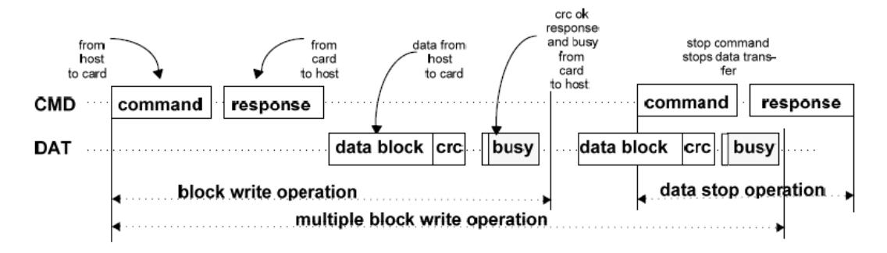

<span id="page-197-1"></span>图 24-1 SD 卡多块写操作示意图

多块读操作的过程和多块写操作的过程类似(等补充说明)。

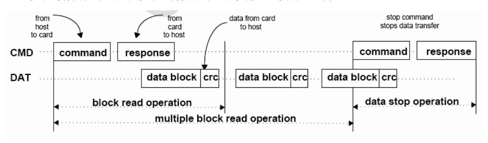

<span id="page-197-2"></span>图 24-2 SD 卡多块读操作示意图

不同的命令都有统一的格式。一般命令的格式如下表,1bit 起始位,1bit 传输方向位, 6bit 命令序号,32bit 命令参数,7bit CRC 检验位再加上 1bit 结束位。

|              |           |                  |               | <i>y</i> |       |         |
|--------------|-----------|------------------|---------------|----------|-------|---------|
| Bit position | 47        | 46               | [45:40]       | [39:8]   | [7:1] | 0       |
| Width (bits) | 1         | 1                | 6             | 32       | 7     | 1       |
| Value        | ·O'       | '1'              | x             | х        | х     | '1'     |
| Description  | start bit | transmission bit | command index | argument | CRC7  | end bit |

其中 command index 对应命令的序号,比如命令 0,cmdindex 为 0,命令 55,cmdindex 为 37。不同命令的参数可能不同,具体参考 SD 协议规范。

## <span id="page-197-0"></span>**24.4**寄存器描述

SDIO 控制器的寄存器详细说明如下:

| 寄存器名称   | 偏移地址 | 读/写(R/W) | 功能描述       | 复位值 |
|---------|------|----------|------------|-----|
| SDI_CON | 0x00 | R/W      | SDIO 控制寄存器 | 0x0 |

| SDI_CON  | 位    | 缺省值 | 描述                          |
|----------|------|-----|-----------------------------|
| ·        | 31:9 | 0x0 |                             |
| soft_rst | 8    | 0x0 | 软件复位,整个模块复位。复位完成后硬件自动清<br>零 |


| Reserved | 7:1 | 0x0 |           |
|----------|-----|-----|-----------|
| enclk    | 0   | 0x0 | SD 时钟输出使能 |

| 寄存器名称   | 地址   | 读/写(R/W) | 功能描述        | 复位值 |
|---------|------|----------|-------------|-----|
| SDI_PRE | 0x04 | R/W      | SDIO 预分频寄存器 | 0x1 |

| SDI_PRE  | 位    | 缺省值 | 描述                         |
|----------|------|-----|----------------------------|
| Reserved | 31:8 | 0x0 |                            |
| Sdi_pre  | 7:0  | 0x1 | SDIO 时钟预分频值,输出频率=PCLK/预分频值 |

| 寄存器名称       | 偏移地址 | 读/写(R/W) | 功能描述         | 复位值 |
|-------------|------|----------|--------------|-----|
| SDI_CMD_ARG | 0x08 | R/W      | SDIO 命令参数寄存器 | 0x0 |

| SDI_CMD_ARG | 位    | 缺省值 | 描述   |
|-------------|------|-----|------|
| sdi_cmd_arg | 31:0 | 0x0 | 命令参数 |

| 寄存器名称       | 偏移地址 | 读/写(R/W) | 功能描述         | 复位值 |
|-------------|------|----------|--------------|-----|
| SDI_CMD_CON | 0x0c | R/W      | SDIO 命令控制寄存器 | 0x0 |

| SDI_CMD_ARG    | 位     | 缺省值 | 描述                                                                                        |
|----------------|-------|-----|-------------------------------------------------------------------------------------------|
| Reserved       | 31:18 | 0x0 |                                                                                           |
| func_num_abort | 17:15 | 0x0 | SDIO 卡时中断的功能号,用于多块读写时,硬件<br>自动发送停止命令。如果 auto_stop_en 为 0,则此<br>位无效                        |
| sdio_en        | 14    | 0x0 | SDIO 使能信号。用于多块读写时,硬件自动发送<br>停止命令,为 1 时发送 CMD52,为 0 是发送<br>CMD12。如果 auto_stop_en 为 0,则此位无效 |
| check_on       | 13    | 0x0 | 是否检查 CRC,为 1 时有效                                                                          |
| Auto_stop_en   | 12    | 0x0 | 硬件自动发送停止命令,多块读写时,是否硬件自<br>动发送停止命令,为 1 时有效                                                 |
| Reserved       | 11    | 0x0 |                                                                                           |
| long_rsp       | 10    | 0x0 | 是否为 136 位长响应,为 1 时表示长消息回复                                                                 |
| Wait_rsp       | 9     | 0x0 | 决定是否主机等待相应,为 1 是表示等待消息回复                                                                  |
| CMST           | 8     | 0x0 | 命令开始,置 1 时开始,命令结束后硬件自动清零                                                                  |
| cmd_index      | 7:0   | 0x0 | 带开始 2 位的命令索引(共 8 位)                                                                       |

| 寄存器名称       | 偏移地址 | 读/写(R/W) | 功能描述         | 复位值 |
|-------------|------|----------|--------------|-----|
| SDI_CMD_STA | 0x10 | RO       | SDIO 命令状态寄存器 | 0x0 |


| SDI_CMD_STA  | 位     | 缺省值 | 描述                                                                     |
|--------------|-------|-----|------------------------------------------------------------------------|
| Reserved     | 31:13 | 0x0 |                                                                        |
| cmd_sent_fin | 14    | 0x0 | 命令发送完成(包含响应)标志位,为 1 表示命令<br>发送完成及响应完成                                  |
| auto_stop    | 13    | 0x0 | 硬件自动发送停止命令标志位,为 1 表示硬件自动<br>发送停止命令,为 0 则没有                             |
| rsp_crc_err  | 12    | 0x0 | 响应 CRC 错误,接收到的响应 CRC 错误。为 1 时<br>表示响应 CRC 错误,为 0 时未发现                  |
| cmd_end      | 11    | 0x0 | 命令发送完成(不关心响应)。为 1 时表示命令发<br>送完成,为 0 时未完成。                              |
| cmd_tout     | 10    | 0x0 | 命令超时。命令响应超时(64 个时钟周期),或<br>者 R1b 类型的命令,忙等待超时,为 1 时表示响<br>应超时,为 0 时未超时。 |
| rsp_fin      | 9     | 0x0 | 响应结束,接收完成从设备的返回信息。为 1 时表<br>示响应结束,为 0 时未完成。                            |
| cmd_on       | 8     | 0x0 | 命令传输标志位。为 1 时表示传输进行中,为 0 表<br>示结束。                                     |
| rsp_index    | 7:0   | 0x0 | 从设备返回的带开始 2 位的响应索引(共 8 位)                                              |

| 寄存器名称    | 偏移地址 | 读/写(R/W) | 功能描述           | 复位值 |
|----------|------|----------|----------------|-----|
| SDI_RSP0 | 0x14 | RO       | SDIO 命令响应寄存器 0 | 0x0 |

| SDI_RESP0 | 位    | 缺省值 | 描述                             |
|-----------|------|-----|--------------------------------|
|           |      | 0x0 | 卡状态[31:0](短),卡状态[127:96](长)长响应 |
| sdi_resp0 | 31:0 |     | 的配置间 sdi_cmd_con[10]           |

| 寄存器名称    | 偏移地址 | 读/写(R/W) | 功能描述           | 复位值 |
|----------|------|----------|----------------|-----|
| SDI_RSP1 | 0x18 | RO       | SDIO 命令响应寄存器 1 | 0x0 |

| SDI_RESP1 | 位    | 缺省值 | 描述                                              |
|-----------|------|-----|-------------------------------------------------|
| sdi_resp1 | 31:0 | 0x0 | 未使用(短),卡状态[95:64](长)长响应的配置<br>间 sdi_cmd_con[10] |

| 寄存器名称    | 偏移地址 | 读/写(R/W) | 功能描述           | 复位值 |
|----------|------|----------|----------------|-----|
| SDI_RSP2 | 0x1c | RO       | SDIO 命令响应寄存器 2 | 0x0 |

| SDI_RESP2 | 位    | 缺省值 | 描述                         |
|-----------|------|-----|----------------------------|
| sdi_resp2 | 31:0 | 0x0 | 未使用(短),卡状态[63:32](长)长响应的配置 |


|  | 间 sdi_cmd_con[10] |
|--|-------------------|

| 寄存器名称    | 偏移地址 | 读/写(R/W) | 功能描述           | 复位值 |
|----------|------|----------|----------------|-----|
| SDI_RSP3 | 0x20 | RO       | SDIO 命令响应寄存器 3 | 0x0 |

| SDI_RESP3 | 位    | 缺省值 | 描述                                             |
|-----------|------|-----|------------------------------------------------|
| sdi_resp3 | 31:0 | 0x0 | 未使用(短),卡状态[31:0](长)长响应的配置<br>间 sdi_cmd_con[10] |

| 寄存器名称      | 偏移地址 | 读/写(R/W) | 功能描述               | 复位值 |
|------------|------|----------|--------------------|-----|
| SDI_DTIMER | 0x24 | R/W      | SDIO 命令数据超时<br>寄存器 | 0x0 |

| SDI_DTIMER | 位     | 缺省值 | 描述                |
|------------|-------|-----|-------------------|
| Reserved   | 31:24 | 0x0 |                   |
| sdi_dtimer | 23:0  | 0x0 | 数据超时计数值,用分频后的时钟计数 |

| 寄存器名称     | 偏移地址 | 读/写(R/W) | 功能描述        | 复位值 |
|-----------|------|----------|-------------|-----|
| SDI_BSIZE | 0x28 | R/W      | SDIO 块大小寄存器 | 0x0 |

| SDI_BSIZE | 位     | 缺省值 | 描述           |
|-----------|-------|-----|--------------|
| Reserved  | 31:12 | 0x0 |              |
| sdi_bsize | 11:0  | 0x0 | 块大小值(0~4095) |

| 寄存器名称       | 偏移地址 | 读/写(R/W) | 功能描述         | 复位值 |
|-------------|------|----------|--------------|-----|
| SDI_DAT_CON | 0x2c | R/W      | SDIO 数据控制寄存器 | 0x0 |

| 位     | 缺省值            | 描述                                 |
|-------|----------------|------------------------------------|
| 31:21 | 0x0            |                                    |
|       |                | SDIO 挂起回复读写标志位。为 1 时,SDIO 挂起       |
|       |                | 后恢复之前的写操作;为 0 时,恢复之前的读操作           |
|       |                | SDIO 恢复请求。在 SDIO 设备进入挂起状态后,        |
| 19    | 0x0            | 将此位写 1,并且 IO_suspend 位写 0 后,SDIO 设 |
|       |                | 备恢复之前的操作。                          |
|       |                | SDIO 挂起请求。写 1 后控制器会在合适的时机发         |
| 18    | 0x0            | 送 CMD52 命令,通知 SDIO 设备进入挂起状态。       |
|       | 恢复操作时需要将此位写 0. |                                    |
|       |                | 读等待请求。写 1 后控制器会在合适的时机将             |
|       |                | DAT2 拉低,通知 SDIO 设备进入读等待状态。写        |
|       | 20<br>17       | 0x0<br>0x0                         |


|           |       |     | 0 后恢复之前的读操作。                          |
|-----------|-------|-----|---------------------------------------|
| wide_mode | 16    | 0x0 | 位宽选择位。为 1 表示 4 线模式,为 0 表示单线模<br>式。    |
| DMA_en    | 15    | 0x0 | DMA 使能。为 1 时表示使能 DMA,为 0 表示禁<br>止 DMA |
| DTST      | 14    | 0x0 | 数据传输开始,写 1 时数据传输开始,数据传输结<br>束后硬件清零。   |
| Reserved  | 13:12 | 0x0 |                                       |
| Blk_num   | 11:0  | 0x0 | 读写操作的块数。                              |

| 寄存器名称       | 偏移地址 | 读/写(R/W) | 功能描述         | 复位值 |
|-------------|------|----------|--------------|-----|
| SDI_DAT_CNT | 0x30 | R/W      | SDIO 数据计数寄存器 | 0x0 |

| SDI_DAT_CNT | 位     | 缺省值 | 描述        |
|-------------|-------|-----|-----------|
| Reserved    | 31:24 | 0x0 |           |
| blk_num_cnt | 23:12 | 0x0 | 当前传输块的字节数 |
| blk_cnt     | 11:0  | 0x0 | 当前传输的块数   |

| 寄存器名称       | 偏移地址 | 读/写(R/W) | 功能描述         | 复位值 |
|-------------|------|----------|--------------|-----|
| SDI_DAT_STA | 0x34 | RO       | SDIO 数据状态寄存器 | 0x0 |

| SDI_DAT_STA | 位     | 缺省值 | 描述                                                            |
|-------------|-------|-----|---------------------------------------------------------------|
| Reserved    | 31:17 | 0x0 |                                                               |
| suspend_on  | 16    | 0x0 | 为 1 时表示正在挂起状态                                                 |
| rst_suspend | 15    | 0x0 | 为 1 表示正在挂起复位。用于 SDIO 设备挂起后,<br>控制器复位 FIFO 和 DMA 请求            |
| R1b_tout    | 14    | 0x0 | 为 1 表示 R1b 类型命令超时                                             |
| data_start  | 13    | 0x0 | 为 1 表示数据传输开始                                                  |
| R1b_fin     | 12    | 0x0 | 检测到带 busy 状态的命令完成。当发送带 busy 状<br>态的命令时,此位为 0;当 busy 状态结束时变成 1 |
| auto_stop   | 11    | 0x0 | 为 1 时表示硬件正在自动发送停止命令                                           |
| Reserved    | 10    | 0x0 |                                                               |
| r_wait_req  | 9     | 0x0 | 读等待发生。发送读等待请求信号到 SDIO 卡                                       |
| SDIO_int    | 8     | 0x0 | SDIO 中断标志位。为 1 表示检测到中断                                        |
| crc_sta     | 7     | 0x0 | 数据发送后,从设备返回 CRC 错误                                            |
| dat_crc     | 6     | 0x0 | 数据接收 CRC 错误                                                   |
| dat_tout    | 5     | 0x0 | 数据传输超时。为 1 时表示数据超时。                                           |
| dat_fin     | 4     | 0x0 | 数据传输结束标志位(比如编程时)。为 1 时标志<br>忙结束                               |


| busy_fin  | 3 | 0x0 | 编程错误标志位(比如编程时)。为 1 时标志忙结<br>束       |
|-----------|---|-----|-------------------------------------|
| prog_err  | 2 | 0x0 | 编程错误标志位,为 1 时表示编程错误                 |
| tx_dat_on | 1 | 0x0 | Tx 数据发送中,为 1 时表示正在发送,为 0 时发<br>送完成  |
| rx_dat_on | 0 | 0x0 | Rx 数据接收中,为 1 时表示正在接收,为 0 时发<br>送完成。 |

| 寄存器名称        | 偏移地址 | 读/写(R/W) | 功能描述            | 复位值 |
|--------------|------|----------|-----------------|-----|
| SDI_FIFO_STA | 0x38 | RO       | SDIO FIFO 状态寄存器 | 0x0 |

| SDI_FIFO_STA | 位     | 缺省值 | 描述           |
|--------------|-------|-----|--------------|
| Reserved     | 31:12 | 0x0 |              |
| tx_full      | 11    | 0x0 | Tx FIFO 满标志位 |
| tx_empty     | 10    | 0x0 | Tx FIFO 空标志位 |
| Reserved     | 9     | 0x0 |              |
| rx_full      | 8     | 0x0 | Rx FIFO 满标志  |
| rx_empty     | 7     | 0x0 | Rx FIFO 空标志位 |
| Reserved     | 6:0   | 0x0 |              |

| 寄存器名称        | 偏移地址 | 读/写(R/W) | 功能描述       | 复位值 |
|--------------|------|----------|------------|-----|
| SDI_INT_MASK | 0x3c | R/W      | SDIO 中断寄存器 | 0x0 |

| SDI_INT_MASK | 位     | 缺省值 | 描述                         |
|--------------|-------|-----|----------------------------|
| Reserved     | 31:10 | 0x0 |                            |
| R1b_fin_int  | 9     | 0x0 | 检测到 busy 结束中断,写 1 清零       |
| rsp_crc_int  | 8     | 0x0 | 命令响应 CRC 错误中断,写 1 清零       |
| cmd_tout_int | 7     | 0x0 | 命令超时中断,写 1 清零              |
| cmd_fin_int  | 6     | 0x0 | 发送完成中断,硬件清零                |
| SDIO_int     | 5     | 0x0 | 检测到 SDIO 中断,写 1 清零         |
| prog_err_int | 4     | 0x0 | SD 卡编程错误中断,写 1 清零          |
| crc_sta_int  | 3     | 0x0 | 数据发送后从设备返回 CRC 错误中断,写 1 清零 |
| dat_crc_int  | 2     | 0x0 | 数据接收 CRC 错误中断,写 1 清零       |
| dat_tout_int | 1     | 0x0 | 数据超时中断,写 1 清零              |
| dat_fin_int  | 0     | 0x0 | 数据完成中断,硬件清零                |

| 寄存器名称   | 偏移地址 | 读/写(R/W) | 功能描述         | 复位值 |
|---------|------|----------|--------------|-----|
| SDI_DAT | 0x40 | RO       | SDIO 命令数据寄存器 | 0x0 |


| SDI_DAT | 位    | 缺省值 | 描述                               |
|---------|------|-----|----------------------------------|
| sdi_dat | 31:0 | 0x0 | SDIO 控制器发送或者接收的数据(用于 DMA 操<br>作) |

| 寄存器名称      | 偏移地址 | 读/写(R/W) | 功能描述         | 复位值 |
|------------|------|----------|--------------|-----|
| SDI_INT_EN | 0x64 | R/W      | SDIO 中断寄使能存器 | 0x0 |

| SDI_INT_EN      | 位     | 缺省值 | 描述                        |
|-----------------|-------|-----|---------------------------|
| Reserved        | 31:10 | 0x0 |                           |
| R1b_fin_int_en  | 9     | 0x0 | Busy 结束中断使能,为 1 时有效       |
| rsp_crc_int_en  | 8     | 0x0 | 命令响应 CRC 错误中断使能,为 1 时有效   |
| cmd_tout_int_en | 7     | 0x0 | 命令超时中断使能,为 1 时有效          |
| cmd_fin_int_en  | 6     | 0x0 | 命令发送完成中断使能,为 1 时有效        |
| SDIO_int_en     | 5     | 0x0 | SDIO 中断使能,为 1 时有效         |
| prog_err_int_en | 4     | 0x0 | SD 卡编程错误中断使能,为 1 时有效      |
| crc_sta_int_en  | 3     | 0x0 | 数据发送后从设备返回 CRC 错误中断使能,为 1 |
|                 |       |     | 时有效                       |
| dat_cec_int_en  | 2     | 0x0 | 数据接收 CRC 错误中断使能,为 1 时有效   |
| dat_tout_int_en | 1     | 0x0 | 数据超时中断使能,为 1 时有效          |
| dat_fin_int_en  | 0     | 0x0 | 数据完成中断使能,为 1 时有效          |

## <span id="page-203-0"></span>**24.5**软件编程指南

#### <span id="page-203-1"></span>**24.5.1** SD Memory 卡软件编程说明

SD Memory 卡要想正常工作,必须要先初始化。初始化的过程需要发送不同的命令序 列来配置从设备。初始化的流程示意图如下:


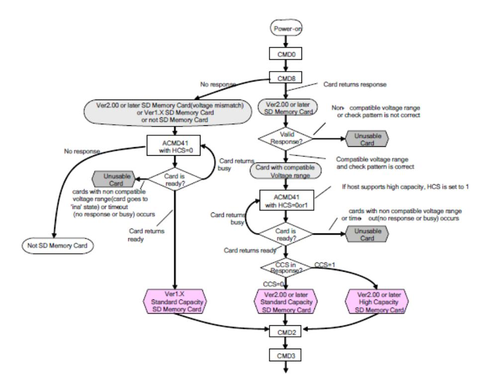

<span id="page-204-0"></span>图 24-3 SD Memory 卡初始化流程示意图

初始化完成之后就可以正常工作了。

配置寄存器的流程如下:

- 1. 配置 sdi\_con,使能输出时钟
- 2. 配置 sdi\_pre,设置一个分频系数,如果时序不满足,可以设置输出反向时钟来调整 时序。
  - 3. 配置 sdi\_int\_en,使能命令、数据完成及其他中断。
  - 4. 按照上图初始化流程初始化控制器

发送命令的配置寄存器过程如下:

- ➢ 根据发送的命令,配置 cmd\_arg 寄存器
- ➢ 配置 cmd\_con 寄存器,发送命令
- ➢ 读 sdi\_int\_msk 寄存器,检查是否传输完成,是否有错误
- ➢ 如果需要,读 sdi\_rsp 寄存器

初始化的流程如下:

CMD0 → CMD8 → ACMD41(即 CMD55 → CMD41) → CMD2 → CMD3

- → CMD7 → ACMD6(用于配置是否用 4bit 数据线传输)
- 5. 进行数据操作之前需要配置 Bsize 寄存器,Dtimer 寄存器
- 6. 数据的操作必须要配置 DMA,配置 dat\_con 寄存器并配置 DMA(注:读操作时先 配置 DMA,写操作时先配置 dat\_con)
  - 7. 读 sdi\_int\_msk 寄存器,检测是否传输完成,是否有错误。


8. 没有错误则完成一次数据传输,不需要软件发送停止命令

#### <span id="page-205-0"></span>**24.5.2** SDIO 卡软件编程说明

SDIO 卡的初始化流程和 SD memory 卡不同,其初始化流程如下:

- 1. 配置 sdi\_con,使能输出时钟。
- 2. 配置 sdi\_pre,设置一个分频系数,如果时序不满足,可以设置输出反向
- 3. 时钟来调整时序。
- 4. 配置 sdi\_int\_en,使能命令、数据完成及其他中断。
- 5. 初始化流程如下:

发送命令的配置寄存器过程如下:

- ➢ 根据发送的命令,配置 cmd\_arg 寄存器
- ➢ 配置 cmd\_con 寄存器,发送命令
- ➢ 读 sdi\_int\_msk 寄存器,检查是否传输完成,是否有错误
- ➢ 如果需要,读 sdi\_rsp 寄存器

初始化的流程如下(对 CCCR 的操作):

- 6. CMD52(复位) CMD5(等待上电完成) CMD3(获取 RCA) CMD7(选择相应 RCA 的卡) CMD52(配置是否用 4bit 数据线传输) CMD52(配置读写数据的块大小) CMD52(打开 IO 中断使能)进行数据操作之前需要配置 Bsize 寄存器,Dtimer 寄存器
- 7. 数据的操作必须要配置 DMA,配置 dat\_con 寄存器并配置 DMA(注:读操作时先 配置 DMA,写操作时先配置 dat\_con)
- 8. 发送读写数据的命令时,如果需要硬件自动发送停止命令,需要配置 auto\_stop 和 sdio\_en。读写数据时需要先读写支持的 Function,配置相应的 FBR 的指针寄存器,再发送 多块读写(CMD53)或者单块读写(CMD52)命令进行读写。
  - 9. 读 sdi\_int\_msk 寄存器,检测是否传输完成,是否有错误。
  - 10. 没有错误则完成一次数据传输,不需要软件发送停止命令
  - 11. 如果检测到 IO 中断,控制器会置起响应的中断,但是不会停止当前的操作。
- 12. 对于读等待,控制器会在合适的时机将 DAT2 拉低,通知 SDIO 卡停止发送数据。 所以如果当前正在传输数据过程中,控制器可能会在当前一块数据传输结束后,发出读等待 信号,这时才不会接收下一块数据。
- 13. 对于挂起和恢复操作。有可能出现挂起嵌套情况,比如说操作 1 被操作 2 中断而挂 起,然后操作 2 被操作 3 中断而挂起。挂起时中断的现场需要软件保存(如当前的读写标志 位,当前传输的块数,地址等),进行入栈操作。恢复时需要软件再按相应的顺序出栈。


## <span id="page-206-0"></span>**24.6**支持 **SDIO** 型号

本节列出经过验证的可支持的 SDIO 卡型号,其它类型的 SDIO 卡未经验证,不保证与 本控制器兼容。

- ⚫ Mem 卡:Kingston SD-CO2G SDC/2GB
- ⚫ IO 卡(wifi):maxwell sd8686


## <span id="page-207-0"></span>**25 I2S** 控制器

## <span id="page-207-1"></span>**25.1**概述

龙芯 2K1000 中 I2S 控制器,数据宽度是 32 位,支持 DMA 传输,支持多家公司的 codec 芯片。I2S 控制器仅支持主模式,由 I2S 产生位时钟信号和左右声道选择时钟信号。 I2S 的功能特性包括:

- 1. 支持 8、16、20、24、32 位的音频数据采样位宽。
- 2. 支持 8、16、20、24、32 位的左右声道处理字宽。
- 3. 包含两个缓存 FIFO,FIFO 的缓存容量为 8bytes。
- 4. I2S 的中断处理模式可配,在 I2S 的发送和接收中断功能都使能后,当两个通道的 缓存 fifo 为满仍要写以及为空仍要读时,则向 CPU 发出中断信号。
- 5. I2S 可以为 codec 芯片提供系统时钟,时钟频率可配。

## <span id="page-207-2"></span>**25.2**访问地址及引脚复用

I2S 控制器内部寄存器的物理地址构成如下:

| 地址位     | 构成       | 备注                |
|---------|----------|-------------------|
| [27:16] | BAR_BASE | Device 2 的基地址寄存器值 |
| [15:12] | 0xD      | 固定为 D             |
| [11:08] | 0        | 保留                |
| [07:00] | REG      | 内部寄存器地址           |

对于 I2S 模块,使用时要注意将对应的引脚设置为相应的功能。

与 I2S 相关的引脚设置寄存器为 [5.1](#page-51-0) 节中的 i2s\_sel。

## <span id="page-207-3"></span>**25.3**接口协议

I2S 发送器和接收器的操作时序如图 [25-1](#page-208-5) 所示。发送器和接收器的传输操作时序要求 都是在信道选择信号(WS)改变之后的第二个位时钟开始传输下一帧数据,数据先传 MSB 位,再传输 LSB 位。发送器和接收器能处理的字位宽可以不一致,若发送器所需发送的数 据的位宽比系统所支持的数据位宽要短,则 LSB 补零发送,反之,则忽略部分 LSB 数据; 同理,对接受器而言,当接收到的数据的位宽比自己能处理的位宽小时,则 LSB 补零接 收,反之,则忽略接收部分 LSB 数据。所以,对收发的数据而言,MSB 是具有固定的,而 LSB 则要取决于要收发的数据的字长已经系统所配置的字长位宽。


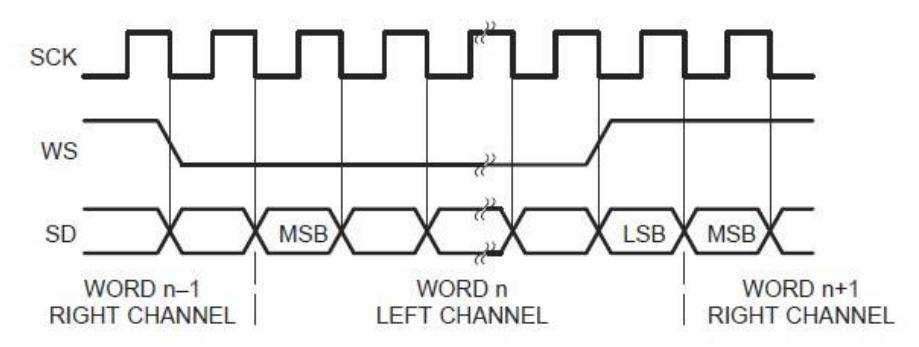

<span id="page-208-1"></span>图 25-1 I2S 传输协议

## <span id="page-208-5"></span><span id="page-208-0"></span>**25.4**专用寄存器

I2S 包含 5 个寄存器,定义如下表所示。

<span id="page-208-2"></span>表 25-1 寄存器定义

| 寄存器名称      | 偏移地址   | 读/写(R/W) | 功能描述                                  | 复位值   |
|------------|--------|----------|---------------------------------------|-------|
| IISVersion | 0xd000 | R/W      | 标识寄存器<br>I2S                          | 32'h0 |
| IISConfig  | 0xd004 | R/W      | 配置寄存器<br>I2S                          | 32'h0 |
| IISControl | 0xd008 | R/W      | 控制寄存器<br>I2S                          | 32'h0 |
| IISRxData  | 0xd00c | R/W      | 接收数据寄存器(用于<br>接<br>I2S<br>DMA<br>收数据) | 32'h0 |
| IISTxData  | 0xd010 | R/W      | 发送数据寄存器(用于<br>发<br>I2S<br>DMA<br>送数据) | 32'h0 |

接收标识寄存器允许主控机读取接收器的相关工作信息。它标识了 IIS 的地址位宽, 数据位宽以及版本号等信息。

<span id="page-208-3"></span>表 25-2 标识寄存器

| 寄存器名称      | 偏移地址 | 读/写(R/W) | 功能描述                                                                                                               |
|------------|------|----------|--------------------------------------------------------------------------------------------------------------------|
| IISVersion | 位    | 缺省值      | 描述                                                                                                                 |
| ADRW       | 9:8  | 2'h0     | 地址总线宽度:<br>00:地址宽度<br>位<br>8<br>01:地址宽度<br>位<br>16<br>10:地址宽度<br>位<br>32                                           |
| DATW       | 5:4  | 2'h0     | 11:地址宽度<br>位<br>64<br>数据宽度:<br>00:数据宽度<br>位<br>8<br>01:数据宽度<br>位<br>16<br>10:数据宽度<br>位<br>32<br>11:数据宽度<br>位<br>64 |
| VER        | 3:0  | 4'h0     | 版本号<br>I2S                                                                                                         |

接收配置寄存器是配置 I2S 的声道字长,音频数据的采样深度以及各个时钟的分频系 数的。

<span id="page-208-4"></span>表 25-3 配置寄存器

| 寄存器名称     | 偏移地址  | 读/写(R/W) | 功能描述       |
|-----------|-------|----------|------------|
| IISConfig | 位     | 缺省值      | 描述         |
| LR_LEN    | 31:24 | 'h0      | 左右声道处理的字长。 |


| 寄存器名称          | 偏移地址  | 读/写(R/W) | 功能描述                                                                                                              |
|----------------|-------|----------|-------------------------------------------------------------------------------------------------------------------|
| RES_DEPTH      | 23:16 | 'h0      | 采样深度设置:<br>采样数据长度,有效范围为<br>8-32,如果发<br>IIS<br>送或者接收到的数据宽度小于采样数据长<br>度,则低位补<br>0;如果发送或者接收到的数<br>据宽度大于采样数据长度,则低位忽略。 |
| BCLK_RATI<br>O | 15:8  | 'h0      | 位时钟(BCLK)分频系数:<br>位时钟分频系数,分频数为总线时钟频率除<br>以<br>2x(RATIO+1)                                                         |
| MCLK_RATI<br>O | 7:0   | 'h0      | 系统时钟(MCLK)分频系数,<br>系统时钟分频系数,分频数为总线时钟频率<br>除以<br>2x(RATIO+1),系统时钟作为<br>的<br>Codec<br>sysclk                        |

控制寄存器用于配置 IIS 的工作使能信号,缓存 FIFO 的存储状态以及中断相关信息状 态。

| 寄存器名称      | 偏移地<br>址 | 读/写(R/W) | 功能描述                                     |
|------------|----------|----------|------------------------------------------|
| IISControl | 位        | 缺省值      | 描述                                       |
| MASTER     | 15       | 'h0      | 1:IIS<br>工作于主模式                          |
| MSB/LSB    | 14       | 'h0      | 1:高位在左端<br>0:高位在右端                       |
| RX_EN      | 13       | 'h0      | 控制器接收使能,为<br>时有效,开始接收数据<br>1             |
| TX_EN      | 12       | 'h0      | 控制器发送使能,为<br>时有效,开始发送数据<br>1             |
| RX_DMA_EN  | 11       | 'h0      | DMA 接收使能,为<br>时有效<br>1                   |
| Reserved   | 10: 8    | 'h0      |                                          |
| TX_DMA_EN  | 7        | 'h0      | 发送使能,为<br>时有效<br>DMA<br>1                |
| Reserved   | 6:2      | 'h0      |                                          |
| RX_INT_EN  | 1        | 'h0      | 中断使能,为<br>时使能中断,为<br>时禁止<br>RX<br>1<br>0 |
| TX_INT_EN  | 0        | 'h0      | 中断使能,为<br>时使能中断,为<br>时禁止<br>TX<br>1<br>0 |

<span id="page-209-1"></span>表 25-4 控制寄存器

## <span id="page-209-0"></span>**25.5**配置操作

I2S 正常工作,需要先配置好 CODEC 芯片,然后配置 I2S 控制器的的配置寄存器和控 制寄存器。

2K1000 芯片通过 I2S 接口和 CODEC 芯片通信,CODEC 芯片作为 I2S 总线上的从设 备,详细地址、寄存器和配置方法请参考具体 CODEC 芯片的数据手册。配置完 CODEC 之 后,需要对 I2S 控制器进行配置。可以将一些配置信息写入标志寄存器(I2SVersion),以 供查询。先配置好 I2SConfig 寄存器,再配置 I2SControl 寄存器。

I2SConfig 寄存器建议 LR\_LEN 和RES\_DEPTH 配成一样,不至于在传输过程中丢数据 或者空数据。BCK 时钟根据配置 CODEC 的采样频率、采样深度和倍频系数来计算,计算 公式如下:

BCK=256xfs(或者 512xfs)或者(768xfs);(详细见 CODEC 手册推荐配置)

BCK\_RATIO=Freq\_APB/(256xfs)/2-1;

双通道的话,计算公式下:


BCK = RES\_DEPTH x 2 xfs;

BCK\_RATIO= Freq\_APB / (RES\_DEPTH x 2 x fs) /2 – 1;

其中 fs 为配置的采样频率(即音频文件的码率)。发送和读取数据时,需要先配置好 DMA,再配置控制器,以免发生数据丢失。DMA 复用的配置方法见第 5.4 节。

MCK 时钟根据配置 CODEC 的采样频率和倍频系数来计算,计算公式如下:

MCK = 256xfs(或者 512xfs) 或者(768xfs);(详细见 CODEC 手册推荐配置)

MCK\_RATIO= Freq\_APB / (256 x fs) /2 – 1。


## <span id="page-211-0"></span>**26 GMAC** 控制器(**Dev 3**)

龙芯 2K1000 集成了两个 GMAC 控制器,即 GMAC0 和 GMAC1,二者在逻辑结构上完 全相同,分别为 Device 3 的不同功能(Function)。其配置空间基本信息如下:

| 设备    | 总线号 | 设备号 | 功能号 | 配置空间掩码 | 配置头访问首地址(64 位模式) | 备注 |
|-------|-----|-----|-----|--------|------------------|----|
| GMAC0 | 0x0 | 0x3 | 0x0 | 0x7FFF | 0xFE_0000_1800   |    |
| GMAC1 | 0x0 | 0x3 | 0x1 | 0x7FFF | 0xFE_0000_1900   |    |

## <span id="page-211-1"></span>**26.1**访问地址及引脚复用

各个 GMAC 控制器内部寄存器的物理地址构成如下:

| 地址位     | 构成       | 备注                                                                   |
|---------|----------|----------------------------------------------------------------------|
| [63:15] | BAR_BASE | GMAC0 为 Device 3、FUNC 0 的基地址寄存器值<br>GMAC1 为 Device 3、FUNC 1 的基地址寄存器值 |
| [14:00] | REG      | 内部寄存器地址                                                              |

对于 GMAC1,使用时要注意将对应的引脚设置为相应的功能。

与 GMAC1 相关的引脚设置寄存器为 [5.1](#page-51-0) 节中的 gmac1\_sel。


## <span id="page-212-0"></span>**27 OTG** 控制器(**Dev 4, Fun 0**)

## <span id="page-212-1"></span>**27.1**概述

2K1000 的 OTG 支持特性如下:

- 支持 HNP 与 SRP 协议;
- 内嵌 DMA,无需占用处理器带宽即可在 OTG 与外部存储之间移动数据;
- 在 device 模式下,为高速设备(480Mbps);
- 在 host 模式下,仅能支持高速设备(480Mbps);
- 在 device 模式下,支持 6 个双向的 endpoint,其中仅有默认的 endpoint0 支持控制传输;
- 在 device 模式下,最多同时支持 4 个 IN 方向的传输;
- 在 host 模式下,支持 12 个 channel,且软件可配置每个 channel 的方向;
- 在 host 模式下,支持 periodic OUT 传输;

### <span id="page-212-2"></span>**27.2**访问地址

2K1000 的 Device 4 包含 3 个功能(Function),分别为 OTG 控制器(Function0)、EHCI 控制器(Function1)和 OHCI 控制器(Function2),其配置空间基本信息如下:

| 设备   | 总线号 | 设备号 | 功能号 | 配置空间掩码   | 配置头访问首地址(64 位模式) | 备注 |
|------|-----|-----|-----|----------|------------------|----|
| OTG  | 0x0 | 0x4 | 0x0 | 0x3_FFFF | 0xFE_0000_2000   |    |
| EHCI | 0x0 | 0x4 | 0x1 | 0x7FFF   | 0xFE_0000_2100   |    |
| OHCI | 0x0 | 0x4 | 0x2 | 0x7FFF   | 0xFE_0000_2200   |    |

OTG 控制器内部寄存器的物理地址构成如下:

| 地址位     | 构成       | 备注                       |
|---------|----------|--------------------------|
| [63:18] | BAR_BASE | Device 4、FUNC 0 的基地址寄存器值 |
| [17:00] | REG      | 内部寄存器地址                  |


## <span id="page-213-0"></span>28 USB 控制器 (Dev 4, Fun 1/2)

### <span id="page-213-1"></span>28.1 总体概述

2K1000的 USB 主机端口特性如下:

- 兼容 USB Rev 1.1、USB Rev 2.0 协议
- 兼容 OHCI Rev 1.0、EHCI Rev 1.0 协议
- 支持 LS(Low Speed)、FS(Full Speed)和 HS(High Speed)的 USB 设备
- 支持四个端口,每个端口都可挂 LS、FS 或 HS 设备

USB 主机控制器模块包括一个支持高速设备的 EHCI 控制器,一个支持全速与低速设备的 OHCI 控制器。其中 EHCI 控制器处于主控地位,只有当挂上的设备是全速或低速设备时,才将控制权转交给 OHCI 控制器;当全速或低速设备拔掉时,控制权返回 EHCI 控制器。

同时 USB 控制器内部集成了 AHB 总线接口(与 AMBA Specification Revision 2.0 兼容),用来和内存/应用程序之间通信。USB 控制器与外部的互联结构图如下图所示:

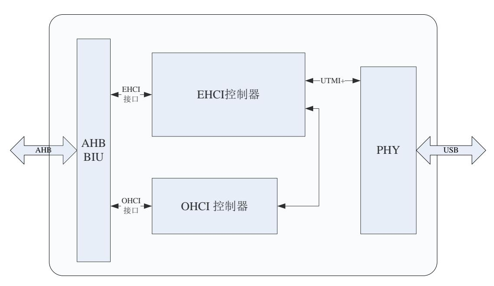

<span id="page-213-3"></span>图 28-1 USB 主机控制器模块图

## <span id="page-213-2"></span>28.2 访问地址

2K1000 的 Device 4 包含 3 个功能(Function),分别为 OTG 控制器(Function0)、EHCI 控制器(Function1)和 OHCI 控制器(Function2),其配置空间基本信息如下:

| 设备  | 总线号 | 设备号 | 功能号 | 配置空间掩码   | 配置头访问首地址(64 位模式) | 备注 |
|-----|-----|-----|-----|----------|------------------|----|
| OTG | 0x0 | 0x4 | 0x0 | 0x3_FFFF | 0xFE_0000_2000   |    |


| 设备   | 总线号 | 设备号 | 功能号 | 配置空间掩码 | 配置头访问首地址(64 位模式) | 备注 |
|------|-----|-----|-----|--------|------------------|----|
| EHCI | 0x0 | 0x4 | 0x1 | 0x7FFF | 0xFE_0000_2100   |    |
| OHCI | 0x0 | 0x4 | 0x2 | 0x7FFF | 0xFE_0000_2200   |    |

#### EHCI 控制器内部寄存器的物理地址构成如下:

| 地址位     | 构成       | 备注                       |
|---------|----------|--------------------------|
| [63:15] | BAR_BASE | Device 4、FUNC 1 的基地址寄存器值 |
| [14:00] | REG      | 内部寄存器地址                  |

#### OHCI 控制器内部寄存器的物理地址构成如下:

| 地址位     | 构成       | 备注                       |
|---------|----------|--------------------------|
| [63:15] | BAR_BASE | Device 4、FUNC 2 的基地址寄存器值 |
| [14:00] | REG      | 内部寄存器地址                  |


## <span id="page-215-0"></span>**29** 图形处理器(**Dev 5**)

## <span id="page-215-1"></span>**29.1**访问地址

2K1000 的 Device 5 为图形处理器 GPU,其配置空间基本信息如下:

| 设备  | 总线号 | 设备号 | 功能号 | 配置空间掩码   | 配置头访问首地址(64 位模式) | 备注 |
|-----|-----|-----|-----|----------|------------------|----|
| GPU | 0x0 | 0x5 | 0x0 | 0x3_FFFF | 0xFE_0000_2800   |    |

#### GPU 内部寄存器的物理地址构成如下:

| 地址位     | 构成       | 备注                       |
|---------|----------|--------------------------|
| [63:18] | BAR_BASE | Device 5、FUNC 0 的基地址寄存器值 |
| [17:00] | REG      | 内部寄存器地址                  |


## <span id="page-216-0"></span>**30** 显示控制器(**Dev 6**)

### <span id="page-216-1"></span>**30.1**概述

显示控制器从内存中取帧缓冲和光标信息输出到外部显示接口上。

龙芯 2K1000 的显示控制器支持的特性包括:

- 1) 双路 DVO 接口显示
- 2) 每路显示最大支持至 1920x1080@60Hz
- 3) Monochrome、ARGB8888 两种模式硬件光标
- 4) RGB444、RGB555、RGB565、RGB888 色深支持
- 5) 输出抖动和伽马校正
- 6) 可切换的双路线性帧缓冲
- 7) 中断和软复位

### <span id="page-216-2"></span>**30.2**访问地址及引脚复用

2K1000 的 Device 6 为显示控制器(DC),其配置空间基本信息如下:

| 设备 | 总线号 | 设备号 | 功能号 | 配置空间掩码 | 配置头访问首地址(64 位模式) | 备注 |
|----|-----|-----|-----|--------|------------------|----|
| DC | 0x0 | 0x6 | 0x0 | 0xFFFF | 0xFE_0000_3000   |    |

DC 控制器内部寄存器的物理地址构成如下:

| 地址位     | 构成       | 备注                       |  |
|---------|----------|--------------------------|--|
| [63:16] | BAR_BASE | Device 6、FUNC 0 的基地址寄存器值 |  |
| [15:00] | REG      | 内部寄存器地址                  |  |

对于 DC 控制器,使用时要注意将对应的引脚设置为相应的功能。

与 DC 相关的引脚设置寄存器为 [5.3](#page-54-0) 节中的 dvo0\_sel、dvo1\_sel。


## <span id="page-217-0"></span>**31 HDA** 控制器(**Dev 7**)

## <span id="page-217-1"></span>**31.1**功能概述

HDA 控制器兼容 High Definition Audio Specification Revision 1.0a,主要的功能包括各 种输入、输出流组合,对48KHZ,和44.1KHZ的采样频率的支持,初始化序列,命令控制通 道等。

## <span id="page-217-2"></span>**31.2**访问地址

2K1000 的 Device 7 为 HDA,其配置空间基本信息如下:

| 设备  | 总线号 | 设备号 | 功能号 | 配置空<br>间掩码 | 配置头访问首地址(64<br>位模式) | 备注 |
|-----|-----|-----|-----|------------|---------------------|----|
| HDA | 0x0 | 0x7 | 0x0 | 0xFFFF     | 0xFE_0000_3800      |    |

#### HDA 控制器内部寄存器的物理地址构成如下:

| 地址位     | 构成       | 备注                       |
|---------|----------|--------------------------|
| [63:16] | BAR_BASE | Device 7、FUNC 0 的基地址寄存器值 |
| [15:00] | REG      | 内部寄存器地址                  |

对于 HDA 控制器,使用时要注意将对应的引脚设置为相应的功能。

与 HDA 相关的引脚设置寄存器为 [5.1](#page-51-0) 节中的 hda\_sel。


## <span id="page-218-0"></span>**32 SATA** 控制器(**Dev 8**)

## <span id="page-218-1"></span>**32.1 SATA** 总体描述

SATA 的特性包括:

- ⚫ 支持 SATA 1 代 1.5Gbps 和 SATA2 代 3Gbps 的传输
- ⚫ 兼容串行 ATA 2.6 规范和 AHCI 1.1 规范

## <span id="page-218-2"></span>**32.2**访问地址

2K1000 的 Device8 为 SATA 控制器,其配置空间基本信息如下:

| 设备   | 总线号 | 设备号 | 功能号 | 配置空<br>间掩码 | 配置头访问首地址(64<br>位模式) | 备注 |
|------|-----|-----|-----|------------|---------------------|----|
| SATA | 0x0 | 0x8 | 0x0 | 0xFFFF     | 0xFE_0000_4000      |    |

SATA 控制器内部寄存器的物理地址构成如下:

| 地址位     | 构成       | 备注                       |
|---------|----------|--------------------------|
| [63:16] | BAR_BASE | Device 8、FUNC 0 的基地址寄存器值 |
| [15:00] | REG      | 内部寄存器地址                  |

## <span id="page-218-3"></span>**32.3 SATA** 控制器内部寄存器描述

SATA 的基地址是由 SATA 的 BAR0 给定,寄存器的定义和协议标准定义完全一致。

| 偏移地址  | 位宽 | 名称        | 描述             |
|-------|----|-----------|----------------|
| 0x000 | 32 | CAP       | HBA 特性寄存器      |
| 0x004 | 32 | GHC       | 全局 HBA 控制寄存器   |
| 0x008 | 32 | IS        | 中断状态寄存器        |
| 0x00c | 32 | PI        | 端口寄存器          |
| 0x010 | 32 | VS        | AHCI 版本寄存器     |
| 0x014 | 32 | CCC_CTL   | 命令完成合并控制寄存器    |
| 0x018 | 32 | CCC_PORTS | 命令完成合并端口寄存器    |
| 0x024 | 32 | CAP2      | HBA 特性扩展寄存器    |
| 0x0A0 | 32 | BISTAFR   | BIST 激活 FIS    |
| 0x0A4 | 32 | BISTCR    | BIST 控制寄存器     |
| 0x0A8 | 32 | BISTCTR   | BIST FIS 计数寄存器 |
| 0x0AC | 32 | BISTSR    | BIST 状态寄存器     |
| 0x0B0 | 32 | BISTDECR  | BIST 双字错计数寄存器  |
| 0x0BC | 32 | OOBR      | OOB 寄存器        |
| 0x0E0 | 32 | TIMER1MS  | 1ms 计数寄存器      |
| 0x0E8 | 32 | GPARAM1R  | 全局参数寄存器 1      |


| 0x0EC | 32 | GPARAM2R  | 全局参数寄存器 2     |
|-------|----|-----------|---------------|
| 0x0F0 | 32 | PPARAMR   | 端口参数寄存器       |
| 0x0F4 | 32 | TESTR     | 测试寄存器         |
| 0x0F8 | 32 | VERIONR   | 版本寄存器         |
| 0x0FC | 32 | IDR       | ID 寄存器        |
| 0x100 | 32 | P0_CLB    | 命令列表基地址低 32 位 |
| 0x104 | 32 | P0_CLBU   | 命令列表基地址高 32 位 |
| 0x108 | 32 | P0_FB     | FIS 基地址低 32 位 |
| 0x10c | 32 | P0_FBU    | FIS 基地址高 32 位 |
| 0x110 | 32 | P0_IS     | 中断状态寄存器       |
| 0x114 | 32 | P0_IE     | 中断使能寄存器       |
| 0x118 | 32 | P0_CMD    | 命令寄存器         |
| 0x120 | 32 | P0_TFD    | 任务文件数据寄存器     |
| 0x124 | 32 | P0_SIG    | 签名寄存器         |
| 0x128 | 32 | P0_SSTS   | SATA 状态寄存器    |
| 0x12C | 32 | P0_SCTL   | SATA 控制寄存器    |
| 0x130 | 32 | P0_SERR   | SATA 错误寄存器    |
| 0x134 | 32 | P0_SACT   | SATA 激活寄存器    |
| 0x138 | 32 | P0_CI     | 命令发送寄存器       |
| 0x13C | 32 | P0_SNTF   | SATA 命令通知寄存器  |
| 0x170 | 32 | P0_DMACR  | DMA 控制寄存器     |
| 0x178 | 32 | P0_PHYCR  | PHY 控制寄存器     |
| 0x17C | 32 | P0_PHYSR  | PHY 状态寄存器     |
| 0x180 | 32 | P1_CLB    | 命令列表基地址低 32 位 |
| 0x184 | 32 | P1_CLBU   | 命令列表基地址高 32 位 |
| 0x188 | 32 | P1_FB     | FIS 基地址低 32 位 |
| 0x18c | 32 | P1_FBU    | FIS 基地址高 32 位 |
| 0x190 | 32 | P1_IS     | 中断状态寄存器       |
| 0x194 | 32 | P1_IE     | 中断使能寄存器       |
| 0x108 | 32 | P1_CMD    | 命令寄存器         |
| 0x1a0 | 32 | P1_TFD    | 任务文件数据寄存器     |
| 0x1a4 | 32 | P1_SIG    | 签名寄存器         |
| 0x1a8 | 32 | P1_SSTS   | SATA 状态寄存器    |
| 0x1aC | 32 | P1_SCTL   | SATA 控制寄存器    |
| 0x1b0 | 32 | P1_SERR   | SATA 错误寄存器    |
| 0x1b4 | 32 | P1_SACT   | SATA 激活寄存器    |
| 0x1b8 | 32 | P1_CI     | 命令发送寄存器       |
| 0x1bC | 32 | P1_SNTF   | SATA 命令通知寄存器  |
| 0x1f0 | 32 | P1_DMACR  | DMA 控制寄存器     |
| 0x1f8 | 32 | P1_PHYCR  | PHY 控制寄存器     |
| 0x1fC | 32 | P1s_PHYSR | PHY 状态寄存器     |


## <span id="page-220-0"></span>33 PCIE 控制器 (Dev 9/A/B/C/D/E)

### <span id="page-220-1"></span>33.1 总体结构

龙芯 2K1000 有两个 PCIE 控制器, 其中一个 PCIE 控制器既可以作为一个 X4 的 PCIE 端口也可以作为 4 个独立的 X1 PCIE 端口; 另一个 PCIE 控制器既可以作为一个 X4 的 PCIE 端口也可以作为 2 个独立的 X1 PCIE 端口,作为 X1 端口时,仅 LANE0 和 LANE1 可用,LANE2 和 LANE3 不可用。

龙芯 2K1000 的 PCIE 控制器仅可以作为 RC 使用,不能作为 EP。

龙芯 2K1000 的 PCIE 控制器结构如图 33-1 所示。其中一个 PCIE 控制器包含  $0\sim3$  号,共 4 个 PCIE 端口。0 号端口可以以 X4/X1 的方式工作, $1\sim3$  号端口仅能以 X1 的方式工作。另一个 PCIE 控制器仅包含 0 和 1 号 PCIE 端口。每个 PCIE 端口均有自己独立的 PCI 地址空间。

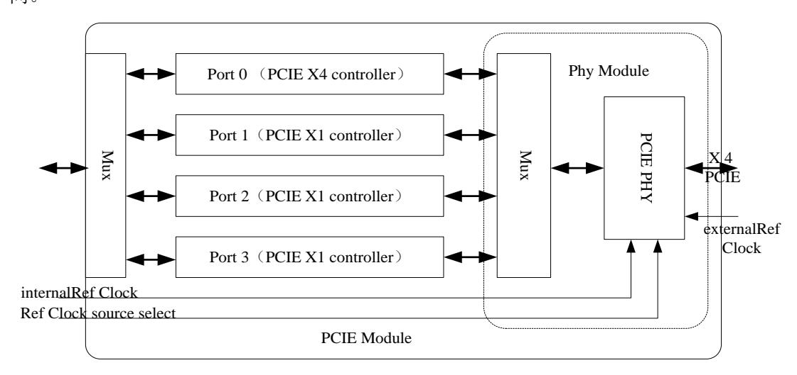

<span id="page-220-3"></span>图 33-1PCIE 控制器结构

## <span id="page-220-4"></span><span id="page-220-2"></span>33.2 访问地址

PCIE 控制器中每个端口有独立的配置头,其访问地址分别为:

| 设备          | 总线号 | 设备号 | 功能号   | 配置空间掩码 | 配置头访问首地址(64 位模式) | 备注                      |
|-------------|-----|-----|-------|--------|------------------|-------------------------|
| PCIE0 Port0 | 0x0 | 0x9 | 0x0/1 | 0xFFF  | 0xFE_0000_4800   | TYPE1<br>类型配            |
| PCIE0 Port1 | 0x0 | 0xA | 0x0/1 | 0xFFF  | 0xFE_0000_5000   | 置头,仅<br>有 64 位<br>BAR0, |
| PCIE0 Port2 | 0x0 | 0xB | 0x0/1 | 0xFFF  | 0xFE_0000_5800   | 用于访<br>问内部<br>寄存器。      |
| PCIE0 Port3 | 0x0 | 0xC | 0x0/1 | 0xFFF  | 0xFE_0000_6000   | 对功能<br>1 的访             |

203


| 设备          | 总线号 | 设备号 | 功能号   | 配置空间掩码 | 配置头访问首地址(64 位模式) | 备注                |
|-------------|-----|-----|-------|--------|------------------|-------------------|
| PCIE1 Port0 | 0x0 | 0xD | 0x0/1 | 0xFFF  | 0xFE_0000_6800   | 问用于<br>修改一<br>些只读 |
| PCIE1 Port1 | 0x0 | 0xE | 0x0/1 | 0xFFF  | 0xFE_0000_7000   | 寄存器。              |

PCIE 控制器内部寄存器的物理地址构成如下:

| 地址位     | 构成       | 备注                |
|---------|----------|-------------------|
| [63:12] | BAR_BASE | PCIE 控制器内 BAR0 配置 |
| [11:00] | REG      | 内部寄存器地址           |

## <span id="page-221-0"></span>**33.3**地址空间划分

龙芯 2K1000 中的 PCIE 控制器内有标准的 PCIE 配置头,因此 PCIE 控制器的内部寄存 器以及其下游设备的地址空间都通过其配置头的信息来管理。配置头中地址相关的寄存器在 PCI 设备扫描时确定。

因为 2K1000 的 PCIE 控制器仅可以工作在 RC 模式下,所以其配置头为 TYPE1 类型。

每个 PCIE 端口作为 2K1000 中的独立设备,每个端口都包含一个 PCIE 配置头。当 PCIE 工作在 X4 模式时,其他 X1 的端口软件不可见,只有当 PCIE 工作在 X1 模式时才可以访问 其他 X1 端口。

对于每一个 PCIE 端口,其地址空间可以分为以下几部分:

配置头地址空间:该部分空间对应 PCIE 的配置头,通过配置请求来访问,最大 8KB。 其中低 4KB 通过将配置请求的 func 设为 0 来访问,用于访问标准配置头;高 4KB 通过将配 置请求的 func 设为 1 来访问,用于改写标准配置头中的一些只读寄存器。

配置访问地址空间:该部分地址空间用于通过配置请求访问 PCIE 控制器的下游设备配 置头信息。根据下游设备的 Bus 号,由 PCIE 控制器决定发送 TYPE0 类型还是 TYPE1 类型 的配置访问。

以上两个地址空间的地址由配置地址空间基地址、BUS 号、设备号、功能号以及寄存 器偏移地址计算得出,访问以字为单位。

PCIE 控制器内部寄存器空间:该部分地址空间用于访问 PCIE 控制器的内部寄存器。 这些寄存器用于控制 PCIE 控制器的行为和特性,与 PCIE 配置头空间属于两个地址空间。 该地址空间为 MEM 类型,64 位地址空间,大小为 4KB,基地址等于 64 位 BAR0 的值,该 值在初始化时由 PCI 扫描软件分配。

MEM 地址空间:该部分地址空间包含了 PCIE 控制器下游设备的所有 MEM 地址空间。 对于 32 位地址空间,由 PCIE 配置头的 memory base 和 memory limit 决定;对于 64 位地址 空间,由 PCIE 配置头的 prefetchable memory base(组合 upper 32bits)和 prefetchable memory limit(组合 upper 32bits)决定。该段地址空间由 PCIE 配置头的 command 寄存器 bit1 位来


使能控制。

IO 地址空间:该部分地址空间包含了 PCIE 控制器下游设备的所有 IO 地址空间。由 PCIE 配置头的 io base(组合 upper 16bits)和 io limit(组合 upper 16bits)决定。该段地址空间由 PCIE 配置头的 command 寄存器 bit0 位来使能控制。

对于 MEM 地址空间和 IO 地址空间来说,如果在 X1 工作模式下,某个 X1 端口下游没 有连接设备,通过设置 command 寄存器的 bit0 和 bit1 为 0 即可禁用其 MEM 和 IO 地址空间。

## <span id="page-222-0"></span>**33.4**软件编程指南

#### <span id="page-222-1"></span>**33.4.1** PCIE 控制器使能

芯片配置寄存器中通用配置寄存器 2(表 [5-4](#page-54-2))bit16 和 bit17 控制两个 PCIE 控制器的使 能。在使用对应 PCIE 控制器时需要先将其使能才能访问该控制器以及下游设备的所有地址 空间,包括对控制器的配置访问。

#### <span id="page-222-2"></span>**33.4.2** PCIE 配置头访问

基于前文对配置请求的介绍,对 PCIE 配置头的访问为 Type0 的访问,其格式为:

|        | 39 | 32 31 | 28 | 27           | 24 23 |          | 16 15 |                  | 11 10              | 8 | 7 |             | 0 |
|--------|----|-------|----|--------------|-------|----------|-------|------------------|--------------------|---|---|-------------|---|
| Type 0 |    | FE0h  |    | Offset[11:8] |       | Reserved |       | Device<br>Number | Function<br>Number |   |   | Offset[7:0] |   |

PCIE 各个 Port 的设备号(device number)分别为 0x9,0xa,0xb,0xc,0xd,0xe。根 据设备号及所要访问的寄存器偏移地址(offset)即可得到对应寄存器的物理地址。功能号 Function Number 为 0 时访问配置头内寄存器,功能号 Function Number 为 1 时可以访问配置 头空间内影子寄存器,用于改写配置头内的只读寄存器。

#### <span id="page-222-3"></span>**33.4.3** PCIE 链路建立(Linkup)

链路建立流程如下:

- (1) 通过配置访问设置 Gen2 Control Register 寄存器中(0x80c)Directed Speed Change 为 1,PHY Tx Swing 为 0。注意配置地址格式,因为 offset 大于 8 位地址,需将高 4 位填到 bit24-bit27;
- (2) 通过配置访问配置好 PCIE 的 BAR0 寄存器;
- (3) 根 据 BAR0 中 配 的 地 址 通 过 MEM 访 问 设 置 PCIE 控 制 器 内 部 寄 存 器 app\_ltssm\_enable(0x0)为 1,开始 link training 过程;
- (4) 等待内部寄存器 Xmlh\_ltssm\_state(0xc)为 0x11;
- (5) Linkup 成功。


#### <span id="page-223-0"></span>**33.4.4** TYPE1 类型配置访问

TYPE1 类型配置请求地址格式如下:

|        | 39 | 32 31 | 28 | 27           | 24 23 |            | 16 15 |                  | 11 10              | 8 | 7 |             | 0 |
|--------|----|-------|----|--------------|-------|------------|-------|------------------|--------------------|---|---|-------------|---|
| Type 1 |    | FE1h  |    | Offset[11:8] |       | Bus Number |       | Device<br>Number | Function<br>Number |   |   | Offset[7:0] |   |

发送 TYPE1 类型配置访问之前需要设置配置头的 Primary Bus Number、Secondary Bus Numer 和 Subordinate Bus Number。然后直接按照 TYPE1 地址格式发送读写请求即可,PCIE 控制器根据地址中的 Bus Number 与所配置的 Secondary Bus Numer 和 Subordinate Bus Number 决定发出 TYPE0 类型还是 TYPE1 类型的配置请求。

如果 Bus Number==Secondary Bus Numer,则发出 TYPE0 类型的配置请求。

如果 Bus Number> Secondary Bus Numer 并且 Bus Number <= Subordinate Bus Number, 则发出 TYPE1 类型的配置请求。

#### <span id="page-223-1"></span>**33.4.5** PCIE PHY 配置方法

PCIE PHY 内部有一些可配置的寄存器,对这些寄存器的访问通过读写芯片配置寄存器 中 PCIE PHY 配置寄存器来实现,具体步骤如下:

对于写请求

- 1. 设置 phy\_cfg\_disable 为 0x0
- 2. 设置所要访问的寄存器地址 phy\_cfg\_addr
- 3. 将要写的数据写入 phy\_cfg\_data
- 4. 设置寄存器 phy\_cfg\_rw 为 1,开始写内部寄存器
- 5. 等待 phy\_cfg\_done 为 1
- 6. 写数据完成。

对于读请求

- 7. 设置 phy\_cfg\_disable 为 0x0
- 8. 设置所要访问的寄存器地址 phy\_cfg\_addr
- 9. 设置寄存器 phy\_cfg\_rw 为 0,开始从内部寄存器读数
- 10. 等待 phy\_cfg\_done 为 1
- 11. 从 phy\_cfg\_data 中读出数据。

## <span id="page-223-2"></span>**33.5**常用例程

本节给出龙芯 2K1000 的 PCIE 控制器的常用例程。龙芯 2K1000 需要先执行下面示例 中的 pcie\_link\_init,再执行下面示例中的 pcie\_header\_init。随后,龙芯 2K1000 可以通过 cfg\_device\_read 和 cfg\_device\_write 这两个函数对下游设备的 PCI Header 进行初始化。


```
unsigned int tmp_var;
unsigned int* cfg0_base = 0xfe00000000;
unsigned int* cfg1_base = 0xfe10000000;
unsigned int* mem_base = 0x9000000000000000;
void pcie_link_init(unsigned long bar,unsigned int dev_num, unsigned int func_num)
{
 unsigned longpcie_header_base = cfg0_base| (dev_num << 11)| (func_num <<8);
unsigned longpcie_reg_base = mem_base + bar;
// set port logic register of port 0
 // initiate speed change to PCIE Gen2 and set Tx to Low Swing
 tmp_var = *(volatile unsigned int *)(pcie_header_base + 0x80c);
 *(volatile unsigned int *)(pcie_header_base + 0x80c) = (tmp_var | 0x20000)&0xfffbffff;
 //start link training
 *(volatile unsigned int *)(pcie_reg_base) = 0xff200c;
 //wait link train end
 tmp_var = *(volatile unsigned int *)( pcie_reg_base +0xc);
 while((tmp_var&0x1f)!=0x11)
 {
 tmp_var = *(volatile unsigned int *)( pcie_reg_base +0xc);
 }
 printf("now PCIE port 0 link is start up\n");
}
void pcie_hot_reset(unsigned long bar)
{
unsigned longpcie_reg_base = mem_base + bar;
 tmp_var = *(volatile unsigned int *)( pcie_reg_base);
 //enable soft reset
 *(volatile unsigned int *)( pcie_reg_base) = tmp_var |0x1000;
 //triger hot reset
 *(volatile unsigned int *)( pcie_reg_base +0x4) = 0x4;
}
void pcie_header_init(unsigned long bar,unsigned int dev_num, unsigned int func_num, unsigned 
int io_base, unsigend int io_limit, unsigned int mem_base, unsigned int mem_limit, unsigned int 
pref_mem_base, unsigned int pref_mem_limit, unsigned pref_mem_base_upper32, unsigned int 
pref_mem_limit_upper32)
{//only used in RC mode
unsigned longpcie_header_base = cfg0_base| (dev_num << 11)| (func_num <<8);
unsigned longpcie_reg_base = mem_base + bar;
 //set master enable, io enable, mem enable, perr enable, serr enable
 *(volatile unsigned int *)( pcie_header_base + 0x4) = 0x147;
 //clear master abort, serr and perr status
//set IO space to be 16-bit address
//set 64 KB IO space: 0x0000 ~ 0xffff
*(volatile unsigned int *)( pcie_header_base + 0x1c) = 0xf100f000;
 //set IO limit and IO base up 16 bit address
 *(volatile unsigned int *)( pcie_header_base + 0x30) = 0x0;
//set memory limit and memory base
```


```
 *(volatile unsigned int *)( pcie_header_base + 0x20) = 0x17f00000;
 //set prefetchable memory limit and base
 *(volatile unsigned int *)( pcie_header_base + 0x24) = 0x7ff04000;
 //set prefetchable base up 32 bit
 *(volatile unsigned int *)( pcie_header_base + 0x28) = pref_mem_base_upper32;
 //set prefetchable limit up 32 bit
 *(volatile unsigned int *)( pcie_header_base + 0x2c) = pref_mem_limit_upper32;
 //enable serr
 *(volatile unsigned int *)( pcie_header_base + 0x3c) = 0x20000;
 //enable system error on correctalbe error, non-fatal error and fatal error
 //enable PME interrupt
 *(volatile unsigned int *)( pcie_header_base + 0x8c) = 0xf;
 //enable correctalbe error, non-fatal error and fatal error
 *(volatile unsigned int *)( pcie_header_base + 0x12c) = 0x7;
 //enable ASPM L0s and L1
 *(volatile unsigned char *)( pcie_header_base + 0x80) = 0x3;
}
void cfg_device_read(
unsigned int bus_num,
unsigned int dev_num, unsigned int func_num,
unsigned int reg_id, unsigned int * read_data
 )
{
unsigned longpcie_header_base = cfg1_base| (bus_num << 16) | (dev_num << 11)| (func_num 
<<8);
 *(read_data) = *(volatile unsigned int *)( pcie_header_base + (reg_id<<2));
}
void cfg_device_write(
unsigned int bus_num,
unsigned int dev_num, unsigned int func_num,
unsigned int reg_id, unsigned int write_data
 )
{
unsigned longpcie_header_base = cfg1_base| (bus_num << 16) | (dev_num << 11)| (func_num 
<<8);
 *(volatile unsigned int *)( pcie_header_base + (reg_id<<2)) = write_data;
}
```


## <span id="page-226-0"></span>**34 DMA** 控制器(**Dev F**)

## <span id="page-226-1"></span>**34.1 DMA** 控制器结构描述

龙芯 2K1000 中 DMA 用来实现内存与 APB 设备之间数据搬移,可以节省资源提高系 统数据传输的效率。

DMA 的传送数据的过程由三个阶段组成:

- a) 传送前的预处理:由 CPU 配置 DMA 描述符相关的寄存器。
- b) 数据传送:在 DMA 控制器的控制下自动完成。
- c) 传送结束处理:发送中断请求。

本 DMA 控制器是一个基于 AXI 总线的单通道、可配置的 DMA 控制器 IP 核,主要功 能就是在芯片上集成了 DMA 功能,专门负责在内存与 APB 设备间搬运数据。本 DMA 控 制器限定为以字(4Byte)为单位的数据搬运。

CPU 通过一个通用寄存器(dma\_order)向 DMA 发命令。DMA 根据命令内容,从内 存读取描述符启动 DMA 直接操作,或者将 DMA 状态写入内存,或者停止 DMA。

dma\_order 寄存器为芯片配置寄存器,在 [5.25](#page-73-1) 节有介绍,下表列出相同内容,方便查 看。

| 位域   | 名称             | 访问  | 缺省值 | 描述                              |
|------|----------------|-----|-----|---------------------------------|
| 63:5 | ask_addr       | R/W | 0   | 64 位地址的高 59 位                   |
| 5    | -              | -   | 0   | 保留                              |
| 4    | dma_stop       | R/W | 0   | 停止 DMA 操作。DMA 控制器完成当前数          |
|      |                |     |     | 据读写后停止。                         |
| 3    | dma_start      | R/W | 0   | 开始 DMA 操作。DMA 控制器读取描述符          |
|      |                |     |     | 地址(ask_addr)后将些位清零。             |
| 2    | ask_valid      | R/W | 0   | DMA 工作寄存器写回到(ask_addr)所指向的      |
|      |                |     |     | 内存,完成后清零。                       |
| 1    | axi_uncoherent | R/W | 0   | DMA 访问地址非一致性使能,设置为 1 代          |
|      |                |     |     | 表 uncache 访问,设置为 0 代表 cache 访问。 |
| 0    | dma_64bit      | R/W | 0   | DMA 控制器 64 位地址支持                |

<span id="page-226-3"></span>表 34-1DMA ORDER 寄存器

## <span id="page-226-2"></span>**34.2**访问地址

2K1000 的 Device F 为 DMA 控制器,其配置空间基本信息如下:

| 设备  | 总线号 | 设备号 | 功能号 | 配置空<br>间掩码 | 配置头访问首地址(64<br>位模式) | 备注 |
|-----|-----|-----|-----|------------|---------------------|----|
| DMA | 0x0 | 0xF | 0x0 | 0xFF       | 0xFE_0000_7800      |    |

DMA 控制器内部寄存器的物理地址构成如下:


| 地址位     | 构成       | 备注                       |
|---------|----------|--------------------------|
| [63:08] | BAR_BASE | Device F、FUNC 0 的基地址寄存器值 |
| [07:00] | REG      | 内部寄存器地址                  |

## <span id="page-227-0"></span>**34.3 DMA** 控制器与 **APB** 设备的交互

2K1000 中包含 5 个 DMA 控制器,使用 DMA 的 APB 设备包括 NAND、I2S、SDIO 以 及加解密模块。其中 NAND 和 SDIO 各需要一个 DMA 控制器,而 I2S、加密模块、解密模 块各需要两个 DMA 控制器分别控制 DMA 写操作和 DMA 读操作。根据应用场景不同,需 要通过芯片配置寄存器来设置 APB 设备使用哪个 DMA 控制器。

另外,2K1000 的 DMA 控制器支持 64 位地址空间,这主要通过 dma\_order[0]来控制, 当该位设置为 1 时表示 DMA 控制器工作在 64 位地址空间,反之为 32 位地址空间。在 64 位地址模式下,需要扩展 DMA\_ORDER\_ADDR 和 DMA\_SADDR 为 64 位寄存器。

## <span id="page-227-1"></span>**34.4 DMA** 描述符

#### <span id="page-227-2"></span>**34.4.1** DMA\_ORDER\_ADDR\_LOW

中文名:下一个描述符低位地址寄存器

寄存器位宽: [31:0]

偏移地址: 0x0

复位值: 0x00000000

| 位域   | 位域名称           | 位宽 | 访问  | 描述                      |
|------|----------------|----|-----|-------------------------|
| 31:1 | dma_order_addr | 31 | R/W | 存储器内部下一描述符地址寄存器(低 32 位) |
| 0    | Dma_order_en   | 1  | R/W | 描述符是否有效信号               |

说明:存储下一个 DMA 描述符的地址,dma\_order\_en 是下个 DMA 描述符的使能位, 如果该位为 1 表示下个描述符有效,该位为 0 表示下个描述符无效,不执行操作,地址 16 字节对齐。在配置 DMA 描述符时,该寄存器存放的是下个描述符的地址,执行完该次 DMA 操作后,通过判断 dma\_order\_en 信号确定是否开始下次 DMA 操作。在 64 位地址模式下, 该寄存器存储低 32 位地址。

#### <span id="page-227-3"></span>**34.4.2** DMA\_SADDR

中文名:内存低位地址寄存器

寄存器位宽: [31:0]

偏移地址: 0x4

复位值: 0x00000000

| 位域   | 位域名称      | 位宽 | 访问  | 描述                  |
|------|-----------|----|-----|---------------------|
| 31:0 | dma_saddr | 32 | R/W | DMA 操作的内存地址(低 32 位) |

说明:DMA 操作分为:从内存中读数据,保存在 DMA 控制器的缓存中,由 APB 发 请求来访问 DMA 缓存中的数据,该寄存器指定了读 ddr3 的地址;从 APB 设备读数据保存

210


在 DMA 缓存中,当 DMA 缓存中的字超过一定数目,就往内存中写,该寄存器指定了写内 存的地址。在 64 位地址模式下,该寄存器存储低 32 位地址。

#### <span id="page-228-0"></span>**34.4.3** DMA\_DADDR

中文名:设备地址寄存器

寄存器位宽: [31:0]

偏移地址: 0x8

复位值: 0x00000000

| 位域    | 位域名称      | 位宽 | 访问  | 描述               |
|-------|-----------|----|-----|------------------|
| 31    |           | 1  | R/W | 保留               |
| 30    |           | 1  | R/W | 保留               |
| 29:28 |           | 2  | R/W | 保留               |
| 27:0  | dma_daddr | 28 | R/W | DMA 操作的 APB 设备地址 |

说明:从内存中读数据,保存在 DMA 控制器的缓存中,由 APB 发请求来访问 DMA 缓存中的数据,该寄存器指定了写 APB 设备的地址;从 APB 设备读数据保存在 DMA 缓存 中,当 DMA 缓存中的字超过一定数目,就往内存中写,该寄存器指定了读 APB 设备的地 址。使用 DMA 的 APB 设备都有对应的数据 buffer 地址,比如 NAND 控制器的数据 buffer 偏移地址为 0x40,默认的设备地址就可以配置成 0x1fe06040。

#### <span id="page-228-1"></span>**34.4.4** DMA\_LENGTH

中文名:长度寄存器

寄存器位宽: [31:0]

偏移地址: 0xc

复位值: 0x00000000

| 位域   | 位域名称       | 位宽 | 访问  | 描述        |
|------|------------|----|-----|-----------|
| 31:0 | dma_length | 32 | R/W | 传输数据长度寄存器 |

说明:代表一块被搬运内容的长度,单位是字。当搬运完 length 长度的字之后,开始 下个 step 即下一个循环。开始新的循环,则再次搬运 length 长度的数据。当 step 变为 1,单 个 DMA 描述符操作结束,开始读下个描述符。

#### <span id="page-228-2"></span>**34.4.5** DMA\_STEP\_LENGTH

中文名:间隔长度寄存器

寄存器位宽: [31:0]

偏移地址: 0x10

复位值: 0x00000000

| 位域   | 位域名称            | 位宽 | 访问  | 描述          |
|------|-----------------|----|-----|-------------|
| 31:0 | dma_step_length | 32 | R/W | 数据传输间隔长度寄存器 |

说明:间隔长度说明两块被搬运内存数据块之间的长度,前一个 step 的结束地址与后 一个 step 的开始地址之间的间隔。


#### <span id="page-229-0"></span>**34.4.6** DMA\_STEP\_TIMES

中文名:循环次数寄存器

寄存器位宽: [31:0]

偏移地址: 0x14

复位值: 0x00000000

| 位域   | 位域名称           | 位宽 | 访问  | 描述          |
|------|----------------|----|-----|-------------|
| 31:0 | dma_step_times | 32 | R/W | 数据传输循环次数寄存器 |

说明:循环次数说明在一次 DMA 操作中需要搬运的块的数目。如果只想搬运一个连 续的数据块,循环次数寄存器的值可以赋值为 1。

#### <span id="page-229-1"></span>**34.4.7** DMA\_CMD

中文名:控制寄存器

寄存器位宽: [31:0]

偏移地址: 0x18

复位值: 0x00000000

| 位域    | 位域名称                  | 位宽 | 访问  | 描述                                        |
|-------|-----------------------|----|-----|-------------------------------------------|
| 14:13 | Dma_cmd               | 2  | R/W | 源、目的地址生成方式                                |
| 12    | dma_r_w               | 1  | R/W | DMA 操作类型,"1"为读 ddr3 写设备,"0"<br>为读设备写 ddr3 |
| 11:8  | dma_write_state       | 4  | R/W | DMA 写数据状态                                 |
| 7:4   | dma_read_state        | 4  | R/W | DMA 读数据状态                                 |
| 3     | dma_trans_over        | 1  | R/W | DMA 执行完被配置的所有描述符操作                        |
| 2     | dma_single_trans_over | 1  | R/W | DMA 执行完一次描述符操作                            |
| 1     | dma_int               | 1  | R/W | DMA 中断信号                                  |
| 0     | dma_int_mask          | 1  | R/W | DMA 中断是否被屏蔽掉                              |

说明:dma\_single\_trans\_over=1 指一次 DMA 操作执行结束,此时 length=0 且 step\_times=1,开始取下个 DMA 操作的描述符。下个 DMA 操作的描述符地址保存在 DMA\_ORDER\_ADDR 寄存器中,如果DMA\_ORDER\_ADDR 寄存器中dma\_order\_en=0,则 dma\_trans\_over=1,整个 dma 操作结束,没有新的描述符要读;如果 dma\_order\_en=1,则 dma\_trans\_over 置为 0,开始读下个 dma 描述符。dma\_int 为 DMA 的中断,如果没有中断屏 蔽,在一次配置的 DMA 操作结束后发生中断。CPU 处理完中断后可以直接将其置低,也 可以等到 DMA 进行下次传输时自动置低。dma\_int\_mask 为对应 dma\_int 的中断屏蔽。 dma\_read\_state 说明了 DMA 当前的读状态。dma\_write\_state 说明了 DMA 当前的写状态。

DMA 写状态(WRITE\_STATE[3:0])描述,DMA 包括以下几个写状态:

| Write_state        | ]3:0[ | 描述         |  |  |  |
|--------------------|-------|------------|--|--|--|
| Write_idle<br>4'h0 |       | 写状态正处于空闲状态 |  |  |  |


| W_ddr_wait     | 4'h1 | Dma 判断需要执行读设备写内存操作,并发起写内存请求,但是内存还<br>没准备好响应请求,因此 dma 一直在等待内存的响应 |
|----------------|------|-----------------------------------------------------------------|
| Write_ddr      | 4'h2 | 内存接收了 dma 写请求,但是还没有执行完写操作                                       |
| Write_ddr_end  | 4'h3 | 内存接收了 dma 写请求,并完成写操作,此时 dma 处于写内存操作完<br>成状态                     |
| Write_dma_wait | 4'h4 | Dma 发出将 dma 状态寄存器写回内存的请求,等待内存接收请求                               |
| Write_dma      | 4'h5 | 内存接收写 dma 状态请求,但是操作还未完成                                         |
| Write_dma_end  | 4'h6 | 内存完成写 dma 状态操作                                                  |
| Write_step_end | 4'h7 | Dma 完成一次 length 长度的操作(也就是说完成一个 step)                            |

#### DMA 读状态(READ\_STATE[3:0])描述,DMA 包括以下几个读状态:

|      | 描述                                     |
|------|----------------------------------------|
|      |                                        |
| 4'h0 | 读状态正处于空闲状态                             |
| 4'h1 | 接收到开始 dma 操作的 start 信号后,进入准备好状态,开始读描述符 |
| 4'h2 | 向内存发出读描述符请求,等待内存应答                     |
| 4'h3 | 内存接收读描述符请求,正在执行读操作                     |
| 4'h4 | 内存读完 dma 描述符                           |
| 4'h5 | Dma 向内存发出读数据请求,等待内存应答                  |
| 4'h6 | 内存接收 dma 读数据请求,正在执行读数据操作               |
| 4'h7 | 内存完成 dma 的一次读数据请求                      |
| 4'h8 | Dma 进入读设备状态                            |
| 4'h9 | 设备返回读数据,结束此次读设备请求                      |
| 4'ha | 结束一次 step 操作,step times 减 1            |
|      | ]3:0[                                  |

#### <span id="page-230-0"></span>**34.4.8** DMA\_ORDER\_ADDR\_HIGH

中文名:下一个描述符高位地址寄存器

寄存器位宽: [31:0]

偏移地址: 0x20

复位值: 0x00000000

| 位域   | 位域名称           | 位宽 | 访问  | 描述                       |
|------|----------------|----|-----|--------------------------|
| 31:0 | dma_order_addr | 32 | R/W | 存储器内部下一个描述符地址寄存器(高 32 位) |

#### <span id="page-230-1"></span>**34.4.9** DMA\_SADDR\_HIGH

中文名:内存高位地址寄存器

寄存器位宽: [31:0]

偏移地址: 0x24

复位值: 0x00000000

| 位域   | 位域名称      | 位宽 | 访问  | 描述                  |
|------|-----------|----|-----|---------------------|
| 31:0 | dma_saddr | 32 | R/W | DMA 操作的内存地址(高 32 位) |


## <span id="page-231-0"></span>**35 VPU** 控制器(**Dev 16**)

## <span id="page-231-1"></span>**35.1**访问地址

2K1000 的 Device 16 为 VPU 控制器,其配置空间基本信息如下:

| 设备  | 总线号 | 设备号  | 功能号 | 配置空间掩码 | 配置头访问首地址(64 位模式) | 备注 |
|-----|-----|------|-----|--------|------------------|----|
| VPU | 0x0 | 0x10 | 0x0 | 0x1_FF | 0xFE_0000_8000   |    |

VPU 内部寄存器的物理地址构成如下:

| 地址位     | 构成       | 备注                        |
|---------|----------|---------------------------|
| [63:09] | BAR_BASE | Device 16、FUNC 0 的基地址寄存器值 |
| [08:00] | REG      | 内部寄存器地址                   |


## <span id="page-232-0"></span>**36 CAMERA** 接口控制器(**Dev 17**)

## <span id="page-232-1"></span>**36.1**功能概述

Camera Interface 模块是视频输入转换存储模块。实现了将 Camera 捕捉到的数据进行 转换、并通过 DMA 存储到 memory 中。该模块支持 ITU-R BT 601/656 8-bit 模式,仅支持 YUV 格式输入。可以将 camera 产生的 YUV 三种颜色信号经打包成组后分别由 DMA 方式 传输到 ESRAM 中的三片存储区。该设备支持图像的镜像和翻转,以便适应手持式设备在 移动环境中图像的捕捉。可变的同步信号极性使得可以兼容各种摄像头外设。

## <span id="page-232-2"></span>**36.2**访问地址

2K1000 的 Device 17 为 CAMERA 接口控制器,其配置空间基本信息如下:

| 设备     | 总线号 | 设备号  | 功能号 | 配置空<br>间掩码 | 配置头访问首地址(64<br>位模式) | 备注 |
|--------|-----|------|-----|------------|---------------------|----|
| CAMERA | 0x0 | 0x11 | 0x0 | 0xFF       | 0xFE_0000_8800      |    |

#### CAMERA 控制器内部寄存器的物理地址构成如下:

| 地址位     | 构成       | 备注                        |  |  |  |  |  |
|---------|----------|---------------------------|--|--|--|--|--|
| [63:08] | BAR_BASE | Device 11、FUNC 0 的基地址寄存器值 |  |  |  |  |  |
| [07:00] | REG      | 内部寄存器地址                   |  |  |  |  |  |